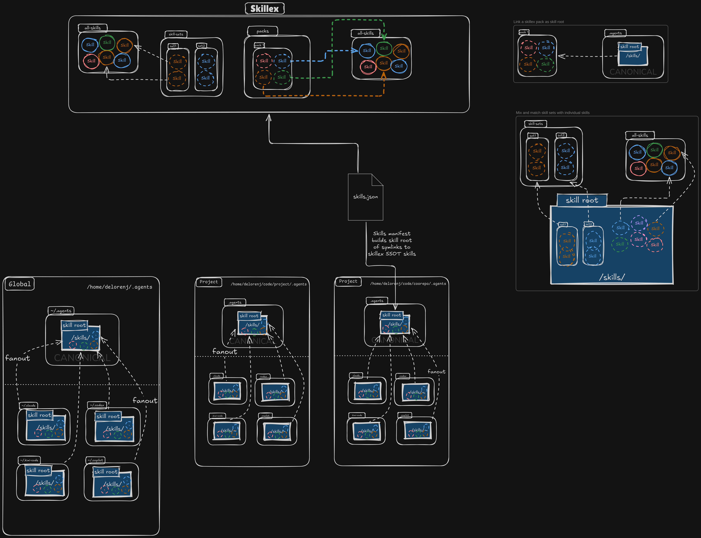

# Skillex

CLI-agnostic skill package manager. Define every skill once, compose it by reference, and expose the same activation root to every agentic CLI.

**Status:** MVP in progress. See `docs/prd/skillex-mvp.md` and `docs/plan/skillex-mvp-plan.md`.

## Architecture

[](architecture.excalidraw)

The accepted ownership contract is
[ADR-0001](docs/architecture/ADR-0001-reference-only-skill-topology.md):

- `all-skills/` is the only writable skill-definition root.
- skill sets and agentpacks are reference-only compositions; packs may own
  metadata, hooks, commands, and pack-level support assets, but no `SKILL.md`.
- each scope exposes one `.agents/skills` activation root.
- CLI-specific skill roots are directory-level aliases to that activation root.

Audit the live repository without changing it:

```bash
uv run skillex topology check --root .
uv run skillex topology check --root . --sources-only --json
```

The current migration backlog is recorded in
[docs/architecture/topology-migration.md](docs/architecture/topology-migration.md).

## Vendoring external skill repositories

A skill authored in another repository can be *vendored* into `all-skills/` as
real, committed content pinned to a version, so the catalog resolves on every
machine while authoring stays where it belongs. See
[docs/VENDORING.md](docs/VENDORING.md).

```bash
uv run skillex vendor list             # declared sources and where they resolve here
uv run skillex vendor sync -n          # plan; writes nothing
uv run skillex vendor status           # verify the catalog against its own pins, offline
```

Nothing is ever cloned or fetched: sources are read from a local checkout's git
objects, and a version that is not present is a refusal carrying the `git fetch`
to run.

## Experimental: BMAD HTML Workspace Skill

This repo now includes an experimental skill scaffold at `skills/bmad-html-workspace/` for teams that want a single-file HTML "project cockpit" instead of fragmented Markdown outputs.

Start with:

- `skills/bmad-html-workspace/SKILL.md`
- `skills/bmad-html-workspace/references/app-model.md`
- `skills/bmad-html-workspace/templates/workspace.template.html`
