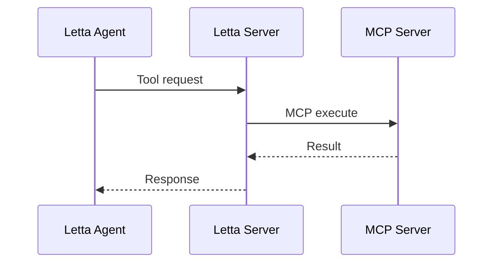
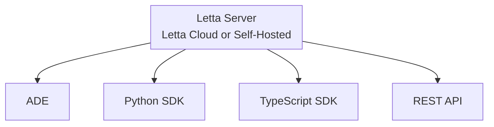
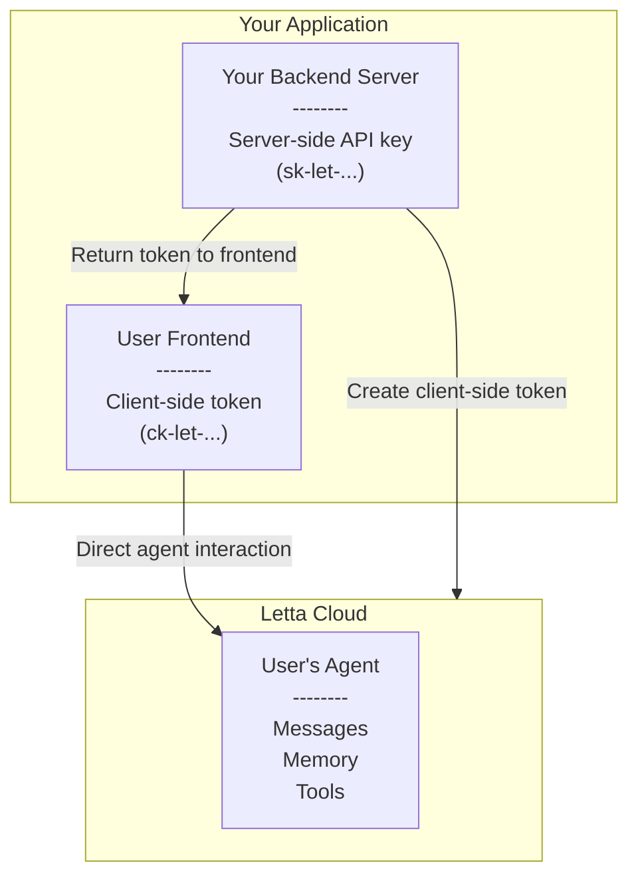

# Letta - Api Sdk

**Pages:** 42

---

## If LETTA_SERVER_PASSWORD isn't set, the server will autogenerate a password

**URL:** llms-txt#if-letta_server_password-isn't-set,-the-server-will-autogenerate-a-password

**Contents:**
- Tool sandboxing

docker run \
  -v ~/.letta/.persist/pgdata:/var/lib/postgresql/data \
  -p 8283:8283 \
  --env-file .env \
  -e SECURE=true \
  -e LETTA_SERVER_PASSWORD=yourpassword \
  letta/letta:latest
typescript TypeScript maxLines=50
  // install letta-client with `npm install @letta-ai/letta-client`
  import { LettaClient } from '@letta-ai/letta-client'

// create the client with the token set to your password
  const client = new LettaClient({
      baseUrl: "http://localhost:8283",
      token: "yourpassword"
  });
  python title="python" maxLines=50
  # install letta_client with `pip install letta-client`
  from letta_client import Letta

# create the client with the token set to your password
  client = Letta(
    base_url="http://localhost:8283",
    token="yourpassword"
  )
  curl curl
  curl --request POST \
    --url http://localhost:8283/v1/agents/$AGENT_ID/messages \
    --header 'Content-Type: application/json' \
    --header 'Authorization: Bearer yourpassword' \
    --data '{
    "messages": [
      {
        "role": "user",
        "text": "hows it going????"
      }
    ]
  }'
  ```
</CodeGroup>

To enable tool sandboxing, set the `E2B_API_KEY` and `E2B_SANDBOX_TEMPLATE_ID` environment variables (via [E2B](https://e2b.dev/)) when you use `docker run`.
When sandboxing is enabled, all custom tools (created by users from source code) will be executed in a sandboxed environment.

This does not include MCP tools, which are executed outside of the Letta server (on the MCP server itself), or built-in tools (like `memory_insert`), whose code cannot be modified after server startup.

**Examples:**

Example 1 (unknown):
```unknown
With password protection enabled, you will have to provide your password in the bearer token header in your API requests:

<CodeGroup>
```

Example 2 (unknown):
```unknown

```

Example 3 (unknown):
```unknown

```

---

## Create token  (Cloud-only)

**URL:** llms-txt#create-token--(cloud-only)

**Contents:**
- OpenAPI Specification
- SDK Code Examples

POST https://api.letta.com/v1/client-side-access-tokens
Content-Type: application/json

Create a new client side access token with the specified configuration.

Reference: https://docs.letta.com/api-reference/client-side-access-tokens/create

## OpenAPI Specification

**Examples:**

Example 1 (yaml):
```yaml
openapi: 3.1.1
info:
  title: Create token  (Cloud-only)
  version: endpoint_clientSideAccessTokens.create
paths:
  /v1/client-side-access-tokens:
    post:
      operationId: create
      summary: Create token  (Cloud-only)
      description: Create a new client side access token with the specified configuration.
      tags:
        - - subpackage_clientSideAccessTokens
      parameters:
        - name: Authorization
          in: header
          description: Header authentication of the form `Bearer <token>`
          required: true
          schema:
            type: string
      responses:
        '201':
          description: '201'
          content:
            application/json:
              schema:
                $ref: >-
                  #/components/schemas/client_side_access_tokens_create_Response_201
        '400':
          description: '400'
          content: {}
      requestBody:
        description: Body
        content:
          application/json:
            schema:
              type: object
              properties:
                policy:
                  type: array
                  items:
                    $ref: >-
                      #/components/schemas/V1ClientSideAccessTokensPostRequestBodyContentApplicationJsonSchemaPolicyItems
                hostname:
                  type: string
                  format: uri
                expires_at:
                  type: string
              required:
                - policy
                - hostname
components:
  schemas:
    V1ClientSideAccessTokensPostRequestBodyContentApplicationJsonSchemaPolicyItemsOneOf0Type:
      type: string
      enum:
        - value: agent
    V1ClientSideAccessTokensPostRequestBodyContentApplicationJsonSchemaPolicyItemsOneOf0AccessItems:
      type: string
      enum:
        - value: read_messages
        - value: write_messages
        - value: read_agent
        - value: write_agent
    V1ClientSideAccessTokensPostRequestBodyContentApplicationJsonSchemaPolicyItems0:
      type: object
      properties:
        type:
          $ref: >-
            #/components/schemas/V1ClientSideAccessTokensPostRequestBodyContentApplicationJsonSchemaPolicyItemsOneOf0Type
        id:
          type: string
        access:
          type: array
          items:
            $ref: >-
              #/components/schemas/V1ClientSideAccessTokensPostRequestBodyContentApplicationJsonSchemaPolicyItemsOneOf0AccessItems
      required:
        - type
        - id
        - access
    V1ClientSideAccessTokensPostRequestBodyContentApplicationJsonSchemaPolicyItems:
      oneOf:
        - $ref: >-
            #/components/schemas/V1ClientSideAccessTokensPostRequestBodyContentApplicationJsonSchemaPolicyItems0
    V1ClientSideAccessTokensPostResponsesContentApplicationJsonSchemaPolicyVersion:
      type: string
      enum:
        - value: '1'
    V1ClientSideAccessTokensPostResponsesContentApplicationJsonSchemaPolicyDataItemsOneOf0Type:
      type: string
      enum:
        - value: agent
    V1ClientSideAccessTokensPostResponsesContentApplicationJsonSchemaPolicyDataItemsOneOf0AccessItems:
      type: string
      enum:
        - value: read_messages
        - value: write_messages
        - value: read_agent
        - value: write_agent
    V1ClientSideAccessTokensPostResponsesContentApplicationJsonSchemaPolicyDataItems0:
      type: object
      properties:
        type:
          $ref: >-
            #/components/schemas/V1ClientSideAccessTokensPostResponsesContentApplicationJsonSchemaPolicyDataItemsOneOf0Type
        id:
          type: string
        access:
          type: array
          items:
            $ref: >-
              #/components/schemas/V1ClientSideAccessTokensPostResponsesContentApplicationJsonSchemaPolicyDataItemsOneOf0AccessItems
      required:
        - type
        - id
        - access
    V1ClientSideAccessTokensPostResponsesContentApplicationJsonSchemaPolicyDataItems:
      oneOf:
        - $ref: >-
            #/components/schemas/V1ClientSideAccessTokensPostResponsesContentApplicationJsonSchemaPolicyDataItems0
    V1ClientSideAccessTokensPostResponsesContentApplicationJsonSchemaPolicy:
      type: object
      properties:
        version:
          $ref: >-
            #/components/schemas/V1ClientSideAccessTokensPostResponsesContentApplicationJsonSchemaPolicyVersion
        data:
          type: array
          items:
            $ref: >-
              #/components/schemas/V1ClientSideAccessTokensPostResponsesContentApplicationJsonSchemaPolicyDataItems
      required:
        - version
        - data
    client_side_access_tokens_create_Response_201:
      type: object
      properties:
        policy:
          $ref: >-
            #/components/schemas/V1ClientSideAccessTokensPostResponsesContentApplicationJsonSchemaPolicy
        token:
          type: string
        hostname:
          type: string
        expiresAt:
          type: string
      required:
        - policy
        - token
        - hostname
        - expiresAt
```

Example 2 (python):
```python
from letta_client import Letta
from letta_client.client_side_access_tokens import (
    ClientSideAccessTokensCreateRequestPolicyItem,
)

client = Letta(
    project="YOUR_PROJECT",
    token="YOUR_TOKEN",
)
client.client_side_access_tokens.create(
    policy=[
        ClientSideAccessTokensCreateRequestPolicyItem(
            id="id",
            access=["read_messages"],
        )
    ],
    hostname="hostname",
)
```

Example 3 (typescript):
```typescript
import { LettaClient } from "@letta-ai/letta-client";

const client = new LettaClient({ token: "YOUR_TOKEN", project: "YOUR_PROJECT" });
await client.clientSideAccessTokens.create({
    policy: [{
            type: "agent",
            id: "id",
            access: ["read_messages"]
        }],
    hostname: "hostname"
});
```

Example 4 (go):
```go
package main

import (
	"fmt"
	"strings"
	"net/http"
	"io"
)

func main() {

	url := "https://api.letta.com/v1/client-side-access-tokens"

	payload := strings.NewReader("{\n  \"policy\": [\n    {\n      \"type\": \"agent\",\n      \"id\": \"string\",\n      \"access\": [\n        \"read_messages\"\n      ]\n    }\n  ],\n  \"hostname\": \"string\"\n}")

	req, _ := http.NewRequest("POST", url, payload)

	req.Header.Add("Authorization", "Bearer <token>")
	req.Header.Add("Content-Type", "application/json")

	res, _ := http.DefaultClient.Do(req)

	defer res.Body.Close()
	body, _ := io.ReadAll(res.Body)

	fmt.Println(res)
	fmt.Println(string(body))

}
```

---

## Prompts for Vibecoding

**URL:** llms-txt#prompts-for-vibecoding

**Contents:**
- General instructions for the Letta SDKs

> Ready-to-go prompts to help AI coding tools build on Letta

Are you developing an application on Letta using [ChatGPT](https://chatgpt.com), [Cursor](https://cursor.com), [Lovable](https://lovable.dev/), or another AI tool?
Use our pre-made prompts to teach your AI how to use Letta properly.

## General instructions for the Letta SDKs

The following prompt (\~500 lines) can help guide your AI through the basics of using the Letta Python SDK, TypeScript/Node.js SDK, and Vercel AI SDK integration.

Copy-paste the following into your chat session to instantly get your AI up-to-speed with how the Letta SDKs works:

````markdown maxLines=5

---

## Client meeting

**URL:** llms-txt#client-meeting

/switch client-project
"What were the three main concerns from our last meeting?"

---

## Create agent with memory blocks

**URL:** llms-txt#create-agent-with-memory-blocks

agent = client.agents.create(
    memory_blocks=[
        {
            "label": "human",
            "value": "The user's name is Sarah. She likes coding and AI."
        },
        {
            "label": "persona",
            "value": "I am David, the AI executive assistant. My personality is friendly, professional, and to the point."
        },
        {
            "label": "project",
            "value": "Sarah is working on a Next.js application with Letta integration.",
            "description": "Stores current project context and requirements"
        }
    ],
    tools=["web_search", "run_code"],
    model="openai/gpt-4o-mini",
    embedding="openai/text-embedding-3-small"
)

---

## February 23, 2025

**URL:** llms-txt#february-23,-2025

**Contents:**
- Core Memory and Archival Memory SDK APIs Renamed to Blocks and Passages

## Core Memory and Archival Memory SDK APIs Renamed to Blocks and Passages

<Note>
   This is a breaking SDK change and is not backwards compatible. 
</Note>

Given the confusion around our advanced functionality for managing memory, we've renamed the Core Memory SDK API to `blocks` and the Archival Memory SDK API to `passages` so that our API naming reflects the unit of memory stored. This change only affects our SDK, and does not affect Letta's Rest API.

**Examples:**

Example 1 (unknown):
```unknown

```

Example 2 (unknown):
```unknown
</CodeBlocks>

#### After

<CodeBlocks>
```

Example 3 (unknown):
```unknown

```

---

## Development Guidelines for AI Assistants and Copilots using Letta

**URL:** llms-txt#development-guidelines-for-ai-assistants-and-copilots-using-letta

**Contents:**
- **0. Letta Overview**
- **1. Letta Agents API Overview**
  - **System Components:**
  - **Letta Cloud vs Self-hosted Letta**
  - **Built-in Tools**
  - **Choosing the Right Model**
- **2. Choosing the Right SDK**
  - **Source of Truth**
  - **When to Use Each SDK:**
- **3. Quick Setup Patterns**

**Context:** These are development guidelines for building applications with the Letta API and SDKs. Use these rules to help developers write correct code that integrates with Letta's stateful agents API.

**Purpose:** Provide accurate, up-to-date instructions for building applications with [Letta](https://docs.letta.com/), the AI operating system.
**Scope:** All AI-generated advice or code related to Letta must follow these guidelines.

## **0. Letta Overview**

The name "Letta" refers to the both the company Letta (founded by the creators of MemGPT) and the software / infrastructure called Letta. Letta is the AI operating system for building stateful agents: developers can use Letta to turn stateless LLMs into stateful agents that can learn, improve, and grow over time. Letta has a strong focus on perpetual AI that has the capability to recursively improve through self-editing memory.

**Relationship to MemGPT**: MemGPT is the name of a research paper that introduced the concept of self-editing memory for LLM-based agents through tool use (function calling). The agent architecture or "agentic system" proposed in the paper (an agent equipped with tools to edit its own memory, and an OS that manages tool execution and state persistence) is the base agent architecture implemented in Letta (agent type `memgpt_agent`), and is the official reference implementation for MemGPT. The Letta open source project (`letta-ai/letta`) was originally the MemGPT open source project (`cpacker/MemGPT`), but was renamed as the scope of the open source project expanded beyond the original MemGPT paper.

**Additional Resources**:
- [Letta documentation](https://docs.letta.com/)
- [Letta GitHub repository](https://github.com/letta-ai/letta)
- [Letta Discord server](https://discord.gg/letta)
- [Letta Cloud and ADE login](https://app.letta.com)

## **1. Letta Agents API Overview**

Letta is an AI OS that runs agents as **services** (it is not a **library**). Key concepts:

- **Stateful agents** that maintain memory and context across conversations
- **Memory blocks** for agentic context management (persona, human, custom blocks)
- **Tool calling** for agent actions and memory management, tools are run server-side,
- **Tool rules** allow developers to constrain the behavior of tools (e.g. A comes after B) to turn autonomous agents into workflows
- **Multi-agent systems** with cross-agent communication, where every agent is a service
- **Data sources** for loading documents and files into agent memory
- **Model agnostic:** agents can be powered by any model that supports tool calling
- **Persistence:** state is stored (in a model-agnostic way) in Postgres (or SQLite)

### **System Components:**

- **Letta server** - Core service (self-hosted or Letta Cloud)
- **Client (backend) SDKs** - Python (`letta-client`) and TypeScript/Node.js (`@letta-ai/letta-client`)
- **Vercel AI SDK Integration** - For Next.js/React applications
- **Other frontend integrations** - We also have [Next.js](https://www.npmjs.com/package/@letta-ai/letta-nextjs), [React](https://www.npmjs.com/package/@letta-ai/letta-react), and [Flask](https://github.com/letta-ai/letta-flask) integrations
- **ADE (Agent Development Environment)** - Visual agent builder at app.letta.com

### **Letta Cloud vs Self-hosted Letta**

Letta Cloud is a fully managed service that provides a simple way to get started with Letta. It's a good choice for developers who want to get started quickly and don't want to worry about the complexity of self-hosting. Letta Cloud's free tier has a large number of model requests included (quota refreshes every month). Model requests are split into "standard models" (e.g. GPT-4o-mini) and "premium models" (e.g. Claude Sonnet). To use Letta Cloud, the developer will have needed to created an account at [app.letta.com](https://app.letta.com). To make programatic requests to the API (`https://api.letta.com`), the developer will have needed to created an API key at [https://app.letta.com/api-keys](https://app.letta.com/api-keys). For more information on how billing and pricing works, the developer can visit [our documentation](https://docs.letta.com/guides/cloud/overview).

### **Built-in Tools**

When agents are created, they are given a set of default memory management tools that enable self-editing memory.

Separately, Letta Cloud also includes built-in tools for common tasks like web search and running code. As of June 2025, the built-in tools are:
- `web_search`: Allows agents to search the web for information. Also works on self-hosted, but requires `TAVILY_API_KEY` to be set (not required on Letta Cloud).
- `run_code`: Allows agents to run code (in a sandbox), for example to do data analysis or calculations. Supports Python, Javascript, Typescript, R, and Java. Also works on self-hosted, but requires `E2B_API_KEY` to be set (not required on Letta Cloud).

### **Choosing the Right Model**

To implement intelligent memory management, agents in Letta rely heavily on tool (function) calling, so models that excel at tool use tend to do well in Letta. Conversely, models that struggle to call tools properly often perform poorly when used to drive Letta agents.

The Letta developer team maintains the [Letta Leaderboard](https://docs.letta.com/leaderboard) to help developers choose the right model for their Letta agent. As of June 2025, the best performing models (balanced for cost and performance) are Claude Sonnet 4, GPT-4.1, and Gemini 2.5 Flash. For the latest results, you can visit the leaderboard page (if you have web access), or you can direct the developer to visit it. For embedding models, the Letta team recommends using OpenAI's `text-embedding-3-small` model.

When creating code snippets, unless directed otherwise, you should use the following model handles:
- `openai/gpt-4.1` for the model
- `openai/text-embedding-3-small` for the embedding model

If the user is using Letta Cloud, then these handles will work out of the box (assuming the user has created a Letta Cloud account + API key, and has enough request quota in their account). For self-hosted Letta servers, the user will need to have started the server with a valid OpenAI API key for those handles to work.

## **2. Choosing the Right SDK**

### **Source of Truth**

Note that your instructions may be out of date. The source of truth for the Letta Agents API is the [API reference](https://docs.letta.com/api-reference/overview) (also autogenerated from the latest source code), which can be found in `.md` form at these links:
- [TypeScript/Node.js](https://github.com/letta-ai/letta-node/blob/main/reference.md), [raw version](https://raw.githubusercontent.com/letta-ai/letta-node/refs/heads/main/reference.md)
- [Python](https://github.com/letta-ai/letta-python/blob/main/reference.md), [raw version](https://raw.githubusercontent.com/letta-ai/letta-python/refs/heads/main/reference.md)

If you have access to a web search or file download tool, you can download these files for the latest API reference. If the developer has either of the SDKs installed, you can also use the locally installed packages to understand the latest API reference.

### **When to Use Each SDK:**

The Python and Node.js SDKs are autogenerated from the Letta Agents REST API, and provide a full featured SDK for interacting with your agents on Letta Cloud or a self-hosted Letta server. Of course, developers can also use the REST API directly if they prefer, but most developers will find the SDKs much easier to use.

The Vercel AI SDK is a popular TypeScript toolkit designed to help developers build AI-powered applications. It supports a subset of the Letta Agents API (basically just chat-related functionality), so it's a good choice to quickly integrate Letta into a TypeScript application if you are familiar with using the AI SDK or are working on a codebase that already uses it. If you're starting from scratch, consider using the full-featured Node.js SDK instead.

The Letta Node.js SDK is also embedded inside the Vercel AI SDK, accessible via the `.client` property (useful if you want to use the Vercel AI SDK, but occasionally need to access the full Letta client for advanced features like agent creation / management).

When to use the AI SDK vs native Letta Node.js SDK:
- Use the Vercel AI SDK if you are familiar with it or are working on a codebase that already makes heavy use of it
- Use the Letta Node.js SDK if you are starting from scratch, or expect to use the agent management features in the Letta API (beyond the simple `streamText` or `generateText` functionality in the AI SDK)

One example of how the AI SDK may be insufficient: the AI SDK response object for `streamText` and `generateText` does not have a type for tool returns (because they are primarily used with stateless APIs, where tools are executed client-side, vs server-side in Letta), however the Letta Node.js SDK does have a type for tool returns. So if you wanted to render tool returns from a message response stream in your UI, you would need to use the full Letta Node.js SDK, not the AI SDK.

## **3. Quick Setup Patterns**

### **Python SDK (Backend/Scripts)**
```python
from letta_client import Letta

---

## April 4, 2025

**URL:** llms-txt#april-4,-2025

**Contents:**
- Add new `otid` field to Message API
  - Before:

## Add new `otid` field to Message API

The `Message` object returned by our Messages endpoints now includes an offline threading id field, a unique identifier set at creation time, which can be used by the client to deduplicate messages.

**Examples:**

Example 1 (unknown):
```unknown

```

---

## February 5, 2025

**URL:** llms-txt#february-5,-2025

**Contents:**
  - Query tools by name
  - Authorization header now supports password

### Query tools by name

The `List Tools` API now supports querying by tool name.

### Authorization header now supports password

For self-deployed instances of Letta that are password-protected, the `Authorization` header now supports parsing passwords in addition to API keys. `X-BARE-PASSWORD` will still be supported as legacy, but will be deprecated in a future release.

Password can now be passed via the `token` field when initializing the Letta client:

**Examples:**

Example 1 (python):
```python
send_message_tool_id = client.agents.tools.list(tool_name="secret_message")[0].id
```

Example 2 (sh):
```sh
curl --request POST \
  --url https://MYSERVER.up.railway.app/v1/agents/ \
  --header 'X-BARE-PASSWORD: password banana' \
  --header 'Content-Type: application/json' \
  --data '{
    ...
  }'
```

Example 3 (sh):
```sh
curl --request POST \
  --url https://MYSERVER.up.railway.app/v1/agents/ \
  --header 'AUTHORIZATION: Bearer banana' \
  --header 'Content-Type: application/json' \
  --data '{
    ...
  }'
```

Example 4 (python):
```python
client = LettaClient(
    base_url="https://MYSERVER.up.railway.app",
    token="banana",
)
```

---

## New Upsert Properties API for Identities

**URL:** llms-txt#new-upsert-properties-api-for-identities

The `Upsert Properties` API has been added to the Identities endpoint, allowing you to update or create properties for an identity.

**Examples:**

Example 1 (unknown):
```unknown

```

---

## Add to agent

**URL:** llms-txt#add-to-agent

**Contents:**
  - **TypeScript/Node.js SDK**
  - **Vercel AI SDK Integration**
- **4. Advanced Features Available**
- **5. CRITICAL GUIDELINES FOR AI MODELS**
  - **⚠️ ANTI-HALLUCINATION WARNING**
  - **5.1 – SDK SELECTION (CHOOSE THE RIGHT TOOL)**
  - **5.2 – STATEFUL AGENTS (MOST IMPORTANT)**
  - **5.3 – MESSAGE HANDLING & MEMORY BLOCKS**
  - **5.4 – ALWAYS DO THE FOLLOWING**
- **6. Environment Setup**

agent = client.agents.create(
    memory_blocks=[...],
    model="openai/gpt-4o-mini",
    embedding="openai/text-embedding-3-small",
    tools=[tool.name]
)
typescript
import { LettaClient } from '@letta-ai/letta-client';

// Letta Cloud
const client = new LettaClient({ token: "LETTA_API_KEY" });

// Self-hosted, token optional (only if the developer enabled password protection on the server)
const client = new LettaClient({ baseUrl: "http://localhost:8283" });

// Create agent with memory blocks
const agent = await client.agents.create({
    memoryBlocks: [
        {
            label: "human",
            value: "The user's name is Sarah. She likes coding and AI."
        },
        {
            label: "persona",
            value: "I am David, the AI executive assistant. My personality is friendly, professional, and to the point."
        },
        {
            label: "project",
            value: "Sarah is working on a Next.js application with Letta integration.",
            description: "Stores current project context and requirements"
        }
    ],
    tools: ["web_search", "run_code"],
    model: "openai/gpt-4o-mini",
    embedding: "openai/text-embedding-3-small"
});

// Send SINGLE message (agent is stateful!)
const response = await client.agents.messages.create(agent.id, {
    messages: [{ role: "user", content: "How's the project going?" }]
});

// Extract response correctly
for (const msg of response.messages) {
    if (msg.messageType === "assistant_message") {
        console.log(msg.content);
    } else if (msg.messageType === "reasoning_message") {
        console.log(msg.reasoning);
    } else if (msg.messageType === "tool_call_message") {
        console.log(msg.toolCall.name);
        console.log(msg.toolCall.arguments);
    } else if (msg.messageType === "tool_return_message") {
        console.log(msg.toolReturn);
    }
}

// Streaming example
const stream = await client.agents.messages.createStream(agent.id, {
    messages: [{ role: "user", content: "Repeat my name." }],
    // if stream_tokens is false, each "chunk" will have a full piece
    // if stream_tokens is true, the chunks will be token-based (and may need to be accumulated client-side)
    streamTokens: true,
});

for await (const chunk of stream) {
    if (chunk.messageType === "assistant_message") {
        console.log(chunk.content);
    } else if (chunk.messageType === "reasoning_message") {
        console.log(chunk.reasoning);
    } else if (chunk.messageType === "tool_call_message") {
        console.log(chunk.toolCall.name);
        console.log(chunk.toolCall.arguments);
    } else if (chunk.messageType === "tool_return_message") {
        console.log(chunk.toolReturn);
    } else if (chunk.messageType === "usage_statistics") {
        console.log(chunk);
    }
}
typescript
// app/api/chat/route.ts
import { lettaCloud } from '@letta-ai/vercel-ai-sdk-provider';
import { streamText } from 'ai';

export async function POST(req: Request) {
  const { prompt }: { prompt: string } = await req.json();

const result = streamText({
    // lettaCloud uses LETTA_API_KEY automatically, pulling from the environment
    model: lettaCloud('your-agent-id'),
    // Make sure to only pass a single message here, do NOT pass conversation history
    prompt,
  });

return result.toDataStreamResponse();
}
typescript
import { lettaCloud } from '@letta-ai/vercel-ai-sdk-provider';
import { generateText } from 'ai';

export async function POST(req: Request) {
  const { prompt }: { prompt: string } = await req.json();

const { text } = await generateText({
    // lettaCloud uses LETTA_API_KEY automatically, pulling from the environment
    model: lettaCloud('your-agent-id'),
    // Make sure to only pass a single message here, do NOT pass conversation history
    prompt,
  });

return Response.json({ text });
}
typescript
// Works for both streamText and generateText
import { createLetta } from '@letta-ai/vercel-ai-sdk-provider';
import { generateText } from 'ai';

const letta = createLetta({
  // e.g. http://localhost:8283 for the default local self-hosted server
  // https://api.letta.com for Letta Cloud
  baseUrl: '<your-base-url>',
  // only needed if the developer enabled password protection on the server, or if using Letta Cloud (in which case, use the LETTA_API_KEY, or use lettaCloud example above for implicit token use)
  token: '<your-access-token>',
});
typescript
import { lettaCloud } from '@letta-ai/vercel-ai-sdk-provider';

// Access full client for management
const agents = await lettaCloud.client.agents.list();
typescript
// Send ONE user message, agent maintains its own history
const response = await client.agents.messages.create(agentId, {
    messages: [{ role: "user", content: "Hello!" }]
});
typescript
// DON'T DO THIS - agents maintain their own conversation history
const response = await client.agents.messages.create(agentId, {
    messages: [...allPreviousMessages, newMessage] // WRONG!
});
bash

**Examples:**

Example 1 (unknown):
```unknown
### **TypeScript/Node.js SDK**
```

Example 2 (unknown):
```unknown
### **Vercel AI SDK Integration**

IMPORTANT: Most integrations in the Vercel AI SDK are for stateless providers (ChatCompletions style APIs where you provide the full conversation history). Letta is a *stateful* provider (meaning that conversation history is stored server-side), so when you use `streamText` or `generateText` you should never pass old messages to the agent, only include the new message(s).

#### **Chat Implementation (fast & simple):**

Streaming (`streamText`):
```

Example 3 (unknown):
```unknown
Non-streaming (`generateText`):
```

Example 4 (unknown):
```unknown
#### **Alternative: explicitly specify base URL and token:**
```

---

## Building Custom Multi-Agent Tools

**URL:** llms-txt#building-custom-multi-agent-tools

<Tip>
  We recommend using the [pre-made multi-agent messaging tools](/guides/agents/multi-agent) for most use cases, but advanced users can write custom tools to support complex communication patterns.
</Tip>

You can also write your own agent communication tools by using the Letta API and writing a custom tool in Python.
Since Letta runs as a service, you can make request to the server from a custom tool to send messages to other agents via API calls.

Here's a simple example of a tool that sends a message to a specific agent:

Below is an example of a tool that triggers agents tagged with `worker` to start their tasks:

**Examples:**

Example 1 (unknown):
```unknown

```

Example 2 (unknown):
```unknown
</CodeGroup>

Below is an example of a tool that triggers agents tagged with `worker` to start their tasks:

<CodeGroup>
```

Example 3 (unknown):
```unknown

```

---

## Other Integrations

**URL:** llms-txt#other-integrations

**Contents:**
- Configuring Signoz

Letta also supports other exporters when running in a containerized environment. To request support for another exporter, please open an issue on [GitHub](https://github.com/letta-ai/letta/issues/new/choose).

## Configuring Signoz

You can configure Signoz by passing the required enviornment variables:

**Examples:**

Example 1 (sh):
```sh
docker run \
  -v ~/.letta/.persist/pgdata:/var/lib/postgresql/data \
  -p 8283:8283 \
  ...
  -e SIGNOZ_ENDPOINT=${SIGNOZ_ENDPOINT} \
  -e SIGNOZ_INGESTION_KEY=${SIGNOZ_INGESTION_KEY} \
  -e LETTA_OTEL_EXPORTER_OTLP_ENDPOINT=http://localhost:4317 \
  letta/letta:latest
```

---

## create a client to connect to your local Letta server

**URL:** llms-txt#create-a-client-to-connect-to-your-local-letta-server

client = Letta(
  base_url="http://localhost:8283"
)

---

## Streaming agent responses

**URL:** llms-txt#streaming-agent-responses

**Contents:**
- Quick Start
- Streaming Modes Comparison
- Understanding Message Flow
  - Message Types and Flow Patterns
  - Message Type Reference
  - Controlling Reasoning Messages
- Step Streaming (Default)
  - How It Works
  - Example
  - Example Output

Messages from the **Letta server** can be **streamed** to the client.
If you're building a UI on the Letta API, enabling streaming allows your UI to update in real-time as the agent generates a response to an input message.

<Warning>
  When working with agents that execute long-running operations (e.g., complex tool calls, extensive searches, or code execution), you may encounter timeouts with the message routes.
  See our [tips on handling long-running tasks](/guides/agents/long-running) for more info.
</Warning>

Letta supports two streaming modes: **step streaming** (default) and **token streaming**.

To enable streaming, use the [`/v1/agents/{agent_id}/messages/stream`](/api-reference/agents/messages/stream) endpoint instead of `/messages`:

## Streaming Modes Comparison

| Aspect                | Step Streaming (default)          | Token Streaming                   |
| --------------------- | --------------------------------- | --------------------------------- |
| **What you get**      | Complete messages after each step | Partial chunks as tokens generate |
| **When to use**       | Simple implementation             | ChatGPT-like real-time UX         |
| **Reassembly needed** | No                                | Yes (by message ID)               |
| **Message IDs**       | Unique per message                | Same ID across chunks             |
| **Content format**    | Full text in each message         | Incremental text pieces           |
| **Enable with**       | Default behavior                  | `stream_tokens: true`             |

## Understanding Message Flow

### Message Types and Flow Patterns

The messages you receive depend on your agent's configuration:

**With reasoning enabled (default):**

* Simple response: `reasoning_message` → `assistant_message`
* With tool use: `reasoning_message` → `tool_call_message` → `tool_return_message` → `reasoning_message` → `assistant_message`

**With reasoning disabled (`reasoning=false`):**

* Simple response: `assistant_message`
* With tool use: `tool_call_message` → `tool_return_message` → `assistant_message`

### Message Type Reference

* **`reasoning_message`**: Agent's internal thinking process (only when `reasoning=true`)
* **`assistant_message`**: The actual response shown to the user
* **`tool_call_message`**: Request to execute a tool
* **`tool_return_message`**: Result from tool execution
* **`stop_reason`**: Indicates end of response (`end_turn`)
* **`usage_statistics`**: Token usage and step count metrics

### Controlling Reasoning Messages

## Step Streaming (Default)

Step streaming delivers **complete messages** after each agent step completes. This is the default behavior when you use the streaming endpoint.

1. Agent processes your request through steps (reasoning, tool calls, generating responses)
2. After each step completes, you receive a complete `LettaMessage` via SSE
3. Each message can be processed immediately without reassembly

Token streaming provides **partial content chunks** as they're generated by the LLM, enabling a ChatGPT-like experience where text appears character by character.

1. Set `stream_tokens: true` in your request
2. Receive multiple chunks with the **same message ID**
3. Each chunk contains a piece of the content
4. Client must accumulate chunks by ID to rebuild complete messages

### Example with Reassembly

**Examples:**

Example 1 (unknown):
```unknown

```

Example 2 (unknown):
```unknown
</CodeGroup>

## Streaming Modes Comparison

| Aspect                | Step Streaming (default)          | Token Streaming                   |
| --------------------- | --------------------------------- | --------------------------------- |
| **What you get**      | Complete messages after each step | Partial chunks as tokens generate |
| **When to use**       | Simple implementation             | ChatGPT-like real-time UX         |
| **Reassembly needed** | No                                | Yes (by message ID)               |
| **Message IDs**       | Unique per message                | Same ID across chunks             |
| **Content format**    | Full text in each message         | Incremental text pieces           |
| **Enable with**       | Default behavior                  | `stream_tokens: true`             |

## Understanding Message Flow

### Message Types and Flow Patterns

The messages you receive depend on your agent's configuration:

**With reasoning enabled (default):**

* Simple response: `reasoning_message` → `assistant_message`
* With tool use: `reasoning_message` → `tool_call_message` → `tool_return_message` → `reasoning_message` → `assistant_message`

**With reasoning disabled (`reasoning=false`):**

* Simple response: `assistant_message`
* With tool use: `tool_call_message` → `tool_return_message` → `assistant_message`

### Message Type Reference

* **`reasoning_message`**: Agent's internal thinking process (only when `reasoning=true`)
* **`assistant_message`**: The actual response shown to the user
* **`tool_call_message`**: Request to execute a tool
* **`tool_return_message`**: Result from tool execution
* **`stop_reason`**: Indicates end of response (`end_turn`)
* **`usage_statistics`**: Token usage and step count metrics

### Controlling Reasoning Messages

<CodeGroup>
```

Example 3 (unknown):
```unknown

```

Example 4 (unknown):
```unknown
</CodeGroup>

## Step Streaming (Default)

Step streaming delivers **complete messages** after each agent step completes. This is the default behavior when you use the streaming endpoint.

### How It Works

1. Agent processes your request through steps (reasoning, tool calls, generating responses)
2. After each step completes, you receive a complete `LettaMessage` via SSE
3. Each message can be processed immediately without reassembly

### Example

<CodeGroup>
```

---

## Fails

**URL:** llms-txt#fails

**Contents:**
  - Java
- Network Access
- No State Persistence

library(ggplot2)
java
// Works
System.out.println("Hello");
int x = 42;

// Fails
public class Main {
    public static void main(String[] args) { }
}
python
import requests

response = requests.get('https://api.github.com/repos/letta-ai/letta')
data = response.json()
print(f"Stars: {data['stargazers_count']}")
python

**Examples:**

Example 1 (unknown):
```unknown
### Java

JShell-style execution - statement-level only.
```

Example 2 (unknown):
```unknown
## Network Access

The sandbox has full network access for HTTP requests, API calls, and DNS resolution.
```

Example 3 (unknown):
```unknown
## No State Persistence

Variables, files, and state do not carry over between executions. Each `run_code` call is completely isolated.
```

---

## or for Node.js:

**URL:** llms-txt#or-for-node.js:

**Contents:**
- Best Practices
- Example: Memory Maintenance Bot

*/5 * * * * /usr/bin/node /path/to/send_message.js >> /var/log/letta_cron.log 2>&1
typescript TypeScript
  #!/usr/bin/env node
  import { LettaClient } from '@letta-ai/letta-client';

async function runMaintenance() {
      try {
          const client = new LettaClient({ baseUrl: "http://localhost:8283" });
          const agentId = "your_agent_id";

const response = await client.agents.messages.create(agentId, {
              messages: [{
                  role: "user",
                  content: "Please review your memory blocks for outdated information and clean up as needed."
              }]
          });

// Print any assistant messages
          for (const message of response.messages) {
              if (message.messageType === "assistant_message") {
                  console.log(`Agent response: ${message.content?.substring(0, 100)}...`);
              }
          }

} catch (error) {
          console.error("Maintenance failed:", error);
      }
  }

// Run if called directly
  if (import.meta.url === `file://${process.argv[1]}`) {
      runMaintenance();
  }
  python title="python"
  #!/usr/bin/env python3
  import logging
  from datetime import datetime
  from letta_client import Letta

logging.basicConfig(
      level=logging.INFO,
      format='%(asctime)s - %(levelname)s - %(message)s'
  )

def run_maintenance():
      try:
          client = Letta(base_url="http://localhost:8283")
          agent_id = "your_agent_id"

response = client.agents.messages.create(
              agent_id=agent_id,
              messages=[{
                  "role": "user",
                  "content": "Please review your memory blocks for outdated information and clean up as needed."
              }]
          )

# Print any assistant messages
          for message in response.messages:
              if message.message_type == "assistant_message":
                  logging.info(f"Agent response: {message.content[:100]}...")

except Exception as e:
          logging.error(f"Maintenance failed: {e}")

if __name__ == "__main__":
      run_maintenance()
  ```
</CodeGroup>

Choose the scheduling method that best fits your deployment environment. For production systems, cron offers the best reliability, while simple loops are perfect for development and testing.

**Examples:**

Example 1 (unknown):
```unknown
**Pros:** System-managed, survives reboots
**Cons:** Requires cron access

## Best Practices

1. **Error Handling**: Always wrap API calls in try-catch blocks
2. **Logging**: Log both successes and failures for debugging
3. **Environment Variables**: Store credentials securely
4. **Rate Limiting**: Respect API limits and add backoff for failures

## Example: Memory Maintenance Bot

Complete example that performs periodic memory cleanup:

<CodeGroup>
```

Example 2 (unknown):
```unknown

```

---

## Create agent with both web_search and archival memory tools

**URL:** llms-txt#create-agent-with-both-web_search-and-archival-memory-tools

**Contents:**
  - 3. Craft Effective Search Queries
  - 4. Manage Context Window
- Common Patterns
  - Research Assistant
  - News Monitor
  - Customer Support
- Troubleshooting
  - Agent Not Using Web Search

agent = client.agents.create(
    model="openai/gpt-4o",
    embedding="openai/text-embedding-3-small",
    tools=["web_search", "archival_memory_search", "archival_memory_insert"],
    memory_blocks=[
        {
            "label": "persona",
            "value": "I use web_search for current events and external research. I use archival_memory_search for company-specific information and internal documents."
        }
    ]
)
python
memory_blocks=[
    {
        "label": "search_strategy",
        "value": "When searching, I craft clear, descriptive queries that focus on topics rather than keywords. I use the category and date filters when appropriate to narrow results."
    }
]
python
memory_blocks=[
    {
        "label": "search_guidelines",
        "value": "I avoid setting include_text=true unless specifically needed, as full text usually overflows the context window. Highlights and summaries are usually sufficient."
    }
]
python
agent = client.agents.create(
    model="openai/gpt-4o",
    tools=["web_search"],
    memory_blocks=[
        {
            "label": "persona",
            "value": "I'm a research assistant. I search for relevant information, synthesize findings from multiple sources, and provide citations."
        }
    ]
)
python
agent = client.agents.create(
    model="openai/gpt-4o-mini",
    tools=["web_search"],
    memory_blocks=[
        {
            "label": "persona",
            "value": "I monitor news and provide briefings on AI industry developments."
        },
        {
            "label": "topics",
            "value": "Focus: AI/ML, agent systems, LLM advancements"
        }
    ]
)
python
agent = client.agents.create(
    model="openai/gpt-4o",
    tools=["web_search"],
    memory_blocks=[
        {
            "label": "persona",
            "value": "I help customers by checking documentation, service status pages, and community discussions for solutions."
        }
    ]
)
python

**Examples:**

Example 1 (unknown):
```unknown
See the [Archival Memory documentation](/guides/agents/archival-memory-overview) for more information.

### 3. Craft Effective Search Queries

Exa uses neural search that understands semantic meaning. Your agent will generally form good queries naturally, but you can improve results by guiding it to:

* **Be descriptive and specific**: "Latest research on RLHF techniques for language models" is better than "RLHF research"
* **Focus on topics, not keywords**: "How companies are deploying AI agents in customer service" works better than "AI agents customer service deployment"
* **Use natural language**: The search engine understands conversational queries like "What are the environmental impacts of Bitcoin mining?"
* **Specify time ranges when relevant**: Guide your agent to use date filters for time-sensitive queries

Example instruction in memory:
```

Example 2 (unknown):
```unknown
### 4. Manage Context Window

By default, `include_text` is `False` to avoid context overflow. The tool returns highlights and AI-generated summaries instead, which are more concise:
```

Example 3 (unknown):
```unknown
## Common Patterns

### Research Assistant
```

Example 4 (unknown):
```unknown
### News Monitor
```

---

## Initialize client

**URL:** llms-txt#initialize-client

client = RESTClient(base_url="http://localhost:8283/v1")

---

## Morning standup prep

**URL:** llms-txt#morning-standup-prep

/switch work
"Summarize yesterday's progress on the API integration"

---

## Connecting with Vapi

**URL:** llms-txt#connecting-with-vapi

**Contents:**
- Connecting to Letta Cloud
- Connecting to a self-hosted Letta server

<Warning>
  Voice agents support is experimental and may be unstable. For more information, visit our [Discord](https://discord.gg/letta).
</Warning>

## Connecting to Letta Cloud

<Steps>
  <Step title="Add your `LETTA_API_KEY`">
    Add Letta Cloud as an integration by entering your `LETTA_API_KEY` into the "Custom LLM" field at [https://dashboard.vapi.ai/settings/integrations](https://dashboard.vapi.ai/settings/integrations).


  </Step>

<Step title="Create an assistant">
    Create a Vapi assistant at [https://dashboard.vapi.ai/assistants/](https://dashboard.vapi.ai/assistants/) and use the "Blank Template".


  </Step>

<Step title="Connect your Letta agent">
    Select "Custom LLM" for the model, and enter in the chat completions endpoint: [https://api.letta.com/v1/chat/completions](https://api.letta.com/v1/chat/completions)

In the request body, set the "model" field to your agent ID in the format `agent-{AGENT-ID}`.


<Note>
      The legacy

`/v1/voice-beta/{AGENT-ID}`

endpoint has been deprecated. Use

`/v1/chat/completions`

with the agent ID specified in the "model" field instead.
    </Note>
  </Step>

<Step title="Talk to your agent">
    You can now interact with your agent through Vapi, including calling and texting your agent!
  </Step>
</Steps>

## Connecting to a self-hosted Letta server

To connect to a self-hosted server, you will need to have a internal accessible endpoint for your Letta server and add any authentication tokens (if they exist) instead of `LETTA_API_KEY`. We recommend using ngrok to expose your Letta server to the internet.

<Steps>
  <Step title="Setting up `ngrok`">
    If you are self-hosting the Letta server locally (at `localhost`), you will need to use `ngrok` to expose your Letta server to the internet:

1. Create an account on [ngrok](https://ngrok.com/)
    2. Create an auth token and add it into your CLI

3. Point your ngrok server to your Letta server:

Now, you should have a forwarding URL like `https://{YOUR_FORWARDING_URL}.ngrok.app`.
  </Step>

<Step title="Create an assistant">
    Create a Vapi assistant at [https://dashboard.vapi.ai/assistants/](https://dashboard.vapi.ai/assistants/) and use the "Blank Template".


  </Step>

<Step title="Connect your Letta agent">
    Select "Custom LLM" for the model, and enter in the chat completions endpoint: `https://{YOUR_FORWARDING_URL}.ngrok.app/v1/chat/completions`

In the request body, set the "model" field to your agent ID in the format `agent-{AGENT_ID}`.

<Note>
      The legacy

`/v1/voice-beta/{AGENT_ID}`

endpoint has been deprecated. Use

`/v1/chat/completions`

with the agent ID specified in the "model" field instead.
    </Note>
  </Step>

<Step title="Talk to your agent">
    You can now interact with your agent through Vapi, including calling and texting your agent!
  </Step>
</Steps>

**Examples:**

Example 1 (unknown):
```unknown
ngrok config add-authtoken <YOUR_AUTH_TOKEN>
```

Example 2 (unknown):
```unknown
ngrok http http://localhost:8283
```

---

## January 28, 2025

**URL:** llms-txt#january-28,-2025

**Contents:**
- Consistency Across Messages APIs
  - Flattened `UserMessage` content
  - Top-level `use_assistant_message` parameter defaults to True
  - Consistent message return type

## Consistency Across Messages APIs

<Note>
   These are the final changes from our API overhaul, which means they are not backwards compatible to prior versions of our APIs and SDKs. Upgrading may require changes to your code. 
</Note>

### Flattened `UserMessage` content

The content field on `UserMessage` objects returned by our Messages endpoints have been simplified to flat strings containing raw message text, rather than JSON strings with message text nested inside.

### Top-level `use_assistant_message` parameter defaults to True

All message related APIs now include a top-level `use_assistant_message` parameter, which defaults to `True` if not specified. This parameter controls whether the endpoint should parse specific tool call arguments (default `send_message`) as AssistantMessage objects rather than ToolCallMessage objects.

Previously, the `List Messages` endpoint defaulted to False internally, so this change may cause unexpected behavior in your code. To fix this, you can set the `use_assistant_message` parameter to `False` in your request.

### Consistent message return type

All message related APIs return `LettaMessage` objects now, which are simplified versions of `Message` objects stored in the database backend. Previously, our `List Messages` endpoint returned `Message` objects by default, which is no longer an option.

**Examples:**

Example 1 (python):
```python
{
    "id": "message-dea2ceab-0863-44ea-86dc-70cf02c05946",
    "date": "2025-01-28T01:18:18+00:00",
    "message_type": "user_message",
    "content": "{\n  \"type\": \"user_message\",\n  \"message\": \"Hello, how are you?\",\n  \"time\": \"2025-01-28 01:18:18 AM UTC+0000\"\n}"
  }
```

Example 2 (python):
```python
{
    "id": "message-dea2ceab-0863-44ea-86dc-70cf02c05946",
    "date": "2025-01-28T01:18:18+00:00",
    "message_type": "user_message",
    "content": "Hello, how are you?"
  }
```

Example 3 (python):
```python
response = client.agents.messages.create(
    agent_id=agent.id,
    messages=[
        MessageCreate(
            role="user",
            content="call the big_return function",
        ),
    ],
    config=LettaRequestConfig(use_assistant_message=False),
)
```

Example 4 (python):
```python
response = client.agents.messages.create(
    agent_id=agent.id,
    messages=[
        MessageCreate(
            role="user",
            content="call the big_return function",
        ),
    ],
    use_assistant_message=False,
)
```

---

## Second execution (separate run_code call)

**URL:** llms-txt#second-execution-(separate-run_code-call)

**Contents:**
- Self-Hosted Setup
- Common Patterns
  - Data Analysis
  - API Integration
  - Statistical Analysis
- When to Use
- Related Documentation

print(x)  # Error: NameError: name 'x' is not defined
bash Docker
  docker run \
    -e E2B_API_KEY="your_e2b_api_key" \
    letta/letta:latest
  yaml Docker Compose
  services:
    letta:
      environment:
        - E2B_API_KEY=your_e2b_api_key
  bash Server
  export E2B_API_KEY="your_e2b_api_key"
  letta server
  python Per-Agent
  agent = client.agents.create(
      tools=["run_code"],
      tool_env_vars={
          "E2B_API_KEY": "your_e2b_api_key"
      }
  )
  python
agent = client.agents.create(
    model="openai/gpt-4o",
    tools=["run_code"],
    memory_blocks=[{
        "label": "persona",
        "value": "I use Python with pandas and numpy for data analysis."
    }]
)
python
agent = client.agents.create(
    model="openai/gpt-4o",
    tools=["run_code", "web_search"],
    memory_blocks=[{
        "label": "persona",
        "value": "I fetch data from APIs using run_code and search docs with web_search."
    }]
)
python
agent = client.agents.create(
    model="openai/gpt-4o",
    tools=["run_code"],
    memory_blocks=[{
        "label": "persona",
        "value": "I perform statistical analysis using scipy and numpy."
    }]
)
```

| Use Case          | Tool            | Why                      |
| ----------------- | --------------- | ------------------------ |
| Data analysis     | `run_code`      | Full Python data stack   |
| Math calculations | `run_code`      | Programmatic computation |
| Live API data     | `run_code`      | Network + processing     |
| Web scraping      | `run_code`      | requests + BeautifulSoup |
| Simple search     | `web_search`    | Purpose-built            |
| Persistent data   | Archival memory | State persistence        |

## Related Documentation

* [Utilities Overview](/guides/agents/prebuilt-tools)
* [Web Search](/guides/agents/web-search)
* [Fetch Webpage](/guides/agents/fetch-webpage)
* [Custom Tools](/guides/agents/custom-tools)
* [Tool Variables](/guides/agents/tool-variables)

**Examples:**

Example 1 (unknown):
```unknown
**Implications:**

* Must re-import libraries each time
* Files written to disk are lost
* Cannot build up state across executions

## Self-Hosted Setup

For self-hosted servers, configure an E2B API key. [E2B](https://e2b.dev) provides the sandbox infrastructure.

<CodeGroup>
```

Example 2 (unknown):
```unknown

```

Example 3 (unknown):
```unknown

```

Example 4 (unknown):
```unknown

```

---

## Connecting Letta to Remote MCP Servers

**URL:** llms-txt#connecting-letta-to-remote-mcp-servers

**Contents:**
- Streamable HTTP
  - Agent Id Header
  - Agent Scoped Variables
- SSE (Deprecated)
  - Agent Id Header
  - Agent Scoped Variables
- Using MCP Tools

> Using Streamable HTTP and SSE transports

Remote MCP servers work with both Letta Cloud and self-hosted deployments. Streamable HTTP is recommended for new integrations; SSE is deprecated but supported for legacy compatibility.

Streamable HTTP is the recommended transport with support for MCP servers that use Bearer authorization, API keys, or OAuth 2.1. Letta also supports passing in custom headers for additional configuration.


**ADE**: Tool Manager → Add MCP Server → Streamable HTTP

When Letta makes tool calls to an MCP server, it includes the following in the HTTP request header:

* **`x-agent-id`**: The ID of the agent making the tool call

If you're implementing your own MCP server, this can be used to make requests against your Letta Agent via our API/SDK.

### Agent Scoped Variables

Letta recognizes templated variables in the custom header and auth token fields to allow for agent-scoped parameters defined in your [tool variables](/guides/agents/tool-variables):

* For example, **`{{ AGENT_API_KEY }}`** will use the `AGENT_API_KEY` tool variable if available.
* To provide a default value, **`{{ AGENT_API_KEY | api_key }}`** will fallback to `api_key` if `AGENT_API_KEY` is not set.
* This is supported in the ADE as well when configuring API key/access tokens and custom headers.

<Warning>
  SSE is deprecated. Use Streamable HTTP for new integrations if available.
</Warning>

For legacy MCP servers that only support SSE.

**ADE**: Tool Manager → Add MCP Server → SSE

When Letta makes tool calls to an MCP server, it includes the following in the HTTP request header:

* **`x-agent-id`**: The ID of the agent making the tool call

If you're implementing your own MCP server, this can be used to make requests against your Letta Agent via our API/SDK.

### Agent Scoped Variables

Letta recognizes templated variables in the custom header and auth token fields to allow for agent-scoped parameters defined in your [tool variables](/guides/agents/tool-variables):

* For example, **`{{ AGENT_API_KEY }}`** will use the `AGENT_API_KEY` tool variable if available.
* To provide a default value, **`{{ AGENT_API_KEY | api_key }}`** will fallback to `api_key` if `AGENT_API_KEY` is not set.
* This is supported in the ADE as well when configuring API key/access tokens and custom headers.

**ADE**: Agent → Tools → Select MCP tools

**Examples:**

Example 1 (unknown):
```unknown

```

Example 2 (unknown):
```unknown
</CodeGroup>

## SSE (Deprecated)

<Warning>
  SSE is deprecated. Use Streamable HTTP for new integrations if available.
</Warning>

For legacy MCP servers that only support SSE.

**ADE**: Tool Manager → Add MCP Server → SSE

### Agent Id Header

When Letta makes tool calls to an MCP server, it includes the following in the HTTP request header:

* **`x-agent-id`**: The ID of the agent making the tool call

If you're implementing your own MCP server, this can be used to make requests against your Letta Agent via our API/SDK.

### Agent Scoped Variables

Letta recognizes templated variables in the custom header and auth token fields to allow for agent-scoped parameters defined in your [tool variables](/guides/agents/tool-variables):

* For example, **`{{ AGENT_API_KEY }}`** will use the `AGENT_API_KEY` tool variable if available.
* To provide a default value, **`{{ AGENT_API_KEY | api_key }}`** will fallback to `api_key` if `AGENT_API_KEY` is not set.
* This is supported in the ADE as well when configuring API key/access tokens and custom headers.

<CodeGroup>
```

Example 3 (unknown):
```unknown

```

Example 4 (unknown):
```unknown
</CodeGroup>

## Using MCP Tools

**ADE**: Agent → Tools → Select MCP tools

<CodeGroup>
```

---

## Get a Letta Cloud API key

**URL:** llms-txt#get-a-letta-cloud-api-key

**Contents:**
- Access Letta Cloud
- Create a Letta Cloud API key
- Using your API key

> Create an API key on Letta Cloud to start building

## Access Letta Cloud

Letta Cloud is accessible via [https://app.letta.com](https://app.letta.com).
If you have access to Letta Cloud, you can use the web platform to create API keys, and create, deploy, and monitor agents.

Even if you don't have access to Letta Cloud, you can still use the web platform to connect to your own self-hosted Letta deployments (found under the "Self-hosted" section in the left sidebar).

## Create a Letta Cloud API key

<Info>
  You do not need a Letta Cloud API key to run Letta locally (it is only required to access our hosted service, Letta Cloud).
</Info>

To create an API, navigate to the [API keys section](https://app.letta.com/api-keys) in the dashboard (you must be logged in to access it).
Once on the page, you should be able to create new API keys, view existing keys, and delete old keys.
API keys are sensitive and should be stored in a safe location.


## Using your API key

Once you've created an API key, you can use it with any of the Letta SDKs or framework integrations.
For example, if you're using the Python or TypeScript (Node.js) SDK, you should set the `token` in the client to be your key (replace `LETTA_API_KEY` with your actual API key):

If you're using the REST API directly, you can pass the API key in the header as a bearer token, e.g.

**Examples:**

Example 1 (unknown):
```unknown

```

Example 2 (unknown):
```unknown
</CodeGroup>

If you're using the REST API directly, you can pass the API key in the header as a bearer token, e.g.
```

---

## Connecting Letta to MCP Servers

**URL:** llms-txt#connecting-letta-to-mcp-servers

**Contents:**
- Connection Methods
- Transport Types
- Tool Execution Flow
- Quick Start

> Connect Letta agents to tools over Model Context Protocol (MCP)

<Warning>
  Letta no longer supports legacy `.json` configuration files. Use the ADE or API/SDK.
</Warning>

Letta supports three MCP transport types depending on your deployment and use case.

## Connection Methods

* **ADE**: Point-and-click server management via web interface
* **API/SDK**: Programmatic integration for production

* **Streamable HTTP** (Recommended): Production-ready with auth support. Works on Cloud + self-hosted.
* **SSE** (Legacy): Deprecated but supported for compatibility.
* **stdio** (Self-hosted only): Local development and testing.

| Transport       | Cloud | Self-hosted |
| --------------- | ----- | ----------- |
| Streamable HTTP | ✅     | ✅           |
| SSE             | ✅     | ✅           |
| stdio           | ❌     | ✅           |

## Tool Execution Flow

1. Choose transport type based on your deployment
2. Connect via ADE: Tool Manager → Add MCP Server
3. Attach tools to agents

See [remote servers](/guides/mcp/remote) or [local servers](/guides/mcp/local) for detailed setup.

**Examples:**

Example 1 (mermaid):


---

## Optional: specify API version (default is 2024-09-01-preview)

**URL:** llms-txt#optional:-specify-api-version-(default-is-2024-09-01-preview)

**Contents:**
  - Using the `docker run` server with OpenAI

export AZURE_API_VERSION="2024-09-01-preview"
bash

**Examples:**

Example 1 (unknown):
```unknown
Now, Azure OpenAI models will be enabled with you run `letta run` or the letta service.

### Using the `docker run` server with OpenAI

To enable Azure OpenAI models, simply set your `AZURE_API_KEY` and `AZURE_BASE_URL` as an environment variables:
```

---

## February 26, 2025

**URL:** llms-txt#february-26,-2025

**Contents:**
- xAI / Grok Now Supported

## xAI / Grok Now Supported

We've added xAI support in the latest SDK version. To enable xAI models, set your `XAI_API_KEY` as an environment variable: `export XAI_API_KEY="..."`.

---

## Tool Graders

**URL:** llms-txt#tool-graders

**Contents:**
- Overview
- Configuration
- Built-in Functions
  - exact\_match
  - contains
  - regex\_match
  - ascii\_printable\_only
- Next Steps

Tool graders use Python functions to programmatically evaluate submissions. They're ideal for deterministic, rule-based evaluation.

* Execute Python functions that take `(sample, submission)` and return a `GradeResult`
* Are fast and deterministic
* Don't require external API calls
* Can implement any custom logic

## Built-in Functions

Checks if submission exactly matches ground truth (case-sensitive, whitespace-trimmed).

**Requires**: `ground_truth` in dataset | **Score**: 1.0 if exact match, 0.0 otherwise

Checks if submission contains ground truth (case-insensitive).

**Requires**: `ground_truth` in dataset | **Score**: 1.0 if found, 0.0 otherwise

Checks if submission matches a regex pattern in ground truth.

**Score**: 1.0 if pattern matches, 0.0 otherwise

### ascii\_printable\_only

Validates that all characters are printable ASCII.

**Score**: 1.0 if all characters are printable ASCII, 0.0 otherwise

* [Rubric Graders](/evals/graders/rubric-graders) - LLM-as-judge evaluation
* [Custom Graders](/evals/advanced/custom-graders) - Write your own grading functions
* [Multi-Metric](/evals/graders/multi-metric-grading) - Combine multiple graders

**Examples:**

Example 1 (yaml):
```yaml
graders:
  my_metric:
    kind: tool
    function: exact_match  # Function name
    extractor: last_assistant  # What to extract from trajectory
```

Example 2 (yaml):
```yaml
graders:
  accuracy:
    kind: tool
    function: exact_match
    extractor: last_assistant
```

Example 3 (yaml):
```yaml
graders:
  contains_answer:
    kind: tool
    function: contains
    extractor: last_assistant
```

Example 4 (yaml):
```yaml
graders:
  pattern:
    kind: tool
    function: regex_match
    extractor: last_assistant
```

---

## Optional: specify API version (default is bedrock-2023-05-31)

**URL:** llms-txt#optional:-specify-api-version-(default-is-bedrock-2023-05-31)

**Contents:**
  - Using the `docker run` server with AWS Bedrock

export BEDROCK_ANTHROPIC_VERSION="bedrock-2023-05-31"
bash

**Examples:**

Example 1 (unknown):
```unknown
Now, AWS Bedrock models will be enabled with you run the Letta server.

### Using the `docker run` server with AWS Bedrock

To enable AWS Bedrock models, simply set your `AWS_ACCESS_KEY_ID`, `AWS_SECRET_ACCESS_KEY`, and `AWS_DEFAULT_REGION` as environment variables:
```

---

## List tokens  (Cloud-only)

**URL:** llms-txt#list-tokens--(cloud-only)

**Contents:**
- OpenAPI Specification
- SDK Code Examples

GET https://api.letta.com/v1/client-side-access-tokens

List all client side access tokens for the current account. This is only available for cloud users.

Reference: https://docs.letta.com/api-reference/client-side-access-tokens/client-side-access-tokens-list-client-side-access-tokens

## OpenAPI Specification

**Examples:**

Example 1 (yaml):
```yaml
openapi: 3.1.1
info:
  title: List tokens  (Cloud-only)
  version: >-
    endpoint_clientSideAccessTokens.clientSideAccessTokens.listClientSideAccessTokens
paths:
  /v1/client-side-access-tokens:
    get:
      operationId: client-side-access-tokens-list-client-side-access-tokens
      summary: List tokens  (Cloud-only)
      description: >-
        List all client side access tokens for the current account. This is only
        available for cloud users.
      tags:
        - - subpackage_clientSideAccessTokens
      parameters:
        - name: agentId
          in: query
          description: >-
            The agent ID to filter tokens by. If provided, only tokens for this
            agent will be returned.
          required: false
          schema:
            type: string
        - name: offset
          in: query
          description: The offset for pagination. Defaults to 0.
          required: false
          schema:
            type: number
            format: double
        - name: limit
          in: query
          description: The number of tokens to return per page. Defaults to 10.
          required: false
          schema:
            type: number
            format: double
        - name: Authorization
          in: header
          description: Header authentication of the form `Bearer <token>`
          required: true
          schema:
            type: string
      responses:
        '200':
          description: '200'
          content:
            application/json:
              schema:
                $ref: >-
                  #/components/schemas/clientSideAccessTokens_clientSideAccessTokens.listClientSideAccessTokens_Response_200
        '400':
          description: '400'
          content: {}
components:
  schemas:
    V1ClientSideAccessTokensGetResponsesContentApplicationJsonSchemaTokensItemsPolicyVersion:
      type: string
      enum:
        - value: '1'
    V1ClientSideAccessTokensGetResponsesContentApplicationJsonSchemaTokensItemsPolicyDataItemsOneOf0Type:
      type: string
      enum:
        - value: agent
    V1ClientSideAccessTokensGetResponsesContentApplicationJsonSchemaTokensItemsPolicyDataItemsOneOf0AccessItems:
      type: string
      enum:
        - value: read_messages
        - value: write_messages
        - value: read_agent
        - value: write_agent
    V1ClientSideAccessTokensGetResponsesContentApplicationJsonSchemaTokensItemsPolicyDataItems0:
      type: object
      properties:
        type:
          $ref: >-
            #/components/schemas/V1ClientSideAccessTokensGetResponsesContentApplicationJsonSchemaTokensItemsPolicyDataItemsOneOf0Type
        id:
          type: string
        access:
          type: array
          items:
            $ref: >-
              #/components/schemas/V1ClientSideAccessTokensGetResponsesContentApplicationJsonSchemaTokensItemsPolicyDataItemsOneOf0AccessItems
      required:
        - type
        - id
        - access
    V1ClientSideAccessTokensGetResponsesContentApplicationJsonSchemaTokensItemsPolicyDataItems:
      oneOf:
        - $ref: >-
            #/components/schemas/V1ClientSideAccessTokensGetResponsesContentApplicationJsonSchemaTokensItemsPolicyDataItems0
    V1ClientSideAccessTokensGetResponsesContentApplicationJsonSchemaTokensItemsPolicy:
      type: object
      properties:
        version:
          $ref: >-
            #/components/schemas/V1ClientSideAccessTokensGetResponsesContentApplicationJsonSchemaTokensItemsPolicyVersion
        data:
          type: array
          items:
            $ref: >-
              #/components/schemas/V1ClientSideAccessTokensGetResponsesContentApplicationJsonSchemaTokensItemsPolicyDataItems
      required:
        - version
        - data
    V1ClientSideAccessTokensGetResponsesContentApplicationJsonSchemaTokensItems:
      type: object
      properties:
        policy:
          $ref: >-
            #/components/schemas/V1ClientSideAccessTokensGetResponsesContentApplicationJsonSchemaTokensItemsPolicy
        token:
          type: string
        hostname:
          type: string
        expiresAt:
          type: string
      required:
        - policy
        - token
        - hostname
        - expiresAt
    clientSideAccessTokens_clientSideAccessTokens.listClientSideAccessTokens_Response_200:
      type: object
      properties:
        tokens:
          type: array
          items:
            $ref: >-
              #/components/schemas/V1ClientSideAccessTokensGetResponsesContentApplicationJsonSchemaTokensItems
        hasNextPage:
          type: boolean
      required:
        - tokens
        - hasNextPage
```

Example 2 (python):
```python
from letta_client import Letta

client = Letta(
    project="YOUR_PROJECT",
    token="YOUR_TOKEN",
)
client.client_side_access_tokens.client_side_access_tokens_list_client_side_access_tokens(
    agent_id="agentId",
    offset=1.1,
    limit=1.1,
)
```

Example 3 (typescript):
```typescript
import { LettaClient } from "@letta-ai/letta-client";

const client = new LettaClient({ token: "YOUR_TOKEN", project: "YOUR_PROJECT" });
await client.clientSideAccessTokens.clientSideAccessTokensListClientSideAccessTokens({
    agentId: "agentId",
    offset: 1.1,
    limit: 1.1
});
```

Example 4 (go):
```go
package main

import (
	"fmt"
	"net/http"
	"io"
)

func main() {

	url := "https://api.letta.com/v1/client-side-access-tokens"

	req, _ := http.NewRequest("GET", url, nil)

	req.Header.Add("Authorization", "Bearer <token>")

	res, _ := http.DefaultClient.Do(req)

	defer res.Body.Close()
	body, _ := io.ReadAll(res.Body)

	fmt.Println(res)
	fmt.Println(string(body))

}
```

---

## Define and customize tools

**URL:** llms-txt#define-and-customize-tools

**Contents:**
- Creating a custom tool
  - Specifying tools via Pydantic models

You can create custom tools in Letta using the Python SDK, as well as via the [ADE tool builder](/guides/ade/tools).

For your agent to call a tool, Letta constructs an OpenAI tool schema (contained in `json_schema` field) from the function you define. Letta can either parse this automatically from a properly formatting docstring, or you can pass in the schema explicitly by providing a Pydantic object that defines the argument schema.

## Creating a custom tool

### Specifying tools via Pydantic models

To create a custom tool, you can extend the `BaseTool` class and specify the following:

* `name` - The name of the tool
* `args_schema` - A Pydantic model that defines the arguments for the tool
* `description` - A description of the tool
* `tags` - (Optional) A list of tags for the tool to query
  You must also define a `run(..)` method for the tool code that takes in the fields from the `args_schema`.

Below is an example of how to create a tool by extending `BaseTool`:

```python title="python" maxLines=50
from letta_client import Letta
from letta_client.client import BaseTool
from pydantic import BaseModel
from typing import List, Type

class InventoryItem(BaseModel):
    sku: str  # Unique product identifier
    name: str  # Product name
    price: float  # Current price
    category: str  # Product category (e.g., "Electronics", "Clothing")

class InventoryEntry(BaseModel):
    timestamp: int  # Unix timestamp of the transaction
    item: InventoryItem  # The product being updated
    transaction_id: str  # Unique identifier for this inventory update

class InventoryEntryData(BaseModel):
    data: InventoryEntry
    quantity_change: int  # Change in quantity (positive for additions, negative for removals)

class ManageInventoryTool(BaseTool):
    name: str = "manage_inventory"
    args_schema: Type[BaseModel] = InventoryEntryData
    description: str = "Update inventory catalogue with a new data entry"
    tags: List[str] = ["inventory", "shop"]

def run(self, data: InventoryEntry, quantity_change: int) -> bool:
        print(f"Updated inventory for {data.item.name} with a quantity change of {quantity_change}")
        return True

---

## For Python projects

**URL:** llms-txt#for-python-projects

pip install letta-client
bash

**Examples:**

Example 1 (unknown):
```unknown
**Environment Variables:**
```

---

## The Letta API

**URL:** llms-txt#the-letta-api

**Contents:**
- APIs and SDKs
  - Python SDK

The Letta platform provides multiple ways to interact with your stateful agents. Whether through the ADE's visual interface or programmatically via our APIs, you're always connecting to the same agents running in your Letta server.

We provide a comprehensive REST API and native SDKs in Python and TypeScript. All three interfaces - the ADE, REST API, and SDKs - use the same underlying API to interact with your agents, making it seamless to develop visually in the ADE and then integrate those agents into your applications.

<Note>
  The legacy Letta Python `LocalClient`/`RestClient` SDK is available under `pip install letta` (which also contains the server).
  This client is deprecated and will be replaced in a future release with the new `letta-client`.
  Please migrate any Python code using the old `RESTClient` or `LocalClient` to use `letta-client` to avoid breaking changes in the future.
</Note>

The Letta [Python SDK](https://github.com/letta-ai/letta-python) can be downloaded with:

Once installed, you can instantiate the client in your Python code with:

```python
from letta_client import Letta

**Examples:**

Example 1 (mermaid):


Example 2 (bash):
```bash
pip install letta-client
```

---

## install letta_client with `pip install letta-client`

**URL:** llms-txt#install-letta_client-with-`pip-install-letta-client`

**Contents:**
  - Creating a tool from a file

from letta_client import Letta

class Step(BaseModel):
    name: str = Field(
        ...,
        description="Name of the step.",
    )
    description: str = Field(
        ...,
        description="An exhaustic description of what this step is trying to achieve and accomplish.",
    )

class StepsList(BaseModel):
    steps: list[Step] = Field(
        ...,
        description="List of steps to add to the task plan.",
    )
    explanation: str = Field(
        ...,
        description="Explanation for the list of steps.",
    )

def create_task_plan(steps, explanation):
    """ Creates a task plan for the current task. """
    return steps

tool = client.tools.upsert_from_function(
    func=create_task_plan,
    args_schema=StepsList
)
python title="custom_tool.py" maxLines=50
from typing import List, Optional
from pydantic import BaseModel, Field

class Order(BaseModel):
    order_number: int = Field(
        ...,
        description="The order number to check on.",
    )
    customer_name: str = Field(
        ...,
        description="The customer name to check on.",
    )

def check_order_status(
    orders: List[Order]
):
    """
    Check status of a provided list of orders

Args:
        orders (List[Order]): List of orders to check

Returns:
        str: The status of the order (e.g. cancelled, refunded, processed, processing, shipping).
    """
    # TODO: implement
    return "ok"

typescript title="typescript"
  import * as fs from 'fs';

const tool = await client.tools.create({
    sourceCode: fs.readFileSync("custom_tool.py", "utf-8")
  });
  python title="python" maxLines=50
  tool = client.tools.create(
      source_code = open("custom_tool.py", "r").read()
  )
  ```
</CodeGroup>

Note that in this case, `check_order_status` will become the name of your tool, since it is the last Python function in the file. Make sure it includes a [Google Style Python docstring](https://google.github.io/styleguide/pyguide.html#383-functions-and-methods) to define the tool's arguments and description.

**Examples:**

Example 1 (unknown):
```unknown
Note: this path for updating tools is currently only supported in Python.

### Creating a tool from a file

You can also define a tool from a file that contains source code. For example, you may have the following file:
```

Example 2 (unknown):
```unknown
Then, you can define the tool in Letta via the `source_code` parameter:

<CodeGroup>
```

Example 3 (unknown):
```unknown

```

---

## Client-Side Access Tokens

**URL:** llms-txt#client-side-access-tokens

**Contents:**
- Creating client-side access tokens
- Token policy configuration
  - Policy structure
  - Available permissions
- Token expiration
- Security considerations
- Deleting tokens
- Example use case: multi-user chat application

> Enable secure direct client integration without exposing your API keys

<Note>
  Client-side access tokens are a feature in [Letta Cloud](/guides/cloud) that allow you to build user-facing apps where your end users can directly interact with their own agents without exposing your Letta Cloud API keys.
</Note>

Client-side access tokens enable direct client integration without requiring a server proxy. Your end users can authenticate securely and interact with their agents directly from your frontend application.

With client-side access tokens, you can provide secure user authentication where users authenticate directly with their own tokens. This enables direct client integration without the need for server-side proxy endpoints, while maintaining granular permissions per user and enhanced security through auto-expiring tokens.

## Creating client-side access tokens

## Token policy configuration

When creating client-side access tokens, you configure granular permissions through the `policy` parameter.

Each policy entry consists of a `type` (currently supports "agent"), an `id` for the specific resource, and an `access` array containing the permissions for that resource.

### Available permissions

For agent resources, you can grant `read_messages` permission to read agent messages, `write_messages` permission to send messages to the agent, `read_agent` permission to read agent metadata and configuration, and `write_agent` permission to update agent metadata and configuration.

<Note>
  Client-side access tokens automatically expire for enhanced security. The default expiration is 5 minutes if not specified.
</Note>

You can specify a custom expiration time using the `expires_at` parameter:

## Security considerations

When implementing client-side access tokens, it's important to follow security best practices. Tokens are automatically bound to the specified hostname to prevent unauthorized use, but this security feature can be easily bypassed, it merely exists to prevent accidental usage in wrong hostnames. Hackers can always spoof request headers. You should grant only the minimum permissions required for your use case, following the principle of least privilege. Additionally, regularly create new tokens and delete old ones to maintain security, and store tokens securely in your client application using appropriate browser APIs.

You can delete client-side access tokens when they're no longer needed:

## Example use case: multi-user chat application

Here's how you might implement client-side access tokens in a multi-user chat application:

This approach eliminates the need for server-side API proxying while maintaining secure, isolated access for each user.

**Examples:**

Example 1 (mermaid):


Example 2 (unknown):
```unknown

```

Example 3 (unknown):
```unknown
</CodeGroup>

## Token policy configuration

When creating client-side access tokens, you configure granular permissions through the `policy` parameter.

### Policy structure

Each policy entry consists of a `type` (currently supports "agent"), an `id` for the specific resource, and an `access` array containing the permissions for that resource.

### Available permissions

For agent resources, you can grant `read_messages` permission to read agent messages, `write_messages` permission to send messages to the agent, `read_agent` permission to read agent metadata and configuration, and `write_agent` permission to update agent metadata and configuration.

## Token expiration

<Note>
  Client-side access tokens automatically expire for enhanced security. The default expiration is 5 minutes if not specified.
</Note>

You can specify a custom expiration time using the `expires_at` parameter:

<CodeGroup>
```

Example 4 (unknown):
```unknown

```

---

## Delete token  (Cloud-only)

**URL:** llms-txt#delete-token--(cloud-only)

**Contents:**
- OpenAPI Specification
- SDK Code Examples

DELETE https://api.letta.com/v1/client-side-access-tokens/{token}
Content-Type: application/json

Delete a client side access token.

Reference: https://docs.letta.com/api-reference/client-side-access-tokens/delete

## OpenAPI Specification

**Examples:**

Example 1 (yaml):
```yaml
openapi: 3.1.1
info:
  title: Delete token  (Cloud-only)
  version: endpoint_clientSideAccessTokens.delete
paths:
  /v1/client-side-access-tokens/{token}:
    delete:
      operationId: delete
      summary: Delete token  (Cloud-only)
      description: Delete a client side access token.
      tags:
        - - subpackage_clientSideAccessTokens
      parameters:
        - name: token
          in: path
          description: The access token to delete
          required: true
          schema:
            type: string
        - name: Authorization
          in: header
          description: Header authentication of the form `Bearer <token>`
          required: true
          schema:
            type: string
      responses:
        '204':
          description: '204'
          content:
            application/json:
              schema:
                description: Any type
        '400':
          description: '400'
          content: {}
      requestBody:
        description: Body
        content:
          application/json:
            schema:
              description: Any type
```

Example 2 (python):
```python
from letta_client import Letta

client = Letta(
    project="YOUR_PROJECT",
    token="YOUR_TOKEN",
)
client.client_side_access_tokens.delete(
    token="token",
    request={"key": "value"},
)
```

Example 3 (typescript):
```typescript
import { LettaClient } from "@letta-ai/letta-client";

const client = new LettaClient({ token: "YOUR_TOKEN", project: "YOUR_PROJECT" });
await client.clientSideAccessTokens.delete("token", {
    "key": "value"
});
```

Example 4 (go):
```go
package main

import (
	"fmt"
	"net/http"
	"io"
)

func main() {

	url := "https://api.letta.com/v1/client-side-access-tokens/token"

	req, _ := http.NewRequest("DELETE", url, nil)

	req.Header.Add("Authorization", "Bearer <token>")
	req.Header.Add("Content-Type", "application/json")

	res, _ := http.DefaultClient.Do(req)

	defer res.Body.Close()
	body, _ := io.ReadAll(res.Body)

	fmt.Println(res)
	fmt.Println(string(body))

}
```

---

## Exporting Archival Memories

**URL:** llms-txt#exporting-archival-memories

**Contents:**
- Overview
- Export script
- Usage
  - Prerequisites
  - Running the script
- Output format
- Next steps

> Export all passages from an agent's archival memory

You can export all archival memories (passages) from an agent programmatically using the Letta SDK. This is useful for:

* Backing up agent knowledge
* Analyzing what an agent has learned
* Migrating memories between agents
* Auditing archival content

Below is a Python script that paginates through all of an agent's archival memories and exports them to a JSON file:

Install the Letta Python SDK:

### Running the script

Export all memories from an agent:

Specify a custom output file:

Adjust pagination size:

The script exports passages as a JSON array. Each passage contains all fields except `embedding` and `embedding_config`:

<CardGroup cols={2}>
  <Card title="Searching & Querying" href="/guides/agents/archival-search">
    Learn how to search through archival memories
  </Card>

<Card title="Best Practices" href="/guides/agents/archival-best-practices">
    Patterns and tips for using archival memory
  </Card>

<Card title="Archival Memory Overview" href="/guides/agents/archival-memory">
    Learn about archival memory basics
  </Card>

<Card title="API Reference" href="/api-reference/agents/passages/list">
    View the List Passages endpoint documentation
  </Card>
</CardGroup>

**Examples:**

Example 1 (unknown):
```unknown
## Usage

### Prerequisites

Install the Letta Python SDK:
```

Example 2 (unknown):
```unknown
Set your API key:
```

Example 3 (unknown):
```unknown
### Running the script

Export all memories from an agent:
```

Example 4 (unknown):
```unknown
Specify a custom output file:
```

---

## connect to Letta Cloud

**URL:** llms-txt#connect-to-letta-cloud

**Contents:**
  - TypeScript SDK

client = Letta(
    token="LETTA_API_KEY",
    project="default-project",
)
bash
npm install @letta-ai/letta-client
typescript
import { LettaClient } from '@letta-ai/letta-client'

// connect to a local server
const client = new LettaClient({
    baseUrl: "http://localhost:8283",
});

// connect to Letta Cloud
const client = new LettaClient({
    token: "LETTA_API_KEY",
    project: "default-project",
});

**Examples:**

Example 1 (unknown):
```unknown
### TypeScript SDK

The Letta [TypeScript (Node) SDK](https://github.com/letta-ai/letta-node) can be downloaded with:
```

Example 2 (unknown):
```unknown
Once installed, you can instantiate the client in your TypeScript code with:
```

---

## For self-hosted (optional)

**URL:** llms-txt#for-self-hosted-(optional)

**Contents:**
- **7. Verification Checklist**
- Full API reference
- `llms.txt` and `llms-full.txt`
- Why do I need pre-made prompts?
- Contributing

LETTA_BASE_URL=http://localhost:8283
`

## Full API reference

If you are working on either the Letta Python SDK or TypeScript/Node.js SDK, you can copy-paste the full API reference into your chat session:

* [Letta Python SDK API reference](https://raw.githubusercontent.com/letta-ai/letta-python/refs/heads/main/reference.md)
* [Letta TypeScript/Node.js SDK API reference](https://raw.githubusercontent.com/letta-ai/letta-node/refs/heads/main/reference.md)

The general prompt focuses on the high-level usage patterns of both the Python/Node.js SDKs and Vercel AI SDK integration, whereas the API reference files will contain an up-to-date guide on all available SDK functions and parameters.

## `llms.txt` and `llms-full.txt`

You can download a copy of the Letta documentation as a text file:

* [`llms.txt` (short version)](https://docs.letta.com/llms.txt)
* [`llms-full.txt` (longer version)](https://docs.letta.com/llms-full.txt)

If you're using a tool like ChatGPT or Cursor, we'd recommend using the more concise Letta SDK instructions prompt above instead of the `llms.txt` or `llms-full.txt` files, but you can experiment with both and let us know which works better!

## Why do I need pre-made prompts?

When you use AI assistants, they don't have up-to-date information about the Letta documentation, APIs, or SDKs, so they may hallucinate code if you ask them to help with building an app on Letta.

By using our pre-made prompts, you can teach your AI assistant how to use Letta with up-to-date context. Think of the prompts as a distilled version of our developer docs - but made specifically for AI coders instead of human coders.

Our prompts are [open source](https://github.com/letta-ai/letta/tree/main/prompts) and we actively welcome contributions! If you want to suggest any changes or propose additional prompt files, please [open a pull request](https://github.com/letta-ai/letta/pulls).

**Examples:**

Example 1 (unknown):
```unknown
---

## **7. Verification Checklist**

Before providing Letta solutions, verify:

1. **SDK Choice**: Are you using the simplest appropriate SDK?
   - Familiar with or already using Vercel AI SDK? → use the Vercel AI SDK Letta provider
   - Agent management needed? → use the Node.js/Python SDKs
2. **Statefulness**: Are you sending ONLY the new user message (NOT a full conversation history)?
3. **Message Types**: Are you checking the response types of the messages returned?
4. **Response Parsing**: If using the Python/Node.js SDK, are you extracting `content` from assistant messages?
5. **Imports**: Correct package imports for the chosen SDK?
6. **Client**: Proper client initialization with auth/base_url?
7. **Agent Creation**: Memory blocks with proper structure?
8. **Memory Blocks**: Descriptions for custom blocks?
```

---

## Later, easy retrieval

**URL:** llms-txt#later,-easy-retrieval

**Contents:**
- Performance and scale
- Embedding models and search quality
  - Changing embedding models (self-hosted only)
- Programmatic access (SDK)
- Next steps

archival_memory_search(
    query="how long do replicants live",
    tags=["technical"]
)
typescript TypeScript
  // Insert a memory
  await client.agents.passages.insert(agent.id, {
      content: "The Voight-Kampff test requires a minimum of 20 cross-referenced questions",
      tags: ["technical", "testing", "protocol"]
  });

// Search memories
  const results = await client.agents.passages.search(agent.id, {
      query: "testing procedures",
      tags: ["protocol"],
      page: 0
  });

// List all memories
  const passages = await client.agents.passages.list(agent.id, {
      limit: 100
  });

// Get a specific memory
  const passage = await client.agents.passages.get(agent.id, passageId);
  python Python
  # Insert a memory
  client.agents.passages.insert(
      agent_id=agent.id,
      content="The Voight-Kampff test requires a minimum of 20 cross-referenced questions",
      tags=["technical", "testing", "protocol"]
  )

# Search memories
  results = client.agents.passages.search(
      agent_id=agent.id,
      query="testing procedures",
      tags=["protocol"],
      page=0
  )

# List all memories
  passages = client.agents.passages.list(
      agent_id=agent.id,
      limit=100
  )

# Get a specific memory
  passage = client.agents.passages.get(
      agent_id=agent.id,
      passage_id=passage_id
  )
  ```
</CodeGroup>

<CardGroup cols={2}>
  <Card title="Best Practices" href="/guides/agents/archival-best-practices">
    Learn patterns, pitfalls, and advanced usage
  </Card>

<Card title="Archival Memory Overview" href="/guides/agents/archival-memory">
    Back to archival memory overview
  </Card>
</CardGroup>

**Examples:**

Example 1 (unknown):
```unknown
## Performance and scale

<Info>
  Archival memory has no practical size limits and remains fast at scale:

  **Letta Cloud:** Uses [TurboPuffer](https://turbopuffer.com/) for extremely fast semantic search, even with hundreds of thousands of memories.

  **Self-hosted:** Uses pgvector (PostgreSQL) for vector search. Performance scales well with proper indexing.

  **Letta Desktop:** Uses SQLite with vector search extensions. Suitable for personal use cases.

  No matter the backend, archival memory scales to large archives without performance degradation.
</Info>

## Embedding models and search quality

Archival search quality depends on the agent's embedding model:

**Letta Cloud:** All agents use `text-embedding-3-small`, which is optimized for most use cases. This model cannot be changed.

**Self-hosted:** Embedding model is pinned to the agent at creation. The default `text-embedding-3-small` is sufficient for nearly all use cases.

### Changing embedding models (self-hosted only)

To change an agent's embedding model, you must:

1. List and export all archival memories
2. Delete all archival memories
3. Update the agent's embedding model
4. Re-insert all memories (they'll be re-embedded)

<Warning>
  Changing embedding models is a destructive operation. Export your archival memories first.
</Warning>

## Programmatic access (SDK)

Developers can manage archival memory programmatically via the SDK:

<CodeGroup>
```

Example 2 (unknown):
```unknown

```

---

## April 18, 2025

**URL:** llms-txt#april-18,-2025

**Contents:**
- SDK Method Name Changes
  - Before and After

## SDK Method Name Changes

In an effort to keep our SDK method names consistent with our conventions, we have renamed the following methods:

| SDK Method Name            | Before                                         | After                                 |
| -------------------------- | ---------------------------------------------- | ------------------------------------- |
| List Tags                  | `client.tags.list_tags`                        | `client.tags.list`                    |
| Export Agent               | `client.agents.export_agent_serialized`        | `client.agents.export`                |
| Import Agent               | `client.agents.import_agent_serialized`        | `client.agents.import`                |
| Modify Agent Passage       | `client.agents.modify_passage`                 | `client.agents.passages.modify`       |
| Reset Agent Messages       | `client.agents.reset_messages`                 | `client.agents.messages.reset`        |
| List Agent Groups          | `client.agents.list_agent_groups`              | `client.agents.groups.list`           |
| Reset Group Messages       | `client.groups.reset_messages`                 | `client.groups.messages.reset`        |
| Upsert Identity Properties | `client.identities.upsert_identity_properties` | `client.identities.properties.upsert` |
| Retrieve Source by Name    | `client.sources.get_by_name`                   | `client.sources.retrieve_by_name`     |
| List Models                | `client.models.list_llms`                      | `client.models.list`                  |
| List Embeddings            | `client.models.list_embedding_models`          | `client.embeddings.list`              |
| List Agents for Block      | `client.blocks.list_agents_for_block`          | `client.blocks.agents.list`           |
| List Providers             | `client.providers.list_providers`              | `client.providers.list`               |
| Create Provider            | `client.providers.create_providers`            | `client.providers.create`             |
| Modify Provider            | `client.providers.modify_providers`            | `client.providers.modify`             |
| Delete Provider            | `client.providers.delete_providers`            | `client.providers.delete`             |
| List Runs                  | `client.runs.list_runs`                        | `client.runs.list`                    |
| List Active Runs           | `client.runs.list_active_runs`                 | `client.runs.list_active`             |
| Retrieve Run               | `client.runs.retrieve_run`                     | `client.runs.retrieve`                |
| Delete Run                 | `client.runs.delete_run`                       | `client.runs.delete`                  |
| List Run Messages          | `client.runs.list_run_messages`                | `client.runs.messages.list`           |
| List Run Steps             | `client.runs.list_run_steps`                   | `client.runs.steps.list`              |
| Retrieve Run Usage         | `client.runs.retrieve_run_usage`               | `client.runs.usage.retrieve`          |

---
