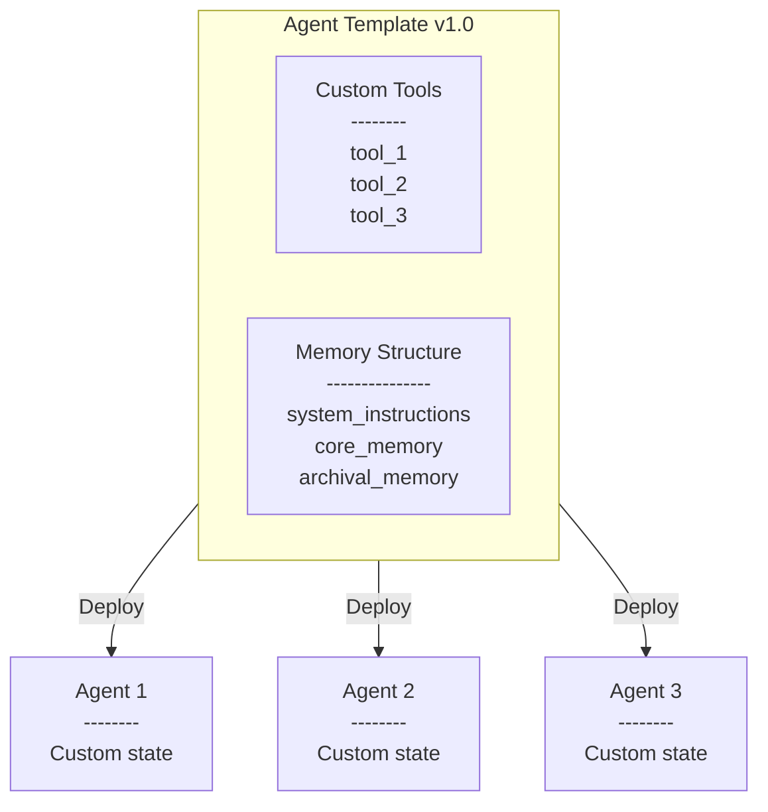
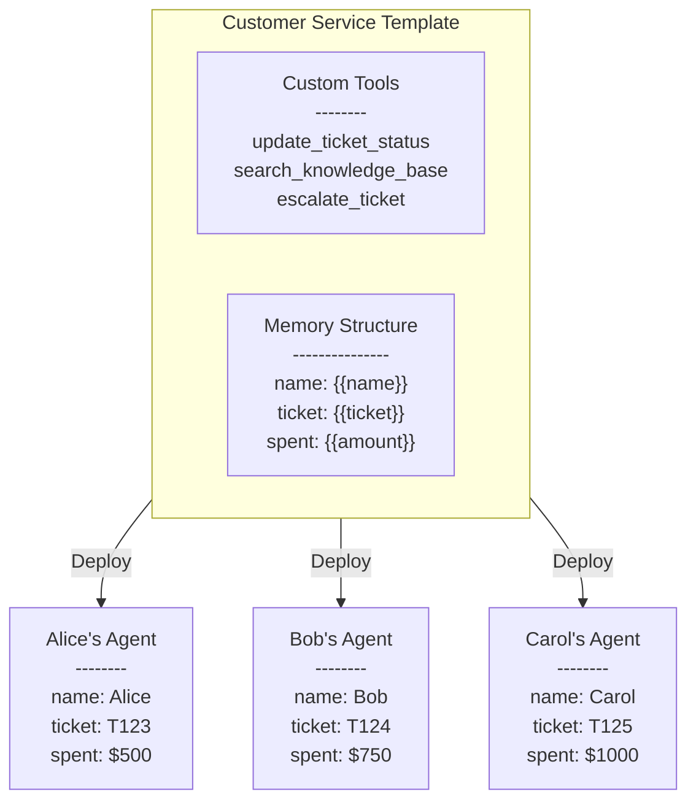

# Letta - Getting Started

**Pages:** 9

---

## Getting Started

**URL:** llms-txt#getting-started

**Contents:**
- Prerequisites
- Installation
- Getting an Agent to Test

Run your first Letta agent evaluation in 5 minutes.

* Python 3.11 or higher
* A running Letta server (local or Letta Cloud)
* A Letta agent to test, either in agent file format or by ID (see [Targets](/evals/core-concepts/targets) for more details)

## Getting an Agent to Test

Export an existing agent to a file using the Letta SDK:

```python
from letta_client import Letta
import os

client = Letta(
    base_url="http://localhost:8283",  # or https://api.letta.com for Letta Cloud
    token=os.getenv("LETTA_API_KEY")  # required for Letta Cloud
)

**Examples:**

Example 1 (bash):
```bash
pip install letta-evals
```

Example 2 (bash):
```bash
uv pip install letta-evals
```

---

## Observability Overview

**URL:** llms-txt#observability-overview

**Contents:**
- [Monitoring](/guides/observability/monitoring)
- [Responses & Tracing](/guides/observability/responses)

> Monitor and trace your agents in Letta Cloud

<Note>
  All observability features are available in real-time for every Letta Cloud project.
</Note>

Letta Cloud's observability tools help you monitor performance and debug issues. Each project you create in Letta Cloud has two main observability dashboards:

## [Monitoring](/guides/observability/monitoring)


Track key metrics across four dashboards:

* **Overview**: Message count, API/tool errors, LLM/tool latency
* **Activity & Usage**: Usage patterns and resource consumption
* **Performance**: Response times and throughput
* **Errors**: Detailed error analysis and debugging info

## [Responses & Tracing](/guides/observability/responses)


Inspect API responses and agent execution:

* **API Responses**: List of all responses with duration and status
* **Message Inspection**: Click "Inspect Message" to see the full POST request and agent loop execution sequence

---

## Letta Overview

**URL:** llms-txt#letta-overview

**Contents:**
- Build agents with intelligent memory, not limited context
- Start building in minutes
- Build stateful agents with your favorite tools
- See what your agents are thinking
- Run agents as services, not libraries
- Everything you need for production agents
- Join our developer community

> Create stateful AI agents that truly remember, learn, and evolve.

Letta enables you to build and deploy stateful AI agents that maintain memory and context across long-running conversations. Develop agents that truly learn and evolve from interactions without starting from scratch each time.


## Build agents with intelligent memory, not limited context

Letta's advanced context management system - built by the [researchers behind MemGPT](https://www.letta.com/research) - transforms how agents remember and learn. Unlike basic agents that forget when their context window fills up, Letta agents maintain memories across sessions and continuously improve, even while they [sleep](/guides/agents/sleep-time-agents) <Icon icon="fa-light fa-snooze" />.

## Start building in minutes

Our quickstart and examples work on both [Letta Cloud](/guides/cloud) and [self-hosted](/guides/selfhosting) Letta.

<CardGroup>
  <Card title="Developer quickstart" icon="fa-sharp fa-light fa-bolt" iconPosition="left" href="/quickstart">
    Create your first stateful agent using the Letta API & ADE
  </Card>

<Card title="Starter kits" icon="fa-sharp fa-light fa-square-code" iconPosition="left" href="https://github.com/letta-ai/create-letta-app">
    Build a full agents application using `create-letta-app`
  </Card>
</CardGroup>

## Build stateful agents with your favorite tools

Connect to agents running in a Letta server using any of your preferred development frameworks. Letta integrates seamlessly with the developer tools you already know and love.

<CardGroup cols={2}>
  <Card title="TypeScript (Node.js)" icon="fa-brands node-js" iconPosition="left" href="https://github.com/letta-ai/letta-node">
    Core SDK for our REST API
  </Card>

<Card title="Python" icon="fa-brands python" iconPosition="left" href="https://github.com/letta-ai/letta-python">
    Core SDK for our REST API
  </Card>

<Card title="Vercel AI SDK" icon="fa-sharp fa-solid sparkles" iconPosition="left" href="https://ai-sdk.dev/providers/community-providers/letta">
    Framework integration
  </Card>

<Card title="Next.js" icon="fa-brands js" iconPosition="left" href="https://www.npmjs.com/package/@letta-ai/letta-nextjs">
    Framework integration
  </Card>

<Card title="React" icon="fa-brands react" iconPosition="left" href="https://www.npmjs.com/package/@letta-ai/letta-react">
    Framework integration
  </Card>

<Card title="Flask" icon="fa-solid fa-flask" iconPosition="left" href="https://github.com/letta-ai/letta-flask">
    Framework integration
  </Card>
</CardGroup>

## See what your agents are thinking

The Agent Development Environment (ADE) provides complete visibility into your agent's memory, context window, and decision-making process - essential for developing and debugging production agent applications.


## Run agents as services, not libraries

**Letta is fundamentally different from other agent frameworks.** While most frameworks are *libraries* that wrap model APIs, Letta provides a dedicated *service* where agents live and operate autonomously. Agents continue to exist and maintain state even when your application isn't running, with computation happening on the server and all memory, context, and tool connections handled by the Letta server.


## Everything you need for production agents

Letta provides a complete suite of capabilities for building and deploying advanced AI agents:

* <Icon icon="fa-sharp fa-solid fa-browser" /> [Agent Development Environment](/agent-development-environment) (agent builder + monitoring UI)
* <Icon icon="brands fa-python" /> [Python SDK](/api-reference/overview) + <Icon icon="brands fa-js" /> [TypeScript SDK](/api-reference/overview) + [REST API](/api-reference/overview)
* <Icon icon="fa-sharp fa-solid fa-brain-circuit" /> [Memory management](/guides/agents/memory)
* <Icon icon="fa-solid fa-database" /> [Persistence](/guides/agents/overview#agents-vs-threads) (all agent state is stored in a database)
* <Icon icon="fa-sharp fa-solid fa-square-terminal" /> [Tool calling & execution](/guides/agents/tools) (support for custom tools & [pre-made tools](/guides/agents/composio))
* <Icon icon="fa-sharp fa-solid fa-code-fork" /> [Tool rules](/guides/agents/tool-rules) (constraining an agent's action set in a graph-like structure)
* <Icon icon="fa-sharp fa-solid fa-message-dots" /> [Streaming support](/guides/agents/streaming)
* <Icon icon="fa-sharp fa-solid fa-people-group" /> [Native multi-agent support](/guides/agents/multi-agent) and [multi-user support](/guides/agents/multi-user)
* <Icon icon="fa-sharp fa-solid fa-globe" /> Model-agnostic across closed ([OpenAI](/guides/server/providers/openai), etc.) and open providers ([LM Studio](/guides/server/providers/lmstudio), [vLLM](/guides/server/providers/vllm), etc.)
* <Icon icon="fa-sharp fa-solid fa-rocket" /> Production-ready deployment ([self-hosted with Docker](/quickstart/docker) or [Letta Cloud](/quickstart/cloud))

## Join our developer community

Building something with Letta? Join our [Discord](https://discord.gg/letta) to connect with other developers creating stateful agents and share what you're working on.

[Start building today →](/quickstart)

---

## Concepts Overview

**URL:** llms-txt#concepts-overview

---

## Introduction to Agent Templates

**URL:** llms-txt#introduction-to-agent-templates

**Contents:**
- Agents vs Agent Templates
  - Creating a template from an agent
- Example usecase: customer service

<Tip>
  Agent Templates are a feature in [Letta Cloud](/guides/cloud) that allow you to quickly spawn new agents from a common agent design.
</Tip>

Agent templates allow you to create a common starting point (or *template*) for your agents.
You can define the structure of your agent (its tools and memory) in a template,
then easily create new agents off of that template.

Agent templates support [versioning](/guides/templates/versioning), which allows you to programatically
upgrade all agents on an old version of a template to the new version of the same template.

Agent templates also support [memory variables](/guides/templates/variables), a way to conveniently customize
sections of memory at time of agent creation (when the template is used to create a new agent).

## Agents vs Agent Templates

**Templates** define a common starting point for your **agents**, but they are not agents themselves.
When you are editing a template in the ADE, the ADE will simulate an agent for you
(to help you debug and design your template), but the simulated agent in the simulator is not retained.

You can refresh the simulator and create a new simulated agent from your template at any time by clicking the "Flush Simulation" button 🔄 (at the top of the chat window).

To create a persistent agent from an existing template, you can use the  [create agents from template endpoint](/api-reference/templates/agents/create):

### Creating a template from an agent

You may have started with an agent and later decide that you'd like to convert it into a template to allow you to easily create new copies of your agent.

To convert an agent (deployed on Letta Cloud) into a template, simply open the agent in the ADE and click the "Convert to Template" button.

## Example usecase: customer service

Imagine you're creating a customer service chatbot application.
You may want every user that starts a chat sesion to get their own personalized agent:
the agent should know things specific to each user, like their purchase history, membership status, and so on.

However, despite being custom to individual users, each agent may share a common structure:
all agents may have access to the same tools, and the general strucutre of their memory may look the same.
For example, all customer service agents may have the `update_ticket_status` tool that allows the agent to update the status of a support ticket in your backend service.
Additionally, the agents may share a common structure to their memory block storing user information.

This is the perfect scenario to use an **agent template**!

You can take advantage of memory variables to write our user memory (one of our core memory blocks) to exploit the common structure across all users:

Notice how the memory block uses variables (wrapped in `{{ }}`) to specify what part of the memory should be defined at agent creation time, vs within the template itself.
When we create an agent using this template, we can specify the values to use in place of the variables.

**Examples:**

Example 1 (mermaid):


Example 2 (sh):
```sh
curl -X POST https://app.letta.com/v1/templates/{project_slug}/{template_name}:{template_version} \
  -H 'Content-Type: application/json' \
  -H 'Authorization: Bearer YOUR_API_KEY' \
  -d '{}'
```

Example 3 (mermaid):


Example 4 (handlebars):
```handlebars
The user is contacting me to resolve a customer support issue.
Their name is {{name}} and the ticket number for this request is {{ticket}}.
They have spent ${{amount}} on the platform.
If they have spent over $700, they are a gold customer.
Gold customers get free returns and priority shipping.
```

---

## Letta Evals

**URL:** llms-txt#letta-evals

**Contents:**
- Core Concepts
  - Grading & Extraction
  - Advanced
  - Reference
- Resources

**Systematic testing for stateful AI agents.** Validate changes, prevent regressions, and ship with confidence.

Test agent memory, tool usage, multi-turn conversations, and state evolution with automated grading and pass/fail gates.

<Note>
  **Ready to start?** Jump to [Getting Started](/evals/get-started/getting-started) or learn the [Core Concepts](/evals/core-concepts/concepts-overview) first.
</Note>

Understand the building blocks of evaluations:

* [Suites](/evals/core-concepts/suites) - Configure your evaluation
* [Datasets](/evals/core-concepts/datasets) - Define test cases
* [Targets](/evals/core-concepts/targets) - Specify the agent to test
* [Graders](/evals/core-concepts/graders) - Score agent outputs
* [Extractors](/evals/core-concepts/extractors) - Extract content from responses
* [Gates](/evals/core-concepts/gates) - Set pass/fail criteria

### Grading & Extraction

Choose how to score your agents:

* [Tool Graders](/evals/graders/tool-graders) - Fast, deterministic grading with Python functions
* [Rubric Graders](/evals/graders/rubric-graders) - Flexible LLM-as-judge evaluation
* [Built-in Extractors](/evals/extractors/built-in-extractors) - Pre-built content extractors
* [Multi-Metric Grading](/evals/graders/multi-metric-grading) - Evaluate multiple dimensions

* [Custom Graders](/evals/advanced/custom-graders) - Write your own grading logic
* [Custom Extractors](/evals/extractors/custom-extractors) - Build custom extractors
* [Multi-Turn Conversations](/evals/advanced/multi-turn-conversations) - Test memory and state
* [Suite YAML Reference](/evals/configuration/suite-yaml-reference) - Complete configuration schema

* [CLI Commands](/evals/cli-reference/commands) - Command-line interface
* [Understanding Results](/evals/results-metrics/understanding-results) - Interpret metrics
* [Troubleshooting](/evals/troubleshooting/common-issues) - Common issues and solutions

* **[GitHub Repository](https://github.com/letta-ai/letta-evals)** - Source code, issues, and contributions
* **[PyPI Package](https://pypi.org/project/letta-evals/)** - Install with `pip install letta-evals`

---

## Developer quickstart

**URL:** llms-txt#developer-quickstart

**Contents:**
- Why Letta?
- Next steps

> Create your first Letta agent with the API or SDKs and view it in the ADE

<Tip icon="fa-thin fa-rocket">
  Programming with AI tools like Cursor? Copy our [pre-built prompts](/prompts) to get started faster.
</Tip>

This guide will show you how to create a Letta agent with the Letta APIs or SDKs (Python/Typescript). To create agents with a low-code UI, see our [ADE quickstart](/guides/ade/overview).

Unlike traditional LLM APIs where you manually manage conversation history and state, Letta agents maintain their own persistent memory. You only send new messages. The agent remembers everything from past conversations without you storing or retrieving anything. This enables agents that truly learn and evolve over time.

<Steps>
  <Step title="Prerequisites">
    1. Create a [Letta Cloud account](https://app.letta.com)
    2. Create a [Letta Cloud API key](https://app.letta.com/api-keys)


3. Set your API key as an environment variable:

<Info>
      You can also **self-host** a Letta server. Check out our [self-hosting guide](/guides/selfhosting).
    </Info>
  </Step>

<Step title="Install the Letta SDK">
    <CodeGroup>

</CodeGroup>
  </Step>

<Step title="Create an agent">
    Agents in Letta have two key components:

* **Memory blocks**: Persistent context that's always visible to the agent (like a persona and information about the user)
    * **Tools**: Actions the agent can take (like searching the web or running code)

</CodeGroup>
  </Step>

<Step title="Message your agent">
    <Note>
      The Letta API supports streaming both agent *steps* and streaming *tokens*.
      For more information on streaming, see [our streaming guide](/guides/agents/streaming).
    </Note>

Once the agent is created, we can send the agent a message using its `id` field:

The response contains the agent's full response to the message, which includes reasoning steps (chain-of-thought), tool calls, tool responses, and assistant (agent) messages:

Notice how the agent retrieved information from its memory blocks without you having to send the context. This is the key difference from traditional LLM APIs where you'd need to include the full conversation history with every request.

You can read more about the response format from the message route [here](/guides/agents/overview#message-types).
  </Step>

<Step title="View your agent in the ADE">
    Another way to interact with Letta agents is via the [Agent Development Environment](/guides/ade/overview) (or ADE for short). The ADE is a UI on top of the Letta API that allows you to quickly build, prototype, and observe your agents.

If we navigate to our agent in the ADE, we should see our agent's state in full detail, as well as the message that we sent to it:


[Read our ADE setup guide →](/guides/ade/setup)
  </Step>
</Steps>

Congratulations! 🎉 You just created and messaged your first stateful agent with Letta using the API and SDKs. See the following resources for next steps for building more complex agents with Letta:

* Create and attach [custom tools](/guides/agents/custom-tools) to your agent
* Customize agentic [memory management](/guides/agents/memory)
* Version and distribute your agent with [agent templates](/guides/templates/overview)
* View the full [API and SDK reference](/api-reference/overview)

**Examples:**

Example 1 (unknown):
```unknown

```

Example 2 (unknown):
```unknown
</CodeGroup>

    <Info>
      You can also **self-host** a Letta server. Check out our [self-hosting guide](/guides/selfhosting).
    </Info>
  </Step>

  <Step title="Install the Letta SDK">
    <CodeGroup>
```

Example 3 (unknown):
```unknown

```

Example 4 (unknown):
```unknown
</CodeGroup>
  </Step>

  <Step title="Create an agent">
    Agents in Letta have two key components:

    * **Memory blocks**: Persistent context that's always visible to the agent (like a persona and information about the user)
    * **Tools**: Actions the agent can take (like searching the web or running code)

    <CodeGroup>
```

---

## Overview

**URL:** llms-txt#overview

---

## Core Concepts

**URL:** llms-txt#core-concepts

**Contents:**
- Built for Stateful Agents
- The Evaluation Flow
  - What You Can Test
- Why Evals Matter
- What Evals Are Useful For
  - 1. Development & Iteration
  - 2. Quality Assurance
  - 3. Model Selection
  - 4. Benchmarking
  - 5. Production Readiness

Understanding how Letta Evals works and what makes it different.

<Note>
  **Just want to run an eval?** Skip to [Getting Started](/evals/get-started/getting-started) for a hands-on quickstart.
</Note>

## Built for Stateful Agents

Letta Evals is a testing framework specifically designed for agents that maintain state. Unlike traditional eval frameworks built for simple input-output models, Letta Evals understands that agents:

* Maintain memory across conversations
* Use tools and external functions
* Evolve their behavior based on interactions
* Have persistent context and state

This means you can test aspects of your agent that other frameworks can't: memory updates, multi-turn conversations, tool usage patterns, and state evolution over time.

## The Evaluation Flow

Every evaluation follows this flow:

**Dataset → Target (Agent) → Extractor → Grader → Gate → Result**

1. **Dataset**: Your test cases (questions, scenarios, expected outputs)
2. **Target**: The agent being evaluated
3. **Extractor**: Pulls out the relevant information from the agent's response
4. **Grader**: Scores the extracted information
5. **Gate**: Pass/fail criteria for the overall evaluation
6. **Result**: Metrics, scores, and detailed results

### What You Can Test

With Letta Evals, you can test aspects of agents that traditional frameworks can't:

* **Memory updates**: Did the agent correctly remember the user's name?
* **Multi-turn conversations**: Can the agent maintain context across multiple exchanges?
* **Tool usage**: Does the agent call the right tools with the right arguments?
* **State evolution**: How does the agent's internal state change over time?

<Note>
  **Example: Testing Memory Updates**

This doesn't just check if the agent responded correctly - it verifies the agent actually stored "bananas" in its memory block. Traditional eval frameworks can't inspect agent state like this.
</Note>

AI agents are complex systems that can behave unpredictably. Without systematic evaluation, you can't:

* **Know if changes improve or break your agent** - Did that prompt tweak help or hurt?
* **Prevent regressions** - Catch when "fixes" break existing functionality
* **Compare approaches objectively** - Which model works better for your use case?
* **Build confidence before deployment** - Ensure quality before shipping to users
* **Track improvement over time** - Measure progress as you iterate

Manual testing doesn't scale. Evals let you test hundreds of scenarios in minutes.

## What Evals Are Useful For

### 1. Development & Iteration

* Test prompt changes instantly across your entire test suite
* Experiment with different models and compare results
* Validate that new features work as expected

### 2. Quality Assurance

* Prevent regressions when modifying agent behavior
* Ensure agents handle edge cases correctly
* Verify tool usage and memory updates

### 3. Model Selection

* Compare GPT-4 vs Claude vs other models on your specific use case
* Test different model configurations (temperature, system prompts, etc.)
* Find the right cost/performance tradeoff

* Measure agent performance on standard tasks
* Track improvements over time
* Share reproducible results with your team

### 5. Production Readiness

* Validate agents meet quality thresholds before deployment
* Run continuous evaluation in CI/CD pipelines
* Monitor production agent quality

## How Letta Evals Works

Letta Evals is built around a few key concepts that work together to create a flexible evaluation framework.

An **evaluation suite** is a complete test configuration defined in a YAML file. It ties together:

* Which dataset to use
* Which agent to test
* How to grade responses
* What criteria determine pass/fail

Think of a suite as a reusable test specification.

A **dataset** is a JSONL file where each line represents one test case. Each sample has:

* An input (what to ask the agent)
* Optional ground truth (the expected answer)
* Optional metadata (tags, custom fields)

The **target** is what you're evaluating. Currently, this is a Letta agent, specified by:

* An agent file (.af)
* An existing agent ID
* A Python script that creates agents programmatically

A **trajectory** is the complete conversation history from one test case. It's a list of turns, where each turn contains a list of Letta messages (assistant messages, tool calls, tool returns, etc.).

An **extractor** determines what part of the trajectory to evaluate. For example:

* The last thing the agent said
* All tool calls made
* Content from agent memory
* Text matching a pattern

A **grader** scores how well the agent performed. There are two types:

* **Tool graders**: Python functions that compare submission to ground truth
* **Rubric graders**: LLM judges that evaluate based on custom criteria

A **gate** is the pass/fail threshold for your evaluation. It compares aggregate metrics (like average score or pass rate) against a target value.

## Multi-Metric Evaluation

You can define multiple graders in one suite to evaluate different aspects:

The gate can check any of these metrics:

## Score Normalization

All scores are normalized to the range \[0.0, 1.0]:

* 0.0 = complete failure
* 1.0 = perfect success
* Values in between = partial credit

This allows different grader types to be compared and combined.

Individual sample scores are aggregated in two ways:

1. **Average Score**: Mean of all scores (0.0 to 1.0)
2. **Accuracy/Pass Rate**: Percentage of samples passing a threshold

You can gate on either metric type.

Dive deeper into each concept:

* [Suites](/evals/core-concepts/suites) - Suite configuration in detail
* [Datasets](/evals/core-concepts/datasets) - Creating effective test datasets
* [Targets](/evals/core-concepts/targets) - Agent configuration options
* [Graders](/evals/core-concepts/graders) - Understanding grader types
* [Extractors](/evals/core-concepts/extractors) - Extraction strategies
* [Gates](/evals/core-concepts/gates) - Setting pass/fail criteria

**Examples:**

Example 1 (yaml):
```yaml
graders:
    memory_check:
      kind: tool  # Deterministic grading
      function: contains  # Check if ground_truth in extracted content
      extractor: memory_block  # Extract from agent memory (not just response!)
      extractor_config:
        block_label: human  # Which memory block to check
```

Example 2 (jsonl):
```jsonl
{"input": "Please remember that I like bananas.", "ground_truth": "bananas"}
```

Example 3 (yaml):
```yaml
graders:
  accuracy:  # Check if answer is correct
    kind: tool
    function: exact_match
    extractor: last_assistant  # Use final response

  tool_usage:  # Check if agent called the right tool
    kind: tool
    function: contains
    extractor: tool_arguments  # Extract tool call args
    extractor_config:
      tool_name: search  # From search tool
```

Example 4 (yaml):
```yaml
gate:
  metric_key: accuracy  # Gate on accuracy (tool_usage still computed)
  op: gte  # >=
  value: 0.8  # 80% threshold
```

---
