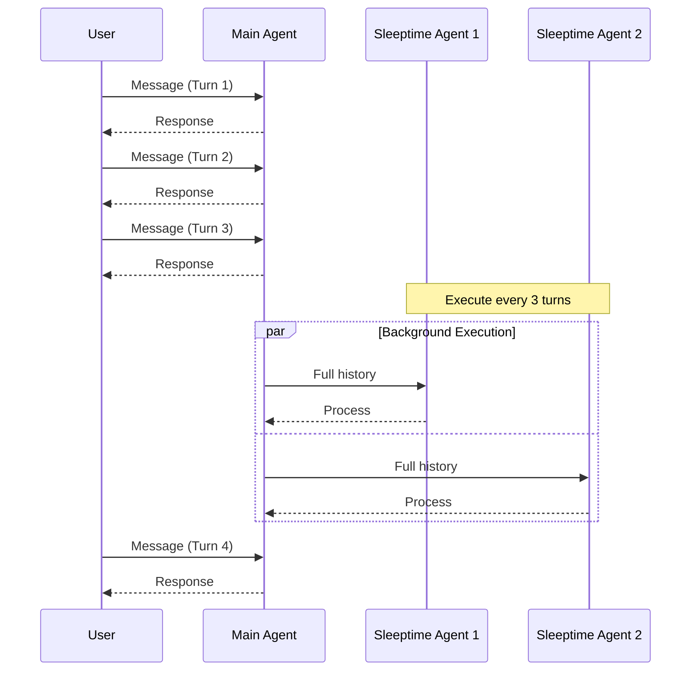

# Letta - Multiprocessing

**Pages:** 4

---

## Delete Group

**URL:** llms-txt#delete-group

**Contents:**
- OpenAPI Specification
- SDK Code Examples

DELETE https://api.letta.com/v1/groups/{group_id}

Delete a multi-agent group.

Reference: https://docs.letta.com/api-reference/groups/delete

## OpenAPI Specification

**Examples:**

Example 1 (yaml):
```yaml
openapi: 3.1.1
info:
  title: Delete Group
  version: endpoint_groups.delete
paths:
  /v1/groups/{group_id}:
    delete:
      operationId: delete
      summary: Delete Group
      description: Delete a multi-agent group.
      tags:
        - - subpackage_groups
      parameters:
        - name: group_id
          in: path
          description: The ID of the group in the format 'group-<uuid4>'
          required: true
          schema:
            type: string
        - name: Authorization
          in: header
          description: Header authentication of the form `Bearer <token>`
          required: true
          schema:
            type: string
      responses:
        '200':
          description: Successful Response
          content:
            application/json:
              schema:
                description: Any type
        '422':
          description: Validation Error
          content: {}
```

Example 2 (python):
```python
from letta_client import Letta

client = Letta(
    project="YOUR_PROJECT",
    token="YOUR_TOKEN",
)
client.groups.delete(
    group_id="group-123e4567-e89b-42d3-8456-426614174000",
)
```

Example 3 (typescript):
```typescript
import { LettaClient } from "@letta-ai/letta-client";

const client = new LettaClient({ token: "YOUR_TOKEN", project: "YOUR_PROJECT" });
await client.groups.delete("group-123e4567-e89b-42d3-8456-426614174000");
```

Example 4 (go):
```go
package main

import (
	"fmt"
	"net/http"
	"io"
)

func main() {

	url := "https://api.letta.com/v1/groups/group_id"

	req, _ := http.NewRequest("DELETE", url, nil)

	req.Header.Add("Authorization", "Bearer <token>")

	res, _ := http.DefaultClient.Do(req)

	defer res.Body.Close()
	body, _ := io.ReadAll(res.Body)

	fmt.Println(res)
	fmt.Println(string(body))

}
```

---

## List Groups

**URL:** llms-txt#list-groups

**Contents:**
- OpenAPI Specification
- SDK Code Examples

GET https://api.letta.com/v1/groups/

Fetch all multi-agent groups matching query.

Reference: https://docs.letta.com/api-reference/groups/list

## OpenAPI Specification

**Examples:**

Example 1 (yaml):
```yaml
openapi: 3.1.1
info:
  title: List Groups
  version: endpoint_groups.list
paths:
  /v1/groups/:
    get:
      operationId: list
      summary: List Groups
      description: Fetch all multi-agent groups matching query.
      tags:
        - - subpackage_groups
      parameters:
        - name: manager_type
          in: query
          description: Search groups by manager type
          required: false
          schema:
            oneOf:
              - $ref: '#/components/schemas/ManagerType'
              - type: 'null'
        - name: before
          in: query
          description: >-
            Group ID cursor for pagination. Returns groups that come before this
            group ID in the specified sort order
          required: false
          schema:
            type:
              - string
              - 'null'
        - name: after
          in: query
          description: >-
            Group ID cursor for pagination. Returns groups that come after this
            group ID in the specified sort order
          required: false
          schema:
            type:
              - string
              - 'null'
        - name: limit
          in: query
          description: Maximum number of groups to return
          required: false
          schema:
            type:
              - integer
              - 'null'
        - name: order
          in: query
          description: >-
            Sort order for groups by creation time. 'asc' for oldest first,
            'desc' for newest first
          required: false
          schema:
            $ref: '#/components/schemas/V1GroupsGetParametersOrder'
        - name: order_by
          in: query
          description: Field to sort by
          required: false
          schema:
            type: string
            enum:
              - type: stringLiteral
                value: created_at
        - name: project_id
          in: query
          description: Search groups by project id
          required: false
          schema:
            type:
              - string
              - 'null'
        - name: Authorization
          in: header
          description: Header authentication of the form `Bearer <token>`
          required: true
          schema:
            type: string
      responses:
        '200':
          description: Successful Response
          content:
            application/json:
              schema:
                type: array
                items:
                  $ref: '#/components/schemas/Group'
        '422':
          description: Validation Error
          content: {}
components:
  schemas:
    ManagerType:
      type: string
      enum:
        - value: round_robin
        - value: supervisor
        - value: dynamic
        - value: sleeptime
        - value: voice_sleeptime
        - value: swarm
    V1GroupsGetParametersOrder:
      type: string
      enum:
        - value: asc
        - value: desc
    Group:
      type: object
      properties:
        id:
          type: string
        manager_type:
          $ref: '#/components/schemas/ManagerType'
        agent_ids:
          type: array
          items:
            type: string
        description:
          type: string
        project_id:
          type:
            - string
            - 'null'
        template_id:
          type:
            - string
            - 'null'
        base_template_id:
          type:
            - string
            - 'null'
        deployment_id:
          type:
            - string
            - 'null'
        shared_block_ids:
          type: array
          items:
            type: string
        manager_agent_id:
          type:
            - string
            - 'null'
        termination_token:
          type:
            - string
            - 'null'
        max_turns:
          type:
            - integer
            - 'null'
        sleeptime_agent_frequency:
          type:
            - integer
            - 'null'
        turns_counter:
          type:
            - integer
            - 'null'
        last_processed_message_id:
          type:
            - string
            - 'null'
        max_message_buffer_length:
          type:
            - integer
            - 'null'
        min_message_buffer_length:
          type:
            - integer
            - 'null'
        hidden:
          type:
            - boolean
            - 'null'
      required:
        - id
        - manager_type
        - agent_ids
        - description
```

Example 2 (python):
```python
from letta_client import Letta

client = Letta(
    project="YOUR_PROJECT",
    token="YOUR_TOKEN",
)
client.groups.list(
    manager_type="round_robin",
    before="before",
    after="after",
    limit=1,
    order="asc",
    project_id="project_id",
)
```

Example 3 (typescript):
```typescript
import { LettaClient } from "@letta-ai/letta-client";

const client = new LettaClient({ token: "YOUR_TOKEN", project: "YOUR_PROJECT" });
await client.groups.list({
    managerType: "round_robin",
    before: "before",
    after: "after",
    limit: 1,
    order: "asc",
    orderBy: "created_at",
    projectId: "project_id"
});
```

Example 4 (go):
```go
package main

import (
	"fmt"
	"net/http"
	"io"
)

func main() {

	url := "https://api.letta.com/v1/groups/"

	req, _ := http.NewRequest("GET", url, nil)

	req.Header.Add("Authorization", "Bearer <token>")

	res, _ := http.DefaultClient.Do(req)

	defer res.Body.Close()
	body, _ := io.ReadAll(res.Body)

	fmt.Println(res)
	fmt.Println(string(body))

}
```

---

## Groups

**URL:** llms-txt#groups

**Contents:**
  - Choosing the Right Group Type
  - Working with Groups
- Sleep-time
  - How it works
  - Code Example
- RoundRobin
  - How it works
  - Code Example
- Supervisor
  - How it works

> Coordinate multiple agents with different communication patterns

<Warning>
  Groups support is experimental and may be unstable. For more information, visit our [Discord](https://discord.gg/letta).
</Warning>

Groups enable sophisticated multi-agent coordination patterns in Letta. Each group type provides a different communication and execution pattern, allowing you to choose the right architecture for your multi-agent system.

### Choosing the Right Group Type

| Group Type      | Best For                                        | Key Features                                                 |
| --------------- | ----------------------------------------------- | ------------------------------------------------------------ |
| **Sleep-time**  | Background monitoring, periodic tasks           | Main + background agents, configurable frequency             |
| **Round Robin** | Equal participation, structured discussions     | Sequential, predictable, no orchestrator needed              |
| **Supervisor**  | Parallel task execution, work distribution      | Centralized control, parallel processing, result aggregation |
| **Dynamic**     | Context-aware routing, complex workflows        | Flexible, adaptive, orchestrator-driven                      |
| **Handoff**     | Specialized routing, expertise-based delegation | Task-based transfers (coming soon)                           |

### Working with Groups

All group types follow a similar creation pattern using the SDK:

1. Create individual agents with their specific roles and personas
2. Create a group with the appropriate manager configuration
3. Send messages to the group for coordinated multi-agent interaction

Groups can be managed through the Letta API or SDKs:

* List all groups: `client.groups.list()`
* Retrieve a specific group: `client.groups.retrieve(group_id)`
* Update group configuration: `client.groups.update(group_id, update_config)`
* Delete a group: `client.groups.delete(group_id)`

The Sleep-time pattern enables background agents to execute periodically while a main conversation agent handles user interactions. This is based on our [sleep-time compute research](https://arxiv.org/abs/2504.13171).

<Note>
  For an in-depth guide on sleep-time agents, including conversation processing and data source integration, see our [Sleep-time Agents documentation](/guides/agents/architectures/sleeptime).
</Note>

* A main conversation agent handles direct user interactions
* Sleeptime agents execute in the background every Nth turn
* Background agents have access to the full message history
* Useful for periodic tasks like monitoring, data collection, or summary generation
* Frequency of background execution is configurable

The RoundRobin group cycles through each agent in the group in the specified order. This pattern is useful for scenarios where each agent needs to contribute equally and in sequence.

* Cycles through agents in the order they were added to the group
* Every agent has access to the full conversation history
* Each agent can choose whether or not to respond when it's their turn
* Default ensures each agent gets one turn, but max turns can be configured
* Does not require an orchestrator agent

The Supervisor pattern uses a manager agent to coordinate worker agents. The supervisor forwards prompts to all workers and aggregates their responses.

* A designated supervisor agent manages the group
* Supervisor forwards messages to all worker agents simultaneously
* Worker agents process in parallel and return responses
* Supervisor aggregates all responses and returns to the user
* Ideal for parallel task execution and result aggregation

The Dynamic pattern uses an orchestrator agent to dynamically determine which agent should speak next based on the conversation context.

* An orchestrator agent is invoked on every turn to select the next speaker
* Every agent has access to the full message history
* Agents can choose not to respond when selected
* Supports a termination token to end the conversation
* Maximum turns can be configured to prevent infinite loops

## Handoff (Coming Soon)

The Handoff pattern will enable agents to explicitly transfer control to other agents based on task requirements or expertise areas.

* Agents can hand off conversations to specialists
* Context and state preservation during handoffs
* Support for both orchestrated and peer-to-peer handoffs
* Automatic routing based on agent capabilities

* Choose the group type that matches your coordination needs
* Configure appropriate max turns to prevent infinite loops
* Use shared memory blocks for state that needs to be accessed by multiple agents
* Monitor group performance and adjust configurations as needed

**Examples:**

Example 1 (mermaid):


Example 2 (unknown):
```unknown

```

Example 3 (unknown):
```unknown
</CodeGroup>

## RoundRobin

The RoundRobin group cycles through each agent in the group in the specified order. This pattern is useful for scenarios where each agent needs to contribute equally and in sequence.

### How it works

* Cycles through agents in the order they were added to the group
* Every agent has access to the full conversation history
* Each agent can choose whether or not to respond when it's their turn
* Default ensures each agent gets one turn, but max turns can be configured
* Does not require an orchestrator agent
```

Example 4 (unknown):
```unknown
### Code Example

<CodeGroup>
```

---

## Workflows (Legacy)

**URL:** llms-txt#workflows-(legacy)

**Contents:**
- Agents vs Workflows
- Workflows vs Tool Rules
- Creating Workflows

> Workflows are systems that execute tool calls in a sequence

<Warning>
  **This documentation covers a legacy agent architecture.**

For new projects, use the current Letta architecture with [tool rules](/guides/agents/tool-rules) to constrain behavior instead of the `workflow_agent` type.
</Warning>

Workflows execute predefined sequences of tool calls with LLM-driven decision making. The `workflow_agent` agent type provides structured, sequential processes where you need deterministic execution paths.

Workflows are stateless by default but can branch and make decisions based on tool outputs and LLM reasoning.

## Agents vs Workflows

**Agents** are autonomous systems that decide what tools to call and when, based on goals and context.

**Workflows** are predefined sequences where the LLM follows structured paths (for example, start with tool A, then call either tool B or tool C), making decisions within defined branching points.

The definition between an *agent* and a *workflow* is not always clear and each can have various overlapping levels of autonomy: workflows can be made more autonomous by structuring the decision points to be highly general, and agents can be made more deterministic by adding tool rules to constrain their behavior.

## Workflows vs Tool Rules

An alternative to workflows is using autonomous agents (MemGPT, ReAct, Sleep-time) with [tool rules](/guides/agents/tool-rules) to constrain behavior.

**Use the workflow architecture when:**

* You have an existing workflow to implement in Letta (e.g., moving from n8n, LangGraph, or another workflow builder)
* You need strict sequential execution with minimal autonomy

**Use tool rules (on top of other agent architectures) when:**

* You want more autonomous behavior, but with certain guardrails
* Your task requires adaptive decision making (tool sequences are hard to predict)
* You want to have the flexibility (as a developer) to adapt the level of autonomy (for example, reducing constraints as the underlying LLMs improve)

## Creating Workflows

Workflows are created using the `workflow_agent` agent type.
By default, there are no constraints on the sequence of tool calls that can be made: to add constraints and build a "graph", you can use the `tool_rules` parameter to add tool rules to the agent.

For example, in the following code snippet, we are creating a workflow agent that can call the `web_search` tool, and then call either the `send_email` or `create_report` tool, based on the LLM's reasoning.

**Examples:**

Example 1 (unknown):
```unknown

```

Example 2 (unknown):
```unknown

```

---
