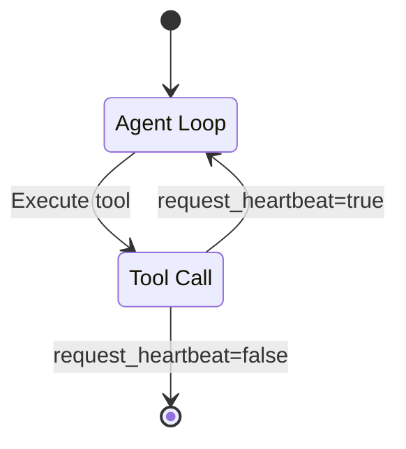

# Letta - Other

**Pages:** 136

---

## Upload File To Source

**URL:** llms-txt#upload-file-to-source

**Contents:**
- OpenAPI Specification
- SDK Code Examples

POST https://api.letta.com/v1/sources/{source_id}/upload
Content-Type: multipart/form-data

Upload a file to a data source.

Reference: https://docs.letta.com/api-reference/sources/upload

## OpenAPI Specification

**Examples:**

Example 1 (yaml):
```yaml
openapi: 3.1.1
info:
  title: Upload File To Source
  version: endpoint_sources/files.upload
paths:
  /v1/sources/{source_id}/upload:
    post:
      operationId: upload
      summary: Upload File To Source
      description: Upload a file to a data source.
      tags:
        - - subpackage_sources
          - subpackage_sources/files
      parameters:
        - name: source_id
          in: path
          description: The ID of the source in the format 'source-<uuid4>'
          required: true
          schema:
            type: string
        - name: duplicate_handling
          in: query
          description: How to handle duplicate filenames
          required: false
          schema:
            $ref: '#/components/schemas/DuplicateFileHandling'
        - name: name
          in: query
          description: Optional custom name to override the uploaded file's name
          required: false
          schema:
            type:
              - string
              - 'null'
        - name: Authorization
          in: header
          description: Header authentication of the form `Bearer <token>`
          required: true
          schema:
            type: string
      responses:
        '200':
          description: Successful Response
          content:
            application/json:
              schema:
                $ref: '#/components/schemas/FileMetadata'
        '422':
          description: Validation Error
          content: {}
      requestBody:
        content:
          multipart/form-data:
            schema:
              type: object
              properties: {}
components:
  schemas:
    DuplicateFileHandling:
      type: string
      enum:
        - value: skip
        - value: error
        - value: suffix
        - value: replace
    FileProcessingStatus:
      type: string
      enum:
        - value: pending
        - value: parsing
        - value: embedding
        - value: completed
        - value: error
    FileMetadata:
      type: object
      properties:
        source_id:
          type: string
        file_name:
          type:
            - string
            - 'null'
        original_file_name:
          type:
            - string
            - 'null'
        file_path:
          type:
            - string
            - 'null'
        file_type:
          type:
            - string
            - 'null'
        file_size:
          type:
            - integer
            - 'null'
        file_creation_date:
          type:
            - string
            - 'null'
        file_last_modified_date:
          type:
            - string
            - 'null'
        processing_status:
          $ref: '#/components/schemas/FileProcessingStatus'
        error_message:
          type:
            - string
            - 'null'
        total_chunks:
          type:
            - integer
            - 'null'
        chunks_embedded:
          type:
            - integer
            - 'null'
        content:
          type:
            - string
            - 'null'
        id:
          type: string
        created_at:
          type:
            - string
            - 'null'
          format: date-time
        updated_at:
          type:
            - string
            - 'null'
          format: date-time
      required:
        - source_id
```

Example 2 (python):
```python
from letta_client import Letta

client = Letta(
    project="YOUR_PROJECT",
    token="YOUR_TOKEN",
)
client.sources.files.upload(
    source_id="source-123e4567-e89b-42d3-8456-426614174000",
    duplicate_handling="skip",
    name="name",
)
```

Example 3 (typescript):
```typescript
import { LettaClient } from "@letta-ai/letta-client";
import * as fs from "fs";

const client = new LettaClient({ token: "YOUR_TOKEN", project: "YOUR_PROJECT" });
await client.sources.files.upload(fs.createReadStream("/path/to/your/file"), "source-123e4567-e89b-42d3-8456-426614174000", {
    duplicateHandling: "skip",
    name: "name"
});
```

Example 4 (go):
```go
package main

import (
	"fmt"
	"strings"
	"net/http"
	"io"
)

func main() {

	url := "https://api.letta.com/v1/sources/source_id/upload"

	payload := strings.NewReader("-----011000010111000001101001\r\nContent-Disposition: form-data; name=\"file\"; filename=\"string\"\r\nContent-Type: application/octet-stream\r\n\r\n\r\n-----011000010111000001101001--\r\n")

	req, _ := http.NewRequest("POST", url, payload)

	req.Header.Add("Authorization", "Bearer <token>")
	req.Header.Add("Content-Type", "multipart/form-data; boundary=---011000010111000001101001")

	res, _ := http.DefaultClient.Do(req)

	defer res.Body.Close()
	body, _ := io.ReadAll(res.Body)

	fmt.Println(res)
	fmt.Println(string(body))

}
```

---

## List Folders

**URL:** llms-txt#list-folders

**Contents:**
- OpenAPI Specification
- SDK Code Examples

GET https://api.letta.com/v1/folders/

List all data folders created by a user.

Reference: https://docs.letta.com/api-reference/folders/list

## OpenAPI Specification

**Examples:**

Example 1 (yaml):
```yaml
openapi: 3.1.1
info:
  title: List Folders
  version: endpoint_folders.list
paths:
  /v1/folders/:
    get:
      operationId: list
      summary: List Folders
      description: List all data folders created by a user.
      tags:
        - - subpackage_folders
      parameters:
        - name: before
          in: query
          description: >-
            Folder ID cursor for pagination. Returns folders that come before
            this folder ID in the specified sort order
          required: false
          schema:
            type:
              - string
              - 'null'
        - name: after
          in: query
          description: >-
            Folder ID cursor for pagination. Returns folders that come after
            this folder ID in the specified sort order
          required: false
          schema:
            type:
              - string
              - 'null'
        - name: limit
          in: query
          description: Maximum number of folders to return
          required: false
          schema:
            type:
              - integer
              - 'null'
        - name: order
          in: query
          description: >-
            Sort order for folders by creation time. 'asc' for oldest first,
            'desc' for newest first
          required: false
          schema:
            $ref: '#/components/schemas/V1FoldersGetParametersOrder'
        - name: order_by
          in: query
          description: Field to sort by
          required: false
          schema:
            type: string
            enum:
              - type: stringLiteral
                value: created_at
        - name: name
          in: query
          description: Folder name to filter by
          required: false
          schema:
            type:
              - string
              - 'null'
        - name: Authorization
          in: header
          description: Header authentication of the form `Bearer <token>`
          required: true
          schema:
            type: string
      responses:
        '200':
          description: Successful Response
          content:
            application/json:
              schema:
                type: array
                items:
                  $ref: '#/components/schemas/Folder'
        '422':
          description: Validation Error
          content: {}
components:
  schemas:
    V1FoldersGetParametersOrder:
      type: string
      enum:
        - value: asc
        - value: desc
    EmbeddingConfigEmbeddingEndpointType:
      type: string
      enum:
        - value: openai
        - value: anthropic
        - value: bedrock
        - value: google_ai
        - value: google_vertex
        - value: azure
        - value: groq
        - value: ollama
        - value: webui
        - value: webui-legacy
        - value: lmstudio
        - value: lmstudio-legacy
        - value: llamacpp
        - value: koboldcpp
        - value: vllm
        - value: hugging-face
        - value: mistral
        - value: together
        - value: pinecone
    EmbeddingConfig:
      type: object
      properties:
        embedding_endpoint_type:
          $ref: '#/components/schemas/EmbeddingConfigEmbeddingEndpointType'
        embedding_endpoint:
          type:
            - string
            - 'null'
        embedding_model:
          type: string
        embedding_dim:
          type: integer
        embedding_chunk_size:
          type:
            - integer
            - 'null'
        handle:
          type:
            - string
            - 'null'
        batch_size:
          type: integer
        azure_endpoint:
          type:
            - string
            - 'null'
        azure_version:
          type:
            - string
            - 'null'
        azure_deployment:
          type:
            - string
            - 'null'
      required:
        - embedding_endpoint_type
        - embedding_model
        - embedding_dim
    Folder:
      type: object
      properties:
        name:
          type: string
        description:
          type:
            - string
            - 'null'
        instructions:
          type:
            - string
            - 'null'
        metadata:
          type:
            - object
            - 'null'
          additionalProperties:
            description: Any type
        id:
          type: string
        embedding_config:
          $ref: '#/components/schemas/EmbeddingConfig'
        created_by_id:
          type:
            - string
            - 'null'
        last_updated_by_id:
          type:
            - string
            - 'null'
        created_at:
          type:
            - string
            - 'null'
          format: date-time
        updated_at:
          type:
            - string
            - 'null'
          format: date-time
      required:
        - name
        - embedding_config
```

Example 2 (python):
```python
from letta_client import Letta

client = Letta(
    project="YOUR_PROJECT",
    token="YOUR_TOKEN",
)
client.folders.list(
    before="before",
    after="after",
    limit=1,
    order="asc",
    name="name",
)
```

Example 3 (typescript):
```typescript
import { LettaClient } from "@letta-ai/letta-client";

const client = new LettaClient({ token: "YOUR_TOKEN", project: "YOUR_PROJECT" });
await client.folders.list({
    before: "before",
    after: "after",
    limit: 1,
    order: "asc",
    orderBy: "created_at",
    name: "name"
});
```

Example 4 (go):
```go
package main

import (
	"fmt"
	"net/http"
	"io"
)

func main() {

	url := "https://api.letta.com/v1/folders/"

	req, _ := http.NewRequest("GET", url, nil)

	req.Header.Add("Authorization", "Bearer <token>")

	res, _ := http.DefaultClient.Do(req)

	defer res.Body.Close()
	body, _ := io.ReadAll(res.Body)

	fmt.Println(res)
	fmt.Println(string(body))

}
```

---

## Recent memories

**URL:** llms-txt#recent-memories

archival_memory_search(
    query="test results",
    start_datetime="2025-09-29T00:00:00"
)

---

## Delete File From Folder

**URL:** llms-txt#delete-file-from-folder

**Contents:**
- OpenAPI Specification
- SDK Code Examples

DELETE https://api.letta.com/v1/folders/{folder_id}/{file_id}

Delete a file from a folder.

Reference: https://docs.letta.com/api-reference/folders/files/delete

## OpenAPI Specification

**Examples:**

Example 1 (yaml):
```yaml
openapi: 3.1.1
info:
  title: Delete File From Folder
  version: endpoint_folders/files.delete
paths:
  /v1/folders/{folder_id}/{file_id}:
    delete:
      operationId: delete
      summary: Delete File From Folder
      description: Delete a file from a folder.
      tags:
        - - subpackage_folders
          - subpackage_folders/files
      parameters:
        - name: folder_id
          in: path
          description: The ID of the source in the format 'source-<uuid4>'
          required: true
          schema:
            type: string
        - name: file_id
          in: path
          description: The ID of the file in the format 'file-<uuid4>'
          required: true
          schema:
            type: string
        - name: Authorization
          in: header
          description: Header authentication of the form `Bearer <token>`
          required: true
          schema:
            type: string
      responses:
        '204':
          description: Successful Response
          content:
            application/json:
              schema:
                $ref: '#/components/schemas/folders_files_delete_Response_204'
        '422':
          description: Validation Error
          content: {}
components:
  schemas:
    folders_files_delete_Response_204:
      type: object
      properties: {}
```

Example 2 (python):
```python
from letta_client import Letta

client = Letta(
    project="YOUR_PROJECT",
    token="YOUR_TOKEN",
)
client.folders.files.delete(
    folder_id="folder_id",
    file_id="file_id",
)
```

Example 3 (typescript):
```typescript
import { LettaClient } from "@letta-ai/letta-client";

const client = new LettaClient({ token: "YOUR_TOKEN", project: "YOUR_PROJECT" });
await client.folders.files.delete("folder_id", "file_id");
```

Example 4 (go):
```go
package main

import (
	"fmt"
	"net/http"
	"io"
)

func main() {

	url := "https://api.letta.com/v1/folders/folder_id/file_id"

	req, _ := http.NewRequest("DELETE", url, nil)

	req.Header.Add("Authorization", "Bearer <token>")

	res, _ := http.DefaultClient.Do(req)

	defer res.Body.Close()
	body, _ := io.ReadAll(res.Body)

	fmt.Println(res)
	fmt.Println(string(body))

}
```

---

## Graders

**URL:** llms-txt#graders

**Contents:**
- Grader Types
  - Tool Graders
  - Rubric Graders
- Built-in Tool Graders
  - exact\_match
  - contains
  - regex\_match
  - ascii\_printable\_only
- Rubric Graders
  - Basic Configuration

**Graders** are the scoring functions that evaluate agent responses. They take the extracted submission (from an extractor) and assign a score between 0.0 (complete failure) and 1.0 (perfect success).

<Note>
  **Quick overview:**

* **Two types**: Tool graders (deterministic Python functions) and Rubric graders (LLM-as-judge)
  * **Built-in functions**: exact\_match, contains, regex\_match, ascii\_printable\_only
  * **Custom graders**: Write your own grading logic
  * **Multi-metric**: Combine multiple graders in one suite
  * **Flexible extraction**: Each grader can use a different extractor
</Note>

**When to use each:**

* **Tool graders**: Fast, deterministic, free - perfect for exact matching, patterns, tool validation
* **Rubric graders**: Flexible, subjective, costs API calls - ideal for quality, creativity, nuanced evaluation

Graders evaluate agent responses and assign scores between 0.0 (complete failure) and 1.0 (perfect success).

There are two types of graders:

Python functions that programmatically compare the submission to ground truth or apply deterministic checks.

* Exact matching
* Pattern checking
* Tool call validation
* Deterministic criteria

LLM-as-judge evaluation using custom prompts and criteria. Can use either direct LLM API calls or a Letta agent as the judge.

**Standard rubric grading (LLM API):**

**Agent-as-judge (Letta agent):**

* Subjective quality assessment
* Open-ended responses
* Nuanced evaluation
* Complex criteria
* Judges that need tools (when using agent-as-judge)

## Built-in Tool Graders

Checks if submission exactly matches ground truth (case-sensitive, whitespace-trimmed).

Requires: `ground_truth` in dataset

Score: 1.0 if exact match, 0.0 otherwise

Checks if submission contains ground truth (case-insensitive).

Requires: `ground_truth` in dataset

Score: 1.0 if found, 0.0 otherwise

Checks if submission matches a regex pattern in ground truth.

Score: 1.0 if pattern matches, 0.0 otherwise

### ascii\_printable\_only

Validates that all characters are printable ASCII (useful for ASCII art, formatted output).

Does not require ground truth.

Score: 1.0 if all characters are printable ASCII, 0.0 if any non-printable characters found

Rubric graders use an LLM to evaluate responses based on custom criteria.

### Basic Configuration

### Rubric Prompt Format

Your rubric file should describe the evaluation criteria. Use placeholders:

* `{input}`: The original input from the dataset
* `{submission}`: The extracted agent response
* `{ground_truth}`: Ground truth from dataset (if available)

Example `quality_rubric.txt`:

Instead of a file, you can include the prompt inline:

### Model Configuration

* Any OpenAI-compatible model
* Special handling for reasoning models (o1, o3) - temperature automatically adjusted to 1.0

### Structured Output

Rubric graders use JSON mode to get structured responses:

The score is validated to be between 0.0 and 1.0.

## Multi-Metric Configuration

Evaluate multiple aspects in one suite:

Each grader can use a different extractor.

## Extractor Configuration

Every grader must specify an `extractor` to select what to grade:

Some extractors need additional configuration:

See [Extractors](/evals/core-concepts/extractors) for all available extractors.

You can write custom grading functions. See [Custom Graders](/evals/advanced/custom-graders) for details.

## Grader Selection Guide

| Use Case                  | Recommended Grader                            |
| ------------------------- | --------------------------------------------- |
| Exact answer matching     | `exact_match`                                 |
| Keyword checking          | `contains`                                    |
| Pattern validation        | `regex_match`                                 |
| Tool call validation      | `exact_match` with `tool_arguments` extractor |
| Quality assessment        | Rubric grader                                 |
| Creativity evaluation     | Rubric grader                                 |
| Format checking           | Custom tool grader                            |
| Multi-criteria evaluation | Multiple graders                              |

## Score Interpretation

All scores are between 0.0 and 1.0:

* **1.0**: Perfect - meets all criteria
* **0.75-0.99**: Good - minor issues
* **0.5-0.74**: Acceptable - notable gaps
* **0.25-0.49**: Poor - major problems
* **0.0-0.24**: Failed - did not meet criteria

Tool graders typically return binary scores (0.0 or 1.0), while rubric graders can return any value in the range.

If grading fails (e.g., network error, invalid format):

* Score is set to 0.0
* Rationale includes error message
* Metadata includes error details

This ensures evaluations can continue even with individual failures.

* [Tool Graders](/evals/graders/tool-graders) - Built-in and custom functions
* [Rubric Graders](/evals/graders/rubric-graders) - LLM-as-judge details
* [Multi-Metric Evaluation](/evals/graders/multi-metric-grading) - Using multiple graders
* [Extractors](/evals/core-concepts/extractors) - Selecting what to grade

**Examples:**

Example 1 (yaml):
```yaml
graders:
  accuracy:
    kind: tool  # Deterministic grading
    function: exact_match  # Built-in grading function
    extractor: last_assistant  # Use final agent response
```

Example 2 (yaml):
```yaml
graders:
  quality:
    kind: rubric  # LLM-as-judge
    prompt_path: rubric.txt  # Custom evaluation criteria
    model: gpt-4o-mini  # Judge model
    extractor: last_assistant  # What to evaluate
```

Example 3 (yaml):
```yaml
graders:
  agent_judge:
    kind: rubric  # Still "rubric" kind
    agent_file: judge.af  # Judge agent with submit_grade tool
    prompt_path: rubric.txt  # Evaluation criteria
    extractor: last_assistant  # What to evaluate
```

Example 4 (yaml):
```yaml
graders:
  accuracy:
    kind: tool
    function: exact_match  # Case-sensitive, whitespace-trimmed
    extractor: last_assistant  # Extract final response
```

---

## View all projects

**URL:** llms-txt#view-all-projects

---

## List LLM Models

**URL:** llms-txt#list-llm-models

**Contents:**
- OpenAPI Specification
- SDK Code Examples

GET https://api.letta.com/v1/models/

List available LLM models using the asynchronous implementation for improved performance

Reference: https://docs.letta.com/api-reference/models/list

## OpenAPI Specification

**Examples:**

Example 1 (yaml):
```yaml
openapi: 3.1.1
info:
  title: List LLM Models
  version: endpoint_models.list
paths:
  /v1/models/:
    get:
      operationId: list
      summary: List LLM Models
      description: >-
        List available LLM models using the asynchronous implementation for
        improved performance
      tags:
        - - subpackage_models
      parameters:
        - name: provider_category
          in: query
          required: false
          schema:
            type:
              - array
              - 'null'
            items:
              $ref: '#/components/schemas/ProviderCategory'
        - name: provider_name
          in: query
          required: false
          schema:
            type:
              - string
              - 'null'
        - name: provider_type
          in: query
          required: false
          schema:
            oneOf:
              - $ref: '#/components/schemas/ProviderType'
              - type: 'null'
        - name: Authorization
          in: header
          description: Header authentication of the form `Bearer <token>`
          required: true
          schema:
            type: string
      responses:
        '200':
          description: Successful Response
          content:
            application/json:
              schema:
                type: array
                items:
                  $ref: '#/components/schemas/LLMConfig'
        '422':
          description: Validation Error
          content: {}
components:
  schemas:
    ProviderCategory:
      type: string
      enum:
        - value: base
        - value: byok
    ProviderType:
      type: string
      enum:
        - value: anthropic
        - value: azure
        - value: bedrock
        - value: cerebras
        - value: deepseek
        - value: google_ai
        - value: google_vertex
        - value: groq
        - value: hugging-face
        - value: letta
        - value: lmstudio_openai
        - value: mistral
        - value: ollama
        - value: openai
        - value: together
        - value: vllm
        - value: xai
    LlmConfigModelEndpointType:
      type: string
      enum:
        - value: openai
        - value: anthropic
        - value: google_ai
        - value: google_vertex
        - value: azure
        - value: groq
        - value: ollama
        - value: webui
        - value: webui-legacy
        - value: lmstudio
        - value: lmstudio-legacy
        - value: lmstudio-chatcompletions
        - value: llamacpp
        - value: koboldcpp
        - value: vllm
        - value: hugging-face
        - value: mistral
        - value: together
        - value: bedrock
        - value: deepseek
        - value: xai
    LlmConfigReasoningEffort:
      type: string
      enum:
        - value: minimal
        - value: low
        - value: medium
        - value: high
    LlmConfigCompatibilityType:
      type: string
      enum:
        - value: gguf
        - value: mlx
    LlmConfigVerbosity:
      type: string
      enum:
        - value: low
        - value: medium
        - value: high
    LLMConfig:
      type: object
      properties:
        model:
          type: string
        display_name:
          type:
            - string
            - 'null'
        model_endpoint_type:
          $ref: '#/components/schemas/LlmConfigModelEndpointType'
        model_endpoint:
          type:
            - string
            - 'null'
        provider_name:
          type:
            - string
            - 'null'
        provider_category:
          oneOf:
            - $ref: '#/components/schemas/ProviderCategory'
            - type: 'null'
        model_wrapper:
          type:
            - string
            - 'null'
        context_window:
          type: integer
        put_inner_thoughts_in_kwargs:
          type:
            - boolean
            - 'null'
        handle:
          type:
            - string
            - 'null'
        temperature:
          type: number
          format: double
        max_tokens:
          type:
            - integer
            - 'null'
        enable_reasoner:
          type: boolean
        reasoning_effort:
          oneOf:
            - $ref: '#/components/schemas/LlmConfigReasoningEffort'
            - type: 'null'
        max_reasoning_tokens:
          type: integer
        frequency_penalty:
          type:
            - number
            - 'null'
          format: double
        compatibility_type:
          oneOf:
            - $ref: '#/components/schemas/LlmConfigCompatibilityType'
            - type: 'null'
        verbosity:
          oneOf:
            - $ref: '#/components/schemas/LlmConfigVerbosity'
            - type: 'null'
        tier:
          type:
            - string
            - 'null'
        parallel_tool_calls:
          type:
            - boolean
            - 'null'
      required:
        - model
        - model_endpoint_type
        - context_window
```

Example 2 (python):
```python
from letta_client import Letta

client = Letta(
    project="YOUR_PROJECT",
    token="YOUR_TOKEN",
)
client.models.list(
    provider_name="provider_name",
    provider_type="anthropic",
)
```

Example 3 (typescript):
```typescript
import { LettaClient } from "@letta-ai/letta-client";

const client = new LettaClient({ token: "YOUR_TOKEN", project: "YOUR_PROJECT" });
await client.models.list({
    providerName: "provider_name",
    providerType: "anthropic"
});
```

Example 4 (go):
```go
package main

import (
	"fmt"
	"net/http"
	"io"
)

func main() {

	url := "https://api.letta.com/v1/models/"

	req, _ := http.NewRequest("GET", url, nil)

	req.Header.Add("Authorization", "Bearer <token>")

	res, _ := http.DefaultClient.Do(req)

	defer res.Body.Close()
	body, _ := io.ReadAll(res.Body)

	fmt.Println(res)
	fmt.Println(string(body))

}
```

---

## Count Sources

**URL:** llms-txt#count-sources

**Contents:**
- OpenAPI Specification
- SDK Code Examples

GET https://api.letta.com/v1/sources/count

Count all data sources created by a user.

Reference: https://docs.letta.com/api-reference/sources/count

## OpenAPI Specification

**Examples:**

Example 1 (yaml):
```yaml
openapi: 3.1.1
info:
  title: Count Sources
  version: endpoint_sources.count
paths:
  /v1/sources/count:
    get:
      operationId: count
      summary: Count Sources
      description: Count all data sources created by a user.
      tags:
        - - subpackage_sources
      parameters:
        - name: Authorization
          in: header
          description: Header authentication of the form `Bearer <token>`
          required: true
          schema:
            type: string
      responses:
        '200':
          description: Successful Response
          content:
            application/json:
              schema:
                type: integer
        '422':
          description: Validation Error
          content: {}
```

Example 2 (python):
```python
from letta_client import Letta

client = Letta(
    project="YOUR_PROJECT",
    token="YOUR_TOKEN",
)
client.sources.count()
```

Example 3 (typescript):
```typescript
import { LettaClient } from "@letta-ai/letta-client";

const client = new LettaClient({ token: "YOUR_TOKEN", project: "YOUR_PROJECT" });
await client.sources.count();
```

Example 4 (go):
```go
package main

import (
	"fmt"
	"net/http"
	"io"
)

func main() {

	url := "https://api.letta.com/v1/sources/count"

	req, _ := http.NewRequest("GET", url, nil)

	req.Header.Add("Authorization", "Bearer <token>")

	res, _ := http.DefaultClient.Do(req)

	defer res.Body.Close()
	body, _ := io.ReadAll(res.Body)

	fmt.Println(res)
	fmt.Println(string(body))

}
```

---

## Delete Provider

**URL:** llms-txt#delete-provider

**Contents:**
- OpenAPI Specification
- SDK Code Examples

DELETE https://api.letta.com/v1/providers/{provider_id}

Delete an existing custom provider.

Reference: https://docs.letta.com/api-reference/providers/delete

## OpenAPI Specification

**Examples:**

Example 1 (yaml):
```yaml
openapi: 3.1.1
info:
  title: Delete Provider
  version: endpoint_providers.delete
paths:
  /v1/providers/{provider_id}:
    delete:
      operationId: delete
      summary: Delete Provider
      description: Delete an existing custom provider.
      tags:
        - - subpackage_providers
      parameters:
        - name: provider_id
          in: path
          description: The ID of the provider in the format 'provider-<uuid4>'
          required: true
          schema:
            type: string
        - name: Authorization
          in: header
          description: Header authentication of the form `Bearer <token>`
          required: true
          schema:
            type: string
      responses:
        '200':
          description: Successful Response
          content:
            application/json:
              schema:
                description: Any type
        '422':
          description: Validation Error
          content: {}
```

Example 2 (python):
```python
from letta_client import Letta

client = Letta(
    project="YOUR_PROJECT",
    token="YOUR_TOKEN",
)
client.providers.delete(
    provider_id="provider-123e4567-e89b-42d3-8456-426614174000",
)
```

Example 3 (typescript):
```typescript
import { LettaClient } from "@letta-ai/letta-client";

const client = new LettaClient({ token: "YOUR_TOKEN", project: "YOUR_PROJECT" });
await client.providers.delete("provider-123e4567-e89b-42d3-8456-426614174000");
```

Example 4 (go):
```go
package main

import (
	"fmt"
	"net/http"
	"io"
)

func main() {

	url := "https://api.letta.com/v1/providers/provider_id"

	req, _ := http.NewRequest("DELETE", url, nil)

	req.Header.Add("Authorization", "Bearer <token>")

	res, _ := http.DefaultClient.Do(req)

	defer res.Body.Close()
	body, _ := io.ReadAll(res.Body)

	fmt.Println(res)
	fmt.Println(string(body))

}
```

---

## Delete Identity

**URL:** llms-txt#delete-identity

**Contents:**
- OpenAPI Specification
- SDK Code Examples

DELETE https://api.letta.com/v1/identities/{identity_id}

Delete an identity by its identifier key

Reference: https://docs.letta.com/api-reference/identities/delete

## OpenAPI Specification

**Examples:**

Example 1 (yaml):
```yaml
openapi: 3.1.1
info:
  title: Delete Identity
  version: endpoint_identities.delete
paths:
  /v1/identities/{identity_id}:
    delete:
      operationId: delete
      summary: Delete Identity
      description: Delete an identity by its identifier key
      tags:
        - - subpackage_identities
      parameters:
        - name: identity_id
          in: path
          description: The ID of the identity in the format 'identity-<uuid4>'
          required: true
          schema:
            type: string
        - name: Authorization
          in: header
          description: Header authentication of the form `Bearer <token>`
          required: true
          schema:
            type: string
      responses:
        '200':
          description: Successful Response
          content:
            application/json:
              schema:
                description: Any type
        '422':
          description: Validation Error
          content: {}
```

Example 2 (python):
```python
from letta_client import Letta

client = Letta(
    project="YOUR_PROJECT",
    token="YOUR_TOKEN",
)
client.identities.delete(
    identity_id="identity-123e4567-e89b-42d3-8456-426614174000",
)
```

Example 3 (typescript):
```typescript
import { LettaClient } from "@letta-ai/letta-client";

const client = new LettaClient({ token: "YOUR_TOKEN", project: "YOUR_PROJECT" });
await client.identities.delete("identity-123e4567-e89b-42d3-8456-426614174000");
```

Example 4 (go):
```go
package main

import (
	"fmt"
	"net/http"
	"io"
)

func main() {

	url := "https://api.letta.com/v1/identities/identity_id"

	req, _ := http.NewRequest("DELETE", url, nil)

	req.Header.Add("Authorization", "Bearer <token>")

	res, _ := http.DefaultClient.Do(req)

	defer res.Body.Close()
	body, _ := io.ReadAll(res.Body)

	fmt.Println(res)
	fmt.Println(string(body))

}
```

---

## Set for session

**URL:** llms-txt#set-for-session

export EXA_API_KEY="your_exa_api_key"

---

## List Jobs

**URL:** llms-txt#list-jobs

**Contents:**
- OpenAPI Specification
- SDK Code Examples

GET https://api.letta.com/v1/jobs/

Reference: https://docs.letta.com/api-reference/jobs/list

## OpenAPI Specification

**Examples:**

Example 1 (yaml):
```yaml
openapi: 3.1.1
info:
  title: List Jobs
  version: endpoint_jobs.list
paths:
  /v1/jobs/:
    get:
      operationId: list
      summary: List Jobs
      description: List all jobs.
      tags:
        - - subpackage_jobs
      parameters:
        - name: source_id
          in: query
          description: Only list jobs associated with the source.
          required: false
          schema:
            type:
              - string
              - 'null'
        - name: before
          in: query
          description: >-
            Job ID cursor for pagination. Returns jobs that come before this job
            ID in the specified sort order
          required: false
          schema:
            type:
              - string
              - 'null'
        - name: after
          in: query
          description: >-
            Job ID cursor for pagination. Returns jobs that come after this job
            ID in the specified sort order
          required: false
          schema:
            type:
              - string
              - 'null'
        - name: limit
          in: query
          description: Maximum number of jobs to return
          required: false
          schema:
            type:
              - integer
              - 'null'
        - name: order
          in: query
          description: >-
            Sort order for jobs by creation time. 'asc' for oldest first, 'desc'
            for newest first
          required: false
          schema:
            $ref: '#/components/schemas/V1JobsGetParametersOrder'
        - name: order_by
          in: query
          description: Field to sort by
          required: false
          schema:
            type: string
            enum:
              - type: stringLiteral
                value: created_at
        - name: active
          in: query
          description: Filter for active jobs.
          required: false
          schema:
            type: boolean
        - name: ascending
          in: query
          description: >-
            Whether to sort jobs oldest to newest (True, default) or newest to
            oldest (False). Deprecated in favor of order field.
          required: false
          schema:
            type: boolean
        - name: Authorization
          in: header
          description: Header authentication of the form `Bearer <token>`
          required: true
          schema:
            type: string
      responses:
        '200':
          description: Successful Response
          content:
            application/json:
              schema:
                type: array
                items:
                  $ref: '#/components/schemas/Job'
        '422':
          description: Validation Error
          content: {}
components:
  schemas:
    V1JobsGetParametersOrder:
      type: string
      enum:
        - value: asc
        - value: desc
    JobStatus:
      type: string
      enum:
        - value: created
        - value: running
        - value: completed
        - value: failed
        - value: pending
        - value: cancelled
        - value: expired
    StopReasonType:
      type: string
      enum:
        - value: end_turn
        - value: error
        - value: llm_api_error
        - value: invalid_llm_response
        - value: invalid_tool_call
        - value: max_steps
        - value: no_tool_call
        - value: tool_rule
        - value: cancelled
        - value: requires_approval
    JobType:
      type: string
      enum:
        - value: job
        - value: run
        - value: batch
    Job:
      type: object
      properties:
        created_by_id:
          type:
            - string
            - 'null'
        last_updated_by_id:
          type:
            - string
            - 'null'
        created_at:
          type: string
          format: date-time
        updated_at:
          type:
            - string
            - 'null'
          format: date-time
        status:
          $ref: '#/components/schemas/JobStatus'
        completed_at:
          type:
            - string
            - 'null'
          format: date-time
        stop_reason:
          oneOf:
            - $ref: '#/components/schemas/StopReasonType'
            - type: 'null'
        metadata:
          type:
            - object
            - 'null'
          additionalProperties:
            description: Any type
        job_type:
          $ref: '#/components/schemas/JobType'
        background:
          type:
            - boolean
            - 'null'
        agent_id:
          type:
            - string
            - 'null'
        callback_url:
          type:
            - string
            - 'null'
        callback_sent_at:
          type:
            - string
            - 'null'
          format: date-time
        callback_status_code:
          type:
            - integer
            - 'null'
        callback_error:
          type:
            - string
            - 'null'
        ttft_ns:
          type:
            - integer
            - 'null'
        total_duration_ns:
          type:
            - integer
            - 'null'
        id:
          type: string
```

Example 2 (python):
```python
from letta_client import Letta

client = Letta(
    project="YOUR_PROJECT",
    token="YOUR_TOKEN",
)
client.jobs.list(
    source_id="source_id",
    before="before",
    after="after",
    limit=1,
    order="asc",
    active=True,
    ascending=True,
)
```

Example 3 (typescript):
```typescript
import { LettaClient } from "@letta-ai/letta-client";

const client = new LettaClient({ token: "YOUR_TOKEN", project: "YOUR_PROJECT" });
await client.jobs.list({
    sourceId: "source_id",
    before: "before",
    after: "after",
    limit: 1,
    order: "asc",
    orderBy: "created_at",
    active: true,
    ascending: true
});
```

Example 4 (go):
```go
package main

import (
	"fmt"
	"net/http"
	"io"
)

func main() {

	url := "https://api.letta.com/v1/jobs/"

	req, _ := http.NewRequest("GET", url, nil)

	req.Header.Add("Authorization", "Bearer <token>")

	res, _ := http.DefaultClient.Do(req)

	defer res.Body.Close()
	body, _ := io.ReadAll(res.Body)

	fmt.Println(res)
	fmt.Println(string(body))

}
```

---

## Google Vertex AI

**URL:** llms-txt#google-vertex-ai

**Contents:**
- Enabling Google Vertex AI as a provider
  - Using the `docker run` server with Google Vertex AI

<Tip>
  To enable Vertex AI models with Letta, set

`GOOGLE_CLOUD_PROJECT`

`GOOGLE_CLOUD_LOCATION`

in your environment variables. 
</Tip>

You can use Letta with Vertex AI by configuring your GCP project ID and region.

## Enabling Google Vertex AI as a provider

To start, make sure you are authenticated with Google Vertex AI:

To enable the Google Vertex AI provider, you must set the `GOOGLE_CLOUD_PROJECT` and `GOOGLE_CLOUD_LOCATION` environment variables. You can get these values from the Vertex console.

### Using the `docker run` server with Google Vertex AI

To enable Google Vertex AI models, simply set your `GOOGLE_CLOUD_PROJECT` and `GOOGLE_CLOUD_LOCATION` as environment variables:

**Examples:**

Example 1 (bash):
```bash
gcloud auth application-default login
```

Example 2 (bash):
```bash
export GOOGLE_CLOUD_PROJECT='your-project-id'
export GOOGLE_CLOUD_LOCATION='us-central1'
```

---

## Good: Specific and actionable

**URL:** llms-txt#good:-specific-and-actionable

"reason": "Use read-only query first to verify the data before deletion"

---

## Datasets

**URL:** llms-txt#datasets

**Contents:**
- Dataset Formats
  - JSONL Format
  - CSV Format
- Quick Reference
- Field Reference
  - Required Fields
  - Optional Fields
- Complete Example
- Dataset Best Practices
  - 1. Clear Ground Truth

**Datasets** are the test cases that define what your agent will be evaluated on. Each sample in your dataset represents one evaluation scenario.

<Note>
  **Quick overview:**

* **Two formats**: JSONL (flexible, powerful) or CSV (simple, spreadsheet-friendly)
  * **Required field**: `input` - the prompt(s) to send to the agent
  * **Common fields**: `ground_truth` (expected answer), `tags` (for filtering), `metadata` (extra info)
  * **Advanced fields**: `agent_args` (customize agent per sample), `rubric_vars` (per-sample rubric context)
  * **Multi-turn support**: Send multiple messages in sequence using arrays
</Note>

**Typical workflow:**

1. Create a JSONL or CSV file with test cases
2. Reference it in your suite YAML: `dataset: test_cases.jsonl`
3. Run evaluation - each sample is tested independently
4. Results show per-sample and aggregate scores

Datasets can be created in two formats: **JSONL** or **CSV**. Choose based on your team's workflow and complexity needs.

Each line is a JSON object representing one test case:

* Complex data structures (nested objects, arrays)
* Multi-turn conversations
* Advanced features (agent\_args, rubric\_vars)
* Teams comfortable with JSON/code
* Version control (clean line-by-line diffs)

Standard CSV with headers:

* Simple question-answer pairs
* Teams that prefer spreadsheets (Excel, Google Sheets)
* Non-technical collaborators creating test cases
* Quick dataset creation and editing
* Easy sharing with non-developers

| Field          | Required | Type             | Purpose                              |
| -------------- | -------- | ---------------- | ------------------------------------ |
| `input`        | ✅        | string or array  | Prompt(s) to send to agent           |
| `ground_truth` | ❌        | string           | Expected answer (for tool graders)   |
| `tags`         | ❌        | array of strings | For filtering samples                |
| `agent_args`   | ❌        | object           | Per-sample agent customization       |
| `rubric_vars`  | ❌        | object           | Per-sample rubric variables          |
| `metadata`     | ❌        | object           | Arbitrary extra data                 |
| `id`           | ❌        | integer          | Sample ID (auto-assigned if omitted) |

The prompt(s) to send to the agent. Can be a string or array of strings:

Multi-turn conversation:

The expected answer or content to check against. Required for most tool graders (exact\_match, contains, etc.):

Arbitrary additional data about the sample:

List of tags for filtering samples:

Filter by tags in your suite:

Custom arguments passed to programmatic agent creation when using `agent_script`. Allows per-sample agent customization.

Your agent factory function can access these values via `sample.agent_args` to customize agent configuration.

See [Targets - agent\_script](/evals/core-concepts/targets#agent_script) for details on programmatic agent creation.

Variables to inject into rubric templates when using rubric graders. This allows you to provide per-sample context or examples to the LLM judge.

**Example:** Evaluating code quality against a reference implementation.

In your rubric template file, reference variables with `{variable_name}`:

When the rubric grader runs, variables are replaced with values from `rubric_vars`:

**Final formatted prompt sent to LLM:**

This lets you customize evaluation criteria per sample using the same rubric template.

See [Rubric Graders](/evals/graders/rubric-graders) for details on rubric templates.

Sample ID is automatically assigned (0-based index) if not provided. You can override:

## Dataset Best Practices

### 1. Clear Ground Truth

Make ground truth specific enough to grade but flexible enough to match valid responses:

<Warning>
  Too strict (might miss valid answers):

### 2. Diverse Test Cases

Include edge cases and variations:

### 3. Use Tags for Organization

Organize samples by type, difficulty, or feature:

### 4. Multi-Turn Conversations

Test conversational context and memory updates:

<Tip>
  **Testing memory corrections:** Use multi-turn inputs to test if agents properly update memory when users correct themselves. Combine with the `memory_block` extractor to verify the final memory state, not just the response.
</Tip>

### 5. No Ground Truth for LLM Judges

If using rubric graders, ground truth is optional:

The LLM judge evaluates based on the rubric, not ground truth.

Datasets are automatically loaded by the runner:

Paths are relative to the suite YAML file location.

### Limit Sample Count

## Creating Datasets Programmatically

You can generate datasets with Python:

## Dataset Format Validation

The runner validates:

* Each line is valid JSON
* Required fields are present
* Field types are correct

Validation errors will be reported with line numbers.

## Examples by Use Case

### Question Answering

### Tool Usage Testing

Ground truth = expected tool name.

### Memory Testing (Multi-turn)

CSV (using JSON array strings):

Use rubric graders to evaluate code quality.

## CSV Advanced Features

CSV supports all the same features as JSONL by encoding complex data as JSON strings in cells:

**Multi-turn conversations** (requires escaped JSON array string):

**Agent arguments** (requires escaped JSON object string):

**Rubric variables** (requires escaped JSON object string):

<Note>
  **Note:** Complex data structures require JSON encoding in CSV. If you're frequently using these advanced features, JSONL may be easier to read and maintain.
</Note>

* [Suite YAML Reference](/evals/configuration/suite-yaml-reference) - Complete configuration options including filtering
* [Graders](/evals/core-concepts/graders) - How to evaluate agent responses
* [Multi-Turn Conversations](/evals/advanced/multi-turn-conversations) - Testing conversational flows

**Examples:**

Example 1 (jsonl):
```jsonl
{"input": "What's the capital of France?", "ground_truth": "Paris"}
{"input": "Calculate 2+2", "ground_truth": "4"}
{"input": "What color is the sky?", "ground_truth": "blue"}
```

Example 2 (csv):
```csv
input,ground_truth
"What's the capital of France?","Paris"
"Calculate 2+2","4"
"What color is the sky?","blue"
```

Example 3 (json):
```json
{"input": "Hello, who are you?"}
```

Example 4 (json):
```json
{"input": ["Hello", "What's your name?", "Tell me about yourself"]}
```

---

## Returns: "The Voight-Kampff test measures involuntary emotional responses..."

**URL:** llms-txt#returns:-"the-voight-kampff-test-measures-involuntary-emotional-responses..."

**Examples:**

Example 1 (unknown):
```unknown
**Keywords also work:**
```

---

## April 16, 2025

**URL:** llms-txt#april-16,-2025

---

## CLI Commands

**URL:** llms-txt#cli-commands

**Contents:**
- run
  - Arguments
  - Options
  - Examples
  - Exit Codes
- validate
- list-extractors
- list-graders
- help
- Environment Variables

The **letta-evals** command-line interface lets you run evaluations, validate configurations, and inspect available components.

<Note>
  **Quick overview:**

* **`run`** - Execute an evaluation suite (most common)
  * **`validate`** - Check suite configuration without running
  * **`list-extractors`** - Show available extractors
  * **`list-graders`** - Show available grader functions
  * **Exit codes** - 0 for pass, 1 for fail (perfect for CI/CD)
</Note>

**Typical workflow:**

1. Validate your suite: `letta-evals validate suite.yaml`
2. Run evaluation: `letta-evals run suite.yaml --output results/`
3. Check exit code: `echo $?` (0 = passed, 1 = failed)

Run an evaluation suite.

* `suite.yaml`: Path to the suite configuration file (required)

Save results to a directory.

* `results/header.json`: Evaluation metadata
* `results/summary.json`: Aggregate metrics and configuration
* `results/results.jsonl`: Per-sample results (one JSON per line)

Quiet mode - only show pass/fail result.

#### --max-concurrent

Maximum concurrent sample evaluations. **Default**: 15

Higher values = faster evaluation but more resource usage.

Letta API key (overrides LETTA\_API\_KEY environment variable).

Letta server base URL (overrides suite config and environment variable).

Letta project ID for cloud deployments.

Path to cached results (JSONL) for re-grading trajectories without re-running the agent.

Use this to test different graders on the same agent trajectories.

Run the evaluation multiple times to measure consistency. **Default**: 1

**Output with multiple runs:**

* Each run creates a separate `run_N/` directory with individual results
* An `aggregate_stats.json` file contains statistics across all runs (mean, standard deviation, pass rate)

* `0`: Evaluation passed (gate criteria met)
* `1`: Evaluation failed (gate criteria not met or error)

Validate a suite configuration without running it.

* YAML syntax is valid
* Required fields are present
* Paths exist
* Configuration is consistent
* Grader/extractor combinations are valid

List all available extractors.

List all available grader functions.

Show help information.

Show help for a specific command:

## Environment Variables

API key for Letta authentication.

Letta server base URL.

### LETTA\_PROJECT\_ID

Letta project ID (for cloud).

OpenAI API key (for rubric graders).

## Configuration Priority

Configuration values are resolved in this order (highest to lowest priority):

1. CLI arguments (`--api-key`, `--base-url`, `--project-id`)
2. Suite YAML configuration
3. Environment variables

<Warning>
  **"Agent file not found"**

<Warning>
  **"Connection refused"**

<Warning>
  **"Invalid API key"**

* [Understanding Results](/evals/results-metrics/understanding-results) - Interpreting evaluation output
* [Suite YAML Reference](/evals/configuration/suite-yaml-reference) - Complete configuration options
* [Getting Started](/evals/get-started/getting-started) - Complete tutorial with examples

**Examples:**

Example 1 (bash):
```bash
letta-evals run <suite.yaml> [options]
```

Example 2 (bash):
```bash
letta-evals run suite.yaml --output results/
```

Example 3 (bash):
```bash
letta-evals run suite.yaml --quiet
```

Example 4 (unknown):
```unknown
✓ PASSED
```

---

## Installing Letta from source

**URL:** llms-txt#installing-letta-from-source

**Contents:**
- Prerequisites
- Downloading the source code

<Note>
  This guide is intended for developers that want to modify and contribute to the Letta open source codebase.
  It assumes that you are on MacOS, Linux, or Windows WSL (not Powershell or cmd.exe).
</Note>

First, install uv using the official instructions [here](https://docs.astral.sh/uv/getting-started/installation/).
You'll also need to have [git](https://git-scm.com/downloads) installed.

## Downloading the source code

Navigate to [https://github.com/letta-ai/letta](https://github.com/letta-ai/letta) and click the "fork" button.
Once you've created your fork, you can download the source code via the command line:

---

## System Prompt (permanent, read-only instructions)

**URL:** llms-txt#system-prompt-(permanent,-read-only-instructions)

You are a creative writing coach that helps users develop stories.
When providing feedback:
1. Use the story_structure_analysis tool to identify plot issues
2. Use the character_development_review tool for character feedback
3. Format all feedback with specific examples from the user's text
4. Provide a balance of positive observations and constructive criticism
5. When asked to generate content, clearly mark it as a suggestion
6. Save important story elements to the user's memory block using memory_append

---

## Upsert Identity

**URL:** llms-txt#upsert-identity

**Contents:**
- OpenAPI Specification
- SDK Code Examples

PUT https://api.letta.com/v1/identities/
Content-Type: application/json

Reference: https://docs.letta.com/api-reference/identities/upsert

## OpenAPI Specification

**Examples:**

Example 1 (yaml):
```yaml
openapi: 3.1.1
info:
  title: Upsert Identity
  version: endpoint_identities.upsert
paths:
  /v1/identities/:
    put:
      operationId: upsert
      summary: Upsert Identity
      tags:
        - - subpackage_identities
      parameters:
        - name: Authorization
          in: header
          description: Header authentication of the form `Bearer <token>`
          required: true
          schema:
            type: string
        - name: X-Project
          in: header
          description: The project slug to associate with the identity (cloud only).
          required: false
          schema:
            type:
              - string
              - 'null'
      responses:
        '200':
          description: Successful Response
          content:
            application/json:
              schema:
                $ref: '#/components/schemas/Identity'
        '422':
          description: Validation Error
          content: {}
      requestBody:
        content:
          application/json:
            schema:
              $ref: '#/components/schemas/IdentityUpsert'
components:
  schemas:
    IdentityType:
      type: string
      enum:
        - value: org
        - value: user
        - value: other
    IdentityPropertyValue:
      oneOf:
        - type: string
        - type: integer
        - type: number
          format: double
        - type: boolean
        - type: object
          additionalProperties:
            description: Any type
    IdentityPropertyType:
      type: string
      enum:
        - value: string
        - value: number
        - value: boolean
        - value: json
    IdentityProperty:
      type: object
      properties:
        key:
          type: string
        value:
          $ref: '#/components/schemas/IdentityPropertyValue'
        type:
          $ref: '#/components/schemas/IdentityPropertyType'
      required:
        - key
        - value
        - type
    IdentityUpsert:
      type: object
      properties:
        identifier_key:
          type: string
        name:
          type: string
        identity_type:
          $ref: '#/components/schemas/IdentityType'
        project_id:
          type:
            - string
            - 'null'
        agent_ids:
          type:
            - array
            - 'null'
          items:
            type: string
        block_ids:
          type:
            - array
            - 'null'
          items:
            type: string
        properties:
          type:
            - array
            - 'null'
          items:
            $ref: '#/components/schemas/IdentityProperty'
      required:
        - identifier_key
        - name
        - identity_type
    Identity:
      type: object
      properties:
        id:
          type: string
        identifier_key:
          type: string
        name:
          type: string
        identity_type:
          $ref: '#/components/schemas/IdentityType'
        project_id:
          type:
            - string
            - 'null'
        agent_ids:
          type: array
          items:
            type: string
        block_ids:
          type: array
          items:
            type: string
        properties:
          type: array
          items:
            $ref: '#/components/schemas/IdentityProperty'
      required:
        - identifier_key
        - name
        - identity_type
        - agent_ids
        - block_ids
```

Example 2 (python):
```python
from letta_client import Letta

client = Letta(
    project="YOUR_PROJECT",
    token="YOUR_TOKEN",
)
client.identities.upsert(
    identifier_key="identifier_key",
    name="name",
    identity_type="org",
)
```

Example 3 (typescript):
```typescript
import { LettaClient } from "@letta-ai/letta-client";

const client = new LettaClient({ token: "YOUR_TOKEN", project: "YOUR_PROJECT" });
await client.identities.upsert({
    identifierKey: "identifier_key",
    name: "name",
    identityType: "org"
});
```

Example 4 (go):
```go
package main

import (
	"fmt"
	"strings"
	"net/http"
	"io"
)

func main() {

	url := "https://api.letta.com/v1/identities/"

	payload := strings.NewReader("{\n  \"identifier_key\": \"string\",\n  \"name\": \"string\",\n  \"identity_type\": \"org\"\n}")

	req, _ := http.NewRequest("PUT", url, payload)

	req.Header.Add("Authorization", "Bearer <token>")
	req.Header.Add("Content-Type", "application/json")

	res, _ := http.DefaultClient.Do(req)

	defer res.Body.Close()
	body, _ := io.ReadAll(res.Body)

	fmt.Println(res)
	fmt.Println(string(body))

}
```

---

## Check if set

**URL:** llms-txt#check-if-set

---

## xAI (Grok)

**URL:** llms-txt#xai-(grok)

**Contents:**
- Enabling xAI (Grok) models
  - Using the `docker run` server with xAI

<Tip>
  To enable xAI (Grok) models with Letta, set

in your environment variables. 
</Tip>

## Enabling xAI (Grok) models

To enable the xAI provider, set your key as an environment variable:

Now, xAI models will be enabled with you run `letta run` or start the Letta server.

### Using the `docker run` server with xAI

To enable xAI models, simply set your `XAI_API_KEY` as an environment variable:

**Examples:**

Example 1 (bash):
```bash
export XAI_API_KEY="..."
```

---

## Understanding Results

**URL:** llms-txt#understanding-results

**Contents:**
- Result Structure
- Console Output
  - Progress Display
  - Quiet Mode
- JSON Output
  - Saving Results
- Metrics Explained
  - total
  - total\_attempted
  - avg\_score\_attempted

This guide explains how to interpret evaluation results.

An evaluation produces three types of output:

1. **Console output**: Real-time progress and summary
2. **Summary JSON**: Aggregate metrics and configuration
3. **Results JSONL**: Per-sample detailed results

Complete evaluation summary:

One JSON object per line, each representing one sample:

Total number of samples in the evaluation (including errors).

Number of samples that completed without errors.

If a sample fails during agent execution or grading, it's counted in `total` but not `total_attempted`.

### avg\_score\_attempted

Average score across samples that completed successfully.

Formula: `sum(scores) / total_attempted`

### avg\_score\_total

Average score across all samples, treating errors as 0.0.

Formula: `sum(scores) / total`

### passed\_attempts / failed\_attempts

Number of samples that passed/failed the gate's per-sample criteria.

* If gate metric is `accuracy`: sample passes if score `>= 1.0`
* If gate metric is `avg_score`: sample passes if score `>=` gate value

Can be customized with `pass_op` and `pass_value` in gate config.

For multi-metric evaluation, shows aggregate stats for each metric:

Each sample result includes:

The original dataset sample:

The extracted text that was graded:

### grades (multi-metric)

For multi-metric evaluation:

The complete conversation history:

The ID of the agent that generated this response:

The model configuration used:

Token usage statistics (if available):

## Interpreting Scores

* **1.0**: Perfect - fully meets criteria
* **0.8-0.99**: Very good - minor issues
* **0.6-0.79**: Good - notable improvements possible
* **0.4-0.59**: Acceptable - significant issues
* **0.2-0.39**: Poor - major problems
* **0.0-0.19**: Failed - did not meet criteria

### Binary vs Continuous

**Tool graders** typically return binary scores:

* 1.0: Passed
* 0.0: Failed

**Rubric graders** return continuous scores:

* Any value from 0.0 to 1.0
* Allows for partial credit

## Multi-Model Results

When testing multiple models:

## Multiple Runs Statistics

Run evaluations multiple times to measure consistency and get aggregate statistics.

### Aggregate Statistics File

The `aggregate_stats.json` includes statistics across all runs:

* `num_runs`: Total number of runs executed
* `runs_passed`: Number of runs that passed the gate
* `mean_avg_score_attempted`: Mean score across runs (only attempted samples)
* `std_avg_score_attempted`: Standard deviation (measures consistency)
* `mean_scores`: Mean for each metric (e.g., `{"accuracy": 0.89}`)
* `std_scores`: Standard deviation for each metric (e.g., `{"accuracy": 0.035}`)
* `individual_run_metrics`: Full metrics object from each individual run

**Measure consistency of non-deterministic agents:**

```bash
letta-evals run suite.yaml --num-runs 20 --output results/

**Examples:**

Example 1 (unknown):
```unknown
Running evaluation: my-eval-suite
━━━━━━━━━━━━━━━━━━━━━━━━━━━━━━━━━━━━━━━━ 3/3 100%

Results:
  Total samples: 3
  Attempted: 3
  Avg score: 0.83 (attempted: 0.83)
  Passed: 2 (66.7%)

Gate (quality >= 0.75): PASSED
```

Example 2 (bash):
```bash
letta-evals run suite.yaml --quiet
```

Example 3 (unknown):
```unknown
✓ PASSED
```

Example 4 (unknown):
```unknown
✗ FAILED
```

---

## Low std = consistent, high std = variable

**URL:** llms-txt#low-std-=-consistent,-high-std-=-variable

python
import json
import math

with open("results/aggregate_stats.json") as f:
    stats = json.load(f)

mean = stats["mean_avg_score_attempted"]
std = stats["std_avg_score_attempted"]
n = stats["num_runs"]

**Examples:**

Example 1 (unknown):
```unknown
**Get confidence intervals:**
```

---

## During work hours

**URL:** llms-txt#during-work-hours

/switch work
"Can you review the quarterly report I mentioned yesterday?"

---

## March 13, 2025

**URL:** llms-txt#march-13,-2025

**Contents:**
- MCP Now Supported

We've added MCP support in the latest SDK version. For full documentation on how to enable MCP with Letta, visit [our MCP guide](/guides/mcp/setup).

---

## Architecture Migration Guide

**URL:** llms-txt#architecture-migration-guide

**Contents:**
- Should You Migrate?
- What Changes
  - Breaking Changes
  - What Stays the Same
- Migration Steps
  - Step 1: Export Your Agent
  - Step 2: Update Agent Type
  - Step 3: Clear Message Context (If Needed)
  - Step 4: Update System Prompt (Optional)
  - Step 5: Import Updated Agent

> Migrating from legacy agent architectures

<Info>
  **Most users don't need to migrate.** New agents automatically use the current architecture. This guide is for existing agents with explicit `agent_type` parameters.
</Info>

## Should You Migrate?

* You want better performance on GPT-5, Claude Sonnet 4.5, or other frontier models
* You want to use models that support native reasoning
* You're experiencing issues with legacy architectures

**Don't migrate if:**

* Your agents are working well and you're not using new models
* You have critical integrations depending on heartbeats or send\_message
* You need time to test the new architecture first

| Feature                | Legacy Behavior                             | Current Behavior                                              |
| ---------------------- | ------------------------------------------- | ------------------------------------------------------------- |
| **send\_message tool** | Required for agent responses                | Not present - agents respond directly via assistant messages  |
| **Heartbeats**         | `request_heartbeat` parameter on every tool | Not supported - use custom prompting for multi-step execution |
| **Reasoning**          | Prompted via `thinking` parameter           | Uses native model reasoning (when available)                  |
| **Tool Rules**         | Can apply to send\_message                  | Cannot apply to AssistantMessage (not a tool)                 |
| **System Prompt**      | Legacy format                               | New simplified format                                         |

### What Stays the Same

* Memory blocks work identically
* Archival memory & recall tools unchanged
* Custom tools work the same way
* API authentication & endpoints

### Step 1: Export Your Agent

Download your agent configuration as an agent file:

### Step 2: Update Agent Type

Open the agent file and change the `agent_type`:

### Step 3: Clear Message Context (If Needed)

If your agent has `send_message` tool calls in its context, you'll need to clear the message history:

<Warning>
  **Note:** Clearing message context will make your agent forget its immediate conversation history. You may need to provide a brief reminder about recent interactions after migration.
</Warning>

### Step 4: Update System Prompt (Optional)

The default system prompt for `letta_v1_agent` is different. You may want to update it for optimal performance:

### Step 5: Import Updated Agent

Upload the modified agent file:

### Step 6: Test Your Agent

Send a test message to verify the migration worked:

## Automated Migration Script

Here's a helper script to automate the migration process:

## Migration by Architecture Type

### From memgpt\_agent

1. Export agent file
2. Change `agent_type` to `letta_v1_agent`
3. Clear `in_context_message_ids` array
4. Update system prompt
5. Import agent

* No more `send_message` tool
* No more `request_heartbeat` parameter
* Memory tools: `core_memory_*` → `memory_*`

### From memgpt\_v2\_agent

1. Export agent file
2. Change `agent_type` to `letta_v1_agent`
3. Clear `in_context_message_ids` array (if needed)
4. Import agent

* No more `send_message` tool
* File tools still work (`open_file`, `grep_file`, etc.)
* Sleep-time agents still supported

### Creating New Agents

For new agents, simply omit the `agent_type` parameter:

### "Agent import failed"

**Possible cause:** send\_message tool calls still in context

**Fix:** Clear the `in_context_message_ids` array in your agent file

### "Agent behavior changed after migration"

**Possible cause:** Different system prompt or cleared message history

1. Update to the new system prompt format (see Step 4)
2. Provide a brief reminder about recent context in your first message

### "Too many tool calls / infinite loops"

**Possible cause:** Agent trying to replicate heartbeat behavior

**Fix:** Update system instructions to clarify when to stop executing

Sleep-time functionality works with `letta_v1_agent`:

[Learn more about sleep-time agents →](/guides/agents/architectures/sleeptime)

* **Migration issues:** Ask in [Discord #dev-help](https://discord.gg/letta)
* **Bug reports:** [GitHub Issues](https://github.com/letta-ai/letta/issues)
* **Enterprise support:** Contact [support@letta.com](mailto:support@letta.com)

**Examples:**

Example 1 (unknown):
```unknown

```

Example 2 (unknown):
```unknown
</CodeGroup>

### Step 2: Update Agent Type

Open the agent file and change the `agent_type`:
```

Example 3 (unknown):
```unknown
Change to:
```

Example 4 (unknown):
```unknown
### Step 3: Clear Message Context (If Needed)

If your agent has `send_message` tool calls in its context, you'll need to clear the message history:
```

---

## Check Provider

**URL:** llms-txt#check-provider

**Contents:**
- OpenAPI Specification
- SDK Code Examples

POST https://api.letta.com/v1/providers/check
Content-Type: application/json

Verify the API key and additional parameters for a provider.

Reference: https://docs.letta.com/api-reference/providers/check

## OpenAPI Specification

**Examples:**

Example 1 (yaml):
```yaml
openapi: 3.1.1
info:
  title: Check Provider
  version: endpoint_providers.check
paths:
  /v1/providers/check:
    post:
      operationId: check
      summary: Check Provider
      description: Verify the API key and additional parameters for a provider.
      tags:
        - - subpackage_providers
      parameters:
        - name: Authorization
          in: header
          description: Header authentication of the form `Bearer <token>`
          required: true
          schema:
            type: string
      responses:
        '200':
          description: Successful Response
          content:
            application/json:
              schema:
                description: Any type
        '422':
          description: Validation Error
          content: {}
      requestBody:
        content:
          application/json:
            schema:
              $ref: '#/components/schemas/ProviderCheck'
components:
  schemas:
    ProviderType:
      type: string
      enum:
        - value: anthropic
        - value: azure
        - value: bedrock
        - value: cerebras
        - value: deepseek
        - value: google_ai
        - value: google_vertex
        - value: groq
        - value: hugging-face
        - value: letta
        - value: lmstudio_openai
        - value: mistral
        - value: ollama
        - value: openai
        - value: together
        - value: vllm
        - value: xai
    ProviderCheck:
      type: object
      properties:
        provider_type:
          $ref: '#/components/schemas/ProviderType'
        api_key:
          type: string
        access_key:
          type:
            - string
            - 'null'
        region:
          type:
            - string
            - 'null'
        base_url:
          type:
            - string
            - 'null'
        api_version:
          type:
            - string
            - 'null'
      required:
        - provider_type
        - api_key
```

Example 2 (python):
```python
from letta_client import Letta

client = Letta(
    project="YOUR_PROJECT",
    token="YOUR_TOKEN",
)
client.providers.check(
    provider_type="anthropic",
    api_key="api_key",
)
```

Example 3 (typescript):
```typescript
import { LettaClient } from "@letta-ai/letta-client";

const client = new LettaClient({ token: "YOUR_TOKEN", project: "YOUR_PROJECT" });
await client.providers.check({
    providerType: "anthropic",
    apiKey: "api_key"
});
```

Example 4 (go):
```go
package main

import (
	"fmt"
	"strings"
	"net/http"
	"io"
)

func main() {

	url := "https://api.letta.com/v1/providers/check"

	payload := strings.NewReader("{\n  \"provider_type\": \"anthropic\",\n  \"api_key\": \"string\"\n}")

	req, _ := http.NewRequest("POST", url, payload)

	req.Header.Add("Authorization", "Bearer <token>")
	req.Header.Add("Content-Type", "application/json")

	res, _ := http.DefaultClient.Do(req)

	defer res.Body.Close()
	body, _ := io.ReadAll(res.Body)

	fmt.Println(res)
	fmt.Println(string(body))

}
```

---

## Switch to development project

**URL:** llms-txt#switch-to-development-project

/project project-dev-123

---

## First execution

**URL:** llms-txt#first-execution

---

## Inspecting your database

**URL:** llms-txt#inspecting-your-database

> Directly view your data with `pgadmin`

If you'd like to directly view the contents of your Letta server's database, you can connect to it via [pgAdmin](https://www.pgadmin.org/).

If you're using Docker, you'll need to make sure you expose port `5432` from the Docker container to your host machine by adding `-p 5432:5432` to your `docker run` command:

---

## Attach Source

**URL:** llms-txt#attach-source

**Contents:**
- OpenAPI Specification
- SDK Code Examples

PATCH https://api.letta.com/v1/agents/{agent_id}/sources/attach/{source_id}

Attach a source to an agent.

Reference: https://docs.letta.com/api-reference/agents/sources/attach

## OpenAPI Specification

**Examples:**

Example 1 (yaml):
```yaml
openapi: 3.1.1
info:
  title: Attach Source
  version: endpoint_agents/sources.attach
paths:
  /v1/agents/{agent_id}/sources/attach/{source_id}:
    patch:
      operationId: attach
      summary: Attach Source
      description: Attach a source to an agent.
      tags:
        - - subpackage_agents
          - subpackage_agents/sources
      parameters:
        - name: agent_id
          in: path
          description: The ID of the source in the format 'source-<uuid4>'
          required: true
          schema:
            type: string
        - name: source_id
          in: path
          description: The ID of the agent in the format 'agent-<uuid4>'
          required: true
          schema:
            type: string
        - name: Authorization
          in: header
          description: Header authentication of the form `Bearer <token>`
          required: true
          schema:
            type: string
      responses:
        '200':
          description: Successful Response
          content:
            application/json:
              schema:
                $ref: '#/components/schemas/AgentState'
        '422':
          description: Validation Error
          content: {}
components:
  schemas:
    ToolCallNode:
      type: object
      properties:
        name:
          type: string
        args:
          type:
            - object
            - 'null'
          additionalProperties:
            description: Any type
      required:
        - name
    ChildToolRule:
      type: object
      properties:
        tool_name:
          type: string
        type:
          type: string
          enum:
            - type: stringLiteral
              value: constrain_child_tools
        prompt_template:
          type:
            - string
            - 'null'
        children:
          type: array
          items:
            type: string
        child_arg_nodes:
          type:
            - array
            - 'null'
          items:
            $ref: '#/components/schemas/ToolCallNode'
      required:
        - tool_name
        - children
    InitToolRule:
      type: object
      properties:
        tool_name:
          type: string
        type:
          type: string
          enum:
            - type: stringLiteral
              value: run_first
        prompt_template:
          type:
            - string
            - 'null'
        args:
          type:
            - object
            - 'null'
          additionalProperties:
            description: Any type
      required:
        - tool_name
    TerminalToolRule:
      type: object
      properties:
        tool_name:
          type: string
        type:
          type: string
          enum:
            - type: stringLiteral
              value: exit_loop
        prompt_template:
          type:
            - string
            - 'null'
      required:
        - tool_name
    ConditionalToolRule:
      type: object
      properties:
        tool_name:
          type: string
        type:
          type: string
          enum:
            - type: stringLiteral
              value: conditional
        prompt_template:
          type:
            - string
            - 'null'
        default_child:
          type:
            - string
            - 'null'
        child_output_mapping:
          type: object
          additionalProperties:
            type: string
        require_output_mapping:
          type: boolean
      required:
        - tool_name
        - child_output_mapping
    ContinueToolRule:
      type: object
      properties:
        tool_name:
          type: string
        type:
          type: string
          enum:
            - type: stringLiteral
              value: continue_loop
        prompt_template:
          type:
            - string
            - 'null'
      required:
        - tool_name
    RequiredBeforeExitToolRule:
      type: object
      properties:
        tool_name:
          type: string
        type:
          type: string
          enum:
            - type: stringLiteral
              value: required_before_exit
        prompt_template:
          type:
            - string
            - 'null'
      required:
        - tool_name
    MaxCountPerStepToolRule:
      type: object
      properties:
        tool_name:
          type: string
        type:
          type: string
          enum:
            - type: stringLiteral
              value: max_count_per_step
        prompt_template:
          type:
            - string
            - 'null'
        max_count_limit:
          type: integer
      required:
        - tool_name
        - max_count_limit
    ParentToolRule:
      type: object
      properties:
        tool_name:
          type: string
        type:
          type: string
          enum:
            - type: stringLiteral
              value: parent_last_tool
        prompt_template:
          type:
            - string
            - 'null'
        children:
          type: array
          items:
            type: string
      required:
        - tool_name
        - children
    RequiresApprovalToolRule:
      type: object
      properties:
        tool_name:
          type: string
        type:
          type: string
          enum:
            - type: stringLiteral
              value: requires_approval
        prompt_template:
          type:
            - string
            - 'null'
      required:
        - tool_name
    AgentStateToolRulesItems:
      oneOf:
        - $ref: '#/components/schemas/ChildToolRule'
        - $ref: '#/components/schemas/InitToolRule'
        - $ref: '#/components/schemas/TerminalToolRule'
        - $ref: '#/components/schemas/ConditionalToolRule'
        - $ref: '#/components/schemas/ContinueToolRule'
        - $ref: '#/components/schemas/RequiredBeforeExitToolRule'
        - $ref: '#/components/schemas/MaxCountPerStepToolRule'
        - $ref: '#/components/schemas/ParentToolRule'
        - $ref: '#/components/schemas/RequiresApprovalToolRule'
    AgentType:
      type: string
      enum:
        - value: memgpt_agent
        - value: memgpt_v2_agent
        - value: letta_v1_agent
        - value: react_agent
        - value: workflow_agent
        - value: split_thread_agent
        - value: sleeptime_agent
        - value: voice_convo_agent
        - value: voice_sleeptime_agent
    LlmConfigModelEndpointType:
      type: string
      enum:
        - value: openai
        - value: anthropic
        - value: google_ai
        - value: google_vertex
        - value: azure
        - value: groq
        - value: ollama
        - value: webui
        - value: webui-legacy
        - value: lmstudio
        - value: lmstudio-legacy
        - value: lmstudio-chatcompletions
        - value: llamacpp
        - value: koboldcpp
        - value: vllm
        - value: hugging-face
        - value: mistral
        - value: together
        - value: bedrock
        - value: deepseek
        - value: xai
    ProviderCategory:
      type: string
      enum:
        - value: base
        - value: byok
    LlmConfigReasoningEffort:
      type: string
      enum:
        - value: minimal
        - value: low
        - value: medium
        - value: high
    LlmConfigCompatibilityType:
      type: string
      enum:
        - value: gguf
        - value: mlx
    LlmConfigVerbosity:
      type: string
      enum:
        - value: low
        - value: medium
        - value: high
    LLMConfig:
      type: object
      properties:
        model:
          type: string
        display_name:
          type:
            - string
            - 'null'
        model_endpoint_type:
          $ref: '#/components/schemas/LlmConfigModelEndpointType'
        model_endpoint:
          type:
            - string
            - 'null'
        provider_name:
          type:
            - string
            - 'null'
        provider_category:
          oneOf:
            - $ref: '#/components/schemas/ProviderCategory'
            - type: 'null'
        model_wrapper:
          type:
            - string
            - 'null'
        context_window:
          type: integer
        put_inner_thoughts_in_kwargs:
          type:
            - boolean
            - 'null'
        handle:
          type:
            - string
            - 'null'
        temperature:
          type: number
          format: double
        max_tokens:
          type:
            - integer
            - 'null'
        enable_reasoner:
          type: boolean
        reasoning_effort:
          oneOf:
            - $ref: '#/components/schemas/LlmConfigReasoningEffort'
            - type: 'null'
        max_reasoning_tokens:
          type: integer
        frequency_penalty:
          type:
            - number
            - 'null'
          format: double
        compatibility_type:
          oneOf:
            - $ref: '#/components/schemas/LlmConfigCompatibilityType'
            - type: 'null'
        verbosity:
          oneOf:
            - $ref: '#/components/schemas/LlmConfigVerbosity'
            - type: 'null'
        tier:
          type:
            - string
            - 'null'
        parallel_tool_calls:
          type:
            - boolean
            - 'null'
      required:
        - model
        - model_endpoint_type
        - context_window
    EmbeddingConfigEmbeddingEndpointType:
      type: string
      enum:
        - value: openai
        - value: anthropic
        - value: bedrock
        - value: google_ai
        - value: google_vertex
        - value: azure
        - value: groq
        - value: ollama
        - value: webui
        - value: webui-legacy
        - value: lmstudio
        - value: lmstudio-legacy
        - value: llamacpp
        - value: koboldcpp
        - value: vllm
        - value: hugging-face
        - value: mistral
        - value: together
        - value: pinecone
    EmbeddingConfig:
      type: object
      properties:
        embedding_endpoint_type:
          $ref: '#/components/schemas/EmbeddingConfigEmbeddingEndpointType'
        embedding_endpoint:
          type:
            - string
            - 'null'
        embedding_model:
          type: string
        embedding_dim:
          type: integer
        embedding_chunk_size:
          type:
            - integer
            - 'null'
        handle:
          type:
            - string
            - 'null'
        batch_size:
          type: integer
        azure_endpoint:
          type:
            - string
            - 'null'
        azure_version:
          type:
            - string
            - 'null'
        azure_deployment:
          type:
            - string
            - 'null'
      required:
        - embedding_endpoint_type
        - embedding_model
        - embedding_dim
    TextResponseFormat:
      type: object
      properties:
        type:
          type: string
          enum:
            - type: stringLiteral
              value: text
    JsonSchemaResponseFormat:
      type: object
      properties:
        type:
          type: string
          enum:
            - type: stringLiteral
              value: json_schema
        json_schema:
          type: object
          additionalProperties:
            description: Any type
      required:
        - json_schema
    JsonObjectResponseFormat:
      type: object
      properties:
        type:
          type: string
          enum:
            - type: stringLiteral
              value: json_object
    AgentStateResponseFormat:
      oneOf:
        - $ref: '#/components/schemas/TextResponseFormat'
        - $ref: '#/components/schemas/JsonSchemaResponseFormat'
        - $ref: '#/components/schemas/JsonObjectResponseFormat'
    MemoryAgentType:
      oneOf:
        - $ref: '#/components/schemas/AgentType'
        - type: string
    Block:
      type: object
      properties:
        value:
          type: string
        limit:
          type: integer
        project_id:
          type:
            - string
            - 'null'
        template_name:
          type:
            - string
            - 'null'
        is_template:
          type: boolean
        template_id:
          type:
            - string
            - 'null'
        base_template_id:
          type:
            - string
            - 'null'
        deployment_id:
          type:
            - string
            - 'null'
        entity_id:
          type:
            - string
            - 'null'
        preserve_on_migration:
          type:
            - boolean
            - 'null'
        label:
          type:
            - string
            - 'null'
        read_only:
          type: boolean
        description:
          type:
            - string
            - 'null'
        metadata:
          type:
            - object
            - 'null'
          additionalProperties:
            description: Any type
        hidden:
          type:
            - boolean
            - 'null'
        id:
          type: string
        created_by_id:
          type:
            - string
            - 'null'
        last_updated_by_id:
          type:
            - string
            - 'null'
      required:
        - value
    FileBlock:
      type: object
      properties:
        value:
          type: string
        limit:
          type: integer
        project_id:
          type:
            - string
            - 'null'
        template_name:
          type:
            - string
            - 'null'
        is_template:
          type: boolean
        template_id:
          type:
            - string
            - 'null'
        base_template_id:
          type:
            - string
            - 'null'
        deployment_id:
          type:
            - string
            - 'null'
        entity_id:
          type:
            - string
            - 'null'
        preserve_on_migration:
          type:
            - boolean
            - 'null'
        label:
          type:
            - string
            - 'null'
        read_only:
          type: boolean
        description:
          type:
            - string
            - 'null'
        metadata:
          type:
            - object
            - 'null'
          additionalProperties:
            description: Any type
        hidden:
          type:
            - boolean
            - 'null'
        id:
          type: string
        created_by_id:
          type:
            - string
            - 'null'
        last_updated_by_id:
          type:
            - string
            - 'null'
        file_id:
          type: string
        source_id:
          type: string
        is_open:
          type: boolean
        last_accessed_at:
          type:
            - string
            - 'null'
          format: date-time
      required:
        - value
        - file_id
        - source_id
        - is_open
    Memory:
      type: object
      properties:
        agent_type:
          oneOf:
            - $ref: '#/components/schemas/MemoryAgentType'
            - type: 'null'
        blocks:
          type: array
          items:
            $ref: '#/components/schemas/Block'
        file_blocks:
          type: array
          items:
            $ref: '#/components/schemas/FileBlock'
        prompt_template:
          type: string
      required:
        - blocks
    ToolType:
      type: string
      enum:
        - value: custom
        - value: letta_core
        - value: letta_memory_core
        - value: letta_multi_agent_core
        - value: letta_sleeptime_core
        - value: letta_voice_sleeptime_core
        - value: letta_builtin
        - value: letta_files_core
        - value: external_langchain
        - value: external_composio
        - value: external_mcp
    PipRequirement:
      type: object
      properties:
        name:
          type: string
        version:
          type:
            - string
            - 'null'
      required:
        - name
    NpmRequirement:
      type: object
      properties:
        name:
          type: string
        version:
          type:
            - string
            - 'null'
      required:
        - name
    Tool:
      type: object
      properties:
        id:
          type: string
        tool_type:
          $ref: '#/components/schemas/ToolType'
        description:
          type:
            - string
            - 'null'
        source_type:
          type:
            - string
            - 'null'
        name:
          type:
            - string
            - 'null'
        tags:
          type: array
          items:
            type: string
        source_code:
          type:
            - string
            - 'null'
        json_schema:
          type:
            - object
            - 'null'
          additionalProperties:
            description: Any type
        args_json_schema:
          type:
            - object
            - 'null'
          additionalProperties:
            description: Any type
        return_char_limit:
          type: integer
        pip_requirements:
          type:
            - array
            - 'null'
          items:
            $ref: '#/components/schemas/PipRequirement'
        npm_requirements:
          type:
            - array
            - 'null'
          items:
            $ref: '#/components/schemas/NpmRequirement'
        default_requires_approval:
          type:
            - boolean
            - 'null'
        enable_parallel_execution:
          type:
            - boolean
            - 'null'
        created_by_id:
          type:
            - string
            - 'null'
        last_updated_by_id:
          type:
            - string
            - 'null'
        metadata_:
          type:
            - object
            - 'null'
          additionalProperties:
            description: Any type
    VectorDBProvider:
      type: string
      enum:
        - value: native
        - value: tpuf
        - value: pinecone
    Source:
      type: object
      properties:
        name:
          type: string
        description:
          type:
            - string
            - 'null'
        instructions:
          type:
            - string
            - 'null'
        metadata:
          type:
            - object
            - 'null'
          additionalProperties:
            description: Any type
        id:
          type: string
        embedding_config:
          $ref: '#/components/schemas/EmbeddingConfig'
        vector_db_provider:
          $ref: '#/components/schemas/VectorDBProvider'
        created_by_id:
          type:
            - string
            - 'null'
        last_updated_by_id:
          type:
            - string
            - 'null'
        created_at:
          type:
            - string
            - 'null'
          format: date-time
        updated_at:
          type:
            - string
            - 'null'
          format: date-time
      required:
        - name
        - embedding_config
    AgentEnvironmentVariable:
      type: object
      properties:
        created_by_id:
          type:
            - string
            - 'null'
        last_updated_by_id:
          type:
            - string
            - 'null'
        created_at:
          type:
            - string
            - 'null'
          format: date-time
        updated_at:
          type:
            - string
            - 'null'
          format: date-time
        id:
          type: string
        key:
          type: string
        value:
          type: string
        description:
          type:
            - string
            - 'null'
        value_enc:
          type:
            - string
            - 'null'
        agent_id:
          type: string
      required:
        - key
        - value
        - agent_id
    IdentityType:
      type: string
      enum:
        - value: org
        - value: user
        - value: other
    IdentityPropertyValue:
      oneOf:
        - type: string
        - type: integer
        - type: number
          format: double
        - type: boolean
        - type: object
          additionalProperties:
            description: Any type
    IdentityPropertyType:
      type: string
      enum:
        - value: string
        - value: number
        - value: boolean
        - value: json
    IdentityProperty:
      type: object
      properties:
        key:
          type: string
        value:
          $ref: '#/components/schemas/IdentityPropertyValue'
        type:
          $ref: '#/components/schemas/IdentityPropertyType'
      required:
        - key
        - value
        - type
    Identity:
      type: object
      properties:
        id:
          type: string
        identifier_key:
          type: string
        name:
          type: string
        identity_type:
          $ref: '#/components/schemas/IdentityType'
        project_id:
          type:
            - string
            - 'null'
        agent_ids:
          type: array
          items:
            type: string
        block_ids:
          type: array
          items:
            type: string
        properties:
          type: array
          items:
            $ref: '#/components/schemas/IdentityProperty'
      required:
        - identifier_key
        - name
        - identity_type
        - agent_ids
        - block_ids
    ManagerType:
      type: string
      enum:
        - value: round_robin
        - value: supervisor
        - value: dynamic
        - value: sleeptime
        - value: voice_sleeptime
        - value: swarm
    Group:
      type: object
      properties:
        id:
          type: string
        manager_type:
          $ref: '#/components/schemas/ManagerType'
        agent_ids:
          type: array
          items:
            type: string
        description:
          type: string
        project_id:
          type:
            - string
            - 'null'
        template_id:
          type:
            - string
            - 'null'
        base_template_id:
          type:
            - string
            - 'null'
        deployment_id:
          type:
            - string
            - 'null'
        shared_block_ids:
          type: array
          items:
            type: string
        manager_agent_id:
          type:
            - string
            - 'null'
        termination_token:
          type:
            - string
            - 'null'
        max_turns:
          type:
            - integer
            - 'null'
        sleeptime_agent_frequency:
          type:
            - integer
            - 'null'
        turns_counter:
          type:
            - integer
            - 'null'
        last_processed_message_id:
          type:
            - string
            - 'null'
        max_message_buffer_length:
          type:
            - integer
            - 'null'
        min_message_buffer_length:
          type:
            - integer
            - 'null'
        hidden:
          type:
            - boolean
            - 'null'
      required:
        - id
        - manager_type
        - agent_ids
        - description
    AgentState:
      type: object
      properties:
        created_by_id:
          type:
            - string
            - 'null'
        last_updated_by_id:
          type:
            - string
            - 'null'
        created_at:
          type:
            - string
            - 'null'
          format: date-time
        updated_at:
          type:
            - string
            - 'null'
          format: date-time
        id:
          type: string
        name:
          type: string
        tool_rules:
          type:
            - array
            - 'null'
          items:
            $ref: '#/components/schemas/AgentStateToolRulesItems'
        message_ids:
          type:
            - array
            - 'null'
          items:
            type: string
        system:
          type: string
        agent_type:
          $ref: '#/components/schemas/AgentType'
        llm_config:
          $ref: '#/components/schemas/LLMConfig'
        embedding_config:
          $ref: '#/components/schemas/EmbeddingConfig'
        response_format:
          oneOf:
            - $ref: '#/components/schemas/AgentStateResponseFormat'
            - type: 'null'
        description:
          type:
            - string
            - 'null'
        metadata:
          type:
            - object
            - 'null'
          additionalProperties:
            description: Any type
        memory:
          $ref: '#/components/schemas/Memory'
        blocks:
          type: array
          items:
            $ref: '#/components/schemas/Block'
        tools:
          type: array
          items:
            $ref: '#/components/schemas/Tool'
        sources:
          type: array
          items:
            $ref: '#/components/schemas/Source'
        tags:
          type: array
          items:
            type: string
        tool_exec_environment_variables:
          type: array
          items:
            $ref: '#/components/schemas/AgentEnvironmentVariable'
        secrets:
          type: array
          items:
            $ref: '#/components/schemas/AgentEnvironmentVariable'
        project_id:
          type:
            - string
            - 'null'
        template_id:
          type:
            - string
            - 'null'
        base_template_id:
          type:
            - string
            - 'null'
        deployment_id:
          type:
            - string
            - 'null'
        entity_id:
          type:
            - string
            - 'null'
        identity_ids:
          type: array
          items:
            type: string
        identities:
          type: array
          items:
            $ref: '#/components/schemas/Identity'
        message_buffer_autoclear:
          type: boolean
        enable_sleeptime:
          type:
            - boolean
            - 'null'
        multi_agent_group:
          oneOf:
            - $ref: '#/components/schemas/Group'
            - type: 'null'
        managed_group:
          oneOf:
            - $ref: '#/components/schemas/Group'
            - type: 'null'
        last_run_completion:
          type:
            - string
            - 'null'
          format: date-time
        last_run_duration_ms:
          type:
            - integer
            - 'null'
        timezone:
          type:
            - string
            - 'null'
        max_files_open:
          type:
            - integer
            - 'null'
        per_file_view_window_char_limit:
          type:
            - integer
            - 'null'
        hidden:
          type:
            - boolean
            - 'null'
      required:
        - id
        - name
        - system
        - agent_type
        - llm_config
        - embedding_config
        - memory
        - blocks
        - tools
        - sources
        - tags
```

Example 2 (python):
```python
from letta_client import Letta

client = Letta(
    project="YOUR_PROJECT",
    token="YOUR_TOKEN",
)
client.agents.sources.attach(
    agent_id="source-123e4567-e89b-42d3-8456-426614174000",
    source_id="agent-123e4567-e89b-42d3-8456-426614174000",
)
```

Example 3 (typescript):
```typescript
import { LettaClient } from "@letta-ai/letta-client";

const client = new LettaClient({ token: "YOUR_TOKEN", project: "YOUR_PROJECT" });
await client.agents.sources.attach("source-123e4567-e89b-42d3-8456-426614174000", "agent-123e4567-e89b-42d3-8456-426614174000");
```

Example 4 (go):
```go
package main

import (
	"fmt"
	"net/http"
	"io"
)

func main() {

	url := "https://api.letta.com/v1/agents/agent_id/sources/attach/source_id"

	req, _ := http.NewRequest("PATCH", url, nil)

	req.Header.Add("Authorization", "Bearer <token>")

	res, _ := http.DefaultClient.Do(req)

	defer res.Body.Close()
	body, _ := io.ReadAll(res.Body)

	fmt.Println(res)
	fmt.Println(string(body))

}
```

---

## March 17, 2025

**URL:** llms-txt#march-17,-2025

**Contents:**
- Max invocation count tool rule

## Max invocation count tool rule

A new tool rule has been introduced for configuring a max step count per tool rule.

**Examples:**

Example 1 (unknown):
```unknown

```

---

## Check Existing Provider

**URL:** llms-txt#check-existing-provider

**Contents:**
- OpenAPI Specification
- SDK Code Examples

POST https://api.letta.com/v1/providers/{provider_id}/check

Verify the API key and additional parameters for an existing provider.

Reference: https://docs.letta.com/api-reference/providers/check-existing-provider

## OpenAPI Specification

**Examples:**

Example 1 (yaml):
```yaml
openapi: 3.1.1
info:
  title: Check Existing Provider
  version: endpoint_providers.check_existing_provider
paths:
  /v1/providers/{provider_id}/check:
    post:
      operationId: check-existing-provider
      summary: Check Existing Provider
      description: Verify the API key and additional parameters for an existing provider.
      tags:
        - - subpackage_providers
      parameters:
        - name: provider_id
          in: path
          description: The ID of the provider in the format 'provider-<uuid4>'
          required: true
          schema:
            type: string
        - name: Authorization
          in: header
          description: Header authentication of the form `Bearer <token>`
          required: true
          schema:
            type: string
      responses:
        '200':
          description: Successful Response
          content:
            application/json:
              schema:
                description: Any type
        '422':
          description: Validation Error
          content: {}
```

Example 2 (python):
```python
from letta_client import Letta

client = Letta(
    project="YOUR_PROJECT",
    token="YOUR_TOKEN",
)
client.providers.check_existing_provider(
    provider_id="provider-123e4567-e89b-42d3-8456-426614174000",
)
```

Example 3 (typescript):
```typescript
import { LettaClient } from "@letta-ai/letta-client";

const client = new LettaClient({ token: "YOUR_TOKEN", project: "YOUR_PROJECT" });
await client.providers.checkExistingProvider("provider-123e4567-e89b-42d3-8456-426614174000");
```

Example 4 (go):
```go
package main

import (
	"fmt"
	"net/http"
	"io"
)

func main() {

	url := "https://api.letta.com/v1/providers/provider_id/check"

	req, _ := http.NewRequest("POST", url, nil)

	req.Header.Add("Authorization", "Bearer <token>")

	res, _ := http.DefaultClient.Do(req)

	defer res.Body.Close()
	body, _ := io.ReadAll(res.Body)

	fmt.Println(res)
	fmt.Println(string(body))

}
```

---

## After work

**URL:** llms-txt#after-work

**Contents:**
  - Handling Authentication Issues

/switch personal
"What ingredients did we decide on for the dinner party?"

You: Hello, are you there?
Bot: Authentication error

Your stored credentials appear to be invalid.
Please try /logout then /login <new_api_key>

**Examples:**

Example 1 (unknown):
```unknown
### Handling Authentication Issues

**Edge Case:** Your API key expires or becomes invalid.
```

---

## For Next.js projects (recommended for most web apps)

**URL:** llms-txt#for-next.js-projects-(recommended-for-most-web-apps)

npm install @letta-ai/vercel-ai-sdk-provider ai

---

## List Active Jobs

**URL:** llms-txt#list-active-jobs

**Contents:**
- OpenAPI Specification
- SDK Code Examples

GET https://api.letta.com/v1/jobs/active

List all active jobs.

Reference: https://docs.letta.com/api-reference/jobs/list-active

## OpenAPI Specification

**Examples:**

Example 1 (yaml):
```yaml
openapi: 3.1.1
info:
  title: List Active Jobs
  version: endpoint_jobs.listActive
paths:
  /v1/jobs/active:
    get:
      operationId: list-active
      summary: List Active Jobs
      description: List all active jobs.
      tags:
        - - subpackage_jobs
      parameters:
        - name: source_id
          in: query
          description: Only list jobs associated with the source.
          required: false
          schema:
            type:
              - string
              - 'null'
        - name: before
          in: query
          description: Cursor for pagination
          required: false
          schema:
            type:
              - string
              - 'null'
        - name: after
          in: query
          description: Cursor for pagination
          required: false
          schema:
            type:
              - string
              - 'null'
        - name: limit
          in: query
          description: Limit for pagination
          required: false
          schema:
            type:
              - integer
              - 'null'
        - name: ascending
          in: query
          description: >-
            Whether to sort jobs oldest to newest (True, default) or newest to
            oldest (False)
          required: false
          schema:
            type: boolean
        - name: Authorization
          in: header
          description: Header authentication of the form `Bearer <token>`
          required: true
          schema:
            type: string
      responses:
        '200':
          description: Successful Response
          content:
            application/json:
              schema:
                type: array
                items:
                  $ref: '#/components/schemas/Job'
        '422':
          description: Validation Error
          content: {}
components:
  schemas:
    JobStatus:
      type: string
      enum:
        - value: created
        - value: running
        - value: completed
        - value: failed
        - value: pending
        - value: cancelled
        - value: expired
    StopReasonType:
      type: string
      enum:
        - value: end_turn
        - value: error
        - value: llm_api_error
        - value: invalid_llm_response
        - value: invalid_tool_call
        - value: max_steps
        - value: no_tool_call
        - value: tool_rule
        - value: cancelled
        - value: requires_approval
    JobType:
      type: string
      enum:
        - value: job
        - value: run
        - value: batch
    Job:
      type: object
      properties:
        created_by_id:
          type:
            - string
            - 'null'
        last_updated_by_id:
          type:
            - string
            - 'null'
        created_at:
          type: string
          format: date-time
        updated_at:
          type:
            - string
            - 'null'
          format: date-time
        status:
          $ref: '#/components/schemas/JobStatus'
        completed_at:
          type:
            - string
            - 'null'
          format: date-time
        stop_reason:
          oneOf:
            - $ref: '#/components/schemas/StopReasonType'
            - type: 'null'
        metadata:
          type:
            - object
            - 'null'
          additionalProperties:
            description: Any type
        job_type:
          $ref: '#/components/schemas/JobType'
        background:
          type:
            - boolean
            - 'null'
        agent_id:
          type:
            - string
            - 'null'
        callback_url:
          type:
            - string
            - 'null'
        callback_sent_at:
          type:
            - string
            - 'null'
          format: date-time
        callback_status_code:
          type:
            - integer
            - 'null'
        callback_error:
          type:
            - string
            - 'null'
        ttft_ns:
          type:
            - integer
            - 'null'
        total_duration_ns:
          type:
            - integer
            - 'null'
        id:
          type: string
```

Example 2 (python):
```python
from letta_client import Letta

client = Letta(
    project="YOUR_PROJECT",
    token="YOUR_TOKEN",
)
client.jobs.list_active(
    source_id="source_id",
    before="before",
    after="after",
    limit=1,
    ascending=True,
)
```

Example 3 (typescript):
```typescript
import { LettaClient } from "@letta-ai/letta-client";

const client = new LettaClient({ token: "YOUR_TOKEN", project: "YOUR_PROJECT" });
await client.jobs.listActive({
    sourceId: "source_id",
    before: "before",
    after: "after",
    limit: 1,
    ascending: true
});
```

Example 4 (go):
```go
package main

import (
	"fmt"
	"net/http"
	"io"
)

func main() {

	url := "https://api.letta.com/v1/jobs/active"

	req, _ := http.NewRequest("GET", url, nil)

	req.Header.Add("Authorization", "Bearer <token>")

	res, _ := http.DefaultClient.Do(req)

	defer res.Body.Close()
	body, _ := io.ReadAll(res.Body)

	fmt.Println(res)
	fmt.Println(string(body))

}
```

---

## vLLM

**URL:** llms-txt#vllm

**Contents:**
- Setting up vLLM
- Enabling vLLM as a provider
  - Using the `docker run` server with vLLM

<Tip>
  To use Letta with vLLM, set the environment variable

to point to your vLLM ChatCompletions server.
</Tip>

1. Download + install [vLLM](https://docs.vllm.ai/en/latest/getting_started/installation.html)
2. Launch a vLLM **OpenAI-compatible** API server using [the official vLLM documentation](https://docs.vllm.ai/en/latest/getting_started/quickstart.html)

For example, if we want to use the model `dolphin-2.2.1-mistral-7b` from [HuggingFace](https://huggingface.co/ehartford/dolphin-2.2.1-mistral-7b), we would run:

vLLM will automatically download the model (if it's not already downloaded) and store it in your [HuggingFace cache directory](https://huggingface.co/docs/datasets/cache).

## Enabling vLLM as a provider

To enable the vLLM provider, you must set the `VLLM_API_BASE` environment variable. When this is set, Letta will use available LLM and embedding models running on vLLM.

### Using the `docker run` server with vLLM

**macOS/Windows:**
Since vLLM is running on the host network, you will need to use `host.docker.internal` to connect to the vLLM server instead of `localhost`.

**Examples:**

Example 1 (sh):
```sh
python -m vllm.entrypoints.openai.api_server \
--model ehartford/dolphin-2.2.1-mistral-7b
```

---

## Cancel Job

**URL:** llms-txt#cancel-job

**Contents:**
- OpenAPI Specification
- SDK Code Examples

PATCH https://api.letta.com/v1/jobs/{job_id}/cancel

Cancel a job by its job_id.

This endpoint marks a job as cancelled, which will cause any associated
agent execution to terminate as soon as possible.

Reference: https://docs.letta.com/api-reference/jobs/cancel-job

## OpenAPI Specification

**Examples:**

Example 1 (yaml):
```yaml
openapi: 3.1.1
info:
  title: Cancel Job
  version: endpoint_jobs.cancel_job
paths:
  /v1/jobs/{job_id}/cancel:
    patch:
      operationId: cancel-job
      summary: Cancel Job
      description: |-
        Cancel a job by its job_id.

        This endpoint marks a job as cancelled, which will cause any associated
        agent execution to terminate as soon as possible.
      tags:
        - - subpackage_jobs
      parameters:
        - name: job_id
          in: path
          description: The ID of the job in the format 'job-<uuid4>'
          required: true
          schema:
            type: string
        - name: Authorization
          in: header
          description: Header authentication of the form `Bearer <token>`
          required: true
          schema:
            type: string
      responses:
        '200':
          description: Successful Response
          content:
            application/json:
              schema:
                $ref: '#/components/schemas/Job'
        '422':
          description: Validation Error
          content: {}
components:
  schemas:
    JobStatus:
      type: string
      enum:
        - value: created
        - value: running
        - value: completed
        - value: failed
        - value: pending
        - value: cancelled
        - value: expired
    StopReasonType:
      type: string
      enum:
        - value: end_turn
        - value: error
        - value: llm_api_error
        - value: invalid_llm_response
        - value: invalid_tool_call
        - value: max_steps
        - value: no_tool_call
        - value: tool_rule
        - value: cancelled
        - value: requires_approval
    JobType:
      type: string
      enum:
        - value: job
        - value: run
        - value: batch
    Job:
      type: object
      properties:
        created_by_id:
          type:
            - string
            - 'null'
        last_updated_by_id:
          type:
            - string
            - 'null'
        created_at:
          type: string
          format: date-time
        updated_at:
          type:
            - string
            - 'null'
          format: date-time
        status:
          $ref: '#/components/schemas/JobStatus'
        completed_at:
          type:
            - string
            - 'null'
          format: date-time
        stop_reason:
          oneOf:
            - $ref: '#/components/schemas/StopReasonType'
            - type: 'null'
        metadata:
          type:
            - object
            - 'null'
          additionalProperties:
            description: Any type
        job_type:
          $ref: '#/components/schemas/JobType'
        background:
          type:
            - boolean
            - 'null'
        agent_id:
          type:
            - string
            - 'null'
        callback_url:
          type:
            - string
            - 'null'
        callback_sent_at:
          type:
            - string
            - 'null'
          format: date-time
        callback_status_code:
          type:
            - integer
            - 'null'
        callback_error:
          type:
            - string
            - 'null'
        ttft_ns:
          type:
            - integer
            - 'null'
        total_duration_ns:
          type:
            - integer
            - 'null'
        id:
          type: string
```

Example 2 (python):
```python
from letta_client import Letta

client = Letta(
    project="YOUR_PROJECT",
    token="YOUR_TOKEN",
)
client.jobs.cancel_job(
    job_id="job-123e4567-e89b-42d3-8456-426614174000",
)
```

Example 3 (typescript):
```typescript
import { LettaClient } from "@letta-ai/letta-client";

const client = new LettaClient({ token: "YOUR_TOKEN", project: "YOUR_PROJECT" });
await client.jobs.cancelJob("job-123e4567-e89b-42d3-8456-426614174000");
```

Example 4 (go):
```go
package main

import (
	"fmt"
	"net/http"
	"io"
)

func main() {

	url := "https://api.letta.com/v1/jobs/job_id/cancel"

	req, _ := http.NewRequest("PATCH", url, nil)

	req.Header.Add("Authorization", "Bearer <token>")

	res, _ := http.DefaultClient.Do(req)

	defer res.Body.Close()
	body, _ := io.ReadAll(res.Body)

	fmt.Println(res)
	fmt.Println(string(body))

}
```

---

## Upload File To Folder

**URL:** llms-txt#upload-file-to-folder

**Contents:**
- OpenAPI Specification
- SDK Code Examples

POST https://api.letta.com/v1/folders/{folder_id}/upload
Content-Type: multipart/form-data

Upload a file to a data folder.

Reference: https://docs.letta.com/api-reference/folders/files/upload

## OpenAPI Specification

**Examples:**

Example 1 (yaml):
```yaml
openapi: 3.1.1
info:
  title: Upload File To Folder
  version: endpoint_folders/files.upload
paths:
  /v1/folders/{folder_id}/upload:
    post:
      operationId: upload
      summary: Upload File To Folder
      description: Upload a file to a data folder.
      tags:
        - - subpackage_folders
          - subpackage_folders/files
      parameters:
        - name: folder_id
          in: path
          description: The ID of the source in the format 'source-<uuid4>'
          required: true
          schema:
            type: string
        - name: duplicate_handling
          in: query
          description: How to handle duplicate filenames
          required: false
          schema:
            $ref: '#/components/schemas/DuplicateFileHandling'
        - name: name
          in: query
          description: Optional custom name to override the uploaded file's name
          required: false
          schema:
            type:
              - string
              - 'null'
        - name: Authorization
          in: header
          description: Header authentication of the form `Bearer <token>`
          required: true
          schema:
            type: string
      responses:
        '200':
          description: Successful Response
          content:
            application/json:
              schema:
                $ref: '#/components/schemas/FileMetadata'
        '422':
          description: Validation Error
          content: {}
      requestBody:
        content:
          multipart/form-data:
            schema:
              type: object
              properties: {}
components:
  schemas:
    DuplicateFileHandling:
      type: string
      enum:
        - value: skip
        - value: error
        - value: suffix
        - value: replace
    FileProcessingStatus:
      type: string
      enum:
        - value: pending
        - value: parsing
        - value: embedding
        - value: completed
        - value: error
    FileMetadata:
      type: object
      properties:
        source_id:
          type: string
        file_name:
          type:
            - string
            - 'null'
        original_file_name:
          type:
            - string
            - 'null'
        file_path:
          type:
            - string
            - 'null'
        file_type:
          type:
            - string
            - 'null'
        file_size:
          type:
            - integer
            - 'null'
        file_creation_date:
          type:
            - string
            - 'null'
        file_last_modified_date:
          type:
            - string
            - 'null'
        processing_status:
          $ref: '#/components/schemas/FileProcessingStatus'
        error_message:
          type:
            - string
            - 'null'
        total_chunks:
          type:
            - integer
            - 'null'
        chunks_embedded:
          type:
            - integer
            - 'null'
        content:
          type:
            - string
            - 'null'
        id:
          type: string
        created_at:
          type:
            - string
            - 'null'
          format: date-time
        updated_at:
          type:
            - string
            - 'null'
          format: date-time
      required:
        - source_id
```

Example 2 (python):
```python
from letta_client import Letta

client = Letta(
    project="YOUR_PROJECT",
    token="YOUR_TOKEN",
)
client.folders.files.upload(
    folder_id="folder_id",
    duplicate_handling="skip",
    name="name",
)
```

Example 3 (typescript):
```typescript
import { LettaClient } from "@letta-ai/letta-client";
import * as fs from "fs";

const client = new LettaClient({ token: "YOUR_TOKEN", project: "YOUR_PROJECT" });
await client.folders.files.upload(fs.createReadStream("/path/to/your/file"), "folder_id", {
    duplicateHandling: "skip",
    name: "name"
});
```

Example 4 (go):
```go
package main

import (
	"fmt"
	"strings"
	"net/http"
	"io"
)

func main() {

	url := "https://api.letta.com/v1/folders/folder_id/upload"

	payload := strings.NewReader("-----011000010111000001101001\r\nContent-Disposition: form-data; name=\"file\"; filename=\"string\"\r\nContent-Type: application/octet-stream\r\n\r\n\r\n-----011000010111000001101001--\r\n")

	req, _ := http.NewRequest("POST", url, payload)

	req.Header.Add("Authorization", "Bearer <token>")
	req.Header.Add("Content-Type", "multipart/form-data; boundary=---011000010111000001101001")

	res, _ := http.DefaultClient.Do(req)

	defer res.Body.Close()
	body, _ := io.ReadAll(res.Body)

	fmt.Println(res)
	fmt.Println(string(body))

}
```

---

## List Steps For Run

**URL:** llms-txt#list-steps-for-run

**Contents:**
- OpenAPI Specification
- SDK Code Examples

GET https://api.letta.com/v1/runs/{run_id}/steps

Get steps associated with a run with filtering options.

Reference: https://docs.letta.com/api-reference/runs/steps/list

## OpenAPI Specification

**Examples:**

Example 1 (yaml):
```yaml
openapi: 3.1.1
info:
  title: List Steps For Run
  version: endpoint_runs/steps.list
paths:
  /v1/runs/{run_id}/steps:
    get:
      operationId: list
      summary: List Steps For Run
      description: Get steps associated with a run with filtering options.
      tags:
        - - subpackage_runs
          - subpackage_runs/steps
      parameters:
        - name: run_id
          in: path
          required: true
          schema:
            type: string
        - name: before
          in: query
          description: Cursor for pagination
          required: false
          schema:
            type:
              - string
              - 'null'
        - name: after
          in: query
          description: Cursor for pagination
          required: false
          schema:
            type:
              - string
              - 'null'
        - name: limit
          in: query
          description: Maximum number of messages to return
          required: false
          schema:
            type:
              - integer
              - 'null'
        - name: order
          in: query
          description: >-
            Sort order for steps by creation time. 'asc' for oldest first,
            'desc' for newest first
          required: false
          schema:
            $ref: '#/components/schemas/V1RunsRunIdStepsGetParametersOrder'
        - name: order_by
          in: query
          description: Field to sort by
          required: false
          schema:
            type: string
            enum:
              - type: stringLiteral
                value: created_at
        - name: Authorization
          in: header
          description: Header authentication of the form `Bearer <token>`
          required: true
          schema:
            type: string
      responses:
        '200':
          description: Successful Response
          content:
            application/json:
              schema:
                type: array
                items:
                  $ref: '#/components/schemas/Step'
        '422':
          description: Validation Error
          content: {}
components:
  schemas:
    V1RunsRunIdStepsGetParametersOrder:
      type: string
      enum:
        - value: asc
        - value: desc
    StopReasonType:
      type: string
      enum:
        - value: end_turn
        - value: error
        - value: llm_api_error
        - value: invalid_llm_response
        - value: invalid_tool_call
        - value: max_steps
        - value: no_tool_call
        - value: tool_rule
        - value: cancelled
        - value: requires_approval
    MessageRole:
      type: string
      enum:
        - value: assistant
        - value: user
        - value: tool
        - value: function
        - value: system
        - value: approval
    TextContent:
      type: object
      properties:
        type:
          type: string
          enum:
            - type: stringLiteral
              value: text
        text:
          type: string
        signature:
          type:
            - string
            - 'null'
      required:
        - text
    UrlImage:
      type: object
      properties:
        type:
          type: string
          enum:
            - type: stringLiteral
              value: url
        url:
          type: string
      required:
        - url
    Base64Image:
      type: object
      properties:
        type:
          type: string
          enum:
            - type: stringLiteral
              value: base64
        media_type:
          type: string
        data:
          type: string
        detail:
          type:
            - string
            - 'null'
      required:
        - media_type
        - data
    LettaImage:
      type: object
      properties:
        type:
          type: string
          enum:
            - type: stringLiteral
              value: letta
        file_id:
          type: string
        media_type:
          type:
            - string
            - 'null'
        data:
          type:
            - string
            - 'null'
        detail:
          type:
            - string
            - 'null'
      required:
        - file_id
    ImageContentSource:
      oneOf:
        - $ref: '#/components/schemas/UrlImage'
        - $ref: '#/components/schemas/Base64Image'
        - $ref: '#/components/schemas/LettaImage'
    ImageContent:
      type: object
      properties:
        type:
          type: string
          enum:
            - type: stringLiteral
              value: image
        source:
          $ref: '#/components/schemas/ImageContentSource'
      required:
        - source
    ToolCallContent:
      type: object
      properties:
        type:
          type: string
          enum:
            - type: stringLiteral
              value: tool_call
        id:
          type: string
        name:
          type: string
        input:
          type: object
          additionalProperties:
            description: Any type
        signature:
          type:
            - string
            - 'null'
      required:
        - id
        - name
        - input
    ToolReturnContent:
      type: object
      properties:
        type:
          type: string
          enum:
            - type: stringLiteral
              value: tool_return
        tool_call_id:
          type: string
        content:
          type: string
        is_error:
          type: boolean
      required:
        - tool_call_id
        - content
        - is_error
    ReasoningContent:
      type: object
      properties:
        type:
          type: string
          enum:
            - type: stringLiteral
              value: reasoning
        is_native:
          type: boolean
        reasoning:
          type: string
        signature:
          type:
            - string
            - 'null'
      required:
        - is_native
        - reasoning
    RedactedReasoningContent:
      type: object
      properties:
        type:
          type: string
          enum:
            - type: stringLiteral
              value: redacted_reasoning
        data:
          type: string
      required:
        - data
    OmittedReasoningContent:
      type: object
      properties:
        type:
          type: string
          enum:
            - type: stringLiteral
              value: omitted_reasoning
        signature:
          type:
            - string
            - 'null'
    SummarizedReasoningContentPart:
      type: object
      properties:
        index:
          type: integer
        text:
          type: string
      required:
        - index
        - text
    SummarizedReasoningContent:
      type: object
      properties:
        type:
          type: string
          enum:
            - type: stringLiteral
              value: summarized_reasoning
        id:
          type: string
        summary:
          type: array
          items:
            $ref: '#/components/schemas/SummarizedReasoningContentPart'
        encrypted_content:
          type: string
      required:
        - id
        - summary
    MessageContentItems:
      oneOf:
        - $ref: '#/components/schemas/TextContent'
        - $ref: '#/components/schemas/ImageContent'
        - $ref: '#/components/schemas/ToolCallContent'
        - $ref: '#/components/schemas/ToolReturnContent'
        - $ref: '#/components/schemas/ReasoningContent'
        - $ref: '#/components/schemas/RedactedReasoningContent'
        - $ref: '#/components/schemas/OmittedReasoningContent'
        - $ref: '#/components/schemas/SummarizedReasoningContent'
    Function-Output:
      type: object
      properties:
        arguments:
          type: string
        name:
          type: string
      required:
        - arguments
        - name
    ChatCompletionMessageFunctionToolCall-Output:
      type: object
      properties:
        id:
          type: string
        function:
          $ref: '#/components/schemas/Function-Output'
        type:
          type: string
          enum:
            - type: stringLiteral
              value: function
      required:
        - id
        - function
        - type
    LettaSchemasMessageToolReturnStatus:
      type: string
      enum:
        - value: success
        - value: error
    letta__schemas__message__ToolReturn:
      type: object
      properties:
        status:
          $ref: '#/components/schemas/LettaSchemasMessageToolReturnStatus'
        stdout:
          type:
            - array
            - 'null'
          items:
            type: string
        stderr:
          type:
            - array
            - 'null'
          items:
            type: string
        func_response:
          type:
            - string
            - 'null'
      required:
        - status
    ApprovalReturn:
      type: object
      properties:
        type:
          type: string
          enum:
            - type: stringLiteral
              value: approval
        tool_call_id:
          type: string
        approve:
          type: boolean
        reason:
          type:
            - string
            - 'null'
      required:
        - tool_call_id
        - approve
    MessageApprovalsItems:
      oneOf:
        - $ref: '#/components/schemas/ApprovalReturn'
        - $ref: '#/components/schemas/letta__schemas__message__ToolReturn'
    Message:
      type: object
      properties:
        created_by_id:
          type:
            - string
            - 'null'
        last_updated_by_id:
          type:
            - string
            - 'null'
        created_at:
          type: string
          format: date-time
        updated_at:
          type:
            - string
            - 'null'
          format: date-time
        id:
          type: string
        agent_id:
          type:
            - string
            - 'null'
        model:
          type:
            - string
            - 'null'
        role:
          $ref: '#/components/schemas/MessageRole'
        content:
          type:
            - array
            - 'null'
          items:
            $ref: '#/components/schemas/MessageContentItems'
        name:
          type:
            - string
            - 'null'
        tool_calls:
          type:
            - array
            - 'null'
          items:
            $ref: '#/components/schemas/ChatCompletionMessageFunctionToolCall-Output'
        tool_call_id:
          type:
            - string
            - 'null'
        step_id:
          type:
            - string
            - 'null'
        run_id:
          type:
            - string
            - 'null'
        otid:
          type:
            - string
            - 'null'
        tool_returns:
          type:
            - array
            - 'null'
          items:
            $ref: '#/components/schemas/letta__schemas__message__ToolReturn'
        group_id:
          type:
            - string
            - 'null'
        sender_id:
          type:
            - string
            - 'null'
        batch_item_id:
          type:
            - string
            - 'null'
        is_err:
          type:
            - boolean
            - 'null'
        approval_request_id:
          type:
            - string
            - 'null'
        approve:
          type:
            - boolean
            - 'null'
        denial_reason:
          type:
            - string
            - 'null'
        approvals:
          type:
            - array
            - 'null'
          items:
            $ref: '#/components/schemas/MessageApprovalsItems'
      required:
        - role
    StepFeedback:
      type: string
      enum:
        - value: positive
        - value: negative
    StepStatus:
      type: string
      enum:
        - value: pending
        - value: success
        - value: failed
        - value: cancelled
    Step:
      type: object
      properties:
        id:
          type: string
        origin:
          type:
            - string
            - 'null'
        provider_id:
          type:
            - string
            - 'null'
        run_id:
          type:
            - string
            - 'null'
        agent_id:
          type:
            - string
            - 'null'
        provider_name:
          type:
            - string
            - 'null'
        provider_category:
          type:
            - string
            - 'null'
        model:
          type:
            - string
            - 'null'
        model_endpoint:
          type:
            - string
            - 'null'
        context_window_limit:
          type:
            - integer
            - 'null'
        completion_tokens:
          type:
            - integer
            - 'null'
        prompt_tokens:
          type:
            - integer
            - 'null'
        total_tokens:
          type:
            - integer
            - 'null'
        completion_tokens_details:
          type:
            - object
            - 'null'
          additionalProperties:
            description: Any type
        stop_reason:
          oneOf:
            - $ref: '#/components/schemas/StopReasonType'
            - type: 'null'
        tags:
          type: array
          items:
            type: string
        tid:
          type:
            - string
            - 'null'
        trace_id:
          type:
            - string
            - 'null'
        messages:
          type: array
          items:
            $ref: '#/components/schemas/Message'
        feedback:
          oneOf:
            - $ref: '#/components/schemas/StepFeedback'
            - type: 'null'
        project_id:
          type:
            - string
            - 'null'
        error_type:
          type:
            - string
            - 'null'
        error_data:
          type:
            - object
            - 'null'
          additionalProperties:
            description: Any type
        status:
          oneOf:
            - $ref: '#/components/schemas/StepStatus'
            - type: 'null'
      required:
        - id
```

Example 2 (python):
```python
from letta_client import Letta

client = Letta(
    project="YOUR_PROJECT",
    token="YOUR_TOKEN",
)
client.runs.steps.list(
    run_id="run_id",
    before="before",
    after="after",
    limit=1,
    order="asc",
)
```

Example 3 (typescript):
```typescript
import { LettaClient } from "@letta-ai/letta-client";

const client = new LettaClient({ token: "YOUR_TOKEN", project: "YOUR_PROJECT" });
await client.runs.steps.list("run_id", {
    before: "before",
    after: "after",
    limit: 1,
    order: "asc",
    orderBy: "created_at"
});
```

Example 4 (go):
```go
package main

import (
	"fmt"
	"net/http"
	"io"
)

func main() {

	url := "https://api.letta.com/v1/runs/run_id/steps"

	req, _ := http.NewRequest("GET", url, nil)

	req.Header.Add("Authorization", "Bearer <token>")

	res, _ := http.DefaultClient.Do(req)

	defer res.Body.Close()
	body, _ := io.ReadAll(res.Body)

	fmt.Println(res)
	fmt.Println(string(body))

}
```

---

## List Runs

**URL:** llms-txt#list-runs

**Contents:**
- OpenAPI Specification
- SDK Code Examples

GET https://api.letta.com/v1/runs/

Reference: https://docs.letta.com/api-reference/runs/list

## OpenAPI Specification

**Examples:**

Example 1 (yaml):
```yaml
openapi: 3.1.1
info:
  title: List Runs
  version: endpoint_runs.list
paths:
  /v1/runs/:
    get:
      operationId: list
      summary: List Runs
      description: List all runs.
      tags:
        - - subpackage_runs
      parameters:
        - name: agent_id
          in: query
          description: The unique identifier of the agent associated with the run.
          required: false
          schema:
            type:
              - string
              - 'null'
        - name: agent_ids
          in: query
          description: >-
            The unique identifiers of the agents associated with the run.
            Deprecated in favor of agent_id field.
          required: false
          schema:
            type:
              - array
              - 'null'
            items:
              type: string
        - name: statuses
          in: query
          description: Filter runs by status. Can specify multiple statuses.
          required: false
          schema:
            type:
              - array
              - 'null'
            items:
              type: string
        - name: background
          in: query
          description: If True, filters for runs that were created in background mode.
          required: false
          schema:
            type:
              - boolean
              - 'null'
        - name: stop_reason
          in: query
          description: Filter runs by stop reason.
          required: false
          schema:
            oneOf:
              - $ref: '#/components/schemas/StopReasonType'
              - type: 'null'
        - name: before
          in: query
          description: >-
            Run ID cursor for pagination. Returns runs that come before this run
            ID in the specified sort order
          required: false
          schema:
            type:
              - string
              - 'null'
        - name: after
          in: query
          description: >-
            Run ID cursor for pagination. Returns runs that come after this run
            ID in the specified sort order
          required: false
          schema:
            type:
              - string
              - 'null'
        - name: limit
          in: query
          description: Maximum number of runs to return
          required: false
          schema:
            type:
              - integer
              - 'null'
        - name: order
          in: query
          description: >-
            Sort order for runs by creation time. 'asc' for oldest first, 'desc'
            for newest first
          required: false
          schema:
            $ref: '#/components/schemas/V1RunsGetParametersOrder'
        - name: order_by
          in: query
          description: Field to sort by
          required: false
          schema:
            type: string
            enum:
              - type: stringLiteral
                value: created_at
        - name: active
          in: query
          description: Filter for active runs.
          required: false
          schema:
            type: boolean
        - name: ascending
          in: query
          description: >-
            Whether to sort agents oldest to newest (True) or newest to oldest
            (False, default). Deprecated in favor of order field.
          required: false
          schema:
            type: boolean
        - name: Authorization
          in: header
          description: Header authentication of the form `Bearer <token>`
          required: true
          schema:
            type: string
      responses:
        '200':
          description: Successful Response
          content:
            application/json:
              schema:
                type: array
                items:
                  $ref: '#/components/schemas/Run'
        '422':
          description: Validation Error
          content: {}
components:
  schemas:
    StopReasonType:
      type: string
      enum:
        - value: end_turn
        - value: error
        - value: llm_api_error
        - value: invalid_llm_response
        - value: invalid_tool_call
        - value: max_steps
        - value: no_tool_call
        - value: tool_rule
        - value: cancelled
        - value: requires_approval
    V1RunsGetParametersOrder:
      type: string
      enum:
        - value: asc
        - value: desc
    RunStatus:
      type: string
      enum:
        - value: created
        - value: running
        - value: completed
        - value: failed
        - value: cancelled
    MessageType:
      type: string
      enum:
        - value: system_message
        - value: user_message
        - value: assistant_message
        - value: reasoning_message
        - value: hidden_reasoning_message
        - value: tool_call_message
        - value: tool_return_message
        - value: approval_request_message
        - value: approval_response_message
    LettaRequestConfig:
      type: object
      properties:
        use_assistant_message:
          type: boolean
        assistant_message_tool_name:
          type: string
        assistant_message_tool_kwarg:
          type: string
        include_return_message_types:
          type:
            - array
            - 'null'
          items:
            $ref: '#/components/schemas/MessageType'
    Run:
      type: object
      properties:
        id:
          type: string
        status:
          $ref: '#/components/schemas/RunStatus'
        created_at:
          type: string
          format: date-time
        completed_at:
          type:
            - string
            - 'null'
          format: date-time
        agent_id:
          type: string
        base_template_id:
          type:
            - string
            - 'null'
        background:
          type:
            - boolean
            - 'null'
        metadata:
          type:
            - object
            - 'null'
          additionalProperties:
            description: Any type
        request_config:
          oneOf:
            - $ref: '#/components/schemas/LettaRequestConfig'
            - type: 'null'
        stop_reason:
          oneOf:
            - $ref: '#/components/schemas/StopReasonType'
            - type: 'null'
        callback_url:
          type:
            - string
            - 'null'
        callback_sent_at:
          type:
            - string
            - 'null'
          format: date-time
        callback_status_code:
          type:
            - integer
            - 'null'
        callback_error:
          type:
            - string
            - 'null'
        ttft_ns:
          type:
            - integer
            - 'null'
        total_duration_ns:
          type:
            - integer
            - 'null'
      required:
        - agent_id
```

Example 2 (python):
```python
from letta_client import Letta

client = Letta(
    project="YOUR_PROJECT",
    token="YOUR_TOKEN",
)
client.runs.list(
    agent_id="agent_id",
    background=True,
    stop_reason="end_turn",
    before="before",
    after="after",
    limit=1,
    order="asc",
    active=True,
    ascending=True,
)
```

Example 3 (typescript):
```typescript
import { LettaClient } from "@letta-ai/letta-client";

const client = new LettaClient({ token: "YOUR_TOKEN", project: "YOUR_PROJECT" });
await client.runs.list({
    agentId: "agent_id",
    background: true,
    stopReason: "end_turn",
    before: "before",
    after: "after",
    limit: 1,
    order: "asc",
    orderBy: "created_at",
    active: true,
    ascending: true
});
```

Example 4 (go):
```go
package main

import (
	"fmt"
	"net/http"
	"io"
)

func main() {

	url := "https://api.letta.com/v1/runs/"

	req, _ := http.NewRequest("GET", url, nil)

	req.Header.Add("Authorization", "Bearer <token>")

	res, _ := http.DefaultClient.Do(req)

	defer res.Body.Close()
	body, _ := io.ReadAll(res.Body)

	fmt.Println(res)
	fmt.Println(string(body))

}
```

---

## Monday

**URL:** llms-txt#monday

You: Let's plan the product launch for next month
Agent: I'll help you plan the launch. Let's start with...

---

## Self-hosted

**URL:** llms-txt#self-hosted

client = Letta(base_url="http://localhost:8283")

---

## Save to disk

**URL:** llms-txt#save-to-disk

**Contents:**
- Quick Start
  - 1. Create a Test Dataset
  - 2. Create a Suite Configuration
  - 3. Run the Evaluation
- Understanding the Results
- Next Steps
- Common Use Cases
  - Strict Answer Checking
  - Subjective Quality Evaluation
  - Testing Tool Calls

with open("my_agent.af", "w") as f:
    f.write(agent_file)
yaml
target:
  kind: agent
  agent_file: my_agent.af
jsonl
{"input": "What's the capital of France?", "ground_truth": "Paris"}
{"input": "Calculate 2+2", "ground_truth": "4"}
{"input": "What color is the sky?", "ground_truth": "blue"}
yaml
name: my-first-eval
dataset: dataset.jsonl

target:
  kind: agent
  agent_file: my_agent.af  # Path to your agent file
  base_url: http://localhost:8283  # Your Letta server

graders:
  quality:
    kind: tool
    function: contains  # Check if response contains the ground truth
    extractor: last_assistant  # Use the last assistant message

gate:
  metric_key: quality
  op: gte
  value: 0.75  # Require 75% pass rate
bash
letta-evals run suite.yaml

Running evaluation: my-first-eval
━━━━━━━━━━━━━━━━━━━━━━━━━━━━━━━━━━━━━━━━ 3/3 100%
✓ PASSED (2.25/3.00 avg, 75.0% pass rate)
yaml
graders:
  accuracy:
    kind: tool
    function: exact_match
    extractor: last_assistant
yaml
graders:
  quality:
    kind: rubric
    prompt_path: rubric.txt
    model: gpt-4o-mini
    extractor: last_assistant

Rate the helpfulness and accuracy of the response.
- Score 1.0 if helpful and accurate
- Score 0.5 if partially helpful
- Score 0.0 if unhelpful or wrong
yaml
graders:
  tool_check:
    kind: tool
    function: contains
    extractor: tool_arguments
    extractor_config:
      tool_name: search
yaml
graders:
  memory_check:
    kind: tool
    function: contains
    extractor: memory_block
    extractor_config:
      block_label: human
yaml
  target:
    agent_file: /absolute/path/to/my_agent.af
  bash
  letta server
  ```

By default, it runs at `http://localhost:8283`.
</Warning>

<Warning>
  **"No ground\_truth provided"**

Tool graders like `exact_match` and `contains` require `ground_truth` in your dataset. Either:

* Add `ground_truth` to your samples, or
  * Use a rubric grader which doesn't require ground truth
</Warning>

<Tip>
  **Agent didn't respond as expected**

Try testing your agent manually first using the Letta SDK or Agent Development Environment (ADE) to see how it behaves before running evaluations. See the [Letta documentation](https://docs.letta.com) for more information.
</Tip>

For more help, see the [Troubleshooting Guide](/evals/troubleshooting/common-issues).

**Examples:**

Example 1 (unknown):
```unknown
Or export via the Agent Development Environment (ADE) by selecting "Export Agent".

Then reference it in your suite:
```

Example 2 (unknown):
```unknown
<Note>
  **Other options:** You can also use existing agents by ID or programmatically generate agents. See [Targets](/evals/core-concepts/targets) for all agent configuration options.
</Note>

## Quick Start

Let's create your first evaluation in 3 steps:

### 1. Create a Test Dataset

Create a file named `dataset.jsonl`:
```

Example 3 (unknown):
```unknown
Each line is a JSON object with:

* `input`: The prompt to send to your agent
* `ground_truth`: The expected answer (used for grading)

<Note>
  `ground_truth` is optional for some graders (like rubric graders), but required for tool graders like `contains` and `exact_match`.
</Note>

Read more about [Datasets](/evals/core-concepts/datasets) for details on how to create your dataset.

### 2. Create a Suite Configuration

Create a file named `suite.yaml`:
```

Example 4 (unknown):
```unknown
The suite configuration defines:

* The [dataset](/evals/core-concepts/datasets) to use
* The [agent](/evals/core-concepts/targets) to test
* The [graders](/evals/core-concepts/graders) to use
* The [gate](/evals/core-concepts/gates) criteria

Read more about [Suites](/evals/core-concepts/suites) for details on how to configure your evaluation.

### 3. Run the Evaluation

Run your evaluation with the following command:
```

---

## April 10, 2025

**URL:** llms-txt#april-10,-2025

---

## (semantic match despite different terminology)

**URL:** llms-txt#(semantic-match-despite-different-terminology)

**Contents:**
- Filtering by time

**Examples:**

Example 1 (unknown):
```unknown
<Tip>
  **Pagination:** Agents receive multiple results per search. If an agent doesn't paginate correctly, you can instruct it to adjust the `page` parameter or remind it to iterate through results.
</Tip>

## Filtering by time

Agents can search by date ranges:
```

---

## Upsert Properties For Identity

**URL:** llms-txt#upsert-properties-for-identity

**Contents:**
- OpenAPI Specification
- SDK Code Examples

PUT https://api.letta.com/v1/identities/{identity_id}/properties
Content-Type: application/json

Reference: https://docs.letta.com/api-reference/identities/properties/upsert

## OpenAPI Specification

**Examples:**

Example 1 (yaml):
```yaml
openapi: 3.1.1
info:
  title: Upsert Properties For Identity
  version: endpoint_identities/properties.upsert
paths:
  /v1/identities/{identity_id}/properties:
    put:
      operationId: upsert
      summary: Upsert Properties For Identity
      tags:
        - - subpackage_identities
          - subpackage_identities/properties
      parameters:
        - name: identity_id
          in: path
          description: The ID of the identity in the format 'identity-<uuid4>'
          required: true
          schema:
            type: string
        - name: Authorization
          in: header
          description: Header authentication of the form `Bearer <token>`
          required: true
          schema:
            type: string
      responses:
        '200':
          description: Successful Response
          content:
            application/json:
              schema:
                description: Any type
        '422':
          description: Validation Error
          content: {}
      requestBody:
        content:
          application/json:
            schema:
              type: array
              items:
                $ref: '#/components/schemas/IdentityProperty'
components:
  schemas:
    IdentityPropertyValue:
      oneOf:
        - type: string
        - type: integer
        - type: number
          format: double
        - type: boolean
        - type: object
          additionalProperties:
            description: Any type
    IdentityPropertyType:
      type: string
      enum:
        - value: string
        - value: number
        - value: boolean
        - value: json
    IdentityProperty:
      type: object
      properties:
        key:
          type: string
        value:
          $ref: '#/components/schemas/IdentityPropertyValue'
        type:
          $ref: '#/components/schemas/IdentityPropertyType'
      required:
        - key
        - value
        - type
```

Example 2 (python):
```python
from letta_client import IdentityProperty, Letta

client = Letta(
    project="YOUR_PROJECT",
    token="YOUR_TOKEN",
)
client.identities.properties.upsert(
    identity_id="identity-123e4567-e89b-42d3-8456-426614174000",
    request=[
        IdentityProperty(
            key="key",
            value="value",
            type="string",
        )
    ],
)
```

Example 3 (typescript):
```typescript
import { LettaClient } from "@letta-ai/letta-client";

const client = new LettaClient({ token: "YOUR_TOKEN", project: "YOUR_PROJECT" });
await client.identities.properties.upsert("identity-123e4567-e89b-42d3-8456-426614174000", [{
        key: "key",
        value: "value",
        type: "string"
    }]);
```

Example 4 (go):
```go
package main

import (
	"fmt"
	"strings"
	"net/http"
	"io"
)

func main() {

	url := "https://api.letta.com/v1/identities/identity_id/properties"

	payload := strings.NewReader("{\n  \"0\": {\n    \"key\": \"string\",\n    \"value\": {},\n    \"type\": \"string\"\n  }\n}")

	req, _ := http.NewRequest("PUT", url, payload)

	req.Header.Add("Authorization", "Bearer <token>")
	req.Header.Add("Content-Type", "application/json")

	res, _ := http.DefaultClient.Do(req)

	defer res.Body.Close()
	body, _ := io.ReadAll(res.Body)

	fmt.Println(res)
	fmt.Println(string(body))

}
```

---

## March 16, 2025

**URL:** llms-txt#march-16,-2025

**Contents:**
- `Embedding` model info now specified directly on Source

## `Embedding` model info now specified directly on Source

The `Source` object returned by our Sources endpoints now stores embedding related fields, to specify the embedding model and chunk size used to generate the source.

---

## Get File Metadata

**URL:** llms-txt#get-file-metadata

**Contents:**
- OpenAPI Specification
- SDK Code Examples

GET https://api.letta.com/v1/sources/{source_id}/files/{file_id}

Retrieve metadata for a specific file by its ID.

Reference: https://docs.letta.com/api-reference/sources/get-file-metadata

## OpenAPI Specification

**Examples:**

Example 1 (yaml):
```yaml
openapi: 3.1.1
info:
  title: Get File Metadata
  version: endpoint_sources.get_file_metadata
paths:
  /v1/sources/{source_id}/files/{file_id}:
    get:
      operationId: get-file-metadata
      summary: Get File Metadata
      description: Retrieve metadata for a specific file by its ID.
      tags:
        - - subpackage_sources
      parameters:
        - name: source_id
          in: path
          description: The ID of the source in the format 'source-<uuid4>'
          required: true
          schema:
            type: string
        - name: file_id
          in: path
          description: The ID of the file in the format 'file-<uuid4>'
          required: true
          schema:
            type: string
        - name: include_content
          in: query
          description: Whether to include full file content
          required: false
          schema:
            type: boolean
        - name: Authorization
          in: header
          description: Header authentication of the form `Bearer <token>`
          required: true
          schema:
            type: string
      responses:
        '200':
          description: Successful Response
          content:
            application/json:
              schema:
                $ref: '#/components/schemas/FileMetadata'
        '422':
          description: Validation Error
          content: {}
components:
  schemas:
    FileProcessingStatus:
      type: string
      enum:
        - value: pending
        - value: parsing
        - value: embedding
        - value: completed
        - value: error
    FileMetadata:
      type: object
      properties:
        source_id:
          type: string
        file_name:
          type:
            - string
            - 'null'
        original_file_name:
          type:
            - string
            - 'null'
        file_path:
          type:
            - string
            - 'null'
        file_type:
          type:
            - string
            - 'null'
        file_size:
          type:
            - integer
            - 'null'
        file_creation_date:
          type:
            - string
            - 'null'
        file_last_modified_date:
          type:
            - string
            - 'null'
        processing_status:
          $ref: '#/components/schemas/FileProcessingStatus'
        error_message:
          type:
            - string
            - 'null'
        total_chunks:
          type:
            - integer
            - 'null'
        chunks_embedded:
          type:
            - integer
            - 'null'
        content:
          type:
            - string
            - 'null'
        id:
          type: string
        created_at:
          type:
            - string
            - 'null'
          format: date-time
        updated_at:
          type:
            - string
            - 'null'
          format: date-time
      required:
        - source_id
```

Example 2 (python):
```python
from letta_client import Letta

client = Letta(
    project="YOUR_PROJECT",
    token="YOUR_TOKEN",
)
client.sources.get_file_metadata(
    source_id="source-123e4567-e89b-42d3-8456-426614174000",
    file_id="file-123e4567-e89b-42d3-8456-426614174000",
    include_content=True,
)
```

Example 3 (typescript):
```typescript
import { LettaClient } from "@letta-ai/letta-client";

const client = new LettaClient({ token: "YOUR_TOKEN", project: "YOUR_PROJECT" });
await client.sources.getFileMetadata("source-123e4567-e89b-42d3-8456-426614174000", "file-123e4567-e89b-42d3-8456-426614174000", {
    includeContent: true
});
```

Example 4 (go):
```go
package main

import (
	"fmt"
	"net/http"
	"io"
)

func main() {

	url := "https://api.letta.com/v1/sources/source_id/files/file_id"

	req, _ := http.NewRequest("GET", url, nil)

	req.Header.Add("Authorization", "Bearer <token>")

	res, _ := http.DefaultClient.Do(req)

	defer res.Body.Close()
	body, _ := io.ReadAll(res.Body)

	fmt.Println(res)
	fmt.Println(string(body))

}
```

---

## Get Source Id By Name

**URL:** llms-txt#get-source-id-by-name

**Contents:**
- OpenAPI Specification
- SDK Code Examples

GET https://api.letta.com/v1/sources/name/{source_name}

Reference: https://docs.letta.com/api-reference/sources/retrieve-by-name

## OpenAPI Specification

**Examples:**

Example 1 (yaml):
```yaml
openapi: 3.1.1
info:
  title: Get Source Id By Name
  version: endpoint_sources.retrieve_by_name
paths:
  /v1/sources/name/{source_name}:
    get:
      operationId: retrieve-by-name
      summary: Get Source Id By Name
      description: Get a source by name
      tags:
        - - subpackage_sources
      parameters:
        - name: source_name
          in: path
          required: true
          schema:
            type: string
        - name: Authorization
          in: header
          description: Header authentication of the form `Bearer <token>`
          required: true
          schema:
            type: string
      responses:
        '200':
          description: Successful Response
          content:
            application/json:
              schema:
                type: string
        '422':
          description: Validation Error
          content: {}
```

Example 2 (python):
```python
from letta_client import Letta

client = Letta(
    project="YOUR_PROJECT",
    token="YOUR_TOKEN",
)
client.sources.retrieve_by_name(
    source_name="source_name",
)
```

Example 3 (typescript):
```typescript
import { LettaClient } from "@letta-ai/letta-client";

const client = new LettaClient({ token: "YOUR_TOKEN", project: "YOUR_PROJECT" });
await client.sources.retrieveByName("source_name");
```

Example 4 (go):
```go
package main

import (
	"fmt"
	"net/http"
	"io"
)

func main() {

	url := "https://api.letta.com/v1/sources/name/source_name"

	req, _ := http.NewRequest("GET", url, nil)

	req.Header.Add("Authorization", "Bearer <token>")

	res, _ := http.DefaultClient.Do(req)

	defer res.Body.Close()
	body, _ := io.ReadAll(res.Body)

	fmt.Println(res)
	fmt.Println(string(body))

}
```

---

## Long-Running Executions

**URL:** llms-txt#long-running-executions

**Contents:**
- Option 1: Background Mode with Resumable Streaming
  - HITL in Background Mode
  - Discovering and Resuming Active Streams
- Option 2: Async Operations with Polling
- Option 3: Configure Streaming with Keepalive Pings and Longer Timeouts
  - Configuration Guidelines

> How to handle long-running agent executions

When agents need to execute multiple tool calls or perform complex operations (like deep research, data analysis, or multi-step workflows), processing time can vary significantly.

Letta supports various ways to handle long-running agents, so you can choose the approach that best fits your use case:

| Use Case             | Duration     | Recommendedation                                             | Key Benefits                            |
| -------------------- | ------------ | ------------------------------------------------------------ | --------------------------------------- |
| Few-step invocations | \< 1 minute  | [Standard streaming](/guides/agents/streaming)               | Simplest approach                       |
| Variable length runs | 1-10 minutes | **Background mode** (Keepalive + Timeout as a second choice) | Easy way to reduce timeouts             |
| Deep research        | 10+ minutes  | **Background mode**, or async polling                        | Survives disconnects, resumable streams |
| Batch jobs           | Any          | **Async polling**                                            | Fire-and-forget, check results later    |

## Option 1: Background Mode with Resumable Streaming

<Note>
  **Best for:** Operations exceeding 10 minutes, unreliable network connections, or critical workflows that must complete regardless of client connectivity.

**Trade-off:** Slightly higher latency to first token due to background task initialization.
</Note>

Background mode decouples agent execution from your client connection. The agent processes your request on the server while streaming results to a persistent store, allowing you to reconnect and resume from any point — even if your application crashes or network fails.

### HITL in Background Mode

When [Human‑in‑the‑Loop (HITL) approval](/guides/agents/human-in-the-loop) is enabled for a tool, your background stream may pause and emit an `approval_request_message`. In background mode, send the approval via a separate background stream and capture that stream’s `run_id`/`seq_id`.

<Note>
  Approval responses in background mode emit the `tool_return_message` on the approval stream itself (with a new `run_id`, different from the original stream). Save the approval stream cursor, then resume with `runs.stream` to consume subsequent reasoning/assistant messages.
</Note>

### Discovering and Resuming Active Streams

When your application starts or recovers from a crash, you can check for any active background streams and resume them. This is particularly useful for:

* **Application restarts**: Resume processing after deployments or crashes
* **Load balancing**: Pick up streams started by other instances
* **Monitoring**: Check progress of long-running operations from different clients

## Option 2: Async Operations with Polling

<Note>
  **Best for:** Usecases where you don't need real-time token streaming.
</Note>

Ideal for batch processing, scheduled jobs, or when you don't need real-time updates. The [async SDK method](/api-reference/agents/messages/create-async) queues your request and returns immediately, letting you check results later:

## Option 3: Configure Streaming with Keepalive Pings and Longer Timeouts

<Note>
  **Best for:** Usecases where you are already using the standard [streaming code](/guides/agents/streaming), but are experiencing issues with timeouts or disconnects (e.g. due to network interruptions or hanging tool executions).

**Trade-off:** Not as reliable as background mode, and does not support resuming a disconnected stream/request.
</Note>

<Warning>
  This approach assumes a persistent HTTP connection. We highly recommend using **background mode** (or async polling) for long-running jobs, especially when:

* Your infrastructure uses aggressive proxy timeouts
  * You need to handle network interruptions gracefully
  * Operations might exceed 10 minutes
</Warning>

For operations under 10 minutes that need real-time updates without the complexity of background processing. Configure keepalive pings and timeouts to maintain stable connections:

### Configuration Guidelines

| Parameter          | Purpose                                    | When to Use                                          |
| ------------------ | ------------------------------------------ | ---------------------------------------------------- |
| Timeout in seconds | Extends request timeout beyond 60s default | Set to 1.5x your expected max duration               |
| Include pings      | Sends keepalive messages every \~30s       | Enable for operations with long gaps between outputs |

**Examples:**

Example 1 (unknown):
```unknown

```

Example 2 (unknown):
```unknown

```

Example 3 (unknown):
```unknown

```

Example 4 (unknown):
```unknown

```

---

## List Providers

**URL:** llms-txt#list-providers

**Contents:**
- OpenAPI Specification
- SDK Code Examples

GET https://api.letta.com/v1/providers/

Get a list of all custom providers.

Reference: https://docs.letta.com/api-reference/providers/list

## OpenAPI Specification

**Examples:**

Example 1 (yaml):
```yaml
openapi: 3.1.1
info:
  title: List Providers
  version: endpoint_providers.list
paths:
  /v1/providers/:
    get:
      operationId: list
      summary: List Providers
      description: Get a list of all custom providers.
      tags:
        - - subpackage_providers
      parameters:
        - name: before
          in: query
          description: >-
            Provider ID cursor for pagination. Returns providers that come
            before this provider ID in the specified sort order
          required: false
          schema:
            type:
              - string
              - 'null'
        - name: after
          in: query
          description: >-
            Provider ID cursor for pagination. Returns providers that come after
            this provider ID in the specified sort order
          required: false
          schema:
            type:
              - string
              - 'null'
        - name: limit
          in: query
          description: Maximum number of providers to return
          required: false
          schema:
            type:
              - integer
              - 'null'
        - name: order
          in: query
          description: >-
            Sort order for providers by creation time. 'asc' for oldest first,
            'desc' for newest first
          required: false
          schema:
            $ref: '#/components/schemas/V1ProvidersGetParametersOrder'
        - name: order_by
          in: query
          description: Field to sort by
          required: false
          schema:
            type: string
            enum:
              - type: stringLiteral
                value: created_at
        - name: name
          in: query
          description: Filter providers by name
          required: false
          schema:
            type:
              - string
              - 'null'
        - name: provider_type
          in: query
          description: Filter providers by type
          required: false
          schema:
            oneOf:
              - $ref: '#/components/schemas/ProviderType'
              - type: 'null'
        - name: Authorization
          in: header
          description: Header authentication of the form `Bearer <token>`
          required: true
          schema:
            type: string
      responses:
        '200':
          description: Successful Response
          content:
            application/json:
              schema:
                type: array
                items:
                  $ref: '#/components/schemas/Provider'
        '422':
          description: Validation Error
          content: {}
components:
  schemas:
    V1ProvidersGetParametersOrder:
      type: string
      enum:
        - value: asc
        - value: desc
    ProviderType:
      type: string
      enum:
        - value: anthropic
        - value: azure
        - value: bedrock
        - value: cerebras
        - value: deepseek
        - value: google_ai
        - value: google_vertex
        - value: groq
        - value: hugging-face
        - value: letta
        - value: lmstudio_openai
        - value: mistral
        - value: ollama
        - value: openai
        - value: together
        - value: vllm
        - value: xai
    ProviderCategory:
      type: string
      enum:
        - value: base
        - value: byok
    Provider:
      type: object
      properties:
        id:
          type:
            - string
            - 'null'
        name:
          type: string
        provider_type:
          $ref: '#/components/schemas/ProviderType'
        provider_category:
          $ref: '#/components/schemas/ProviderCategory'
        api_key:
          type:
            - string
            - 'null'
        base_url:
          type:
            - string
            - 'null'
        access_key:
          type:
            - string
            - 'null'
        region:
          type:
            - string
            - 'null'
        api_version:
          type:
            - string
            - 'null'
        updated_at:
          type:
            - string
            - 'null'
          format: date-time
        api_key_enc:
          type:
            - string
            - 'null'
        access_key_enc:
          type:
            - string
            - 'null'
      required:
        - name
        - provider_type
        - provider_category
```

Example 2 (python):
```python
from letta_client import Letta

client = Letta(
    project="YOUR_PROJECT",
    token="YOUR_TOKEN",
)
client.providers.list(
    before="before",
    after="after",
    limit=1,
    order="asc",
    name="name",
    provider_type="anthropic",
)
```

Example 3 (typescript):
```typescript
import { LettaClient } from "@letta-ai/letta-client";

const client = new LettaClient({ token: "YOUR_TOKEN", project: "YOUR_PROJECT" });
await client.providers.list({
    before: "before",
    after: "after",
    limit: 1,
    order: "asc",
    orderBy: "created_at",
    name: "name",
    providerType: "anthropic"
});
```

Example 4 (go):
```go
package main

import (
	"fmt"
	"net/http"
	"io"
)

func main() {

	url := "https://api.letta.com/v1/providers/"

	req, _ := http.NewRequest("GET", url, nil)

	req.Header.Add("Authorization", "Bearer <token>")

	res, _ := http.DefaultClient.Do(req)

	defer res.Body.Close()
	body, _ := io.ReadAll(res.Body)

	fmt.Println(res)
	fmt.Println(string(body))

}
```

---

## Detach Source

**URL:** llms-txt#detach-source

**Contents:**
- OpenAPI Specification
- SDK Code Examples

PATCH https://api.letta.com/v1/agents/{agent_id}/sources/detach/{source_id}

Detach a source from an agent.

Reference: https://docs.letta.com/api-reference/agents/sources/detach

## OpenAPI Specification

**Examples:**

Example 1 (yaml):
```yaml
openapi: 3.1.1
info:
  title: Detach Source
  version: endpoint_agents/sources.detach
paths:
  /v1/agents/{agent_id}/sources/detach/{source_id}:
    patch:
      operationId: detach
      summary: Detach Source
      description: Detach a source from an agent.
      tags:
        - - subpackage_agents
          - subpackage_agents/sources
      parameters:
        - name: agent_id
          in: path
          description: The ID of the source in the format 'source-<uuid4>'
          required: true
          schema:
            type: string
        - name: source_id
          in: path
          description: The ID of the agent in the format 'agent-<uuid4>'
          required: true
          schema:
            type: string
        - name: Authorization
          in: header
          description: Header authentication of the form `Bearer <token>`
          required: true
          schema:
            type: string
      responses:
        '200':
          description: Successful Response
          content:
            application/json:
              schema:
                $ref: '#/components/schemas/AgentState'
        '422':
          description: Validation Error
          content: {}
components:
  schemas:
    ToolCallNode:
      type: object
      properties:
        name:
          type: string
        args:
          type:
            - object
            - 'null'
          additionalProperties:
            description: Any type
      required:
        - name
    ChildToolRule:
      type: object
      properties:
        tool_name:
          type: string
        type:
          type: string
          enum:
            - type: stringLiteral
              value: constrain_child_tools
        prompt_template:
          type:
            - string
            - 'null'
        children:
          type: array
          items:
            type: string
        child_arg_nodes:
          type:
            - array
            - 'null'
          items:
            $ref: '#/components/schemas/ToolCallNode'
      required:
        - tool_name
        - children
    InitToolRule:
      type: object
      properties:
        tool_name:
          type: string
        type:
          type: string
          enum:
            - type: stringLiteral
              value: run_first
        prompt_template:
          type:
            - string
            - 'null'
        args:
          type:
            - object
            - 'null'
          additionalProperties:
            description: Any type
      required:
        - tool_name
    TerminalToolRule:
      type: object
      properties:
        tool_name:
          type: string
        type:
          type: string
          enum:
            - type: stringLiteral
              value: exit_loop
        prompt_template:
          type:
            - string
            - 'null'
      required:
        - tool_name
    ConditionalToolRule:
      type: object
      properties:
        tool_name:
          type: string
        type:
          type: string
          enum:
            - type: stringLiteral
              value: conditional
        prompt_template:
          type:
            - string
            - 'null'
        default_child:
          type:
            - string
            - 'null'
        child_output_mapping:
          type: object
          additionalProperties:
            type: string
        require_output_mapping:
          type: boolean
      required:
        - tool_name
        - child_output_mapping
    ContinueToolRule:
      type: object
      properties:
        tool_name:
          type: string
        type:
          type: string
          enum:
            - type: stringLiteral
              value: continue_loop
        prompt_template:
          type:
            - string
            - 'null'
      required:
        - tool_name
    RequiredBeforeExitToolRule:
      type: object
      properties:
        tool_name:
          type: string
        type:
          type: string
          enum:
            - type: stringLiteral
              value: required_before_exit
        prompt_template:
          type:
            - string
            - 'null'
      required:
        - tool_name
    MaxCountPerStepToolRule:
      type: object
      properties:
        tool_name:
          type: string
        type:
          type: string
          enum:
            - type: stringLiteral
              value: max_count_per_step
        prompt_template:
          type:
            - string
            - 'null'
        max_count_limit:
          type: integer
      required:
        - tool_name
        - max_count_limit
    ParentToolRule:
      type: object
      properties:
        tool_name:
          type: string
        type:
          type: string
          enum:
            - type: stringLiteral
              value: parent_last_tool
        prompt_template:
          type:
            - string
            - 'null'
        children:
          type: array
          items:
            type: string
      required:
        - tool_name
        - children
    RequiresApprovalToolRule:
      type: object
      properties:
        tool_name:
          type: string
        type:
          type: string
          enum:
            - type: stringLiteral
              value: requires_approval
        prompt_template:
          type:
            - string
            - 'null'
      required:
        - tool_name
    AgentStateToolRulesItems:
      oneOf:
        - $ref: '#/components/schemas/ChildToolRule'
        - $ref: '#/components/schemas/InitToolRule'
        - $ref: '#/components/schemas/TerminalToolRule'
        - $ref: '#/components/schemas/ConditionalToolRule'
        - $ref: '#/components/schemas/ContinueToolRule'
        - $ref: '#/components/schemas/RequiredBeforeExitToolRule'
        - $ref: '#/components/schemas/MaxCountPerStepToolRule'
        - $ref: '#/components/schemas/ParentToolRule'
        - $ref: '#/components/schemas/RequiresApprovalToolRule'
    AgentType:
      type: string
      enum:
        - value: memgpt_agent
        - value: memgpt_v2_agent
        - value: letta_v1_agent
        - value: react_agent
        - value: workflow_agent
        - value: split_thread_agent
        - value: sleeptime_agent
        - value: voice_convo_agent
        - value: voice_sleeptime_agent
    LlmConfigModelEndpointType:
      type: string
      enum:
        - value: openai
        - value: anthropic
        - value: google_ai
        - value: google_vertex
        - value: azure
        - value: groq
        - value: ollama
        - value: webui
        - value: webui-legacy
        - value: lmstudio
        - value: lmstudio-legacy
        - value: lmstudio-chatcompletions
        - value: llamacpp
        - value: koboldcpp
        - value: vllm
        - value: hugging-face
        - value: mistral
        - value: together
        - value: bedrock
        - value: deepseek
        - value: xai
    ProviderCategory:
      type: string
      enum:
        - value: base
        - value: byok
    LlmConfigReasoningEffort:
      type: string
      enum:
        - value: minimal
        - value: low
        - value: medium
        - value: high
    LlmConfigCompatibilityType:
      type: string
      enum:
        - value: gguf
        - value: mlx
    LlmConfigVerbosity:
      type: string
      enum:
        - value: low
        - value: medium
        - value: high
    LLMConfig:
      type: object
      properties:
        model:
          type: string
        display_name:
          type:
            - string
            - 'null'
        model_endpoint_type:
          $ref: '#/components/schemas/LlmConfigModelEndpointType'
        model_endpoint:
          type:
            - string
            - 'null'
        provider_name:
          type:
            - string
            - 'null'
        provider_category:
          oneOf:
            - $ref: '#/components/schemas/ProviderCategory'
            - type: 'null'
        model_wrapper:
          type:
            - string
            - 'null'
        context_window:
          type: integer
        put_inner_thoughts_in_kwargs:
          type:
            - boolean
            - 'null'
        handle:
          type:
            - string
            - 'null'
        temperature:
          type: number
          format: double
        max_tokens:
          type:
            - integer
            - 'null'
        enable_reasoner:
          type: boolean
        reasoning_effort:
          oneOf:
            - $ref: '#/components/schemas/LlmConfigReasoningEffort'
            - type: 'null'
        max_reasoning_tokens:
          type: integer
        frequency_penalty:
          type:
            - number
            - 'null'
          format: double
        compatibility_type:
          oneOf:
            - $ref: '#/components/schemas/LlmConfigCompatibilityType'
            - type: 'null'
        verbosity:
          oneOf:
            - $ref: '#/components/schemas/LlmConfigVerbosity'
            - type: 'null'
        tier:
          type:
            - string
            - 'null'
        parallel_tool_calls:
          type:
            - boolean
            - 'null'
      required:
        - model
        - model_endpoint_type
        - context_window
    EmbeddingConfigEmbeddingEndpointType:
      type: string
      enum:
        - value: openai
        - value: anthropic
        - value: bedrock
        - value: google_ai
        - value: google_vertex
        - value: azure
        - value: groq
        - value: ollama
        - value: webui
        - value: webui-legacy
        - value: lmstudio
        - value: lmstudio-legacy
        - value: llamacpp
        - value: koboldcpp
        - value: vllm
        - value: hugging-face
        - value: mistral
        - value: together
        - value: pinecone
    EmbeddingConfig:
      type: object
      properties:
        embedding_endpoint_type:
          $ref: '#/components/schemas/EmbeddingConfigEmbeddingEndpointType'
        embedding_endpoint:
          type:
            - string
            - 'null'
        embedding_model:
          type: string
        embedding_dim:
          type: integer
        embedding_chunk_size:
          type:
            - integer
            - 'null'
        handle:
          type:
            - string
            - 'null'
        batch_size:
          type: integer
        azure_endpoint:
          type:
            - string
            - 'null'
        azure_version:
          type:
            - string
            - 'null'
        azure_deployment:
          type:
            - string
            - 'null'
      required:
        - embedding_endpoint_type
        - embedding_model
        - embedding_dim
    TextResponseFormat:
      type: object
      properties:
        type:
          type: string
          enum:
            - type: stringLiteral
              value: text
    JsonSchemaResponseFormat:
      type: object
      properties:
        type:
          type: string
          enum:
            - type: stringLiteral
              value: json_schema
        json_schema:
          type: object
          additionalProperties:
            description: Any type
      required:
        - json_schema
    JsonObjectResponseFormat:
      type: object
      properties:
        type:
          type: string
          enum:
            - type: stringLiteral
              value: json_object
    AgentStateResponseFormat:
      oneOf:
        - $ref: '#/components/schemas/TextResponseFormat'
        - $ref: '#/components/schemas/JsonSchemaResponseFormat'
        - $ref: '#/components/schemas/JsonObjectResponseFormat'
    MemoryAgentType:
      oneOf:
        - $ref: '#/components/schemas/AgentType'
        - type: string
    Block:
      type: object
      properties:
        value:
          type: string
        limit:
          type: integer
        project_id:
          type:
            - string
            - 'null'
        template_name:
          type:
            - string
            - 'null'
        is_template:
          type: boolean
        template_id:
          type:
            - string
            - 'null'
        base_template_id:
          type:
            - string
            - 'null'
        deployment_id:
          type:
            - string
            - 'null'
        entity_id:
          type:
            - string
            - 'null'
        preserve_on_migration:
          type:
            - boolean
            - 'null'
        label:
          type:
            - string
            - 'null'
        read_only:
          type: boolean
        description:
          type:
            - string
            - 'null'
        metadata:
          type:
            - object
            - 'null'
          additionalProperties:
            description: Any type
        hidden:
          type:
            - boolean
            - 'null'
        id:
          type: string
        created_by_id:
          type:
            - string
            - 'null'
        last_updated_by_id:
          type:
            - string
            - 'null'
      required:
        - value
    FileBlock:
      type: object
      properties:
        value:
          type: string
        limit:
          type: integer
        project_id:
          type:
            - string
            - 'null'
        template_name:
          type:
            - string
            - 'null'
        is_template:
          type: boolean
        template_id:
          type:
            - string
            - 'null'
        base_template_id:
          type:
            - string
            - 'null'
        deployment_id:
          type:
            - string
            - 'null'
        entity_id:
          type:
            - string
            - 'null'
        preserve_on_migration:
          type:
            - boolean
            - 'null'
        label:
          type:
            - string
            - 'null'
        read_only:
          type: boolean
        description:
          type:
            - string
            - 'null'
        metadata:
          type:
            - object
            - 'null'
          additionalProperties:
            description: Any type
        hidden:
          type:
            - boolean
            - 'null'
        id:
          type: string
        created_by_id:
          type:
            - string
            - 'null'
        last_updated_by_id:
          type:
            - string
            - 'null'
        file_id:
          type: string
        source_id:
          type: string
        is_open:
          type: boolean
        last_accessed_at:
          type:
            - string
            - 'null'
          format: date-time
      required:
        - value
        - file_id
        - source_id
        - is_open
    Memory:
      type: object
      properties:
        agent_type:
          oneOf:
            - $ref: '#/components/schemas/MemoryAgentType'
            - type: 'null'
        blocks:
          type: array
          items:
            $ref: '#/components/schemas/Block'
        file_blocks:
          type: array
          items:
            $ref: '#/components/schemas/FileBlock'
        prompt_template:
          type: string
      required:
        - blocks
    ToolType:
      type: string
      enum:
        - value: custom
        - value: letta_core
        - value: letta_memory_core
        - value: letta_multi_agent_core
        - value: letta_sleeptime_core
        - value: letta_voice_sleeptime_core
        - value: letta_builtin
        - value: letta_files_core
        - value: external_langchain
        - value: external_composio
        - value: external_mcp
    PipRequirement:
      type: object
      properties:
        name:
          type: string
        version:
          type:
            - string
            - 'null'
      required:
        - name
    NpmRequirement:
      type: object
      properties:
        name:
          type: string
        version:
          type:
            - string
            - 'null'
      required:
        - name
    Tool:
      type: object
      properties:
        id:
          type: string
        tool_type:
          $ref: '#/components/schemas/ToolType'
        description:
          type:
            - string
            - 'null'
        source_type:
          type:
            - string
            - 'null'
        name:
          type:
            - string
            - 'null'
        tags:
          type: array
          items:
            type: string
        source_code:
          type:
            - string
            - 'null'
        json_schema:
          type:
            - object
            - 'null'
          additionalProperties:
            description: Any type
        args_json_schema:
          type:
            - object
            - 'null'
          additionalProperties:
            description: Any type
        return_char_limit:
          type: integer
        pip_requirements:
          type:
            - array
            - 'null'
          items:
            $ref: '#/components/schemas/PipRequirement'
        npm_requirements:
          type:
            - array
            - 'null'
          items:
            $ref: '#/components/schemas/NpmRequirement'
        default_requires_approval:
          type:
            - boolean
            - 'null'
        enable_parallel_execution:
          type:
            - boolean
            - 'null'
        created_by_id:
          type:
            - string
            - 'null'
        last_updated_by_id:
          type:
            - string
            - 'null'
        metadata_:
          type:
            - object
            - 'null'
          additionalProperties:
            description: Any type
    VectorDBProvider:
      type: string
      enum:
        - value: native
        - value: tpuf
        - value: pinecone
    Source:
      type: object
      properties:
        name:
          type: string
        description:
          type:
            - string
            - 'null'
        instructions:
          type:
            - string
            - 'null'
        metadata:
          type:
            - object
            - 'null'
          additionalProperties:
            description: Any type
        id:
          type: string
        embedding_config:
          $ref: '#/components/schemas/EmbeddingConfig'
        vector_db_provider:
          $ref: '#/components/schemas/VectorDBProvider'
        created_by_id:
          type:
            - string
            - 'null'
        last_updated_by_id:
          type:
            - string
            - 'null'
        created_at:
          type:
            - string
            - 'null'
          format: date-time
        updated_at:
          type:
            - string
            - 'null'
          format: date-time
      required:
        - name
        - embedding_config
    AgentEnvironmentVariable:
      type: object
      properties:
        created_by_id:
          type:
            - string
            - 'null'
        last_updated_by_id:
          type:
            - string
            - 'null'
        created_at:
          type:
            - string
            - 'null'
          format: date-time
        updated_at:
          type:
            - string
            - 'null'
          format: date-time
        id:
          type: string
        key:
          type: string
        value:
          type: string
        description:
          type:
            - string
            - 'null'
        value_enc:
          type:
            - string
            - 'null'
        agent_id:
          type: string
      required:
        - key
        - value
        - agent_id
    IdentityType:
      type: string
      enum:
        - value: org
        - value: user
        - value: other
    IdentityPropertyValue:
      oneOf:
        - type: string
        - type: integer
        - type: number
          format: double
        - type: boolean
        - type: object
          additionalProperties:
            description: Any type
    IdentityPropertyType:
      type: string
      enum:
        - value: string
        - value: number
        - value: boolean
        - value: json
    IdentityProperty:
      type: object
      properties:
        key:
          type: string
        value:
          $ref: '#/components/schemas/IdentityPropertyValue'
        type:
          $ref: '#/components/schemas/IdentityPropertyType'
      required:
        - key
        - value
        - type
    Identity:
      type: object
      properties:
        id:
          type: string
        identifier_key:
          type: string
        name:
          type: string
        identity_type:
          $ref: '#/components/schemas/IdentityType'
        project_id:
          type:
            - string
            - 'null'
        agent_ids:
          type: array
          items:
            type: string
        block_ids:
          type: array
          items:
            type: string
        properties:
          type: array
          items:
            $ref: '#/components/schemas/IdentityProperty'
      required:
        - identifier_key
        - name
        - identity_type
        - agent_ids
        - block_ids
    ManagerType:
      type: string
      enum:
        - value: round_robin
        - value: supervisor
        - value: dynamic
        - value: sleeptime
        - value: voice_sleeptime
        - value: swarm
    Group:
      type: object
      properties:
        id:
          type: string
        manager_type:
          $ref: '#/components/schemas/ManagerType'
        agent_ids:
          type: array
          items:
            type: string
        description:
          type: string
        project_id:
          type:
            - string
            - 'null'
        template_id:
          type:
            - string
            - 'null'
        base_template_id:
          type:
            - string
            - 'null'
        deployment_id:
          type:
            - string
            - 'null'
        shared_block_ids:
          type: array
          items:
            type: string
        manager_agent_id:
          type:
            - string
            - 'null'
        termination_token:
          type:
            - string
            - 'null'
        max_turns:
          type:
            - integer
            - 'null'
        sleeptime_agent_frequency:
          type:
            - integer
            - 'null'
        turns_counter:
          type:
            - integer
            - 'null'
        last_processed_message_id:
          type:
            - string
            - 'null'
        max_message_buffer_length:
          type:
            - integer
            - 'null'
        min_message_buffer_length:
          type:
            - integer
            - 'null'
        hidden:
          type:
            - boolean
            - 'null'
      required:
        - id
        - manager_type
        - agent_ids
        - description
    AgentState:
      type: object
      properties:
        created_by_id:
          type:
            - string
            - 'null'
        last_updated_by_id:
          type:
            - string
            - 'null'
        created_at:
          type:
            - string
            - 'null'
          format: date-time
        updated_at:
          type:
            - string
            - 'null'
          format: date-time
        id:
          type: string
        name:
          type: string
        tool_rules:
          type:
            - array
            - 'null'
          items:
            $ref: '#/components/schemas/AgentStateToolRulesItems'
        message_ids:
          type:
            - array
            - 'null'
          items:
            type: string
        system:
          type: string
        agent_type:
          $ref: '#/components/schemas/AgentType'
        llm_config:
          $ref: '#/components/schemas/LLMConfig'
        embedding_config:
          $ref: '#/components/schemas/EmbeddingConfig'
        response_format:
          oneOf:
            - $ref: '#/components/schemas/AgentStateResponseFormat'
            - type: 'null'
        description:
          type:
            - string
            - 'null'
        metadata:
          type:
            - object
            - 'null'
          additionalProperties:
            description: Any type
        memory:
          $ref: '#/components/schemas/Memory'
        blocks:
          type: array
          items:
            $ref: '#/components/schemas/Block'
        tools:
          type: array
          items:
            $ref: '#/components/schemas/Tool'
        sources:
          type: array
          items:
            $ref: '#/components/schemas/Source'
        tags:
          type: array
          items:
            type: string
        tool_exec_environment_variables:
          type: array
          items:
            $ref: '#/components/schemas/AgentEnvironmentVariable'
        secrets:
          type: array
          items:
            $ref: '#/components/schemas/AgentEnvironmentVariable'
        project_id:
          type:
            - string
            - 'null'
        template_id:
          type:
            - string
            - 'null'
        base_template_id:
          type:
            - string
            - 'null'
        deployment_id:
          type:
            - string
            - 'null'
        entity_id:
          type:
            - string
            - 'null'
        identity_ids:
          type: array
          items:
            type: string
        identities:
          type: array
          items:
            $ref: '#/components/schemas/Identity'
        message_buffer_autoclear:
          type: boolean
        enable_sleeptime:
          type:
            - boolean
            - 'null'
        multi_agent_group:
          oneOf:
            - $ref: '#/components/schemas/Group'
            - type: 'null'
        managed_group:
          oneOf:
            - $ref: '#/components/schemas/Group'
            - type: 'null'
        last_run_completion:
          type:
            - string
            - 'null'
          format: date-time
        last_run_duration_ms:
          type:
            - integer
            - 'null'
        timezone:
          type:
            - string
            - 'null'
        max_files_open:
          type:
            - integer
            - 'null'
        per_file_view_window_char_limit:
          type:
            - integer
            - 'null'
        hidden:
          type:
            - boolean
            - 'null'
      required:
        - id
        - name
        - system
        - agent_type
        - llm_config
        - embedding_config
        - memory
        - blocks
        - tools
        - sources
        - tags
```

Example 2 (python):
```python
from letta_client import Letta

client = Letta(
    project="YOUR_PROJECT",
    token="YOUR_TOKEN",
)
client.agents.sources.detach(
    agent_id="source-123e4567-e89b-42d3-8456-426614174000",
    source_id="agent-123e4567-e89b-42d3-8456-426614174000",
)
```

Example 3 (typescript):
```typescript
import { LettaClient } from "@letta-ai/letta-client";

const client = new LettaClient({ token: "YOUR_TOKEN", project: "YOUR_PROJECT" });
await client.agents.sources.detach("source-123e4567-e89b-42d3-8456-426614174000", "agent-123e4567-e89b-42d3-8456-426614174000");
```

Example 4 (go):
```go
package main

import (
	"fmt"
	"net/http"
	"io"
)

func main() {

	url := "https://api.letta.com/v1/agents/agent_id/sources/detach/source_id"

	req, _ := http.NewRequest("PATCH", url, nil)

	req.Header.Add("Authorization", "Bearer <token>")

	res, _ := http.DefaultClient.Do(req)

	defer res.Body.Close()
	body, _ := io.ReadAll(res.Body)

	fmt.Println(res)
	fmt.Println(string(body))

}
```

---

## Database Configuration

**URL:** llms-txt#database-configuration

**Contents:**
- Connecting your own Postgres instance

> Configure Letta's Postgres DB backend

## Connecting your own Postgres instance

You can set `LETTA_PG_URI` to connect your own Postgres instance to Letta. Your database must have the `pgvector` vector extension installed.

You can enable this extension by running the following SQL command:

**Examples:**

Example 1 (sql):
```sql
CREATE EXTENSION IF NOT EXISTS vector;
```

---

## Or use direct command:

**URL:** llms-txt#or-use-direct-command:

**Contents:**
  - Working with Large Agent Lists

/tool attach web_search

You: What are the latest developments in quantum computing?
Agent: Let me search for recent information... [uses web_search tool]

**Examples:**

Example 1 (unknown):
```unknown
### Working with Large Agent Lists

**Edge Case:** You have many agents and can't remember IDs.
```

---

## April 9, 2025

**URL:** llms-txt#april-9,-2025

**Contents:**
- New Parent Tool Rule

## New Parent Tool Rule

A new tool rule has been introduced for configuring a parent tool rule, which only allows a target tool to be called after a parent tool has been run.

**Examples:**

Example 1 (unknown):
```unknown

```

---

## List Sources

**URL:** llms-txt#list-sources

**Contents:**
- OpenAPI Specification
- SDK Code Examples

GET https://api.letta.com/v1/sources/

List all data sources created by a user.

Reference: https://docs.letta.com/api-reference/sources/list

## OpenAPI Specification

**Examples:**

Example 1 (yaml):
```yaml
openapi: 3.1.1
info:
  title: List Sources
  version: endpoint_sources.list
paths:
  /v1/sources/:
    get:
      operationId: list
      summary: List Sources
      description: List all data sources created by a user.
      tags:
        - - subpackage_sources
      parameters:
        - name: Authorization
          in: header
          description: Header authentication of the form `Bearer <token>`
          required: true
          schema:
            type: string
      responses:
        '200':
          description: Successful Response
          content:
            application/json:
              schema:
                type: array
                items:
                  $ref: '#/components/schemas/Source'
        '422':
          description: Validation Error
          content: {}
components:
  schemas:
    EmbeddingConfigEmbeddingEndpointType:
      type: string
      enum:
        - value: openai
        - value: anthropic
        - value: bedrock
        - value: google_ai
        - value: google_vertex
        - value: azure
        - value: groq
        - value: ollama
        - value: webui
        - value: webui-legacy
        - value: lmstudio
        - value: lmstudio-legacy
        - value: llamacpp
        - value: koboldcpp
        - value: vllm
        - value: hugging-face
        - value: mistral
        - value: together
        - value: pinecone
    EmbeddingConfig:
      type: object
      properties:
        embedding_endpoint_type:
          $ref: '#/components/schemas/EmbeddingConfigEmbeddingEndpointType'
        embedding_endpoint:
          type:
            - string
            - 'null'
        embedding_model:
          type: string
        embedding_dim:
          type: integer
        embedding_chunk_size:
          type:
            - integer
            - 'null'
        handle:
          type:
            - string
            - 'null'
        batch_size:
          type: integer
        azure_endpoint:
          type:
            - string
            - 'null'
        azure_version:
          type:
            - string
            - 'null'
        azure_deployment:
          type:
            - string
            - 'null'
      required:
        - embedding_endpoint_type
        - embedding_model
        - embedding_dim
    VectorDBProvider:
      type: string
      enum:
        - value: native
        - value: tpuf
        - value: pinecone
    Source:
      type: object
      properties:
        name:
          type: string
        description:
          type:
            - string
            - 'null'
        instructions:
          type:
            - string
            - 'null'
        metadata:
          type:
            - object
            - 'null'
          additionalProperties:
            description: Any type
        id:
          type: string
        embedding_config:
          $ref: '#/components/schemas/EmbeddingConfig'
        vector_db_provider:
          $ref: '#/components/schemas/VectorDBProvider'
        created_by_id:
          type:
            - string
            - 'null'
        last_updated_by_id:
          type:
            - string
            - 'null'
        created_at:
          type:
            - string
            - 'null'
          format: date-time
        updated_at:
          type:
            - string
            - 'null'
          format: date-time
      required:
        - name
        - embedding_config
```

Example 2 (python):
```python
from letta_client import Letta

client = Letta(
    project="YOUR_PROJECT",
    token="YOUR_TOKEN",
)
client.sources.list()
```

Example 3 (typescript):
```typescript
import { LettaClient } from "@letta-ai/letta-client";

const client = new LettaClient({ token: "YOUR_TOKEN", project: "YOUR_PROJECT" });
await client.sources.list();
```

Example 4 (go):
```go
package main

import (
	"fmt"
	"net/http"
	"io"
)

func main() {

	url := "https://api.letta.com/v1/sources/"

	req, _ := http.NewRequest("GET", url, nil)

	req.Header.Add("Authorization", "Bearer <token>")

	res, _ := http.DefaultClient.Do(req)

	defer res.Body.Close()
	body, _ := io.ReadAll(res.Body)

	fmt.Println(res)
	fmt.Println(string(body))

}
```

---

## AWS Bedrock

**URL:** llms-txt#aws-bedrock

**Contents:**
- Enabling AWS Bedrock models

We support Anthropic models provided via AWS Bedrock.

<Warning>
  To use a model with AWS Bedrock, you must ensure it is enabled in the your AWS Model Catalog. Letta will list all available Anthropic models on Bedrock, even if you do not have access to them via AWS.
</Warning>

## Enabling AWS Bedrock models

To enable the AWS Bedrock provider, set your key as an environment variable:

```bash
export AWS_ACCESS_KEY_ID=...
export AWS_SECRET_ACCESS_KEY=...
export AWS_DEFAULT_REGION=us-east-1

---

## Rubric Graders

**URL:** llms-txt#rubric-graders

**Contents:**
- Basic Configuration
- Rubric Prompt Format
- Model Configuration
- Agent-as-Judge
- Next Steps

Rubric graders use language models to evaluate submissions based on custom criteria. They're ideal for subjective, nuanced evaluation.

<Note>
  Rubric graders work by providing the LLM with a prompt that describes the evaluation criteria, then the language model generates a structured JSON response with a score and rationale.
</Note>

## Basic Configuration

## Rubric Prompt Format

Your rubric file should describe the evaluation criteria. Use placeholders:

* `{input}`: The original input from the dataset
* `{submission}`: The extracted agent response
* `{ground_truth}`: Ground truth from dataset (if available)

Example `quality_rubric.txt`:

## Model Configuration

Use a Letta agent as the judge instead of a direct LLM API call:

**Requirements**: The judge agent must have a tool with signature `submit_grade(score: float, rationale: str)`.

* [Tool Graders](/evals/graders/tool-graders) - Deterministic grading functions
* [Multi-Metric](/evals/graders/multi-metric-grading) - Combine multiple graders
* [Custom Graders](/evals/advanced/custom-graders) - Write your own grading logic

**Examples:**

Example 1 (yaml):
```yaml
graders:
  quality:
    kind: rubric
    prompt_path: quality_rubric.txt  # Evaluation criteria
    model: gpt-4o-mini  # Judge model
    temperature: 0.0  # Deterministic
    extractor: last_assistant  # What to evaluate
```

Example 2 (unknown):
```unknown
Evaluate the response for:
1. Accuracy: Does it correctly answer the question?
2. Completeness: Is the answer thorough?
3. Clarity: Is it well-explained?

Input: {input}
Expected: {ground_truth}
Response: {submission}

Score from 0.0 to 1.0 where:

- 1.0: Perfect response
- 0.75: Good with minor issues
- 0.5: Acceptable but incomplete
- 0.25: Poor quality
- 0.0: Completely wrong
```

Example 3 (yaml):
```yaml
graders:
  quality:
    kind: rubric
    prompt_path: rubric.txt
    model: gpt-4o-mini  # Judge model
    temperature: 0.0  # Deterministic
    provider: openai  # LLM provider
    max_retries: 5  # API retry attempts
    timeout: 120.0  # Request timeout
```

Example 4 (yaml):
```yaml
graders:
  agent_judge:
    kind: rubric
    agent_file: judge.af  # Judge agent with submit_grade tool
    prompt_path: rubric.txt  # Evaluation criteria
    extractor: last_assistant
```

---

## Troubleshooting the web ADE

**URL:** llms-txt#troubleshooting-the-web-ade

**Contents:**
- Issues connecting to the ADE
  - Recommended browsers
  - Ad-blockers
  - <Icon icon="brands brave" /> Brave
  - <Icon icon="brands safari" /> Safari

> Resolving issues with the [web ADE](https://app.letta.com)

<Note>
  For additional support please visit our [Discord server](https://discord.gg/letta) and post in the support channel.
</Note>

## Issues connecting to the ADE

### Recommended browsers

We recommend using Google Chrome to access the ADE.

Ad-blockers may cause issues with allowing the ADE to access your local Letta server.
If you are having issues connecting your server to the ADE, try disabling your ad-blocker.

### <Icon icon="brands brave" /> Brave

Please disable Brave Shields to access your ADE.

### <Icon icon="brands safari" /> Safari

Safari has specific restrictions to accessing `localhost`, and must always serve content via `https`.
Follow the steps below to be able to access the ADE on Safari:

1. Install `mkcert` ([installation instructions](https://github.com/FiloSottile/mkcert?tab=readme-ov-file#installation))
2. Run `mkcert -install`
3. Update to Letta version `0.6.3` or greater
4. Add `LOCAL_HTTPS=true` to your Letta environment variables
5. Restart your Letta Docker container
6. Access the ADE at [https://app.letta.com/development-servers/local/dashboard](https://app.letta.com/development-servers/local/dashboard)
7. Click "Add remote server" and enter `https://localhost:8283` as the URL, leave password blank unless you have secured your ADE with a password.

---

## Troubleshooting Letta Desktop

**URL:** llms-txt#troubleshooting-letta-desktop

**Contents:**
- Known issues on Windows
  - Javascript error on startup

> Resolving issues with [Letta Desktop](/install)

<Note>
  Letta Desktop is currently in beta.<br />
  For additional support please visit our [Discord server](https://discord.gg/letta) and post in the support channel.
</Note>

## Known issues on Windows

### Javascript error on startup

The following error may occur on startup:

If you encounter this error, please try restarting your application.
If the error persists, please report the issue in our [support channel on Discord](https://discord.gg/letta).

**Examples:**

Example 1 (unknown):
```unknown
A Javascript error occurred in the main process
Uncaught Exception:
Error: EBUSY: resource busy or locked, copyfile
...
```

---

## Solution:

**URL:** llms-txt#solution:

**Contents:**
  - Memory Continuity Across Sessions

/tool attach web_search

**Examples:**

Example 1 (unknown):
```unknown
### Memory Continuity Across Sessions

**Example:** Continuing a complex discussion.
```

---

## Ollama

**URL:** llms-txt#ollama

**Contents:**
- Setup Ollama

<Warning>
  Make sure to use **tags** when downloading Ollama models!

For example, don't do **`ollama pull dolphin2.2-mistral`**, instead do **`ollama pull dolphin2.2-mistral:7b-q6_K`** (add the `:7b-q6_K` tag).

If you don't specify a tag, Ollama may default to using a highly compressed model variant (e.g. Q4).
  We highly recommend **NOT** using a compression level below Q5 when using GGUF (stick to Q6 or Q8 if possible).
  In our testing, certain models start to become extremely unstable (when used with Letta/MemGPT) below Q6.
</Warning>

1. Download + install [Ollama](https://github.com/ollama/ollama) and the model you want to test with
2. Download a model to test with by running `ollama pull <MODEL_NAME>` in the terminal (check the [Ollama model library](https://ollama.ai/library) for available models)

For example, if we want to use Dolphin 2.2.1 Mistral, we can download it by running:

---

## Gates

**URL:** llms-txt#gates

**Contents:**
- Basic Structure
- Why Use Gates?

**Gates** are the pass/fail criteria for your evaluation. They determine whether your agent meets the required performance threshold by checking aggregate metrics.

<Note>
  **Quick overview:**

* **Single decision**: One gate per suite determines pass/fail
  * **Two metrics**: `avg_score` (average of all scores) or `accuracy` (percentage passing threshold)
  * **Flexible operators**: `>=`, `>`, `<=`, `<`, `==` for threshold comparison
  * **Customizable pass criteria**: Define what counts as "passing" for accuracy calculations
  * **Exit codes**: Suite exits 0 for pass, 1 for fail
</Note>

* Average score must be 80%+: `avg_score >= 0.8`
* 90%+ of samples must pass: `accuracy >= 0.9`
* Custom threshold: Define per-sample pass criteria with `pass_value`

Gates define the pass/fail criteria for your evaluation. They check if aggregate metrics meet a threshold.

Gates provide **automated pass/fail decisions** for your evaluations, which is essential for:

**CI/CD Integration**: Gates let you block deployments if agent performance drops:

```bash
letta-evals run suite.yaml

**Examples:**

Example 1 (yaml):
```yaml
gate:
  metric_key: accuracy  # Which grader to evaluate
  metric: avg_score  # Use average score (default)
  op: gte  # Greater than or equal
  value: 0.8  # 80% threshold
```

---

## replace YOUR-GITHUB-USERNAME with your real GitHub username

**URL:** llms-txt#replace-your-github-username-with-your-real-github-username

**Contents:**
- Installing from source
- Running Letta Server from source

git clone https://github.com/YOUR-GITHUB-USERNAME/letta.git
bash
git clone https://github.com/letta-ai/letta.git
sh
cd letta
uv sync --all-extras
bash
uv run letta server
```

**Examples:**

Example 1 (unknown):
```unknown
Creating a fork will allow you to easily open pull requests to contribute back to the main codebase.

Alternatively, you can clone the original open source repository without a fork:
```

Example 2 (unknown):
```unknown
## Installing from source

Navigate to the letta directory and install the `letta` package using uv:
```

Example 3 (unknown):
```unknown
## Running Letta Server from source

<Warning>
  If you've also installed Letta with `pip`, you may have conflicting installs which can lead to bugs.
  To check where your current Letta install is located, you can run the command `which letta`.
</Warning>

Now when you want to use `letta server`, use `uv run` (which will activate the uv environment for the letta server command directly):
```

---

## Groq

**URL:** llms-txt#groq

**Contents:**
- Enabling Groq as a provider
  - Using the `docker run` server with Groq

<Tip>
  To use Letta with Groq, set the environment variable

`GROQ_API_KEY=...`
</Tip>

You can use Letta with Groq if you have a Groq account and API key. Once you have set your `GROQ_API_KEY` in your environment variables, you can select what model and configure the context window size.

## Enabling Groq as a provider

To enable the Groq provider, you must set the `GROQ_API_KEY` environment variable. When this is set, Letta will use available LLM models running on Groq.

### Using the `docker run` server with Groq

To enable Groq models, simply set your `GROQ_API_KEY` as an environment variable:

---

## Context Window Viewer

**URL:** llms-txt#context-window-viewer

**Contents:**
- Components of the Context Window
  - System Instructions
  - Function (Tool) Definitions
  - Core Memory Blocks
  - External Memory Statistics
  - Recursive Summary
  - Message History
- Monitoring Token Usage
- Configuring the Context Window
  - Adjusting Maximum Context Length

> Understand the context window of your agent

The context simualtor is a powerful feature in the ADE that allows you to observe and understand what your agent "sees" in real-time. It provides a transparent view into the agent's thought process by displaying all the information currently available to the LLM.

## Components of the Context Window

### System Instructions

The system instructions contain the top-level system prompt that guides the behavior of your agent. This includes:

* Base instructions about how the agent should behave
* Formatting requirements for responses
* Guidelines for tool usage

While the default system instructions often work well for many use cases, you can customize them to better fit your specific application. Access and edit these instructions in the Settings tab.

### Function (Tool) Definitions

This section displays the JSON schema definitions of all tools available to your agent. Each definition includes:

* The tool's name and description
* Required and optional parameters
* Parameter data types

These definitions are what your agent uses to understand how to call the tools correctly. When you add or modify tools, this section automatically updates.

### Core Memory Blocks

Core memory blocks represent the agent's persistent, in-context memory. In many of the example starter kits, this includes:

* **Human memory block**: Contains information about the user (preferences, past interactions, etc.)
* **Persona memory block**: Defines the agent's personality, skills, and self-perception

However, you can structure memory blocks however you want. For example, by deleting the human and persona blocks, and adding your own.

Memory blocks in core memory are "read-write": the agent can read and update these blocks during conversations, making them ideal for storing important information that should always be accessible but also should be updated over time.

### External Memory Statistics

This section provides statistics about the agent's archival memory that exists outside the immediate context window, including:

* Total number of stored memories
* Most recent archival entries

This helps you understand the scope of information your agent can access via retrieval tools.

### Recursive Summary

As conversations grow longer, Letta automatically creates and updates a recursive summary of the event history. This summary:

* Condenses past conversations into key points
* Updates when the context window needs to be truncated
* Preserves important information when older messages get pushed out of context

This mechanism ensures your agent maintains coherence and continuity across long interactions.

The message or "event" queue displays the chronological list of all messages that the agent has processed, including:

* User messages
* Agent responses
* System notifications
* Tool calls and their results

This provides a complete audit trail of the agent's interaction history. When the message history exceeds the maximum context window size, Letta intelligently manages content by recreating the summary, and evicting old messages. Old messages can still be retrieved via tools (similar to how you might use a search tool within a chat application).

## Monitoring Token Usage

The context window viewer also displays token usage metrics to help you optimize your agent:

* Current token count vs. maximum context window size
* Distribution of tokens across different context components
* Warning indicators when approaching context limits

## Configuring the Context Window

### Adjusting Maximum Context Length

<Tip>
  Letta allows you to artificially limit the maximum context window length of your agent's underlying LLM. Even though some LLM API providers support large context windows (e.g., 200k+), constraining the LLM context window can improve your agent's performance/stability and decrease overall cost/latency.
</Tip>

You can configure the maximum context window length in the Advanced section of your agent's settings. For example:

* If you're using Claude 3.5 Sonnet but want to limit context to 16k tokens for performance or cost reasons, set the max context window to 16k instead of using the full 200k capacity.
* When conversations reach this limit, Letta intelligently manages content by:
  * Creating summaries of older content
  * Moving older messages to archival memory
  * Preserving critical information in core memory blocks

* **Regular monitoring**: Check the context window viewer during testing to ensure your agent has access to necessary information
* **Optimizing memory blocks**: Keep core memory blocks concise and relevant
* **Managing context length**: Find the right balance between context size and performance for your use case
* **Using persistent memory**: For information that must be retained, utilize core memory blocks rather than relying on conversation history

---

## Delete Archive

**URL:** llms-txt#delete-archive

**Contents:**
- OpenAPI Specification
- SDK Code Examples

DELETE https://api.letta.com/v1/archives/{archive_id}

Delete an archive by its ID.

Reference: https://docs.letta.com/api-reference/archives/delete-archive

## OpenAPI Specification

**Examples:**

Example 1 (yaml):
```yaml
openapi: 3.1.1
info:
  title: Delete Archive
  version: endpoint_archives.delete_archive
paths:
  /v1/archives/{archive_id}:
    delete:
      operationId: delete-archive
      summary: Delete Archive
      description: Delete an archive by its ID.
      tags:
        - - subpackage_archives
      parameters:
        - name: archive_id
          in: path
          description: The ID of the archive in the format 'archive-<uuid4>'
          required: true
          schema:
            type: string
        - name: Authorization
          in: header
          description: Header authentication of the form `Bearer <token>`
          required: true
          schema:
            type: string
      responses:
        '200':
          description: Successful Response
          content:
            application/json:
              schema:
                $ref: '#/components/schemas/Archive'
        '422':
          description: Validation Error
          content: {}
components:
  schemas:
    VectorDBProvider:
      type: string
      enum:
        - value: native
        - value: tpuf
        - value: pinecone
    EmbeddingConfigEmbeddingEndpointType:
      type: string
      enum:
        - value: openai
        - value: anthropic
        - value: bedrock
        - value: google_ai
        - value: google_vertex
        - value: azure
        - value: groq
        - value: ollama
        - value: webui
        - value: webui-legacy
        - value: lmstudio
        - value: lmstudio-legacy
        - value: llamacpp
        - value: koboldcpp
        - value: vllm
        - value: hugging-face
        - value: mistral
        - value: together
        - value: pinecone
    EmbeddingConfig:
      type: object
      properties:
        embedding_endpoint_type:
          $ref: '#/components/schemas/EmbeddingConfigEmbeddingEndpointType'
        embedding_endpoint:
          type:
            - string
            - 'null'
        embedding_model:
          type: string
        embedding_dim:
          type: integer
        embedding_chunk_size:
          type:
            - integer
            - 'null'
        handle:
          type:
            - string
            - 'null'
        batch_size:
          type: integer
        azure_endpoint:
          type:
            - string
            - 'null'
        azure_version:
          type:
            - string
            - 'null'
        azure_deployment:
          type:
            - string
            - 'null'
      required:
        - embedding_endpoint_type
        - embedding_model
        - embedding_dim
    Archive:
      type: object
      properties:
        created_by_id:
          type:
            - string
            - 'null'
        last_updated_by_id:
          type:
            - string
            - 'null'
        created_at:
          type: string
          format: date-time
        updated_at:
          type:
            - string
            - 'null'
          format: date-time
        name:
          type: string
        description:
          type:
            - string
            - 'null'
        vector_db_provider:
          $ref: '#/components/schemas/VectorDBProvider'
        embedding_config:
          $ref: '#/components/schemas/EmbeddingConfig'
        metadata:
          type:
            - object
            - 'null'
          additionalProperties:
            description: Any type
        id:
          type: string
      required:
        - created_at
        - name
        - embedding_config
```

Example 2 (python):
```python
import requests

url = "https://api.letta.com/v1/archives/archive_id"

headers = {"Authorization": "Bearer <token>"}

response = requests.delete(url, headers=headers)

print(response.json())
```

Example 3 (javascript):
```javascript
const url = 'https://api.letta.com/v1/archives/archive_id';
const options = {method: 'DELETE', headers: {Authorization: 'Bearer <token>'}};

try {
  const response = await fetch(url, options);
  const data = await response.json();
  console.log(data);
} catch (error) {
  console.error(error);
}
```

Example 4 (go):
```go
package main

import (
	"fmt"
	"net/http"
	"io"
)

func main() {

	url := "https://api.letta.com/v1/archives/archive_id"

	req, _ := http.NewRequest("DELETE", url, nil)

	req.Header.Add("Authorization", "Bearer <token>")

	res, _ := http.DefaultClient.Do(req)

	defer res.Body.Close()
	body, _ := io.ReadAll(res.Body)

	fmt.Println(res)
	fmt.Println(string(body))

}
```

---

## Use descriptive shortcut names

**URL:** llms-txt#use-descriptive-shortcut-names

**Contents:**
  - Recovering from Errors

/shortcut research-quantum agent-qnt789
/shortcut research-climate agent-clm456

**Examples:**

Example 1 (unknown):
```unknown
### Recovering from Errors

**Scenario:** Bot stops responding mid-conversation.
```

---

## OpenAI

**URL:** llms-txt#openai

**Contents:**
- Enabling OpenAI models
  - Using the `docker run` server with OpenAI

<Tip>
  To enable OpenAI models with Letta, set

in your environment variables. 
</Tip>

You can use Letta with OpenAI if you have an OpenAI account and API key. Once you have set your `OPENAI_API_KEY` in your environment variables, you can select what model and configure the context window size.

Currently, Letta supports the following OpenAI models:

* `gpt-4` (recommended for advanced reasoning)
* `gpt-4o-mini` (recommended for low latency and cost)
* `gpt-4o`
* `gpt-4-turbo` (*not* recommended, should use `gpt-4o-mini` instead)
* `gpt-3.5-turbo` (*not* recommended, should use `gpt-4o-mini` instead)

## Enabling OpenAI models

To enable the OpenAI provider, set your key as an environment variable:

Now, OpenAI models will be enabled with you run `letta run` or the letta service.

### Using the `docker run` server with OpenAI

To enable OpenAI models, simply set your `OPENAI_API_KEY` as an environment variable:

**Examples:**

Example 1 (unknown):
```unknown
export OPENAI_API_KEY=...
```

---

## OpenAI-compatible endpoint

**URL:** llms-txt#openai-compatible-endpoint

**Contents:**
- OpenRouter example
- Using Letta Server via Docker

<Warning>
  OpenAI proxy endpoints are not officially supported and you are likely to encounter errors.
  We strongly recommend using providers directly instead of via proxy endpoints (for example, using the Anthropic API directly instead of Claude through OpenRouter).
  For questions and support you can chat with the dev team and community on our [Discord server](https://discord.gg/letta).
</Warning>

<Note>
  To use OpenAI-compatible (`/v1/chat/completions`) endpoints with Letta, those endpoints must support function/tool calling.
</Note>

You can configure Letta to use OpenAI-compatible `ChatCompletions` endpoints by setting `OPENAI_API_BASE` in your environment variables (in addition to setting `OPENAI_API_KEY`).

## OpenRouter example

Create an account on [OpenRouter](https://openrouter.ai), then [create an API key](https://openrouter.ai/settings/keys).

Once you have your API key, set both `OPENAI_API_KEY` and `OPENAI_API_BASE` in your environment variables.

## Using Letta Server via Docker

Simply set the environment variables when you use `docker run`:

---

## List Archives

**URL:** llms-txt#list-archives

**Contents:**
- OpenAPI Specification
- SDK Code Examples

GET https://api.letta.com/v1/archives/

Get a list of all archives for the current organization with optional filters and pagination.

Reference: https://docs.letta.com/api-reference/archives/list-archives

## OpenAPI Specification

**Examples:**

Example 1 (yaml):
```yaml
openapi: 3.1.1
info:
  title: List Archives
  version: endpoint_archives.list_archives
paths:
  /v1/archives/:
    get:
      operationId: list-archives
      summary: List Archives
      description: >-
        Get a list of all archives for the current organization with optional
        filters and pagination.
      tags:
        - - subpackage_archives
      parameters:
        - name: before
          in: query
          description: >-
            Archive ID cursor for pagination. Returns archives that come before
            this archive ID in the specified sort order
          required: false
          schema:
            type:
              - string
              - 'null'
        - name: after
          in: query
          description: >-
            Archive ID cursor for pagination. Returns archives that come after
            this archive ID in the specified sort order
          required: false
          schema:
            type:
              - string
              - 'null'
        - name: limit
          in: query
          description: Maximum number of archives to return
          required: false
          schema:
            type:
              - integer
              - 'null'
        - name: order
          in: query
          description: >-
            Sort order for archives by creation time. 'asc' for oldest first,
            'desc' for newest first
          required: false
          schema:
            $ref: '#/components/schemas/V1ArchivesGetParametersOrder'
        - name: order_by
          in: query
          description: Field to sort by
          required: false
          schema:
            type: string
            enum:
              - type: stringLiteral
                value: created_at
        - name: name
          in: query
          description: Filter by archive name (exact match)
          required: false
          schema:
            type:
              - string
              - 'null'
        - name: agent_id
          in: query
          description: Only archives attached to this agent ID
          required: false
          schema:
            type:
              - string
              - 'null'
        - name: Authorization
          in: header
          description: Header authentication of the form `Bearer <token>`
          required: true
          schema:
            type: string
      responses:
        '200':
          description: Successful Response
          content:
            application/json:
              schema:
                type: array
                items:
                  $ref: '#/components/schemas/Archive'
        '422':
          description: Validation Error
          content: {}
components:
  schemas:
    V1ArchivesGetParametersOrder:
      type: string
      enum:
        - value: asc
        - value: desc
    VectorDBProvider:
      type: string
      enum:
        - value: native
        - value: tpuf
        - value: pinecone
    EmbeddingConfigEmbeddingEndpointType:
      type: string
      enum:
        - value: openai
        - value: anthropic
        - value: bedrock
        - value: google_ai
        - value: google_vertex
        - value: azure
        - value: groq
        - value: ollama
        - value: webui
        - value: webui-legacy
        - value: lmstudio
        - value: lmstudio-legacy
        - value: llamacpp
        - value: koboldcpp
        - value: vllm
        - value: hugging-face
        - value: mistral
        - value: together
        - value: pinecone
    EmbeddingConfig:
      type: object
      properties:
        embedding_endpoint_type:
          $ref: '#/components/schemas/EmbeddingConfigEmbeddingEndpointType'
        embedding_endpoint:
          type:
            - string
            - 'null'
        embedding_model:
          type: string
        embedding_dim:
          type: integer
        embedding_chunk_size:
          type:
            - integer
            - 'null'
        handle:
          type:
            - string
            - 'null'
        batch_size:
          type: integer
        azure_endpoint:
          type:
            - string
            - 'null'
        azure_version:
          type:
            - string
            - 'null'
        azure_deployment:
          type:
            - string
            - 'null'
      required:
        - embedding_endpoint_type
        - embedding_model
        - embedding_dim
    Archive:
      type: object
      properties:
        created_by_id:
          type:
            - string
            - 'null'
        last_updated_by_id:
          type:
            - string
            - 'null'
        created_at:
          type: string
          format: date-time
        updated_at:
          type:
            - string
            - 'null'
          format: date-time
        name:
          type: string
        description:
          type:
            - string
            - 'null'
        vector_db_provider:
          $ref: '#/components/schemas/VectorDBProvider'
        embedding_config:
          $ref: '#/components/schemas/EmbeddingConfig'
        metadata:
          type:
            - object
            - 'null'
          additionalProperties:
            description: Any type
        id:
          type: string
      required:
        - created_at
        - name
        - embedding_config
```

Example 2 (python):
```python
from letta_client import Letta

client = Letta(
    project="YOUR_PROJECT",
    token="YOUR_TOKEN",
)
client.archives.list_archives(
    before="before",
    after="after",
    limit=1,
    order="asc",
    name="name",
    agent_id="agent_id",
)
```

Example 3 (typescript):
```typescript
import { LettaClient } from "@letta-ai/letta-client";

const client = new LettaClient({ token: "YOUR_TOKEN", project: "YOUR_PROJECT" });
await client.archives.listArchives({
    before: "before",
    after: "after",
    limit: 1,
    order: "asc",
    name: "name",
    agentId: "agent_id"
});
```

Example 4 (go):
```go
package main

import (
	"fmt"
	"net/http"
	"io"
)

func main() {

	url := "https://api.letta.com/v1/archives/"

	req, _ := http.NewRequest("GET", url, nil)

	req.Header.Add("Authorization", "Bearer <token>")

	res, _ := http.DefaultClient.Do(req)

	defer res.Body.Close()
	body, _ := io.ReadAll(res.Body)

	fmt.Println(res)
	fmt.Println(string(body))

}
```

---

## Heartbeats (Legacy)

**URL:** llms-txt#heartbeats-(legacy)

**Contents:**
- How heartbeats work
- Technical implementation
- Automatic heartbeats on failure
- Viewing heartbeats in the ADE
- Learn more

> Understanding heartbeats and chained tool execution in legacy agents

<Warning>
  **Heartbeats are only supported in legacy agent architectures** (`memgpt_agent`, `memgpt_v2_agent`).

The current architecture (`letta_v1_agent`) does not use heartbeats. For multi-step execution, use explicit prompting or tool rules. [See migration guide →](/guides/legacy/migration_guide)
</Warning>

Heartbeats are a mechanism that enables legacy Letta agents to chain multiple tool calls together in a single execution loop.
The term "heartbeat" was coined in the [MemGPT paper](https://arxiv.org/abs/2310.08560), and since the Letta codebase evolved from the original MemGPT codebase (same authors), **heartbeats** were a core part of the early agent loop.

## How heartbeats work

Every tool in legacy agents automatically receives an additional parameter called `request_heartbeat`, which defaults to `false`. When an agent sets this parameter to `true`, it signals to the Letta server that it wants to continue executing after the current tool call completes.

## Technical implementation

When the Letta server detects that `request_heartbeat=true`, it:

1. Completes the current tool execution
2. Restarts the agent loop with a system message acknowledging the heartbeat request
3. Allows the agent to continue with an additional tool calls

This enables agents to perform complex, multi-step operations without requiring explicit user intervention between steps.

## Automatic heartbeats on failure

If a tool call fails at runtime, legacy agents automatically generate a heartbeat.
This gives the agent an opportunity to handle the error and potentially retry the operation with different parameters or take alternative actions.

## Viewing heartbeats in the ADE

In the [Agent Development Environment (ADE)](/guides/ade/overview), heartbeat requests are visible for all agent messages.
When a tool is called with `request_heartbeat=true`, you'll see a heartbeat indicator next to the tool call, making it easy to track when an agent is proactively chaining operations together.

To read more about the concept of heartbeats and their origins, refer to the original [MemGPT research paper](https://arxiv.org/abs/2310.08560).

**Examples:**

Example 1 (mermaid):


---

## Plans & Pricing

**URL:** llms-txt#plans-&-pricing

**Contents:**
- Available Plans
- What are credits?
- What tools are executed by Letta?
- How do monthly credits work?
- What is Max Mode?
- What's the difference between the Letta API and open source Letta?
- Can I transfer my agents between open source and cloud?

> Guide to pricing and model usage for Free, Pro, and Enterprise plans

<Note>
  Upgrade your plan and view your usage on [your account page](https://app.letta.com/settings/organization/usage)
</Note>

<CardGroup>
  <Card title="Free" subtitle="For getting started">
    * **5,000** monthly credits
    * Access the Letta API
    * Edit agents visually in the ADE
    * **2** agent templates
    * **1 GB** of storage
  </Card>

<Card title="Pro ($20 / month)" subtitle="For shipping agents in production">
    * **20,000** monthly credits
    * Pay-as-you-go credit overage
    * Unlimited agents
    * **20** agent templates
    * **10 GB** of storage
  </Card>
</CardGroup>

<Note>
  For organizations with higher volume needs, our Enterprise plan offers increased quotas, dedicated support, role-based access control (RBAC), SSO (SAML, OIDC), and private model deployment options.
  [Contact our team](https://forms.letta.com/request-demo) to learn more.
</Note>

Credits are a standard cost unit for resources in Letta, such as LLM inference and CPU cycles. When agents run on Letta, they make LLM model requests and execute tools. Model requests consume credits at a rate depending on the model tier (standard vs. premium) and whether Max Mode is enabled for longer context sizes. Tool executions that run in Letta are charged at a flat rate per second of execution. See up-to-date credit pricing for available models [here](https://app.letta.com/settings/organization/models).

## What tools are executed by Letta?

Sandbox code execution and execution of custom tools run inside of Letta, so incur a credit cost for CPU time. Remote MCP tools are executed by the MCP tool provider, so do not have a credit cost. Letta built-in tools are executed for free.

## How do monthly credits work?

Your Letta agents use large language models (LLMs) to reason and take actions. These model requests consume credits from your monthly balance (or additional purchased credits). Your balance of monthly credits refreshes every month.

Certain models have the ability to run with extended context windows. Turning on Max Mode extends the context window of the model driving your Letta agent beyond the 100k default, which may help when working with large files or codebases, but will increase cost (credit use) and latency.

## What's the difference between the Letta API and open source Letta?

The Letta API Platform is our fully-managed service for stateful agents, handling all agent infrastructure and state management to create scalable agent services. The Letta API Platform also has additional features beyond the open source such as durable execution for long-running agents, built-in sandboxing, agent templates, optimized vector search, message indexing, and observability.

## Can I transfer my agents between open source and cloud?

Yes, the Letta API Platform supports [agent file](https://docs.letta.com/guides/agents/agent-file), which allows you to move your agents freely between self-hosted instances of the Letta open source and the Letta platform.

---

## Get environment info

**URL:** llms-txt#get-environment-info

python --version
pip show letta-evals
```

---

## Navigate to web_search and select it

**URL:** llms-txt#navigate-to-web_search-and-select-it

---

## Azure OpenAI

**URL:** llms-txt#azure-openai

**Contents:**
- Enabling Azure OpenAI models

<Tip>
   To use Letta with Azure OpenAI, set the environment variables

. You can also optionally specify

You can use Letta with OpenAI if you have an OpenAI account and API key. Once you have set your `AZURE_API_KEY` and `AZURE_BASE_URL` specified in your environment variables, you can select what model and configure the context window size

Currently, Letta supports the following OpenAI models:

* `gpt-4` (recommended for advanced reasoning)
* `gpt-4o-mini` (recommended for low latency and cost)
* `gpt-4o`
* `gpt-4-turbo` (*not* recommended, should use `gpt-4o-mini` instead)
* `gpt-3.5-turbo` (*not* recommended, should use `gpt-4o-mini` instead)

## Enabling Azure OpenAI models

To enable the Azure provider, set your key as an environment variable:

```bash
export AZURE_API_KEY="..."
export AZURE_BASE_URL="..."

---

## Responses & Tracing

**URL:** llms-txt#responses-&-tracing

**Contents:**
- <Icon icon="fa-sharp fa-light fa-server" /> API Responses
- <Icon icon="fa-sharp fa-light fa-magnifying-glass" /> Message Inspection
  - Request Details
  - Agent Loop Trace
  - Debugging Features

> Inspect API responses and trace agent execution flow


Debug and analyze your agent's execution with detailed tracing.

## <Icon icon="fa-sharp fa-light fa-server" /> API Responses

View all API responses with key details:

* **Timestamp**: When processed
* **Duration**: Server processing time
* **Status**: Success/error codes
* **Source**: Originating application
* **Payload**: Full request/response data

## <Icon icon="fa-sharp fa-light fa-magnifying-glass" /> Message Inspection


Click **"Inspect Message"** to trace agent execution:

* Original POST request that triggered the agent
* All parameters and context information

Step-by-step execution flow:

1. **Input Processing**: How the server interpreted the request
2. **Tool Invocations**: Each tool called with parameters, timing, and results
3. **Memory Updates**: How agent memory was modified
4. **Agent Messages**: Prompts, responses, and token usage
5. **Response Completion**: Final response construction

### Debugging Features

* **Performance**: Identify bottlenecks and optimization opportunities
* **Errors**: Pinpoint failure points with stack traces
* **Behavior**: Understand agent decision-making process

---

## Suite YAML Reference

**URL:** llms-txt#suite-yaml-reference

**Contents:**
- File Structure
- Top-Level Fields
  - name (required)
  - description (optional)
  - dataset (required)
  - max\_samples (optional)
  - sample\_tags (optional)
  - num\_runs (optional)
  - setup\_script (optional)
- target (required)

Complete reference for suite configuration files.

A **suite** is a YAML file that defines an evaluation: what agent to test, what dataset to use, how to grade responses, and what criteria determine pass/fail. This is your evaluation specification.

<Note>
  **Quick overview:**

* **name**: Identifier for your evaluation
  * **dataset**: JSONL file with test cases
  * **target**: Which agent to evaluate (via file, ID, or script)
  * **graders**: How to score responses (tool or rubric graders)
  * **gate**: Pass/fail criteria
</Note>

See [Getting Started](/evals/get-started/getting-started) for a tutorial, or [Core Concepts](/evals/core-concepts/suites) for conceptual overview.

Suite name, used in output and results.

### description (optional)

Human-readable description of what the suite tests.

### dataset (required)

Path to JSONL dataset file. Relative paths are resolved from the suite YAML location.

**Type**: path (string)

### max\_samples (optional)

Limit the number of samples to evaluate. Useful for quick tests.

**Type**: integer | **Default**: All samples

### sample\_tags (optional)

Filter samples by tags. Only samples with ALL specified tags are evaluated.

**Type**: array of strings

### num\_runs (optional)

Number of times to run the evaluation suite.

**Type**: integer | **Default**: 1

### setup\_script (optional)

Path to Python script with setup function.

**Type**: string (format: `path/to/script.py:function_name`)

Configuration for the agent being evaluated.

Type of target. Currently only `"agent"` is supported.

### base\_url (optional)

Letta server URL. **Default**: `http://localhost:8283`

### api\_key (optional)

API key for Letta authentication. Can also be set via `LETTA_API_KEY` environment variable.

### timeout (optional)

Request timeout in seconds. **Default**: 300.0

### Agent Source (required, pick one)

Exactly one of these must be specified:

ID of existing agent on the server.

Path to `.af` agent file.

Path to Python script with agent factory.

See [Targets](/evals/core-concepts/targets) for details on agent sources.

### model\_configs (optional)

List of model configuration names to test. Cannot be used with `model_handles`.

### model\_handles (optional)

List of model handles for cloud deployments. Cannot be used with `model_configs`.

## graders (required)

One or more graders, each with a unique key.

Grader type: `"tool"` or `"rubric"`.

### extractor (required)

Name of the extractor to use.

### Tool Grader Fields

#### function (required for tool graders)

Name of the grading function.

### Rubric Grader Fields

#### prompt or prompt\_path (required)

Inline rubric prompt or path to rubric file.

#### model (optional)

LLM model for judging. **Default**: `gpt-4o-mini`

#### temperature (optional)

Temperature for LLM generation. **Default**: 0.0

#### agent\_file (agent-as-judge)

Path to `.af` agent file to use as judge.

Pass/fail criteria for the evaluation.

### metric\_key (optional)

Which grader to evaluate. If only one grader, this can be omitted.

### metric (optional)

Which aggregate to compare: `avg_score` or `accuracy`. **Default**: `avg_score`

Comparison operator: `gte`, `gt`, `lte`, `lt`, `eq`

Threshold value for comparison (0.0 to 1.0).

### Multi-Metric Suite

Validate your suite before running:

* [Targets](/evals/core-concepts/targets) - Understanding agent sources and configuration
* [Graders](/evals/core-concepts/graders) - Tool graders vs rubric graders
* [Extractors](/evals/core-concepts/extractors) - What to extract from agent responses
* [Gates](/evals/core-concepts/gates) - Setting pass/fail criteria

**Examples:**

Example 1 (yaml):
```yaml
name: string (required)
description: string (optional)
dataset: path (required)
max_samples: integer (optional)
sample_tags: array (optional)
num_runs: integer (optional)
setup_script: string (optional)

target: object (required)
  kind: "agent"
  base_url: string
  api_key: string
  timeout: float
  project_id: string
  agent_id: string (one of: agent_id, agent_file, agent_script)
  agent_file: path
  agent_script: string
  model_configs: array
  model_handles: array

graders: object (required)
  <metric_key>: object
    kind: "tool" | "rubric"
    display_name: string
    extractor: string
    extractor_config: object
    # Tool grader fields
    function: string
    # Rubric grader fields (LLM API)
    prompt: string
    prompt_path: path
    model: string
    temperature: float
    provider: string
    max_retries: integer
    timeout: float
    rubric_vars: array
    # Rubric grader fields (agent-as-judge)
    agent_file: path
    judge_tool_name: string

gate: object (required)
  metric_key: string
  metric: "avg_score" | "accuracy"
  op: "gte" | "gt" | "lte" | "lt" | "eq"
  value: float
  pass_op: "gte" | "gt" | "lte" | "lt" | "eq"
  pass_value: float
```

Example 2 (yaml):
```yaml
name: question-answering-eval
```

Example 3 (yaml):
```yaml
description: Tests agent's ability to answer factual questions accurately
```

Example 4 (yaml):
```yaml
dataset: ./datasets/qa.jsonl
dataset: /absolute/path/to/dataset.jsonl
```

---

## DeepSeek

**URL:** llms-txt#deepseek

**Contents:**
- Enabling DeepSeek as a provider
  - Using the `docker run` server with DeepSeek

<Tip>
  To use Letta with the DeepSeek API, set the environment variable

`DEEPSEEK_API_KEY=...`
</Tip>

You can use Letta with [DeepSeek](https://api-docs.deepseek.com/) if you have a DeepSeek account and API key. Once you have set your `DEEPSEEK_API_KEY` in your environment variables, you can select what model and configure the context window size.

<Warning>
  Please note that R1 doesn't natively support function calling in DeepSeek API and V3 function calling is unstable, which may result in unstable tool calling inside of Letta agents.
</Warning>

<Warning>
  The DeepSeek API for R1 is often down. Please make sure you can connect to DeepSeek API directly by running:

## Enabling DeepSeek as a provider

To enable the DeepSeek provider, you must set the `DEEPSEEK_API_KEY` environment variable. When this is set, Letta will use available LLM models running on DeepSeek.

### Using the `docker run` server with DeepSeek

To enable DeepSeek models, simply set your `DEEPSEEK_API_KEY` as an environment variable:

**Examples:**

Example 1 (bash):
```bash
curl https://api.deepseek.com/v1/chat/completions \
    -H "Content-Type: application/json" \
    -H "Authorization: Bearer $DEEPSEEK_API_KEY" \
    -d '{
          "model": "deepseek-reasoner",
          "messages": [
            {"role": "system", "content": "You are a helpful assistant."},
            {"role": "user", "content": "Hello!"}
          ],
          "stream": false
        }'
```

---

## March 2, 2025

**URL:** llms-txt#march-2,-2025

**Contents:**
- Added List Run Steps API

## Added List Run Steps API

We've introduced a new API endpoint that allows you to list all steps associated with a specific run. This feature makes it easier to track and analyze the sequence of steps performed during a run.

**Examples:**

Example 1 (unknown):
```unknown

```

---

## Get Sources Metadata

**URL:** llms-txt#get-sources-metadata

**Contents:**
- OpenAPI Specification
- SDK Code Examples

GET https://api.letta.com/v1/sources/metadata

Get aggregated metadata for all sources in an organization.

Returns structured metadata including:
- Total number of sources
- Total number of files across all sources
- Total size of all files
- Per-source breakdown with file details (file_name, file_size per file) if include_detailed_per_source_metadata is True

Reference: https://docs.letta.com/api-reference/sources/get-sources-metadata

## OpenAPI Specification

**Examples:**

Example 1 (yaml):
```yaml
openapi: 3.1.1
info:
  title: Get Sources Metadata
  version: endpoint_sources.get_sources_metadata
paths:
  /v1/sources/metadata:
    get:
      operationId: get-sources-metadata
      summary: Get Sources Metadata
      description: >-
        Get aggregated metadata for all sources in an organization.


        Returns structured metadata including:

        - Total number of sources

        - Total number of files across all sources

        - Total size of all files

        - Per-source breakdown with file details (file_name, file_size per file)
        if include_detailed_per_source_metadata is True
      tags:
        - - subpackage_sources
      parameters:
        - name: include_detailed_per_source_metadata
          in: query
          required: false
          schema:
            type: boolean
        - name: Authorization
          in: header
          description: Header authentication of the form `Bearer <token>`
          required: true
          schema:
            type: string
      responses:
        '200':
          description: Successful Response
          content:
            application/json:
              schema:
                $ref: '#/components/schemas/OrganizationSourcesStats'
        '422':
          description: Validation Error
          content: {}
components:
  schemas:
    FileStats:
      type: object
      properties:
        file_id:
          type: string
        file_name:
          type: string
        file_size:
          type:
            - integer
            - 'null'
      required:
        - file_id
        - file_name
    SourceStats:
      type: object
      properties:
        source_id:
          type: string
        source_name:
          type: string
        file_count:
          type: integer
        total_size:
          type: integer
        files:
          type: array
          items:
            $ref: '#/components/schemas/FileStats'
      required:
        - source_id
        - source_name
    OrganizationSourcesStats:
      type: object
      properties:
        total_sources:
          type: integer
        total_files:
          type: integer
        total_size:
          type: integer
        sources:
          type: array
          items:
            $ref: '#/components/schemas/SourceStats'
```

Example 2 (python):
```python
from letta_client import Letta

client = Letta(
    project="YOUR_PROJECT",
    token="YOUR_TOKEN",
)
client.sources.get_sources_metadata(
    include_detailed_per_source_metadata=True,
)
```

Example 3 (typescript):
```typescript
import { LettaClient } from "@letta-ai/letta-client";

const client = new LettaClient({ token: "YOUR_TOKEN", project: "YOUR_PROJECT" });
await client.sources.getSourcesMetadata({
    includeDetailedPerSourceMetadata: true
});
```

Example 4 (go):
```go
package main

import (
	"fmt"
	"net/http"
	"io"
)

func main() {

	url := "https://api.letta.com/v1/sources/metadata"

	req, _ := http.NewRequest("GET", url, nil)

	req.Header.Add("Authorization", "Bearer <token>")

	res, _ := http.DefaultClient.Do(req)

	defer res.Body.Close()
	body, _ := io.ReadAll(res.Body)

	fmt.Println(res)
	fmt.Println(string(body))

}
```

---

## In suite.yaml

**URL:** llms-txt#in-suite.yaml

**Contents:**
- Multi-Grader Suites
- Examples
  - Simple Tool Grader Suite
  - Rubric Grader Suite
  - Multi-Model Suite
- Validation
- Next Steps

dataset: dataset.jsonl  # Resolves to project/dataset.jsonl
target:
  agent_file: agents/my_agent.af  # Resolves to project/agents/my_agent.af
yaml
graders:
  accuracy:  # Check if answer is correct
    kind: tool
    function: exact_match
    extractor: last_assistant

completeness:  # LLM judges response quality
    kind: rubric
    prompt_path: rubrics/completeness.txt
    model: gpt-4o-mini
    extractor: last_assistant

tool_usage:  # Verify correct tool was called
    kind: tool
    function: contains
    extractor: tool_arguments  # Extract tool call arguments
yaml
gate:
  metric_key: accuracy  # Gate on accuracy metric (others still computed)
  op: gte  # Greater than or equal
  value: 0.9  # 90% threshold
yaml
name: basic-qa  # Suite name
dataset: questions.jsonl  # Test questions

target:
  kind: agent
  agent_file: qa_agent.af  # Pre-configured agent
  base_url: http://localhost:8283  # Local server

graders:
  accuracy:  # Single metric
    kind: tool  # Deterministic grading
    function: contains  # Check if ground truth is in response
    extractor: last_assistant  # Use final agent message

gate:
  metric_key: accuracy  # Gate on this metric
  op: gte  # Must be >=
  value: 0.75  # 75% to pass
yaml
name: quality-eval  # Quality evaluation
dataset: prompts.jsonl  # Test prompts

target:
  kind: agent
  agent_id: existing-agent-123  # Use existing agent
  base_url: https://api.letta.com  # Letta Cloud

graders:
  quality:  # LLM-as-judge metric
    kind: rubric  # Subjective evaluation
    prompt_path: quality_rubric.txt  # Rubric template
    model: gpt-4o-mini  # Judge model
    temperature: 0.0  # Deterministic
    extractor: last_assistant  # Evaluate final response

gate:
  metric_key: quality  # Gate on this metric
  metric: avg_score  # Use average score
  op: gte  # Must be >=
  value: 0.7  # 70% to pass
yaml
name: model-comparison  # Compare model performance
dataset: test.jsonl  # Same test for all models

target:
  kind: agent
  agent_file: agent.af  # Same agent configuration
  base_url: http://localhost:8283  # Local server
  model_configs: [gpt-4o-mini, claude-3-5-sonnet]  # Test both models

graders:
  accuracy:  # Single metric for comparison
    kind: tool
    function: exact_match
    extractor: last_assistant

gate:
  metric_key: accuracy  # Both models must pass this
  op: gte  # Must be >=
  value: 0.8  # 80% threshold
bash
letta-evals validate suite.yaml
```

* Required fields are present
* Paths exist
* Configuration is valid
* Grader/extractor combinations are compatible

* [Dataset Configuration](/evals/core-concepts/datasets)
* [Target Configuration](/evals/core-concepts/targets)
* [Grader Configuration](/evals/core-concepts/graders)
* [Gate Configuration](/evals/core-concepts/gates)

**Examples:**

Example 1 (unknown):
```unknown
Absolute paths are used as-is.

## Multi-Grader Suites

You can evaluate multiple metrics in one suite:
```

Example 2 (unknown):
```unknown
The gate can check any of these metrics:
```

Example 3 (unknown):
```unknown
Results will include scores for all graders, even if you only gate on one.

## Examples

### Simple Tool Grader Suite
```

Example 4 (unknown):
```unknown
### Rubric Grader Suite
```

---

## Basic Settings

**URL:** llms-txt#basic-settings

Name: Story Weaver
Model: gpt-4o

---

## Common Issues

**URL:** llms-txt#common-issues

---

## Suites

**URL:** llms-txt#suites

**Contents:**
- Basic Structure
- Required Fields
  - name
  - dataset
  - target
  - graders
  - gate
- Optional Fields
  - description
  - max\_samples

A **suite** is a YAML configuration file that defines a complete evaluation specification. It's the central piece that ties together your dataset, target agent, grading criteria, and pass/fail thresholds.

<Note>
  **Quick overview:**

* **Single file defines everything**: Dataset, agent, graders, and success criteria all in one YAML
  * **Reusable and shareable**: Version control your evaluation specs alongside your code
  * **Multi-metric support**: Evaluate multiple aspects (accuracy, quality, tool usage) in one run
  * **Multi-model testing**: Run the same suite across different LLM models
  * **Flexible filtering**: Test subsets using tags or sample limits
</Note>

**Typical workflow:**

1. Create a suite YAML defining what and how to test
2. Run `letta-evals run suite.yaml`
3. Review results showing scores for each metric
4. Suite passes or fails based on gate criteria

An evaluation suite is a YAML configuration file that defines a complete test specification.

The name of your evaluation suite. Used in output and results.

Path to the JSONL or CSV dataset file. Can be relative (to the suite YAML) or absolute.

Specifies what agent to evaluate. See [Targets](/evals/core-concepts/targets) for details.

One or more graders to evaluate agent performance. See [Graders](/evals/core-concepts/graders) for details.

Pass/fail criteria. See [Gates](/evals/core-concepts/gates) for details.

A human-readable description of what this suite tests:

Limit the number of samples to evaluate (useful for quick tests):

Filter samples by tags (only evaluate samples with these tags):

Dataset samples can include tags:

Number of times to run the entire evaluation suite (useful for testing non-deterministic behavior):

Path to a Python script with a setup function to run before evaluation:

The setup function should have this signature:

Paths in the suite YAML are resolved relative to the YAML file location:

**Examples:**

Example 1 (yaml):
```yaml
name: my-evaluation  # Suite identifier
description: Optional description of what this tests  # Human-readable explanation
dataset: path/to/dataset.jsonl  # Test cases

target:  # What agent to evaluate
  kind: agent
  agent_file: agent.af  # Agent to test
  base_url: http://localhost:8283  # Letta server

graders:  # How to evaluate responses
  my_metric:
    kind: tool  # Deterministic grading
    function: exact_match  # Grading function
    extractor: last_assistant  # What to extract from agent response

gate:  # Pass/fail criteria
  metric_key: my_metric  # Which metric to check
  op: gte  # Greater than or equal
  value: 0.8  # 80% threshold
```

Example 2 (yaml):
```yaml
name: question-answering-eval
```

Example 3 (yaml):
```yaml
dataset: ./datasets/qa.jsonl  # Relative to suite YAML location
```

Example 4 (yaml):
```yaml
description: Tests the agent's ability to answer factual questions accurately
```

---

## Delete Run

**URL:** llms-txt#delete-run

**Contents:**
- OpenAPI Specification
- SDK Code Examples

DELETE https://api.letta.com/v1/runs/{run_id}

Delete a run by its run_id.

Reference: https://docs.letta.com/api-reference/runs/delete

## OpenAPI Specification

**Examples:**

Example 1 (yaml):
```yaml
openapi: 3.1.1
info:
  title: Delete Run
  version: endpoint_runs.delete
paths:
  /v1/runs/{run_id}:
    delete:
      operationId: delete
      summary: Delete Run
      description: Delete a run by its run_id.
      tags:
        - - subpackage_runs
      parameters:
        - name: run_id
          in: path
          required: true
          schema:
            type: string
        - name: Authorization
          in: header
          description: Header authentication of the form `Bearer <token>`
          required: true
          schema:
            type: string
      responses:
        '200':
          description: Successful Response
          content:
            application/json:
              schema:
                description: Any type
        '422':
          description: Validation Error
          content: {}
```

Example 2 (python):
```python
from letta_client import Letta

client = Letta(
    project="YOUR_PROJECT",
    token="YOUR_TOKEN",
)
client.runs.delete(
    run_id="run_id",
)
```

Example 3 (typescript):
```typescript
import { LettaClient } from "@letta-ai/letta-client";

const client = new LettaClient({ token: "YOUR_TOKEN", project: "YOUR_PROJECT" });
await client.runs.delete("run_id");
```

Example 4 (go):
```go
package main

import (
	"fmt"
	"net/http"
	"io"
)

func main() {

	url := "https://api.letta.com/v1/runs/run_id"

	req, _ := http.NewRequest("DELETE", url, nil)

	req.Header.Add("Authorization", "Bearer <token>")

	res, _ := http.DefaultClient.Do(req)

	defer res.Body.Close()
	body, _ := io.ReadAll(res.Body)

	fmt.Println(res)
	fmt.Println(string(body))

}
```

---

## Get Archive By Id

**URL:** llms-txt#get-archive-by-id

**Contents:**
- OpenAPI Specification
- SDK Code Examples

GET https://api.letta.com/v1/archives/{archive_id}

Get a single archive by its ID.

Reference: https://docs.letta.com/api-reference/archives/get-archive-by-id

## OpenAPI Specification

**Examples:**

Example 1 (yaml):
```yaml
openapi: 3.1.1
info:
  title: Get Archive By Id
  version: endpoint_archives.get_archive_by_id
paths:
  /v1/archives/{archive_id}:
    get:
      operationId: get-archive-by-id
      summary: Get Archive By Id
      description: Get a single archive by its ID.
      tags:
        - - subpackage_archives
      parameters:
        - name: archive_id
          in: path
          description: The ID of the archive in the format 'archive-<uuid4>'
          required: true
          schema:
            type: string
        - name: Authorization
          in: header
          description: Header authentication of the form `Bearer <token>`
          required: true
          schema:
            type: string
      responses:
        '200':
          description: Successful Response
          content:
            application/json:
              schema:
                $ref: '#/components/schemas/Archive'
        '422':
          description: Validation Error
          content: {}
components:
  schemas:
    VectorDBProvider:
      type: string
      enum:
        - value: native
        - value: tpuf
        - value: pinecone
    EmbeddingConfigEmbeddingEndpointType:
      type: string
      enum:
        - value: openai
        - value: anthropic
        - value: bedrock
        - value: google_ai
        - value: google_vertex
        - value: azure
        - value: groq
        - value: ollama
        - value: webui
        - value: webui-legacy
        - value: lmstudio
        - value: lmstudio-legacy
        - value: llamacpp
        - value: koboldcpp
        - value: vllm
        - value: hugging-face
        - value: mistral
        - value: together
        - value: pinecone
    EmbeddingConfig:
      type: object
      properties:
        embedding_endpoint_type:
          $ref: '#/components/schemas/EmbeddingConfigEmbeddingEndpointType'
        embedding_endpoint:
          type:
            - string
            - 'null'
        embedding_model:
          type: string
        embedding_dim:
          type: integer
        embedding_chunk_size:
          type:
            - integer
            - 'null'
        handle:
          type:
            - string
            - 'null'
        batch_size:
          type: integer
        azure_endpoint:
          type:
            - string
            - 'null'
        azure_version:
          type:
            - string
            - 'null'
        azure_deployment:
          type:
            - string
            - 'null'
      required:
        - embedding_endpoint_type
        - embedding_model
        - embedding_dim
    Archive:
      type: object
      properties:
        created_by_id:
          type:
            - string
            - 'null'
        last_updated_by_id:
          type:
            - string
            - 'null'
        created_at:
          type: string
          format: date-time
        updated_at:
          type:
            - string
            - 'null'
          format: date-time
        name:
          type: string
        description:
          type:
            - string
            - 'null'
        vector_db_provider:
          $ref: '#/components/schemas/VectorDBProvider'
        embedding_config:
          $ref: '#/components/schemas/EmbeddingConfig'
        metadata:
          type:
            - object
            - 'null'
          additionalProperties:
            description: Any type
        id:
          type: string
      required:
        - created_at
        - name
        - embedding_config
```

Example 2 (python):
```python
import requests

url = "https://api.letta.com/v1/archives/archive_id"

headers = {"Authorization": "Bearer <token>"}

response = requests.get(url, headers=headers)

print(response.json())
```

Example 3 (javascript):
```javascript
const url = 'https://api.letta.com/v1/archives/archive_id';
const options = {method: 'GET', headers: {Authorization: 'Bearer <token>'}};

try {
  const response = await fetch(url, options);
  const data = await response.json();
  console.log(data);
} catch (error) {
  console.error(error);
}
```

Example 4 (go):
```go
package main

import (
	"fmt"
	"net/http"
	"io"
)

func main() {

	url := "https://api.letta.com/v1/archives/archive_id"

	req, _ := http.NewRequest("GET", url, nil)

	req.Header.Add("Authorization", "Bearer <token>")

	res, _ := http.DefaultClient.Do(req)

	defer res.Body.Close()
	body, _ := io.ReadAll(res.Body)

	fmt.Println(res)
	fmt.Println(string(body))

}
```

---

## List Steps

**URL:** llms-txt#list-steps

**Contents:**
- OpenAPI Specification
- SDK Code Examples

GET https://api.letta.com/v1/steps/

List steps with optional pagination and date filters.

Reference: https://docs.letta.com/api-reference/steps/list

## OpenAPI Specification

**Examples:**

Example 1 (yaml):
```yaml
openapi: 3.1.1
info:
  title: List Steps
  version: endpoint_steps.list
paths:
  /v1/steps/:
    get:
      operationId: list
      summary: List Steps
      description: List steps with optional pagination and date filters.
      tags:
        - - subpackage_steps
      parameters:
        - name: before
          in: query
          description: Return steps before this step ID
          required: false
          schema:
            type:
              - string
              - 'null'
        - name: after
          in: query
          description: Return steps after this step ID
          required: false
          schema:
            type:
              - string
              - 'null'
        - name: limit
          in: query
          description: Maximum number of steps to return
          required: false
          schema:
            type:
              - integer
              - 'null'
        - name: order
          in: query
          description: >-
            Sort order for steps by creation time. 'asc' for oldest first,
            'desc' for newest first
          required: false
          schema:
            $ref: '#/components/schemas/V1StepsGetParametersOrder'
        - name: order_by
          in: query
          description: Field to sort by
          required: false
          schema:
            type: string
            enum:
              - type: stringLiteral
                value: created_at
        - name: start_date
          in: query
          description: >-
            Return steps after this ISO datetime (e.g.
            "2025-01-29T15:01:19-08:00")
          required: false
          schema:
            type:
              - string
              - 'null'
        - name: end_date
          in: query
          description: >-
            Return steps before this ISO datetime (e.g.
            "2025-01-29T15:01:19-08:00")
          required: false
          schema:
            type:
              - string
              - 'null'
        - name: model
          in: query
          description: Filter by the name of the model used for the step
          required: false
          schema:
            type:
              - string
              - 'null'
        - name: agent_id
          in: query
          description: Filter by the ID of the agent that performed the step
          required: false
          schema:
            type:
              - string
              - 'null'
        - name: trace_ids
          in: query
          description: Filter by trace ids returned by the server
          required: false
          schema:
            type:
              - array
              - 'null'
            items:
              type: string
        - name: feedback
          in: query
          description: Filter by feedback
          required: false
          schema:
            oneOf:
              - $ref: '#/components/schemas/V1StepsGetParametersFeedbackSchema'
              - type: 'null'
        - name: has_feedback
          in: query
          description: Filter by whether steps have feedback (true) or not (false)
          required: false
          schema:
            type:
              - boolean
              - 'null'
        - name: tags
          in: query
          description: Filter by tags
          required: false
          schema:
            type:
              - array
              - 'null'
            items:
              type: string
        - name: project_id
          in: query
          description: >-
            Filter by the project ID that is associated with the step (cloud
            only).
          required: false
          schema:
            type:
              - string
              - 'null'
        - name: Authorization
          in: header
          description: Header authentication of the form `Bearer <token>`
          required: true
          schema:
            type: string
        - name: X-Project
          in: header
          description: Filter by project slug to associate with the group (cloud only).
          required: false
          schema:
            type:
              - string
              - 'null'
      responses:
        '200':
          description: Successful Response
          content:
            application/json:
              schema:
                type: array
                items:
                  $ref: '#/components/schemas/Step'
        '422':
          description: Validation Error
          content: {}
components:
  schemas:
    V1StepsGetParametersOrder:
      type: string
      enum:
        - value: asc
        - value: desc
    V1StepsGetParametersFeedbackSchema:
      type: string
      enum:
        - value: positive
        - value: negative
    StopReasonType:
      type: string
      enum:
        - value: end_turn
        - value: error
        - value: llm_api_error
        - value: invalid_llm_response
        - value: invalid_tool_call
        - value: max_steps
        - value: no_tool_call
        - value: tool_rule
        - value: cancelled
        - value: requires_approval
    MessageRole:
      type: string
      enum:
        - value: assistant
        - value: user
        - value: tool
        - value: function
        - value: system
        - value: approval
    TextContent:
      type: object
      properties:
        type:
          type: string
          enum:
            - type: stringLiteral
              value: text
        text:
          type: string
        signature:
          type:
            - string
            - 'null'
      required:
        - text
    UrlImage:
      type: object
      properties:
        type:
          type: string
          enum:
            - type: stringLiteral
              value: url
        url:
          type: string
      required:
        - url
    Base64Image:
      type: object
      properties:
        type:
          type: string
          enum:
            - type: stringLiteral
              value: base64
        media_type:
          type: string
        data:
          type: string
        detail:
          type:
            - string
            - 'null'
      required:
        - media_type
        - data
    LettaImage:
      type: object
      properties:
        type:
          type: string
          enum:
            - type: stringLiteral
              value: letta
        file_id:
          type: string
        media_type:
          type:
            - string
            - 'null'
        data:
          type:
            - string
            - 'null'
        detail:
          type:
            - string
            - 'null'
      required:
        - file_id
    ImageContentSource:
      oneOf:
        - $ref: '#/components/schemas/UrlImage'
        - $ref: '#/components/schemas/Base64Image'
        - $ref: '#/components/schemas/LettaImage'
    ImageContent:
      type: object
      properties:
        type:
          type: string
          enum:
            - type: stringLiteral
              value: image
        source:
          $ref: '#/components/schemas/ImageContentSource'
      required:
        - source
    ToolCallContent:
      type: object
      properties:
        type:
          type: string
          enum:
            - type: stringLiteral
              value: tool_call
        id:
          type: string
        name:
          type: string
        input:
          type: object
          additionalProperties:
            description: Any type
        signature:
          type:
            - string
            - 'null'
      required:
        - id
        - name
        - input
    ToolReturnContent:
      type: object
      properties:
        type:
          type: string
          enum:
            - type: stringLiteral
              value: tool_return
        tool_call_id:
          type: string
        content:
          type: string
        is_error:
          type: boolean
      required:
        - tool_call_id
        - content
        - is_error
    ReasoningContent:
      type: object
      properties:
        type:
          type: string
          enum:
            - type: stringLiteral
              value: reasoning
        is_native:
          type: boolean
        reasoning:
          type: string
        signature:
          type:
            - string
            - 'null'
      required:
        - is_native
        - reasoning
    RedactedReasoningContent:
      type: object
      properties:
        type:
          type: string
          enum:
            - type: stringLiteral
              value: redacted_reasoning
        data:
          type: string
      required:
        - data
    OmittedReasoningContent:
      type: object
      properties:
        type:
          type: string
          enum:
            - type: stringLiteral
              value: omitted_reasoning
        signature:
          type:
            - string
            - 'null'
    SummarizedReasoningContentPart:
      type: object
      properties:
        index:
          type: integer
        text:
          type: string
      required:
        - index
        - text
    SummarizedReasoningContent:
      type: object
      properties:
        type:
          type: string
          enum:
            - type: stringLiteral
              value: summarized_reasoning
        id:
          type: string
        summary:
          type: array
          items:
            $ref: '#/components/schemas/SummarizedReasoningContentPart'
        encrypted_content:
          type: string
      required:
        - id
        - summary
    MessageContentItems:
      oneOf:
        - $ref: '#/components/schemas/TextContent'
        - $ref: '#/components/schemas/ImageContent'
        - $ref: '#/components/schemas/ToolCallContent'
        - $ref: '#/components/schemas/ToolReturnContent'
        - $ref: '#/components/schemas/ReasoningContent'
        - $ref: '#/components/schemas/RedactedReasoningContent'
        - $ref: '#/components/schemas/OmittedReasoningContent'
        - $ref: '#/components/schemas/SummarizedReasoningContent'
    Function-Output:
      type: object
      properties:
        arguments:
          type: string
        name:
          type: string
      required:
        - arguments
        - name
    ChatCompletionMessageFunctionToolCall-Output:
      type: object
      properties:
        id:
          type: string
        function:
          $ref: '#/components/schemas/Function-Output'
        type:
          type: string
          enum:
            - type: stringLiteral
              value: function
      required:
        - id
        - function
        - type
    LettaSchemasMessageToolReturnStatus:
      type: string
      enum:
        - value: success
        - value: error
    letta__schemas__message__ToolReturn:
      type: object
      properties:
        status:
          $ref: '#/components/schemas/LettaSchemasMessageToolReturnStatus'
        stdout:
          type:
            - array
            - 'null'
          items:
            type: string
        stderr:
          type:
            - array
            - 'null'
          items:
            type: string
        func_response:
          type:
            - string
            - 'null'
      required:
        - status
    ApprovalReturn:
      type: object
      properties:
        type:
          type: string
          enum:
            - type: stringLiteral
              value: approval
        tool_call_id:
          type: string
        approve:
          type: boolean
        reason:
          type:
            - string
            - 'null'
      required:
        - tool_call_id
        - approve
    MessageApprovalsItems:
      oneOf:
        - $ref: '#/components/schemas/ApprovalReturn'
        - $ref: '#/components/schemas/letta__schemas__message__ToolReturn'
    Message:
      type: object
      properties:
        created_by_id:
          type:
            - string
            - 'null'
        last_updated_by_id:
          type:
            - string
            - 'null'
        created_at:
          type: string
          format: date-time
        updated_at:
          type:
            - string
            - 'null'
          format: date-time
        id:
          type: string
        agent_id:
          type:
            - string
            - 'null'
        model:
          type:
            - string
            - 'null'
        role:
          $ref: '#/components/schemas/MessageRole'
        content:
          type:
            - array
            - 'null'
          items:
            $ref: '#/components/schemas/MessageContentItems'
        name:
          type:
            - string
            - 'null'
        tool_calls:
          type:
            - array
            - 'null'
          items:
            $ref: '#/components/schemas/ChatCompletionMessageFunctionToolCall-Output'
        tool_call_id:
          type:
            - string
            - 'null'
        step_id:
          type:
            - string
            - 'null'
        run_id:
          type:
            - string
            - 'null'
        otid:
          type:
            - string
            - 'null'
        tool_returns:
          type:
            - array
            - 'null'
          items:
            $ref: '#/components/schemas/letta__schemas__message__ToolReturn'
        group_id:
          type:
            - string
            - 'null'
        sender_id:
          type:
            - string
            - 'null'
        batch_item_id:
          type:
            - string
            - 'null'
        is_err:
          type:
            - boolean
            - 'null'
        approval_request_id:
          type:
            - string
            - 'null'
        approve:
          type:
            - boolean
            - 'null'
        denial_reason:
          type:
            - string
            - 'null'
        approvals:
          type:
            - array
            - 'null'
          items:
            $ref: '#/components/schemas/MessageApprovalsItems'
      required:
        - role
    StepFeedback:
      type: string
      enum:
        - value: positive
        - value: negative
    StepStatus:
      type: string
      enum:
        - value: pending
        - value: success
        - value: failed
        - value: cancelled
    Step:
      type: object
      properties:
        id:
          type: string
        origin:
          type:
            - string
            - 'null'
        provider_id:
          type:
            - string
            - 'null'
        run_id:
          type:
            - string
            - 'null'
        agent_id:
          type:
            - string
            - 'null'
        provider_name:
          type:
            - string
            - 'null'
        provider_category:
          type:
            - string
            - 'null'
        model:
          type:
            - string
            - 'null'
        model_endpoint:
          type:
            - string
            - 'null'
        context_window_limit:
          type:
            - integer
            - 'null'
        completion_tokens:
          type:
            - integer
            - 'null'
        prompt_tokens:
          type:
            - integer
            - 'null'
        total_tokens:
          type:
            - integer
            - 'null'
        completion_tokens_details:
          type:
            - object
            - 'null'
          additionalProperties:
            description: Any type
        stop_reason:
          oneOf:
            - $ref: '#/components/schemas/StopReasonType'
            - type: 'null'
        tags:
          type: array
          items:
            type: string
        tid:
          type:
            - string
            - 'null'
        trace_id:
          type:
            - string
            - 'null'
        messages:
          type: array
          items:
            $ref: '#/components/schemas/Message'
        feedback:
          oneOf:
            - $ref: '#/components/schemas/StepFeedback'
            - type: 'null'
        project_id:
          type:
            - string
            - 'null'
        error_type:
          type:
            - string
            - 'null'
        error_data:
          type:
            - object
            - 'null'
          additionalProperties:
            description: Any type
        status:
          oneOf:
            - $ref: '#/components/schemas/StepStatus'
            - type: 'null'
      required:
        - id
```

Example 2 (python):
```python
from letta_client import Letta

client = Letta(
    project="YOUR_PROJECT",
    token="YOUR_TOKEN",
)
client.steps.list(
    before="before",
    after="after",
    limit=1,
    order="asc",
    start_date="start_date",
    end_date="end_date",
    model="model",
    agent_id="agent_id",
    feedback="positive",
    has_feedback=True,
    project_id="project_id",
)
```

Example 3 (typescript):
```typescript
import { LettaClient } from "@letta-ai/letta-client";

const client = new LettaClient({ token: "YOUR_TOKEN", project: "YOUR_PROJECT" });
await client.steps.list({
    before: "before",
    after: "after",
    limit: 1,
    order: "asc",
    orderBy: "created_at",
    startDate: "start_date",
    endDate: "end_date",
    model: "model",
    agentId: "agent_id",
    feedback: "positive",
    hasFeedback: true,
    projectId: "project_id"
});
```

Example 4 (go):
```go
package main

import (
	"fmt"
	"net/http"
	"io"
)

func main() {

	url := "https://api.letta.com/v1/steps/"

	req, _ := http.NewRequest("GET", url, nil)

	req.Header.Add("Authorization", "Bearer <token>")

	res, _ := http.DefaultClient.Do(req)

	defer res.Body.Close()
	body, _ := io.ReadAll(res.Body)

	fmt.Println(res)
	fmt.Println(string(body))

}
```

---

## Commands

**URL:** llms-txt#commands

---

## New Projects Endpoint

**URL:** llms-txt#new-projects-endpoint

<Note>
   These APIs are only available for Letta Cloud. 
</Note>

A new `Projects` endpoint has been added to the API, allowing you to manage projects and their associated templates.

The new endpoints can be found here: [Projects](https://docs.letta.com/api-reference/projects)

---

## Collecting Traces & Telemetry

**URL:** llms-txt#collecting-traces-&-telemetry

**Contents:**
- Configuring ClickHouse
  - Finding your credentials in ClickHouse Cloud
- Connecting to Grafana

<Note>
  **ClickHouse is optional** and only required for telemetry/observability features. Letta works perfectly fine without it using just PostgreSQL. You only need ClickHouse if you want to collect traces, view LLM provider requests, or analyze system performance metrics.
</Note>

Letta uses [ClickHouse](https://clickhouse.com/) to store telemetry. ClickHouse is a database optimized for storing logs and traces. Traces can be used to view raw requests to LLM providers and also understand your agent's system performance metrics.

## Configuring ClickHouse

You will need to have a ClickHouse DB (either running locally or with [ClickHouse Cloud](https://console.clickhouse.cloud/)) to connect to Letta.

You can configure ClickHouse by passing the required enviornment variables:

### Finding your credentials in ClickHouse Cloud

You can find these variable inside of ClickHouse Cloud by selecting the "Connection" button in the dashboard.


## Connecting to Grafana

We recommend connecting ClickHouse to Grafana to query and view traces. Grafana can be run [locally](https://grafana.com/oss/grafana/), or via [Grafana Cloud](https://grafana.com/grafana/).

**Examples:**

Example 1 (sh):
```sh
docker run \
  -v ~/.letta/.persist/pgdata:/var/lib/postgresql/data \
  -p 8283:8283 \
  ...
  -e CLICKHOUSE_ENDPOINT=${CLICKHOUSE_ENDPOINT} \
  -e CLICKHOUSE_DATABASE=${CLICKHOUSE_DATABASE} \
  -e CLICKHOUSE_USERNAME=${CLICKHOUSE_USERNAME} \
  -e CLICKHOUSE_PASSWORD=${CLICKHOUSE_PASSWORD} \
  -e LETTA_OTEL_EXPORTER_OTLP_ENDPOINT=http://localhost:4317 \
  letta/letta:latest
```

---

## February 19, 2025

**URL:** llms-txt#february-19,-2025

**Contents:**
- Project Slug Moved to Request Header

## Project Slug Moved to Request Header

<Note>
   Projects are only available for Letta Cloud. 
</Note>

Project slug can now be specified via request header `X-Project` for agent creation. The existing `project` parameter will soon be deprecated.

**Examples:**

Example 1 (unknown):
```unknown

```

Example 2 (unknown):
```unknown

```

Example 3 (unknown):
```unknown
</CodeBlocks>

#### After

<CodeBlocks>
```

Example 4 (unknown):
```unknown

```

---

## First, check your status

**URL:** llms-txt#first,-check-your-status

---

## Performance tuning

**URL:** llms-txt#performance-tuning

**Contents:**
- Server configuration
- Database configuration

> Configure the Letta server to optimize performance

When scaling Letta to support larger workloads, you may need to configure the default server settings to improve performance. Letta can also be horizontally scaled (e.g. run on multiple pods within a Kubernetes cluster).

## Server configuration

You can scale up the number of workers for the service by setting `LETTA_UVICORN_WORKERS` to a higher value (default `1`). Letta exposes the following Uvicorn configuration options:

* `LETTA_UVICORN_WORKERS`: Number of worker processes (default: `1`)
* `LETTA_UVICORN_RELOAD`: Whether to enable auto-reload (default: `False`)
* `LETTA_UVICORN_TIMEOUT_KEEP_ALIVE`: Keep-alive timeout in seconds (default: `5`)

For example, to run the server with 5 workers:

## Database configuration

Letta uses the Postgres DB to manage all state. You can override the default database with your own database by setting `LETTA_PG_URI`. You can also configure the Postgres client on Letta with the following environment variables:

* `LETTA_PG_POOL_SIZE`: Number of concurrent connections (default: `80`)
* `LETTA_PG_MAX_OVERFLOW`: Maximum overflow limit (default: `30`)
* `LETTA_PG_POOL_TIMEOUT`: Seconds to wait for a connection (default: `30`)
* `LETTA_PG_POOL_RECYCLE`: When to recycle connections (default: `1800`)
  These configuration are *per worker*.

**Examples:**

Example 1 (sh):
```sh
docker run \
  -v ~/.letta/.persist/pgdata:/var/lib/postgresql/data \
  -p 8283:8283 \
  -e LETTA_UVICORN_WORKERS=5 \
  letta/letta:latest
```

---

## Role-Based Access Control

**URL:** llms-txt#role-based-access-control

**Contents:**
- Available Roles
- Managing Team Members
- Permission Enforcement

> Manage team member permissions with granular role-based access control

<Note>
  Role-Based Access Control (RBAC) is an Enterprise feature that allows you to control what team members can access and modify within your organization. [Contact our team](https://forms.letta.com/request-demo) to learn more about Enterprise plans.
</Note>

Role-Based Access Control enables you to assign specific roles to team members, ensuring that each person has the appropriate level of access to your organization's resources. This helps maintain security and organization while allowing teams to collaborate effectively on agent development and deployment.

Letta Cloud provides three preset roles with different levels of access, designed to match common team structures and responsibilities.

| Permission                                            | Analyst | Editor | Admin |
| :---------------------------------------------------- | :-----: | :----: | :---: |
| Read projects, agents, data sources, tools, templates |    ✅    |    ✅   |   ✅   |
| Message agents                                        |    ✅    |    ✅   |   ✅   |
| Create/update/delete projects and templates           |    ❌    |    ✅   |   ✅   |
| Create/update/delete agents                           |    ❌    |    ✅   |   ✅   |
| Create/update/delete data sources and tools           |    ❌    |    ✅   |   ✅   |
| Create/read API keys                                  |    ❌    |    ✅   |   ✅   |
| Update organization environment variables             |    ❌    |    ✅   |   ✅   |
| Delete API keys                                       |    ❌    |    ❌   |   ✅   |
| Manage users and organization settings                |    ❌    |    ❌   |   ✅   |
| Manage billing and integrations                       |    ❌    |    ❌   |   ✅   |

**Analyst** roles are perfect for team members who need to view and test agents but don't need to modify them. **Editor** roles are ideal for developers who actively work on building and maintaining agents. **Admin** roles provide full access including user management and billing.

## Managing Team Members

Organization admins can invite new team members through the organization settings page and assign them appropriate roles based on their responsibilities. User roles can be updated at any time as team members take on new responsibilities or change their involvement in projects.

When inviting users, consider their specific needs and responsibilities. Start with the principle of least privilege by assigning users the minimum permissions they need to perform their job functions effectively.

## Permission Enforcement

Permissions are automatically enforced across all API endpoints and the Letta Cloud interface. Users who lack the necessary permissions will receive a 401 Unauthorized response when attempting unauthorized actions through the API, and the interface will hide features they don't have access to.

---

## Load summary

**URL:** llms-txt#load-summary

**Contents:**
  - Extract Failures

with open("results/summary.json") as f:
    summary = json.load(f)

metrics = summary["metrics"]["by_metric"]
for name, stats in metrics.items():
    print(f"{name}: {stats['avg_score_attempted']:.2f} avg, {stats['pass_rate']:.1f}% pass")
python

**Examples:**

Example 1 (unknown):
```unknown
### Extract Failures
```

---

## Delete Passage From Archive

**URL:** llms-txt#delete-passage-from-archive

**Contents:**
- OpenAPI Specification
- SDK Code Examples

DELETE https://api.letta.com/v1/archives/{archive_id}/passages/{passage_id}

Delete a passage from an archive.

This permanently removes the passage from both the database and vector storage (if applicable).

Reference: https://docs.letta.com/api-reference/archives/delete-passage-from-archive

## OpenAPI Specification

**Examples:**

Example 1 (yaml):
```yaml
openapi: 3.1.1
info:
  title: Delete Passage From Archive
  version: endpoint_archives.delete_passage_from_archive
paths:
  /v1/archives/{archive_id}/passages/{passage_id}:
    delete:
      operationId: delete-passage-from-archive
      summary: Delete Passage From Archive
      description: >-
        Delete a passage from an archive.


        This permanently removes the passage from both the database and vector
        storage (if applicable).
      tags:
        - - subpackage_archives
      parameters:
        - name: archive_id
          in: path
          description: The ID of the archive in the format 'archive-<uuid4>'
          required: true
          schema:
            type: string
        - name: passage_id
          in: path
          description: The ID of the passage in the format 'passage-<uuid4>'
          required: true
          schema:
            type: string
        - name: Authorization
          in: header
          description: Header authentication of the form `Bearer <token>`
          required: true
          schema:
            type: string
      responses:
        '204':
          description: Successful Response
          content:
            application/json:
              schema:
                $ref: >-
                  #/components/schemas/archives_delete_passage_from_archive_Response_204
        '422':
          description: Validation Error
          content: {}
components:
  schemas:
    archives_delete_passage_from_archive_Response_204:
      type: object
      properties: {}
```

Example 2 (python):
```python
import requests

url = "https://api.letta.com/v1/archives/archive_id/passages/passage_id"

headers = {"Authorization": "Bearer <token>"}

response = requests.delete(url, headers=headers)

print(response.json())
```

Example 3 (javascript):
```javascript
const url = 'https://api.letta.com/v1/archives/archive_id/passages/passage_id';
const options = {method: 'DELETE', headers: {Authorization: 'Bearer <token>'}};

try {
  const response = await fetch(url, options);
  const data = await response.json();
  console.log(data);
} catch (error) {
  console.error(error);
}
```

Example 4 (go):
```go
package main

import (
	"fmt"
	"net/http"
	"io"
)

func main() {

	url := "https://api.letta.com/v1/archives/archive_id/passages/passage_id"

	req, _ := http.NewRequest("DELETE", url, nil)

	req.Header.Add("Authorization", "Bearer <token>")

	res, _ := http.DefaultClient.Do(req)

	defer res.Body.Close()
	body, _ := io.ReadAll(res.Body)

	fmt.Println(res)
	fmt.Println(string(body))

}
```

---

## MemGPT

**URL:** llms-txt#memgpt

**Contents:**
- MemGPT - the research paper
- MemGPT - the agent architecture
- Creating MemGPT agents in the Letta framework

> Learn about the key ideas behind MemGPT

<Tip>
  The MemGPT open source framework / package was renamed to

. You can read about the difference between Letta and MemGPT

[here](/concepts/letta)

, or read more about the change on our

[blog post](https://www.letta.com/blog/memgpt-and-letta)

## MemGPT - the research paper

<Frame caption="Figure 1 from the MemGPT paper showing the system architecture. Note that 'working context' from the paper is referred to as 'core memory' in the codebase. To read the paper, visit https://arxiv.org/abs/2310.08560.">
  
</Frame>

**MemGPT** is the name of a [**research paper**](https://arxiv.org/abs/2310.08560) that popularized several of the key concepts behind the "LLM Operating System (OS)":

1. **Memory management**: In MemGPT, an LLM OS moves data in and out of the context window of the LLM to manage its memory.
2. **Memory hierarchy**: The "LLM OS" divides the LLM's memory (aka its "virtual context", similar to "[virtual memory](https://en.wikipedia.org/wiki/Virtual_memory)" in computer systems) into two parts: the in-context memory, and out-of-context memory.
3. **Self-editing memory via tool calling**: In MemGPT, the "OS" that manages memory is itself an LLM. The LLM moves data in and out of the context window using designated memory-editing tools.
4. **Multi-step reasoning using heartbeats**: MemGPT supports multi-step reasoning (allowing the agent to take multiple steps in sequence) via the concept of "heartbeats". Whenever the LLM outputs a tool call, it has to option to request a heartbeat by setting the keyword argument `request_heartbeat` to `true`. If the LLM requests a heartbeat, the LLM OS continues execution in a loop, allowing the LLM to "think" again.

You can read more about the MemGPT memory hierarchy and memory management system in our [memory concepts guide](/advanced/memory_management).

## MemGPT - the agent architecture

**MemGPT** also refers to a particular **agent architecture** that was popularized by the paper and adopted widely by other LLM chatbots:

1. **Chat-focused core memory**: The core memory of a MemGPT agent is split into two parts - the agent's own persona, and the user information. Because the MemGPT agent has self-editing memory, it can update its own personality over time, as well as update the user information as it learns new facts about the user.
2. **Vector database archival memory**: By default, the archival memory connected to a MemGPT agent is backed by a vector database, such as [Chroma](https://www.trychroma.com/) or [pgvector](https://github.com/pgvector/pgvector). Because in MemGPT all connections to memory are driven by tools, it's simple to exchange archival memory to be powered by a more traditional database (you can even make archival memory a flatfile if you want!).

## Creating MemGPT agents in the Letta framework

Because **Letta** was created out of the original MemGPT open source project, it's extremely easy to make MemGPT agents inside of Letta (the default Letta agent architecture is a MemGPT agent).
See our [agents overview](/agents/overview) for a tutorial on how to create MemGPT agents with Letta.

**The Letta framework also allow you to make agent architectures beyond MemGPT** that differ significantly from the architecture proposed in the research paper - for example, agents with multiple logical threads (e.g. a "concious" and a "subconcious"), or agents with more advanced memory types (e.g. task memory).

Additionally, **the Letta framework also allows you to expose your agents as *services*** (over REST APIs) - so you can use the Letta framework to power your AI applications.

---

## Check individual results

**URL:** llms-txt#check-individual-results

**Contents:**
  - Validate configuration
  - Check component availability
- Getting Help

cat debug/results.jsonl | jq .
bash
letta-evals validate suite.yaml
bash
letta-evals list-graders
letta-evals list-extractors
bash

**Examples:**

Example 1 (unknown):
```unknown
### Validate configuration
```

Example 2 (unknown):
```unknown
### Check component availability
```

Example 3 (unknown):
```unknown
## Getting Help

If you're still stuck:

1. Check the [Getting Started guide](/evals/get-started/getting-started)
2. Review the [Core Concepts](/evals/core-concepts/concepts-overview)
3. Report issues at the [Letta Evals GitHub repository](https://github.com/letta-ai/letta-evals)

When reporting issues, include:

* Suite YAML configuration
* Dataset sample (if not sensitive)
* Error message and full stack trace
* Environment info (OS, Python version)
```

---

## List Passages For Folder

**URL:** llms-txt#list-passages-for-folder

**Contents:**
- OpenAPI Specification
- SDK Code Examples

GET https://api.letta.com/v1/folders/{folder_id}/passages

List all passages associated with a data folder.

Reference: https://docs.letta.com/api-reference/folders/passages/list

## OpenAPI Specification

**Examples:**

Example 1 (yaml):
```yaml
openapi: 3.1.1
info:
  title: List Passages For Folder
  version: endpoint_folders/passages.list
paths:
  /v1/folders/{folder_id}/passages:
    get:
      operationId: list
      summary: List Passages For Folder
      description: List all passages associated with a data folder.
      tags:
        - - subpackage_folders
          - subpackage_folders/passages
      parameters:
        - name: folder_id
          in: path
          description: The ID of the source in the format 'source-<uuid4>'
          required: true
          schema:
            type: string
        - name: before
          in: query
          description: >-
            Passage ID cursor for pagination. Returns passages that come before
            this passage ID in the specified sort order
          required: false
          schema:
            type:
              - string
              - 'null'
        - name: after
          in: query
          description: >-
            Passage ID cursor for pagination. Returns passages that come after
            this passage ID in the specified sort order
          required: false
          schema:
            type:
              - string
              - 'null'
        - name: limit
          in: query
          description: Maximum number of passages to return
          required: false
          schema:
            type:
              - integer
              - 'null'
        - name: order
          in: query
          description: >-
            Sort order for passages by creation time. 'asc' for oldest first,
            'desc' for newest first
          required: false
          schema:
            $ref: '#/components/schemas/V1FoldersFolderIdPassagesGetParametersOrder'
        - name: order_by
          in: query
          description: Field to sort by
          required: false
          schema:
            type: string
            enum:
              - type: stringLiteral
                value: created_at
        - name: Authorization
          in: header
          description: Header authentication of the form `Bearer <token>`
          required: true
          schema:
            type: string
      responses:
        '200':
          description: Successful Response
          content:
            application/json:
              schema:
                type: array
                items:
                  $ref: '#/components/schemas/Passage'
        '422':
          description: Validation Error
          content: {}
components:
  schemas:
    V1FoldersFolderIdPassagesGetParametersOrder:
      type: string
      enum:
        - value: asc
        - value: desc
    EmbeddingConfigEmbeddingEndpointType:
      type: string
      enum:
        - value: openai
        - value: anthropic
        - value: bedrock
        - value: google_ai
        - value: google_vertex
        - value: azure
        - value: groq
        - value: ollama
        - value: webui
        - value: webui-legacy
        - value: lmstudio
        - value: lmstudio-legacy
        - value: llamacpp
        - value: koboldcpp
        - value: vllm
        - value: hugging-face
        - value: mistral
        - value: together
        - value: pinecone
    EmbeddingConfig:
      type: object
      properties:
        embedding_endpoint_type:
          $ref: '#/components/schemas/EmbeddingConfigEmbeddingEndpointType'
        embedding_endpoint:
          type:
            - string
            - 'null'
        embedding_model:
          type: string
        embedding_dim:
          type: integer
        embedding_chunk_size:
          type:
            - integer
            - 'null'
        handle:
          type:
            - string
            - 'null'
        batch_size:
          type: integer
        azure_endpoint:
          type:
            - string
            - 'null'
        azure_version:
          type:
            - string
            - 'null'
        azure_deployment:
          type:
            - string
            - 'null'
      required:
        - embedding_endpoint_type
        - embedding_model
        - embedding_dim
    Passage:
      type: object
      properties:
        created_by_id:
          type:
            - string
            - 'null'
        last_updated_by_id:
          type:
            - string
            - 'null'
        created_at:
          type: string
          format: date-time
        updated_at:
          type:
            - string
            - 'null'
          format: date-time
        is_deleted:
          type: boolean
        archive_id:
          type:
            - string
            - 'null'
        source_id:
          type:
            - string
            - 'null'
        file_id:
          type:
            - string
            - 'null'
        file_name:
          type:
            - string
            - 'null'
        metadata:
          type:
            - object
            - 'null'
          additionalProperties:
            description: Any type
        tags:
          type:
            - array
            - 'null'
          items:
            type: string
        id:
          type: string
        text:
          type: string
        embedding:
          type:
            - array
            - 'null'
          items:
            type: number
            format: double
        embedding_config:
          oneOf:
            - $ref: '#/components/schemas/EmbeddingConfig'
            - type: 'null'
      required:
        - text
        - embedding
        - embedding_config
```

Example 2 (python):
```python
from letta_client import Letta

client = Letta(
    project="YOUR_PROJECT",
    token="YOUR_TOKEN",
)
client.folders.passages.list(
    folder_id="folder_id",
    before="before",
    after="after",
    limit=1,
    order="asc",
)
```

Example 3 (typescript):
```typescript
import { LettaClient } from "@letta-ai/letta-client";

const client = new LettaClient({ token: "YOUR_TOKEN", project: "YOUR_PROJECT" });
await client.folders.passages.list("folder_id", {
    before: "before",
    after: "after",
    limit: 1,
    order: "asc",
    orderBy: "created_at"
});
```

Example 4 (go):
```go
package main

import (
	"fmt"
	"net/http"
	"io"
)

func main() {

	url := "https://api.letta.com/v1/folders/folder_id/passages"

	req, _ := http.NewRequest("GET", url, nil)

	req.Header.Add("Authorization", "Bearer <token>")

	res, _ := http.DefaultClient.Do(req)

	defer res.Body.Close()
	body, _ := io.ReadAll(res.Body)

	fmt.Println(res)
	fmt.Println(string(body))

}
```

---

## Find samples that failed gate criteria

**URL:** llms-txt#find-samples-that-failed-gate-criteria

**Contents:**
- Next Steps

failures = [
    r for r in results
    if not gate_passed(r["grade"]["score"])  # Your gate logic
]
```

* [Gates](/evals/core-concepts/gates) - Setting pass/fail criteria
* [CLI Commands](/evals/cli-reference/commands) - Running evaluations

---

## Returns memories containing both keywords and semantically related concepts

**URL:** llms-txt#returns-memories-containing-both-keywords-and-semantically-related-concepts

**Examples:**

Example 1 (unknown):
```unknown
**Concept-based queries leverage semantic understanding:**
```

---

## Get Folder By Name

**URL:** llms-txt#get-folder-by-name

**Contents:**
- OpenAPI Specification
- SDK Code Examples

GET https://api.letta.com/v1/folders/name/{folder_name}

**Deprecated**: Please use the list endpoint `GET /v1/folders?name=` instead.

Get a folder by name.

Reference: https://docs.letta.com/api-reference/folders/retrieve-by-name

## OpenAPI Specification

**Examples:**

Example 1 (yaml):
```yaml
openapi: 3.1.1
info:
  title: Get Folder By Name
  version: endpoint_folders.retrieve_by_name
paths:
  /v1/folders/name/{folder_name}:
    get:
      operationId: retrieve-by-name
      summary: Get Folder By Name
      description: >-
        **Deprecated**: Please use the list endpoint `GET /v1/folders?name=`
        instead.


        Get a folder by name.
      tags:
        - - subpackage_folders
      parameters:
        - name: folder_name
          in: path
          required: true
          schema:
            type: string
        - name: Authorization
          in: header
          description: Header authentication of the form `Bearer <token>`
          required: true
          schema:
            type: string
      responses:
        '200':
          description: Successful Response
          content:
            application/json:
              schema:
                type: string
        '422':
          description: Validation Error
          content: {}
```

Example 2 (python):
```python
from letta_client import Letta

client = Letta(
    project="YOUR_PROJECT",
    token="YOUR_TOKEN",
)
client.folders.retrieve_by_name(
    folder_name="folder_name",
)
```

Example 3 (typescript):
```typescript
import { LettaClient } from "@letta-ai/letta-client";

const client = new LettaClient({ token: "YOUR_TOKEN", project: "YOUR_PROJECT" });
await client.folders.retrieveByName("folder_name");
```

Example 4 (go):
```go
package main

import (
	"fmt"
	"net/http"
	"io"
)

func main() {

	url := "https://api.letta.com/v1/folders/name/folder_name"

	req, _ := http.NewRequest("GET", url, nil)

	req.Header.Add("Authorization", "Bearer <token>")

	res, _ := http.DefaultClient.Do(req)

	defer res.Body.Close()
	body, _ := io.ReadAll(res.Body)

	fmt.Println(res)
	fmt.Println(string(body))

}
```

---

## March 24, 2025

**URL:** llms-txt#march-24,-2025

**Contents:**
- New fields to support reasoning models

## New fields to support reasoning models

The `LlmConfig` object now includes a `enable_reasoner` field, enables toggling on thinking steps for reasoning models like Sonnet 3.7. This change also includes support for specifying this along with `max_reasoning_tokens` in the agent creation API.

**Examples:**

Example 1 (unknown):
```unknown

```

---

## Check summary

**URL:** llms-txt#check-summary

cat debug/summary.json | jq .

---

## Bot will show typing indicator if processing

**URL:** llms-txt#bot-will-show-typing-indicator-if-processing

---

## If issues persist, refresh credentials

**URL:** llms-txt#if-issues-persist,-refresh-credentials

**Contents:**
  - Switching Context Quickly

/logout
/login sk-your-api-key

**Examples:**

Example 1 (unknown):
```unknown
### Switching Context Quickly

**Scenario:** Multiple ongoing projects with different agents.
```

---

## If timeout occurs:

**URL:** llms-txt#if-timeout-occurs:

**Contents:**
  - Project and Agent Coordination

that took longer than expected. the query might be complex - try breaking it into smaller parts

**Examples:**

Example 1 (unknown):
```unknown
### Project and Agent Coordination

**Scenario:** Organizing agents across multiple projects.
```

---

## List Embedding Models

**URL:** llms-txt#list-embedding-models

**Contents:**
- OpenAPI Specification
- SDK Code Examples

GET https://api.letta.com/v1/models/embedding

List available embedding models using the asynchronous implementation for improved performance

Reference: https://docs.letta.com/api-reference/models/list-embedding-models

## OpenAPI Specification

**Examples:**

Example 1 (yaml):
```yaml
openapi: 3.1.1
info:
  title: List Embedding Models
  version: endpoint_models/embeddings.list
paths:
  /v1/models/embedding:
    get:
      operationId: list
      summary: List Embedding Models
      description: >-
        List available embedding models using the asynchronous implementation
        for improved performance
      tags:
        - - subpackage_models
          - subpackage_models/embeddings
      parameters:
        - name: Authorization
          in: header
          description: Header authentication of the form `Bearer <token>`
          required: true
          schema:
            type: string
      responses:
        '200':
          description: Successful Response
          content:
            application/json:
              schema:
                type: array
                items:
                  $ref: '#/components/schemas/EmbeddingConfig'
        '422':
          description: Validation Error
          content: {}
components:
  schemas:
    EmbeddingConfigEmbeddingEndpointType:
      type: string
      enum:
        - value: openai
        - value: anthropic
        - value: bedrock
        - value: google_ai
        - value: google_vertex
        - value: azure
        - value: groq
        - value: ollama
        - value: webui
        - value: webui-legacy
        - value: lmstudio
        - value: lmstudio-legacy
        - value: llamacpp
        - value: koboldcpp
        - value: vllm
        - value: hugging-face
        - value: mistral
        - value: together
        - value: pinecone
    EmbeddingConfig:
      type: object
      properties:
        embedding_endpoint_type:
          $ref: '#/components/schemas/EmbeddingConfigEmbeddingEndpointType'
        embedding_endpoint:
          type:
            - string
            - 'null'
        embedding_model:
          type: string
        embedding_dim:
          type: integer
        embedding_chunk_size:
          type:
            - integer
            - 'null'
        handle:
          type:
            - string
            - 'null'
        batch_size:
          type: integer
        azure_endpoint:
          type:
            - string
            - 'null'
        azure_version:
          type:
            - string
            - 'null'
        azure_deployment:
          type:
            - string
            - 'null'
      required:
        - embedding_endpoint_type
        - embedding_model
        - embedding_dim
```

Example 2 (python):
```python
from letta_client import Letta

client = Letta(
    project="YOUR_PROJECT",
    token="YOUR_TOKEN",
)
client.models.embeddings.list()
```

Example 3 (typescript):
```typescript
import { LettaClient } from "@letta-ai/letta-client";

const client = new LettaClient({ token: "YOUR_TOKEN", project: "YOUR_PROJECT" });
await client.models.embeddings.list();
```

Example 4 (go):
```go
package main

import (
	"fmt"
	"net/http"
	"io"
)

func main() {

	url := "https://api.letta.com/v1/models/embedding"

	req, _ := http.NewRequest("GET", url, nil)

	req.Header.Add("Authorization", "Bearer <token>")

	res, _ := http.DefaultClient.Do(req)

	defer res.Body.Close()
	body, _ := io.ReadAll(res.Body)

	fmt.Println(res)
	fmt.Println(string(body))

}
```

---

## Let's use the q6_K variant

**URL:** llms-txt#let's-use-the-q6_k-variant

**Contents:**
- Enabling Ollama as a provider
  - Using the `docker run` server with Ollama

ollama pull dolphin2.2-mistral:7b-q6_K
sh
pulling manifest
pulling d8a5ee4aba09... 100% |█████████████████████████████████████████████████████████████████████████| (4.1/4.1 GB, 20 MB/s)
pulling a47b02e00552... 100% |██████████████████████████████████████████████████████████████████████████████| (106/106 B, 77 B/s)
pulling 9640c2212a51... 100% |████████████████████████████████████████████████████████████████████████████████| (41/41 B, 22 B/s)
pulling de6bcd73f9b4... 100% |████████████████████████████████████████████████████████████████████████████████| (58/58 B, 28 B/s)
pulling 95c3d8d4429f... 100% |█████████████████████████████████████████████████████████████████████████████| (455/455 B, 330 B/s)
verifying sha256 digest
writing manifest
removing any unused layers
success
bash

**Examples:**

Example 1 (unknown):
```unknown

```

Example 2 (unknown):
```unknown
## Enabling Ollama as a provider

To enable the Ollama provider, you must set the `OLLAMA_BASE_URL` environment variable. When this is set, Letta will use available LLM and embedding models running on Ollama.

### Using the `docker run` server with Ollama

**macOS/Windows:**
Since Ollama is running on the host network, you will need to use `host.docker.internal` to connect to the Ollama server instead of `localhost`.
```

---

## Multi-Metric Grading

**URL:** llms-txt#multi-metric-grading

---

## Anthropic

**URL:** llms-txt#anthropic

**Contents:**
- Enabling Anthropic models
  - Using the `docker run` server with Anthropic

<Tip>
  To enable Anthropic models with Letta, set

in your environment variables. 
</Tip>

You can use Letta with Anthropic if you have an Anthropic account and API key.
Currently, only there are no supported **embedding** models for Anthropic (only LLM models).
You will need to use a seperate provider (e.g. OpenAI) or the Letta embeddings endpoint (`letta-free`) for embeddings.

## Enabling Anthropic models

To enable the Anthropic provider, set your key as an environment variable:

Now, Anthropic models will be enabled with you run `letta run` or start the Letta server.

### Using the `docker run` server with Anthropic

To enable Anthropic models, simply set your `ANTHROPIC_API_KEY` as an environment variable:

**Examples:**

Example 1 (bash):
```bash
export ANTHROPIC_API_KEY="sk-ant-..."
```

---

## Delete Source

**URL:** llms-txt#delete-source

**Contents:**
- OpenAPI Specification
- SDK Code Examples

DELETE https://api.letta.com/v1/sources/{source_id}

Delete a data source.

Reference: https://docs.letta.com/api-reference/sources/delete

## OpenAPI Specification

**Examples:**

Example 1 (yaml):
```yaml
openapi: 3.1.1
info:
  title: Delete Source
  version: endpoint_sources.delete
paths:
  /v1/sources/{source_id}:
    delete:
      operationId: delete
      summary: Delete Source
      description: Delete a data source.
      tags:
        - - subpackage_sources
      parameters:
        - name: source_id
          in: path
          description: The ID of the source in the format 'source-<uuid4>'
          required: true
          schema:
            type: string
        - name: Authorization
          in: header
          description: Header authentication of the form `Bearer <token>`
          required: true
          schema:
            type: string
      responses:
        '200':
          description: Successful Response
          content:
            application/json:
              schema:
                description: Any type
        '422':
          description: Validation Error
          content: {}
```

Example 2 (python):
```python
from letta_client import Letta

client = Letta(
    project="YOUR_PROJECT",
    token="YOUR_TOKEN",
)
client.sources.delete(
    source_id="source-123e4567-e89b-42d3-8456-426614174000",
)
```

Example 3 (typescript):
```typescript
import { LettaClient } from "@letta-ai/letta-client";

const client = new LettaClient({ token: "YOUR_TOKEN", project: "YOUR_PROJECT" });
await client.sources.delete("source-123e4567-e89b-42d3-8456-426614174000");
```

Example 4 (go):
```go
package main

import (
	"fmt"
	"net/http"
	"io"
)

func main() {

	url := "https://api.letta.com/v1/sources/source_id"

	req, _ := http.NewRequest("DELETE", url, nil)

	req.Header.Add("Authorization", "Bearer <token>")

	res, _ := http.DefaultClient.Do(req)

	defer res.Body.Close()
	body, _ := io.ReadAll(res.Body)

	fmt.Println(res)
	fmt.Println(string(body))

}
```

---

## Works

**URL:** llms-txt#works

---

## LM Studio

**URL:** llms-txt#lm-studio

**Contents:**
- Setup LM Studio
- Enabling LM Studio as a provider
  - Using the `docker run` server with LM Studio

<Warning>
  LM Studio support is currently experimental. If things aren't working as expected, please reach out to us on [Discord](https://discord.gg/letta)!
</Warning>

<Tip>
  Models marked as ["native tool use"](https://lmstudio.ai/docs/advanced/tool-use#supported-models) on LM Studio are more likely to work well with Letta.
</Tip>

1. Download + install [LM Studio](https://lmstudio.ai) and the model you want to test with
2. Make sure to start the [LM Studio server](https://lmstudio.ai/docs/api/server)

## Enabling LM Studio as a provider

To enable the LM Studio provider, you must set the `LMSTUDIO_BASE_URL` environment variable. When this is set, Letta will use available LLM and embedding models running on LM Studio.

### Using the `docker run` server with LM Studio

**macOS/Windows:**
Since LM Studio is running on the host network, you will need to use `host.docker.internal` to connect to the LM Studio server instead of `localhost`.

---

## List Files For Folder

**URL:** llms-txt#list-files-for-folder

**Contents:**
- OpenAPI Specification
- SDK Code Examples

GET https://api.letta.com/v1/folders/{folder_id}/files

List paginated files associated with a data folder.

Reference: https://docs.letta.com/api-reference/folders/files/list

## OpenAPI Specification

**Examples:**

Example 1 (yaml):
```yaml
openapi: 3.1.1
info:
  title: List Files For Folder
  version: endpoint_folders/files.list
paths:
  /v1/folders/{folder_id}/files:
    get:
      operationId: list
      summary: List Files For Folder
      description: List paginated files associated with a data folder.
      tags:
        - - subpackage_folders
          - subpackage_folders/files
      parameters:
        - name: folder_id
          in: path
          description: The ID of the source in the format 'source-<uuid4>'
          required: true
          schema:
            type: string
        - name: before
          in: query
          description: >-
            File ID cursor for pagination. Returns files that come before this
            file ID in the specified sort order
          required: false
          schema:
            type:
              - string
              - 'null'
        - name: after
          in: query
          description: >-
            File ID cursor for pagination. Returns files that come after this
            file ID in the specified sort order
          required: false
          schema:
            type:
              - string
              - 'null'
        - name: limit
          in: query
          description: Maximum number of files to return
          required: false
          schema:
            type:
              - integer
              - 'null'
        - name: order
          in: query
          description: >-
            Sort order for files by creation time. 'asc' for oldest first,
            'desc' for newest first
          required: false
          schema:
            $ref: '#/components/schemas/V1FoldersFolderIdFilesGetParametersOrder'
        - name: order_by
          in: query
          description: Field to sort by
          required: false
          schema:
            type: string
            enum:
              - type: stringLiteral
                value: created_at
        - name: include_content
          in: query
          description: Whether to include full file content
          required: false
          schema:
            type: boolean
        - name: Authorization
          in: header
          description: Header authentication of the form `Bearer <token>`
          required: true
          schema:
            type: string
      responses:
        '200':
          description: Successful Response
          content:
            application/json:
              schema:
                type: array
                items:
                  $ref: '#/components/schemas/FileMetadata'
        '422':
          description: Validation Error
          content: {}
components:
  schemas:
    V1FoldersFolderIdFilesGetParametersOrder:
      type: string
      enum:
        - value: asc
        - value: desc
    FileProcessingStatus:
      type: string
      enum:
        - value: pending
        - value: parsing
        - value: embedding
        - value: completed
        - value: error
    FileMetadata:
      type: object
      properties:
        source_id:
          type: string
        file_name:
          type:
            - string
            - 'null'
        original_file_name:
          type:
            - string
            - 'null'
        file_path:
          type:
            - string
            - 'null'
        file_type:
          type:
            - string
            - 'null'
        file_size:
          type:
            - integer
            - 'null'
        file_creation_date:
          type:
            - string
            - 'null'
        file_last_modified_date:
          type:
            - string
            - 'null'
        processing_status:
          $ref: '#/components/schemas/FileProcessingStatus'
        error_message:
          type:
            - string
            - 'null'
        total_chunks:
          type:
            - integer
            - 'null'
        chunks_embedded:
          type:
            - integer
            - 'null'
        content:
          type:
            - string
            - 'null'
        id:
          type: string
        created_at:
          type:
            - string
            - 'null'
          format: date-time
        updated_at:
          type:
            - string
            - 'null'
          format: date-time
      required:
        - source_id
```

Example 2 (python):
```python
from letta_client import Letta

client = Letta(
    project="YOUR_PROJECT",
    token="YOUR_TOKEN",
)
client.folders.files.list(
    folder_id="folder_id",
    before="before",
    after="after",
    limit=1,
    order="asc",
    include_content=True,
)
```

Example 3 (typescript):
```typescript
import { LettaClient } from "@letta-ai/letta-client";

const client = new LettaClient({ token: "YOUR_TOKEN", project: "YOUR_PROJECT" });
await client.folders.files.list("folder_id", {
    before: "before",
    after: "after",
    limit: 1,
    order: "asc",
    orderBy: "created_at",
    includeContent: true
});
```

Example 4 (go):
```go
package main

import (
	"fmt"
	"net/http"
	"io"
)

func main() {

	url := "https://api.letta.com/v1/folders/folder_id/files"

	req, _ := http.NewRequest("GET", url, nil)

	req.Header.Add("Authorization", "Bearer <token>")

	res, _ := http.DefaultClient.Do(req)

	defer res.Body.Close()
	body, _ := io.ReadAll(res.Body)

	fmt.Println(res)
	fmt.Println(string(body))

}
```

---

## The Letta Leaderboard

**URL:** llms-txt#the-letta-leaderboard

**Contents:**
- Memory Benchmarks
- Understanding the Benchmark
- Main Results and Recommendations

> Understand which models to use when building your agents

<Note>
  The Letta Leaderboard is [open source](https://github.com/letta-ai/letta-leaderboard) and we actively encourage contributions! To learn how to add additional results or benchmarking tasks, read our [contributor guide](/leaderboard/contributing).
</Note>

The Letta Leaderboard helps developers select which language models to use in the Letta framework by reporting the performance of popular models on a series of tasks.

Letta is designed for building [stateful agents](/guides/agents/overview) - agents that are long-running and can automatically manage long-term memory to learn and adapt over time.
To implement intelligent memory management, agents in Letta rely heavily on **tool (function) calling**, so models that excel at tool use tend to do well in Letta. Conversely, models that struggle to call tools properly often perform poorly when used to drive Letta agents.

The memory benchmarks test the ability of a model to understand a memory hierarchy and manage its own memory. Models that are strong at function calling and aware of their limitations (understanding in-context vs out-of-context data) typically excel here.

**Overall Score** refers to the average score from memory read, write, and update tasks. **Cost** refers to (approximate) cost in USD to run the benchmark. Open weights models prefixed with `together` were run on [Together's API](/guides/server/providers/together).

[Benchmark breakdown →](#understanding-the-benchmark)<br />
[Model recommendations →](#main-results-and-recommendations)

<div id="letta-leaderboard">
  <div id="lb-controls">
    <input id="lb-search" placeholder="Search models…" />
  </div>

<table id="lb-table">
    <thead>
      <tr>
        <th data-key="model">
          Model
        </th>

<th data-key="average">
          Overall Score
        </th>

<th data-key="total_cost">
          Cost
        </th>
      </tr>
    </thead>

<tbody id="lb-body" />
  </table>
</div>

<Info>
  Try refreshing the page if the leaderboard data is not visible.
</Info>

## Understanding the Benchmark

<Note>
  For a more in-depth breakdown of our memory benchmarks, [read our blog](https://www.letta.com/blog/letta-leaderboard).
</Note>

We measure two foundational aspects of context management: **core memory** and **archival memory**. Core memory is what is inside the agent’s [context window](https://www.letta.com/blog/memory-blocks) (aka "in-context memory") and archival memory is managing context external to the agent (aka "out-of-context memory", or "external memory"). This benchmark evaluates stateful agent's fundamental capabilities on *reading*, *writing*, and *updating* memories.

For all the tasks in the memory benchmarks, we generate a fictional question-answering dataset with supporting facts to minimize prior knowledge from LLM training. To evaluate, we use a prompted GPT 4.1 to grade the agent-generated answer and the ground-truth answer, following [SimpleQA](https://openai.com/index/introducing-simpleqa/). We add a penalty for extraneous memory operations to penalize models for inefficient or incorrect archival memory accesses.

## Main Results and Recommendations

For the **closed** model providers (OpenAI, Anthropic, Google):

* Anthropic Claude Sonnet 4 and OpenAI GPT 4.1 are recommended models for most tasks
* Normalized for cost, Gemini 2.5 Flash and GPT 4o-mini are top choices
* Models that perform well on the archival memory task (e.g. Claude Haiku 3.5) might overuse memory operations when unnecessary, thus receiving a lower score on core memory due to the extraneous access penalty.
* The o-series reasoner models from OpenAI perform worse than GPT 4.1

For the **open weights** models (Llama, Qwen, Mistral, DeepSeek):

* Qwen3 235B is the best performing (overall)
* Llama 4 Scout 17B performs similarly to GPT 4.1-nano

---

## 95% confidence interval (assuming normal distribution)

**URL:** llms-txt#95%-confidence-interval-(assuming-normal-distribution)

**Contents:**
- Error Handling
- Analyzing Results
  - Find Low Scores
  - Compare Metrics

margin = 1.96 * (std / math.sqrt(n))
print(f"Score: {mean:.3f} ± {margin:.3f}")
python
with open("results/aggregate_stats.json") as f:
    stats = json.load(f)

for metric_name, mean in stats["mean_scores"].items():
    std = stats["std_scores"][metric_name]
    consistency = "consistent" if std < 0.05 else "variable"
    print(f"{metric_name}: {mean:.3f} ± {std:.3f} ({consistency})")
json
{
  "sample": {...},
  "submission": "",
  "grade": {
    "score": 0.0,
    "rationale": "Error during grading: Connection timeout",
    "metadata": {"error": "timeout", "error_type": "ConnectionError"}
  }
}
python
import json

with open("results/results.jsonl") as f:
    results = [json.loads(line) for line in f]

low_scores = [r for r in results if r["grade"]["score"] < 0.5]
print(f"Found {len(low_scores)} samples with score < 0.5")

for result in low_scores:
    print(f"Sample {result['sample']['id']}: {result['grade']['rationale']}")
python

**Examples:**

Example 1 (unknown):
```unknown
**Compare metric consistency:**
```

Example 2 (unknown):
```unknown
## Error Handling

If a sample encounters an error:
```

Example 3 (unknown):
```unknown
Errors:

* Count toward `total` but not `total_attempted`
* Get score of 0.0
* Include error details in rationale and metadata

## Analyzing Results

### Find Low Scores
```

Example 4 (unknown):
```unknown
### Compare Metrics
```

---

## Check std_avg_score_attempted in aggregate_stats.json

**URL:** llms-txt#check-std_avg_score_attempted-in-aggregate_stats.json

---

## Troubleshooting

**URL:** llms-txt#troubleshooting

**Contents:**
- Installation Issues
- Configuration Issues
- Connection Issues
- Runtime Issues
- Performance Issues
- Results Issues
- Debug Tips
  - Enable verbose output
  - Examine output files

Common issues and solutions when using Letta Evals.

## Installation Issues

<Warning>
  **"Command not found: letta-evals"**

**Problem**: CLI not available after installation

<Warning>
  **Import errors**

**Problem**: `ModuleNotFoundError: No module named 'letta_evals'`

## Configuration Issues

<Warning>
  **"Agent file not found"**

**Problem**: `FileNotFoundError: agent.af`

* Check the path is correct relative to the suite YAML
  * Use absolute paths if needed
  * Verify file exists: `ls -la path/to/agent.af`

<Warning>
  **"Dataset not found"**

**Problem**: Cannot load dataset file

* Verify dataset path in YAML
  * Check file exists: `ls -la dataset.jsonl`
  * Ensure proper JSONL format (one JSON object per line)

<Warning>
  **"Validation failed: unknown function"**

**Problem**: Grader function not found

<Warning>
  **"Connection refused"**

**Problem**: Cannot connect to Letta server

<Warning>
  **"Unauthorized" or "Invalid API key"**

**Problem**: Authentication failed

<Warning>
  **"No ground\_truth provided"**

**Problem**: Grader requires ground truth but sample doesn't have it

* Add ground\_truth to dataset samples:

* Or use a grader that doesn't require ground truth:

## Performance Issues

<Tip>
  **Evaluation is very slow**

1. Increase concurrency:

2. Reduce samples for testing:

3. Use tool graders instead of rubric graders:

<Tip>
  **High API costs**

1. Use cheaper models:

2. Test with small sample first:

<Warning>
  **"All scores are 0.0"**

1. Verify extractor is getting content
  2. Check grader logic
  3. Test agent manually first
</Warning>

<Warning>
  **"Gates failed but scores look good"**

* Check gate configuration:

### Enable verbose output

Run without `--quiet` to see detailed progress:

### Examine output files

```bash
letta-evals run suite.yaml --output debug/

**Examples:**

Example 1 (bash):
```bash
# Verify installation
  pip list | grep letta-evals

  # Reinstall if needed
  pip install --upgrade letta-evals
```

Example 2 (bash):
```bash
# Ensure you're in the right environment
  which python

  # Install in correct environment
  source .venv/bin/activate
  pip install letta-evals
```

Example 3 (yaml):
```yaml
# Correct relative path
  target:
    agent_file: ./agents/my_agent.af
```

Example 4 (bash):
```bash
# Validate JSONL format
  cat dataset.jsonl | jq .
```

---

## List Active Runs

**URL:** llms-txt#list-active-runs

**Contents:**
- OpenAPI Specification
- SDK Code Examples

GET https://api.letta.com/v1/runs/active

List all active runs.

Reference: https://docs.letta.com/api-reference/runs/list-active

## OpenAPI Specification

**Examples:**

Example 1 (yaml):
```yaml
openapi: 3.1.1
info:
  title: List Active Runs
  version: endpoint_runs.list_active
paths:
  /v1/runs/active:
    get:
      operationId: list-active
      summary: List Active Runs
      description: List all active runs.
      tags:
        - - subpackage_runs
      parameters:
        - name: agent_id
          in: query
          description: The unique identifier of the agent associated with the run.
          required: false
          schema:
            type:
              - string
              - 'null'
        - name: background
          in: query
          description: If True, filters for runs that were created in background mode.
          required: false
          schema:
            type:
              - boolean
              - 'null'
        - name: Authorization
          in: header
          description: Header authentication of the form `Bearer <token>`
          required: true
          schema:
            type: string
      responses:
        '200':
          description: Successful Response
          content:
            application/json:
              schema:
                type: array
                items:
                  $ref: '#/components/schemas/Run'
        '422':
          description: Validation Error
          content: {}
components:
  schemas:
    RunStatus:
      type: string
      enum:
        - value: created
        - value: running
        - value: completed
        - value: failed
        - value: cancelled
    MessageType:
      type: string
      enum:
        - value: system_message
        - value: user_message
        - value: assistant_message
        - value: reasoning_message
        - value: hidden_reasoning_message
        - value: tool_call_message
        - value: tool_return_message
        - value: approval_request_message
        - value: approval_response_message
    LettaRequestConfig:
      type: object
      properties:
        use_assistant_message:
          type: boolean
        assistant_message_tool_name:
          type: string
        assistant_message_tool_kwarg:
          type: string
        include_return_message_types:
          type:
            - array
            - 'null'
          items:
            $ref: '#/components/schemas/MessageType'
    StopReasonType:
      type: string
      enum:
        - value: end_turn
        - value: error
        - value: llm_api_error
        - value: invalid_llm_response
        - value: invalid_tool_call
        - value: max_steps
        - value: no_tool_call
        - value: tool_rule
        - value: cancelled
        - value: requires_approval
    Run:
      type: object
      properties:
        id:
          type: string
        status:
          $ref: '#/components/schemas/RunStatus'
        created_at:
          type: string
          format: date-time
        completed_at:
          type:
            - string
            - 'null'
          format: date-time
        agent_id:
          type: string
        base_template_id:
          type:
            - string
            - 'null'
        background:
          type:
            - boolean
            - 'null'
        metadata:
          type:
            - object
            - 'null'
          additionalProperties:
            description: Any type
        request_config:
          oneOf:
            - $ref: '#/components/schemas/LettaRequestConfig'
            - type: 'null'
        stop_reason:
          oneOf:
            - $ref: '#/components/schemas/StopReasonType'
            - type: 'null'
        callback_url:
          type:
            - string
            - 'null'
        callback_sent_at:
          type:
            - string
            - 'null'
          format: date-time
        callback_status_code:
          type:
            - integer
            - 'null'
        callback_error:
          type:
            - string
            - 'null'
        ttft_ns:
          type:
            - integer
            - 'null'
        total_duration_ns:
          type:
            - integer
            - 'null'
      required:
        - agent_id
```

Example 2 (python):
```python
from letta_client import Letta

client = Letta(
    project="YOUR_PROJECT",
    token="YOUR_TOKEN",
)
client.runs.list_active(
    agent_id="agent_id",
    background=True,
)
```

Example 3 (typescript):
```typescript
import { LettaClient } from "@letta-ai/letta-client";

const client = new LettaClient({ token: "YOUR_TOKEN", project: "YOUR_PROJECT" });
await client.runs.listActive({
    agentId: "agent_id",
    background: true
});
```

Example 4 (go):
```go
package main

import (
	"fmt"
	"net/http"
	"io"
)

func main() {

	url := "https://api.letta.com/v1/runs/active"

	req, _ := http.NewRequest("GET", url, nil)

	req.Header.Add("Authorization", "Bearer <token>")

	res, _ := http.DefaultClient.Do(req)

	defer res.Body.Close()
	body, _ := io.ReadAll(res.Body)

	fmt.Println(res)
	fmt.Println(string(body))

}
```

---

## Delete Job

**URL:** llms-txt#delete-job

**Contents:**
- OpenAPI Specification
- SDK Code Examples

DELETE https://api.letta.com/v1/jobs/{job_id}

Delete a job by its job_id.

Reference: https://docs.letta.com/api-reference/jobs/delete

## OpenAPI Specification

**Examples:**

Example 1 (yaml):
```yaml
openapi: 3.1.1
info:
  title: Delete Job
  version: endpoint_jobs.delete
paths:
  /v1/jobs/{job_id}:
    delete:
      operationId: delete
      summary: Delete Job
      description: Delete a job by its job_id.
      tags:
        - - subpackage_jobs
      parameters:
        - name: job_id
          in: path
          description: The ID of the job in the format 'job-<uuid4>'
          required: true
          schema:
            type: string
        - name: Authorization
          in: header
          description: Header authentication of the form `Bearer <token>`
          required: true
          schema:
            type: string
      responses:
        '200':
          description: Successful Response
          content:
            application/json:
              schema:
                $ref: '#/components/schemas/Job'
        '422':
          description: Validation Error
          content: {}
components:
  schemas:
    JobStatus:
      type: string
      enum:
        - value: created
        - value: running
        - value: completed
        - value: failed
        - value: pending
        - value: cancelled
        - value: expired
    StopReasonType:
      type: string
      enum:
        - value: end_turn
        - value: error
        - value: llm_api_error
        - value: invalid_llm_response
        - value: invalid_tool_call
        - value: max_steps
        - value: no_tool_call
        - value: tool_rule
        - value: cancelled
        - value: requires_approval
    JobType:
      type: string
      enum:
        - value: job
        - value: run
        - value: batch
    Job:
      type: object
      properties:
        created_by_id:
          type:
            - string
            - 'null'
        last_updated_by_id:
          type:
            - string
            - 'null'
        created_at:
          type: string
          format: date-time
        updated_at:
          type:
            - string
            - 'null'
          format: date-time
        status:
          $ref: '#/components/schemas/JobStatus'
        completed_at:
          type:
            - string
            - 'null'
          format: date-time
        stop_reason:
          oneOf:
            - $ref: '#/components/schemas/StopReasonType'
            - type: 'null'
        metadata:
          type:
            - object
            - 'null'
          additionalProperties:
            description: Any type
        job_type:
          $ref: '#/components/schemas/JobType'
        background:
          type:
            - boolean
            - 'null'
        agent_id:
          type:
            - string
            - 'null'
        callback_url:
          type:
            - string
            - 'null'
        callback_sent_at:
          type:
            - string
            - 'null'
          format: date-time
        callback_status_code:
          type:
            - integer
            - 'null'
        callback_error:
          type:
            - string
            - 'null'
        ttft_ns:
          type:
            - integer
            - 'null'
        total_duration_ns:
          type:
            - integer
            - 'null'
        id:
          type: string
```

Example 2 (python):
```python
from letta_client import Letta

client = Letta(
    project="YOUR_PROJECT",
    token="YOUR_TOKEN",
)
client.jobs.delete(
    job_id="job-123e4567-e89b-42d3-8456-426614174000",
)
```

Example 3 (typescript):
```typescript
import { LettaClient } from "@letta-ai/letta-client";

const client = new LettaClient({ token: "YOUR_TOKEN", project: "YOUR_PROJECT" });
await client.jobs.delete("job-123e4567-e89b-42d3-8456-426614174000");
```

Example 4 (go):
```go
package main

import (
	"fmt"
	"net/http"
	"io"
)

func main() {

	url := "https://api.letta.com/v1/jobs/job_id"

	req, _ := http.NewRequest("DELETE", url, nil)

	req.Header.Add("Authorization", "Bearer <token>")

	res, _ := http.DefaultClient.Do(req)

	defer res.Body.Close()
	body, _ := io.ReadAll(res.Body)

	fmt.Println(res)
	fmt.Println(string(body))

}
```

---

## Google AI (Gemini)

**URL:** llms-txt#google-ai-(gemini)

**Contents:**
- Enabling Google AI as a provider
  - Using the `docker run` server with Google AI

<Tip>
  To enable Google AI models with Letta, set

in your environment variables. 
</Tip>

You can use Letta with Google AI if you have a Google API account and API key. Once you have set your `GEMINI_API_KEY` in your environment variables, you can select what model and configure the context window size.

## Enabling Google AI as a provider

To enable the Google AI provider, you must set the `GEMINI_API_KEY` environment variable. When this is set, Letta will use available LLM models running on Google AI.

### Using the `docker run` server with Google AI

To enable Google Gemini models, simply set your `GEMINI_API_KEY` as an environment variable:

---

## Specific time window

**URL:** llms-txt#specific-time-window

**Contents:**
- Tags and organization

archival_memory_search(
    query="replicant cases",
    start_datetime="2025-09-29T00:00:00",
    end_datetime="2025-09-30T23:59:59"
)
python

**Examples:**

Example 1 (unknown):
```unknown
<Info>
  **Agent datetime awareness:**

  * Agents know the current day but not the current time
  * Agents can see timestamps of messages they've received
  * Agents cannot control insertion timestamps (automatic)
  * Developers can backdate memories via SDK with `created_at`
  * Time filtering enables queries like "what did we discuss last week?"
</Info>

## Tags and organization

Tags help agents organize and filter archival memories. **Agents always know what tags exist in their archive** since tag lists are compiled into the context window.

**Common tag patterns:**

* `user_info`, `professional`, `personal_history`
* `documentation`, `technical`, `reference`
* `conversation`, `milestone`, `event`
* `company_policy`, `procedure`, `guideline`

**Tag search modes:**

* Match any tag
* Match all tags
* Filter by date ranges

Example of organized tagging:
```

---

## March 14, 2025

**URL:** llms-txt#march-14,-2025

**Contents:**
- New `include_relationships` Parameter for List Agents API

## New `include_relationships` Parameter for List Agents API

You can now leverage a more customized, lightweight response from the list agents API by setting the `include_relationships` parameter to which fields you'd like to fetch in the response.

**Examples:**

Example 1 (unknown):
```unknown

```

---

## Together

**URL:** llms-txt#together

**Contents:**
- Enabling Together.AI as a provider
  - Using the `docker run` server with Together.AI

<Tip>
  To use Letta with Together.AI, set the environment variable

`TOGETHER_API_KEY=...`
</Tip>

You can use Letta with Together.AI if you have an account and API key. Once you have set your `TOGETHER_API_KEY` in your environment variables, you can select what model and configure the context window size.

## Enabling Together.AI as a provider

To enable the Together.AI provider, you must set the `TOGETHER_API_KEY` environment variable. When this is set, Letta will use available LLM models running on Together.AI.

### Using the `docker run` server with Together.AI

To enable Together.AI models, simply set your `TOGETHER_API_KEY` as an environment variable:

---

## Contributing

**URL:** llms-txt#contributing

**Contents:**
- Contributing new results
- Contributing new tasks

> Learn how to contribute to the Letta Leaderboard

Contributions to the Letta Leaderboard are welcome! We welcome contributions of both results data, as well as code contributions to the leaderboard source code to add new tasks or revise existing tasks.

Have an idea, but not quite sure where to start? Join [our Discord](https://discord.gg/letta) to chat about the leaderboard with the Letta team and other Letta developers.

## Contributing new results

Are there any models or providers you'd like to see on the leaderboard?
Read our guide [on GitHub](https://github.com/letta-ai/letta-leaderboard/blob/main/contributing.md) to learn about how to add additional models and providers to the existing leaderboard.

## Contributing new tasks

Are you interested in an evaluation that's not currently covered in the Letta Leaderboard?
Read our guide [on GitHub](https://github.com/letta-ai/letta-leaderboard/blob/main/contributing.md) to learn about how to propose or contribute a new task, or how to propose revisions to an existing task.

---

## Supported Models

**URL:** llms-txt#supported-models

**Contents:**
- Overview
- anthropic
- openai
- google\_ai
- together
- deepseek
- groq
- letta

Letta routinely runs automated scans against available providers and models. These are the results of the latest scan.

Ran 2512 tests against 157 models across 7 providers on June 27th, 2025

| Model                        | Basic | Token Streaming | Multimodal | Context Window | Last Scanned |
| ---------------------------- | :---: | :-------------: | :--------: | :------------: | :----------: |
| `claude-3-5-haiku-20241022`  |   ✅   |        ✅        |      ✅     |     200,000    |  2025-06-27  |
| `claude-3-5-sonnet-20240620` |   ✅   |        ✅        |      ✅     |     200,000    |  2025-06-27  |
| `claude-3-5-sonnet-20241022` |   ✅   |        ✅        |      ✅     |     200,000    |  2025-06-27  |
| `claude-3-7-sonnet-20250219` |   ✅   |        ✅        |      ✅     |     200,000    |  2025-06-27  |
| `claude-opus-4-20250514`     |   ✅   |        ✅        |      ✅     |     200,000    |  2025-06-27  |
| `claude-sonnet-4-20250514`   |   ✅   |        ✅        |      ✅     |     200,000    |  2025-06-27  |
| `claude-3-opus-20240229`     |   ❌   |        ✅        |      ✅     |     200,000    |  2025-06-27  |
| `claude-3-haiku-20240307`    |   ❌   |        ❌        |      ✅     |     200,000    |  2025-06-27  |
| `claude-3-sonnet-20240229`   |   ❌   |        ❌        |      ❌     |     200,000    |  2025-06-27  |

| Model                     | Basic | Token Streaming | Multimodal | Context Window | Last Scanned |
| ------------------------- | :---: | :-------------: | :--------: | :------------: | :----------: |
| `gpt-4-turbo`             |   ✅   |        ✅        |      ✅     |     128,000    |  2025-06-27  |
| `gpt-4-turbo-2024-04-09`  |   ✅   |        ✅        |      ✅     |     128,000    |  2025-06-27  |
| `gpt-4.1`                 |   ✅   |        ✅        |      ✅     |    1,047,576   |  2025-06-27  |
| `gpt-4.1-2025-04-14`      |   ✅   |        ✅        |      ✅     |    1,047,576   |  2025-06-27  |
| `gpt-4.1-mini`            |   ✅   |        ✅        |      ✅     |    1,047,576   |  2025-06-27  |
| `gpt-4.1-mini-2025-04-14` |   ✅   |        ✅        |      ✅     |    1,047,576   |  2025-06-27  |
| `gpt-4.1-nano`            |   ✅   |        ✅        |      ✅     |    1,047,576   |  2025-06-27  |
| `gpt-4.1-nano-2025-04-14` |   ✅   |        ✅        |      ✅     |    1,047,576   |  2025-06-27  |
| `gpt-4o`                  |   ✅   |        ✅        |      ✅     |     128,000    |  2025-06-27  |
| `gpt-4o-2024-05-13`       |   ✅   |        ✅        |      ✅     |     128,000    |  2025-06-27  |
| `gpt-4o-2024-08-06`       |   ✅   |        ✅        |      ✅     |     128,000    |  2025-06-27  |
| `gpt-4o-2024-11-20`       |   ✅   |        ✅        |      ✅     |     128,000    |  2025-06-27  |
| `gpt-4o-mini`             |   ✅   |        ✅        |      ✅     |     128,000    |  2025-06-27  |
| `gpt-4o-mini-2024-07-18`  |   ✅   |        ✅        |      ✅     |     128,000    |  2025-06-27  |
| `gpt-4-0613`              |   ✅   |        ✅        |      ❌     |      8,192     |  2025-06-27  |
| `gpt-4-1106-preview`      |   ✅   |        ✅        |      ❌     |     128,000    |  2025-06-27  |
| `gpt-4-turbo-preview`     |   ✅   |        ✅        |      ❌     |     128,000    |  2025-06-27  |
| `gpt-4-0125-preview`      |   ❌   |        ✅        |      ❌     |     128,000    |  2025-06-27  |
| `o1`                      |   ❌   |        ❌        |      ✅     |     200,000    |  2025-06-27  |
| `o1-2024-12-17`           |   ❌   |        ❌        |      ✅     |     200,000    |  2025-06-27  |
| `o3`                      |   ❌   |        ❌        |      ✅     |     200,000    |  2025-06-27  |
| `o3-2025-04-16`           |   ❌   |        ❌        |      ✅     |     200,000    |  2025-06-27  |
| `o4-mini`                 |   ❌   |        ❌        |      ✅     |     30,000     |  2025-06-27  |
| `o4-mini-2025-04-16`      |   ❌   |        ❌        |      ✅     |     30,000     |  2025-06-27  |
| `gpt-4`                   |   ❌   |        ❌        |      ❌     |      8,192     |  2025-06-27  |
| `o3-mini`                 |   ❌   |        ❌        |      ❌     |     200,000    |  2025-06-27  |
| `o3-mini-2025-01-31`      |   ❌   |        ❌        |      ❌     |     200,000    |  2025-06-27  |
| `o3-pro`                  |   ❌   |        ❌        |      ❌     |     30,000     |  2025-06-27  |
| `o3-pro-2025-06-10`       |   ❌   |        ❌        |      ❌     |     30,000     |  2025-06-27  |

| Model                                       | Basic | Token Streaming | Multimodal | Context Window | Last Scanned |
| ------------------------------------------- | :---: | :-------------: | :--------: | :------------: | :----------: |
| `gemini-1.5-pro`                            |   ✅   |        ✅        |      ✅     |    2,000,000   |  2025-06-27  |
| `gemini-1.5-pro-002`                        |   ✅   |        ✅        |      ✅     |    2,000,000   |  2025-06-27  |
| `gemini-1.5-pro-latest`                     |   ✅   |        ✅        |      ✅     |    2,000,000   |  2025-06-27  |
| `gemini-2.0-flash-thinking-exp`             |   ✅   |        ✅        |      ✅     |    1,048,576   |  2025-06-27  |
| `gemini-2.5-flash-preview-04-17`            |   ✅   |        ✅        |      ✅     |    1,048,576   |  2025-06-27  |
| `gemini-2.5-pro`                            |   ✅   |        ✅        |      ✅     |    1,048,576   |  2025-06-27  |
| `gemini-2.5-pro-preview-03-25`              |   ✅   |        ✅        |      ✅     |    1,048,576   |  2025-06-27  |
| `gemini-2.5-pro-preview-05-06`              |   ✅   |        ✅        |      ✅     |    1,048,576   |  2025-06-27  |
| `gemini-2.5-flash`                          |   ✅   |        ❌        |      ✅     |    1,048,576   |  2025-06-27  |
| `gemini-2.0-flash-thinking-exp-1219`        |   ❌   |        ✅        |      ✅     |    1,048,576   |  2025-06-27  |
| `gemini-2.5-flash-preview-04-17-thinking`   |   ❌   |        ✅        |      ✅     |    1,048,576   |  2025-06-27  |
| `gemini-2.5-flash-preview-05-20`            |   ❌   |        ✅        |      ✅     |    1,048,576   |  2025-06-27  |
| `gemini-2.5-pro-preview-06-05`              |   ❌   |        ✅        |      ✅     |    1,048,576   |  2025-06-27  |
| `gemini-2.0-flash-thinking-exp-01-21`       |   ❌   |        ❌        |      ✅     |    1,048,576   |  2025-06-27  |
| `gemini-2.5-flash-lite-preview-06-17`       |   ❌   |        ❌        |      ✅     |    1,048,576   |  2025-06-27  |
| `gemini-1.0-pro-vision-latest`              |   ❌   |        ❌        |      ❌     |     12,288     |  2025-06-27  |
| `gemini-1.5-flash`                          |   ❌   |        ❌        |      ❌     |    1,000,000   |  2025-06-27  |
| `gemini-1.5-flash-002`                      |   ❌   |        ❌        |      ❌     |    1,000,000   |  2025-06-27  |
| `gemini-1.5-flash-8b`                       |   ❌   |        ❌        |      ❌     |    1,000,000   |  2025-06-27  |
| `gemini-1.5-flash-8b-001`                   |   ❌   |        ❌        |      ❌     |    1,000,000   |  2025-06-27  |
| `gemini-1.5-flash-8b-latest`                |   ❌   |        ❌        |      ❌     |    1,000,000   |  2025-06-27  |
| `gemini-1.5-flash-latest`                   |   ❌   |        ❌        |      ❌     |    1,000,000   |  2025-06-27  |
| `gemini-2.0-flash`                          |   ❌   |        ❌        |      ❌     |    1,048,576   |  2025-06-27  |
| `gemini-2.0-flash-001`                      |   ❌   |        ❌        |      ❌     |    1,048,576   |  2025-06-27  |
| `gemini-2.0-flash-exp`                      |   ❌   |        ❌        |      ❌     |    1,048,576   |  2025-06-27  |
| `gemini-2.0-flash-exp-image-generation`     |   ❌   |        ❌        |      ❌     |    1,048,576   |  2025-06-27  |
| `gemini-2.0-flash-lite`                     |   ❌   |        ❌        |      ❌     |    1,048,576   |  2025-06-27  |
| `gemini-2.0-flash-lite-001`                 |   ❌   |        ❌        |      ❌     |    1,048,576   |  2025-06-27  |
| `gemini-2.0-flash-lite-preview`             |   ❌   |        ❌        |      ❌     |    1,048,576   |  2025-06-27  |
| `gemini-2.0-flash-lite-preview-02-05`       |   ❌   |        ❌        |      ❌     |    1,048,576   |  2025-06-27  |
| `gemini-2.0-flash-preview-image-generation` |   ❌   |        ❌        |      ❌     |     32,768     |  2025-06-27  |
| `gemini-2.0-pro-exp`                        |   ❌   |        ❌        |      ❌     |    1,048,576   |  2025-06-27  |
| `gemini-2.0-pro-exp-02-05`                  |   ❌   |        ❌        |      ❌     |    1,048,576   |  2025-06-27  |
| `gemini-2.5-flash-preview-tts`              |   ❌   |        ❌        |      ❌     |     32,768     |  2025-06-27  |
| `gemini-2.5-pro-preview-tts`                |   ❌   |        ❌        |      ❌     |     65,536     |  2025-06-27  |
| `gemini-exp-1206`                           |   ❌   |        ❌        |      ❌     |    1,048,576   |  2025-06-27  |
| `gemini-pro-vision`                         |   ❌   |        ❌        |      ❌     |     12,288     |  2025-06-27  |

| Model                                               | Basic | Token Streaming | Multimodal | Context Window | Last Scanned |
| --------------------------------------------------- | :---: | :-------------: | :--------: | :------------: | :----------: |
| `arcee-ai/coder-large`                              |   ✅   |        ✅        |      ✅     |     32,768     |  2025-06-27  |
| `meta-llama/Llama-4-Maverick-17B-128E-Instruct-FP8` |   ✅   |        ✅        |      ✅     |    1,048,576   |  2025-06-27  |
| `Qwen/Qwen2.5-Coder-32B-Instruct`                   |   ✅   |        ✅        |      ❌     |     32,768     |  2025-06-27  |
| `meta-llama/Llama-3.3-70B-Instruct-Turbo`           |   ✅   |        ✅        |      ❌     |     131,072    |  2025-06-27  |
| `meta-llama/Llama-3.3-70B-Instruct-Turbo-Free`      |   ✅   |        ✅        |      ❌     |     131,072    |  2025-06-27  |
| `meta-llama/Meta-Llama-3.1-405B-Instruct-Turbo`     |   ✅   |        ✅        |      ❌     |     130,815    |  2025-06-27  |
| `meta-llama/Meta-Llama-3.1-8B-Instruct-Turbo`       |   ✅   |        ✅        |      ❌     |     131,072    |  2025-06-27  |
| `deepseek-ai/DeepSeek-V3`                           |   ✅   |        ❌        |      ❌     |     131,072    |  2025-06-27  |
| `meta-llama/Meta-Llama-3.1-70B-Instruct-Turbo`      |   ✅   |        ❌        |      ❌     |     131,072    |  2025-06-27  |
| `Qwen/Qwen2.5-72B-Instruct-Turbo`                   |   ❌   |        ✅        |      ✅     |     131,072    |  2025-06-27  |
| `arcee-ai/virtuoso-large`                           |   ❌   |        ✅        |      ✅     |     131,072    |  2025-06-27  |
| `arcee-ai/virtuoso-medium-v2`                       |   ❌   |        ✅        |      ✅     |     131,072    |  2025-06-27  |
| `meta-llama/Llama-4-Scout-17B-16E-Instruct`         |   ❌   |        ✅        |      ✅     |    1,048,576   |  2025-06-27  |
| `Qwen/Qwen3-235B-A22B-fp8-tput`                     |   ❌   |        ✅        |      ❌     |     40,960     |  2025-06-27  |
| `nvidia/Llama-3.1-Nemotron-70B-Instruct-HF`         |   ❌   |        ✅        |      ❌     |     32,768     |  2025-06-27  |
| `scb10x/scb10x-llama3-1-typhoon2-70b-instruct`      |   ❌   |        ✅        |      ❌     |      8,192     |  2025-06-27  |
| `NousResearch/Nous-Hermes-2-Mixtral-8x7B-DPO`       |   ❌   |        ❌        |      ✅     |     32,768     |  2025-06-27  |
| `Qwen/QwQ-32B`                                      |   ❌   |        ❌        |      ✅     |     131,072    |  2025-06-27  |
| `google/gemma-3n-E4B-it`                            |   ❌   |        ❌        |      ✅     |     32,768     |  2025-06-27  |
| `mistralai/Mistral-7B-Instruct-v0.2`                |   ❌   |        ❌        |      ✅     |     32,768     |  2025-06-27  |
| `perplexity-ai/r1-1776`                             |   ❌   |        ❌        |      ✅     |     163,840    |  2025-06-27  |
| `Qwen/Qwen2-72B-Instruct`                           |   ❌   |        ❌        |      ❌     |     32,768     |  2025-06-27  |
| `Qwen/Qwen2-VL-72B-Instruct`                        |   ❌   |        ❌        |      ❌     |     32,768     |  2025-06-27  |
| `Qwen/Qwen2.5-7B-Instruct-Turbo`                    |   ❌   |        ❌        |      ❌     |     32,768     |  2025-06-27  |
| `Qwen/Qwen2.5-VL-72B-Instruct`                      |   ❌   |        ❌        |      ❌     |     32,768     |  2025-06-27  |
| `arcee-ai/AFM-4.5B-Preview`                         |   ❌   |        ❌        |      ❌     |     65,536     |  2025-06-27  |
| `arcee-ai/arcee-blitz`                              |   ❌   |        ❌        |      ❌     |     32,768     |  2025-06-27  |
| `arcee-ai/caller`                                   |   ❌   |        ❌        |      ❌     |     32,768     |  2025-06-27  |
| `arcee-ai/maestro-reasoning`                        |   ❌   |        ❌        |      ❌     |     131,072    |  2025-06-27  |
| `arcee_ai/arcee-spotlight`                          |   ❌   |        ❌        |      ❌     |     131,072    |  2025-06-27  |
| `deepseek-ai/DeepSeek-R1`                           |   ❌   |        ❌        |      ❌     |     163,840    |  2025-06-27  |
| `deepseek-ai/DeepSeek-R1-0528-tput`                 |   ❌   |        ❌        |      ❌     |     163,840    |  2025-06-27  |
| `deepseek-ai/DeepSeek-R1-Distill-Llama-70B`         |   ❌   |        ❌        |      ❌     |     131,072    |  2025-06-27  |
| `deepseek-ai/DeepSeek-R1-Distill-Llama-70B-free`    |   ❌   |        ❌        |      ❌     |      8,192     |  2025-06-27  |
| `deepseek-ai/DeepSeek-R1-Distill-Qwen-1.5B`         |   ❌   |        ❌        |      ❌     |     131,072    |  2025-06-27  |
| `deepseek-ai/DeepSeek-R1-Distill-Qwen-14B`          |   ❌   |        ❌        |      ❌     |     131,072    |  2025-06-27  |
| `deepseek-ai/DeepSeek-V3-p-dp`                      |   ❌   |        ❌        |      ❌     |     131,072    |  2025-06-27  |
| `google/gemma-2-27b-it`                             |   ❌   |        ❌        |      ❌     |      8,192     |  2025-06-27  |
| `lgai/exaone-3-5-32b-instruct`                      |   ❌   |        ❌        |      ❌     |     32,768     |  2025-06-27  |
| `lgai/exaone-deep-32b`                              |   ❌   |        ❌        |      ❌     |     32,768     |  2025-06-27  |
| `meta-llama/Llama-3-70b-chat-hf`                    |   ❌   |        ❌        |      ❌     |      8,192     |  2025-06-27  |
| `meta-llama/Llama-3-8b-chat-hf`                     |   ❌   |        ❌        |      ❌     |      8,192     |  2025-06-27  |
| `meta-llama/Llama-3.2-11B-Vision-Instruct-Turbo`    |   ❌   |        ❌        |      ❌     |     131,072    |  2025-06-27  |
| `meta-llama/Llama-3.2-3B-Instruct-Turbo`            |   ❌   |        ❌        |      ❌     |     131,072    |  2025-06-27  |
| `meta-llama/Llama-3.2-90B-Vision-Instruct-Turbo`    |   ❌   |        ❌        |      ❌     |     131,072    |  2025-06-27  |
| `meta-llama/Llama-Vision-Free`                      |   ❌   |        ❌        |      ❌     |     131,072    |  2025-06-27  |
| `meta-llama/Meta-Llama-3-70B-Instruct-Turbo`        |   ❌   |        ❌        |      ❌     |      8,192     |  2025-06-27  |
| `meta-llama/Meta-Llama-3-8B-Instruct-Lite`          |   ❌   |        ❌        |      ❌     |      8,192     |  2025-06-27  |
| `mistralai/Mistral-7B-Instruct-v0.1`                |   ❌   |        ❌        |      ❌     |     32,768     |  2025-06-27  |
| `mistralai/Mistral-7B-Instruct-v0.3`                |   ❌   |        ❌        |      ❌     |     32,768     |  2025-06-27  |
| `mistralai/Mistral-Small-24B-Instruct-2501`         |   ❌   |        ❌        |      ❌     |     32,768     |  2025-06-27  |
| `mistralai/Mixtral-8x7B-Instruct-v0.1`              |   ❌   |        ❌        |      ❌     |     32,768     |  2025-06-27  |
| `scb10x/scb10x-typhoon-2-1-gemma3-12b`              |   ❌   |        ❌        |      ❌     |     131,072    |  2025-06-27  |
| `togethercomputer/MoA-1`                            |   ❌   |        ❌        |      ❌     |     32,768     |  2025-06-27  |
| `togethercomputer/MoA-1-Turbo`                      |   ❌   |        ❌        |      ❌     |     32,768     |  2025-06-27  |
| `togethercomputer/Refuel-Llm-V2`                    |   ❌   |        ❌        |      ❌     |     16,384     |  2025-06-27  |
| `togethercomputer/Refuel-Llm-V2-Small`              |   ❌   |        ❌        |      ❌     |      8,192     |  2025-06-27  |

| Model               | Basic | Token Streaming | Multimodal | Context Window | Last Scanned |
| ------------------- | :---: | :-------------: | :--------: | :------------: | :----------: |
| `deepseek-chat`     |   ❌   |        ❌        |      ❌     |     64,000     |  2025-06-27  |
| `deepseek-reasoner` |   ❌   |        ❌        |      ❌     |     64,000     |  2025-06-27  |

| Model                                           | Basic | Token Streaming | Multimodal | Context Window | Last Scanned |
| ----------------------------------------------- | :---: | :-------------: | :--------: | :------------: | :----------: |
| `allam-2-7b`                                    |   ❌   |        ❌        |      ❌     |     30,000     |  2025-06-27  |
| `compound-beta`                                 |   ❌   |        ❌        |      ❌     |     30,000     |  2025-06-27  |
| `compound-beta-mini`                            |   ❌   |        ❌        |      ❌     |     30,000     |  2025-06-27  |
| `deepseek-r1-distill-llama-70b`                 |   ❌   |        ❌        |      ❌     |     30,000     |  2025-06-27  |
| `distil-whisper-large-v3-en`                    |   ❌   |        ❌        |      ❌     |     30,000     |  2025-06-27  |
| `gemma2-9b-it`                                  |   ❌   |        ❌        |      ❌     |     30,000     |  2025-06-27  |
| `llama-3.1-8b-instant`                          |   ❌   |        ❌        |      ❌     |     30,000     |  2025-06-27  |
| `llama-3.3-70b-versatile`                       |   ❌   |        ❌        |      ❌     |     30,000     |  2025-06-27  |
| `llama3-70b-8192`                               |   ❌   |        ❌        |      ❌     |     30,000     |  2025-06-27  |
| `llama3-8b-8192`                                |   ❌   |        ❌        |      ❌     |     30,000     |  2025-06-27  |
| `meta-llama/llama-4-maverick-17b-128e-instruct` |   ❌   |        ❌        |      ❌     |     30,000     |  2025-06-27  |
| `meta-llama/llama-4-scout-17b-16e-instruct`     |   ❌   |        ❌        |      ❌     |     30,000     |  2025-06-27  |
| `meta-llama/llama-guard-4-12b`                  |   ❌   |        ❌        |      ❌     |     30,000     |  2025-06-27  |
| `meta-llama/llama-prompt-guard-2-22m`           |   ❌   |        ❌        |      ❌     |     30,000     |  2025-06-27  |
| `meta-llama/llama-prompt-guard-2-86m`           |   ❌   |        ❌        |      ❌     |     30,000     |  2025-06-27  |
| `mistral-saba-24b`                              |   ❌   |        ❌        |      ❌     |     30,000     |  2025-06-27  |
| `playai-tts`                                    |   ❌   |        ❌        |      ❌     |     30,000     |  2025-06-27  |
| `playai-tts-arabic`                             |   ❌   |        ❌        |      ❌     |     30,000     |  2025-06-27  |
| `qwen-qwq-32b`                                  |   ❌   |        ❌        |      ❌     |     30,000     |  2025-06-27  |
| `qwen/qwen3-32b`                                |   ❌   |        ❌        |      ❌     |     30,000     |  2025-06-27  |
| `whisper-large-v3`                              |   ❌   |        ❌        |      ❌     |     30,000     |  2025-06-27  |
| `whisper-large-v3-turbo`                        |   ❌   |        ❌        |      ❌     |     30,000     |  2025-06-27  |

| Model        | Basic | Token Streaming | Multimodal | Context Window | Last Scanned |
| ------------ | :---: | :-------------: | :--------: | :------------: | :----------: |
| `letta-free` |   ❌   |        ❌        |      ❌     |      8,192     |  2025-06-27  |

---

## Advanced Settings

**URL:** llms-txt#advanced-settings

Temperature: 0.8 (for creative, varied outputs)
Context Window: 64000 (to track complex narratives)

---

## Delete Folder

**URL:** llms-txt#delete-folder

**Contents:**
- OpenAPI Specification
- SDK Code Examples

DELETE https://api.letta.com/v1/folders/{folder_id}

Delete a data folder.

Reference: https://docs.letta.com/api-reference/folders/delete

## OpenAPI Specification

**Examples:**

Example 1 (yaml):
```yaml
openapi: 3.1.1
info:
  title: Delete Folder
  version: endpoint_folders.delete
paths:
  /v1/folders/{folder_id}:
    delete:
      operationId: delete
      summary: Delete Folder
      description: Delete a data folder.
      tags:
        - - subpackage_folders
      parameters:
        - name: folder_id
          in: path
          description: The ID of the source in the format 'source-<uuid4>'
          required: true
          schema:
            type: string
        - name: Authorization
          in: header
          description: Header authentication of the form `Bearer <token>`
          required: true
          schema:
            type: string
      responses:
        '200':
          description: Successful Response
          content:
            application/json:
              schema:
                description: Any type
        '422':
          description: Validation Error
          content: {}
```

Example 2 (python):
```python
from letta_client import Letta

client = Letta(
    project="YOUR_PROJECT",
    token="YOUR_TOKEN",
)
client.folders.delete(
    folder_id="folder_id",
)
```

Example 3 (typescript):
```typescript
import { LettaClient } from "@letta-ai/letta-client";

const client = new LettaClient({ token: "YOUR_TOKEN", project: "YOUR_PROJECT" });
await client.folders.delete("folder_id");
```

Example 4 (go):
```go
package main

import (
	"fmt"
	"net/http"
	"io"
)

func main() {

	url := "https://api.letta.com/v1/folders/folder_id"

	req, _ := http.NewRequest("DELETE", url, nil)

	req.Header.Add("Authorization", "Bearer <token>")

	res, _ := http.DefaultClient.Do(req)

	defer res.Body.Close()
	body, _ := io.ReadAll(res.Body)

	fmt.Println(res)
	fmt.Println(string(body))

}
```

---

## Custom Graders

**URL:** llms-txt#custom-graders

**Contents:**
- Basic Structure
- Example: JSON Validation
- Registration
- Configuration
- Next Steps

Write your own grading functions to implement custom evaluation logic.

<Note>
  Custom graders let you implement domain-specific evaluation, parse complex formats, and apply custom scoring algorithms.
</Note>

## Example: JSON Validation

Custom graders are automatically registered when you import them in your suite's setup script or custom evaluators file.

* [Tool Graders](/evals/graders/tool-graders) - Built-in grading functions
* [Graders Concept](/evals/core-concepts/graders) - Understanding graders
* [Example Custom Graders](https://github.com/letta-ai/letta-evals/tree/main/examples) - See examples in the letta-evals repo

**Examples:**

Example 1 (python):
```python
from letta_evals.decorators import grader
from letta_evals.models import GradeResult, Sample

@grader
def my_custom_grader(sample: Sample, submission: str) -> GradeResult:
    """Custom grading logic."""

    # Your evaluation logic
    score = calculate_score(submission, sample.ground_truth)

    # Ensure score is between 0.0 and 1.0
    score = max(0.0, min(1.0, score))

    return GradeResult(
        score=score,
        rationale=f"Score based on custom logic: {score}"
    )
```

Example 2 (python):
```python
import json
from letta_evals.decorators import grader
from letta_evals.models import GradeResult, Sample

@grader
def valid_json(sample: Sample, submission: str) -> GradeResult:
    """Check if submission is valid JSON."""
    try:
        json.loads(submission)
        return GradeResult(score=1.0, rationale="Valid JSON")
    except json.JSONDecodeError as e:
        return GradeResult(score=0.0, rationale=f"Invalid JSON: {e}")
```

Example 3 (yaml):
```yaml
graders:
  my_metric:
    kind: tool
    function: my_custom_grader  # Your function name
    extractor: last_assistant
```

---

## Returns: "...experimental replicant with implanted memories..."

**URL:** llms-txt#returns:-"...experimental-replicant-with-implanted-memories..."

---

## Check Health

**URL:** llms-txt#check-health

**Contents:**
- OpenAPI Specification
- SDK Code Examples

GET https://api.letta.com/v1/health/

Reference: https://docs.letta.com/api-reference/health/check

## OpenAPI Specification

**Examples:**

Example 1 (yaml):
```yaml
openapi: 3.1.1
info:
  title: Check Health
  version: endpoint_health.check
paths:
  /v1/health/:
    get:
      operationId: check
      summary: Check Health
      tags:
        - - subpackage_health
      parameters:
        - name: Authorization
          in: header
          description: Header authentication of the form `Bearer <token>`
          required: true
          schema:
            type: string
      responses:
        '200':
          description: Successful Response
          content:
            application/json:
              schema:
                $ref: '#/components/schemas/Health'
components:
  schemas:
    Health:
      type: object
      properties:
        version:
          type: string
        status:
          type: string
      required:
        - version
        - status
```

Example 2 (python):
```python
from letta_client import Letta

client = Letta(
    project="YOUR_PROJECT",
    token="YOUR_TOKEN",
)
client.health.check()
```

Example 3 (typescript):
```typescript
import { LettaClient } from "@letta-ai/letta-client";

const client = new LettaClient({ token: "YOUR_TOKEN", project: "YOUR_PROJECT" });
await client.health.check();
```

Example 4 (go):
```go
package main

import (
	"fmt"
	"net/http"
	"io"
)

func main() {

	url := "https://api.letta.com/v1/health/"

	req, _ := http.NewRequest("GET", url, nil)

	req.Header.Add("Authorization", "Bearer <token>")

	res, _ := http.DefaultClient.Do(req)

	defer res.Body.Close()
	body, _ := io.ReadAll(res.Body)

	fmt.Println(res)
	fmt.Println(string(body))

}
```

---
