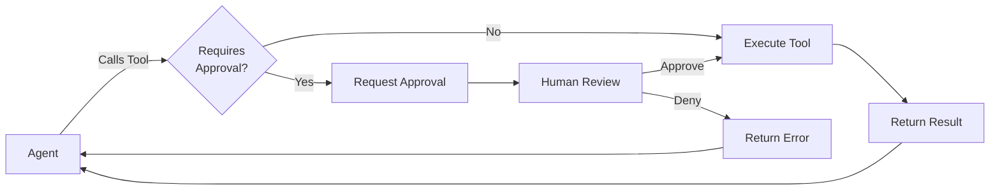
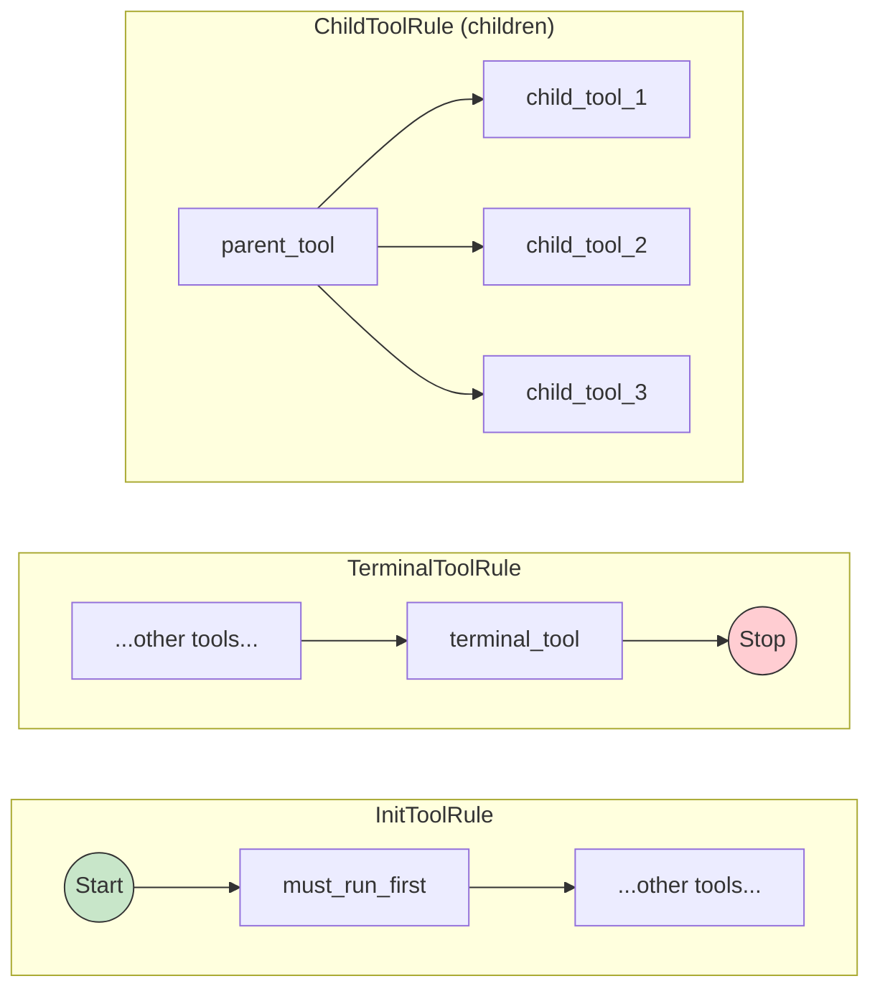

# Letta - Tools

**Pages:** 41

---

## Delete Mcp Server

**URL:** llms-txt#delete-mcp-server

**Contents:**
- OpenAPI Specification
- SDK Code Examples

DELETE https://api.letta.com/v1/mcp-servers/{mcp_server_id}

Delete an MCP server by its ID

Reference: https://docs.letta.com/api-reference/mcp-servers/mcp-delete-mcp-server

## OpenAPI Specification

**Examples:**

Example 1 (yaml):
```yaml
openapi: 3.1.1
info:
  title: Delete Mcp Server
  version: endpoint_mcpServers.mcp_delete_mcp_server
paths:
  /v1/mcp-servers/{mcp_server_id}:
    delete:
      operationId: mcp-delete-mcp-server
      summary: Delete Mcp Server
      description: Delete an MCP server by its ID
      tags:
        - - subpackage_mcpServers
      parameters:
        - name: mcp_server_id
          in: path
          required: true
          schema:
            type: string
        - name: Authorization
          in: header
          description: Header authentication of the form `Bearer <token>`
          required: true
          schema:
            type: string
      responses:
        '204':
          description: Successful Response
          content:
            application/json:
              schema:
                $ref: >-
                  #/components/schemas/mcp-servers_mcp_delete_mcp_server_Response_204
        '422':
          description: Validation Error
          content: {}
components:
  schemas:
    mcp-servers_mcp_delete_mcp_server_Response_204:
      type: object
      properties: {}
```

Example 2 (python):
```python
import requests

url = "https://api.letta.com/v1/mcp-servers/mcp_server_id"

headers = {"Authorization": "Bearer <token>"}

response = requests.delete(url, headers=headers)

print(response.json())
```

Example 3 (javascript):
```javascript
const url = 'https://api.letta.com/v1/mcp-servers/mcp_server_id';
const options = {method: 'DELETE', headers: {Authorization: 'Bearer <token>'}};

try {
  const response = await fetch(url, options);
  const data = await response.json();
  console.log(data);
} catch (error) {
  console.error(error);
}
```

Example 4 (go):
```go
package main

import (
	"fmt"
	"net/http"
	"io"
)

func main() {

	url := "https://api.letta.com/v1/mcp-servers/mcp_server_id"

	req, _ := http.NewRequest("DELETE", url, nil)

	req.Header.Add("Authorization", "Bearer <token>")

	res, _ := http.DefaultClient.Do(req)

	defer res.Body.Close()
	body, _ := io.ReadAll(res.Body)

	fmt.Println(res)
	fmt.Println(string(body))

}
```

---

## JSON Mode & Structured Output

**URL:** llms-txt#json-mode-&-structured-output

**Contents:**
- Quick Comparison
- Structured Generation through Tools (Recommended)
  - Creating a Structured Generation Tool
  - Using the Structured Generation Tool
- Using `response_format` for Provider-Native JSON Mode
  - Basic JSON Mode
  - Advanced JSON Schema Mode
- Updating Agent Response Format

> Get structured JSON responses from your Letta agents

Letta provides two ways to get structured JSON output from agents: **Structured Generation through Tools** (recommended) and the `response_format` parameter.

<Note>
  **Recommended**: Use **Structured Generation through Tools** - works with all providers (Anthropic, OpenAI, Google, etc.) and integrates naturally with Letta's tool-calling architecture.
</Note>

<Info>
  **Structured Generation through Tools**:

* ✅ Universal provider compatibility
  * ✅ Both reasoning AND structured output
  * ✅ Per-message control
  * ✅ Works even as "dummy tool" for pure formatting
</Info>

<Warning>
  **`response_format` parameter**:

* ⚠️ OpenAI-compatible providers only (NOT Anthropic)

* ⚠️ Persistent agent state (affects all future responses)

* ✅ Built-in provider schema enforcement
</Warning>

## Structured Generation through Tools (Recommended)

Create a tool that defines your desired response format. The tool arguments become your structured data, and you can extract them from the tool call.

### Creating a Structured Generation Tool

### Using the Structured Generation Tool

The agent will call the tool, and you can extract the structured arguments:

## Using `response_format` for Provider-Native JSON Mode

The `response_format` parameter enables structured output/JSON mode from LLM providers that support it. This approach is fundamentally different from tools because **`response_format` becomes a persistent part of the agent's state** - once set, all future responses from that agent will follow the format until explicitly changed.

Under the hood, `response_format` constrains the agent's assistant messages to follow the specified schema, but it doesn't affect tools - those continue to work normally with their original schemas.

<Warning>
  **Requirements for `response_format`:**

* Only works with providers that support structured outputs (like OpenAI) - NOT Anthropic or other providers
</Warning>

### Advanced JSON Schema Mode

For more precise control, you can use OpenAI's `json_schema` mode with strict validation:

With structured JSON schema, the agent's response will be strictly validated:

## Updating Agent Response Format

You can update an existing agent's response format:

**Examples:**

Example 1 (unknown):
```unknown

```

Example 2 (unknown):
```unknown
</CodeGroup>

### Using the Structured Generation Tool

<CodeGroup>
```

Example 3 (unknown):
```unknown

```

Example 4 (unknown):
```unknown
</CodeGroup>

The agent will call the tool, and you can extract the structured arguments:
```

---

## Update Mcp Server

**URL:** llms-txt#update-mcp-server

**Contents:**
- OpenAPI Specification
- SDK Code Examples

PATCH https://api.letta.com/v1/mcp-servers/{mcp_server_id}
Content-Type: application/json

Update an existing MCP server configuration

Reference: https://docs.letta.com/api-reference/mcp-servers/mcp-update-mcp-server

## OpenAPI Specification

**Examples:**

Example 1 (yaml):
```yaml
openapi: 3.1.1
info:
  title: Update Mcp Server
  version: endpoint_mcpServers.mcp_update_mcp_server
paths:
  /v1/mcp-servers/{mcp_server_id}:
    patch:
      operationId: mcp-update-mcp-server
      summary: Update Mcp Server
      description: Update an existing MCP server configuration
      tags:
        - - subpackage_mcpServers
      parameters:
        - name: mcp_server_id
          in: path
          required: true
          schema:
            type: string
        - name: Authorization
          in: header
          description: Header authentication of the form `Bearer <token>`
          required: true
          schema:
            type: string
      responses:
        '200':
          description: Successful Response
          content:
            application/json:
              schema:
                $ref: >-
                  #/components/schemas/mcp-servers_mcp_update_mcp_server_Response_200
        '422':
          description: Validation Error
          content: {}
      requestBody:
        content:
          application/json:
            schema:
              $ref: '#/components/schemas/mcp-servers_mcp_update_mcp_server_Request'
components:
  schemas:
    letta__schemas__mcp_server__UpdateStdioMCPServer:
      type: object
      properties:
        server_name:
          type:
            - string
            - 'null'
        command:
          type:
            - string
            - 'null'
        args:
          type:
            - array
            - 'null'
          items:
            type: string
        env:
          type:
            - object
            - 'null'
          additionalProperties:
            type: string
    letta__schemas__mcp_server__UpdateSSEMCPServer:
      type: object
      properties:
        server_name:
          type:
            - string
            - 'null'
        server_url:
          type:
            - string
            - 'null'
        auth_token:
          type:
            - string
            - 'null'
        token:
          type:
            - string
            - 'null'
        auth_header:
          type:
            - string
            - 'null'
        custom_headers:
          type:
            - object
            - 'null'
          additionalProperties:
            type: string
    letta__schemas__mcp_server__UpdateStreamableHTTPMCPServer:
      type: object
      properties:
        server_name:
          type:
            - string
            - 'null'
        server_url:
          type:
            - string
            - 'null'
        auth_token:
          type:
            - string
            - 'null'
        token:
          type:
            - string
            - 'null'
        auth_header:
          type:
            - string
            - 'null'
        custom_headers:
          type:
            - object
            - 'null'
          additionalProperties:
            type: string
    mcp-servers_mcp_update_mcp_server_Request:
      oneOf:
        - $ref: >-
            #/components/schemas/letta__schemas__mcp_server__UpdateStdioMCPServer
        - $ref: '#/components/schemas/letta__schemas__mcp_server__UpdateSSEMCPServer'
        - $ref: >-
            #/components/schemas/letta__schemas__mcp_server__UpdateStreamableHTTPMCPServer
    MCPServerType:
      type: string
      enum:
        - value: sse
        - value: stdio
        - value: streamable_http
    StdioMCPServer:
      type: object
      properties:
        server_name:
          type: string
        type:
          $ref: '#/components/schemas/MCPServerType'
        command:
          type: string
        args:
          type: array
          items:
            type: string
        env:
          type:
            - object
            - 'null'
          additionalProperties:
            type: string
        id:
          type: string
      required:
        - server_name
        - command
        - args
    SSEMCPServer:
      type: object
      properties:
        server_name:
          type: string
        type:
          $ref: '#/components/schemas/MCPServerType'
        server_url:
          type: string
        auth_header:
          type:
            - string
            - 'null'
        auth_token:
          type:
            - string
            - 'null'
        custom_headers:
          type:
            - object
            - 'null'
          additionalProperties:
            type: string
        id:
          type: string
      required:
        - server_name
        - server_url
    StreamableHTTPMCPServer:
      type: object
      properties:
        server_name:
          type: string
        type:
          $ref: '#/components/schemas/MCPServerType'
        server_url:
          type: string
        auth_header:
          type:
            - string
            - 'null'
        auth_token:
          type:
            - string
            - 'null'
        custom_headers:
          type:
            - object
            - 'null'
          additionalProperties:
            type: string
        id:
          type: string
      required:
        - server_name
        - server_url
    mcp-servers_mcp_update_mcp_server_Response_200:
      oneOf:
        - $ref: '#/components/schemas/StdioMCPServer'
        - $ref: '#/components/schemas/SSEMCPServer'
        - $ref: '#/components/schemas/StreamableHTTPMCPServer'
```

Example 2 (python):
```python
import requests

url = "https://api.letta.com/v1/mcp-servers/mcp_server_id"

payload = {}
headers = {
    "Authorization": "Bearer <token>",
    "Content-Type": "application/json"
}

response = requests.patch(url, json=payload, headers=headers)

print(response.json())
```

Example 3 (javascript):
```javascript
const url = 'https://api.letta.com/v1/mcp-servers/mcp_server_id';
const options = {
  method: 'PATCH',
  headers: {Authorization: 'Bearer <token>', 'Content-Type': 'application/json'},
  body: '{}'
};

try {
  const response = await fetch(url, options);
  const data = await response.json();
  console.log(data);
} catch (error) {
  console.error(error);
}
```

Example 4 (go):
```go
package main

import (
	"fmt"
	"strings"
	"net/http"
	"io"
)

func main() {

	url := "https://api.letta.com/v1/mcp-servers/mcp_server_id"

	payload := strings.NewReader("{}")

	req, _ := http.NewRequest("PATCH", url, payload)

	req.Header.Add("Authorization", "Bearer <token>")
	req.Header.Add("Content-Type", "application/json")

	res, _ := http.DefaultClient.Do(req)

	defer res.Body.Close()
	body, _ := io.ReadAll(res.Body)

	fmt.Println(res)
	fmt.Println(string(body))

}
```

---

## Add MCP Tool

**URL:** llms-txt#add-mcp-tool

**Contents:**
- OpenAPI Specification
- SDK Code Examples

POST https://api.letta.com/v1/tools/mcp/servers/{mcp_server_name}/{mcp_tool_name}

Register a new MCP tool as a Letta server by MCP server + tool name

Reference: https://docs.letta.com/api-reference/tools/add-mcp-tool

## OpenAPI Specification

**Examples:**

Example 1 (yaml):
```yaml
openapi: 3.1.1
info:
  title: Add MCP Tool
  version: endpoint_tools.add_mcp_tool
paths:
  /v1/tools/mcp/servers/{mcp_server_name}/{mcp_tool_name}:
    post:
      operationId: add-mcp-tool
      summary: Add MCP Tool
      description: Register a new MCP tool as a Letta server by MCP server + tool name
      tags:
        - - subpackage_tools
      parameters:
        - name: mcp_server_name
          in: path
          required: true
          schema:
            type: string
        - name: mcp_tool_name
          in: path
          required: true
          schema:
            type: string
        - name: Authorization
          in: header
          description: Header authentication of the form `Bearer <token>`
          required: true
          schema:
            type: string
      responses:
        '200':
          description: Successful Response
          content:
            application/json:
              schema:
                $ref: '#/components/schemas/Tool'
        '422':
          description: Validation Error
          content: {}
components:
  schemas:
    ToolType:
      type: string
      enum:
        - value: custom
        - value: letta_core
        - value: letta_memory_core
        - value: letta_multi_agent_core
        - value: letta_sleeptime_core
        - value: letta_voice_sleeptime_core
        - value: letta_builtin
        - value: letta_files_core
        - value: external_langchain
        - value: external_composio
        - value: external_mcp
    PipRequirement:
      type: object
      properties:
        name:
          type: string
        version:
          type:
            - string
            - 'null'
      required:
        - name
    NpmRequirement:
      type: object
      properties:
        name:
          type: string
        version:
          type:
            - string
            - 'null'
      required:
        - name
    Tool:
      type: object
      properties:
        id:
          type: string
        tool_type:
          $ref: '#/components/schemas/ToolType'
        description:
          type:
            - string
            - 'null'
        source_type:
          type:
            - string
            - 'null'
        name:
          type:
            - string
            - 'null'
        tags:
          type: array
          items:
            type: string
        source_code:
          type:
            - string
            - 'null'
        json_schema:
          type:
            - object
            - 'null'
          additionalProperties:
            description: Any type
        args_json_schema:
          type:
            - object
            - 'null'
          additionalProperties:
            description: Any type
        return_char_limit:
          type: integer
        pip_requirements:
          type:
            - array
            - 'null'
          items:
            $ref: '#/components/schemas/PipRequirement'
        npm_requirements:
          type:
            - array
            - 'null'
          items:
            $ref: '#/components/schemas/NpmRequirement'
        default_requires_approval:
          type:
            - boolean
            - 'null'
        enable_parallel_execution:
          type:
            - boolean
            - 'null'
        created_by_id:
          type:
            - string
            - 'null'
        last_updated_by_id:
          type:
            - string
            - 'null'
        metadata_:
          type:
            - object
            - 'null'
          additionalProperties:
            description: Any type
```

Example 2 (python):
```python
from letta_client import Letta

client = Letta(
    project="YOUR_PROJECT",
    token="YOUR_TOKEN",
)
client.tools.add_mcp_tool(
    mcp_server_name="mcp_server_name",
    mcp_tool_name="mcp_tool_name",
)
```

Example 3 (typescript):
```typescript
import { LettaClient } from "@letta-ai/letta-client";

const client = new LettaClient({ token: "YOUR_TOKEN", project: "YOUR_PROJECT" });
await client.tools.addMcpTool("mcp_server_name", "mcp_tool_name");
```

Example 4 (go):
```go
package main

import (
	"fmt"
	"net/http"
	"io"
)

func main() {

	url := "https://api.letta.com/v1/tools/mcp/servers/mcp_server_name/mcp_tool_name"

	req, _ := http.NewRequest("POST", url, nil)

	req.Header.Add("Authorization", "Bearer <token>")

	res, _ := http.DefaultClient.Do(req)

	defer res.Body.Close()
	body, _ := io.ReadAll(res.Body)

	fmt.Println(res)
	fmt.Println(string(body))

}
```

---

## Web Search

**URL:** llms-txt#web-search

**Contents:**
- Quick Start
  - Adding Web Search to an Agent
  - Usage Example
- Self-Hosted Setup
  - Get an API Key
  - Configuration Options
- Tool Parameters
  - Available Categories
  - Return Format
- Best Practices

> Search the internet in real-time with AI-powered search

The `web_search` tool enables Letta agents to search the internet for current information, research, and general knowledge using [Exa](https://exa.ai)'s AI-powered search engine.

<Info>
  On [Letta Cloud](/guides/cloud/overview), this tool works out of the box. For self-hosted deployments, you'll need to [configure an Exa API key](#self-hosted-setup).
</Info>

### Adding Web Search to an Agent

Your agent can now choose to use `web_search` when it needs current information.

For self-hosted Letta servers, you'll need an Exa API key.

1. Sign up at [dashboard.exa.ai](https://dashboard.exa.ai/)
2. Copy your API key
3. See [Exa pricing](https://docs.exa.ai) for rate limits and costs

### Configuration Options

The `web_search` tool supports advanced filtering and search customization:

| Parameter              | Type        | Default  | Description                                                       |
| ---------------------- | ----------- | -------- | ----------------------------------------------------------------- |
| `query`                | `str`       | Required | The search query to find relevant web content                     |
| `num_results`          | `int`       | 10       | Number of results to return (1-100)                               |
| `category`             | `str`       | None     | Focus search on specific content types (see below)                |
| `include_text`         | `bool`      | False    | Whether to retrieve full page content (usually overflows context) |
| `include_domains`      | `List[str]` | None     | List of domains to include in search results                      |
| `exclude_domains`      | `List[str]` | None     | List of domains to exclude from search results                    |
| `start_published_date` | `str`       | None     | Only return content published after this date (ISO format)        |
| `end_published_date`   | `str`       | None     | Only return content published before this date (ISO format)       |
| `user_location`        | `str`       | None     | Two-letter country code for localized results (e.g., "US")        |

### Available Categories

Use the `category` parameter to focus your search on specific content types:

| Category           | Best For                                      | Example Query                                |
| ------------------ | --------------------------------------------- | -------------------------------------------- |
| `company`          | Corporate information, company websites       | "Tesla energy storage solutions"             |
| `research paper`   | Academic papers, arXiv, research publications | "transformer architecture improvements 2025" |
| `news`             | News articles, current events                 | "latest AI policy developments"              |
| `pdf`              | PDF documents, reports, whitepapers           | "climate change impact assessment"           |
| `github`           | GitHub repositories, open source projects     | "python async web scraping libraries"        |
| `tweet`            | Twitter/X posts, social media discussions     | "reactions to new GPT release"               |
| `personal site`    | Blogs, personal websites, portfolios          | "machine learning tutorial blogs"            |
| `linkedin profile` | LinkedIn profiles, professional bios          | "AI research engineers at Google"            |
| `financial report` | Earnings reports, financial statements        | "Apple Q4 2024 earnings"                     |

The tool returns a JSON-encoded string containing:

### 1. Guide When to Search

Provide clear instructions to your agent about when web search is appropriate:

### 2. Combine with Archival Memory

Use web search for external/current information, and archival memory for your organization's internal data:

**Examples:**

Example 1 (unknown):
```unknown

```

Example 2 (unknown):
```unknown
</CodeGroup>

### Usage Example
```

Example 3 (unknown):
```unknown
Your agent can now choose to use `web_search` when it needs current information.

## Self-Hosted Setup

For self-hosted Letta servers, you'll need an Exa API key.

### Get an API Key

1. Sign up at [dashboard.exa.ai](https://dashboard.exa.ai/)
2. Copy your API key
3. See [Exa pricing](https://docs.exa.ai) for rate limits and costs

### Configuration Options

<CodeGroup>
```

Example 4 (unknown):
```unknown

```

---

## Test MCP Server

**URL:** llms-txt#test-mcp-server

**Contents:**
- OpenAPI Specification
- SDK Code Examples

POST https://api.letta.com/v1/tools/mcp/servers/test
Content-Type: application/json

Test connection to an MCP server without adding it.
Returns the list of available tools if successful.

Reference: https://docs.letta.com/api-reference/tools/test-mcp-server

## OpenAPI Specification

**Examples:**

Example 1 (yaml):
```yaml
openapi: 3.1.1
info:
  title: Test MCP Server
  version: endpoint_tools.test_mcp_server
paths:
  /v1/tools/mcp/servers/test:
    post:
      operationId: test-mcp-server
      summary: Test MCP Server
      description: |-
        Test connection to an MCP server without adding it.
        Returns the list of available tools if successful.
      tags:
        - - subpackage_tools
      parameters:
        - name: Authorization
          in: header
          description: Header authentication of the form `Bearer <token>`
          required: true
          schema:
            type: string
      responses:
        '200':
          description: Successful Response
          content:
            application/json:
              schema:
                description: Any type
        '422':
          description: Validation Error
          content: {}
      requestBody:
        content:
          application/json:
            schema:
              $ref: '#/components/schemas/tools_test_mcp_server_Request'
components:
  schemas:
    MCPServerType:
      type: string
      enum:
        - value: sse
        - value: stdio
        - value: streamable_http
    StdioServerConfig:
      type: object
      properties:
        server_name:
          type: string
        type:
          $ref: '#/components/schemas/MCPServerType'
        command:
          type: string
        args:
          type: array
          items:
            type: string
        env:
          type:
            - object
            - 'null'
          additionalProperties:
            type: string
      required:
        - server_name
        - command
        - args
    SSEServerConfig:
      type: object
      properties:
        server_name:
          type: string
        type:
          $ref: '#/components/schemas/MCPServerType'
        server_url:
          type: string
        auth_header:
          type:
            - string
            - 'null'
        auth_token:
          type:
            - string
            - 'null'
        custom_headers:
          type:
            - object
            - 'null'
          additionalProperties:
            type: string
      required:
        - server_name
        - server_url
    StreamableHTTPServerConfig:
      type: object
      properties:
        server_name:
          type: string
        type:
          $ref: '#/components/schemas/MCPServerType'
        server_url:
          type: string
        auth_header:
          type:
            - string
            - 'null'
        auth_token:
          type:
            - string
            - 'null'
        custom_headers:
          type:
            - object
            - 'null'
          additionalProperties:
            type: string
      required:
        - server_name
        - server_url
    tools_test_mcp_server_Request:
      oneOf:
        - $ref: '#/components/schemas/StdioServerConfig'
        - $ref: '#/components/schemas/SSEServerConfig'
        - $ref: '#/components/schemas/StreamableHTTPServerConfig'
```

Example 2 (python):
```python
from letta_client import Letta, StdioServerConfig

client = Letta(
    project="YOUR_PROJECT",
    token="YOUR_TOKEN",
)
client.tools.test_mcp_server(
    request=StdioServerConfig(
        server_name="server_name",
        command="command",
        args=["args"],
    ),
)
```

Example 3 (typescript):
```typescript
import { LettaClient } from "@letta-ai/letta-client";

const client = new LettaClient({ token: "YOUR_TOKEN", project: "YOUR_PROJECT" });
await client.tools.testMcpServer({
    serverName: "server_name",
    command: "command",
    args: ["args"]
});
```

Example 4 (go):
```go
package main

import (
	"fmt"
	"strings"
	"net/http"
	"io"
)

func main() {

	url := "https://api.letta.com/v1/tools/mcp/servers/test"

	payload := strings.NewReader("{\n  \"server_name\": \"string\",\n  \"command\": \"string\",\n  \"args\": [\n    \"string\"\n  ]\n}")

	req, _ := http.NewRequest("POST", url, payload)

	req.Header.Add("Authorization", "Bearer <token>")
	req.Header.Add("Content-Type", "application/json")

	res, _ := http.DefaultClient.Do(req)

	defer res.Body.Close()
	body, _ := io.ReadAll(res.Body)

	fmt.Println(res)
	fmt.Println(string(body))

}
```

---

## List MCP Servers

**URL:** llms-txt#list-mcp-servers

**Contents:**
- OpenAPI Specification
- SDK Code Examples

GET https://api.letta.com/v1/tools/mcp/servers

Get a list of all configured MCP servers

Reference: https://docs.letta.com/api-reference/tools/list-mcp-servers

## OpenAPI Specification

**Examples:**

Example 1 (yaml):
```yaml
openapi: 3.1.1
info:
  title: List MCP Servers
  version: endpoint_tools.list_mcp_servers
paths:
  /v1/tools/mcp/servers:
    get:
      operationId: list-mcp-servers
      summary: List MCP Servers
      description: Get a list of all configured MCP servers
      tags:
        - - subpackage_tools
      parameters:
        - name: Authorization
          in: header
          description: Header authentication of the form `Bearer <token>`
          required: true
          schema:
            type: string
      responses:
        '200':
          description: Successful Response
          content:
            application/json:
              schema:
                type: object
                additionalProperties:
                  $ref: >-
                    #/components/schemas/V1ToolsMcpServersGetResponsesContentApplicationJsonSchema
        '422':
          description: Validation Error
          content: {}
components:
  schemas:
    MCPServerType:
      type: string
      enum:
        - value: sse
        - value: stdio
        - value: streamable_http
    SSEServerConfig:
      type: object
      properties:
        server_name:
          type: string
        type:
          $ref: '#/components/schemas/MCPServerType'
        server_url:
          type: string
        auth_header:
          type:
            - string
            - 'null'
        auth_token:
          type:
            - string
            - 'null'
        custom_headers:
          type:
            - object
            - 'null'
          additionalProperties:
            type: string
      required:
        - server_name
        - server_url
    StdioServerConfig:
      type: object
      properties:
        server_name:
          type: string
        type:
          $ref: '#/components/schemas/MCPServerType'
        command:
          type: string
        args:
          type: array
          items:
            type: string
        env:
          type:
            - object
            - 'null'
          additionalProperties:
            type: string
      required:
        - server_name
        - command
        - args
    StreamableHTTPServerConfig:
      type: object
      properties:
        server_name:
          type: string
        type:
          $ref: '#/components/schemas/MCPServerType'
        server_url:
          type: string
        auth_header:
          type:
            - string
            - 'null'
        auth_token:
          type:
            - string
            - 'null'
        custom_headers:
          type:
            - object
            - 'null'
          additionalProperties:
            type: string
      required:
        - server_name
        - server_url
    V1ToolsMcpServersGetResponsesContentApplicationJsonSchema:
      oneOf:
        - $ref: '#/components/schemas/SSEServerConfig'
        - $ref: '#/components/schemas/StdioServerConfig'
        - $ref: '#/components/schemas/StreamableHTTPServerConfig'
```

Example 2 (python):
```python
from letta_client import Letta

client = Letta(
    project="YOUR_PROJECT",
    token="YOUR_TOKEN",
)
client.tools.list_mcp_servers()
```

Example 3 (typescript):
```typescript
import { LettaClient } from "@letta-ai/letta-client";

const client = new LettaClient({ token: "YOUR_TOKEN", project: "YOUR_PROJECT" });
await client.tools.listMcpServers();
```

Example 4 (go):
```go
package main

import (
	"fmt"
	"net/http"
	"io"
)

func main() {

	url := "https://api.letta.com/v1/tools/mcp/servers"

	req, _ := http.NewRequest("GET", url, nil)

	req.Header.Add("Authorization", "Bearer <token>")

	res, _ := http.DefaultClient.Do(req)

	defer res.Body.Close()
	body, _ := io.ReadAll(res.Body)

	fmt.Println(res)
	fmt.Println(string(body))

}
```

---

## Human-in-the-Loop

**URL:** llms-txt#human-in-the-loop

**Contents:**
- Overview
  - Key Benefits
  - How It Works
- Best Practices
  - 1. Selective Tool Marking
  - 2. Clear Denial Reasons

> How to integrate human-in-the-loop workflows for tool approval

<Warning>
  Human-in-the-Loop support is experimental and may be unstable. For more information, visit our [Discord](https://discord.gg/letta).
</Warning>

Human-in-the-loop (HITL) workflows allow you to maintain control over critical agent actions by requiring human approval before executing certain tools. This is essential for operations that could have significant consequences, such as database modifications, financial transactions, or external API calls with cost implications.

When a tool is marked as requiring approval, the agent will pause execution and wait for human approval or denial before proceeding. This creates a checkpoint in the agent's workflow where human judgment can be applied. The approval workflow is designed to be non-blocking and supports both synchronous and streaming message interfaces, making it suitable for interactive applications as well as batch processing systems.

* **Risk Mitigation**: Prevent unintended actions in production environments
* **Cost Control**: Review expensive operations before execution
* **Compliance**: Ensure human oversight for regulated operations
* **Quality Assurance**: Validate agent decisions before critical actions

The approval workflow follows a clear sequence of steps that ensures human oversight at critical decision points:

1. **Tool Configuration**: Mark specific tools as requiring approval either globally (default for all agents) or per-agent
2. **Execution Pause**: When the agent attempts to call a protected tool, it immediately pauses and returns an approval request message
3. **Human Review**: The approval request includes the tool name, arguments, and context, allowing you to make an informed decision
4. **Approval/Denial**: Send an approval response to either execute the tool or provide feedback for the agent to adjust its approach
5. **Continuation**: The agent receives the tool result (on approval) or an error message (on denial) and continues processing

Following these best practices will help you implement effective human-in-the-loop workflows while maintaining a good user experience and system performance.

### 1. Selective Tool Marking

Not every tool needs human approval. Be strategic about which tools require oversight to avoid workflow bottlenecks while maintaining necessary controls:

**Tools that typically require approval:**

* Database write operations (INSERT, UPDATE, DELETE)
* External API calls with financial implications
* File system modifications or deletions
* Communication tools (email, SMS, notifications)
* System configuration changes
* Third-party service integrations with rate limits

### 2. Clear Denial Reasons

When denying a request, your feedback directly influences how the agent adjusts its approach. Provide specific, actionable guidance rather than vague rejections:

**Examples:**

Example 1 (mermaid):


---

## Update MCP Server

**URL:** llms-txt#update-mcp-server

**Contents:**
- OpenAPI Specification
- SDK Code Examples

PATCH https://api.letta.com/v1/tools/mcp/servers/{mcp_server_name}
Content-Type: application/json

Update an existing MCP server configuration

Reference: https://docs.letta.com/api-reference/tools/update-mcp-server

## OpenAPI Specification

**Examples:**

Example 1 (yaml):
```yaml
openapi: 3.1.1
info:
  title: Update MCP Server
  version: endpoint_tools.update_mcp_server
paths:
  /v1/tools/mcp/servers/{mcp_server_name}:
    patch:
      operationId: update-mcp-server
      summary: Update MCP Server
      description: Update an existing MCP server configuration
      tags:
        - - subpackage_tools
      parameters:
        - name: mcp_server_name
          in: path
          required: true
          schema:
            type: string
        - name: Authorization
          in: header
          description: Header authentication of the form `Bearer <token>`
          required: true
          schema:
            type: string
      responses:
        '200':
          description: Successful Response
          content:
            application/json:
              schema:
                $ref: '#/components/schemas/tools_update_mcp_server_Response_200'
        '422':
          description: Validation Error
          content: {}
      requestBody:
        content:
          application/json:
            schema:
              $ref: '#/components/schemas/tools_update_mcp_server_Request'
components:
  schemas:
    MCPServerType:
      type: string
      enum:
        - value: sse
        - value: stdio
        - value: streamable_http
    StdioServerConfig:
      type: object
      properties:
        server_name:
          type: string
        type:
          $ref: '#/components/schemas/MCPServerType'
        command:
          type: string
        args:
          type: array
          items:
            type: string
        env:
          type:
            - object
            - 'null'
          additionalProperties:
            type: string
      required:
        - server_name
        - command
        - args
    letta__schemas__mcp__UpdateStdioMCPServer:
      type: object
      properties:
        server_name:
          type:
            - string
            - 'null'
        stdio_config:
          oneOf:
            - $ref: '#/components/schemas/StdioServerConfig'
            - type: 'null'
    letta__schemas__mcp__UpdateSSEMCPServer:
      type: object
      properties:
        server_name:
          type:
            - string
            - 'null'
        server_url:
          type:
            - string
            - 'null'
        token:
          type:
            - string
            - 'null'
        custom_headers:
          type:
            - object
            - 'null'
          additionalProperties:
            type: string
    letta__schemas__mcp__UpdateStreamableHTTPMCPServer:
      type: object
      properties:
        server_name:
          type:
            - string
            - 'null'
        server_url:
          type:
            - string
            - 'null'
        auth_header:
          type:
            - string
            - 'null'
        auth_token:
          type:
            - string
            - 'null'
        custom_headers:
          type:
            - object
            - 'null'
          additionalProperties:
            type: string
    tools_update_mcp_server_Request:
      oneOf:
        - $ref: '#/components/schemas/letta__schemas__mcp__UpdateStdioMCPServer'
        - $ref: '#/components/schemas/letta__schemas__mcp__UpdateSSEMCPServer'
        - $ref: >-
            #/components/schemas/letta__schemas__mcp__UpdateStreamableHTTPMCPServer
    SSEServerConfig:
      type: object
      properties:
        server_name:
          type: string
        type:
          $ref: '#/components/schemas/MCPServerType'
        server_url:
          type: string
        auth_header:
          type:
            - string
            - 'null'
        auth_token:
          type:
            - string
            - 'null'
        custom_headers:
          type:
            - object
            - 'null'
          additionalProperties:
            type: string
      required:
        - server_name
        - server_url
    StreamableHTTPServerConfig:
      type: object
      properties:
        server_name:
          type: string
        type:
          $ref: '#/components/schemas/MCPServerType'
        server_url:
          type: string
        auth_header:
          type:
            - string
            - 'null'
        auth_token:
          type:
            - string
            - 'null'
        custom_headers:
          type:
            - object
            - 'null'
          additionalProperties:
            type: string
      required:
        - server_name
        - server_url
    tools_update_mcp_server_Response_200:
      oneOf:
        - $ref: '#/components/schemas/StdioServerConfig'
        - $ref: '#/components/schemas/SSEServerConfig'
        - $ref: '#/components/schemas/StreamableHTTPServerConfig'
```

Example 2 (python):
```python
from letta_client import Letta, UpdateStdioMcpServer

client = Letta(
    project="YOUR_PROJECT",
    token="YOUR_TOKEN",
)
client.tools.update_mcp_server(
    mcp_server_name="mcp_server_name",
    request=UpdateStdioMcpServer(),
)
```

Example 3 (typescript):
```typescript
import { LettaClient, Letta } from "@letta-ai/letta-client";

const client = new LettaClient({ token: "YOUR_TOKEN", project: "YOUR_PROJECT" });
await client.tools.updateMcpServer("mcp_server_name", {});
```

Example 4 (go):
```go
package main

import (
	"fmt"
	"strings"
	"net/http"
	"io"
)

func main() {

	url := "https://api.letta.com/v1/tools/mcp/servers/mcp_server_name"

	payload := strings.NewReader("{}")

	req, _ := http.NewRequest("PATCH", url, payload)

	req.Header.Add("Authorization", "Bearer <token>")
	req.Header.Add("Content-Type", "application/json")

	res, _ := http.DefaultClient.Do(req)

	defer res.Body.Close()
	body, _ := io.ReadAll(res.Body)

	fmt.Println(res)
	fmt.Println(string(body))

}
```

---

## Fetch Webpage

**URL:** llms-txt#fetch-webpage

**Contents:**
- Quick Start
- Tool Parameters
- Return Format
- How It Works
- Self-Hosted Setup
  - Optional: Configure Exa
- Common Patterns
  - Documentation Reader
  - Research Assistant
  - Content Summarizer

> Convert webpages to readable text/markdown

The `fetch_webpage` tool enables Letta agents to fetch and convert webpages into readable text or markdown format. Useful for reading documentation, articles, and web content.

<Info>
  On [Letta Cloud](/guides/cloud/overview), this tool works out of the box. For self-hosted deployments with an Exa API key, fetching is enhanced. Without a key, it falls back to open-source extraction tools.
</Info>

| Parameter | Type  | Description                     |
| --------- | ----- | ------------------------------- |
| `url`     | `str` | The URL of the webpage to fetch |

The tool returns webpage content as text/markdown.

**With Exa API (if configured):**

**Fallback (without Exa):**
Returns markdown-formatted text extracted from the HTML.

The tool uses a multi-tier approach:

1. **Exa API** (if `EXA_API_KEY` is configured): Uses Exa's content extraction
2. **Trafilatura** (fallback): Open-source text extraction to markdown
3. **Readability + html2text** (final fallback): HTML cleaning and conversion

For enhanced fetching on self-hosted servers, optionally configure an Exa API key. Without it, the tool still works using open-source extraction.

### Optional: Configure Exa

### Documentation Reader

### Research Assistant

### Content Summarizer

| Use Case              | Tool                                  | Why                |
| --------------------- | ------------------------------------- | ------------------ |
| Read specific webpage | `fetch_webpage`                       | Direct URL access  |
| Find webpages to read | `web_search`                          | Discovery first    |
| Read + search in one  | `web_search` with `include_text=true` | Combined operation |
| Multiple pages        | `fetch_webpage`                       | Iterate over URLs  |

## Related Documentation

* [Utilities Overview](/guides/agents/prebuilt-tools)
* [Web Search](/guides/agents/web-search)
* [Run Code](/guides/agents/run-code)
* [Custom Tools](/guides/agents/custom-tools)
* [Tool Variables](/guides/agents/tool-variables)

**Examples:**

Example 1 (unknown):
```unknown

```

Example 2 (unknown):
```unknown
</CodeGroup>

## Tool Parameters

| Parameter | Type  | Description                     |
| --------- | ----- | ------------------------------- |
| `url`     | `str` | The URL of the webpage to fetch |

## Return Format

The tool returns webpage content as text/markdown.

**With Exa API (if configured):**
```

Example 3 (unknown):
```unknown
**Fallback (without Exa):**
Returns markdown-formatted text extracted from the HTML.

## How It Works

The tool uses a multi-tier approach:

1. **Exa API** (if `EXA_API_KEY` is configured): Uses Exa's content extraction
2. **Trafilatura** (fallback): Open-source text extraction to markdown
3. **Readability + html2text** (final fallback): HTML cleaning and conversion

## Self-Hosted Setup

For enhanced fetching on self-hosted servers, optionally configure an Exa API key. Without it, the tool still works using open-source extraction.

### Optional: Configure Exa

<CodeGroup>
```

Example 4 (unknown):
```unknown

```

---

## Select "attach new tools" button

**URL:** llms-txt#select-"attach-new-tools"-button

---

## Connect Mcp Server

**URL:** llms-txt#connect-mcp-server

**Contents:**
- OpenAPI Specification
- SDK Code Examples

GET https://api.letta.com/v1/mcp-servers/connect/{mcp_server_id}

Connect to an MCP server with support for OAuth via SSE.
Returns a stream of events handling authorization state and exchange if OAuth is required.

Reference: https://docs.letta.com/api-reference/mcp-servers/mcp-connect-mcp-server

## OpenAPI Specification

**Examples:**

Example 1 (yaml):
```yaml
openapi: 3.1.1
info:
  title: Connect Mcp Server
  version: endpoint_mcpServers.mcp_connect_mcp_server
paths:
  /v1/mcp-servers/connect/{mcp_server_id}:
    get:
      operationId: mcp-connect-mcp-server
      summary: Connect Mcp Server
      description: >-
        Connect to an MCP server with support for OAuth via SSE.

        Returns a stream of events handling authorization state and exchange if
        OAuth is required.
      tags:
        - - subpackage_mcpServers
      parameters:
        - name: mcp_server_id
          in: path
          required: true
          schema:
            type: string
        - name: Authorization
          in: header
          description: Header authentication of the form `Bearer <token>`
          required: true
          schema:
            type: string
      responses:
        '200':
          description: Successful response
          content:
            application/json:
              schema:
                description: Any type
        '422':
          description: Validation Error
          content: {}
```

Example 2 (python):
```python
import requests

url = "https://api.letta.com/v1/mcp-servers/connect/mcp_server_id"

headers = {"Authorization": "Bearer <token>"}

response = requests.get(url, headers=headers)

print(response.json())
```

Example 3 (javascript):
```javascript
const url = 'https://api.letta.com/v1/mcp-servers/connect/mcp_server_id';
const options = {method: 'GET', headers: {Authorization: 'Bearer <token>'}};

try {
  const response = await fetch(url, options);
  const data = await response.json();
  console.log(data);
} catch (error) {
  console.error(error);
}
```

Example 4 (go):
```go
package main

import (
	"fmt"
	"net/http"
	"io"
)

func main() {

	url := "https://api.letta.com/v1/mcp-servers/connect/mcp_server_id"

	req, _ := http.NewRequest("GET", url, nil)

	req.Header.Add("Authorization", "Bearer <token>")

	res, _ := http.DefaultClient.Do(req)

	defer res.Body.Close()
	body, _ := io.ReadAll(res.Body)

	fmt.Println(res)
	fmt.Println(string(body))

}
```

---

## Utilities

**URL:** llms-txt#utilities

**Contents:**
- Available Utilities
  - [Web Search](/guides/agents/web-search)
  - [Code Interpreter](/guides/agents/run-code)
  - [Fetch Webpage](/guides/agents/fetch-webpage)
- Related Documentation

> Pre-built tools for web access, code execution, and data fetching

Letta provides pre-built tools that enable agents to search the web, execute code, and fetch webpage content.

## Available Utilities

### [Web Search](/guides/agents/web-search)

Search the internet in real-time using [Exa](https://exa.ai)'s AI-powered search engine.

* AI-powered semantic search
* Category filtering (news, research papers, PDFs, etc.)
* Domain filtering
* Date range filtering
* Highlights and AI-generated summaries

**Setup:** Works out of the box on Letta Cloud. Self-hosted requires `EXA_API_KEY`.

[Read full documentation →](/guides/agents/web-search)

### [Code Interpreter](/guides/agents/run-code)

Execute code in a secure sandbox with full network access.

* Python with 191+ pre-installed packages (numpy, pandas, scipy, etc.)
* JavaScript, TypeScript, R, and Java support
* Full network access for API calls
* Fresh environment per execution (no state persistence)

**Setup:** Works out of the box on Letta Cloud. Self-hosted requires `E2B_API_KEY`.

[Read full documentation →](/guides/agents/run-code)

### [Fetch Webpage](/guides/agents/fetch-webpage)

Fetch and convert webpages to readable text/markdown.

* Converts HTML to clean markdown
* Extracts article content
* Multiple fallback extraction methods
* Optional Exa integration for enhanced extraction

**Setup:** Works out of the box everywhere. Optional `EXA_API_KEY` for enhanced extraction.

[Read full documentation →](/guides/agents/fetch-webpage)

## Related Documentation

* [Custom Tools](/guides/agents/custom-tools)
* [Tool Variables](/guides/agents/tool-variables)
* [Model Context Protocol](/guides/mcp/overview)

**Examples:**

Example 1 (python):
```python
agent = client.agents.create(
    tools=["web_search"],
    memory_blocks=[{
        "label": "persona",
        "value": "I use web_search for current events and external research."
    }]
)
```

Example 2 (python):
```python
agent = client.agents.create(
    tools=["run_code"],
    memory_blocks=[{
        "label": "persona",
        "value": "I use Python for data analysis and API calls."
    }]
)
```

Example 3 (python):
```python
agent = client.agents.create(
    tools=["fetch_webpage"],
    memory_blocks=[{
        "label": "persona",
        "value": "I fetch and read webpages to answer questions."
    }]
)
```

---

## Add MCP Server To Config

**URL:** llms-txt#add-mcp-server-to-config

**Contents:**
- OpenAPI Specification
- SDK Code Examples

PUT https://api.letta.com/v1/tools/mcp/servers
Content-Type: application/json

Add a new MCP server to the Letta MCP server config

Reference: https://docs.letta.com/api-reference/tools/add-mcp-server

## OpenAPI Specification

**Examples:**

Example 1 (yaml):
```yaml
openapi: 3.1.1
info:
  title: Add MCP Server To Config
  version: endpoint_tools.add_mcp_server
paths:
  /v1/tools/mcp/servers:
    put:
      operationId: add-mcp-server
      summary: Add MCP Server To Config
      description: Add a new MCP server to the Letta MCP server config
      tags:
        - - subpackage_tools
      parameters:
        - name: Authorization
          in: header
          description: Header authentication of the form `Bearer <token>`
          required: true
          schema:
            type: string
      responses:
        '200':
          description: Successful Response
          content:
            application/json:
              schema:
                type: array
                items:
                  $ref: >-
                    #/components/schemas/V1ToolsMcpServersPutResponsesContentApplicationJsonSchemaItems
        '422':
          description: Validation Error
          content: {}
      requestBody:
        content:
          application/json:
            schema:
              $ref: '#/components/schemas/tools_add_mcp_server_Request'
components:
  schemas:
    MCPServerType:
      type: string
      enum:
        - value: sse
        - value: stdio
        - value: streamable_http
    StdioServerConfig:
      type: object
      properties:
        server_name:
          type: string
        type:
          $ref: '#/components/schemas/MCPServerType'
        command:
          type: string
        args:
          type: array
          items:
            type: string
        env:
          type:
            - object
            - 'null'
          additionalProperties:
            type: string
      required:
        - server_name
        - command
        - args
    SSEServerConfig:
      type: object
      properties:
        server_name:
          type: string
        type:
          $ref: '#/components/schemas/MCPServerType'
        server_url:
          type: string
        auth_header:
          type:
            - string
            - 'null'
        auth_token:
          type:
            - string
            - 'null'
        custom_headers:
          type:
            - object
            - 'null'
          additionalProperties:
            type: string
      required:
        - server_name
        - server_url
    StreamableHTTPServerConfig:
      type: object
      properties:
        server_name:
          type: string
        type:
          $ref: '#/components/schemas/MCPServerType'
        server_url:
          type: string
        auth_header:
          type:
            - string
            - 'null'
        auth_token:
          type:
            - string
            - 'null'
        custom_headers:
          type:
            - object
            - 'null'
          additionalProperties:
            type: string
      required:
        - server_name
        - server_url
    tools_add_mcp_server_Request:
      oneOf:
        - $ref: '#/components/schemas/StdioServerConfig'
        - $ref: '#/components/schemas/SSEServerConfig'
        - $ref: '#/components/schemas/StreamableHTTPServerConfig'
    V1ToolsMcpServersPutResponsesContentApplicationJsonSchemaItems:
      oneOf:
        - $ref: '#/components/schemas/StdioServerConfig'
        - $ref: '#/components/schemas/SSEServerConfig'
        - $ref: '#/components/schemas/StreamableHTTPServerConfig'
```

Example 2 (python):
```python
from letta_client import Letta, StdioServerConfig

client = Letta(
    project="YOUR_PROJECT",
    token="YOUR_TOKEN",
)
client.tools.add_mcp_server(
    request=StdioServerConfig(
        server_name="server_name",
        command="command",
        args=["args"],
    ),
)
```

Example 3 (typescript):
```typescript
import { LettaClient } from "@letta-ai/letta-client";

const client = new LettaClient({ token: "YOUR_TOKEN", project: "YOUR_PROJECT" });
await client.tools.addMcpServer({
    serverName: "server_name",
    command: "command",
    args: ["args"]
});
```

Example 4 (go):
```go
package main

import (
	"fmt"
	"strings"
	"net/http"
	"io"
)

func main() {

	url := "https://api.letta.com/v1/tools/mcp/servers"

	payload := strings.NewReader("{\n  \"server_name\": \"string\",\n  \"command\": \"string\",\n  \"args\": [\n    \"string\"\n  ]\n}")

	req, _ := http.NewRequest("PUT", url, payload)

	req.Header.Add("Authorization", "Bearer <token>")
	req.Header.Add("Content-Type", "application/json")

	res, _ := http.DefaultClient.Do(req)

	defer res.Body.Close()
	body, _ := io.ReadAll(res.Body)

	fmt.Println(res)
	fmt.Println(string(body))

}
```

---

## Refresh Mcp Server Tools

**URL:** llms-txt#refresh-mcp-server-tools

**Contents:**
- OpenAPI Specification
- SDK Code Examples

PATCH https://api.letta.com/v1/mcp-servers/{mcp_server_id}/refresh

Refresh tools for an MCP server by:
1. Fetching current tools from the MCP server
2. Deleting tools that no longer exist on the server
3. Updating schemas for existing tools
4. Adding new tools from the server

Returns a summary of changes made.

Reference: https://docs.letta.com/api-reference/mcp-servers/mcp-refresh-mcp-server-tools

## OpenAPI Specification

**Examples:**

Example 1 (yaml):
```yaml
openapi: 3.1.1
info:
  title: Refresh Mcp Server Tools
  version: endpoint_mcpServers.mcp_refresh_mcp_server_tools
paths:
  /v1/mcp-servers/{mcp_server_id}/refresh:
    patch:
      operationId: mcp-refresh-mcp-server-tools
      summary: Refresh Mcp Server Tools
      description: |-
        Refresh tools for an MCP server by:
        1. Fetching current tools from the MCP server
        2. Deleting tools that no longer exist on the server
        3. Updating schemas for existing tools
        4. Adding new tools from the server

        Returns a summary of changes made.
      tags:
        - - subpackage_mcpServers
      parameters:
        - name: mcp_server_id
          in: path
          required: true
          schema:
            type: string
        - name: agent_id
          in: query
          required: false
          schema:
            type:
              - string
              - 'null'
        - name: Authorization
          in: header
          description: Header authentication of the form `Bearer <token>`
          required: true
          schema:
            type: string
      responses:
        '200':
          description: Successful Response
          content:
            application/json:
              schema:
                description: Any type
        '422':
          description: Validation Error
          content: {}
```

Example 2 (python):
```python
import requests

url = "https://api.letta.com/v1/mcp-servers/mcp_server_id/refresh"

headers = {"Authorization": "Bearer <token>"}

response = requests.patch(url, headers=headers)

print(response.json())
```

Example 3 (javascript):
```javascript
const url = 'https://api.letta.com/v1/mcp-servers/mcp_server_id/refresh';
const options = {method: 'PATCH', headers: {Authorization: 'Bearer <token>'}};

try {
  const response = await fetch(url, options);
  const data = await response.json();
  console.log(data);
} catch (error) {
  console.error(error);
}
```

Example 4 (go):
```go
package main

import (
	"fmt"
	"net/http"
	"io"
)

func main() {

	url := "https://api.letta.com/v1/mcp-servers/mcp_server_id/refresh"

	req, _ := http.NewRequest("PATCH", url, nil)

	req.Header.Add("Authorization", "Bearer <token>")

	res, _ := http.DefaultClient.Do(req)

	defer res.Body.Close()
	body, _ := io.ReadAll(res.Body)

	fmt.Println(res)
	fmt.Println(string(body))

}
```

---

## List MCP Tools By Server

**URL:** llms-txt#list-mcp-tools-by-server

**Contents:**
- OpenAPI Specification
- SDK Code Examples

GET https://api.letta.com/v1/tools/mcp/servers/{mcp_server_name}/tools

Get a list of all tools for a specific MCP server

Reference: https://docs.letta.com/api-reference/tools/list-mcp-tools-by-server

## OpenAPI Specification

**Examples:**

Example 1 (yaml):
```yaml
openapi: 3.1.1
info:
  title: List MCP Tools By Server
  version: endpoint_tools.list_mcp_tools_by_server
paths:
  /v1/tools/mcp/servers/{mcp_server_name}/tools:
    get:
      operationId: list-mcp-tools-by-server
      summary: List MCP Tools By Server
      description: Get a list of all tools for a specific MCP server
      tags:
        - - subpackage_tools
      parameters:
        - name: mcp_server_name
          in: path
          required: true
          schema:
            type: string
        - name: Authorization
          in: header
          description: Header authentication of the form `Bearer <token>`
          required: true
          schema:
            type: string
      responses:
        '200':
          description: Successful Response
          content:
            application/json:
              schema:
                type: array
                items:
                  $ref: '#/components/schemas/MCPTool'
        '422':
          description: Validation Error
          content: {}
components:
  schemas:
    ToolAnnotations:
      type: object
      properties:
        title:
          type:
            - string
            - 'null'
        readOnlyHint:
          type:
            - boolean
            - 'null'
        destructiveHint:
          type:
            - boolean
            - 'null'
        idempotentHint:
          type:
            - boolean
            - 'null'
        openWorldHint:
          type:
            - boolean
            - 'null'
    MCPToolHealth:
      type: object
      properties:
        status:
          type: string
        reasons:
          type: array
          items:
            type: string
      required:
        - status
    MCPTool:
      type: object
      properties:
        name:
          type: string
        title:
          type:
            - string
            - 'null'
        description:
          type:
            - string
            - 'null'
        inputSchema:
          type: object
          additionalProperties:
            description: Any type
        outputSchema:
          type:
            - object
            - 'null'
          additionalProperties:
            description: Any type
        annotations:
          oneOf:
            - $ref: '#/components/schemas/ToolAnnotations'
            - type: 'null'
        _meta:
          type:
            - object
            - 'null'
          additionalProperties:
            description: Any type
        health:
          oneOf:
            - $ref: '#/components/schemas/MCPToolHealth'
            - type: 'null'
      required:
        - name
        - inputSchema
```

Example 2 (python):
```python
from letta_client import Letta

client = Letta(
    project="YOUR_PROJECT",
    token="YOUR_TOKEN",
)
client.tools.list_mcp_tools_by_server(
    mcp_server_name="mcp_server_name",
)
```

Example 3 (typescript):
```typescript
import { LettaClient } from "@letta-ai/letta-client";

const client = new LettaClient({ token: "YOUR_TOKEN", project: "YOUR_PROJECT" });
await client.tools.listMcpToolsByServer("mcp_server_name");
```

Example 4 (go):
```go
package main

import (
	"fmt"
	"net/http"
	"io"
)

func main() {

	url := "https://api.letta.com/v1/tools/mcp/servers/mcp_server_name/tools"

	req, _ := http.NewRequest("GET", url, nil)

	req.Header.Add("Authorization", "Bearer <token>")

	res, _ := http.DefaultClient.Do(req)

	defer res.Body.Close()
	body, _ := io.ReadAll(res.Body)

	fmt.Println(res)
	fmt.Println(string(body))

}
```

---

## Bad: Too vague

**URL:** llms-txt#bad:-too-vague

**Contents:**
- Setting Up Approval Requirements
  - Method 1: Create/Upsert Tool with Default Approval Requirement
  - Method 2: Modify Existing Tool with Default Approval Requirement
  - Method 3: Per-Agent Tool Approval
- Handling Approval Requests
  - Step 1: Agent Requests Approval
  - Step 2: Review and Respond
  - Streaming + Background Mode
  - IDs and UI Triggers

"reason": "Don't do that"
curl curl maxLines=50
  curl --request POST \
    --url http://localhost:8283/v1/tools \
    --header 'Content-Type: application/json' \
    --data '{
      "name": "sensitive_operation",
      "default_requires_approval": true,
      "json_schema": {
        "type": "function",
        "function": {
          "name": "sensitive_operation",
          "parameters": {...}
        }
      },
      "source_code": "def sensitive_operation(...): ..."
    }'

# All agents using this tool will require approval
  curl --request POST \
    --url http://localhost:8283/v1/agents \
    --header 'Content-Type: application/json' \
    --data '{
     "tools": ["sensitive_operation"],
     // ... other configuration
    }'
  python python maxLines=50
  # Create a tool that requires approval by default
  approval_tool = client.tools.upsert_from_function(
      func=sensitive_operation,
      default_requires_approval=True,
  )

# All agents using this tool will require approval
  agent = client.agents.create(
      tools=['sensitive_operation'],
      # ... other configuration
  )
  typescript TypeScript maxLines=50
  // Create a tool that requires approval by default
  const approvalTool = await client.tools.upsert({
      name: "sensitive_operation",
      defaultRequiresApproval: true,
      jsonSchema: {
          type: "function",
          function: {
              name: "sensitive_operation",
              parameters: {...}
          }
      },
      sourceCode: "def sensitive_operation(...): ..."
  });

// All agents using this tool will require approval
  const agent = await client.agents.create({
      tools: ["sensitive_operation"],
      // ... other configuration
  });
  curl curl maxLines=50
  curl --request PATCH \
    --url http://localhost:8283/v1/tools/$TOOL_ID \
    --header 'Content-Type: application/json' \
    --data '{
      "default_requires_approval": true
    }'

# All agents using this tool will require approval
  curl --request POST \
    --url http://localhost:8283/v1/agents \
    --header 'Content-Type: application/json' \
    --data '{
     "tools": ["sensitive_operation"],
     // ... other configuration
    }'
  python python maxLines=50
  # Create a tool that requires approval by default
  approval_tool = client.tools.modify(
      tool_id=sensitive_operation.id,
      default_requires_approval=True,
  )

# All agents using this tool will require approval
  agent = client.agents.create(
      tools=['sensitive_operation'],
      # ... other configuration
  )
  typescript TypeScript maxLines=50
  // Create a tool that requires approval by default
  const approvalTool = await client.tools.modify({
      tool_id=sensitive_operation.id,
      defaultRequiresApproval: true,
  });

// All agents using this tool will require approval
  const agent = await client.agents.create({
      tools: ["sensitive_operation"],
      // ... other configuration
  });
  curl curl maxLines=50
  curl --request PATCH \
    --url http://localhost:8283/v1/agents/$AGENT_ID/tools/$TOOL_NAME/approval \
    --header 'Content-Type: application/json' \
    --data '{
      "requires_approval": true
    }'
  python python maxLines=50
  # Modify approval requirement for a specific agent
  client.agents.tools.modify_approval(
      agent_id=agent.id,
      tool_name="database_write",
      requires_approval=True,
  )

# Check current approval settings
  tools = client.agents.tools.list(agent_id=agent.id)
  for tool in tools:
      print(f"{tool.name}: requires_approval={tool.requires_approval}")
  typescript TypeScript maxLines=50
  // Modify approval requirement for a specific agent
  await client.agents.tools.modifyApproval({
      agentId: agent.id,
      toolName: "database_write",
      requiresApproval: true,
  });

// Check current approval settings
  const tools = await client.agents.tools.list({
      agentId: agent.id,
  });
  for (const tool of tools) {
      console.log(`${tool.name}: requires_approval=${tool.requiresApproval}`);
  }
  curl curl maxLines=50
  curl --request POST \
    --url http://localhost:8283/v1/agents/$AGENT_ID/messages \
    --header 'Content-Type: application/json' \
    --data '{
      "messages": [{
        "role": "user",
        "content": "Delete all test data from the database"
      }]
    }'

# Response includes approval request
  {
    "messages": [
      {
        "message_type": "reasoning_message",
        "reasoning": "I need to delete test data from the database..."
      },
      {
        "message_type": "approval_request_message",
        "id": "message-abc123",
        "tool_call": {
          "name": "database_write",
          "arguments": "{\"query\": \"DELETE FROM test_data\"}",
          "tool_call_id": "tool-xyz789"
        }
      }
    ],
    "stop_reason": "requires_approval"
  }
  python python maxLines=50
  response = client.agents.messages.create(
      agent_id=agent.id,
      messages=[{
          "role": "user",
          "content": "Delete all test data from the database"
      }]
  )

# Response includes approval request
  {
    "messages": [
      {
        "message_type": "reasoning_message",
        "reasoning": "I need to delete test data from the database..."
      },
      {
        "message_type": "approval_request_message",
        "id": "message-abc123",
        "tool_call": {
          "name": "database_write",
          "arguments": "{\"query\": \"DELETE FROM test_data\"}",
          "tool_call_id": "tool-xyz789"
        }
      }
    ],
    "stop_reason": "requires_approval"
  }
  typescript TypeScript maxLines=50
  const response = await client.agents.messages.create({
      agentId: agent.id,
      requestBody: {
          messages: [{
              role: "user",
              content: "Delete all test data from the database"
          }]
      }
  });

// Response includes approval request
  {
    "messages": [
      {
        "message_type": "reasoning_message",
        "reasoning": "I need to delete test data from the database..."
      },
      {
        "message_type": "approval_request_message",
        "id": "message-abc123",
        "tool_call": {
          "name": "database_write",
          "arguments": "{\"query\": \"DELETE FROM test_data\"}",
          "tool_call_id": "tool-xyz789"
        }
      }
    ],
    "stop_reason": "requires_approval"
  }
  curl curl maxLines=50
  curl --request POST \
    --url http://localhost:8283/v1/agents/$AGENT_ID/messages \
    --header 'Content-Type: application/json' \
    --data '{
      "messages": [{
        "type": "approval",
        "approvals": [{
          "approve": true,
          "tool_call_id": "tool-xyz789"
        }]
      }]
    }'

# Response continues with tool execution
  {
    "messages": [
      {
        "message_type": "tool_return_message",
        "status": "success",
        "tool_return": "Deleted 1,234 test records"
      },
      {
        "message_type": "reasoning_message",
        "reasoning": "I was able to delete the test data. Let me inform the user."
      },
      {
        "message_type": "assistant_message",
        "content": "I've successfully deleted 1,234 test records from the database."
      }
    ],
    "stop_reason": "end_turn"
  }
  python python maxLines=50
  # Approve the tool call
  response = client.agents.messages.create(
      agent_id=agent.id,
      messages=[{
          "type": "approval",
          "approvals": [{
              "approve": True,
              "tool_call_id": "tool-xyz789"
          }]
      }]
  )

# Response continues with tool execution
  {
    "messages": [
      {
        "message_type": "tool_return_message",
        "status": "success",
        "tool_return": "Deleted 1,234 test records"
      },
      {
        "message_type": "reasoning_message",
        "reasoning": "I was able to delete the test data. Let me inform the user."
      },
      {
        "message_type": "assistant_message",
        "content": "I've successfully deleted 1,234 test records from the database."
      }
    ],
    "stop_reason": "end_turn"
  }
  typescript TypeScript maxLines=50
  // Approve the tool call
  const response = await client.agents.messages.create({
      agentId: agent.id,
      requestBody: {
          messages: [{
              type: "approval",
              approvals: [{
                  approve: true,
                  tool_call_id: "tool-xyz789"
              }]
          }]
      }
  });

// Response continues with tool execution
  {
    "messages": [
      {
        "message_type": "tool_return_message",
        "status": "success",
        "tool_return": "Deleted 1,234 test records"
      },
      {
        "message_type": "reasoning_message",
        "reasoning": "I was able to delete the test data. Let me inform the user."
      },
      {
        "message_type": "assistant_message",
        "content": "I've successfully deleted 1,234 test records from the database."
      }
    ],
    "stop_reason": "end_turn"
  }
  curl curl maxLines=50
  curl --request POST \
    --url http://localhost:8283/v1/agents/$AGENT_ID/messages \
    --header 'Content-Type: application/json' \
    --data '{
      "messages": [{
        "type": "approval",
        "approvals": [{
          "approve": false,
          "tool_call_id": "tool-xyz789",
          "reason": "Only delete records older than 30 days, not all test data"
        }]
      }]
    }'

# Response shows agent adjusting based on feedback
  {
    "messages": [
      {
        "message_type": "tool_return_message",
        "status": "error",
        "tool_return": "Error: request denied. Reason: Only delete records older than 30 days, not all test data"
      },
      {
        "message_type": "reasoning_message",
        "reasoning": "I need to modify my query to only delete old records..."
      },
      {
        "message_type": "tool_call_message",
        "tool_call": {
          "name": "database_write",
          "arguments": "{\"query\": \"DELETE FROM test_data WHERE created_at < NOW() - INTERVAL 30 DAY\"}"
        }
      }
    ],
    "stop_reason": "requires_approval"
  }
  python python maxLines=50
  # Deny with explanation
  response = client.agents.messages.create(
      agent_id=agent.id,
      messages=[{
          "type": "approval",
          "approvals": [{
              "approve": False,
              "tool_call_id": "tool-xyz789",
              "reason": "Only delete records older than 30 days, not all test data"
          }]
      }]
  )

# Response shows agent adjusting based on feedback
  {
    "messages": [
      {
        "message_type": "tool_return_message",
        "status": "error",
        "tool_return": "Error: request denied. Reason: Only delete records older than 30 days, not all test data"
      },
      {
        "message_type": "reasoning_message",
        "reasoning": "I need to modify my query to only delete old records..."
      },
      {
        "message_type": "tool_call_message",
        "tool_call": {
          "name": "database_write",
          "arguments": "{\"query\": \"DELETE FROM test_data WHERE created_at < NOW() - INTERVAL 30 DAY\"}"
        }
      }
    ],
    "stop_reason": "requires_approval"
  }
  typescript TypeScript maxLines=50
  // Deny with explanation
  const response = await client.agents.messages.create({
      agentId: agent.id,
      requestBody: {
          messages: [{
              type: "approval",
              approvals: [{
                  approve: false,
                  tool_call_id: "tool-xyz789",
                  reason: "Only delete records older than 30 days, not all test data"
              }]
          }]
      }
  });

// Response shows agent adjusting based on feedback
  {
    "messages": [
      {
        "message_type": "tool_return_message",
        "status": "error",
        "tool_return": "Error: request denied. Reason: Only delete records older than 30 days, not all test data"
      },
      {
        "message_type": "reasoning_message",
        "reasoning": "I need to modify my query to only delete old records..."
      },
      {
        "message_type": "tool_call_message",
        "tool_call": {
          "name": "database_write",
          "arguments": "{\"query\": \"DELETE FROM test_data WHERE created_at < NOW() - INTERVAL 30 DAY\"}"
        }
      }
    ],
    "stop_reason": "requires_approval"
  }
  curl curl maxLines=70
  # Approve in background after receiving approval_request_message
  curl --request POST   --url http://localhost:8283/v1/agents/$AGENT_ID/messages/stream   --header 'Content-Type: application/json'   --data '{
    "messages": [{"type": "approval", "approve": true, "approval_request_id": "message-abc"}],
    "stream_tokens": true,
    "background": true
  }'

# Example approval stream output (tool result arrives here):
  data: {"run_id":"run-new","seq_id":0,"message_type":"tool_return_message","status":"success","tool_return":"..."}

# Continue by resuming the approval stream's run
  curl --request GET   --url http://localhost:8283/v1/runs/$RUN_ID/stream   --header 'Accept: text/event-stream'   --data '{
    "starting_after": 0
  }'
  python python maxLines=70
  # Receive an approval_request_message, then approve in background
  approve = client.agents.messages.create_stream(
      agent_id=agent.id,
      messages=[{"type": "approval", "approvals": [{"approve": True, "tool_call_id": "tool-xyz789"}]}],
      stream_tokens=True,
      background=True,
  )

run_id = None
  last_seq = 0
  for chunk in approve:
      if hasattr(chunk, "run_id") and hasattr(chunk, "seq_id"):
          run_id = chunk.run_id
          last_seq = chunk.seq_id
      if getattr(chunk, "message_type", None) == "tool_return_message":
          # Tool result arrives here on the approval stream
          break

# Continue consuming output by resuming the background run
  if run_id:
      for chunk in client.runs.stream(run_id, starting_after=last_seq):
          print(chunk)
  typescript TypeScript maxLines=70
  // Receive an approval_request_message, then approve in background
  const approve = await client.agents.messages.createStream({
    agentId: agent.id,
    requestBody: {
      messages: [{ type: "approval", approvals: [{ approve: true, tool_call_id: "tool-xyz789" }] }],
      streamTokens: true,
      background: true,
    }
  });

let runId: string | null = null;
  let lastSeq = 0;
  for await (const chunk of approve) {
    if (chunk.run_id && chunk.seq_id) { runId = chunk.run_id; lastSeq = chunk.seq_id; }
    if (chunk.message_type === "tool_return_message") {
      // Tool result arrives here on the approval stream
      break;
    }
  }

// Continue consuming output by resuming the background run
  if (runId) {
    const resume = await client.runs.stream(runId, { startingAfter: lastSeq });
    for await (const chunk of resume) {
      console.log(chunk);
    }
  }
  ```
</CodeGroup>

<Note>
  **Run switching in background mode:** Approvals are separate background requests and create a new `run_id`. Save the approval stream cursor and resume that run. The original paused run will not deliver the tool result — do not wait for the tool return there.
</Note>

See [background mode](/guides/agents/long-running) for resumption patterns.

### IDs and UI Triggers

* **approval\_request\_id**: This field is now deprecated, but it is still used for backwards compatibility. Used `approval_request_message.id`.
* **tool\_call\_id**: Always send approvals/denials using the `tool_call_id` from the `ApprovalRequestMessage`.
* **UI trigger**: Open the approval UI on `approval_request_message` only; do not derive UI from `stop_reason`.

**Examples:**

Example 1 (unknown):
```unknown
The agent will use your denial reason to reformulate its approach, so the more specific you are, the better the agent can adapt.

## Setting Up Approval Requirements

There are two methods for configuring tool approval requirements, each suited for different use cases. Choose the approach that best fits your security model and operational needs.

### Method 1: Create/Upsert Tool with Default Approval Requirement

Set approval requirements at the tool level when creating or upserting a tool. This approach ensures consistent security policies across all agents that use the tool. The `default_requires_approval` flag will be applied to all future agent-tool attachments:

<CodeGroup>
```

Example 2 (unknown):
```unknown

```

Example 3 (unknown):
```unknown

```

Example 4 (unknown):
```unknown
</CodeGroup>

### Method 2: Modify Existing Tool with Default Approval Requirement

<Note>
  Modifying the tool-level setting will not retroactively apply to existing agent-tool attachments - it only sets the default for future attachments. This means that if the tool is already attached to an agent, the agent will continue using the tool without approval. To modify an existing agent-tool attachment, refer to Method 3 below.
</Note>

For an already existing tool, you can modify the tool to set approval requirements on future agent-tool attachments. The `default_requires_approval` flag will be applied to all future agent-tool attachments:

<CodeGroup>
```

---

## Personal reminder

**URL:** llms-txt#personal-reminder

**Contents:**
  - Tool Conflicts and Resolution

/switch personal
"What time did I say I'd pick up the kids?"

Bot: (ambiguous tool name)

multiple tools match 'search':
• web_search - search the internet
• doc_search - search documents
• code_search - search codebases

try being more specific

**Examples:**

Example 1 (unknown):
```unknown
### Tool Conflicts and Resolution

**Edge Case:** Multiple tools with similar names.
```

---

## Base Tools

**URL:** llms-txt#base-tools

**Contents:**
- Available Base Tools
- Memory Block Editing
  - memory\_insert
  - memory\_replace
  - memory\_rethink
  - memory\_finish\_edits
- Recall Memory
  - conversation\_search
- Archival Memory
  - archival\_memory\_insert

> Built-in tools for memory management and user communication

Base tools are built-in tools that enable memory management, user communication, and access to conversation history and archival storage.

## Available Base Tools

| Tool                     | Purpose                                                |
| ------------------------ | ------------------------------------------------------ |
| `memory_insert`          | Insert text into a memory block                        |
| `memory_replace`         | Replace specific text in a memory block                |
| `memory_rethink`         | Completely rewrite a memory block                      |
| `memory_finish_edits`    | Signal completion of memory editing                    |
| `conversation_search`    | Search prior conversation history                      |
| `archival_memory_insert` | Add content to archival memory                         |
| `archival_memory_search` | Search archival memory                                 |
| `send_message`           | Send a message to the user (legacy architectures only) |

## Memory Block Editing

Memory blocks are editable sections in the agent's context window. These tools let agents update their own memory.

See the [Memory Blocks guide](/guides/agents/memory-blocks) for more about how memory blocks work.

Insert text at a specific line in a memory block.

* `label`: Which memory block to edit
* `new_str`: Text to insert
* `insert_line`: Line number (0 for beginning, -1 for end)

* Add new information to the end of a block
* Insert context at the beginning
* Add items to a list

Replace specific text in a memory block.

* `label`: Which memory block to edit
* `old_str`: Exact text to find and replace
* `new_str`: Replacement text

* Update outdated information
* Fix typos or errors
* Delete text (by replacing with empty string)

**Important:** The `old_str` must match exactly, including whitespace. If it appears multiple times, the tool will error.

Completely rewrite a memory block's contents.

* `label`: Which memory block to rewrite
* `new_memory`: Complete new contents

* Condensing cluttered information
* Major reorganization
* Combining multiple pieces of information

* Adding one line (use `memory_insert`)
* Changing specific text (use `memory_replace`)

### memory\_finish\_edits

Signals that memory editing is complete.

Some agent architectures use this to mark the end of a memory update cycle.

### conversation\_search

Search prior conversation history using both text matching and semantic similarity.

* `query`: What to search for
* `roles`: Optional filter by message role (user, assistant, tool)
* `limit`: Maximum number of results
* `start_date`, `end_date`: ISO 8601 date/datetime filters (inclusive)

**Returns:**
Matching messages with role and content, ordered by relevance.

* "What did the user say about deployment?"
* "Find previous responses about error handling"
* "Search tool outputs from last week"

Archival memory stores information long-term outside the context window. See the [Archival Memory documentation](/guides/agents/archival-memory-overview) for details.

### archival\_memory\_insert

Add content to archival memory for long-term storage.

* `content`: Text to store
* `tags`: Optional tags for organization

* Storing reference information for later
* Saving important context that doesn't fit in memory blocks
* Building a knowledge base over time

### archival\_memory\_search

Search archival memory using semantic (embedding-based) search.

* `query`: What to search for semantically
* `tags`: Optional tag filters
* `tag_match_mode`: "any" or "all" for tag matching
* `top_k`: Maximum results
* `start_datetime`, `end_datetime`: ISO 8601 filters (inclusive)

**Returns:**
Matching passages with timestamps and content, ordered by semantic similarity.

These tools are still available but deprecated:

| Tool                  | Use Instead                                                                                       |
| --------------------- | ------------------------------------------------------------------------------------------------- |
| `send_message`        | Agent responses (no tool needed). See [legacy architectures](/guides/legacy/memgpt_agents_legacy) |
| `core_memory_append`  | `memory_insert` with `insert_line=-1`                                                             |
| `core_memory_replace` | `memory_replace`                                                                                  |

## Related Documentation

* [Memory Blocks](/guides/agents/memory-blocks)
* [Archival Memory](/guides/agents/archival-memory-overview)
* [Utilities](/guides/agents/prebuilt-tools)
* [Multi-Agent Tools](/guides/agents/multiagent)
* [Custom Tools](/guides/agents/custom-tools)

---

## Delete Tool

**URL:** llms-txt#delete-tool

**Contents:**
- OpenAPI Specification
- SDK Code Examples

DELETE https://api.letta.com/v1/tools/{tool_id}

Delete a tool by name

Reference: https://docs.letta.com/api-reference/tools/delete

## OpenAPI Specification

**Examples:**

Example 1 (yaml):
```yaml
openapi: 3.1.1
info:
  title: Delete Tool
  version: endpoint_tools.delete
paths:
  /v1/tools/{tool_id}:
    delete:
      operationId: delete
      summary: Delete Tool
      description: Delete a tool by name
      tags:
        - - subpackage_tools
      parameters:
        - name: tool_id
          in: path
          description: The ID of the tool in the format 'tool-<uuid4>'
          required: true
          schema:
            type: string
        - name: Authorization
          in: header
          description: Header authentication of the form `Bearer <token>`
          required: true
          schema:
            type: string
      responses:
        '200':
          description: Successful Response
          content:
            application/json:
              schema:
                description: Any type
        '422':
          description: Validation Error
          content: {}
```

Example 2 (python):
```python
from letta_client import Letta

client = Letta(
    project="YOUR_PROJECT",
    token="YOUR_TOKEN",
)
client.tools.delete(
    tool_id="tool-123e4567-e89b-42d3-8456-426614174000",
)
```

Example 3 (typescript):
```typescript
import { LettaClient } from "@letta-ai/letta-client";

const client = new LettaClient({ token: "YOUR_TOKEN", project: "YOUR_PROJECT" });
await client.tools.delete("tool-123e4567-e89b-42d3-8456-426614174000");
```

Example 4 (go):
```go
package main

import (
	"fmt"
	"net/http"
	"io"
)

func main() {

	url := "https://api.letta.com/v1/tools/tool_id"

	req, _ := http.NewRequest("DELETE", url, nil)

	req.Header.Add("Authorization", "Bearer <token>")

	res, _ := http.DefaultClient.Do(req)

	defer res.Body.Close()
	body, _ := io.ReadAll(res.Body)

	fmt.Println(res)
	fmt.Println(string(body))

}
```

---

## Multi-Metric Evaluation

**URL:** llms-txt#multi-metric-evaluation

**Contents:**
- Why Multiple Metrics?
- Configuration
- Gating on One Metric
- Next Steps

Evaluate multiple aspects of agent performance simultaneously in a single evaluation suite.

<Note>
  Multi-metric evaluation allows you to define multiple graders, each measuring a different dimension of your agent's behavior.
</Note>

## Why Multiple Metrics?

Agents are complex systems. You might want to evaluate:

* **Correctness**: Does the answer match the expected output?
* **Quality**: Is the explanation clear and complete?
* **Tool usage**: Does the agent call the right tools with correct arguments?
* **Memory**: Does the agent correctly update its memory blocks?
* **Format**: Does the output follow required formatting rules?

## Gating on One Metric

The gate can check any of these metrics:

Results will include scores for all graders, even if you only gate on one.

* [Tool Graders](/evals/graders/tool-graders) - Deterministic evaluation
* [Rubric Graders](/evals/graders/rubric-graders) - LLM-as-judge evaluation
* [Gates](/evals/core-concepts/gates) - Setting pass/fail criteria

**Examples:**

Example 1 (yaml):
```yaml
graders:
  accuracy:  # Check if answer is correct
    kind: tool
    function: exact_match
    extractor: last_assistant

  completeness:  # LLM judges response quality
    kind: rubric
    prompt_path: rubrics/completeness.txt
    model: gpt-4o-mini
    extractor: last_assistant

  tool_usage:  # Verify correct tool was called
    kind: tool
    function: contains
    extractor: tool_arguments
    extractor_config:
      tool_name: search
```

Example 2 (yaml):
```yaml
gate:
  metric_key: accuracy  # Gate on accuracy (others still computed)
  op: gte
  value: 0.9
```

---

## Run Mcp Tool

**URL:** llms-txt#run-mcp-tool

**Contents:**
- OpenAPI Specification
- SDK Code Examples

POST https://api.letta.com/v1/mcp-servers/{mcp_server_id}/tools/{tool_id}/run
Content-Type: application/json

Execute a specific MCP tool

The request body should contain the tool arguments in the MCPToolExecuteRequest format.

Reference: https://docs.letta.com/api-reference/mcp-servers/mcp-run-tool

## OpenAPI Specification

**Examples:**

Example 1 (yaml):
```yaml
openapi: 3.1.1
info:
  title: Run Mcp Tool
  version: endpoint_mcpServers.mcp_run_tool
paths:
  /v1/mcp-servers/{mcp_server_id}/tools/{tool_id}/run:
    post:
      operationId: mcp-run-tool
      summary: Run Mcp Tool
      description: >-
        Execute a specific MCP tool


        The request body should contain the tool arguments in the
        MCPToolExecuteRequest format.
      tags:
        - - subpackage_mcpServers
      parameters:
        - name: mcp_server_id
          in: path
          required: true
          schema:
            type: string
        - name: tool_id
          in: path
          required: true
          schema:
            type: string
        - name: Authorization
          in: header
          description: Header authentication of the form `Bearer <token>`
          required: true
          schema:
            type: string
      responses:
        '200':
          description: Successful Response
          content:
            application/json:
              schema:
                $ref: '#/components/schemas/ToolExecutionResult'
        '422':
          description: Validation Error
          content: {}
      requestBody:
        content:
          application/json:
            schema:
              $ref: >-
                #/components/schemas/letta__schemas__mcp_server__MCPToolExecuteRequest
components:
  schemas:
    letta__schemas__mcp_server__MCPToolExecuteRequest:
      type: object
      properties:
        args:
          type: object
          additionalProperties:
            description: Any type
    ToolExecutionResultStatus:
      type: string
      enum:
        - value: success
        - value: error
    ToolCallNode:
      type: object
      properties:
        name:
          type: string
        args:
          type:
            - object
            - 'null'
          additionalProperties:
            description: Any type
      required:
        - name
    ChildToolRule:
      type: object
      properties:
        tool_name:
          type: string
        type:
          type: string
          enum:
            - type: stringLiteral
              value: constrain_child_tools
        prompt_template:
          type:
            - string
            - 'null'
        children:
          type: array
          items:
            type: string
        child_arg_nodes:
          type:
            - array
            - 'null'
          items:
            $ref: '#/components/schemas/ToolCallNode'
      required:
        - tool_name
        - children
    InitToolRule:
      type: object
      properties:
        tool_name:
          type: string
        type:
          type: string
          enum:
            - type: stringLiteral
              value: run_first
        prompt_template:
          type:
            - string
            - 'null'
        args:
          type:
            - object
            - 'null'
          additionalProperties:
            description: Any type
      required:
        - tool_name
    TerminalToolRule:
      type: object
      properties:
        tool_name:
          type: string
        type:
          type: string
          enum:
            - type: stringLiteral
              value: exit_loop
        prompt_template:
          type:
            - string
            - 'null'
      required:
        - tool_name
    ConditionalToolRule:
      type: object
      properties:
        tool_name:
          type: string
        type:
          type: string
          enum:
            - type: stringLiteral
              value: conditional
        prompt_template:
          type:
            - string
            - 'null'
        default_child:
          type:
            - string
            - 'null'
        child_output_mapping:
          type: object
          additionalProperties:
            type: string
        require_output_mapping:
          type: boolean
      required:
        - tool_name
        - child_output_mapping
    ContinueToolRule:
      type: object
      properties:
        tool_name:
          type: string
        type:
          type: string
          enum:
            - type: stringLiteral
              value: continue_loop
        prompt_template:
          type:
            - string
            - 'null'
      required:
        - tool_name
    RequiredBeforeExitToolRule:
      type: object
      properties:
        tool_name:
          type: string
        type:
          type: string
          enum:
            - type: stringLiteral
              value: required_before_exit
        prompt_template:
          type:
            - string
            - 'null'
      required:
        - tool_name
    MaxCountPerStepToolRule:
      type: object
      properties:
        tool_name:
          type: string
        type:
          type: string
          enum:
            - type: stringLiteral
              value: max_count_per_step
        prompt_template:
          type:
            - string
            - 'null'
        max_count_limit:
          type: integer
      required:
        - tool_name
        - max_count_limit
    ParentToolRule:
      type: object
      properties:
        tool_name:
          type: string
        type:
          type: string
          enum:
            - type: stringLiteral
              value: parent_last_tool
        prompt_template:
          type:
            - string
            - 'null'
        children:
          type: array
          items:
            type: string
      required:
        - tool_name
        - children
    RequiresApprovalToolRule:
      type: object
      properties:
        tool_name:
          type: string
        type:
          type: string
          enum:
            - type: stringLiteral
              value: requires_approval
        prompt_template:
          type:
            - string
            - 'null'
      required:
        - tool_name
    AgentStateToolRulesItems:
      oneOf:
        - $ref: '#/components/schemas/ChildToolRule'
        - $ref: '#/components/schemas/InitToolRule'
        - $ref: '#/components/schemas/TerminalToolRule'
        - $ref: '#/components/schemas/ConditionalToolRule'
        - $ref: '#/components/schemas/ContinueToolRule'
        - $ref: '#/components/schemas/RequiredBeforeExitToolRule'
        - $ref: '#/components/schemas/MaxCountPerStepToolRule'
        - $ref: '#/components/schemas/ParentToolRule'
        - $ref: '#/components/schemas/RequiresApprovalToolRule'
    AgentType:
      type: string
      enum:
        - value: memgpt_agent
        - value: memgpt_v2_agent
        - value: letta_v1_agent
        - value: react_agent
        - value: workflow_agent
        - value: split_thread_agent
        - value: sleeptime_agent
        - value: voice_convo_agent
        - value: voice_sleeptime_agent
    LlmConfigModelEndpointType:
      type: string
      enum:
        - value: openai
        - value: anthropic
        - value: google_ai
        - value: google_vertex
        - value: azure
        - value: groq
        - value: ollama
        - value: webui
        - value: webui-legacy
        - value: lmstudio
        - value: lmstudio-legacy
        - value: lmstudio-chatcompletions
        - value: llamacpp
        - value: koboldcpp
        - value: vllm
        - value: hugging-face
        - value: mistral
        - value: together
        - value: bedrock
        - value: deepseek
        - value: xai
    ProviderCategory:
      type: string
      enum:
        - value: base
        - value: byok
    LlmConfigReasoningEffort:
      type: string
      enum:
        - value: minimal
        - value: low
        - value: medium
        - value: high
    LlmConfigCompatibilityType:
      type: string
      enum:
        - value: gguf
        - value: mlx
    LlmConfigVerbosity:
      type: string
      enum:
        - value: low
        - value: medium
        - value: high
    LLMConfig:
      type: object
      properties:
        model:
          type: string
        display_name:
          type:
            - string
            - 'null'
        model_endpoint_type:
          $ref: '#/components/schemas/LlmConfigModelEndpointType'
        model_endpoint:
          type:
            - string
            - 'null'
        provider_name:
          type:
            - string
            - 'null'
        provider_category:
          oneOf:
            - $ref: '#/components/schemas/ProviderCategory'
            - type: 'null'
        model_wrapper:
          type:
            - string
            - 'null'
        context_window:
          type: integer
        put_inner_thoughts_in_kwargs:
          type:
            - boolean
            - 'null'
        handle:
          type:
            - string
            - 'null'
        temperature:
          type: number
          format: double
        max_tokens:
          type:
            - integer
            - 'null'
        enable_reasoner:
          type: boolean
        reasoning_effort:
          oneOf:
            - $ref: '#/components/schemas/LlmConfigReasoningEffort'
            - type: 'null'
        max_reasoning_tokens:
          type: integer
        frequency_penalty:
          type:
            - number
            - 'null'
          format: double
        compatibility_type:
          oneOf:
            - $ref: '#/components/schemas/LlmConfigCompatibilityType'
            - type: 'null'
        verbosity:
          oneOf:
            - $ref: '#/components/schemas/LlmConfigVerbosity'
            - type: 'null'
        tier:
          type:
            - string
            - 'null'
        parallel_tool_calls:
          type:
            - boolean
            - 'null'
      required:
        - model
        - model_endpoint_type
        - context_window
    EmbeddingConfigEmbeddingEndpointType:
      type: string
      enum:
        - value: openai
        - value: anthropic
        - value: bedrock
        - value: google_ai
        - value: google_vertex
        - value: azure
        - value: groq
        - value: ollama
        - value: webui
        - value: webui-legacy
        - value: lmstudio
        - value: lmstudio-legacy
        - value: llamacpp
        - value: koboldcpp
        - value: vllm
        - value: hugging-face
        - value: mistral
        - value: together
        - value: pinecone
    EmbeddingConfig:
      type: object
      properties:
        embedding_endpoint_type:
          $ref: '#/components/schemas/EmbeddingConfigEmbeddingEndpointType'
        embedding_endpoint:
          type:
            - string
            - 'null'
        embedding_model:
          type: string
        embedding_dim:
          type: integer
        embedding_chunk_size:
          type:
            - integer
            - 'null'
        handle:
          type:
            - string
            - 'null'
        batch_size:
          type: integer
        azure_endpoint:
          type:
            - string
            - 'null'
        azure_version:
          type:
            - string
            - 'null'
        azure_deployment:
          type:
            - string
            - 'null'
      required:
        - embedding_endpoint_type
        - embedding_model
        - embedding_dim
    TextResponseFormat:
      type: object
      properties:
        type:
          type: string
          enum:
            - type: stringLiteral
              value: text
    JsonSchemaResponseFormat:
      type: object
      properties:
        type:
          type: string
          enum:
            - type: stringLiteral
              value: json_schema
        json_schema:
          type: object
          additionalProperties:
            description: Any type
      required:
        - json_schema
    JsonObjectResponseFormat:
      type: object
      properties:
        type:
          type: string
          enum:
            - type: stringLiteral
              value: json_object
    AgentStateResponseFormat:
      oneOf:
        - $ref: '#/components/schemas/TextResponseFormat'
        - $ref: '#/components/schemas/JsonSchemaResponseFormat'
        - $ref: '#/components/schemas/JsonObjectResponseFormat'
    MemoryAgentType:
      oneOf:
        - $ref: '#/components/schemas/AgentType'
        - type: string
    Block:
      type: object
      properties:
        value:
          type: string
        limit:
          type: integer
        project_id:
          type:
            - string
            - 'null'
        template_name:
          type:
            - string
            - 'null'
        is_template:
          type: boolean
        template_id:
          type:
            - string
            - 'null'
        base_template_id:
          type:
            - string
            - 'null'
        deployment_id:
          type:
            - string
            - 'null'
        entity_id:
          type:
            - string
            - 'null'
        preserve_on_migration:
          type:
            - boolean
            - 'null'
        label:
          type:
            - string
            - 'null'
        read_only:
          type: boolean
        description:
          type:
            - string
            - 'null'
        metadata:
          type:
            - object
            - 'null'
          additionalProperties:
            description: Any type
        hidden:
          type:
            - boolean
            - 'null'
        id:
          type: string
        created_by_id:
          type:
            - string
            - 'null'
        last_updated_by_id:
          type:
            - string
            - 'null'
      required:
        - value
    FileBlock:
      type: object
      properties:
        value:
          type: string
        limit:
          type: integer
        project_id:
          type:
            - string
            - 'null'
        template_name:
          type:
            - string
            - 'null'
        is_template:
          type: boolean
        template_id:
          type:
            - string
            - 'null'
        base_template_id:
          type:
            - string
            - 'null'
        deployment_id:
          type:
            - string
            - 'null'
        entity_id:
          type:
            - string
            - 'null'
        preserve_on_migration:
          type:
            - boolean
            - 'null'
        label:
          type:
            - string
            - 'null'
        read_only:
          type: boolean
        description:
          type:
            - string
            - 'null'
        metadata:
          type:
            - object
            - 'null'
          additionalProperties:
            description: Any type
        hidden:
          type:
            - boolean
            - 'null'
        id:
          type: string
        created_by_id:
          type:
            - string
            - 'null'
        last_updated_by_id:
          type:
            - string
            - 'null'
        file_id:
          type: string
        source_id:
          type: string
        is_open:
          type: boolean
        last_accessed_at:
          type:
            - string
            - 'null'
          format: date-time
      required:
        - value
        - file_id
        - source_id
        - is_open
    Memory:
      type: object
      properties:
        agent_type:
          oneOf:
            - $ref: '#/components/schemas/MemoryAgentType'
            - type: 'null'
        blocks:
          type: array
          items:
            $ref: '#/components/schemas/Block'
        file_blocks:
          type: array
          items:
            $ref: '#/components/schemas/FileBlock'
        prompt_template:
          type: string
      required:
        - blocks
    ToolType:
      type: string
      enum:
        - value: custom
        - value: letta_core
        - value: letta_memory_core
        - value: letta_multi_agent_core
        - value: letta_sleeptime_core
        - value: letta_voice_sleeptime_core
        - value: letta_builtin
        - value: letta_files_core
        - value: external_langchain
        - value: external_composio
        - value: external_mcp
    PipRequirement:
      type: object
      properties:
        name:
          type: string
        version:
          type:
            - string
            - 'null'
      required:
        - name
    NpmRequirement:
      type: object
      properties:
        name:
          type: string
        version:
          type:
            - string
            - 'null'
      required:
        - name
    Tool:
      type: object
      properties:
        id:
          type: string
        tool_type:
          $ref: '#/components/schemas/ToolType'
        description:
          type:
            - string
            - 'null'
        source_type:
          type:
            - string
            - 'null'
        name:
          type:
            - string
            - 'null'
        tags:
          type: array
          items:
            type: string
        source_code:
          type:
            - string
            - 'null'
        json_schema:
          type:
            - object
            - 'null'
          additionalProperties:
            description: Any type
        args_json_schema:
          type:
            - object
            - 'null'
          additionalProperties:
            description: Any type
        return_char_limit:
          type: integer
        pip_requirements:
          type:
            - array
            - 'null'
          items:
            $ref: '#/components/schemas/PipRequirement'
        npm_requirements:
          type:
            - array
            - 'null'
          items:
            $ref: '#/components/schemas/NpmRequirement'
        default_requires_approval:
          type:
            - boolean
            - 'null'
        enable_parallel_execution:
          type:
            - boolean
            - 'null'
        created_by_id:
          type:
            - string
            - 'null'
        last_updated_by_id:
          type:
            - string
            - 'null'
        metadata_:
          type:
            - object
            - 'null'
          additionalProperties:
            description: Any type
    VectorDBProvider:
      type: string
      enum:
        - value: native
        - value: tpuf
        - value: pinecone
    Source:
      type: object
      properties:
        name:
          type: string
        description:
          type:
            - string
            - 'null'
        instructions:
          type:
            - string
            - 'null'
        metadata:
          type:
            - object
            - 'null'
          additionalProperties:
            description: Any type
        id:
          type: string
        embedding_config:
          $ref: '#/components/schemas/EmbeddingConfig'
        vector_db_provider:
          $ref: '#/components/schemas/VectorDBProvider'
        created_by_id:
          type:
            - string
            - 'null'
        last_updated_by_id:
          type:
            - string
            - 'null'
        created_at:
          type:
            - string
            - 'null'
          format: date-time
        updated_at:
          type:
            - string
            - 'null'
          format: date-time
      required:
        - name
        - embedding_config
    AgentEnvironmentVariable:
      type: object
      properties:
        created_by_id:
          type:
            - string
            - 'null'
        last_updated_by_id:
          type:
            - string
            - 'null'
        created_at:
          type:
            - string
            - 'null'
          format: date-time
        updated_at:
          type:
            - string
            - 'null'
          format: date-time
        id:
          type: string
        key:
          type: string
        value:
          type: string
        description:
          type:
            - string
            - 'null'
        value_enc:
          type:
            - string
            - 'null'
        agent_id:
          type: string
      required:
        - key
        - value
        - agent_id
    IdentityType:
      type: string
      enum:
        - value: org
        - value: user
        - value: other
    IdentityPropertyValue:
      oneOf:
        - type: string
        - type: integer
        - type: number
          format: double
        - type: boolean
        - type: object
          additionalProperties:
            description: Any type
    IdentityPropertyType:
      type: string
      enum:
        - value: string
        - value: number
        - value: boolean
        - value: json
    IdentityProperty:
      type: object
      properties:
        key:
          type: string
        value:
          $ref: '#/components/schemas/IdentityPropertyValue'
        type:
          $ref: '#/components/schemas/IdentityPropertyType'
      required:
        - key
        - value
        - type
    Identity:
      type: object
      properties:
        id:
          type: string
        identifier_key:
          type: string
        name:
          type: string
        identity_type:
          $ref: '#/components/schemas/IdentityType'
        project_id:
          type:
            - string
            - 'null'
        agent_ids:
          type: array
          items:
            type: string
        block_ids:
          type: array
          items:
            type: string
        properties:
          type: array
          items:
            $ref: '#/components/schemas/IdentityProperty'
      required:
        - identifier_key
        - name
        - identity_type
        - agent_ids
        - block_ids
    ManagerType:
      type: string
      enum:
        - value: round_robin
        - value: supervisor
        - value: dynamic
        - value: sleeptime
        - value: voice_sleeptime
        - value: swarm
    Group:
      type: object
      properties:
        id:
          type: string
        manager_type:
          $ref: '#/components/schemas/ManagerType'
        agent_ids:
          type: array
          items:
            type: string
        description:
          type: string
        project_id:
          type:
            - string
            - 'null'
        template_id:
          type:
            - string
            - 'null'
        base_template_id:
          type:
            - string
            - 'null'
        deployment_id:
          type:
            - string
            - 'null'
        shared_block_ids:
          type: array
          items:
            type: string
        manager_agent_id:
          type:
            - string
            - 'null'
        termination_token:
          type:
            - string
            - 'null'
        max_turns:
          type:
            - integer
            - 'null'
        sleeptime_agent_frequency:
          type:
            - integer
            - 'null'
        turns_counter:
          type:
            - integer
            - 'null'
        last_processed_message_id:
          type:
            - string
            - 'null'
        max_message_buffer_length:
          type:
            - integer
            - 'null'
        min_message_buffer_length:
          type:
            - integer
            - 'null'
        hidden:
          type:
            - boolean
            - 'null'
      required:
        - id
        - manager_type
        - agent_ids
        - description
    AgentState:
      type: object
      properties:
        created_by_id:
          type:
            - string
            - 'null'
        last_updated_by_id:
          type:
            - string
            - 'null'
        created_at:
          type:
            - string
            - 'null'
          format: date-time
        updated_at:
          type:
            - string
            - 'null'
          format: date-time
        id:
          type: string
        name:
          type: string
        tool_rules:
          type:
            - array
            - 'null'
          items:
            $ref: '#/components/schemas/AgentStateToolRulesItems'
        message_ids:
          type:
            - array
            - 'null'
          items:
            type: string
        system:
          type: string
        agent_type:
          $ref: '#/components/schemas/AgentType'
        llm_config:
          $ref: '#/components/schemas/LLMConfig'
        embedding_config:
          $ref: '#/components/schemas/EmbeddingConfig'
        response_format:
          oneOf:
            - $ref: '#/components/schemas/AgentStateResponseFormat'
            - type: 'null'
        description:
          type:
            - string
            - 'null'
        metadata:
          type:
            - object
            - 'null'
          additionalProperties:
            description: Any type
        memory:
          $ref: '#/components/schemas/Memory'
        blocks:
          type: array
          items:
            $ref: '#/components/schemas/Block'
        tools:
          type: array
          items:
            $ref: '#/components/schemas/Tool'
        sources:
          type: array
          items:
            $ref: '#/components/schemas/Source'
        tags:
          type: array
          items:
            type: string
        tool_exec_environment_variables:
          type: array
          items:
            $ref: '#/components/schemas/AgentEnvironmentVariable'
        secrets:
          type: array
          items:
            $ref: '#/components/schemas/AgentEnvironmentVariable'
        project_id:
          type:
            - string
            - 'null'
        template_id:
          type:
            - string
            - 'null'
        base_template_id:
          type:
            - string
            - 'null'
        deployment_id:
          type:
            - string
            - 'null'
        entity_id:
          type:
            - string
            - 'null'
        identity_ids:
          type: array
          items:
            type: string
        identities:
          type: array
          items:
            $ref: '#/components/schemas/Identity'
        message_buffer_autoclear:
          type: boolean
        enable_sleeptime:
          type:
            - boolean
            - 'null'
        multi_agent_group:
          oneOf:
            - $ref: '#/components/schemas/Group'
            - type: 'null'
        managed_group:
          oneOf:
            - $ref: '#/components/schemas/Group'
            - type: 'null'
        last_run_completion:
          type:
            - string
            - 'null'
          format: date-time
        last_run_duration_ms:
          type:
            - integer
            - 'null'
        timezone:
          type:
            - string
            - 'null'
        max_files_open:
          type:
            - integer
            - 'null'
        per_file_view_window_char_limit:
          type:
            - integer
            - 'null'
        hidden:
          type:
            - boolean
            - 'null'
      required:
        - id
        - name
        - system
        - agent_type
        - llm_config
        - embedding_config
        - memory
        - blocks
        - tools
        - sources
        - tags
    ToolExecutionResult:
      type: object
      properties:
        status:
          $ref: '#/components/schemas/ToolExecutionResultStatus'
        agent_state:
          oneOf:
            - $ref: '#/components/schemas/AgentState'
            - type: 'null'
        stdout:
          type:
            - array
            - 'null'
          items:
            type: string
        stderr:
          type:
            - array
            - 'null'
          items:
            type: string
        sandbox_config_fingerprint:
          type:
            - string
            - 'null'
      required:
        - status
```

Example 2 (python):
```python
import requests

url = "https://api.letta.com/v1/mcp-servers/mcp_server_id/tools/tool_id/run"

payload = {}
headers = {
    "Authorization": "Bearer <token>",
    "Content-Type": "application/json"
}

response = requests.post(url, json=payload, headers=headers)

print(response.json())
```

Example 3 (javascript):
```javascript
const url = 'https://api.letta.com/v1/mcp-servers/mcp_server_id/tools/tool_id/run';
const options = {
  method: 'POST',
  headers: {Authorization: 'Bearer <token>', 'Content-Type': 'application/json'},
  body: '{}'
};

try {
  const response = await fetch(url, options);
  const data = await response.json();
  console.log(data);
} catch (error) {
  console.error(error);
}
```

Example 4 (go):
```go
package main

import (
	"fmt"
	"strings"
	"net/http"
	"io"
)

func main() {

	url := "https://api.letta.com/v1/mcp-servers/mcp_server_id/tools/tool_id/run"

	payload := strings.NewReader("{}")

	req, _ := http.NewRequest("POST", url, payload)

	req.Header.Add("Authorization", "Bearer <token>")
	req.Header.Add("Content-Type", "application/json")

	res, _ := http.DefaultClient.Do(req)

	defer res.Body.Close()
	body, _ := io.ReadAll(res.Body)

	fmt.Println(res)
	fmt.Println(string(body))

}
```

---

## Get Mcp Tool

**URL:** llms-txt#get-mcp-tool

**Contents:**
- OpenAPI Specification
- SDK Code Examples

GET https://api.letta.com/v1/mcp-servers/{mcp_server_id}/tools/{tool_id}

Get a specific MCP tool by its ID

Reference: https://docs.letta.com/api-reference/mcp-servers/mcp-get-mcp-tool

## OpenAPI Specification

**Examples:**

Example 1 (yaml):
```yaml
openapi: 3.1.1
info:
  title: Get Mcp Tool
  version: endpoint_mcpServers.mcp_get_mcp_tool
paths:
  /v1/mcp-servers/{mcp_server_id}/tools/{tool_id}:
    get:
      operationId: mcp-get-mcp-tool
      summary: Get Mcp Tool
      description: Get a specific MCP tool by its ID
      tags:
        - - subpackage_mcpServers
      parameters:
        - name: mcp_server_id
          in: path
          required: true
          schema:
            type: string
        - name: tool_id
          in: path
          required: true
          schema:
            type: string
        - name: Authorization
          in: header
          description: Header authentication of the form `Bearer <token>`
          required: true
          schema:
            type: string
      responses:
        '200':
          description: Successful Response
          content:
            application/json:
              schema:
                $ref: '#/components/schemas/Tool'
        '422':
          description: Validation Error
          content: {}
components:
  schemas:
    ToolType:
      type: string
      enum:
        - value: custom
        - value: letta_core
        - value: letta_memory_core
        - value: letta_multi_agent_core
        - value: letta_sleeptime_core
        - value: letta_voice_sleeptime_core
        - value: letta_builtin
        - value: letta_files_core
        - value: external_langchain
        - value: external_composio
        - value: external_mcp
    PipRequirement:
      type: object
      properties:
        name:
          type: string
        version:
          type:
            - string
            - 'null'
      required:
        - name
    NpmRequirement:
      type: object
      properties:
        name:
          type: string
        version:
          type:
            - string
            - 'null'
      required:
        - name
    Tool:
      type: object
      properties:
        id:
          type: string
        tool_type:
          $ref: '#/components/schemas/ToolType'
        description:
          type:
            - string
            - 'null'
        source_type:
          type:
            - string
            - 'null'
        name:
          type:
            - string
            - 'null'
        tags:
          type: array
          items:
            type: string
        source_code:
          type:
            - string
            - 'null'
        json_schema:
          type:
            - object
            - 'null'
          additionalProperties:
            description: Any type
        args_json_schema:
          type:
            - object
            - 'null'
          additionalProperties:
            description: Any type
        return_char_limit:
          type: integer
        pip_requirements:
          type:
            - array
            - 'null'
          items:
            $ref: '#/components/schemas/PipRequirement'
        npm_requirements:
          type:
            - array
            - 'null'
          items:
            $ref: '#/components/schemas/NpmRequirement'
        default_requires_approval:
          type:
            - boolean
            - 'null'
        enable_parallel_execution:
          type:
            - boolean
            - 'null'
        created_by_id:
          type:
            - string
            - 'null'
        last_updated_by_id:
          type:
            - string
            - 'null'
        metadata_:
          type:
            - object
            - 'null'
          additionalProperties:
            description: Any type
```

Example 2 (python):
```python
import requests

url = "https://api.letta.com/v1/mcp-servers/mcp_server_id/tools/tool_id"

headers = {"Authorization": "Bearer <token>"}

response = requests.get(url, headers=headers)

print(response.json())
```

Example 3 (javascript):
```javascript
const url = 'https://api.letta.com/v1/mcp-servers/mcp_server_id/tools/tool_id';
const options = {method: 'GET', headers: {Authorization: 'Bearer <token>'}};

try {
  const response = await fetch(url, options);
  const data = await response.json();
  console.log(data);
} catch (error) {
  console.error(error);
}
```

Example 4 (go):
```go
package main

import (
	"fmt"
	"net/http"
	"io"
)

func main() {

	url := "https://api.letta.com/v1/mcp-servers/mcp_server_id/tools/tool_id"

	req, _ := http.NewRequest("GET", url, nil)

	req.Header.Add("Authorization", "Bearer <token>")

	res, _ := http.DefaultClient.Do(req)

	defer res.Body.Close()
	body, _ := io.ReadAll(res.Body)

	fmt.Println(res)
	fmt.Println(string(body))

}
```

---

## Upsert Tool

**URL:** llms-txt#upsert-tool

**Contents:**
- OpenAPI Specification
- SDK Code Examples

PUT https://api.letta.com/v1/tools/
Content-Type: application/json

Create or update a tool

Reference: https://docs.letta.com/api-reference/tools/upsert

## OpenAPI Specification

**Examples:**

Example 1 (yaml):
```yaml
openapi: 3.1.1
info:
  title: Upsert Tool
  version: endpoint_tools.upsert
paths:
  /v1/tools/:
    put:
      operationId: upsert
      summary: Upsert Tool
      description: Create or update a tool
      tags:
        - - subpackage_tools
      parameters:
        - name: Authorization
          in: header
          description: Header authentication of the form `Bearer <token>`
          required: true
          schema:
            type: string
      responses:
        '200':
          description: Successful Response
          content:
            application/json:
              schema:
                $ref: '#/components/schemas/Tool'
        '422':
          description: Validation Error
          content: {}
      requestBody:
        content:
          application/json:
            schema:
              $ref: '#/components/schemas/ToolCreate'
components:
  schemas:
    PipRequirement:
      type: object
      properties:
        name:
          type: string
        version:
          type:
            - string
            - 'null'
      required:
        - name
    NpmRequirement:
      type: object
      properties:
        name:
          type: string
        version:
          type:
            - string
            - 'null'
      required:
        - name
    ToolCreate:
      type: object
      properties:
        description:
          type:
            - string
            - 'null'
        tags:
          type:
            - array
            - 'null'
          items:
            type: string
        source_code:
          type: string
        source_type:
          type: string
        json_schema:
          type:
            - object
            - 'null'
          additionalProperties:
            description: Any type
        args_json_schema:
          type:
            - object
            - 'null'
          additionalProperties:
            description: Any type
        return_char_limit:
          type: integer
        pip_requirements:
          type:
            - array
            - 'null'
          items:
            $ref: '#/components/schemas/PipRequirement'
        npm_requirements:
          type:
            - array
            - 'null'
          items:
            $ref: '#/components/schemas/NpmRequirement'
        default_requires_approval:
          type:
            - boolean
            - 'null'
        enable_parallel_execution:
          type:
            - boolean
            - 'null'
      required:
        - source_code
    ToolType:
      type: string
      enum:
        - value: custom
        - value: letta_core
        - value: letta_memory_core
        - value: letta_multi_agent_core
        - value: letta_sleeptime_core
        - value: letta_voice_sleeptime_core
        - value: letta_builtin
        - value: letta_files_core
        - value: external_langchain
        - value: external_composio
        - value: external_mcp
    Tool:
      type: object
      properties:
        id:
          type: string
        tool_type:
          $ref: '#/components/schemas/ToolType'
        description:
          type:
            - string
            - 'null'
        source_type:
          type:
            - string
            - 'null'
        name:
          type:
            - string
            - 'null'
        tags:
          type: array
          items:
            type: string
        source_code:
          type:
            - string
            - 'null'
        json_schema:
          type:
            - object
            - 'null'
          additionalProperties:
            description: Any type
        args_json_schema:
          type:
            - object
            - 'null'
          additionalProperties:
            description: Any type
        return_char_limit:
          type: integer
        pip_requirements:
          type:
            - array
            - 'null'
          items:
            $ref: '#/components/schemas/PipRequirement'
        npm_requirements:
          type:
            - array
            - 'null'
          items:
            $ref: '#/components/schemas/NpmRequirement'
        default_requires_approval:
          type:
            - boolean
            - 'null'
        enable_parallel_execution:
          type:
            - boolean
            - 'null'
        created_by_id:
          type:
            - string
            - 'null'
        last_updated_by_id:
          type:
            - string
            - 'null'
        metadata_:
          type:
            - object
            - 'null'
          additionalProperties:
            description: Any type
```

Example 2 (python):
```python
from letta_client import Letta

client = Letta(
    project="YOUR_PROJECT",
    token="YOUR_TOKEN",
)
client.tools.upsert(
    source_code="source_code",
)
```

Example 3 (typescript):
```typescript
import { LettaClient } from "@letta-ai/letta-client";

const client = new LettaClient({ token: "YOUR_TOKEN", project: "YOUR_PROJECT" });
await client.tools.upsert({
    sourceCode: "source_code"
});
```

Example 4 (go):
```go
package main

import (
	"fmt"
	"strings"
	"net/http"
	"io"
)

func main() {

	url := "https://api.letta.com/v1/tools/"

	payload := strings.NewReader("{\n  \"source_code\": \"string\"\n}")

	req, _ := http.NewRequest("PUT", url, payload)

	req.Header.Add("Authorization", "Bearer <token>")
	req.Header.Add("Content-Type", "application/json")

	res, _ := http.DefaultClient.Do(req)

	defer res.Body.Close()
	body, _ := io.ReadAll(res.Body)

	fmt.Println(res)
	fmt.Println(string(body))

}
```

---

## Connecting Letta to Local MCP Servers

**URL:** llms-txt#connecting-letta-to-local-mcp-servers

**Contents:**
- Setup
- Docker Support
- Troubleshooting

> Using stdio transport for local development

<Warning>
  stdio is self-hosted only. Letta Cloud does not support stdio.
</Warning>

stdio transport launches MCP servers as local subprocesses, ideal for development and testing.
Local (stdio) MCP servers can be useful for local development, testing, and situations where the MCP server you want to use is only available via stdio.

**ADE**: Tool Manager → Add MCP Server → stdio → specify command and args

Letta's Docker image includes `npx`, so npm-based MCP servers work out of the box. Custom Python scripts or missing dependencies require workarounds.

* **Works in Docker**: `npx` servers from the [official MCP repository](https://github.com/modelcontextprotocol/servers)
* **Challenging**: Custom scripts, local file paths, missing system dependencies
* **Alternatives**: Use [remote servers](/guides/mcp/sse) or [mcp-proxy](https://github.com/sparfenyuk/mcp-proxy)

* **Server won't start**: Check command path, dependencies, environment variables
* **Connection fails**: Review Letta logs, test command manually
* **Tools missing**: Verify MCP protocol implementation and tool registration

**Examples:**

Example 1 (unknown):
```unknown

```

---

## Using Tool Variables

**URL:** llms-txt#using-tool-variables

**Contents:**
- Assigning tool variables in the ADE
- Assigning tool variables in the API / SDK

You can use **tool variables** to specify environment variables available to your custom tools.
For example, if you set a tool variable `PASSWORD` to `banana`, then write a custom function that prints `os.getenv('PASSWORD')` in the tool, the function will print `banana`.

## Assigning tool variables in the ADE

To assign tool variables in the Agent Development Environment (ADE), click on **Env Vars** to open the **Environment Variables** viewer:


Once in the **Environment Variables** viewer, click **+** to add a new tool variable if one does not exist.


## Assigning tool variables in the API / SDK

You can also assign tool variables on agent creation in the API with the `tool_exec_environment_variables` parameter:

**Examples:**

Example 1 (unknown):
```unknown

```

Example 2 (unknown):
```unknown

```

---

## Code Interpreter

**URL:** llms-txt#code-interpreter

**Contents:**
- Quick Start
- Tool Parameters
- Return Format
- Supported Languages
  - Python
  - JavaScript & TypeScript
  - R

> Execute code in a secure sandbox with full network access

The `run_code` tool enables Letta agents to execute code in a secure sandboxed environment. Useful for data analysis, calculations, API calls, and programmatic computation.

<Info>
  On [Letta Cloud](/guides/cloud/overview), this tool works out of the box. For self-hosted deployments, you'll need to [configure an E2B API key](#self-hosted-setup).
</Info>

<Warning>
  Each execution runs in a **fresh environment** - variables, files, and state do not persist between runs.
</Warning>

| Parameter  | Type  | Options                           | Description          |
| ---------- | ----- | --------------------------------- | -------------------- |
| `code`     | `str` | Required                          | The code to execute  |
| `language` | `str` | `python`, `js`, `ts`, `r`, `java` | Programming language |

* `results[]`: Last expression value (Jupyter-style)
* `logs.stdout`: Print statements and standard output
* `logs.stderr`: Error messages
* `error`: Present if execution failed

## Supported Languages

| Language       | Key Limitations                                           |
| -------------- | --------------------------------------------------------- |
| **Python**     | None - full ecosystem available                           |
| **JavaScript** | No npm packages - built-in Node modules only              |
| **TypeScript** | No npm packages - built-in Node modules only              |
| **R**          | No tidyverse - base R only                                |
| **Java**       | JShell-style execution - no traditional class definitions |

Full Python ecosystem with common packages pre-installed:

* **Data**: numpy, pandas, scipy, scikit-learn
* **Web**: requests, aiohttp, beautifulsoup4
* **Utilities**: matplotlib, PyYAML, Pillow

Check available packages:

### JavaScript & TypeScript

No npm packages available - only built-in Node modules.

Base R only - no tidyverse packages.

**Examples:**

Example 1 (unknown):
```unknown

```

Example 2 (unknown):
```unknown
</CodeGroup>

## Tool Parameters

| Parameter  | Type  | Options                           | Description          |
| ---------- | ----- | --------------------------------- | -------------------- |
| `code`     | `str` | Required                          | The code to execute  |
| `language` | `str` | `python`, `js`, `ts`, `r`, `java` | Programming language |

## Return Format
```

Example 3 (unknown):
```unknown
**Output types:**

* `results[]`: Last expression value (Jupyter-style)
* `logs.stdout`: Print statements and standard output
* `logs.stderr`: Error messages
* `error`: Present if execution failed

## Supported Languages

| Language       | Key Limitations                                           |
| -------------- | --------------------------------------------------------- |
| **Python**     | None - full ecosystem available                           |
| **JavaScript** | No npm packages - built-in Node modules only              |
| **TypeScript** | No npm packages - built-in Node modules only              |
| **R**          | No tidyverse - base R only                                |
| **Java**       | JShell-style execution - no traditional class definitions |

### Python

Full Python ecosystem with common packages pre-installed:

* **Data**: numpy, pandas, scipy, scikit-learn
* **Web**: requests, aiohttp, beautifulsoup4
* **Utilities**: matplotlib, PyYAML, Pillow

Check available packages:
```

Example 4 (unknown):
```unknown
### JavaScript & TypeScript

No npm packages available - only built-in Node modules.
```

---

## Check current tools interactively

**URL:** llms-txt#check-current-tools-interactively

---

## Find failed tool calls

**URL:** llms-txt#find-failed-tool-calls

**Contents:**
- See Also

for call_id, call_msg in tool_calls.items():
    if call_id in tool_returns:
        return_msg = tool_returns[call_id]
        if return_msg.status == "error":
            print(f"Tool {call_msg.tool_call.name} failed:")
            print(f"  {return_msg.tool_return}")
```

* [Human-in-the-Loop](/guides/agents/human_in_the_loop) - Using approval messages
* [Streaming Responses](/guides/agents/streaming) - Receiving messages in real-time
* [API Reference](/api-reference/agents/messages/list) - Full API documentation

---

## Upsert Base Tools

**URL:** llms-txt#upsert-base-tools

**Contents:**
- OpenAPI Specification
- SDK Code Examples

POST https://api.letta.com/v1/tools/add-base-tools

Reference: https://docs.letta.com/api-reference/tools/upsert-base-tools

## OpenAPI Specification

**Examples:**

Example 1 (yaml):
```yaml
openapi: 3.1.1
info:
  title: Upsert Base Tools
  version: endpoint_tools.upsert_base_tools
paths:
  /v1/tools/add-base-tools:
    post:
      operationId: upsert-base-tools
      summary: Upsert Base Tools
      description: Upsert base tools
      tags:
        - - subpackage_tools
      parameters:
        - name: Authorization
          in: header
          description: Header authentication of the form `Bearer <token>`
          required: true
          schema:
            type: string
      responses:
        '200':
          description: Successful Response
          content:
            application/json:
              schema:
                type: array
                items:
                  $ref: '#/components/schemas/Tool'
        '422':
          description: Validation Error
          content: {}
components:
  schemas:
    ToolType:
      type: string
      enum:
        - value: custom
        - value: letta_core
        - value: letta_memory_core
        - value: letta_multi_agent_core
        - value: letta_sleeptime_core
        - value: letta_voice_sleeptime_core
        - value: letta_builtin
        - value: letta_files_core
        - value: external_langchain
        - value: external_composio
        - value: external_mcp
    PipRequirement:
      type: object
      properties:
        name:
          type: string
        version:
          type:
            - string
            - 'null'
      required:
        - name
    NpmRequirement:
      type: object
      properties:
        name:
          type: string
        version:
          type:
            - string
            - 'null'
      required:
        - name
    Tool:
      type: object
      properties:
        id:
          type: string
        tool_type:
          $ref: '#/components/schemas/ToolType'
        description:
          type:
            - string
            - 'null'
        source_type:
          type:
            - string
            - 'null'
        name:
          type:
            - string
            - 'null'
        tags:
          type: array
          items:
            type: string
        source_code:
          type:
            - string
            - 'null'
        json_schema:
          type:
            - object
            - 'null'
          additionalProperties:
            description: Any type
        args_json_schema:
          type:
            - object
            - 'null'
          additionalProperties:
            description: Any type
        return_char_limit:
          type: integer
        pip_requirements:
          type:
            - array
            - 'null'
          items:
            $ref: '#/components/schemas/PipRequirement'
        npm_requirements:
          type:
            - array
            - 'null'
          items:
            $ref: '#/components/schemas/NpmRequirement'
        default_requires_approval:
          type:
            - boolean
            - 'null'
        enable_parallel_execution:
          type:
            - boolean
            - 'null'
        created_by_id:
          type:
            - string
            - 'null'
        last_updated_by_id:
          type:
            - string
            - 'null'
        metadata_:
          type:
            - object
            - 'null'
          additionalProperties:
            description: Any type
```

Example 2 (python):
```python
from letta_client import Letta

client = Letta(
    project="YOUR_PROJECT",
    token="YOUR_TOKEN",
)
client.tools.upsert_base_tools()
```

Example 3 (typescript):
```typescript
import { LettaClient } from "@letta-ai/letta-client";

const client = new LettaClient({ token: "YOUR_TOKEN", project: "YOUR_PROJECT" });
await client.tools.upsertBaseTools();
```

Example 4 (go):
```go
package main

import (
	"fmt"
	"net/http"
	"io"
)

func main() {

	url := "https://api.letta.com/v1/tools/add-base-tools"

	req, _ := http.NewRequest("POST", url, nil)

	req.Header.Add("Authorization", "Bearer <token>")

	res, _ := http.DefaultClient.Do(req)

	defer res.Body.Close()
	body, _ := io.ReadAll(res.Body)

	fmt.Println(res)
	fmt.Println(string(body))

}
```

---

## Creating Tool Rules

**URL:** llms-txt#creating-tool-rules

**Contents:**
- Default tool rules
- Tool rule examples

Tool rules allows developer to define constrains on their tools, such as requiring that a tool terminate agent execution or be followed by another tool.

Letta currently supports the following tool rules (with more being added):

* `TerminalToolRule(tool_name=...)`
  * If the tool is called, the agent ends execution
* `InitToolRule(tool_name=...)`
  * The tool must be called first when an agent is run
* `ChildToolRule(tool_name=..., children=[...])`
  * If the tool is called, it must be followed by one of the tools specified in `children`
* `ParentToolRule(tool_name=..., children=[...])`
  * The tool must be called before the tools specified in `children` can be called
* `ConditionalToolRule(tool_name=..., child_output_mapping={...})`
  * If the tool is called, it must be followed by one of the tools specified in `children` based off the tool's output
* `ContinueToolRule(tool_name=...)`
  * If the tool is called, the agent must continue execution
* `MaxCountPerStepToolRule(tool_name=..., max_count_limit=...)`
  * The tool cannot be called more than `max_count_limit` times in a single step

## Default tool rules

Depending on your agent configuration, there may be default tool rules applied to improve performance.

## Tool rule examples

For example, you can ensure that the agent will stop execution after the `roll_d20` tool is called by specifying tool rules in the agent creation:

You can see a full working example of tool rules [here](https://github.com/letta-ai/letta/blob/0.5.2/examples/tool_rule_usage.py).

**Examples:**

Example 1 (mermaid):


Example 2 (unknown):
```unknown

```

---

## Get Mcp Server

**URL:** llms-txt#get-mcp-server

**Contents:**
- OpenAPI Specification
- SDK Code Examples

GET https://api.letta.com/v1/mcp-servers/{mcp_server_id}

Get a specific MCP server

Reference: https://docs.letta.com/api-reference/mcp-servers/mcp-get-mcp-server

## OpenAPI Specification

**Examples:**

Example 1 (yaml):
```yaml
openapi: 3.1.1
info:
  title: Get Mcp Server
  version: endpoint_mcpServers.mcp_get_mcp_server
paths:
  /v1/mcp-servers/{mcp_server_id}:
    get:
      operationId: mcp-get-mcp-server
      summary: Get Mcp Server
      description: Get a specific MCP server
      tags:
        - - subpackage_mcpServers
      parameters:
        - name: mcp_server_id
          in: path
          required: true
          schema:
            type: string
        - name: Authorization
          in: header
          description: Header authentication of the form `Bearer <token>`
          required: true
          schema:
            type: string
      responses:
        '200':
          description: Successful Response
          content:
            application/json:
              schema:
                $ref: >-
                  #/components/schemas/mcp-servers_mcp_get_mcp_server_Response_200
        '422':
          description: Validation Error
          content: {}
components:
  schemas:
    MCPServerType:
      type: string
      enum:
        - value: sse
        - value: stdio
        - value: streamable_http
    StdioMCPServer:
      type: object
      properties:
        server_name:
          type: string
        type:
          $ref: '#/components/schemas/MCPServerType'
        command:
          type: string
        args:
          type: array
          items:
            type: string
        env:
          type:
            - object
            - 'null'
          additionalProperties:
            type: string
        id:
          type: string
      required:
        - server_name
        - command
        - args
    SSEMCPServer:
      type: object
      properties:
        server_name:
          type: string
        type:
          $ref: '#/components/schemas/MCPServerType'
        server_url:
          type: string
        auth_header:
          type:
            - string
            - 'null'
        auth_token:
          type:
            - string
            - 'null'
        custom_headers:
          type:
            - object
            - 'null'
          additionalProperties:
            type: string
        id:
          type: string
      required:
        - server_name
        - server_url
    StreamableHTTPMCPServer:
      type: object
      properties:
        server_name:
          type: string
        type:
          $ref: '#/components/schemas/MCPServerType'
        server_url:
          type: string
        auth_header:
          type:
            - string
            - 'null'
        auth_token:
          type:
            - string
            - 'null'
        custom_headers:
          type:
            - object
            - 'null'
          additionalProperties:
            type: string
        id:
          type: string
      required:
        - server_name
        - server_url
    mcp-servers_mcp_get_mcp_server_Response_200:
      oneOf:
        - $ref: '#/components/schemas/StdioMCPServer'
        - $ref: '#/components/schemas/SSEMCPServer'
        - $ref: '#/components/schemas/StreamableHTTPMCPServer'
```

Example 2 (python):
```python
import requests

url = "https://api.letta.com/v1/mcp-servers/mcp_server_id"

headers = {"Authorization": "Bearer <token>"}

response = requests.get(url, headers=headers)

print(response.json())
```

Example 3 (javascript):
```javascript
const url = 'https://api.letta.com/v1/mcp-servers/mcp_server_id';
const options = {method: 'GET', headers: {Authorization: 'Bearer <token>'}};

try {
  const response = await fetch(url, options);
  const data = await response.json();
  console.log(data);
} catch (error) {
  console.error(error);
}
```

Example 4 (go):
```go
package main

import (
	"fmt"
	"net/http"
	"io"
)

func main() {

	url := "https://api.letta.com/v1/mcp-servers/mcp_server_id"

	req, _ := http.NewRequest("GET", url, nil)

	req.Header.Add("Authorization", "Bearer <token>")

	res, _ := http.DefaultClient.Do(req)

	defer res.Body.Close()
	body, _ := io.ReadAll(res.Body)

	fmt.Println(res)
	fmt.Println(string(body))

}
```

---

## Connect MCP Server

**URL:** llms-txt#connect-mcp-server

**Contents:**
- OpenAPI Specification
- SDK Code Examples

POST https://api.letta.com/v1/tools/mcp/servers/connect
Content-Type: application/json

Connect to an MCP server with support for OAuth via SSE.
Returns a stream of events handling authorization state and exchange if OAuth is required.

Reference: https://docs.letta.com/api-reference/tools/connect-mcp-server

## OpenAPI Specification

**Examples:**

Example 1 (yaml):
```yaml
openapi: 3.1.1
info:
  title: Connect MCP Server
  version: endpoint_tools.connect_mcp_server
paths:
  /v1/tools/mcp/servers/connect:
    post:
      operationId: connect-mcp-server
      summary: Connect MCP Server
      description: >-
        Connect to an MCP server with support for OAuth via SSE.

        Returns a stream of events handling authorization state and exchange if
        OAuth is required.
      tags:
        - - subpackage_tools
      parameters:
        - name: Authorization
          in: header
          description: Header authentication of the form `Bearer <token>`
          required: true
          schema:
            type: string
      responses:
        '200':
          description: Successful response
          content:
            text/event-stream:
              schema:
                description: Any type
        '422':
          description: Validation Error
          content: {}
      requestBody:
        content:
          application/json:
            schema:
              $ref: '#/components/schemas/tools_connect_mcp_server_Request'
components:
  schemas:
    MCPServerType:
      type: string
      enum:
        - value: sse
        - value: stdio
        - value: streamable_http
    StdioServerConfig:
      type: object
      properties:
        server_name:
          type: string
        type:
          $ref: '#/components/schemas/MCPServerType'
        command:
          type: string
        args:
          type: array
          items:
            type: string
        env:
          type:
            - object
            - 'null'
          additionalProperties:
            type: string
      required:
        - server_name
        - command
        - args
    SSEServerConfig:
      type: object
      properties:
        server_name:
          type: string
        type:
          $ref: '#/components/schemas/MCPServerType'
        server_url:
          type: string
        auth_header:
          type:
            - string
            - 'null'
        auth_token:
          type:
            - string
            - 'null'
        custom_headers:
          type:
            - object
            - 'null'
          additionalProperties:
            type: string
      required:
        - server_name
        - server_url
    StreamableHTTPServerConfig:
      type: object
      properties:
        server_name:
          type: string
        type:
          $ref: '#/components/schemas/MCPServerType'
        server_url:
          type: string
        auth_header:
          type:
            - string
            - 'null'
        auth_token:
          type:
            - string
            - 'null'
        custom_headers:
          type:
            - object
            - 'null'
          additionalProperties:
            type: string
      required:
        - server_name
        - server_url
    tools_connect_mcp_server_Request:
      oneOf:
        - $ref: '#/components/schemas/StdioServerConfig'
        - $ref: '#/components/schemas/SSEServerConfig'
        - $ref: '#/components/schemas/StreamableHTTPServerConfig'
```

Example 2 (python):
```python
from letta_client import Letta, StdioServerConfig

client = Letta(
    project="YOUR_PROJECT",
    token="YOUR_TOKEN",
)
response = client.tools.connect_mcp_server(
    request=StdioServerConfig(
        server_name="server_name",
        command="command",
        args=["args"],
    ),
)
for chunk in response.data:
    yield chunk
```

Example 3 (typescript):
```typescript
import { LettaClient } from "@letta-ai/letta-client";

const client = new LettaClient({ token: "YOUR_TOKEN", project: "YOUR_PROJECT" });
const response = await client.tools.connectMcpServer({
    serverName: "server_name",
    command: "command",
    args: ["args"]
});
for await (const item of response) {
    console.log(item);
}
```

Example 4 (go):
```go
package main

import (
	"fmt"
	"strings"
	"net/http"
	"io"
)

func main() {

	url := "https://api.letta.com/v1/tools/mcp/servers/connect"

	payload := strings.NewReader("{\n  \"server_name\": \"string\",\n  \"command\": \"string\",\n  \"args\": [\n    \"string\"\n  ]\n}")

	req, _ := http.NewRequest("POST", url, payload)

	req.Header.Add("Authorization", "Bearer <token>")
	req.Header.Add("Content-Type", "application/json")

	res, _ := http.DefaultClient.Do(req)

	defer res.Body.Close()
	body, _ := io.ReadAll(res.Body)

	fmt.Println(res)
	fmt.Println(string(body))

}
```

---

## List Tools

**URL:** llms-txt#list-tools

**Contents:**
- OpenAPI Specification
- SDK Code Examples

GET https://api.letta.com/v1/tools/

Get a list of all tools available to agents.

Reference: https://docs.letta.com/api-reference/tools/list

## OpenAPI Specification

**Examples:**

Example 1 (yaml):
```yaml
openapi: 3.1.1
info:
  title: List Tools
  version: endpoint_tools.list
paths:
  /v1/tools/:
    get:
      operationId: list
      summary: List Tools
      description: Get a list of all tools available to agents.
      tags:
        - - subpackage_tools
      parameters:
        - name: before
          in: query
          description: >-
            Tool ID cursor for pagination. Returns tools that come before this
            tool ID in the specified sort order
          required: false
          schema:
            type:
              - string
              - 'null'
        - name: after
          in: query
          description: >-
            Tool ID cursor for pagination. Returns tools that come after this
            tool ID in the specified sort order
          required: false
          schema:
            type:
              - string
              - 'null'
        - name: limit
          in: query
          description: Maximum number of tools to return
          required: false
          schema:
            type:
              - integer
              - 'null'
        - name: order
          in: query
          description: >-
            Sort order for tools by creation time. 'asc' for oldest first,
            'desc' for newest first
          required: false
          schema:
            $ref: '#/components/schemas/V1ToolsGetParametersOrder'
        - name: order_by
          in: query
          description: Field to sort by
          required: false
          schema:
            type: string
            enum:
              - type: stringLiteral
                value: created_at
        - name: name
          in: query
          description: Filter by single tool name
          required: false
          schema:
            type:
              - string
              - 'null'
        - name: names
          in: query
          description: Filter by specific tool names
          required: false
          schema:
            type:
              - array
              - 'null'
            items:
              type: string
        - name: tool_ids
          in: query
          description: >-
            Filter by specific tool IDs - accepts repeated params or
            comma-separated values
          required: false
          schema:
            type:
              - array
              - 'null'
            items:
              type: string
        - name: search
          in: query
          description: Search tool names (case-insensitive partial match)
          required: false
          schema:
            type:
              - string
              - 'null'
        - name: tool_types
          in: query
          description: >-
            Filter by tool type(s) - accepts repeated params or comma-separated
            values
          required: false
          schema:
            type:
              - array
              - 'null'
            items:
              type: string
        - name: exclude_tool_types
          in: query
          description: >-
            Tool type(s) to exclude - accepts repeated params or comma-separated
            values
          required: false
          schema:
            type:
              - array
              - 'null'
            items:
              type: string
        - name: return_only_letta_tools
          in: query
          description: Return only tools with tool_type starting with 'letta_'
          required: false
          schema:
            type:
              - boolean
              - 'null'
        - name: Authorization
          in: header
          description: Header authentication of the form `Bearer <token>`
          required: true
          schema:
            type: string
      responses:
        '200':
          description: Successful Response
          content:
            application/json:
              schema:
                type: array
                items:
                  $ref: '#/components/schemas/Tool'
        '422':
          description: Validation Error
          content: {}
components:
  schemas:
    V1ToolsGetParametersOrder:
      type: string
      enum:
        - value: asc
        - value: desc
    ToolType:
      type: string
      enum:
        - value: custom
        - value: letta_core
        - value: letta_memory_core
        - value: letta_multi_agent_core
        - value: letta_sleeptime_core
        - value: letta_voice_sleeptime_core
        - value: letta_builtin
        - value: letta_files_core
        - value: external_langchain
        - value: external_composio
        - value: external_mcp
    PipRequirement:
      type: object
      properties:
        name:
          type: string
        version:
          type:
            - string
            - 'null'
      required:
        - name
    NpmRequirement:
      type: object
      properties:
        name:
          type: string
        version:
          type:
            - string
            - 'null'
      required:
        - name
    Tool:
      type: object
      properties:
        id:
          type: string
        tool_type:
          $ref: '#/components/schemas/ToolType'
        description:
          type:
            - string
            - 'null'
        source_type:
          type:
            - string
            - 'null'
        name:
          type:
            - string
            - 'null'
        tags:
          type: array
          items:
            type: string
        source_code:
          type:
            - string
            - 'null'
        json_schema:
          type:
            - object
            - 'null'
          additionalProperties:
            description: Any type
        args_json_schema:
          type:
            - object
            - 'null'
          additionalProperties:
            description: Any type
        return_char_limit:
          type: integer
        pip_requirements:
          type:
            - array
            - 'null'
          items:
            $ref: '#/components/schemas/PipRequirement'
        npm_requirements:
          type:
            - array
            - 'null'
          items:
            $ref: '#/components/schemas/NpmRequirement'
        default_requires_approval:
          type:
            - boolean
            - 'null'
        enable_parallel_execution:
          type:
            - boolean
            - 'null'
        created_by_id:
          type:
            - string
            - 'null'
        last_updated_by_id:
          type:
            - string
            - 'null'
        metadata_:
          type:
            - object
            - 'null'
          additionalProperties:
            description: Any type
```

Example 2 (python):
```python
from letta_client import Letta

client = Letta(
    project="YOUR_PROJECT",
    token="YOUR_TOKEN",
)
client.tools.list(
    before="before",
    after="after",
    limit=1,
    order="asc",
    name="name",
    search="search",
    return_only_letta_tools=True,
)
```

Example 3 (typescript):
```typescript
import { LettaClient } from "@letta-ai/letta-client";

const client = new LettaClient({ token: "YOUR_TOKEN", project: "YOUR_PROJECT" });
await client.tools.list({
    before: "before",
    after: "after",
    limit: 1,
    order: "asc",
    orderBy: "created_at",
    name: "name",
    search: "search",
    returnOnlyLettaTools: true
});
```

Example 4 (go):
```go
package main

import (
	"fmt"
	"net/http"
	"io"
)

func main() {

	url := "https://api.letta.com/v1/tools/"

	req, _ := http.NewRequest("GET", url, nil)

	req.Header.Add("Authorization", "Bearer <token>")

	res, _ := http.DefaultClient.Do(req)

	defer res.Body.Close()
	body, _ := io.ReadAll(res.Body)

	fmt.Println(res)
	fmt.Println(string(body))

}
```

---

## Local tool execution

**URL:** llms-txt#local-tool-execution

**Contents:**
- Importing modules from external files
- Specifying `pip` packages
- Attaching the tool to an agent

> Learn how to enable your agents to execute local code

Often times, tool definitions will rely on importing code from other files or packages:

To ensure that your tools are able to run, you need to make sure that the files and packages they rely on are accessible from the Letta server. When running Letta locally, the tools are executed inside of the Docker container running the Letta service, and the files and packages they rely on must be accessible from the Docker container.

## Importing modules from external files

Tool definitions will often rely on importing code from other files. For example, say you have a repo with the following structure:

We want to import code from `module.py` in a custom tool as follows:

<Warning>Any imports MUST be inside the function scope, since only the code inside the function scope is executed.</Warning>
To ensure you can properly import `my_function`, you need to mount your repository in the Docker container and also explicitly set the location of tool execution by setting the `TOOL_EXEC_DIR` environment variable.

This will ensure that tools are executed inside of `/app/my_repo` and the files inside of `my_repo` are accessible via the volume.

## Specifying `pip` packages

You can specify packages to be installed in the tool execution environment by setting the `TOOL_EXEC_VENV_NAME` environment variable. This will enable Letta to explicitly create a virtual environment and and install packages specified by `requirements.txt` at the server start time.

This will ensure that the packages specified in `/app/my_repo/requirements.txt` are installed in the virtual environment where the tools are executed.

<Warning>
  Letta needs to create and link the virtual environment, so do not create a virtual environment manually with the same name as

`TOOL_EXEC_VENV_NAME`

## Attaching the tool to an agent

Now, you can create a tool that imports modules from your tool execution directory or from the packages specified in `requirements.txt`. When defining custom tools, make sure you have a properly formatting docstring (so it can be parsed into the OpenAI tool schema) or use the `args_schema` parameter to specify the arguments for the tool.

```python
from letta_client import Letta

def my_tool(my_arg: str) -> str:
    """
    A custom tool that imports code from other files and packages.

Args:
        my_arg (str): A string argument
    """
    # import code from other files
    from my_repo.subfolder1.module import my_function

# import packages
    import cowsay

# custom code
    return my_function(my_arg)

client = Letta(base_url="http://localhost:8283")

**Examples:**

Example 1 (python):
```python
def my_tool():
    # import code from other files
    from my_repo.subfolder1.module import my_function

    # import packages
    import cowsay

    # custom code
```

Example 2 (unknown):
```unknown
my_repo/
├── requirements.txt
├── subfolder1/
    └── module.py
```

Example 3 (python):
```python
def my_tool():
    from my_repo.subfolder1.module import my_function # MUST be inside the function scope
    return my_function()
```

Example 4 (sh):
```sh
docker run \
  -v /path/to/my_repo:/app/my_repo \ # mount the volume
  -e TOOL_EXEC_DIR="/app/my_repo" \ # specify the directory
  -v ~/.letta/.persist/pgdata:/var/lib/postgresql/data \
  -p 8283:8283 \
  letta/letta:latest
```

---

## March 1, 2025

**URL:** llms-txt#march-1,-2025

**Contents:**
- Enhanced Tool Definitions with Complex Schemas
  - Complex Schema Support for Tool Arguments
- Tool Creation from Function with Complex Schema
  - BaseTool Class Extension

## Enhanced Tool Definitions with Complex Schemas

### Complex Schema Support for Tool Arguments

You can now use complex Pydantic schemas to define arguments for tools, enabling better type safety and validation for your tool inputs.

## Tool Creation from Function with Complex Schema

Use the args\_schema parameter to specify a Pydantic model for tool arguments when creating tools from functions.

### BaseTool Class Extension

For more complex tool implementations, you can also extend the `BaseTool` class to create custom tools with full control over the implementation.

**Examples:**

Example 1 (python):
```python
from pydantic import BaseModel
from typing import List, Optional

class ItemData(BaseModel):
   name: str
   sku: str
   price: float
   description: Optional[str] = None

class InventoryEntry(BaseModel):
   item: ItemData
   location: str
   current_stock: int
   minimum_stock: int = 5

class InventoryEntryData(BaseModel):
   data: InventoryEntry
   quantity_change: int
```

Example 2 (python):
```python
from letta_client import Letta

client = Letta(
    token="YOUR_API_KEY",
)

def manage_inventory_mock(data: InventoryEntry, quantity_change: int) -> bool:
    """
    Implementation of the manage_inventory tool
    """
    print(f"Updated inventory for {data.item.name} with a quantity change of {quantity_change}")
    return True

tool_from_func = client.tools.upsert_from_function(
    func=manage_inventory_mock,
    args_schema=InventoryEntryData,
)
```

Example 3 (python):
```python
from letta_client import BaseTool
from typing import Type, List
from pydantic import BaseModel

class ManageInventoryTool(BaseTool):
    name: str = "manage_inventory"
    args_schema: Type[BaseModel] = InventoryEntryData
    description: str = "Update inventory catalogue with a new data entry"
    tags: List[str] = ["inventory", "shop"]

    def run(self, data: InventoryEntry, quantity_change: int) -> bool:
        """
        Implementation of the manage_inventory tool
        """
        # implementation
        print(f"Updated inventory for {data.item.name} with a quantity change of {quantity_change}")
        return True

custom_tool = client.tools.add(
    tool=ManageInventoryTool(),
)
```

---

## Run Tool From Source

**URL:** llms-txt#run-tool-from-source

**Contents:**
- OpenAPI Specification
- SDK Code Examples

POST https://api.letta.com/v1/tools/run
Content-Type: application/json

Attempt to build a tool from source, then run it on the provided arguments

Reference: https://docs.letta.com/api-reference/tools/run-tool-from-source

## OpenAPI Specification

**Examples:**

Example 1 (yaml):
```yaml
openapi: 3.1.1
info:
  title: Run Tool From Source
  version: endpoint_tools.run_tool_from_source
paths:
  /v1/tools/run:
    post:
      operationId: run-tool-from-source
      summary: Run Tool From Source
      description: >-
        Attempt to build a tool from source, then run it on the provided
        arguments
      tags:
        - - subpackage_tools
      parameters:
        - name: Authorization
          in: header
          description: Header authentication of the form `Bearer <token>`
          required: true
          schema:
            type: string
      responses:
        '200':
          description: Successful Response
          content:
            application/json:
              schema:
                $ref: '#/components/schemas/ToolReturnMessage'
        '422':
          description: Validation Error
          content: {}
      requestBody:
        content:
          application/json:
            schema:
              $ref: '#/components/schemas/ToolRunFromSource'
components:
  schemas:
    PipRequirement:
      type: object
      properties:
        name:
          type: string
        version:
          type:
            - string
            - 'null'
      required:
        - name
    NpmRequirement:
      type: object
      properties:
        name:
          type: string
        version:
          type:
            - string
            - 'null'
      required:
        - name
    ToolRunFromSource:
      type: object
      properties:
        source_code:
          type: string
        args:
          type: object
          additionalProperties:
            description: Any type
        env_vars:
          type: object
          additionalProperties:
            type: string
        name:
          type:
            - string
            - 'null'
        source_type:
          type:
            - string
            - 'null'
        args_json_schema:
          type:
            - object
            - 'null'
          additionalProperties:
            description: Any type
        json_schema:
          type:
            - object
            - 'null'
          additionalProperties:
            description: Any type
        pip_requirements:
          type:
            - array
            - 'null'
          items:
            $ref: '#/components/schemas/PipRequirement'
        npm_requirements:
          type:
            - array
            - 'null'
          items:
            $ref: '#/components/schemas/NpmRequirement'
      required:
        - source_code
        - args
    ToolReturnMessageStatus:
      type: string
      enum:
        - value: success
        - value: error
    LettaSchemasLettaMessageToolReturnStatus:
      type: string
      enum:
        - value: success
        - value: error
    letta__schemas__letta_message__ToolReturn:
      type: object
      properties:
        type:
          type: string
          enum:
            - type: stringLiteral
              value: tool
        tool_return:
          type: string
        status:
          $ref: '#/components/schemas/LettaSchemasLettaMessageToolReturnStatus'
        tool_call_id:
          type: string
        stdout:
          type:
            - array
            - 'null'
          items:
            type: string
        stderr:
          type:
            - array
            - 'null'
          items:
            type: string
      required:
        - tool_return
        - status
        - tool_call_id
    ToolReturnMessage:
      type: object
      properties:
        id:
          type: string
        date:
          type: string
          format: date-time
        name:
          type:
            - string
            - 'null'
        message_type:
          type: string
          enum:
            - type: stringLiteral
              value: tool_return_message
        otid:
          type:
            - string
            - 'null'
        sender_id:
          type:
            - string
            - 'null'
        step_id:
          type:
            - string
            - 'null'
        is_err:
          type:
            - boolean
            - 'null'
        seq_id:
          type:
            - integer
            - 'null'
        run_id:
          type:
            - string
            - 'null'
        tool_return:
          type: string
        status:
          $ref: '#/components/schemas/ToolReturnMessageStatus'
        tool_call_id:
          type: string
        stdout:
          type:
            - array
            - 'null'
          items:
            type: string
        stderr:
          type:
            - array
            - 'null'
          items:
            type: string
        tool_returns:
          type:
            - array
            - 'null'
          items:
            $ref: '#/components/schemas/letta__schemas__letta_message__ToolReturn'
      required:
        - id
        - date
        - tool_return
        - status
        - tool_call_id
```

Example 2 (python):
```python
from letta_client import Letta

client = Letta(
    project="YOUR_PROJECT",
    token="YOUR_TOKEN",
)
client.tools.run_tool_from_source(
    source_code="source_code",
    args={"key": "value"},
)
```

Example 3 (typescript):
```typescript
import { LettaClient } from "@letta-ai/letta-client";

const client = new LettaClient({ token: "YOUR_TOKEN", project: "YOUR_PROJECT" });
await client.tools.runToolFromSource({
    sourceCode: "source_code",
    args: {
        "key": "value"
    }
});
```

Example 4 (go):
```go
package main

import (
	"fmt"
	"strings"
	"net/http"
	"io"
)

func main() {

	url := "https://api.letta.com/v1/tools/run"

	payload := strings.NewReader("{\n  \"source_code\": \"string\"\n}")

	req, _ := http.NewRequest("POST", url, payload)

	req.Header.Add("Authorization", "Bearer <token>")
	req.Header.Add("Content-Type", "application/json")

	res, _ := http.DefaultClient.Do(req)

	defer res.Body.Close()
	body, _ := io.ReadAll(res.Body)

	fmt.Println(res)
	fmt.Println(string(body))

}
```

---

## Build a map of tool calls to their returns

**URL:** llms-txt#build-a-map-of-tool-calls-to-their-returns

tool_calls = {
    msg.tool_call.tool_call_id: msg
    for msg in messages
    if msg.message_type == "tool_call_message"
}

tool_returns = {
    msg.tool_call_id: msg
    for msg in messages
    if msg.message_type == "tool_return_message"
}

---

## Delete MCP Server From Config

**URL:** llms-txt#delete-mcp-server-from-config

**Contents:**
- OpenAPI Specification
- SDK Code Examples

DELETE https://api.letta.com/v1/tools/mcp/servers/{mcp_server_name}

Delete a MCP server configuration

Reference: https://docs.letta.com/api-reference/tools/delete-mcp-server

## OpenAPI Specification

**Examples:**

Example 1 (yaml):
```yaml
openapi: 3.1.1
info:
  title: Delete MCP Server From Config
  version: endpoint_tools.delete_mcp_server
paths:
  /v1/tools/mcp/servers/{mcp_server_name}:
    delete:
      operationId: delete-mcp-server
      summary: Delete MCP Server From Config
      description: Delete a MCP server configuration
      tags:
        - - subpackage_tools
      parameters:
        - name: mcp_server_name
          in: path
          required: true
          schema:
            type: string
        - name: Authorization
          in: header
          description: Header authentication of the form `Bearer <token>`
          required: true
          schema:
            type: string
      responses:
        '200':
          description: Successful Response
          content:
            application/json:
              schema:
                type: array
                items:
                  $ref: >-
                    #/components/schemas/V1ToolsMcpServersMcpServerNameDeleteResponsesContentApplicationJsonSchemaItems
        '422':
          description: Validation Error
          content: {}
components:
  schemas:
    MCPServerType:
      type: string
      enum:
        - value: sse
        - value: stdio
        - value: streamable_http
    StdioServerConfig:
      type: object
      properties:
        server_name:
          type: string
        type:
          $ref: '#/components/schemas/MCPServerType'
        command:
          type: string
        args:
          type: array
          items:
            type: string
        env:
          type:
            - object
            - 'null'
          additionalProperties:
            type: string
      required:
        - server_name
        - command
        - args
    SSEServerConfig:
      type: object
      properties:
        server_name:
          type: string
        type:
          $ref: '#/components/schemas/MCPServerType'
        server_url:
          type: string
        auth_header:
          type:
            - string
            - 'null'
        auth_token:
          type:
            - string
            - 'null'
        custom_headers:
          type:
            - object
            - 'null'
          additionalProperties:
            type: string
      required:
        - server_name
        - server_url
    StreamableHTTPServerConfig:
      type: object
      properties:
        server_name:
          type: string
        type:
          $ref: '#/components/schemas/MCPServerType'
        server_url:
          type: string
        auth_header:
          type:
            - string
            - 'null'
        auth_token:
          type:
            - string
            - 'null'
        custom_headers:
          type:
            - object
            - 'null'
          additionalProperties:
            type: string
      required:
        - server_name
        - server_url
    V1ToolsMcpServersMcpServerNameDeleteResponsesContentApplicationJsonSchemaItems:
      oneOf:
        - $ref: '#/components/schemas/StdioServerConfig'
        - $ref: '#/components/schemas/SSEServerConfig'
        - $ref: '#/components/schemas/StreamableHTTPServerConfig'
```

Example 2 (python):
```python
from letta_client import Letta

client = Letta(
    project="YOUR_PROJECT",
    token="YOUR_TOKEN",
)
client.tools.delete_mcp_server(
    mcp_server_name="mcp_server_name",
)
```

Example 3 (typescript):
```typescript
import { LettaClient } from "@letta-ai/letta-client";

const client = new LettaClient({ token: "YOUR_TOKEN", project: "YOUR_PROJECT" });
await client.tools.deleteMcpServer("mcp_server_name");
```

Example 4 (go):
```go
package main

import (
	"fmt"
	"net/http"
	"io"
)

func main() {

	url := "https://api.letta.com/v1/tools/mcp/servers/mcp_server_name"

	req, _ := http.NewRequest("DELETE", url, nil)

	req.Header.Add("Authorization", "Bearer <token>")

	res, _ := http.DefaultClient.Do(req)

	defer res.Body.Close()
	body, _ := io.ReadAll(res.Body)

	fmt.Println(res)
	fmt.Println(string(body))

}
```

---

## List Mcp Servers

**URL:** llms-txt#list-mcp-servers

**Contents:**
- OpenAPI Specification
- SDK Code Examples

GET https://api.letta.com/v1/mcp-servers/

Get a list of all configured MCP servers

Reference: https://docs.letta.com/api-reference/mcp-servers/mcp-list-mcp-servers

## OpenAPI Specification

**Examples:**

Example 1 (yaml):
```yaml
openapi: 3.1.1
info:
  title: List Mcp Servers
  version: endpoint_mcpServers.mcp_list_mcp_servers
paths:
  /v1/mcp-servers/:
    get:
      operationId: mcp-list-mcp-servers
      summary: List Mcp Servers
      description: Get a list of all configured MCP servers
      tags:
        - - subpackage_mcpServers
      parameters:
        - name: Authorization
          in: header
          description: Header authentication of the form `Bearer <token>`
          required: true
          schema:
            type: string
      responses:
        '200':
          description: Successful Response
          content:
            application/json:
              schema:
                type: array
                items:
                  $ref: >-
                    #/components/schemas/V1McpServersGetResponsesContentApplicationJsonSchemaItems
        '422':
          description: Validation Error
          content: {}
components:
  schemas:
    MCPServerType:
      type: string
      enum:
        - value: sse
        - value: stdio
        - value: streamable_http
    StdioMCPServer:
      type: object
      properties:
        server_name:
          type: string
        type:
          $ref: '#/components/schemas/MCPServerType'
        command:
          type: string
        args:
          type: array
          items:
            type: string
        env:
          type:
            - object
            - 'null'
          additionalProperties:
            type: string
        id:
          type: string
      required:
        - server_name
        - command
        - args
    SSEMCPServer:
      type: object
      properties:
        server_name:
          type: string
        type:
          $ref: '#/components/schemas/MCPServerType'
        server_url:
          type: string
        auth_header:
          type:
            - string
            - 'null'
        auth_token:
          type:
            - string
            - 'null'
        custom_headers:
          type:
            - object
            - 'null'
          additionalProperties:
            type: string
        id:
          type: string
      required:
        - server_name
        - server_url
    StreamableHTTPMCPServer:
      type: object
      properties:
        server_name:
          type: string
        type:
          $ref: '#/components/schemas/MCPServerType'
        server_url:
          type: string
        auth_header:
          type:
            - string
            - 'null'
        auth_token:
          type:
            - string
            - 'null'
        custom_headers:
          type:
            - object
            - 'null'
          additionalProperties:
            type: string
        id:
          type: string
      required:
        - server_name
        - server_url
    V1McpServersGetResponsesContentApplicationJsonSchemaItems:
      oneOf:
        - $ref: '#/components/schemas/StdioMCPServer'
        - $ref: '#/components/schemas/SSEMCPServer'
        - $ref: '#/components/schemas/StreamableHTTPMCPServer'
```

Example 2 (python):
```python
import requests

url = "https://api.letta.com/v1/mcp-servers/"

headers = {"Authorization": "Bearer <token>"}

response = requests.get(url, headers=headers)

print(response.json())
```

Example 3 (javascript):
```javascript
const url = 'https://api.letta.com/v1/mcp-servers/';
const options = {method: 'GET', headers: {Authorization: 'Bearer <token>'}};

try {
  const response = await fetch(url, options);
  const data = await response.json();
  console.log(data);
} catch (error) {
  console.error(error);
}
```

Example 4 (go):
```go
package main

import (
	"fmt"
	"net/http"
	"io"
)

func main() {

	url := "https://api.letta.com/v1/mcp-servers/"

	req, _ := http.NewRequest("GET", url, nil)

	req.Header.Add("Authorization", "Bearer <token>")

	res, _ := http.DefaultClient.Do(req)

	defer res.Body.Close()
	body, _ := io.ReadAll(res.Body)

	fmt.Println(res)
	fmt.Println(string(body))

}
```

---

## List Mcp Tools By Server

**URL:** llms-txt#list-mcp-tools-by-server

**Contents:**
- OpenAPI Specification
- SDK Code Examples

GET https://api.letta.com/v1/mcp-servers/{mcp_server_id}/tools

Get a list of all tools for a specific MCP server

Reference: https://docs.letta.com/api-reference/mcp-servers/mcp-list-mcp-tools-by-server

## OpenAPI Specification

**Examples:**

Example 1 (yaml):
```yaml
openapi: 3.1.1
info:
  title: List Mcp Tools By Server
  version: endpoint_mcpServers.mcp_list_mcp_tools_by_server
paths:
  /v1/mcp-servers/{mcp_server_id}/tools:
    get:
      operationId: mcp-list-mcp-tools-by-server
      summary: List Mcp Tools By Server
      description: Get a list of all tools for a specific MCP server
      tags:
        - - subpackage_mcpServers
      parameters:
        - name: mcp_server_id
          in: path
          required: true
          schema:
            type: string
        - name: Authorization
          in: header
          description: Header authentication of the form `Bearer <token>`
          required: true
          schema:
            type: string
      responses:
        '200':
          description: Successful Response
          content:
            application/json:
              schema:
                type: array
                items:
                  $ref: '#/components/schemas/Tool'
        '422':
          description: Validation Error
          content: {}
components:
  schemas:
    ToolType:
      type: string
      enum:
        - value: custom
        - value: letta_core
        - value: letta_memory_core
        - value: letta_multi_agent_core
        - value: letta_sleeptime_core
        - value: letta_voice_sleeptime_core
        - value: letta_builtin
        - value: letta_files_core
        - value: external_langchain
        - value: external_composio
        - value: external_mcp
    PipRequirement:
      type: object
      properties:
        name:
          type: string
        version:
          type:
            - string
            - 'null'
      required:
        - name
    NpmRequirement:
      type: object
      properties:
        name:
          type: string
        version:
          type:
            - string
            - 'null'
      required:
        - name
    Tool:
      type: object
      properties:
        id:
          type: string
        tool_type:
          $ref: '#/components/schemas/ToolType'
        description:
          type:
            - string
            - 'null'
        source_type:
          type:
            - string
            - 'null'
        name:
          type:
            - string
            - 'null'
        tags:
          type: array
          items:
            type: string
        source_code:
          type:
            - string
            - 'null'
        json_schema:
          type:
            - object
            - 'null'
          additionalProperties:
            description: Any type
        args_json_schema:
          type:
            - object
            - 'null'
          additionalProperties:
            description: Any type
        return_char_limit:
          type: integer
        pip_requirements:
          type:
            - array
            - 'null'
          items:
            $ref: '#/components/schemas/PipRequirement'
        npm_requirements:
          type:
            - array
            - 'null'
          items:
            $ref: '#/components/schemas/NpmRequirement'
        default_requires_approval:
          type:
            - boolean
            - 'null'
        enable_parallel_execution:
          type:
            - boolean
            - 'null'
        created_by_id:
          type:
            - string
            - 'null'
        last_updated_by_id:
          type:
            - string
            - 'null'
        metadata_:
          type:
            - object
            - 'null'
          additionalProperties:
            description: Any type
```

Example 2 (python):
```python
import requests

url = "https://api.letta.com/v1/mcp-servers/mcp_server_id/tools"

headers = {"Authorization": "Bearer <token>"}

response = requests.get(url, headers=headers)

print(response.json())
```

Example 3 (javascript):
```javascript
const url = 'https://api.letta.com/v1/mcp-servers/mcp_server_id/tools';
const options = {method: 'GET', headers: {Authorization: 'Bearer <token>'}};

try {
  const response = await fetch(url, options);
  const data = await response.json();
  console.log(data);
} catch (error) {
  console.error(error);
}
```

Example 4 (go):
```go
package main

import (
	"fmt"
	"net/http"
	"io"
)

func main() {

	url := "https://api.letta.com/v1/mcp-servers/mcp_server_id/tools"

	req, _ := http.NewRequest("GET", url, nil)

	req.Header.Add("Authorization", "Bearer <token>")

	res, _ := http.DefaultClient.Do(req)

	defer res.Body.Close()
	body, _ := io.ReadAll(res.Body)

	fmt.Println(res)
	fmt.Println(string(body))

}
```

---
