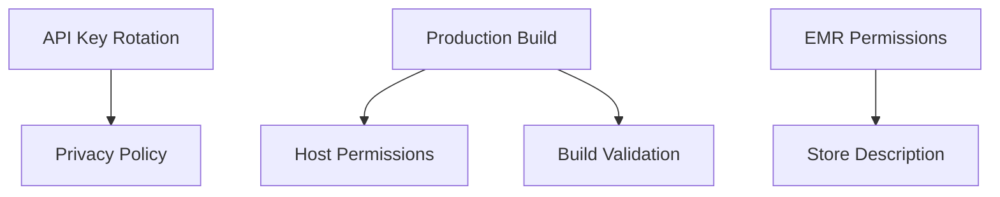

# Workflow: Audit Board State

Analyzes current Plane board state and recommends optimization strategies.

## Input

- Workspace: intelliforia
- Project ID: dfb05f73-cab7-4447-a4a1-360bb7ca7177
- Audit depth: quick | standard | comprehensive

## Process

### Phase 1: Data Collection

1. **Fetch All Tickets**
   ```
   GET /api/v1/workspaces/{workspace}/projects/{project}/issues/
   GET /api/v1/workspaces/{workspace}/projects/{project}/states/  # for status mapping
   ```

2. **Analyze Ticket Metadata**
   - Count by status (backlog/todo/in-progress/done)
   - Count by priority
   - Count by label
   - Identify tickets without labels
   - Identify tickets without story points
   - Map dependencies

3. **Extract Patterns**
   - Group by keyword similarity (NLP clustering)
   - Group by epic/label
   - Group by assignee
   - Time-based analysis (age, staleness)

### Phase 2: Clustering Analysis

**Algorithm:**
```python
for each ticket_group in similar_tickets:
    if len(ticket_group) >= 3 and len(ticket_group) <= 5:
        recommend_parent_issue(ticket_group)
    elif len(ticket_group) >= 6:
        if share_common_epic(ticket_group):
            recommend_parent_issue(ticket_group)
        else:
            recommend_label_grouping(ticket_group)
```

**Clustering Criteria:**
- Title similarity (>70% using Levenshtein distance)
- Description keyword overlap (>50%)
- Common epic tag
- Common labels
- Dependency chains (A → B → C)

**Examples:**
```
Group 1: "Bundle optimization" tickets (8 found)
- All have "performance" label
- All mention "webpack" or "bundle"
- Recommendation: Create parent "Bundle Optimization Epic"

Group 2: "Chrome Web Store" tickets (14 found)
- Share "chrome-store" label
- Part of same sprint
- Recommendation: Keep as labeled group (already well-organized)
```

### Phase 3: Label Optimization

1. **Find Missing Labels**
   - Tickets without epic label
   - Tickets without sprint label
   - Tickets without type label (feature/bug/chore)

2. **Find Redundant Labels**
   - Similar names: "critical" vs "urgent" vs "high-priority"
   - Overlapping purpose: "frontend" + "ui" + "react"
   - Recommendation: Consolidate to canonical label

3. **Recommend New Labels**
   - Detect recurring patterns not yet labeled
   - Example: "accessibility", "i18n", "testing"

### Phase 4: Status Distribution Analysis

**WIP Limits:**
```
Current: 15 tickets in-progress
Recommended: 5 tickets max (team of 1-2 developers)

Action: Move 10 tickets back to "todo"
Criteria: Lowest priority, least progress, stale >7 days
```

**Bottleneck Detection:**
```
Backlog: 30 tickets (healthy)
Todo: 12 tickets (healthy)
In-Progress: 15 tickets (BOTTLENECK - too many)
Done: 8 tickets (healthy)

Recommendation: Enforce WIP limit, complete existing work before starting new
```

**Stale Ticket Detection:**
```
Tickets in "todo" >14 days: 8 found
- CWS-003: 21 days (move to backlog or start)
- CWS-008: 16 days (move to backlog or start)

Recommendation: Review priorities, move to backlog if not urgent
```

### Phase 5: View Recommendations

**View Creation Logic:**
```python
def recommend_view(pattern, usage_frequency):
    common_views = [
        {
            "name": "My Current Sprint",
            "filter": "assigned_to:me AND sprint:current AND status:!done",
            "trigger": "Daily workflow, high frequency"
        },
        {
            "name": "Blocked Items",
            "filter": "has:dependency AND dependency_status:!completed",
            "trigger": "Dependency management, weekly review"
        },
        {
            "name": "Quick Wins",
            "filter": "points:<=3 AND priority:high AND NOT has:dependency",
            "trigger": "Fill time between large tasks"
        },
        {
            "name": "Technical Debt",
            "filter": "label:tech-debt ORDER BY created_at ASC",
            "trigger": "Sprint planning, quarterly cleanup"
        }
    ]

    for view in common_views:
        if matches_pattern(pattern, view.trigger):
            return view
```

**Custom View Examples:**
```
View: "Frontend Quick Wins"
Filter: label:frontend AND points:<=2 AND priority:high
Use Case: Frontend developer wants small tasks to complete

View: "Urgent Security Issues"
Filter: label:security AND priority:urgent AND status:!done
Use Case: Security review, daily check

View: "Stale Backlog"
Filter: status:backlog AND age:>30days ORDER BY priority DESC
Use Case: Backlog grooming, quarterly cleanup
```

### Phase 6: Dependency Analysis

**Dependency Graph:**


**Circular Dependency Detection:**
```
WARNING: Circular dependency detected!
- CWS-010 depends on CWS-012
- CWS-012 depends on CWS-010

Action Required: Break circular dependency by removing one link
```

**Blocked Ticket Detection:**
```
Ticket [CWS-002] is blocked by:
- [CWS-004] Fix production build (status: todo)

Recommendation: Complete CWS-004 first, or remove dependency
```

## Output Format

```markdown
# Board Audit Report

**Date:** 2026-01-15
**Tickets Analyzed:** 47
**Audit Depth:** Standard
**Duration:** 2.3 seconds

---

## Executive Summary

**Health Score:** 72/100 (Good)

**Key Findings:**
- ✓ Good sprint coverage (14 tickets)
- ⚠️ Too many in-progress tickets (15, recommend 5)
- ⚠️ 8 stale todos (>14 days)
- ✓ Well-labeled (82% coverage)
- ⚠️ Missing 3 recommended views

---

## 1. Ticket Clustering (3 recommendations)

### Recommendation 1.1: Create Parent Issue
**Pattern:** Bundle optimization tickets
**Count:** 8 tickets
**Tickets:** CWS-007, CWS-018, CWS-019, CWS-020, CWS-021, CWS-022, CWS-023, CWS-024

**Action:**
```
Create: [CWS-025] Bundle Optimization Epic
Sub-issues: Link 8 existing tickets as children
Benefits: Better organization, easier progress tracking
```

### Recommendation 1.2: Label Grouping
**Pattern:** Chrome Web Store related
**Count:** 14 tickets
**Current:** Already well-organized with "chrome-store" label

**Action:** No change needed (optimal as-is)

---

## 2. Label Optimization (4 recommendations)

### 2.1 Missing Labels
- 12 tickets without sprint label
- 5 tickets without type label (feature/bug/chore)
- 3 tickets without epic label

**Action:** Bulk update missing labels

### 2.2 Redundant Labels
- "critical" + "urgent" → Consolidate to "urgent"
- "ui" + "frontend" + "react" → Consolidate to "frontend"

**Action:** Rename labels, update affected tickets

### 2.3 Recommended New Labels
- "accessibility" (found 3 related tickets)
- "testing" (found 5 related tickets)
- "documentation" (found 4 related tickets)

**Action:** Create new labels, apply to relevant tickets

---

## 3. Status Distribution (2 issues)

### Issue 3.1: WIP Bottleneck
**Current:** 15 tickets in-progress
**Recommended:** 5 tickets max
**Impact:** Context switching, reduced velocity

**Action:**
- Complete high-priority in-progress tickets first
- Move 10 lowest-priority tickets back to "todo"
- Enforce WIP limit going forward

### Issue 3.2: Stale Tickets
**Found:** 8 tickets in "todo" >14 days

| Ticket | Age | Priority | Action |
|--------|-----|----------|--------|
| CWS-003 | 21d | urgent | Start or move to backlog |
| CWS-008 | 16d | high | Start or move to backlog |
| CWS-015 | 15d | medium | Move to backlog |

**Action:** Review priorities in next sprint planning

---

## 4. Recommended Views (3 new views)

### View 4.1: My Current Sprint
**Filter:** `assigned_to:me AND sprint:current AND status:!done`
**Use Case:** Daily workflow, see only my active sprint work
**Benefit:** Focus, reduce noise

### View 4.2: Blocked Items
**Filter:** `has:dependency AND dependency_status:!completed`
**Use Case:** Weekly dependency review
**Benefit:** Unblock work faster

### View 4.3: Quick Wins
**Filter:** `points:<=3 AND priority:high AND NOT has:dependency`
**Use Case:** Fill time between large tasks
**Benefit:** Maintain momentum, deliver value

**Action:** Create these views in Plane settings

---

## 5. Dependency Analysis (1 blocker)

### Blocker 5.1: Incomplete Dependencies
**Ticket:** [CWS-002] Remove dev host permissions
**Blocked By:** [CWS-004] Fix production build (status: todo)
**Impact:** CWS-002 cannot proceed until CWS-004 complete

**Action:** Prioritize CWS-004 in current sprint

### Graph: Critical Path
```
CWS-004 (Production Build)
  ↓
CWS-002 (Host Permissions)
  ↓
CWS-014 (Build Validation)
```

**Recommendation:** Complete this chain in order for maximum impact

---

## Action Items (Prioritized)

**High Priority (Do Today):**
1. ✓ Enforce WIP limit: Move 10 tickets from in-progress to todo
2. ✓ Create parent issue: "Bundle Optimization Epic"
3. ✓ Prioritize CWS-004: Unblock CWS-002

**Medium Priority (This Week):**
4. Add missing labels: 20 tickets need labeling
5. Create recommended views: 3 views for better workflow
6. Consolidate redundant labels: Merge "critical" → "urgent"

**Low Priority (Next Sprint Planning):**
7. Review stale tickets: Move 8 old todos to backlog or start
8. Create new labels: accessibility, testing, documentation

---

## Next Audit

**Recommended:** Weekly (every Monday before sprint planning)
**Quick Check:** Daily (automated via pre-prompt hook)
**Comprehensive:** Quarterly (deep dive with team)

**Trigger Next Audit:**
```bash
claude skill managing-tickets-and-tasks-in-plane:audit-board-state --depth comprehensive
```
```

## Integration

**Pre-Sprint Planning:**
```bash
# Run audit before planning meeting
claude skill managing-tickets-and-tasks-in-plane:audit-board-state \
  --depth standard \
  --output "docs/board-audit-$(date +%Y%m%d).md"
```

**Weekly Retrospective:**
```bash
# Include audit in retro
claude skill managing-tickets-and-tasks-in-plane:audit-board-state \
  --depth quick \
  --compare-with-last-week
```

**On-Demand:**
```bash
# User requests review
claude skill managing-tickets-and-tasks-in-plane:audit-board-state
```

## Performance

**Quick Audit:** <5 seconds (basic metrics)
**Standard Audit:** <15 seconds (with clustering)
**Comprehensive Audit:** <60 seconds (with NLP analysis)

**Caching:** Board state cached for 5 minutes
