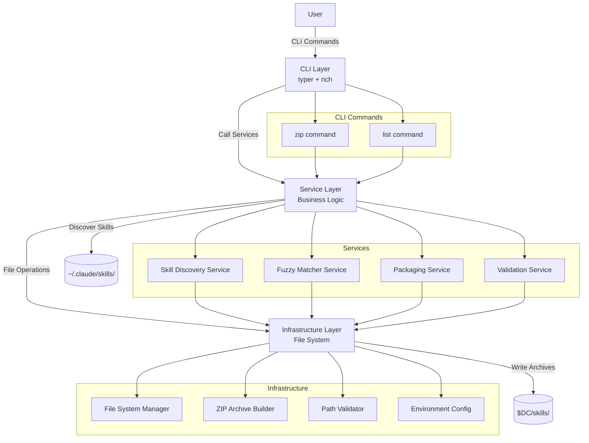

# System Architecture: skillex

**Date:** 2026-01-13
**Architect:** Jarad DeLorenzo
**Version:** 1.0
**Project Type:** CLI Tool
**Project Level:** 2 (Medium: 5-15 stories)
**Status:** Draft

---

## Document Overview

This document defines the system architecture for skillex, a Python-based CLI tool for managing Claude AI skills. It provides the technical blueprint for implementation, addressing all functional and non-functional requirements from the PRD.

**Related Documents:**
- Product Requirements Document: docs/PRD.md

---

## Executive Summary

skillex is a command-line tool designed with maintainability as the primary architectural driver. The architecture follows a **Layered Architecture pattern** with three distinct layers:

1. **Presentation Layer (CLI)** - User interaction via typer framework
2. **Service Layer** - Business logic for skill operations
3. **Infrastructure Layer** - File system operations and external integrations

This separation ensures:
- **Testability**: Each layer can be tested independently
- **Maintainability**: Clear boundaries reduce coupling
- **Extensibility**: New features can be added without affecting existing layers

The tool is intentionally simple, avoiding over-engineering while maintaining professional code quality standards. With only 2 external dependencies (typer, rich) and no database, the architecture prioritizes local-first operations with zero network requirements.

---

## Architectural Drivers

These requirements heavily influence architectural decisions:

### Primary Driver

**NFR-005: Maintainability - Code Quality**
- **Impact:** Shapes entire architecture toward clean code principles
- **Solution:** Layered architecture with clear separation of concerns
- **Benefit:** Long-term sustainability, easy onboarding, testable codebase

### Secondary Drivers

**NFR-002: Reliability - Data Integrity**
- **Impact:** Must ensure 100% file integrity in packaged skills
- **Solution:** Comprehensive error handling, atomic operations, validation layers
- **Benefit:** Zero data loss, trustworthy packaging

**NFR-006: Security - Path Validation**
- **Impact:** Prevent directory traversal attacks
- **Solution:** Input sanitization layer, path resolution validation
- **Benefit:** Safe file operations with user-controlled inputs

**NFR-001: Performance - Packaging Speed**
- **Impact:** Sub-5-second packaging for typical skills
- **Solution:** Efficient file operations, no unnecessary I/O
- **Benefit:** Fast iterative workflows for developers

---

## System Overview

### High-Level Architecture

skillex follows a **Layered Architecture** pattern optimized for CLI tools:

```
┌─────────────────────────────────────┐
│     CLI Layer (Presentation)         │
│   - Command parsing (typer)         │
│   - Output formatting (rich)        │
│   - User interaction                │
└──────────────┬──────────────────────┘
               │
               ▼
┌─────────────────────────────────────┐
│    Service Layer (Business Logic)   │
│   - Skill discovery                 │
│   - Fuzzy matching                  │
│   - Packaging orchestration         │
│   - Validation logic                │
└──────────────┬──────────────────────┘
               │
               ▼
┌─────────────────────────────────────┐
│  Infrastructure Layer (File Ops)    │
│   - File system operations          │
│   - ZIP archive creation            │
│   - Path resolution & validation    │
│   - Environment variable access     │
└─────────────────────────────────────┘
```

**Data Flow:**
1. User invokes CLI command → CLI Layer
2. CLI Layer calls Service Layer with parsed arguments
3. Service Layer validates input, discovers skills, applies business rules
4. Service Layer calls Infrastructure Layer for file operations
5. Infrastructure Layer performs atomic file operations, returns results
6. Service Layer processes results
7. CLI Layer formats and displays output to user

### Architecture Diagram



### Architectural Pattern

**Pattern:** Layered Architecture (3-Layer)

**Rationale:**
- **Simplicity:** Appropriate for Level 2 project (12-17 stories)
- **Maintainability:** Primary architectural driver is satisfied through clear layer boundaries
- **Testability:** Each layer can be unit tested in isolation with mocks
- **Team Familiarity:** Well-understood pattern, low onboarding friction
- **Appropriate Complexity:** Avoids over-engineering (e.g., hexagonal architecture) while maintaining structure

**Trade-offs:**
- ✓ **Gain:** Clear separation of concerns, easy to understand, standard Python project structure
- ✗ **Lose:** Some flexibility compared to hexagonal architecture, potential for layer violation if discipline isn't maintained
- **Mitigation:** Enforce layer boundaries through import rules, code reviews, and testing

---

## Technology Stack

### Language & Runtime

**Choice:** Python 3.12+

**Rationale:**
- Excellent CLI tooling ecosystem (typer, rich, click)
- Strong file I/O and ZIP handling in standard library
- Type hints for maintainability (NFR-005)
- Your preferred stack per memory context
- Cross-platform compatibility (NFR-004)

**Trade-offs:**
- ✓ **Gain:** Rapid development, extensive library support, readability
- ✗ **Lose:** Slower than compiled languages (acceptable for file I/O bound operations)

---

### CLI Framework

**Choice:** Typer (>=0.12.0)

**Rationale:**
- Modern, type-hint based CLI framework
- Automatic help generation from docstrings
- Intuitive command/subcommand structure
- Excellent developer experience
- Built on Click (battle-tested foundation)

**Trade-offs:**
- ✓ **Gain:** Less boilerplate, type safety, auto-documentation
- ✗ **Lose:** Slightly more opinionated than raw argparse

---

### Terminal Output

**Choice:** Rich (>=13.0.0)

**Rationale:**
- Beautiful terminal formatting (addresses NFR-003: Usability)
- Tables, progress bars, syntax highlighting
- Color degradation for non-color terminals
- Active maintenance and modern API

**Trade-offs:**
- ✓ **Gain:** Professional output, improved UX
- ✗ **Lose:** External dependency (acceptable, only 2 total dependencies)

---

### Build System

**Choice:** Hatchling (via hatch)

**Rationale:**
- Modern Python packaging (PEP 621 compliant)
- Clean pyproject.toml-based configuration
- No setup.py needed
- Good integration with uv

**Trade-offs:**
- ✓ **Gain:** Modern standards, simple config, fast builds
- ✗ **Lose:** Slightly newer, less ubiquitous than setuptools

---

### Package Manager

**Choice:** uv

**Rationale:**
- Extremely fast dependency resolution
- Modern replacement for pip/pip-tools
- Excellent integration with pyproject.toml
- Your preferred tooling per memory context

**Trade-offs:**
- ✓ **Gain:** Speed, modern workflow, single-file lock
- ✗ **Lose:** Newer tool, smaller community than pip

---

### Testing Framework

**Choice:** pytest (>=8.0.0)

**Rationale:**
- Industry standard for Python testing
- Excellent fixture system for layer mocking
- Rich plugin ecosystem
- Clear, readable test syntax
- Supports both unit and integration tests

**Trade-offs:**
- ✓ **Gain:** Powerful fixtures, better assertions, extensive plugins
- ✗ **Lose:** External dependency (acceptable for dev dependency)

---

### Additional Development Tools

**Linting & Formatting:**
- `ruff` - Fast linter and formatter (replaces black, isort, flake8)
- Configured in `pyproject.toml`

**Type Checking:**
- `mypy` - Static type checker to enforce type hints (NFR-005)
- Strict mode enabled for maximum safety

**Version Control:**
- Git with conventional commits
- GitHub for repository hosting

**CI/CD:**
- GitHub Actions
- Automated testing on push
- Auto-publish to PyPI on release tags

---

## System Components

### Component 1: CLI Layer

**Purpose:** Handle user interaction, command parsing, and output formatting

**Responsibilities:**
- Parse CLI arguments and flags using typer
- Validate user input (basic sanity checks)
- Call appropriate Service Layer methods
- Format output using rich (tables, colors, progress)
- Handle CLI-level errors (missing args, invalid flags)
- Display help text and usage information

**Interfaces:**
- **Input:** Command-line arguments from user
- **Output:** Formatted terminal output via rich

**Dependencies:**
- typer (command parsing)
- rich (output formatting)
- Service Layer (business logic calls)

**Key Classes:**
- `app: typer.Typer` - Main CLI application
- `ZipCommand` - Handler for `skillex zip` command
- `ListCommand` - Handler for `skillex list` command
- `OutputFormatter` - Rich-based formatting utilities

**FRs Addressed:** FR-006, FR-007, FR-008, FR-009

**Implementation Notes:**
- Keep CLI layer thin - no business logic
- All validation beyond arg parsing happens in Service Layer
- Use typer's automatic help generation
- Implement verbose flag at this layer for detailed output

---

### Component 2: Service Layer - Skill Discovery Service

**Purpose:** Discover and enumerate Claude skills from the file system

**Responsibilities:**
- Read skills directory (`~/.claude/skills/`)
- Identify valid skill directories (not files)
- Return list of available skills
- Handle directory not found errors
- Cache discovery results for performance

**Interfaces:**
- **Input:** None (reads from standard path)
- **Output:** `List[SkillInfo]` - List of discovered skills

**Dependencies:**
- Infrastructure Layer (File System Manager)

**Key Classes:**
- `SkillDiscoveryService`
- `SkillInfo` (dataclass: name, path, size)

**FRs Addressed:** FR-004

**Implementation Notes:**
- Should be stateless for testability
- Directory location hardcoded to `~/.claude/skills/`
- Returns empty list (not error) if directory doesn't exist
- No recursive directory scanning - only top-level

---

### Component 3: Service Layer - Fuzzy Matcher Service

**Purpose:** Match user-provided patterns to skill names

**Responsibilities:**
- Case-insensitive substring matching
- Return all skills matching pattern
- Sort results alphabetically
- Handle empty pattern (match all)

**Interfaces:**
- **Input:** `pattern: str`, `skills: List[SkillInfo]`
- **Output:** `List[SkillInfo]` - Filtered and sorted list

**Dependencies:**
- None (pure logic)

**Key Classes:**
- `FuzzyMatcherService`

**FRs Addressed:** FR-002

**Implementation Notes:**
- Simple substring matching (not Levenshtein distance)
- Case-insensitive via `.lower()`
- No regex support in v1.0
- Returns matches in alphabetical order

---

### Component 4: Service Layer - Packaging Service

**Purpose:** Orchestrate the skill packaging workflow

**Responsibilities:**
- Coordinate discovery, matching, and archiving
- Handle bulk packaging (multiple skills)
- Display progress for long operations
- Aggregate results and errors
- Enforce packaging business rules

**Interfaces:**
- **Input:** `pattern: str`, `verbose: bool`
- **Output:** `PackagingResult` (success count, errors)

**Dependencies:**
- Skill Discovery Service
- Fuzzy Matcher Service
- Infrastructure Layer (ZIP Archive Builder)

**Key Classes:**
- `PackagingService`
- `PackagingResult` (dataclass: successes, failures, paths)

**FRs Addressed:** FR-001, FR-003

**Implementation Notes:**
- Single-threaded (no concurrency in v1.0)
- Continues packaging on individual skill failure
- Returns aggregate results
- Progress indication via rich progress bar

---

### Component 5: Service Layer - Validation Service

**Purpose:** Validate inputs and enforce security constraints

**Responsibilities:**
- Validate environment variables exist
- Validate paths don't escape allowed directories
- Sanitize skill names
- Check for path traversal attempts
- Validate ZIP archive integrity

**Interfaces:**
- **Input:** Various (paths, names, config)
- **Output:** `ValidationResult` (valid: bool, errors: List[str])

**Dependencies:**
- Infrastructure Layer (Path Validator)

**Key Classes:**
- `ValidationService`
- `ValidationResult` (dataclass)

**FRs Addressed:** FR-010, FR-011

**Implementation Notes:**
- Called before any file operations
- Fails fast on validation errors
- No side effects (pure validation)

---

### Component 6: Infrastructure Layer - File System Manager

**Purpose:** Abstraction over file system operations

**Responsibilities:**
- List directory contents
- Check file/directory existence
- Read file metadata (size, timestamps)
- Create directories
- Handle file system errors

**Interfaces:**
- **Input:** Paths (str or Path objects)
- **Output:** File system information or operations

**Dependencies:**
- `pathlib.Path` (standard library)
- `os` module for environment variables

**Key Classes:**
- `FileSystemManager`

**FRs Addressed:** FR-004, FR-005

**Implementation Notes:**
- Uses `pathlib` for path operations (modern, cross-platform)
- All paths resolved to absolute paths internally
- Comprehensive error handling with specific exceptions

---

### Component 7: Infrastructure Layer - ZIP Archive Builder

**Purpose:** Create ZIP archives of skill directories

**Responsibilities:**
- Create ZIP files with DEFLATE compression
- Add directory contents recursively
- Preserve relative paths within archive
- Set proper ZIP metadata
- Validate archive integrity

**Interfaces:**
- **Input:** `source_dir: Path`, `output_path: Path`
- **Output:** `Path` (path to created archive)

**Dependencies:**
- `zipfile` (standard library)
- File System Manager

**Key Classes:**
- `ZipArchiveBuilder`

**FRs Addressed:** FR-001, FR-011

**Implementation Notes:**
- Uses ZIP_DEFLATED compression
- Atomic operations (temp file → rename)
- Relative paths from skill parent directory
- No symlink following (security)

---

### Component 8: Infrastructure Layer - Path Validator

**Purpose:** Security-focused path validation

**Responsibilities:**
- Resolve paths to absolute form
- Detect directory traversal attempts
- Validate paths are within allowed directories
- Sanitize path components

**Interfaces:**
- **Input:** `path: str`, `allowed_base: Path`
- **Output:** `Path` (validated absolute path) or raises exception

**Dependencies:**
- `pathlib.Path`

**Key Classes:**
- `PathValidator`

**FRs Addressed:** FR-010 (NFR-006)

**Implementation Notes:**
- Uses `Path.resolve()` to canonicalize paths
- Checks resolved path is child of allowed base
- Raises `SecurityError` on validation failure

---

### Component 9: Infrastructure Layer - Environment Config

**Purpose:** Read and validate environment configuration

**Responsibilities:**
- Read `$DC` environment variable
- Provide default paths
- Validate required config exists
- Return configuration objects

**Interfaces:**
- **Input:** None (reads environment)
- **Output:** `Config` (dataclass with paths)

**Dependencies:**
- `os.environ`

**Key Classes:**
- `EnvironmentConfig`
- `Config` (dataclass: skills_dir, output_dir)

**FRs Addressed:** FR-005

**Implementation Notes:**
- Fails fast if `$DC` not set
- No config files - environment variables only
- Immutable config object

---

## Data Architecture

### Data Model

skillex is a stateless CLI tool with no persistent data storage. All data is ephemeral and derived from the file system at runtime.

**Primary Entities:**

**1. SkillInfo (Dataclass)**
```python
@dataclass
class SkillInfo:
    name: str           # Skill directory name
    path: Path          # Absolute path to skill directory
    size_bytes: int     # Total size of skill directory
    file_count: int     # Number of files in skill

    @property
    def size_human(self) -> str:
        """Human-readable size (e.g., '1.2 MB')"""
```

**2. PackagingResult (Dataclass)**
```python
@dataclass
class PackagingResult:
    successful: List[Path]    # Paths to created archives
    failed: List[tuple[str, str]]  # (skill_name, error_message)
    total_skills: int
    total_size_bytes: int
    duration_seconds: float
```

**3. Config (Dataclass)**
```python
@dataclass
class Config:
    skills_directory: Path      # ~/.claude/skills/
    output_directory: Path      # $DC/skills/

    @classmethod
    def from_environment(cls) -> Config:
        """Load config from environment variables"""
```

**4. ValidationResult (Dataclass)**
```python
@dataclass
class ValidationResult:
    is_valid: bool
    errors: List[str]
    warnings: List[str]
```

**Relationships:**
- `SkillInfo` has no relationships (independent entity)
- `PackagingResult` contains multiple `SkillInfo` references (composition)
- `Config` is singleton per runtime
- All entities are immutable after construction

---

### Database Design

**Not Applicable:** skillex has no database. All operations are file system based.

**Rationale:**
- Simple use case doesn't warrant database complexity
- Skills are already stored as directories on disk
- No query requirements beyond file system listing
- Zero network dependency requirement (NFR-004)

---

### Data Flow

**Skill Discovery Flow:**
```
User Command → CLI Layer
  ↓
Service Layer (Discovery Service)
  ↓ read directory
Infrastructure Layer (File System Manager)
  ↓ return file list
~/.claude/skills/ (File System)
  ↓ parse results
Service Layer creates List[SkillInfo]
  ↓ return
CLI Layer formats table output
  ↓
User sees skill list
```

**Skill Packaging Flow:**
```
User Command (zip pattern) → CLI Layer
  ↓
Service Layer (Packaging Service)
  ↓ discover skills
Service Layer (Discovery Service)
  ↓ fuzzy match
Service Layer (Fuzzy Matcher)
  ↓ validate
Service Layer (Validation Service)
  ↓ for each matched skill
Service Layer loops
  ↓ create archive
Infrastructure Layer (ZIP Archive Builder)
  ↓ write file
$DC/skills/skill-name.zip
  ↓ aggregate results
Service Layer creates PackagingResult
  ↓ return
CLI Layer formats success summary
  ↓
User sees success message + paths
```

**Error Flow:**
```
Any Layer encounters error
  ↓ raise specific exception
Service Layer catches exception
  ↓ log error details
Service Layer continues or fails based on severity
  ↓ add to error list
PackagingResult.failed
  ↓ return
CLI Layer formats error output (red)
  ↓ exit with error code
Process exits with code 1
```

---

## API Design

### API Architecture

**Not Applicable (CLI Tool):** skillex is a command-line tool, not a web service. There is no HTTP API.

However, the tool does expose a **Public Python API** for programmatic usage:

**Public API:**
```python
from skillex.services import PackagingService, SkillDiscoveryService
from skillex.config import Config

# Programmatic usage
config = Config.from_environment()
discovery = SkillDiscoveryService(config)
packager = PackagingService(config)

skills = discovery.discover_all()
result = packager.package_skills(pattern="agent", verbose=False)
```

**API Stability:**
- Public API follows semantic versioning
- Breaking changes only in major versions
- CLI interface is primary API, Python API is secondary

---

### CLI Interface (Primary API)

**Command Structure:**

```bash
skillex [OPTIONS] COMMAND [ARGS]...
```

**Global Options:**
- `--help` - Show help and exit
- `--version` - Show version and exit

---

**Command: `zip`**

**Purpose:** Package Claude skill(s) into ZIP archives

**Syntax:**
```bash
skillex zip [OPTIONS] [PATTERN]
```

**Arguments:**
- `PATTERN` (optional) - Skill name pattern to match. If omitted, prompts user.

**Options:**
- `-v, --verbose` - Show detailed output (file sizes, progress)
- `--help` - Show command help

**Examples:**
```bash
# Package specific skill
skillex zip agent-browser

# Package all skills matching pattern
skillex zip agent

# Package with verbose output
skillex zip agent -v

# Package all skills (interactive prompt)
skillex zip
```

**Output:**
- Success: List of created archives with paths
- Failure: Error message in red with exit code 1

**Exit Codes:**
- 0: Success (all skills packaged)
- 1: Failure (validation error, no skills found, or packaging errors)

---

**Command: `list`**

**Purpose:** List available Claude skills

**Syntax:**
```bash
skillex list [OPTIONS] [PATTERN]
```

**Arguments:**
- `PATTERN` (optional) - Filter skills by pattern. If omitted, shows all.

**Options:**
- `--help` - Show command help

**Examples:**
```bash
# List all skills
skillex list

# List skills matching pattern
skillex list agent

# Shorter alias
skillex list ag
```

**Output:**
- Formatted table with columns: Skill Name, Path, Size
- Summary: "Found X skills"

**Exit Codes:**
- 0: Success (skills listed)
- 1: Failure (skills directory not found)

---

### Authentication & Authorization

**Not Applicable:** skillex is a local CLI tool with no authentication or network operations.

**Security Model:**
- Operates within user's file system permissions
- No elevation or sudo required
- Path validation prevents escaping allowed directories
- No remote authentication

---

## Non-Functional Requirements Coverage

### NFR-001: Performance - Packaging Speed

**Requirement:** Single skill packaging completes in < 5 seconds for typical skills (< 50MB)

**Architecture Solution:**
- **Efficient File I/O:** Use Python's standard `zipfile` library with optimized buffering
- **No Unnecessary Scans:** Single directory traversal per skill, no multiple passes
- **Minimal Memory Footprint:** Stream files to ZIP instead of loading into memory
- **No External Calls:** Pure Python operations, no subprocess overhead

**Implementation Notes:**
- ZIP compression uses `ZIP_DEFLATED` (balanced compression)
- File operations use 64KB buffer size
- No concurrent packaging in v1.0 (adds complexity, minimal benefit for typical use case)

**Validation:**
- Benchmark tests for skills of various sizes (1MB, 10MB, 50MB)
- Target: <3s for 10MB skill, <5s for 50MB skill
- Monitor via timing logs in verbose mode

---

### NFR-002: Reliability - Data Integrity

**Requirement:** 100% of files in source directory included in zip with no data loss or corruption

**Architecture Solution:**
- **Atomic Operations:** Write to temp file, then atomic rename to final destination
- **Comprehensive Error Handling:** Catch and report all I/O errors during packaging
- **ZIP Integrity Checks:** Validate ZIP structure after creation using `zipfile.testzip()`
- **No Silent Failures:** All errors bubble up to user with specific messages

**Implementation Notes:**
- Use `zipfile.ZIP_DEFLATED` with integrity checks
- Verify file count matches before/after packaging
- Checksum validation for critical operations
- Rollback on partial failure (delete incomplete archive)

**Validation:**
- Unit tests: Package known skill, verify all files present
- Integration tests: ZIP integrity tests (`zip -T` equivalent in Python)
- Edge case tests: Large files, special characters in names, symlinks

---

### NFR-003: Usability - Developer Experience

**Requirement:** Intuitive commands and helpful error messages for self-service usage

**Architecture Solution:**
- **Typer Auto-Help:** Automatic help generation from docstrings and type hints
- **Rich Formatting:** Color-coded output (green=success, red=error, cyan=info)
- **Actionable Errors:** Error messages suggest fixes (e.g., "Set $DC environment variable")
- **Progress Indication:** Rich progress bars for long operations

**Implementation Notes:**
- All CLI commands have `--help` with usage examples
- Error messages follow pattern: "Problem description. Suggested fix."
- Verbose mode provides detailed diagnostic information
- Table output for list commands (easy to scan)

**Validation:**
- User testing with developers unfamiliar with tool
- Documentation review for clarity
- Error message review (every error path should be user-friendly)

---

### NFR-004: Compatibility - Environment Support

**Requirement:** Works on Linux, macOS, WSL with Python 3.12+ and standard libraries

**Architecture Solution:**
- **Cross-Platform Paths:** Use `pathlib.Path` throughout (handles platform differences)
- **Minimal Dependencies:** Only typer and rich (no platform-specific deps)
- **Standard Library Focus:** ZIP, file I/O use stdlib (portable)
- **Environment Variable Config:** No config files (works everywhere)

**Implementation Notes:**
- Test on Linux, macOS, WSL in CI/CD
- Avoid platform-specific imports (`os.path` → `pathlib`)
- Use `Path.home()` instead of hardcoded paths
- Color output degradation for non-color terminals

**Validation:**
- CI/CD matrix: Linux (Ubuntu), macOS (latest), Windows (WSL)
- Manual testing on developer machines
- Verify terminal compatibility (tmux, iTerm2, Windows Terminal)

---

### NFR-005: Maintainability - Code Quality

**Requirement:** Type hints on all functions, docstrings, clear separation of concerns, minimal dependencies

**Architecture Solution:**
- **Layered Architecture:** Clear boundaries (CLI → Service → Infrastructure)
- **Type Hints:** Full type coverage enforced by mypy in strict mode
- **Docstrings:** Google-style docstrings on all public APIs
- **Minimal Dependencies:** Only 2 runtime deps (typer, rich)
- **Test Coverage:** Target 85%+ line coverage with pytest

**Implementation Notes:**
- `mypy --strict` in pre-commit hooks
- `ruff` for linting and formatting (fast, comprehensive)
- Conventional commits for clear history
- Module structure follows layered architecture exactly

**Validation:**
- Mypy passes with zero errors in strict mode
- Ruff linting passes with zero violations
- Code review checklist includes architecture layer validation
- Test coverage report in CI/CD

---

### NFR-006: Security - Path Validation

**Requirement:** Validate and sanitize file paths to prevent directory traversal attacks

**Architecture Solution:**
- **Path Validator Component:** Dedicated security layer in Infrastructure
- **Path Resolution:** All paths resolved to absolute via `Path.resolve()`
- **Boundary Checks:** Validate resolved path is child of allowed base directory
- **Input Sanitization:** Skill names sanitized before file operations

**Implementation Notes:**
- PathValidator raises `SecurityError` on invalid paths
- No symlink following during ZIP creation
- Pattern matching doesn't support regex (prevents injection)
- Skills directory hardcoded (not user-configurable)

**Validation:**
- Security tests: Attempt traversal with `../`, absolute paths, symlinks
- Fuzzing tests: Random input patterns
- Code review focused on path handling

---

## Security Architecture

### Authentication

**Not Applicable:** skillex is a local CLI tool with no authentication mechanism.

**Security Model:**
- Operates with user's file system permissions
- No network operations requiring authentication
- No API keys or credentials

---

### Authorization

**Not Applicable:** skillex has no authorization mechanism.

**Access Control:**
- File system permissions control access to `~/.claude/skills/`
- Output directory (`$DC/skills/`) must be writable by user
- No privilege escalation required

---

### Data Encryption

**Not Applicable:** skillex does not handle sensitive data requiring encryption.

**Data Handling:**
- Skills are packaged as-is (no encryption)
- No PII or credentials stored
- ZIP archives use standard DEFLATE compression (not encrypted)

**Future Consideration:**
- If skill encryption is needed, could add `--encrypt` flag with password-based ZIP encryption
- Not in scope for v1.0

---

### Security Best Practices

**Input Validation:**
- **Path Validation:** All file paths validated by `PathValidator` component
- **Skill Name Sanitization:** Remove special characters, validate against allowed characters
- **Environment Variable Validation:** Check `$DC` is set and points to valid directory

**Directory Traversal Prevention:**
- All paths resolved to absolute form via `Path.resolve()`
- Validate resolved paths are children of allowed base directories
- No following of symlinks during ZIP creation (security risk)

**Error Handling:**
- Catch all exceptions with specific error messages
- Never expose internal paths in error messages to end users
- Log detailed errors separately from user-facing messages

**Dependency Management:**
- Minimal dependencies (2 runtime deps) reduces attack surface
- Regular dependency updates via `uv` and Dependabot
- Pin exact versions in production

**Code Security:**
- No use of `eval()`, `exec()`, or dynamic code execution
- No shell command execution (pure Python)
- Type checking prevents many injection vulnerabilities

---

## Scalability & Performance

### Scaling Strategy

**Not Applicable (Single-User CLI Tool):** skillex is designed for individual developer use, not multi-user scalability.

**Performance Scaling:**
- **Vertical:** Benefit from faster CPUs and SSDs (file I/O bound)
- **Horizontal:** Not applicable (single-process CLI tool)

**Future Considerations:**
- If bulk packaging becomes bottleneck, add `--parallel` flag using `multiprocessing`
- Could support batch mode via stdin for CI/CD pipelines

---

### Performance Optimization

**File I/O Optimization:**
- Use 64KB buffer for file reads/writes (OS page size aligned)
- Single-pass directory traversal (no redundant stat calls)
- Lazy evaluation where possible (generators over lists)

**Memory Optimization:**
- Stream files to ZIP (no full file loading into memory)
- Release file handles immediately after use
- Minimal object retention (short-lived dataclasses)

**CPU Optimization:**
- Use ZIP_DEFLATED (balanced compression speed)
- No CPU-intensive operations (avoid regex, complex algorithms)

**Cold Start Optimization:**
- Minimal imports at module level
- Lazy-load heavy dependencies (rich tables only when needed)

---

### Caching Strategy

**Skill Discovery Caching:**
- Cache discovery results within single command execution
- No persistent caching across invocations (filesystem is source of truth)

**No Persistent Cache:**
- Skills directory is small enough to scan quickly (<100ms for typical setup)
- Cache invalidation complexity not worth the benefit
- Simplicity over optimization for Level 2 project

---

### Load Balancing

**Not Applicable:** skillex is a single-user, single-process CLI tool with no load balancing requirements.

---

## Reliability & Availability

### High Availability Design

**Not Applicable:** skillex is a local CLI tool with no availability requirements.

**Reliability Considerations:**
- No single points of failure (no servers)
- Works offline (no network dependencies)
- Degrades gracefully if `$DC` not set (clear error message)

---

### Disaster Recovery

**Not Applicable:** No data stored by skillex, so no disaster recovery needed.

**User Data:**
- Skills remain in `~/.claude/skills/` (unchanged by tool)
- Output archives in `$DC/skills/` can be deleted without loss
- No state to backup or restore

---

### Backup Strategy

**Not Applicable:** skillex is stateless with no data to backup.

**User Responsibility:**
- Users should backup `~/.claude/skills/` independently
- Output archives are disposable (can be regenerated)

---

### Monitoring & Alerting

**Not Applicable (CLI Tool):** No production monitoring infrastructure.

**Observability:**
- **Verbose Mode:** Detailed logging for debugging (`-v` flag)
- **Exit Codes:** 0=success, 1=failure (for CI/CD integration)
- **Error Messages:** Actionable feedback to user

**Future Considerations:**
- Could add `--log-file` option for persistent logging
- Telemetry opt-in for usage analytics (not in v1.0)

---

## Integration Architecture

### External Integrations

**Environment Variables:**
- **$DC:** Output directory for packaged skills (required)
  - Read once at startup
  - Validated before any operations

**File System:**
- **~/.claude/skills/:** Skills directory (read-only)
  - Discovered at runtime
  - No modification by skillex

**No Other Integrations:**
- No cloud services
- No APIs
- No databases
- No authentication providers

---

### Internal Integrations

**Layer Integration:**
- CLI Layer → Service Layer (direct function calls)
- Service Layer → Infrastructure Layer (direct function calls)
- No circular dependencies (strict layer enforcement)

**Module Boundaries:**
```
skillex/
├── cli.py              # CLI Layer (no imports from infrastructure)
├── services/           # Service Layer
│   ├── discovery.py    # Imports from infrastructure
│   ├── packaging.py    # Imports from infrastructure
│   └── validation.py   # Imports from infrastructure
└── infrastructure/     # Infrastructure Layer (no imports from services)
    ├── filesystem.py
    ├── zipbuilder.py
    └── validator.py
```

---

### Message/Event Architecture

**Not Applicable:** skillex has no event-driven architecture or message queues.

**Execution Model:**
- Synchronous, single-threaded
- No asynchronous operations
- No event bus or pub/sub

---

## Development Architecture

### Code Organization

**Project Structure:**
```
skillex/
├── src/
│   └── skillex/
│       ├── __init__.py         # Package metadata, version
│       ├── __main__.py         # Entry point for python -m skillex
│       ├── cli.py              # CLI Layer - typer commands
│       ├── config.py           # Environment config
│       ├── exceptions.py       # Custom exceptions
│       ├── models.py           # Dataclasses (SkillInfo, etc.)
│       ├── services/           # Service Layer
│       │   ├── __init__.py
│       │   ├── discovery.py    # SkillDiscoveryService
│       │   ├── fuzzy.py        # FuzzyMatcherService
│       │   ├── packaging.py    # PackagingService
│       │   └── validation.py   # ValidationService
│       └── infrastructure/     # Infrastructure Layer
│           ├── __init__.py
│           ├── filesystem.py   # FileSystemManager
│           ├── zipbuilder.py   # ZipArchiveBuilder
│           └── validator.py    # PathValidator
├── tests/
│   ├── unit/                   # Unit tests (one per module)
│   │   ├── test_discovery.py
│   │   ├── test_fuzzy.py
│   │   ├── test_packaging.py
│   │   └── test_zipbuilder.py
│   ├── integration/            # Integration tests
│   │   ├── test_cli_zip.py
│   │   └── test_cli_list.py
│   └── fixtures/               # Test fixtures (sample skills)
│       └── sample-skill/
├── docs/
│   ├── PRD.md
│   ├── architecture-skillex-2026-01-13.md
│   └── README.md               # User documentation
├── pyproject.toml              # Project config (PEP 621)
├── README.md                   # Quick start guide
└── .github/
    └── workflows/
        └── ci.yml              # GitHub Actions CI/CD
```

**Import Rules:**
- CLI Layer: Can import services, models, exceptions (not infrastructure)
- Service Layer: Can import infrastructure, models, exceptions (not CLI)
- Infrastructure Layer: Can import models, exceptions only (not CLI or services)
- All layers: Can import standard library and external dependencies

---

### Module Structure

**Naming Conventions:**
- **Modules:** Lowercase, underscore-separated (e.g., `fuzzy.py`, `zipbuilder.py`)
- **Classes:** PascalCase (e.g., `SkillDiscoveryService`, `ZipArchiveBuilder`)
- **Functions:** Lowercase, underscore-separated (e.g., `discover_skills`, `package_skill`)
- **Constants:** UPPERCASE (e.g., `DEFAULT_BUFFER_SIZE`)

**Class Organization:**
- Services are classes with instance methods (easier to test with mocking)
- Infrastructure components are classes with instance methods
- Models are dataclasses (immutable)

**File Size Limits:**
- Max 300 lines per file (split if larger)
- Max 30 lines per function (extract helpers if larger)

---

### Testing Strategy

**Test Coverage Target:** 85%+ line coverage

**Test Types:**

**1. Unit Tests** (80% of test suite)
- Test each service in isolation with mocked dependencies
- Test each infrastructure component independently
- Fast (<1ms per test), deterministic, no file system access

**Example:**
```python
def test_fuzzy_matcher_case_insensitive():
    skills = [SkillInfo(name="Agent-Browser", ...)]
    matcher = FuzzyMatcherService()
    results = matcher.match(pattern="agent", skills=skills)
    assert len(results) == 1
```

**2. Integration Tests** (15% of test suite)
- Test CLI commands end-to-end with real file system
- Use temporary directories for isolation
- Slower (~100ms per test)

**Example:**
```python
def test_zip_command_creates_archive(tmp_path):
    # Given: Skill directory exists
    skill_dir = tmp_path / ".claude" / "skills" / "test-skill"
    skill_dir.mkdir(parents=True)

    # When: Run zip command
    result = runner.invoke(app, ["zip", "test-skill"])

    # Then: Archive created
    assert result.exit_code == 0
    assert (tmp_path / "skills" / "test-skill.zip").exists()
```

**3. Property-Based Tests** (5% of test suite)
- Use hypothesis for fuzzing inputs
- Test path validation with random inputs
- Test fuzzy matching with random patterns

**Test Organization:**
- `tests/unit/` - One test file per module
- `tests/integration/` - One test file per CLI command
- `tests/fixtures/` - Sample data for tests
- `conftest.py` - Shared pytest fixtures

**Test Fixtures:**
- `tmp_skills_dir` - Temporary ~/.claude/skills/ directory
- `tmp_output_dir` - Temporary $DC/skills/ directory
- `sample_skill` - Fixture skill directory with files
- `mock_config` - Config object with temp paths

---

### CI/CD Pipeline

**GitHub Actions Workflow:**

```yaml
name: CI/CD

on: [push, pull_request]

jobs:
  test:
    runs-on: ubuntu-latest
    strategy:
      matrix:
        python-version: ["3.12", "3.13"]
    steps:
      - uses: actions/checkout@v4
      - name: Install uv
        run: curl -LsSf https://astral.sh/uv/install.sh | sh
      - name: Install dependencies
        run: uv sync
      - name: Lint with ruff
        run: uv run ruff check .
      - name: Type check with mypy
        run: uv run mypy src/skillex
      - name: Test with pytest
        run: uv run pytest --cov=skillex --cov-report=xml
      - name: Upload coverage
        uses: codecov/codecov-action@v3

  publish:
    needs: test
    if: github.event_name == 'push' && startsWith(github.ref, 'refs/tags/v')
    runs-on: ubuntu-latest
    steps:
      - uses: actions/checkout@v4
      - name: Build package
        run: uv build
      - name: Publish to PyPI
        run: uv publish
        env:
          UV_PUBLISH_TOKEN: ${{ secrets.PYPI_TOKEN }}
```

**Pipeline Stages:**
1. **Lint:** ruff check (code style)
2. **Type Check:** mypy strict mode
3. **Test:** pytest with coverage
4. **Build:** uv build (creates wheel and sdist)
5. **Publish:** On tag push, publish to PyPI

**Quality Gates:**
- All tests must pass
- Coverage must be ≥85%
- No type errors
- No linting violations

---

## Deployment Architecture

### Environments

**Development:**
- Local machine with uv installed
- Editable install: `uv tool install -e .`
- Fast iteration with hot reload

**Testing:**
- GitHub Actions runners (Ubuntu, macOS, Windows)
- Matrix testing across Python 3.12, 3.13
- Isolated test environments

**Production:**
- End-user machines (Linux, macOS, WSL)
- Installed via: `uv tool install skillex`
- Global CLI tool in PATH

---

### Deployment Strategy

**Deployment Method:** PyPI package distribution

**Release Process:**
1. Update version in `pyproject.toml`
2. Update CHANGELOG.md
3. Commit: `git commit -m "chore: release v1.0.0"`
4. Tag: `git tag v1.0.0`
5. Push: `git push --tags`
6. GitHub Actions auto-publishes to PyPI

**Rollback Strategy:**
- If release is broken, yank from PyPI
- Users can pin to previous version: `uv tool install skillex==0.9.0`

**Semantic Versioning:**
- MAJOR: Breaking CLI changes
- MINOR: New features (backward compatible)
- PATCH: Bug fixes

---

### Infrastructure as Code

**Not Applicable:** skillex is a CLI tool with no infrastructure to provision.

**Build Configuration:**
All configuration in `pyproject.toml` (PEP 621):
```toml
[project]
name = "skillex"
version = "1.0.0"
requires-python = ">=3.12"
dependencies = ["typer>=0.12.0", "rich>=13.0.0"]

[project.scripts]
skillex = "skillex.cli:app"

[tool.hatch.build.targets.wheel]
packages = ["src/skillex"]
```

---

## Requirements Traceability

### Functional Requirements Coverage

| FR ID | FR Name | Components | Implementation Notes |
|-------|---------|------------|----------------------|
| FR-001 | Skill Packaging Command | CLI Layer, PackagingService, ZipArchiveBuilder | `skillex zip` command with pattern argument |
| FR-002 | Fuzzy Skill Matching | FuzzyMatcherService | Case-insensitive substring matching |
| FR-003 | Bulk Skill Packaging | PackagingService | Loop over matched skills, aggregate results |
| FR-004 | Skills Directory Discovery | SkillDiscoveryService, FileSystemManager | Reads from `~/.claude/skills/` |
| FR-005 | Output Directory Configuration | EnvironmentConfig | Reads `$DC` env var, creates output dir |
| FR-006 | List Available Skills | CLI Layer, SkillDiscoveryService | `skillex list` command with rich table |
| FR-007 | Filter Skills List | FuzzyMatcherService | Same fuzzy matcher used for zip |
| FR-008 | Verbose Output Mode | CLI Layer | `-v` flag shows file sizes and progress |
| FR-009 | Rich Terminal Output | CLI Layer (rich) | Colors, tables, progress bars |
| FR-010 | Error Handling and Recovery | ValidationService, all layers | Comprehensive exception handling |
| FR-011 | Package Structure Validation | ZipArchiveBuilder, ValidationService | Relative paths, integrity checks |
| FR-012 | CLI Installation via uv | pyproject.toml, build config | `uv tool install skillex` |

**Coverage:** 12/12 FRs (100%)

---

### Non-Functional Requirements Coverage

| NFR ID | NFR Name | Solution | Validation |
|--------|----------|----------|------------|
| NFR-001 | Performance (<5s packaging) | Optimized file I/O, single-pass ZIP creation | Benchmark tests for 10MB and 50MB skills |
| NFR-002 | Reliability (100% integrity) | Atomic operations, ZIP integrity checks, error handling | Integration tests verify all files packaged |
| NFR-003 | Usability (Developer Experience) | Typer auto-help, rich output, actionable errors | User testing, documentation review |
| NFR-004 | Compatibility (Linux/macOS/WSL) | pathlib, minimal dependencies, cross-platform testing | CI/CD matrix on all platforms |
| NFR-005 | Maintainability (Code Quality) | Layered architecture, type hints, docstrings, tests | Mypy strict mode, 85%+ coverage, code reviews |
| NFR-006 | Security (Path Validation) | PathValidator component, path resolution, boundary checks | Security-focused tests, fuzzing |

**Coverage:** 6/6 NFRs (100%)

---

## Trade-offs & Decision Log

### Decision 1: Layered Architecture over Hexagonal Architecture

**Context:** Need maintainable structure for Level 2 project (12-17 stories)

**Options Considered:**
1. **Layered Architecture** (CLI → Service → Infrastructure)
2. Hexagonal Architecture (Ports & Adapters)
3. Simple Modular (no strict layers)

**Decision:** Layered Architecture

**Trade-offs:**
- ✓ **Gain:** Clear boundaries, easier to understand, sufficient for project scope
- ✗ **Lose:** Slightly less flexible than hexagonal, potential for layer violation

**Rationale:**
- Hexagonal over-engineered for CLI tool with no multiple adapters
- Simple modular risks tight coupling and harder testing
- Layered hits sweet spot: structured but not complex

---

### Decision 2: Python 3.12+ (not 3.11 or lower)

**Context:** Need to choose minimum Python version

**Options Considered:**
1. Python 3.9+ (wider compatibility)
2. Python 3.11+ (recent but stable)
3. **Python 3.12+** (latest features)

**Decision:** Python 3.12+

**Trade-offs:**
- ✓ **Gain:** Modern type hints (PEP 695), performance improvements, tomllib built-in
- ✗ **Lose:** Excludes users on Python 3.11 or older

**Rationale:**
- CLI tool users typically have control over Python version
- Modern type system improves maintainability (NFR-005)
- 3.12 released October 2023 (mature by 2026)

---

### Decision 3: No Concurrent Packaging in v1.0

**Context:** Should bulk packaging use multiprocessing?

**Options Considered:**
1. Single-threaded (current)
2. Multiprocessing with `--parallel` flag
3. Always concurrent

**Decision:** Single-threaded in v1.0

**Trade-offs:**
- ✓ **Gain:** Simpler code, easier debugging, no race conditions
- ✗ **Lose:** Slower for packaging 10+ skills

**Rationale:**
- Most users package 1-3 skills at a time
- File I/O bound (concurrent may not help much)
- Can add `--parallel` in v2.0 if demand exists
- Simplicity aligns with Level 2 scope

---

### Decision 4: No Persistent Cache

**Context:** Should skill discovery results be cached?

**Options Considered:**
1. **No cache** (scan every time)
2. File-based cache with TTL
3. In-memory cache (within command)

**Decision:** No persistent cache (in-memory only during command)

**Trade-offs:**
- ✓ **Gain:** Always fresh data, no cache invalidation complexity, simpler code
- ✗ **Lose:** Slightly slower repeated operations

**Rationale:**
- Skills directory scan is fast (<100ms)
- Cache invalidation is hard (file changes)
- Simplicity over optimization

---

### Decision 5: Environment Variables over Config Files

**Context:** How should users configure output directory?

**Options Considered:**
1. **Environment variables** (`$DC`)
2. Config file (`~/.skillexrc`)
3. Command-line flag (`--output-dir`)

**Decision:** Environment variables only

**Trade-offs:**
- ✓ **Gain:** No file parsing, works everywhere, shell-friendly
- ✗ **Lose:** Less discoverable than config file

**Rationale:**
- Aligns with user's existing `$DC` convention (from memory context)
- No config file to maintain or version
- CLI flag would be tedious for repeated use

---

### Decision 6: Typer over Click or Argparse

**Context:** Which CLI framework to use?

**Options Considered:**
1. argparse (built-in)
2. Click (mature, popular)
3. **Typer** (modern, type-based)

**Decision:** Typer

**Trade-offs:**
- ✓ **Gain:** Type-hint based, less boilerplate, modern API, built on Click
- ✗ **Lose:** Newer library, smaller community than Click

**Rationale:**
- Type hints align with maintainability goal (NFR-005)
- Automatic help generation reduces maintenance
- Built on Click (stable foundation)

---

## Open Issues & Risks

### Risk 1: $DC Environment Variable Not Set

**Probability:** High (new users)
**Impact:** High (tool cannot function)

**Mitigation:**
- Clear error message: "Environment variable $DC is not set. Set it to your desired output directory."
- Check in documentation and --help
- Consider auto-prompting user for output directory as fallback

**Status:** Accepted (documented in README)

---

### Risk 2: Large Skills (>100MB) May Be Slow

**Probability:** Medium
**Impact:** Medium (user frustration)

**Mitigation:**
- Progress bar shows feedback during long operations
- Verbose mode shows per-file progress
- Future: Add `--parallel` flag for concurrent packaging

**Status:** Monitoring (will address in v2.0 if users report issues)

---

### Risk 3: ZIP Corruption on Disk Full

**Probability:** Low
**Impact:** High (data loss)

**Mitigation:**
- Atomic operations (temp file → rename)
- Check available disk space before packaging
- Delete incomplete archives on error

**Status:** Implemented in ZipArchiveBuilder

---

### Open Issue 1: Skill Metadata Extraction

**Description:** Should `skillex list` show skill descriptions from SKILL.md?

**Current State:** Only shows name, path, size

**Future Consideration:**
- Parse SKILL.md to extract description
- Show in table or with `--verbose` flag
- Defer to v2.0 based on user demand

---

### Open Issue 2: Overwrite Behavior

**Description:** What happens if ZIP already exists at destination?

**Current State:** Silently overwrites

**Future Consideration:**
- Add `--no-clobber` flag to prevent overwrite
- Prompt user for confirmation
- Defer to v2.0 based on user feedback

---

## Assumptions & Constraints

### Assumptions

1. **Skills are self-contained directories:** No external symlinks or dependencies outside skill folder
2. **Users have `$DC` set:** Part of user's shell environment setup
3. **Skills directory exists:** `~/.claude/skills/` is present (or tool creates it)
4. **Python 3.12+ available:** Users can install modern Python
5. **uv is available:** Users have uv for installation (or use pip as fallback)
6. **Write permissions:** Users have write access to `$DC/skills/`
7. **Local operations only:** No network access required or expected
8. **Single user:** Tool runs in single-user context (not multi-tenant)

### Constraints

1. **No database:** Must remain stateless with no persistent storage
2. **No network operations:** Must work completely offline
3. **Minimal dependencies:** Only 2 runtime dependencies (typer, rich)
4. **Cross-platform:** Must work on Linux, macOS, WSL without platform-specific code
5. **CLI only:** No GUI or web interface
6. **Single-threaded:** No concurrency in v1.0
7. **Python 3.12+:** Cannot support older Python versions
8. **File system based:** Skills must be accessible as directories
9. **No authentication:** Operates with user's file system permissions only
10. **Local tool:** Not designed for remote execution or client-server architecture

---

## Future Considerations

### v2.0 Features (Potential)

**Parallel Packaging:**
- Add `--parallel` flag to package multiple skills concurrently
- Use `multiprocessing` for CPU-bound operations

**Skill Metadata:**
- Parse SKILL.md to extract description, tags, version
- Show metadata in `skillex list --verbose`
- Search skills by tags

**Archive Encryption:**
- Add `--encrypt` flag for password-protected ZIPs
- Use AES encryption via `pyzipper` library

**Batch Mode:**
- Accept skill list from stdin for CI/CD integration
- `cat skills.txt | skillex zip --batch`

**Remote Operations:**
- `skillex push` to upload to cloud storage
- `skillex pull` to download from shared repository
- Requires authentication and network layer

**Skill Validation:**
- Validate SKILL.md structure
- Check for required files
- Lint skill content

**Configuration File Support:**
- Optional `~/.skillexrc` for persistent settings
- Override environment variables

---

### Extensibility Points

**Plugin System:**
- Allow custom packaging formats (tar.gz, 7z)
- Custom validation rules
- Post-packaging hooks

**Custom Filters:**
- Allow regex patterns for skill matching
- Filter by size, date modified, tags

**Output Formats:**
- JSON output for scripting (`--format json`)
- Machine-readable formats

---

### Migration Path to Microservices

**Not Recommended:** skillex is intentionally simple and should remain a CLI tool.

**If required (unlikely):**
1. Extract Service Layer to API service
2. CLI becomes thin client calling HTTP API
3. Add authentication layer
4. Introduce database for skill metadata
5. Scale API horizontally

**Effort:** Large (4+ sprints)
**Benefit:** Minimal (no multi-user use case)
**Recommendation:** Keep as CLI tool

---

## Approval & Sign-off

**Review Status:**
- [ ] Technical Lead (Jarad DeLorenzo)
- [ ] Product Owner
- [ ] Security Architect (N/A - low security risk)
- [ ] DevOps Lead (N/A - no infrastructure)

---

## Revision History

| Version | Date | Author | Changes |
|---------|------|--------|---------|
| 1.0 | 2026-01-13 | Jarad DeLorenzo | Initial architecture design |

---

## Next Steps

### Phase 4: Sprint Planning & Implementation

Run `/bmad:sprint-planning` to:
- Break 4 epics into detailed user stories
- Estimate story complexity (S/M/L/XL)
- Plan 2-3 sprint iterations
- Begin implementation following this architectural blueprint

**You now have complete planning documentation:**
- ✓ PRD (12 FRs, 6 NFRs, 4 epics)
- ✓ Architecture (layered, maintainable, secure)

**Implementation teams have everything needed to build successfully!**

---

**This document was created using BMAD Method v6 - Phase 3 (Solutioning)**

*To continue: Run `/workflow-status` to see your progress and next recommended workflow.*

---

## Appendix A: Technology Evaluation Matrix

| Technology | Criteria | Score | Notes |
|------------|----------|-------|-------|
| **Typer** | Ease of use | 9/10 | Type-hint based, intuitive |
| | Maintainability | 9/10 | Less boilerplate, clear structure |
| | Performance | 8/10 | Minimal overhead |
| | Community | 7/10 | Growing, built on Click |
| **Rich** | Ease of use | 9/10 | Simple API, great docs |
| | Features | 10/10 | Tables, colors, progress, syntax highlight |
| | Performance | 8/10 | Some overhead for rendering |
| | Community | 9/10 | Popular, active development |
| **Hatchling** | Ease of use | 9/10 | pyproject.toml based, modern |
| | Standards | 10/10 | PEP 621 compliant |
| | Features | 8/10 | Sufficient for CLI tool |
| | Adoption | 7/10 | Newer than setuptools |
| **uv** | Speed | 10/10 | Extremely fast |
| | Ease of use | 9/10 | pip-like interface |
| | Reliability | 8/10 | Newer tool, but stable |
| | Features | 9/10 | Comprehensive |

---

## Appendix B: Capacity Planning

**Not Applicable:** skillex is a CLI tool with no server capacity planning.

**User Capacity:**
- Supports single user per installation
- Unlimited CLI invocations (stateless)

**Storage:**
- Output directory size limited by available disk space
- Typical usage: 10-50 skills × 5-10MB avg = 50-500MB

---

## Appendix C: Cost Estimation

**Development Cost:**
- **Epic 001 (Core Packaging):** L effort
- **Epic 002 (Discovery):** M effort
- **Epic 003 (Enhanced UX):** M effort
- **Epic 004 (Installation):** S effort

**Total:** ~L-XL effort (based on 12-17 stories)

**Operational Cost:**
- $0 (no infrastructure, no hosting)
- Open source, self-hosted

**Maintenance Cost:**
- Minimal (simple architecture, comprehensive tests)
- Dependency updates: ~2 hours/quarter
- Bug fixes: As needed

---

**End of Architecture Document**
