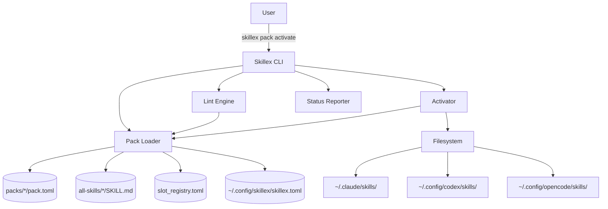
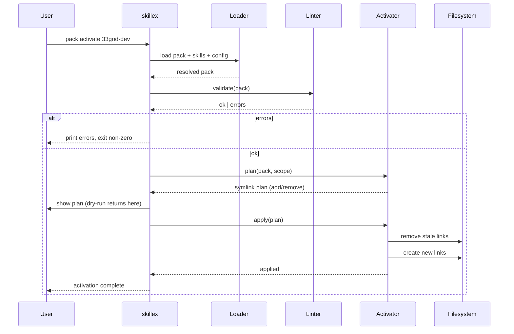
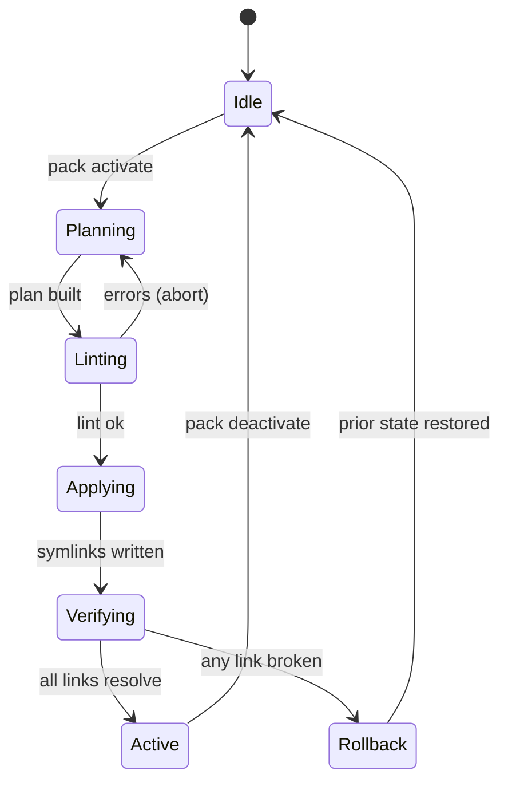

# Skillex MVP PRD

**Status:** Draft v0.1 (MVP scope locked)
**Owner:** Jarad DeLorenzo
**Last updated:** 2026-04-16

---

## Assumptions

These are baked into the draft. Override any that are wrong before we move to Plan phase.

1. Skillex is a local CLI. No daemon, no server, no remote registry in MVP.
2. Filesystem is the source of truth. No database, no state file. Symlinks encode activation.
3. Skills in `all-skills/` follow the existing convention (directory with `SKILL.md` plus arbitrary supporting files).
4. Target CLIs for MVP are `claude`, `codex`, `opencode`. Fixtures for `gemini`, `crush`, `augment`, `kimi` stay in `test/` and come online in a follow-up milestone (see M1.5).
5. `all-skills/` stays a git submodule. Skillex does not manage its contents, only reads/symlinks from it.
6. Pack activation is idempotent and fully reversible. Deactivate restores prior state.
7. Users are comfortable with TOML for config and YAML for skill frontmatter.
8. MVP is Python + uv + Typer. Rust port is a future milestone once the API shape is stable.

---

## 1. Objective

Skillex is a CLI-agnostic skill package manager that gives Jarad (and eventually a team) a single lever for swapping agent capability sets across every agentic coding CLI on a machine, with type-safe composition and zero runtime drift.

**Why now:** Maintaining parity by hand across multiple CLIs means a skill lands in one root and rots in the others. MVP targets Claude, Codex, OpenCode; Gemini, Crush, Augment, Kimi onboard in M1.5 once the adapter contract is proven. Packs curated for specific contexts (33god work, ChoreScore frontend, infra ops) need to be turnkey, not something reassembled every time.

**Core promise:** One pack manifest, one command, identical capability landscape in every CLI's skill root, with lint-time guarantees that no slot is double-filled and no name collides.

---

## 2. Users and User Stories

**Primary user:** A staff engineer running multiple AI coding CLIs, maintaining a personal skill library, switching between projects with different capability needs.

**Secondary user (later):** Teammates inheriting curated packs to match an agreed-on development loadout.

### User Stories

1. **Swap a pack for context.** As a user entering the `33god` repo, I run `skillex pack activate 33god-dev` and all three active CLIs (Claude, Codex, OpenCode) immediately reflect the new skill loadout without me touching `~/.claude/skills`, `~/.config/codex/skills`, or `~/.config/opencode/skills` by hand.

2. **Define a pack declaratively.** As a user, I drop a `pack.toml` into `packs/33god-dev/` declaring which skill fills each slot (Memory, Workflow, Review, etc.) and `skillex pack lint` tells me before activation if any slot type mismatches.

3. **Scope an override per project.** As a user working in `my-repo/`, I run `skillex pack activate frontend-ui --scope project` and the repo gets its own active pack that wins over my global default when a CLI is launched inside the repo tree.

4. **See the live state.** As a user, I run `skillex status` and get a table showing active pack per scope, each filled slot, which skill is in it, and which CLI roots are currently in sync.

5. **Catch conflicts early.** As a user adding a new Memory skill to a pack that already has Hindsight in its Memory slot, I get a clear lint error listing both candidates and refusing to activate.

6. **Roll back cleanly.** As a user who activated a pack and regretted it, I run `skillex pack deactivate --scope global` and every CLI root returns to its prior state.

7. **Dry run an activation.** As a user evaluating a pack, I run `skillex pack activate foo --dry-run` and see exactly which symlinks would be created and which existing links would be removed, without touching disk.

---

## 3. Goals and Non-Goals

### Goals

- One skill definition, N CLI roots rendered identically from it.
- Declarative, lintable pack manifests.
- Typed slot system preventing capability collisions.
- Two-scope cascade (global, project) with filesystem-native precedence.
- Filesystem as single source of truth. No out-of-band state.
- Idempotent, reversible activation.
- Sub-second activation for packs up to 50 skills.
- Structured logging for every activation and deactivation event.
- Progressive expansion: adapter and slot coverage grow on demand post-MVP. Each new adapter or slot ships with a regression test proving existing packs remain valid.

### Non-Goals (MVP)

- Hooks, scripts, commands bundling (packs full scope, deferred).
- Remote pack registry or distribution mechanism.
- Version pinning, semver resolution, or dependency graphs between skills.
- Multi-pack per scope (MVP is one active pack per scope).
- GUI, TUI, or web interface.
- Translating skill content between CLI-native formats (see open question 3).
- Managing `all-skills/` submodule contents (pull/update operations).

---

## 4. Core Concepts

| Term                | Definition                                                                                                     |
| ------------------- | -------------------------------------------------------------------------------------------------------------- |
| **Skill**           | A self-contained capability unit. Directory under `all-skills/` with a `SKILL.md` and optional files.          |
| **Slot Type**       | A canonical capability category from the slot registry. Examples: `Memory`, `Workflow`, `Review`, `Planning`.  |
| **Slotted Skill**   | A skill whose `SKILL.md` frontmatter declares a `slotType`. Eligible for slot placement in packs.              |
| **Unslotted Skill** | A skill with no `slotType`. Can be included via freeform pack entries but not slot-checked.                    |
| **Pack**            | A directory under `packs/` containing a `pack.toml` manifest that binds named slots to specific skills.        |
| **Slot Registry**   | Canonical list of allowed slot types shipped with skillex. Extensible via `custom:` prefix.                    |
| **Scope**           | Activation level. `global` (user-level CLI roots) or `project` (repo-level CLI roots inside the current repo). |
| **CLI Adapter**     | Config entry mapping a CLI name to its global skill root, project skill root, and render rules.                |
| **Activation**      | The process of materializing a pack into every configured CLI root as symlinks pointing back to `all-skills/`. |
| **Effective Set**   | The union of skills active in the current scope, with project overriding global where scopes overlap.          |

---

## 5. Architecture

### High-Level Components



### Activation Flow



### Scope Precedence

```
~/.claude/skills/       ← global scope render target
my-repo/.claude/skills/ ← project scope render target (overrides global when CLI runs in repo)
```

CLIs natively walk up the directory tree; skillex relies on that behavior rather than computing an effective set. Global and project activations are independent writes to different directories.

---

## 6. Tech Stack

| Concern             | Choice                          | Rationale                                                                                          |
| ------------------- | ------------------------------- | -------------------------------------------------------------------------------------------------- |
| Language            | Python 3.12+                    | Fast iteration, mature filesystem libs, matches your stack. Rust is a v2 port once API stabilizes. |
| Package manager     | `uv`                            | Fast, lockfile-native, matches your associative cloud.                                             |
| CLI framework       | `typer` + `rich`                | Declarative subcommands, native help, pretty tables for `status`.                                  |
| Config parsing      | `tomllib` (stdlib) + `pydantic` | Strict typing, validation at load.                                                                 |
| Frontmatter parsing | `python-frontmatter`            | Standard YAML frontmatter extraction.                                                              |
| Logging             | `structlog`                     | Structured JSON by default, pretty console for TTY.                                                |
| Testing             | `pytest` + `pytest-fixtures`    | Use existing `test/` layout as fixture roots.                                                      |
| Task runner         | `mise`                          | Already in repo.                                                                                   |

---

## 7. Commands

```
Install:   uv sync
Dev:       uv run skillex <subcommand>
Build:     uv build
Test:      uv run pytest
Test (cov):uv run pytest --cov=skillex --cov-report=term-missing
Lint:      uv run ruff check .
Format:    uv run ruff format .
Typecheck: uv run mypy skillex
```

---

## 8. Project Structure

```
/home/delorenj/.agents/skillex/
├── all-skills/                    # submodule, master skill pool (unchanged)
├── packs/                         # NEW: unified pack manifests (absorbs skill-sets/)
│   └── 33god-dev/
│       ├── pack.toml              # manifest
│       └── README.md              # optional human context
├── docs/
│   └── prd/
│       └── skillex-mvp.md         # this document
├── src/
│   └── skillex/
│       ├── __init__.py
│       ├── cli.py                 # typer entrypoint
│       ├── commands/              # subcommand modules
│       │   ├── pack.py
│       │   ├── skill.py
│       │   ├── slot.py
│       │   └── status.py
│       ├── core/
│       │   ├── models.py          # pydantic models: Pack, Skill, Slot, Config
│       │   ├── loader.py          # reads packs, skills, config, registry
│       │   ├── linter.py          # validation rules
│       │   ├── activator.py       # plan + apply symlink operations
│       │   └── registry.py        # canonical slot types
│       └── adapters/
│           ├── base.py            # CLI adapter interface
│           ├── claude.py
│           ├── codex.py
│           └── opencode.py
├── tests/
│   ├── unit/
│   ├── integration/
│   └── fixtures/
│       └── sample-packs/
├── test/                          # existing fixture with CLI roots, used by integration tests
├── pyproject.toml
├── mise.toml
└── AGENTS.md                      # canonical, symlinked as CLAUDE.md + GEMINI.md
```

---

## 9. Data Schemas

### 9.1 Skill Frontmatter (`all-skills/<skill>/SKILL.md`)

```yaml
---
name: hindsight
description: Shared team memory persistence across sessions
version: 0.3.1
slotType: Memory # optional; omit for unslotted skills
tags: [memory, persistence, team]
---
# Hindsight Skill

(skill body in markdown)
```

**Rules:**

- `name` must be unique across all skills in `all-skills/`.
- `slotType` must match a registered slot type or be prefixed `custom:`.
- Missing frontmatter means the skill is unslotted and unavailable for slotted pack entries.

### 9.2 Pack Manifest (`packs/<pack>/pack.toml`)

```toml
[pack]
name = "33god-dev"
version = "0.1.0"
description = "Standard loadout for 33god development"

[slots.memory]
required = true
skill = "hindsight"

[slots.workflow]
required = false
skill = "n8n-bridge"

[slots.review]
required = true
skill = "code-review-adversarial"

# Unslotted / freeform skills always included in this pack
[freeform]
skills = ["mermaid-expert", "c4-architecture"]
```

**Rules:**

- Slot keys are lowercase slot-type names (`memory` for `Memory`).
- Custom slot types use the full prefixed name: `[slots."custom:voice-cloning"]`.
- `required = true` slots must resolve to an existing slotted skill with matching `slotType`. Activation fails otherwise.
- `freeform.skills` entries must exist in `all-skills/` but have no slot-type constraint.

### 9.3 Skillex Config (`~/.config/skillex/skillex.toml`)

```toml
[skillex]
skills_root = "/home/delorenj/.agents/skillex/all-skills"
packs_root = "/home/delorenj/.agents/skillex/packs"
log_format = "console"  # or "json"

[scopes.global]
active_pack = "33god-dev"

[cli.claude]
enabled = true
global_root = "~/.claude/skills"
project_root = ".claude/skills"

[cli.codex]
enabled = true
global_root = "~/.config/codex/skills"
project_root = ".codex/skills"

[cli.opencode]
enabled = true
global_root = "~/.config/opencode/skills"
project_root = ".opencode/skills"

# Post-MVP adapters (M1.5): gemini, crush, augment, kimi.
# Config schema is stable; adding them is a matter of shipping adapter modules
# and enabling the entries above.
```

### 9.4 Project Config (`<repo>/.skillex.toml`)

```toml
[scopes.project]
active_pack = "frontend-ui"
```

Project config only needs to declare its active pack; CLI adapters inherit from global.

### 9.5 Slot Registry (shipped with skillex)

```toml
[slots]
types = [
  "Memory",
  "Workflow",
  "TTS",
]
```

**MVP ships with three slot types.** Additional slots are added on demand, one PR per slot, each including:

1. Registry entry update.
2. At least one slotted skill example in `all-skills/` declaring the new type.
3. A regression test proving no existing pack breaks.

Custom slots remain available via the `custom:` prefix without a registry update, for prototyping before promotion to canonical.

---

## 10. CLI Command Surface

```
skillex init                                   # create ~/.config/skillex/skillex.toml from template
skillex status [--cli <name>] [--json]         # show active packs, filled slots, CLI sync status
skillex doctor                                 # (M2) lint config, verify symlinks, find drift

skillex pack list
skillex pack show <name>
skillex pack lint <name>
skillex pack activate <name> [--scope global|project] [--dry-run]
skillex pack deactivate [--scope global|project]
skillex pack create <name>                     # scaffold new pack directory

skillex skill list [--slot <type>] [--unslotted]
skillex skill show <name>

skillex slot list                              # show registry + which skills fill each type
```

---

## 11. Lint Rules

Run automatically before every activation and via explicit `skillex pack lint <name>`.

| Rule                  | Severity | Description                                                             |
| --------------------- | -------- | ----------------------------------------------------------------------- |
| `SLOT_TYPE_MISMATCH`  | error    | Skill assigned to slot declares a different `slotType`.                 |
| `SLOT_SKILL_MISSING`  | error    | Pack references a skill not present in `all-skills/`.                   |
| `SLOT_TYPE_UNKNOWN`   | error    | Slot type not in registry and not prefixed `custom:`.                   |
| `REQUIRED_SLOT_EMPTY` | error    | Pack declares `required = true` but slot has no skill.                  |
| `DUPLICATE_SKILL`     | error    | Same skill name appears in multiple slots or in both slot and freeform. |
| `NAME_COLLISION`      | error    | Two skills in `all-skills/` have the same `name` frontmatter.           |
| `PACK_NAME_CONFLICT`  | error    | Two packs share a `[pack].name`.                                        |
| `UNSLOTTED_IN_SLOT`   | error    | Skill without `slotType` placed in a typed slot.                        |
| `MISSING_FRONTMATTER` | warn     | Skill referenced by name but has no frontmatter at all.                 |
| `ORPHAN_SLOT`         | warn     | Optional slot with no skill assigned (informational).                   |

---

## 12. State Transitions

Activation is a three-step state machine per CLI root.



### Deterministic ordering

1. Compute target state (set of symlinks that should exist after activation).
2. Compute diff against current state (add, remove, keep).
3. Remove stale links first, then create new links.
4. Verify every new link resolves to an existing file in `all-skills/`.
5. On any verification failure, restore prior state from the pre-activation snapshot held in memory.

---

## 13. Failure Modes and Rollback

| Failure                        | Detection                              | Recovery                                                 |
| ------------------------------ | -------------------------------------- | -------------------------------------------------------- |
| Lint error pre-activation      | Lint engine                            | Abort before any FS write. Exit 1 with structured error. |
| Broken symlink post-write      | Verify step                            | Restore prior state from in-memory snapshot, exit 2.     |
| Missing CLI root directory     | Adapter                                | Auto-create if parent exists; error if parent missing.   |
| User edited a symlink manually | `skillex status` diff                  | `skillex doctor` (M2) can repair.                        |
| `all-skills/` submodule stale  | Skill load                             | Warn at load time if referenced skill path missing.      |
| Concurrent activation          | File lock at `~/.config/skillex/.lock` | Second invocation blocks or fails fast.                  |

Rollback strategy: every activation snapshots existing symlinks in each CLI root into memory before mutation. On any error during apply, the snapshot is restored. No partial state persists.

---

## 14. Code Style Example

```python
# src/skillex/core/activator.py

from __future__ import annotations

from dataclasses import dataclass
from pathlib import Path
from typing import Iterable

import structlog

from skillex.core.models import Pack, SkillexConfig

log = structlog.get_logger()


@dataclass(frozen=True)
class LinkOp:
    """Single symlink operation in an activation plan."""
    action: str  # "add" | "remove" | "keep"
    target: Path  # where the symlink lives (in a CLI root)
    source: Path  # what it points to (in all-skills/)


class Activator:
    """Plans and applies pack activations as symlink operations.

    Activation is deterministic: remove stale links, create new ones, verify,
    snapshot on entry so any error triggers full rollback.
    """

    def __init__(self, config: SkillexConfig) -> None:
        self._config = config

    def plan(self, pack: Pack, scope: str) -> list[LinkOp]:
        """Compute diff between current and target symlink state per CLI root."""
        ...

    def apply(self, plan: Iterable[LinkOp], *, dry_run: bool = False) -> None:
        """Execute the plan atomically with rollback on failure."""
        ...
```

**Conventions:**

- Pydantic for all config and manifest parsing.
- `pathlib.Path` for all filesystem ops; no string paths.
- Strict typing, `mypy --strict`.
- Frozen dataclasses for value objects.
- Ruff-enforced formatting (line length 100).
- Structured logging with key-value pairs, never f-string interpolation into log messages.

---

## 15. Testing Strategy

| Layer       | Scope                                                       | Framework                             |
| ----------- | ----------------------------------------------------------- | ------------------------------------- |
| Unit        | Loader, linter, model validation, adapter path resolution   | `pytest`                              |
| Integration | Activation against fixture CLI roots in `test/`             | `pytest` with tmpdir copies           |
| Contract    | Each adapter's path computation and link creation           | `pytest` parametrized across adapters |
| Smoke       | `skillex pack activate` end-to-end using `test/` as `--cwd` | shell-based in CI                     |

**Coverage target:** 85% on `skillex.core`, 70% overall.

**Test fixture pattern:** Each integration test clones `test/` to a `tmp_path`, runs skillex against it, asserts on the resulting symlink graph. No test touches user's real CLI roots.

---

## 16. Boundaries

### Always do

- Run `ruff check && mypy && pytest` before committing.
- Snapshot state before any FS mutation.
- Emit a structured log event for every activate / deactivate / lint invocation.
- Use absolute paths in all config and symlinks.
- Treat `all-skills/` as read-only.

### Ask first

- Adding a new slot type to the canonical registry (breaking change for others' packs).
- Introducing any non-filesystem state (cache, database, lockfile beyond the activation mutex).
- Changing pack.toml schema after MVP ships.
- Adding a new CLI adapter (needs a fixture CLI root under `test/`).
- Adding runtime dependencies beyond typer, pydantic, structlog, python-frontmatter, rich.

### Never do

- Write to `all-skills/`.
- Store activation state outside the filesystem (symlinks are SOT).
- Perform partial activations (no half-state on error).
- Mutate user's real CLI roots during tests.
- Couple skill content format to a specific CLI's native format. If CLIs need different renders, solve it in adapters, not in skill authoring.

---

## 17. Success Criteria

MVP ships when all of the following hold:

1. `skillex init` creates a valid config with all 3 MVP adapters (Claude, Codex, OpenCode) registered.
2. `skillex pack activate 33god-dev --scope global --dry-run` produces a correct plan against the `test/` fixture.
3. `skillex pack activate 33god-dev --scope global` populates all 3 CLI roots with identical symlink graphs.
4. `skillex pack lint` catches every rule listed in section 11 with a fixture pack per rule.
5. `skillex pack deactivate` restores the exact prior state (verified by `diff`).
6. `skillex status` shows active pack and per-CLI sync status.
7. Integration tests cover the full activate/deactivate/lint loop per CLI.
8. `ruff`, `mypy --strict`, `pytest` all pass in CI.
9. Activating a 50-skill pack completes in under 500ms on a local SSD.

---

## 18. Future Milestones

Effort sizes: XS, S, M, L, XL.

| Milestone                                  | Scope                                                                                              | Effort        |
| ------------------------------------------ | -------------------------------------------------------------------------------------------------- | ------------- |
| **M1 (MVP)**                               | Everything above. Claude + Codex + OpenCode adapters. Memory + Workflow + TTS slots.               | L             |
| **M1.5: adapter expansion**                | Gemini, Crush, Augment, Kimi adapters. Progressive, one per PR with fixture verification.          | S per adapter |
| **M1.6: slot registry expansion**          | Add canonical slot types as skill library grows (Context, Planning, Review, Debug, Testing, etc.). | XS per slot   |
| **M2: doctor + drift detection**           | `skillex doctor` detects manually edited links, offers repair.                                     | S             |
| **M3: packs full scope**                   | Hooks, scripts, commands bundling. Per-CLI hook shims calling shared scripts.                      | XL            |
| **M4: multi-pack per scope + inheritance** | Stack packs with explicit precedence rules. Packs can `extends` other packs.                       | M             |
| **M5: remote pack registry**               | Git-based pack distribution, `skillex pack install <url>`.                                         | L             |
| **M6: version pinning**                    | Pack declares skill versions, lint enforces.                                                       | M             |
| **M7: Rust port**                          | Replace Python implementation, ship as single static binary.                                       | XL            |
| **M8: skill format translator**            | Handle CLI-native format divergence if it emerges.                                                 | L             |
| **M9: TUI**                                | Interactive `skillex` for browsing, toggling, previewing.                                          | L             |

---

## 19. Open Questions

Resolved decisions captured here for traceability. Anything still unresolved is flagged at the bottom.

### Resolved

1. **Pack vs slot-set separation.** **RESOLVED:** collapse `skill-sets/` into `packs/`. Migrate existing content during Plan phase.

2. **Custom slot types registry-wide.** **RESOLVED (adopted lean):** reusable, first-write wins, tracked in `~/.config/skillex/custom_slots.toml` alongside the canonical registry. Promotion from custom to canonical is a registry PR per slot.

3. **CLI-native format divergence.** **RESOLVED:** format parity spike scoped to Claude, Codex, OpenCode only. Plan phase begins with a manual experiment dropping one `SKILL.md` into each of the three `test/.<cli>/skills/` directories and confirming the CLI picks it up natively. If any of the three diverges, adapter spec absorbs the render logic (still MVP) rather than deferring to M8.

4. **Project scope detection.** **RESOLVED (adopted lean):** walk up from `cwd` looking for `.skillex.toml`; fall back to git root if none found. No `.skillex.toml` + no git root means global scope only.

5. **Symlinks on Windows.** **RESOLVED:** out of scope for MVP. Linux + macOS only.

6. **AGENTS.md symlink pattern.** **RESOLVED:** out of scope. Skillex manages skill-root symlinks only. Doc-file linking (`CLAUDE.md` → `AGENTS.md`) belongs to a separate tool.

7. **Pack inheritance.** **RESOLVED:** deferred to M4. MVP packs are flat.

### Still open

None blocking Plan phase. Any new question raised during planning gets appended here.

---

## 20. Verification Checklist

Before moving to Plan phase:

- [x] Assumptions section reviewed and corrected by Jarad.
- [x] Open questions answered or explicitly deferred.
- [x] Slot registry list approved (section 9.5): `Memory`, `Workflow`, `TTS`.
- [x] CLI adapter list approved (section 9.3): `claude`, `codex`, `opencode`.
- [ ] Success criteria accepted as testable definition of done.
- [ ] Boundaries section accepted as the guardrails.
- [ ] This document committed to `docs/prd/skillex-mvp.md`.
