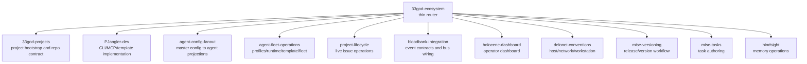

# 33GOD Skill Hierarchy Boundaries

> Recommendation for splitting the 33GOD / DeLoNET project ecosystem skills into a router plus non-overlapping member skills.

Date: 2026-07-01

## Implementation Status

Implemented on 2026-07-01:

- `33god-ecosystem` created as the thin router / skill-set hub.
- `33god-projects` narrowed to project bootstrap and repo contracts.
- `agent-config-fanout` created; SSOT fan-out engine content moved out of `project-jangler`.
- `agent-fleet-operations` created; `hermes-pm-template-maintenance` kept as a compatibility shim.
- `project-jangler` narrowed to PJangler implementation only.
- `bloodbank-integration` anchors updated from `holyfields/` to Bloodbank `schemas/` and `docs/event-naming.md`.
- `skills.manifest.yaml` updated: `33god_ecosystem` bucket now lists the router plus member skills.
- Symlinks added in `skill-sets/global/` for the new skills.

Not implemented (boundary preserved):

- `holocene-dashboard` — add only if dashboard work becomes recurring.

## Executive Summary

The current ecosystem has the right raw material, but the boundaries are doing too much work in a few places. `33god-projects` is acting as a project bootstrap skill, a Hermes provisioning router, a BMAD/mise conventions guide, and a hook fan-out guide. `project-jangler` mixes PJangler internals with a generic config fan-out engine. `hermes-pm-template-maintenance` contains the most precise Hermes fleet truth, but its name is narrower than its actual job. Bloodbank and Plane are already close to the right shape: they should remain specialized operational skills, with clearer source-of-truth contracts.

The optimal shape is a thin `33god-ecosystem` hub plus scoped member skills. The hub should route by intent and carry only cross-cutting source-of-truth rules. Implementation details should live in member skills and references.

Recommended target:

- Add `33god-ecosystem` as the router / skill-set hub.
- Keep `33god-projects`, but narrow it to project bootstrap and repo contracts.
- Split `project-jangler` into PJangler implementation and a separate agent config fan-out skill.
- Rename or wrap `hermes-pm-template-maintenance` as `agent-fleet-operations`; keep PM template maintenance as a reference lane inside it.
- Keep Plane issue lifecycle in `project-lifecycle`; make `.project.json` and the PJangler registry inputs, not Plane-owned truth.
- Keep `bloodbank-integration` as the event-system owner, but update its current anchors to Bloodbank `docs/event-naming.md` and `schemas/`.
- Add a `holocene-dashboard` skill if Holocene work remains frequent; do not make `html-project-console` cover Holocene.
- Keep `delonet-conventions`, `mise-versioning`, `mise-tasks`, `hindsight`, and `html-project-console` as standalone supporting skills.

## Design Constraints

These constraints came from the live repos and existing skill architecture:

- Skill roots should not contain overlapping implementation skills except for a deliberate meta/router skill.
- `all-skills/` can contain every canonical skill, but enabled skill sets should compose compatible combinations.
- Hub bodies should stay small, ideally under 200 lines, and should route to references or member skills.
- The project registry is the project source of truth; Plane and Hermes are downstream integrations.
- `.project.json` is a repo-local projection of project identity, not the global project registry.
- Hermes fleet files are runtime truth for agents, not project truth.
- Bloodbank owns event contracts; Candystore owns durable audit; Holocene owns operator UI consumption.

## Proposed Topology



## Source Of Truth Map

| Domain | Owner skill | Durable source | Downstream projections |
|---|---|---|---|
| Project registry | `33god-projects` for use, `project-jangler` for implementation | `~/.config/pjangler/projects.yaml`, or `PJ_PROJECT_REGISTRY` | Repo `.project.json`, Plane board link, Hermes agent requests |
| Repo scaffold | `33god-projects` | `pjangler/templates/commonproject` | New repo files, BMAD docs, mise tasks, project hooks |
| Repo-local project identity | `33god-projects` | `.project.json` | Plane detection, Hermes agent provider detection, local tooling |
| PJangler code | `project-jangler` | `/home/delorenj/code/pjangler/src`, `templates/commonproject` | CLI, MCP tools, dist output |
| Agent config fan-out | `agent-config-fanout` | master config files such as `.agents/hooks/hooks.master.json` or Bloodbank `services/agent-hooks` | Claude, Codex, Kimi, Hermes, and other CLI-specific configs |
| Hermes fleet runtime | `agent-fleet-operations` | `~/.hermes/fleet.env`, `~/.hermes/config.yaml`, `~/.hermes/agents-registry.yaml` | systemd units, runtime repos, wrappers, role profiles |
| Hermes agent template | `agent-fleet-operations` | `/home/delorenj/code/hermes-agent-template` plus vendored/submodule copies | PM, scrum-master, dev, ops, review, QA agents |
| Ticket lifecycle | `project-lifecycle` | Plane API / board state | Issue creation, state changes, labels, sprint views |
| Event contract | `bloodbank-integration` | Bloodbank `docs/event-naming.md`, `schemas/`, compose topology | Producers, consumers, Dapr/NATS subjects, generated SDKs |
| Durable event audit | `bloodbank-integration` with Candystore reference | Candystore repo and DB migrations | Candystore API, UI, summaries |
| Operator dashboard | `holocene-dashboard` | Holocene app, API services, UI design docs | Fleet, tooling, systems, containers views |
| Host conventions | `delonet-conventions` | home layout, zshyzsh, Docker/Traefik/Tailscale conventions | Project defaults and operator commands |
| Version workflow | `mise-versioning` | repo `mise.toml`, release tasks, changelog/version files | commits, tags, package versions |
| Task authoring | `mise-tasks` | repo `mise.toml` / `.mise.toml` `[tasks]` | local workflows and build/test/release DAGs |
| Memory operations | `hindsight` | Hindsight memory banks | durable recollection, summaries, retrieval |

## Skill Boundaries

### `33god-ecosystem` - New Hub

Topology: skill-set hub / meta skill.

Owns:

- Routing across the 33GOD project platform.
- The source-of-truth map above.
- A small decision table for common multi-skill combinations.
- Cross-cutting rules such as "project registry before Plane/Hermes" and "Bloodbank owns event schemas."

Does not own:

- Implementation procedures.
- Long command snippets.
- Plane API details.
- Hermes runtime repair steps.
- Bloodbank schema authoring details.

Body target: 120-180 lines.

### `33god-projects` - Narrow To Project Bootstrap

Topology: member skill with references.

Owns:

- Creating and maintaining 33GOD project repos.
- CommonProject template usage.
- PJangler project registry usage.
- `.project.json` projection semantics.
- Per-repo BMAD, mise, Hindsight, and hook baseline.
- Project-scoped Hermes agent requests from the bootstrap side.

Move out:

- Fleet-wide Hermes updates and profile inheritance details. Route those to `agent-fleet-operations`.
- Generic master-to-agent config fan-out mechanics. Route those to `agent-config-fanout`.
- Plane live issue lifecycle. Route that to `project-lifecycle`.
- Bloodbank event contract details. Route that to `bloodbank-integration`.

Keep as references:

- `project-creation.md`
- `bmad-init.md`
- `mise-conventions.md`
- `project-scoped-hooks.md`
- A short `hermes-project-agent-request.md` that explains what the project side asks Hermes to provision.

### `project-jangler` - PJangler Implementation Only

Topology: member skill.

Owns:

- PJangler CLI internals.
- PJangler MCP server tools.
- Commands/Recipes architecture.
- Project registry implementation.
- CommonProject copier implementation and tests.
- Dist/build/regression workflows for pjangler itself.

Move out:

- Generic SSOT fan-out engine rules.
- Bloodbank hook config projections.
- Project usage recipes that do not require changing PJangler code.

This skill should trigger when the user is editing `/home/delorenj/code/pjangler`, adding CLI/MCP behavior, changing templates, or debugging PJangler tests.

### `agent-config-fanout` - New Member

Topology: member skill.

Owns:

- Master config to generated per-agent config patterns.
- Lock files and generated-file protection.
- CLI-specific projection targets for Claude, Codex, Kimi, Hermes, Copilot, and future agent tools.
- `defer_to_global` and per-developer local override behavior.
- Cross-repo reuse of sync/check/uninstall mechanics.

Does not own:

- Event names emitted by hooks. Route to Bloodbank.
- PJangler command implementation. Route to `project-jangler`.
- Project bootstrap decisions. Route to `33god-projects`.

Canonical examples:

- CommonProject `.agents/hooks/README.md`
- `.agents/hooks/hooks.master.json`
- Bloodbank `services/agent-hooks`

### `agent-fleet-operations` - Rename Or Wrap Existing Hermes Skill

Topology: member skill with references.

Recommended migration:

1. Create `agent-fleet-operations` as the canonical skill.
2. Keep `hermes-pm-template-maintenance` as a compatibility shim or alias for one migration cycle.
3. Move PM-template-specific material into `references/template-maintenance.md`.

Owns:

- Hermes shared install and wrappers.
- `~/.hermes/fleet.env`
- `~/.hermes/config.yaml`
- `~/.hermes/agents-registry.yaml`
- `hermes-agent-template`
- Role profiles and provider/model inheritance.
- Runtime repo provisioning.
- systemd user units.
- Fleet self-checks, backfills, and core updates.
- Template defaults for PM and future agents.

Does not own:

- Which project exists. That is PJangler registry / `33god-projects`.
- What Plane tickets mean. That is Plane.
- Bloodbank event naming. That is Bloodbank.

### `project-lifecycle` - Keep Specialized

Topology: standalone/member skill.

Owns:

- Plane board and issue operations.
- Creating, updating, labeling, and auditing tickets.
- Sprint views, WIP limits, promotion, and changelogs.
- Plane API quirks and authentication.

Boundary update recommended:

- Add `.project.json` and the PJangler project registry as higher-priority 33GOD detection inputs than legacy `.plane.json` where present.
- State explicitly that project identity and board binding are authored by `33god-projects` / PJangler, while this skill operates the live board.

### `bloodbank-integration` - Keep, But Update Current Anchors

Topology: member skill.

Owns:

- Bloodbank event naming and schema workflow.
- NATS/Dapr/CloudEvents topology.
- Producers and consumers.
- Agent harness event emission.
- Candystore integration boundary and audit handoff.
- Event debugging.

Boundary update recommended:

- Replace stale `holyfields/schemas/` language with current Bloodbank `schemas/` and `docs/event-naming.md` anchors where the live repo has moved.
- Keep Candystore as a reference topic unless Candystore app implementation becomes frequent enough to justify a separate skill.
- Avoid owning generic NATS, generic Kafka, or Holocene dashboard rendering.

### `holocene-dashboard` - New Member If Dashboard Work Remains Frequent

Topology: member skill.

Owns:

- Holocene operator dashboard implementation.
- Fleet/tooling/systems/container views.
- Live data renderers, polling/SSE patterns, Redis-backed status displays.
- Holocene visual language and dense operator UI conventions.

Does not own:

- Hermes runtime truth.
- Bloodbank event schema truth.
- Plane issue lifecycle.
- Host Docker/Traefik conventions.

Do not use `html-project-console` for Holocene. `html-project-console` is a single-file planning cockpit skill, not a production dashboard skill.

### Supporting Skills That Should Stay Put

`delonet-conventions` should remain the host/workstation/network convention skill. It should route project bootstrap to `33god-projects` and PJangler development to `project-jangler`, not duplicate either.

`mise-versioning` should remain focused on version bump, changelog, commit, tag, and release workflow.

`mise-tasks` should remain focused on task authoring and orchestration.

`hindsight` should remain the memory operations skill. Project bootstrap may wire it, but should not document retrieval/retain internals.

`html-project-console` should remain the single-file project cockpit skill.

## Routing Matrix

| User intent | Load first | Then load if needed |
|---|---|---|
| "Create a new 33GOD project" | `33god-ecosystem` -> `33god-projects` | `project-jangler` only for PJangler code changes; `project-lifecycle` only for live board actions; `agent-fleet-operations` only for actual agent provisioning |
| "Change CommonProject template" | `33god-ecosystem` -> `project-jangler` | `33god-projects` for expected project-facing behavior |
| "Add a PM or scrum-master agent to this repo" | `33god-ecosystem` -> `33god-projects` | `agent-fleet-operations` for runtime/template/systemd details; Plane only for live ticket/board action |
| "Update Hermes model/profile/default config" | `33god-ecosystem` -> `agent-fleet-operations` | `33god-projects` only if repo projection changes |
| "Fix inherited Hermes config after upstream update" | `agent-fleet-operations` | none unless repo-local agent projections changed |
| "Create or move Plane tickets" | `project-lifecycle` | `33god-projects` only to resolve project binding from `.project.json` |
| "Define an event or debug missing envelopes" | `bloodbank-integration` | `agent-config-fanout` only if an agent hook projection is broken |
| "Change Candystore ingestion or audit UI" | `bloodbank-integration` | future `candystore-audit` only if app implementation becomes frequent |
| "Change Holocene Systems tab / fleet UI" | `holocene-dashboard` | `bloodbank-integration`, `agent-fleet-operations`, or Plane only to understand upstream data contracts |
| "Change project-scoped hook generation" | `agent-config-fanout` | `33god-projects` if the CommonProject baseline changes; `bloodbank-integration` if event emission changes |
| "Fix zsh, Traefik, Tailscale, Docker stack convention" | `delonet-conventions` | project skills only if a repo scaffold must change |
| "Bump version and release" | `mise-versioning` | `mise-tasks` only if release task DAG must change |
| "Author or debug mise tasks" | `mise-tasks` | `delonet-conventions` only for host-level env conventions |

## Common Combinations

Project bootstrap:

1. `33god-ecosystem`
2. `33god-projects`
3. `project-lifecycle` only when `--live` board work is requested
4. `agent-fleet-operations` only when live agent provisioning is requested

PJangler implementation:

1. `project-jangler`
2. `33god-projects` for expected project-facing contract
3. `mise-versioning` or `mise-tasks` only if release/task workflows change

Agent hook and skill fan-out:

1. `agent-config-fanout`
2. `33god-projects` for CommonProject install baseline
3. `bloodbank-integration` if hook events are emitted

Hermes fleet maintenance:

1. `agent-fleet-operations`
2. `project-lifecycle` only if creating/closing maintenance tickets
3. `33god-projects` only if repo `.project.json` or project registry projections change

Event system work:

1. `bloodbank-integration`
2. `agent-config-fanout` for agent hook projections
3. `holocene-dashboard` only for UI consumption of event status

Operator dashboard work:

1. `holocene-dashboard`
2. `agent-fleet-operations` for fleet runtime facts
3. `bloodbank-integration` for event contract facts
4. `project-lifecycle` for board state facts

## Not Recommended

Do not keep expanding `33god-projects` into the universal platform manual. It is already close to the limit where a user asking "create a project" loads unrelated fleet update, hook fan-out, and runtime maintenance detail.

Do not make CommonProject its own full skill yet. It is a template and contract under `33god-projects` and `project-jangler`. Promote it only if template maintenance becomes a frequent standalone activity separate from PJangler implementation.

Do not split Candystore immediately. Its boundary matters, but current usage is still mostly Bloodbank audit integration. Add `candystore-audit` later if there is regular work on migrations, query API, retention, or React audit UI independent of Bloodbank.

Do not merge Holocene into Bloodbank or Hermes. Holocene consumes their data; it should not own their contracts.

Do not let Plane own project identity. Plane owns live issues and board operations. PJangler owns the project registry, and `.project.json` is the repo projection.

## Migration Plan

1. Create `33god-ecosystem` as a thin skill-set hub with the source-of-truth map and routing matrix.
2. Narrow `33god-projects` by moving fleet maintenance detail to Hermes and fan-out mechanics to the new fan-out skill.
3. Add `agent-fleet-operations`, preserving `hermes-pm-template-maintenance` as a compatibility shim or alias during migration.
4. Split `project-jangler` so PJangler implementation remains there and generic fan-out moves to `agent-config-fanout`.
5. Update `bloodbank-integration` anchors to current Bloodbank paths and clarify Candystore as audit boundary.
6. Add `holocene-dashboard` if dashboard work is recurring; otherwise leave Holocene routing as a note in `33god-ecosystem`.
7. Update enabled skill sets so router plus members are composed deliberately, with no duplicate copied skills.
8. Run a trigger-audit pass: for each routing row, confirm exactly one primary skill and any optional secondaries.

## Acceptance Criteria

- Each member skill has an explicit "Owns" and "Does not own" section.
- The hub has no long implementation recipes and stays below 200 lines.
- Each common user intent maps to one primary skill.
- No enabled skill root contains two implementation skills with the same owner domain.
- Project creation always starts from project registry / `.project.json`, not Plane or Hermes.
- Hermes fleet repair never starts from CommonProject.
- Event schema work always starts from Bloodbank.
- Holocene dashboard work treats Bloodbank, Hermes, and Plane as upstream data sources.
- PJangler code changes use `project-jangler`; project usage uses `33god-projects`.

## Verification Commands

Use these after the migration:

```bash
rg -n "hermes-fleet|Hermes|fleet.env|agents-registry" all-skills/33god-projects all-skills/agent-fleet-operations
rg -n "project registry|\\.project\\.json|CommonProject" all-skills/33god-projects all-skills/project-jangler
rg -n "hooks.master|defer_to_global|generated" all-skills/agent-config-fanout all-skills/33god-projects all-skills/project-jangler
rg -n "event-naming|schemas/|Candystore|CloudEvents|NATS|Dapr" all-skills/bloodbank-integration
rg -n "Holocene|Systems tab|operator dashboard|fleet|tooling" all-skills/holocene-dashboard
```

The expected result is not "no matches." The expected result is that each term appears in the owning skill and only as a short routing/out-of-scope note in neighboring skills.
