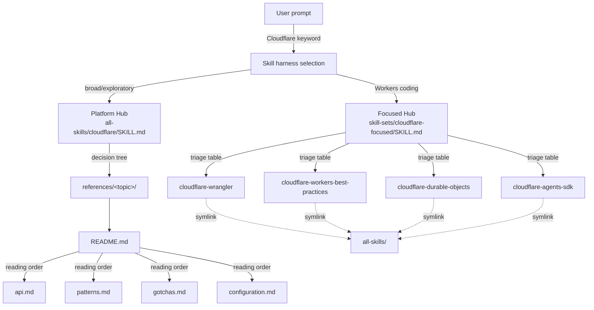
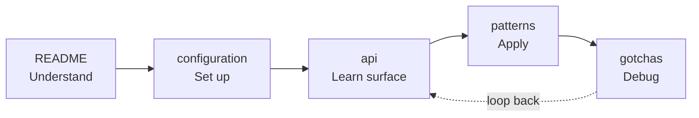

# Cloudflare Progressive Discovery Hub: Architecture Analysis

> A reusable pattern for skill systems that scale from one product to sixty.

## Table of Contents

- [1. Executive Summary](#1-executive-summary)
- [2. Why This Architecture Matters](#2-why-this-architecture-matters)
  - [2.1 The Token Economy Problem](#21-the-token-economy-problem)
  - [2.2 The Naive Monolithic Alternative](#22-the-naive-monolithic-alternative)
  - [2.3 What Progressive Discovery Buys You](#23-what-progressive-discovery-buys-you)
- [3. The Two-Tier Hub Model](#3-the-two-tier-hub-model)
  - [3.1 Platform Hub (Breadth)](#31-platform-hub-breadth)
  - [3.2 Focused Hub (Depth)](#32-focused-hub-depth)
  - [3.3 When to Use Each](#33-when-to-use-each)
  - [3.4 Topology Diagram](#34-topology-diagram)
- [4. Anatomy of a Hub Skill](#4-anatomy-of-a-hub-skill)
  - [4.1 Frontmatter Design](#41-frontmatter-design)
  - [4.2 Body Structure (Platform Hub Variant)](#42-body-structure-platform-hub-variant)
  - [4.3 Body Structure (Focused Hub Variant)](#43-body-structure-focused-hub-variant)
  - [4.4 Routing Mechanics](#44-routing-mechanics)
- [5. The Reference Taxonomy](#5-the-reference-taxonomy)
  - [5.1 The Universal Five-File Pattern](#51-the-universal-five-file-pattern)
  - [5.2 README.md: The Navigational Layer](#52-readmemd-the-navigational-layer)
  - [5.3 api.md: The Method Reference](#53-apimd-the-method-reference)
  - [5.4 patterns.md: Implementation Patterns](#54-patternsmd-implementation-patterns)
  - [5.5 gotchas.md: The Failure Knowledge Base](#55-gotchasmd-the-failure-knowledge-base)
  - [5.6 configuration.md: Setup Reference](#56-configurationmd-setup-reference)
  - [5.7 Cross-Reference Conventions](#57-cross-reference-conventions)
  - [5.8 Progressive Depth Model](#58-progressive-depth-model)
- [6. Composition and Routing](#6-composition-and-routing)
  - [6.1 Symlink-Based Single Source of Truth](#61-symlink-based-single-source-of-truth)
  - [6.2 Triage Tables](#62-triage-tables)
  - [6.3 Common Combinations](#63-common-combinations)
  - [6.4 Discovery Hints by Code Signal](#64-discovery-hints-by-code-signal)
  - [6.5 Cross-Cutting Rules at the Hub](#65-cross-cutting-rules-at-the-hub)
- [7. Twelve Transferable Principles](#7-twelve-transferable-principles)
- [8. Applying the Pattern: A Replication Guide](#8-applying-the-pattern-a-replication-guide)
  - [8.1 Decision: Should Your Skill Be a Hub?](#81-decision-should-your-skill-be-a-hub)
  - [8.2 Designing Your Frontmatter](#82-designing-your-frontmatter)
  - [8.3 Choosing Your Reference Taxonomy](#83-choosing-your-reference-taxonomy)
  - [8.4 Writing Your Reading Order Tables](#84-writing-your-reading-order-tables)
  - [8.5 Authoring Gotchas in the Four-Part Structure](#85-authoring-gotchas-in-the-four-part-structure)
  - [8.6 Establishing Cross-Cutting Rules](#86-establishing-cross-cutting-rules)
  - [8.7 Setting Out-of-Scope Boundaries](#87-setting-out-of-scope-boundaries)
- [9. Anti-Patterns and Failure Modes](#9-anti-patterns-and-failure-modes)
- [10. Quick Reference Checklist](#10-quick-reference-checklist)
- [Appendix A: Frontmatter Schema Cheat Sheet](#appendix-a-frontmatter-schema-cheat-sheet)
- [Appendix B: File-Type Scoping Cheat Sheet](#appendix-b-file-type-scoping-cheat-sheet)
- [Appendix C: Verbatim Examples from the Cloudflare Skill](#appendix-c-verbatim-examples-from-the-cloudflare-skill)
- [Appendix D: Source Files Referenced](#appendix-d-source-files-referenced)

---

## 1. Executive Summary

The Cloudflare skill in this repository implements a two-tier hub architecture that solves a hard problem: how to give an agent useful access to a sprawling product surface (60+ Cloudflare products) without forcing it to load thousands of lines of context up front. The architecture is worth studying because it generalizes. Any skill system that covers a non-trivial domain (a cloud platform, a framework family, a multi-product SaaS) will eventually face the same scaling pressure, and the pattern documented here is a proven response.

The architecture has two complementary instantiations. The first is a monolithic platform hub at `/home/delorenj/code/skillex/all-skills/cloudflare/SKILL.md` that uses decision trees and an exhaustive product index to route across the entire Cloudflare surface. The second is a focused skill-set hub at `/home/delorenj/code/skillex/skill-sets/cloudflare-focused/SKILL.md` that triages narrowly among four specialized child skills (wrangler, workers-best-practices, durable-objects, agents-sdk) using a triage table and pre-computed combination layouts. The two coexist: the platform hub is for breadth, the focused hub is for depth on the Workers ecosystem subset.

Beneath the hubs sits a uniform reference taxonomy. Every product directory under `references/` follows an identical five-file layout: `README.md` (navigational), `api.md` (deep method reference), `patterns.md` (implementation recipes), `gotchas.md` (structured error catalog), and `configuration.md` (setup-only). This uniformity is not aesthetic. It removes ambiguity from where information lives, which means an agent that has loaded one product directory has implicitly learned the loading rules for all 60+ others. The README in each directory contains a reading order table that converts what would otherwise be a reasoning task ("which file do I open first?") into a table lookup.

The pattern produces twelve transferable principles, ranging from frontmatter design to cross-cutting rule hoisting. Many of these are routinely violated in skills that grew organically. The most common failure modes are weak triggering descriptions, monolithic SKILL.md bodies (often above 300 lines) that interleave principles and procedures, missing reading order tables, ad-hoc reference taxonomies, and implicit out-of-scope boundaries. Each violation has a concrete fix derivable from the Cloudflare model.

This document is a reference. Read sections 2-6 for the architectural narrative. Read section 7 for the principles in checklist form. Read section 8 if you are about to apply this pattern to a new skill. Read section 9 if you are auditing an existing skill that feels bloated or unreliable. The appendices provide cheat sheets for daily use.

---

## 2. Why This Architecture Matters

### 2.1 The Token Economy Problem

Skills are loaded into agent context. Every line in `SKILL.md`, every linked reference, every embedded example consumes tokens. The harder constraint is not absolute token count but the marginal cost of irrelevant content: an agent that has loaded the entire Cloudflare API reference to answer a single question about KV consistency has wasted >95% of the context budget on text it will not use. That waste compounds across a session.

The token economy has three pressures that pull in different directions:

1. **Routing accuracy** demands that the description and frontmatter contain enough trigger keywords for the harness to select the right skill at the right moment.
2. **Cognitive load** demands that the SKILL.md body, once loaded, be small enough that an agent can reason about all of it without losing the original task.
3. **Coverage** demands that the skill, taken as a whole (SKILL.md + references), contain enough domain knowledge to avoid hallucinating answers.

Resolving these three is the entire job of the architecture in this document. The Cloudflare skill resolves them by making the SKILL.md a router (small body, dense frontmatter) and the references a flat depth tier (loaded on demand, organized so the agent can pick exactly one or two files).

### 2.2 The Naive Monolithic Alternative

Consider what the alternative looks like. A naive Cloudflare skill might be a single 2000-line `SKILL.md` containing every API method for every product, every gotcha, every configuration snippet. This pattern shows up frequently in skills that grew organically without architectural review. It looks like:

- One enormous SKILL.md that "tells the agent everything it might need."
- A `references/` directory of two or three files with non-uniform structure, named by topic rather than role.
- Inline gotchas scattered throughout the body, mixed with principles, mixed with code examples.
- An indistinct frontmatter description that triggers on too many or too few prompts.

The failure modes follow predictably. The skill loads when irrelevant. Once loaded, it floods the context with material the agent does not need. Maintenance becomes painful because adding a new subtopic requires editing a single shared file. And because there is no per-subtopic depth tier, the agent cannot make a "load this part, skip that part" choice: it gets everything or nothing.

### 2.3 What Progressive Discovery Buys You

Progressive discovery is the inverted approach. The hub is small and dense. The references are flat and uniform. The agent's reading path is a series of cheap decisions, each one narrowing scope.

The benefits, concretely:

- **Selection precision.** A keyword-dense description triggers the skill correctly without the body needing to disambiguate.
- **Bounded context per task.** A typical KV question loads the hub (a few hundred lines) plus `references/kv/README.md` (under 100 lines) plus, on demand, one of the four deep files. Total: a small fraction of what a monolithic skill would load.
- **Uniform mental model.** Once the agent has navigated one reference directory, the structure of every other directory is implicit.
- **Cheap maintenance.** Adding a 61st product means creating a new five-file directory and adding two index lines, not touching the hub body or any peer directory.
- **Cross-skill composability.** Because each skill's structure is predictable, the focused-hub layer can compose multiple skills without re-explaining each one.

The rest of this document is the spec for how that pattern is implemented and how to replicate it.

---

## 3. The Two-Tier Hub Model

### 3.1 Platform Hub (Breadth)

The platform hub at `/home/delorenj/code/skillex/all-skills/cloudflare/SKILL.md` is the single canonical entry point for the entire Cloudflare product surface. Its job is to route an arbitrary Cloudflare question to the right `references/<topic>/` directory. It does not contain implementation detail. It contains decision trees and a product index.

Use a platform hub when:

- The domain has a wide product surface (more than ~10 distinct subtopics).
- Subtopics are weakly coupled (a question about R2 rarely also needs KV detail).
- You cannot enumerate all subtopics as separate sibling skills without combinatorial explosion of the skill list.
- The harness benefits from one skill that owns the entire vocabulary of the platform.

### 3.2 Focused Hub (Depth)

The focused hub at `/home/delorenj/code/skillex/skill-sets/cloudflare-focused/SKILL.md` is a narrower router. It triages tasks among four specialized child skills (wrangler, workers-best-practices, durable-objects, agents-sdk). Its job is not to cover the entire platform but to cover a coherent ecosystem (the Workers runtime and its closest neighbors) at production-grade depth, where the children themselves are full skills with their own SKILL.md bodies.

Use a focused hub when:

- A small group (3-6) of skills are routinely co-loaded for the same class of tasks.
- The children are each substantial enough to deserve their own SKILL.md (not collapsed into a reference file).
- You want pre-computed multi-skill combinations for common scenarios.

### 3.3 When to Use Each

The two are complementary, not competing. The platform hub is for "tell me about Cloudflare's storage options" or "which product handles WAF rules?" The focused hub is for "review this Worker PR" or "build a multiplayer game on Durable Objects." The platform hub assumes the agent does not yet know which corner of the platform it needs. The focused hub assumes the agent has chosen a corner and now needs to author production code.

In practice, the focused hub is invoked by trigger keywords that signal a coding task ("Workers", "Wrangler", "Durable Objects"), while the platform hub is invoked by broader triggers ("Cloudflare", "edge platform", "feature flags").

### 3.4 Topology Diagram



The diagram captures three things: (1) two co-existing routers chosen by the harness based on prompt signals, (2) a two-level indirection on the platform side (hub then directory README then deep file), and (3) symlink-based composition on the focused side that points back to the canonical `all-skills/` definitions.

---

## 4. Anatomy of a Hub Skill

### 4.1 Frontmatter Design

The frontmatter is the routing key. It is the only part of the skill the harness sees before deciding to load it. Sparse or generic descriptions cause miss-fires (skill loads on the wrong prompt, or fails to load on the right one). The Cloudflare hubs both treat the description field as a keyword-dense router specification.

Verbatim from the platform hub:

```yaml
---
name: cloudflare
description: Comprehensive Cloudflare platform skill covering Workers, Pages, storage (KV, D1, R2), AI (Workers AI, Vectorize, Agents SDK), feature flags (Flagship), networking (Tunnel, Spectrum), security (WAF, DDoS), and infrastructure-as-code (Terraform, Pulumi). Use for any Cloudflare development task. Biases towards retrieval from Cloudflare docs over pre-trained knowledge.
references:
  - workers
  - pages
  - d1
  - durable-objects
  - workers-ai
---
```

Three things to notice. First, the description enumerates every major product category by name. Token cost paid here is paid once at selection time and pays dividends every time the skill loads correctly. Second, the `references` field lists only the five most frequently loaded topics, not all 63 directories: it is a pre-warming hint to the harness, not a manifest. Third, the bias toward retrieval is declared in the description itself, before the body is ever read. If the agent is going to be told "do not trust pre-trained knowledge," it should know that before it commits to loading the skill.

The focused hub uses the same pattern with a different emphasis:

```yaml
---
name: cloudflare
description: Hub skill for any Cloudflare Workers platform task. Triages the request and routes to one or more specialized skills covering CLI/config (wrangler), Worker code authoring & review (workers-best-practices), stateful coordination (durable-objects), and AI agents on Workers (agents-sdk). Load when the user mentions Cloudflare, Workers, Pages, Wrangler, Durable Objects, KV, R2, D1, Vectorize, Hyperdrive, Queues, Workflows, Workers AI, the Agents SDK, MCP servers on Workers, or any deploy/dev/binding/observability task targeting Cloudflare's edge.
---
```

The "Load when" clause is a textbook example of [Principle 1: Keyword-Dense Description as Router](#principle-1-keyword-dense-description-as-router). It enumerates twenty-plus concrete trigger phrases. The four child skills are also named explicitly so the routing structure is visible to the harness before any content is loaded. There is no `references` field because this hub does not reference reference files: it routes to child SKILL.md files via symlinks.

### 4.2 Body Structure (Platform Hub Variant)

The platform hub body has three sections, in order:

1. **Retrieval Sources Table** (immediately after the title). A four-column table listing canonical sources (Cloudflare docs, Workers types, Wrangler config schema, product changelogs) with retrieval methods. This appears first because it is read sequentially: you want the agent to encounter sources before it encounters any potentially-stale content. See [Principle 10: Explicit Retrieval Source Table](#principle-10-explicit-retrieval-source-table).

2. **Decision Trees**. Eight ASCII decision trees organized by user need, each headed by a question phrased as the user might phrase it ("I need to run code", "I need to store data", "I need AI/ML"). Every leaf node resolves to a concrete `references/<topic>/` path. The tree syntax is uniform:

   ```
   Need [X]?
   ├─ [condition] → topic/
   │  ├─ [sub-condition] → specific path
   │  └─ [sub-condition] → specific path
   └─ [fallback] → topic/
   ```

3. **Product Index**. A flat multi-category table mapping every product to its `references/<topic>/` path. This is the exhaustive catalog, used when the decision trees do not match.

The order matters. Decision trees come before the index because they match in O(depth) (typically 2-4 hops). The index matches in O(n). Always present the cheap match first. See [Principle 5: Decision Tree Navigation Before Index](#principle-5-decision-tree-navigation-before-index).

### 4.3 Body Structure (Focused Hub Variant)

The focused hub body has six sections, in order:

1. **Opening framing**. One sentence stating purpose ("Router for the four Cloudflare-focused skills. Load only the child skills the task actually needs, not all four.").
2. **Retrieval norm**. One sentence reinforcing the cross-cutting bias.
3. **Triage table**. Two-column mapping of task signals to child skill files.
4. **Common combinations table**. Pre-computed multi-skill load orders for common scenarios.
5. **Cross-cutting rules**. Rules that apply regardless of which child skill is loaded.
6. **Discovery hints**. Concrete code-signal patterns (import statements, CLI invocations).
7. **Out-of-scope declaration**. Explicit redirects for adjacent domains.

The combination of triage table, combinations table, and discovery hints provides three independent routing surfaces: by task signal (verbal), by scenario (precomputed), and by code signal (matchable). An agent that fails one surface usually succeeds on another.

### 4.4 Routing Mechanics

Routing in a hub is not a single operation. It is a layered match. The Cloudflare hubs use four routing tools together:

1. **Primary triage table** (by task signal). Verbal description of what the user wants, mapped to skill or reference path.
2. **Common combinations table** (by scenario). Pre-computed bundles for tasks that span multiple subtopics.
3. **Discovery hints** (by code signal). When the user pastes code or shell commands, match on imports, file names, CLI flags.
4. **Cross-cutting rules** at the hub level. Rules that apply to all children, hoisted so the agent does not have to load a child to read them.

Each surface catches different prompt shapes. A user who says "I'm reviewing a Worker PR" is caught by the triage table. A user who says "I'm building a chat room" is caught by the combinations table. A user who pastes `import { DurableObject } from "cloudflare:workers"` is caught by discovery hints. A user who asks "should I use service bindings or HTTP?" is answered by the cross-cutting rules without loading any child.

---

## 5. The Reference Taxonomy

### 5.1 The Universal Five-File Pattern

Every topic directory under `/home/delorenj/code/skillex/all-skills/cloudflare/references/` follows the same structure:

```
references/<topic>/
├── README.md          # Navigational, shallow, always loaded first
├── api.md             # Deep method reference
├── configuration.md   # Setup-only (CLI, bindings, types)
├── gotchas.md         # Structured error catalog
└── patterns.md        # Implementation recipes
```

The exception is `references/workers/`, which adds `frameworks.md` for framework-specific guidance. The five core files are always present.

This uniformity is the single most important property of the reference layer. It encodes a depth contract: README is always shallow and navigational, the other four are always deep and load-on-demand. An agent that has loaded one directory has implicitly learned the loading rules for all 60+ others. See [Principle 4: Uniform Five-File Reference Taxonomy](#principle-4-uniform-five-file-reference-taxonomy).

### 5.2 README.md: The Navigational Layer

The README is the only file in a topic directory that should be loaded reflexively when the topic is selected. It has six required components:

1. **One-paragraph overview**. What the product is, in 2-3 sentences.
2. **Quick comparison table** (when/when-not). A small table that helps the agent decide whether this product or a sibling is the right fit.
3. **Quick start** code snippet. Five to ten lines of representative code so the agent can confirm it understands the surface.
4. **Reading order table**. Indexed by task type, mapping to file sequence.
5. **In This Reference** section. Bulleted list of the other files in the directory with one-line descriptions.
6. **See Also** section. Cross-references to sibling topic directories.

A verbatim example of the reading order table from `/home/delorenj/code/skillex/all-skills/cloudflare/references/kv/README.md`:

```markdown
| Task | Files to Read |
|------|---------------|
| Quick start | README → configuration.md |
| Implement feature | README → api.md → patterns.md |
| Debug issues | gotchas.md → api.md |
| Batch operations | api.md (bulk section) → patterns.md |
| Performance tuning | gotchas.md (performance) → patterns.md (caching) |
```

The reading order table is the meta-navigation device. Without it, the agent must reason about which file to open. With it, the choice becomes a table lookup keyed on the task description. See [Principle 3: Reading Order Table as Meta-Navigation](#principle-3-reading-order-table-as-meta-navigation).

### 5.3 api.md: The Method Reference

The deep method reference. Contains:

- Complete method signatures with TypeScript types.
- Parameter tables.
- Code examples for every method variant.
- Cross-references to `gotchas.md` for error patterns specific to each method.

Crucially, `api.md` does not contain implementation patterns or recipes. Those live in `patterns.md`. It does not contain setup instructions. Those live in `configuration.md`. It contains the surface area of the API and nothing else. This scoping is what makes the file loadable in isolation: an agent can read just `api.md` and be confident it has the API surface, without wading through unrelated material.

### 5.4 patterns.md: Implementation Patterns

Implementation recipes. Each pattern has:

- A named heading describing the pattern.
- A comment explaining the purpose and when to apply it.
- A full code block, preferably with good/bad annotations where relevant.

Patterns are not API documentation. They assume the agent already knows the API. They show how to compose API calls into solutions for specific problems (caching, sessions, rate limiting, A/B testing, etc.). The boundary between `api.md` and `patterns.md` is the boundary between "what the API does" and "how to use it for X".

### 5.5 gotchas.md: The Failure Knowledge Base

The structured error catalog. This file is one of the most distinctive and reusable parts of the architecture. Every entry follows a four-part structure:

1. **Quoted error name** (heading). The exact string as it appears in logs or compiler output.
2. **Cause** (one sentence). Why the error happens.
3. **Solution** (one sentence). How to fix it.
4. **Bad/good code pair** with comments. Concrete code showing the mistake and the correction.

A verbatim example:

```markdown
### "Stale Read After Write"
**Cause:** Eventual consistency means writes may not be immediately visible
**Solution:** Don't read immediately after write; use the local value you just wrote
```

The reason for the four-part structure is matchability. Agents debugging unfamiliar systems most reliably do so by matching the literal error string against a knowledge base. Quoted error names enable that match. Free-form prose does not. See [Principle 11: Gotchas as Structured Error Catalog](#principle-11-gotchas-as-structured-error-catalog).

### 5.6 configuration.md: Setup Reference

Setup-only reference. Contains:

- CLI commands to create resources.
- `wrangler.jsonc` binding snippets.
- TypeScript type declaration examples.
- Local development setup.

What `configuration.md` does NOT contain: usage patterns, gotchas, or API reference. This is the strictest scoping rule in the taxonomy. The reasoning is that an agent setting up a new resource is in a different cognitive mode than one debugging an existing one. The two should not have to scan the same file. See [Appendix B: File-Type Scoping Cheat Sheet](#appendix-b-file-type-scoping-cheat-sheet).

### 5.7 Cross-Reference Conventions

The taxonomy uses a consistent linking convention:

- **Peer files** (within the same topic directory): `[gotchas.md](./gotchas.md)`.
- **Sibling topics** (cross-directory): `[D1](../d1/)`, `[Durable Objects](../durable-objects/)`.
- **External docs** (Cloudflare official): full URLs.
- **Directional reference flow**: `api.md` delegates to `gotchas.md` for error patterns; `gotchas.md` delegates to `patterns.md` for canonical solutions.

Directional flow matters because it prevents reference cycles. If `api.md` and `gotchas.md` both link freely to each other for everything, the agent loses the depth signal. By saying "api delegates to gotchas, gotchas delegates to patterns," the architecture establishes a directed graph that the agent can traverse confidently.

### 5.8 Progressive Depth Model

The five files map to a cognitive sequence: README -> configuration -> api -> patterns -> gotchas. This matches the developer arc of working with a new product:

1. Understand what it is (README).
2. Set it up (configuration).
3. Learn the API (api).
4. Apply it to a real problem (patterns).
5. Debug what breaks (gotchas).



The reading order tables in each README.md are tuned to this sequence but allow short-circuits. A debugging task starts at `gotchas.md`, not at the beginning. A quick-start task ends at `configuration.md`. The reading order table is what lets the agent skip ahead correctly.

---

## 6. Composition and Routing

### 6.1 Symlink-Based Single Source of Truth

The repository's project rule is explicit: "All skills are defined once in `all-skills/` and symlinked elsewhere when needed. There must be no duplicate skills."

This rule is implemented in the focused hub directory:

```
skill-sets/cloudflare-focused/
├── cloudflare-agents-sdk -> ../../all-skills/cloudflare-agents-sdk
├── cloudflare-durable-objects -> ../../all-skills/cloudflare-durable-objects
├── cloudflare-workers-best-practices -> ../../all-skills/cloudflare-workers-best-practices
├── cloudflare-wrangler -> ../../all-skills/cloudflare-wrangler
└── SKILL.md
```

The symlinks point back to the canonical definitions in `all-skills/`. The focused hub itself is the only file in the directory that is not a symlink. This means: any edit to a child skill propagates to every skill-set that includes it, and any new skill-set that wants to include the child does so by creating a symlink, not a copy.

The reason this matters is that copies diverge. As soon as the focused hub copies the durable-objects skill into its own directory, every future edit must be applied twice, and any drift between the two copies is a silent bug. Symlinks make the references identical by definition. See [Principle 12: Symlink-Based Single Source of Truth](#principle-12-symlink-based-single-source-of-truth).

### 6.2 Triage Tables

The focused hub's primary routing surface is its triage table. Verbatim:

```markdown
| Task signal | Load |
|---|---|
| `wrangler …` command, `wrangler.jsonc` config, KV/R2/D1/Vectorize/Hyperdrive/Queues/Workflows CLI, secrets, deploys, environments, `wrangler types` | **wrangler** → `cloudflare-wrangler/SKILL.md` |
| Writing or reviewing Worker source, handler signatures, streaming, `waitUntil`, floating promises, global state, bindings, observability config, security patterns | **workers-best-practices** → `cloudflare-workers-best-practices/SKILL.md` |
| Stateful coordination (chat rooms, multiplayer, booking), RPC methods, SQLite-backed storage, alarms, WebSocket hibernation, `getByName`, sharding | **durable-objects** → `cloudflare-durable-objects/SKILL.md` |
| AI agents, `Agent` class, `@callable`, `useAgent`/`useAgentChat`, scheduled tasks, AgentWorkflow, MCP server/client, chat agents, durable execution, voice/browser tools | **agents-sdk** → `cloudflare-agents-sdk/SKILL.md` |
```

Every row enumerates concrete signals (CLI commands, identifier names, code patterns) rather than abstract descriptions. "Stateful coordination" is paired with concrete examples ("chat rooms, multiplayer, booking"). This is deliberate: vague task signals produce vague matches.

### 6.3 Common Combinations

The combinations table is the focused hub's pre-computed bundle layer. Verbatim:

```markdown
| Scenario | Load (in order) |
|---|---|
| New Worker from scratch | wrangler → workers-best-practices |
| Reviewing a Worker PR | workers-best-practices (+ durable-objects if DOs touched, + agents-sdk if agents touched) |
| Building a chat room / multiplayer app | durable-objects → workers-best-practices → wrangler |
| Building an AI agent (chat, MCP server, scheduled) | agents-sdk → wrangler (durable-objects only if customizing the underlying DO) |
| Wiring KV/R2/D1/Vectorize/Hyperdrive bindings | wrangler → workers-best-practices |
| Setting up CI / staging / production envs | wrangler |
| Debugging deploy/auth/types/startup-time errors | wrangler |
```

Why pre-compute? Because naive triage routes to a single skill, but most real Worker tasks need two or three. Without the combinations table, the agent would route to the primary skill and then have to re-decide which secondaries to layer. The table makes the layering explicit, ordered, and conditional ("+durable-objects if DOs touched").

The order is significant. "Load wrangler first, then workers-best-practices" means the agent reads CLI/config knowledge before reading code-authoring knowledge. The order matches the dependency direction: you need to understand the runtime contract (bindings, env, compatibility) before you write code against it. See [Principle 9: Pre-Computed Combination Tables](#principle-9-pre-computed-combination-tables).

### 6.4 Discovery Hints by Code Signal

When the user pastes code rather than describes a task, verbal triage is unreliable. The focused hub adds a discovery-hints section that matches on code signals:

```markdown
- `import { DurableObject } from "cloudflare:workers"` → durable-objects
- `import { Agent, … } from "agents"` or `from "agents/react"` → agents-sdk
- `import { McpAgent }` or MCP server/transport mentions → agents-sdk
- `wrangler …` in shell, or any `wrangler.jsonc` field discussion → wrangler
- Any review of a `.ts`/`.js` file under a Workers project, with no DO/Agent imports → workers-best-practices
```

These are unambiguous matches. An agent that sees `import { DurableObject } from "cloudflare:workers"` does not need to reason about whether the task is about durable objects: it is. See [Principle 8: Task Signal Disambiguation Section](#principle-8-task-signal-disambiguation-section).

### 6.5 Cross-Cutting Rules at the Hub

The focused hub also hoists rules that apply to all child skills. Verbatim:

```markdown
- **`wrangler.jsonc` is canon.** Prefer JSONC over TOML; newer features are JSON-only.
- **`compatibility_date` recent + `nodejs_compat` flag.** Most libraries assume both.
- **`wrangler types` after every config change.** Never hand-write the `Env` interface.
- **Secrets via `wrangler secret put` (interactive) or `secret bulk` from file.** Never echo, log, hardcode, or pass as CLI args. `.dev.vars` for local only and never committed.
- **Bindings beat REST.** In-process KV/R2/D1/Queues are always preferred over the Cloudflare REST API.
- **Service bindings beat public HTTP** for Worker-to-Worker calls.
- **Hyperdrive for any external Postgres/MySQL.**
- **`extends`, not `implements`** on `DurableObject`, `WorkerEntrypoint`, `Workflow`, `Agent` — `implements` loses `this.ctx` / `this.env`.
- **Don't destructure `ctx`** (`const { waitUntil } = ctx` throws "Illegal invocation").
```

These rules apply across wrangler, workers-best-practices, durable-objects, and agents-sdk. If they lived inside each child skill, they would either be duplicated (and drift) or scattered (and missed). Hoisting them to the hub makes them load-once for every task that touches the focused hub. See [Principle 6: Cross-Cutting Rules Hoisted to Hub](#principle-6-cross-cutting-rules-hoisted-to-hub).

---

## 7. Twelve Transferable Principles

Each principle below has the same shape: name, rule, rationale, concrete Cloudflare example, application guidance.

### Principle 1: Keyword-Dense Description as Router

**Rule.** Pack every relevant trigger keyword, product name, and use-case phrase into the `description` frontmatter field.

**Rationale.** The description is the routing key. The harness sees it before the body. Sparse descriptions cause miss-fires (the skill loads when irrelevant or fails to load when needed). The token cost is paid once at selection time and pays back every load.

**Cloudflare example.** The platform hub description names every product category (Workers, Pages, KV, D1, R2, Workers AI, Vectorize, Agents SDK, Flagship, Tunnel, Spectrum, WAF, DDoS, Terraform, Pulumi). The focused hub adds a "Load when" clause enumerating 20+ trigger phrases.

**Application.** When writing a new skill, list every product name, every CLI command, every concept that should trigger it. Then add use-case phrases ("for any X task"). Aim for 30-50 distinct keywords in the description for a hub skill, fewer for a leaf skill. See [section 8.2](#82-designing-your-frontmatter).

### Principle 2: Retrieval Bias Declaration

**Rule.** State the retrieval-over-pre-training principle at the top of every skill body. Repeat it at every level of the hierarchy.

**Rationale.** Defense in depth against stale pre-trained knowledge. APIs change. Pricing tiers change. Compatibility flags change. The agent should be told, every time, to verify against current docs.

**Cloudflare example.** The platform hub opens with "Your knowledge of Cloudflare APIs, types, limits, and pricing may be outdated. Prefer retrieval over pre-training." The focused hub repeats: "All child skills bias retrieval over pre-trained knowledge." The four child skills each restate it.

**Application.** Add a one-paragraph retrieval-bias declaration immediately after the opening framing in every SKILL.md and every reference README.md. Make it impossible for the agent to read past the first 100 lines without seeing it.

### Principle 3: Reading Order Table as Meta-Navigation

**Rule.** Every README.md must include a reading order table that maps task type to file sequence.

**Rationale.** Without this table, the agent must reason about which file to open next. With it, the choice becomes a table lookup. Reasoning is expensive and error-prone; lookup is cheap and reliable.

**Cloudflare example.** The KV README.md table maps "Quick start" to "README → configuration.md", "Implement feature" to "README → api.md → patterns.md", "Debug issues" to "gotchas.md → api.md", and so on.

**Application.** For every reference directory you author, write a reading order table that anticipates the three or four most common task types and prescribes a file sequence for each. See [section 8.4](#84-writing-your-reading-order-tables).

### Principle 4: Uniform Five-File Reference Taxonomy

**Rule.** Every reference topic directory must contain README.md, api.md, configuration.md, patterns.md, gotchas.md with consistent scoping rules.

**Rationale.** Agents build a mental model of where information lives from the first directory they encounter. If the structure is uniform across all directories, that mental model generalizes for free. If it is not, every directory becomes a fresh discovery problem.

**Cloudflare example.** All 60+ reference directories under `all-skills/cloudflare/references/` follow the five-file pattern. Once an agent has loaded `references/kv/README.md`, it knows what to expect in `references/d1/`, `references/r2/`, `references/durable-objects/`, etc.

**Application.** Pick a five-file (or four-file, or six-file) taxonomy for your domain and apply it to every directory without exception. Document the scoping rules so contributors do not introduce drift. See [section 8.3](#83-choosing-your-reference-taxonomy).

### Principle 5: Decision Tree Navigation Before Index

**Rule.** Present decision trees that route by user intent before exhaustive indexes.

**Rationale.** Decision trees match in O(depth), typically 2-4 hops. Indexes match in O(n). Always present the cheap match first. A user who finds their target in the decision tree never needs to scan the index.

**Cloudflare example.** The platform hub has eight decision trees (compute, storage, AI, networking, security, media, analytics, IaC) before its 60+ row product index. A user looking for KV finds it in the storage tree's first level.

**Application.** For any hub that covers more than a handful of subtopics, identify the most common user-intent groupings ("I need to run code", "I need to store data") and write a decision tree per group. Place all trees before any flat index.

### Principle 6: Cross-Cutting Rules Hoisted to Hub

**Rule.** Extract rules that apply across child skills to the hub level. Do not duplicate them inside each child.

**Rationale.** Duplicated rules drift. Scattered rules get missed. A rule at the hub level loads once and applies to every task that engages the hub.

**Cloudflare example.** The focused hub's nine cross-cutting rules (`wrangler.jsonc` is canon, `compatibility_date` recent, `wrangler types` after every config change, etc.) apply to all four child skills. They are stated once at the hub.

**Application.** When designing a multi-skill hub, identify rules that apply to two or more children. Write them at the hub level. Have each child reference the hub for those rules rather than restating them. See [section 8.6](#86-establishing-cross-cutting-rules).

### Principle 7: Out-of-Scope Declaration at Boundary

**Rule.** Every skill must declare what it does NOT cover, with explicit redirects to alternatives.

**Rationale.** Agents tend to expand a skill's domain to fill uncertainty. Without an explicit boundary, they will try to answer questions that the skill was never designed to answer, often badly. An explicit boundary plus a redirect tells the agent both what to skip and where to go instead.

**Cloudflare example.** The focused hub's out-of-scope section: "Generic frontend frameworks deployed to Pages, load wrangler for `wrangler pages …`, otherwise framework-specific skills. Workflows authored outside the Agents SDK (see Rules of Workflows). Cloudflare Access/Zero Trust, Magic Transit, Stream, not covered by this set."

**Application.** For every skill, list three to five adjacent domains that someone might expect this skill to cover but it does not. State each explicitly with a redirect. See [section 8.7](#87-setting-out-of-scope-boundaries).

### Principle 8: Task Signal Disambiguation Section

**Rule.** Include a "discovery hints" section with concrete matchable signals (imports, file names, CLI commands, identifier patterns).

**Rationale.** Code signals are unambiguous. Natural language is not. When the user pastes `import { DurableObject } from "cloudflare:workers"`, no triage table reasoning is needed: the match is mechanical.

**Cloudflare example.** The focused hub's discovery hints map specific imports and CLI invocations to specific child skills.

**Application.** For any hub that covers multiple coding domains, list the imports, file globs, CLI commands, and identifier patterns that uniquely select each child skill. Make these matchable without inference.

### Principle 9: Pre-Computed Combination Tables

**Rule.** For multi-child hubs, provide pre-computed combination tables in priority-loading order.

**Rationale.** Naive triage produces single-skill routing. Most real tasks need layering. Without a combinations table, the agent loads the primary skill, realizes it needs a secondary, loads that, realizes it needs a tertiary, and so on. The result is unordered, redundant context. With the table, the agent loads in the right order on the first attempt.

**Cloudflare example.** The focused hub's combinations table covers seven scenarios (new Worker, Worker PR review, chat room, AI agent, bindings, CI setup, debugging) with explicit load orders.

**Application.** Identify the five to ten most common task types your hub will receive. For each, write the load order. Make the order conditional where appropriate ("+ durable-objects if DOs touched").

### Principle 10: Explicit Retrieval Source Table

**Rule.** Where the skill covers a domain with live external docs, include a retrieval source table as the first content element in the body.

**Rationale.** Sequential reading. Placing canonical sources before any potentially-stale content ensures the agent encounters the sources first. Trust ordering matters: when reference content disagrees with docs, the docs win.

**Cloudflare example.** The platform hub's retrieval sources table appears immediately after the opening framing. It lists the Cloudflare docs site, the Workers types package, the Wrangler config schema, and product changelogs, each with retrieval methods. The body explicitly says: "When a reference file and the docs disagree, trust the docs."

**Application.** If your skill covers a domain with authoritative external sources, list them in a four-column table (Source / How to retrieve / Use for / Authority over what). Place this table before any decision trees or content.

### Principle 11: Gotchas as Structured Error Catalog

**Rule.** Every gotchas.md entry has a four-part structure: quoted error name (heading) + Cause + Solution + bad/good code pair.

**Rationale.** Agents debugging match against logs. The literal error string is the most reliable match key. Quoted error names enable that match; free-form prose does not.

**Cloudflare example.** The KV gotchas include `### "Stale Read After Write"` with Cause + Solution. The Workers gotchas include similar entries for "Illegal invocation", "Cannot perform I/O on behalf of a different request", etc.

**Application.** When writing gotchas, first collect the literal error strings the agent will see. Use each as a heading verbatim, in quotes. Then write the four-part body. See [section 8.5](#85-authoring-gotchas-in-the-four-part-structure).

### Principle 12: Symlink-Based Single Source of Truth

**Rule.** Skills exist once in `all-skills/`, composed into `skill-sets/` via symlinks. No copies.

**Rationale.** Copies diverge. Symlinks make all references identical by definition. Edit propagation is automatic. New skill-sets cost a few symlinks each, not a fork.

**Cloudflare example.** The focused hub directory at `skill-sets/cloudflare-focused/` contains only its own SKILL.md and four symlinks pointing to `all-skills/cloudflare-{agents-sdk,durable-objects,workers-best-practices,wrangler}`.

**Application.** Define every skill in `all-skills/`. Create skill-sets as directories of symlinks plus a hub SKILL.md. Never copy a skill into a skill-set. If you need a variant, fork in `all-skills/` and symlink the fork.

---

## 8. Applying the Pattern: A Replication Guide

This section is the practical guide. If you are about to build a new skill or refactor an existing one, work through it section by section.

### 8.1 Decision: Should Your Skill Be a Hub?

A skill should be a hub when any of the following are true:

- The domain has more than one major subtopic that an agent would load independently.
- Multiple existing skills are routinely loaded together for the same task class.
- The SKILL.md body has grown past about 250 lines.
- You find yourself writing the same orienting paragraphs in multiple skills.
- Different subsets of the domain trigger on different keywords, but they share cross-cutting rules.

If exactly one of these is true, a focused hub (one SKILL.md plus 3-6 child skills) is probably right. If several are true and the domain is large (>10 subtopics), a platform hub (one SKILL.md plus a flat reference taxonomy) is probably right.

If none are true, do not build a hub. A flat skill with a small `references/` directory will serve you better.

### 8.2 Designing Your Frontmatter

Follow the keyword-dense description rule from [Principle 1](#principle-1-keyword-dense-description-as-router). The description has three parts:

1. **What the skill is.** One sentence stating the domain.
2. **What it covers.** A list, ideally parenthesized, of every concept, product, command, or identifier that should trigger it.
3. **Bias declaration.** A short phrase ("Biases towards retrieval over pre-trained knowledge") if the domain has live external docs.

For a hub skill, also consider:

- A `references` field listing the 3-7 most frequently loaded subtopics. This is a pre-warm hint, not a manifest.
- A `name` field that matches the directory name.

Avoid optional or non-standard fields (`license`, `pipeline-status`, etc.) unless your harness requires them. They violate the uniformity rule and may break compatibility with other tools.

Bad description (vague):
```yaml
description: Helps with cloud platform tasks
```

Good description (keyword-dense):
```yaml
description: Comprehensive Cloudflare platform skill covering Workers, Pages, storage (KV, D1, R2), AI (Workers AI, Vectorize, Agents SDK), feature flags (Flagship), networking (Tunnel, Spectrum), security (WAF, DDoS), and infrastructure-as-code (Terraform, Pulumi). Use for any Cloudflare development task. Biases towards retrieval from Cloudflare docs over pre-trained knowledge.
```

### 8.3 Choosing Your Reference Taxonomy

The Cloudflare five-file pattern (README, api, configuration, patterns, gotchas) is a good default for technical product skills. Adapt it for your domain:

- For a documentation skill, consider (README, audience-guide, style-guide, examples, anti-patterns).
- For a workflow skill, consider (README, sdk-reference, recipes, gotchas, configuration).
- For a tooling skill, consider (README, commands, options-reference, recipes, troubleshooting).

The number is not load-bearing. The uniformity is. Pick four to six file roles, define their scoping rules in writing, and apply them to every directory.

The scoping rules to enforce, regardless of file count:

- README is always shallow and navigational. It is the only file that should be read reflexively.
- One file should be the deep API/method/command reference.
- One file should be implementation patterns (recipes that compose API calls).
- One file should be the structured failure catalog.
- One file should be setup/configuration only.

### 8.4 Writing Your Reading Order Tables

Every README needs one. The columns are always (Task, Files to Read). Rows should cover:

- A quick-start path (usually README → configuration).
- An implementation path (usually README → api → patterns).
- A debugging path (usually gotchas → api).
- One or two specialized paths for common task types ("Batch operations", "Performance tuning", etc.).

Aim for 4-6 rows. Fewer than 3 is too coarse; more than 8 is hard to scan. The KV table is a good template:

```markdown
| Task | Files to Read |
|------|---------------|
| Quick start | README → configuration.md |
| Implement feature | README → api.md → patterns.md |
| Debug issues | gotchas.md → api.md |
| Batch operations | api.md (bulk section) → patterns.md |
| Performance tuning | gotchas.md (performance) → patterns.md (caching) |
```

### 8.5 Authoring Gotchas in the Four-Part Structure

For each gotcha:

1. **Heading.** The literal error string in quotes. Examples: `### "Illegal invocation"`, `### "Cannot perform I/O on behalf of a different request"`, `### "Stale Read After Write"`. If there is no literal error string, use the closest reproducible symptom.

2. **Cause line.** `**Cause:** <one sentence>`. State the underlying mechanism. Do not over-explain.

3. **Solution line.** `**Solution:** <one sentence>`. State the fix in actionable terms.

4. **Bad/good code pair.** Two code blocks, the first showing the mistake, the second showing the correction. Annotate the bad block with a comment explaining what is wrong.

Resist the temptation to write paragraphs. The four-part structure is what makes the entries matchable. Free-form prose buries the match key.

### 8.6 Establishing Cross-Cutting Rules

Cross-cutting rules belong at the hub level when they apply to two or more children. To find them:

1. Read each child skill's body.
2. Note every rule that appears in two or more children, exactly or near-exactly.
3. Lift those rules to the hub.
4. In each child, replace the lifted rule with a reference to the hub ("See cross-cutting rules in the parent skill").

The Cloudflare focused hub's nine cross-cutting rules (jsonc-as-canon, compatibility-date, wrangler-types, secrets-via-wrangler, bindings-beat-rest, service-bindings-beat-http, hyperdrive-for-external-postgres, extends-not-implements, no-ctx-destructure) were derived this way.

### 8.7 Setting Out-of-Scope Boundaries

The out-of-scope section is short, structured as a bulleted list. For each boundary:

- Name the adjacent domain.
- State briefly why it is out of scope.
- Redirect to the alternative skill, doc, or external reference.

Example, verbatim from the focused hub:

```markdown
## Out of scope here

- Generic frontend frameworks deployed to Pages — load **wrangler** for `wrangler pages …`, otherwise framework-specific skills.
- Workflows authored *outside* the Agents SDK — see [Rules of Workflows](https://developers.cloudflare.com/workflows/build/rules-of-workflows/); no dedicated child skill yet.
- Cloudflare Access/Zero Trust, Magic Transit, Stream — not covered by this set.
```

Three to five bullets is typical. Fewer than three suggests you have not thought hard enough about boundary conditions; more than seven suggests your skill's scope is too narrow.

---

## 9. Anti-Patterns and Failure Modes

The following anti-patterns appear in skills that violate one or more of the principles. Each is paired with the principle it violates and a fix derivable from the Cloudflare model. The examples cited come from the gap analysis of the `skill-creator` skill in the raw findings.

### Anti-Pattern 1: Weak Triggering Description

**Symptom.** Description like "Guide for creating effective skills" without artifacts (SKILL.md, init_skill.py), use cases (improving existing skills, structuring references/), or biases declaration. The skill loads inconsistently and misses tasks it should handle.

**Violates.** [Principle 1: Keyword-Dense Description as Router](#principle-1-keyword-dense-description-as-router).

**Fix.** Replace with a description that names every artifact, every use case, and every relevant identifier. See [section 8.2](#82-designing-your-frontmatter).

### Anti-Pattern 2: Linear Workflow as Body

**Symptom.** SKILL.md body organized as a numbered procedural list (Step 1, Step 2, ..., Step 6). Users with existing artifacts must read inapplicable steps to find their entry point. New users must wade through all steps to find the conceptual material.

**Violates.** [Principle 5: Decision Tree Navigation Before Index](#principle-5-decision-tree-navigation-before-index).

**Fix.** Add a decision tree at the top: "Are you creating a new skill? Improving an existing one? Refactoring a monolithic body? Each path resolves to a specific section." Convert linear procedure into branching navigation.

### Anti-Pattern 3: Monolithic Body (>250 Lines)

**Symptom.** SKILL.md interleaves principles, anatomy, design philosophy, and procedural steps. Body length over 300 lines. Each load consumes context disproportionate to the task.

**Violates.** Progressive discovery (the meta-principle behind the entire architecture).

**Fix.** Decompose. Move conceptual material (principles, anatomy) to `references/` files. Keep the body to a hub (decision trees, index, cross-cutting rules). The skill-creator analysis recommends shrinking to 150-200 lines by extracting anatomy and progressive disclosure to dedicated reference files.

### Anti-Pattern 4: Ad-Hoc Reference Taxonomy

**Symptom.** `references/` directory with two or three files (e.g., `output-patterns.md`, `workflows.md`) that have non-standard structure, no reading order tables, and overlap in scope.

**Violates.** [Principle 4: Uniform Five-File Reference Taxonomy](#principle-4-uniform-five-file-reference-taxonomy).

**Fix.** Pick a uniform taxonomy (five files is a good default) and rewrite the existing files into the new structure. Add reading order tables to every README. See [section 8.3](#83-choosing-your-reference-taxonomy).

### Anti-Pattern 5: Missing Gotchas Document

**Symptom.** Common failure modes documented inline in the SKILL.md body or scattered across reference files. No dedicated `gotchas.md`. Agents debugging unfamiliar errors cannot match against a structured catalog.

**Violates.** [Principle 11: Gotchas as Structured Error Catalog](#principle-11-gotchas-as-structured-error-catalog).

**Fix.** Create `gotchas.md`. Move every inline failure description into a four-part entry. Use literal error strings as headings. See [section 8.5](#85-authoring-gotchas-in-the-four-part-structure).

### Anti-Pattern 6: No Out-of-Scope Declaration

**Symptom.** Skill never declares what it does not cover. Agents try to answer adjacent questions (MCP tools, raw prompt engineering, plugin format) using the skill, often badly.

**Violates.** [Principle 7: Out-of-Scope Declaration at Boundary](#principle-7-out-of-scope-declaration-at-boundary).

**Fix.** Add an "Out of scope" section. Three to five bullets, each naming an adjacent domain and redirecting. See [section 8.7](#87-setting-out-of-scope-boundaries).

### Anti-Pattern 7: References Without Cross-Reference Architecture

**Symptom.** SKILL.md mentions reference files only in one section (e.g., "in step 4, see references/foo.md"). Agents reading earlier sections never see the pointer. References become orphaned.

**Violates.** [Principle 3: Reading Order Table as Meta-Navigation](#principle-3-reading-order-table-as-meta-navigation).

**Fix.** Add reading order tables and an "In This Reference" section. Make the references discoverable from any entry point.

### Anti-Pattern 8: Non-Uniform Frontmatter

**Symptom.** Skill frontmatter includes fields like `license`, `pipeline-status`, or other metadata that are not part of the harness contract. The skill itself may even instruct contributors not to add such fields, while violating the rule itself.

**Violates.** Uniformity (the meta-principle behind the entire architecture). Also breaks compatibility with tools that strict-parse frontmatter.

**Fix.** Audit frontmatter. Keep only `name`, `description`, and (for hubs) `references`. Remove everything else. If your harness requires additional fields, document them in a frontmatter schema and apply consistently.

### Anti-Pattern 9: Implicit Cross-Cutting Rules

**Symptom.** Rules that apply to multiple child skills are restated in each child. Over time, copies drift. Bug: an agent following one child's rule contradicts another child's rule.

**Violates.** [Principle 6: Cross-Cutting Rules Hoisted to Hub](#principle-6-cross-cutting-rules-hoisted-to-hub).

**Fix.** Audit each child for shared rules. Lift them to the hub. Replace child copies with hub references. See [section 8.6](#86-establishing-cross-cutting-rules).

### Anti-Pattern 10: Copies Instead of Symlinks

**Symptom.** Multiple skill-sets each contain a copy of the same skill. Edits land in one copy and not the others. The skill list becomes a maintenance liability.

**Violates.** [Principle 12: Symlink-Based Single Source of Truth](#principle-12-symlink-based-single-source-of-truth).

**Fix.** Define every skill in `all-skills/`. Replace skill-set copies with symlinks. Document the rule.

---

## 10. Quick Reference Checklist

Use this checklist to evaluate any skill against the architecture.

**Frontmatter:**

- [ ] Description names every relevant trigger keyword, product, and use case.
- [ ] Description includes a bias declaration if the domain has live external docs.
- [ ] Only `name`, `description`, and (optionally) `references` fields. No `license`, `pipeline-status`, or ad-hoc fields.
- [ ] `references` field, if present, lists 3-7 most-loaded subtopics, not all of them.

**SKILL.md body:**

- [ ] Body is under 250 lines (hub) or under 400 lines (leaf).
- [ ] First content element is a retrieval bias declaration.
- [ ] If hub, second element is a retrieval sources table.
- [ ] Decision trees appear before flat indexes.
- [ ] Triage table and combinations table both present (focused hub) or product index present (platform hub).
- [ ] Discovery hints section with concrete code signals.
- [ ] Cross-cutting rules section if multi-child hub.
- [ ] Out-of-scope section with 3-5 bullets and redirects.

**Reference taxonomy:**

- [ ] All directories follow the same file structure (e.g., five-file pattern).
- [ ] Each README has: overview, comparison table, quick start, reading order table, in-this-reference section, see-also section.
- [ ] api.md contains only API surface.
- [ ] patterns.md contains only implementation recipes.
- [ ] gotchas.md uses four-part structure with quoted error names.
- [ ] configuration.md contains only setup material.
- [ ] Cross-references use peer/sibling/external conventions consistently.

**Composition:**

- [ ] Skills defined once in `all-skills/`.
- [ ] Skill-sets are directories of symlinks plus a hub SKILL.md.
- [ ] No duplicate skill definitions.

If a skill scores below 75% on this checklist, it is a refactor candidate. If below 50%, treat it as architectural debt and prioritize.

---

## Appendix A: Frontmatter Schema Cheat Sheet

| Field | Required | Type | Purpose | Example |
|---|---|---|---|---|
| `name` | Yes | string | Stable identifier matching directory name | `cloudflare` |
| `description` | Yes | string | Keyword-dense routing key with bias declaration | See section 4.1 |
| `references` | No | array of strings | Pre-warm hint listing most-loaded subtopics | `[workers, pages, d1, durable-objects, workers-ai]` |

Anything else: avoid unless your harness requires it. If required, document in a project-level schema.

---

## Appendix B: File-Type Scoping Cheat Sheet

| File | Contains | Does NOT Contain |
|---|---|---|
| `README.md` | Overview, comparison table, quick start, reading order, in-this-reference, see-also | Method signatures, full code patterns, error catalogs, setup instructions |
| `api.md` | Method signatures, parameter tables, per-method examples, cross-references to gotchas | Implementation patterns, setup, gotcha narratives |
| `patterns.md` | Named patterns, full code blocks, good/bad annotations | API signatures, setup, error catalogs |
| `gotchas.md` | Quoted error names, four-part entries (Cause/Solution/bad-good code) | Setup, API surface, narrative explanations |
| `configuration.md` | CLI commands, binding snippets, type declarations, local dev setup | Usage patterns, gotchas, API reference |

---

## Appendix C: Verbatim Examples from the Cloudflare Skill

### C.1 Platform Hub Frontmatter

Source: `/home/delorenj/code/skillex/all-skills/cloudflare/SKILL.md`

```yaml
---
name: cloudflare
description: Comprehensive Cloudflare platform skill covering Workers, Pages, storage (KV, D1, R2), AI (Workers AI, Vectorize, Agents SDK), feature flags (Flagship), networking (Tunnel, Spectrum), security (WAF, DDoS), and infrastructure-as-code (Terraform, Pulumi). Use for any Cloudflare development task. Biases towards retrieval from Cloudflare docs over pre-trained knowledge.
references:
  - workers
  - pages
  - d1
  - durable-objects
  - workers-ai
---
```

### C.2 Focused Hub Frontmatter

Source: `/home/delorenj/code/skillex/skill-sets/cloudflare-focused/SKILL.md`

```yaml
---
name: cloudflare
description: Hub skill for any Cloudflare Workers platform task. Triages the request and routes to one or more specialized skills covering CLI/config (wrangler), Worker code authoring & review (workers-best-practices), stateful coordination (durable-objects), and AI agents on Workers (agents-sdk). Load when the user mentions Cloudflare, Workers, Pages, Wrangler, Durable Objects, KV, R2, D1, Vectorize, Hyperdrive, Queues, Workflows, Workers AI, the Agents SDK, MCP servers on Workers, or any deploy/dev/binding/observability task targeting Cloudflare's edge.
---
```

### C.3 Retrieval Sources Table (Platform Hub)

```markdown
| Source | How to retrieve | Use for |
|--------|----------------|---------|
| Cloudflare docs | `cloudflare-docs` search tool or `https://developers.cloudflare.com/` | Limits, pricing, API reference, compatibility dates/flags |
| Workers types | `npm pack @cloudflare/workers-types` or check `node_modules` | Type signatures, binding shapes, handler types |
| Wrangler config schema | `node_modules/wrangler/config-schema.json` | Config fields, binding shapes, allowed values |
| Product changelogs | `https://developers.cloudflare.com/changelog/` | Recent changes to limits, features, deprecations |
```

### C.4 Decision Tree (Storage)

```
Need storage?
├─ Key-value (config, sessions, cache) → kv/
├─ Relational SQL → d1/ (SQLite) or hyperdrive/ (existing Postgres/MySQL)
├─ Object/file storage (S3-compatible) → r2/
├─ Versioned file trees (repos, build outputs, checkpoints) → artifacts/
├─ Message queue (async processing) → queues/
├─ Vector embeddings (AI/semantic search) → vectorize/
├─ Strongly-consistent per-entity state → durable-objects/ (DO storage)
├─ Secrets management → secrets-store/
├─ Streaming ETL to R2 → pipelines/
└─ Persistent cache (long-term retention) → cache-reserve/
```

### C.5 Triage Table (Focused Hub)

```markdown
| Task signal | Load |
|---|---|
| `wrangler …` command, `wrangler.jsonc` config, KV/R2/D1/Vectorize/Hyperdrive/Queues/Workflows CLI, secrets, deploys, environments, `wrangler types` | **wrangler** → `cloudflare-wrangler/SKILL.md` |
| Writing or reviewing Worker source, handler signatures, streaming, `waitUntil`, floating promises, global state, bindings, observability config, security patterns | **workers-best-practices** → `cloudflare-workers-best-practices/SKILL.md` |
| Stateful coordination (chat rooms, multiplayer, booking), RPC methods, SQLite-backed storage, alarms, WebSocket hibernation, `getByName`, sharding | **durable-objects** → `cloudflare-durable-objects/SKILL.md` |
| AI agents, `Agent` class, `@callable`, `useAgent`/`useAgentChat`, scheduled tasks, AgentWorkflow, MCP server/client, chat agents, durable execution, voice/browser tools | **agents-sdk** → `cloudflare-agents-sdk/SKILL.md` |
```

### C.6 Combinations Table (Focused Hub)

```markdown
| Scenario | Load (in order) |
|---|---|
| New Worker from scratch | wrangler → workers-best-practices |
| Reviewing a Worker PR | workers-best-practices (+ durable-objects if DOs touched, + agents-sdk if agents touched) |
| Building a chat room / multiplayer app | durable-objects → workers-best-practices → wrangler |
| Building an AI agent (chat, MCP server, scheduled) | agents-sdk → wrangler (durable-objects only if customizing the underlying DO) |
| Wiring KV/R2/D1/Vectorize/Hyperdrive bindings | wrangler → workers-best-practices |
| Setting up CI / staging / production envs | wrangler |
| Debugging deploy/auth/types/startup-time errors | wrangler |
```

### C.7 Reading Order Table (KV README)

Source: `/home/delorenj/code/skillex/all-skills/cloudflare/references/kv/README.md`

```markdown
| Task | Files to Read |
|------|---------------|
| Quick start | README → configuration.md |
| Implement feature | README → api.md → patterns.md |
| Debug issues | gotchas.md → api.md |
| Batch operations | api.md (bulk section) → patterns.md |
| Performance tuning | gotchas.md (performance) → patterns.md (caching) |
```

### C.8 Cross-Cutting Rules (Focused Hub)

```markdown
- **`wrangler.jsonc` is canon.** Prefer JSONC over TOML; newer features are JSON-only.
- **`compatibility_date` recent + `nodejs_compat` flag.** Most libraries assume both.
- **`wrangler types` after every config change.** Never hand-write the `Env` interface.
- **Secrets via `wrangler secret put` (interactive) or `secret bulk` from file.** Never echo, log, hardcode, or pass as CLI args. `.dev.vars` for local only and never committed.
- **Bindings beat REST.** In-process KV/R2/D1/Queues are always preferred over the Cloudflare REST API.
- **Service bindings beat public HTTP** for Worker-to-Worker calls.
- **Hyperdrive for any external Postgres/MySQL.**
- **`extends`, not `implements`** on `DurableObject`, `WorkerEntrypoint`, `Workflow`, `Agent` — `implements` loses `this.ctx` / `this.env`.
- **Don't destructure `ctx`** (`const { waitUntil } = ctx` throws "Illegal invocation").
```

### C.9 Out-of-Scope Section (Focused Hub)

```markdown
## Out of scope here

- Generic frontend frameworks deployed to Pages — load **wrangler** for `wrangler pages …`, otherwise framework-specific skills.
- Workflows authored *outside* the Agents SDK — see [Rules of Workflows](https://developers.cloudflare.com/workflows/build/rules-of-workflows/); no dedicated child skill yet.
- Cloudflare Access/Zero Trust, Magic Transit, Stream — not covered by this set.
```

### C.10 Gotcha Entry (KV)

```markdown
### "Stale Read After Write"
**Cause:** Eventual consistency means writes may not be immediately visible
**Solution:** Don't read immediately after write; use the local value you just wrote
```

### C.11 Symlink Layout (Focused Hub Directory)

```
skill-sets/cloudflare-focused/
├── cloudflare-agents-sdk -> ../../all-skills/cloudflare-agents-sdk
├── cloudflare-durable-objects -> ../../all-skills/cloudflare-durable-objects
├── cloudflare-workers-best-practices -> ../../all-skills/cloudflare-workers-best-practices
├── cloudflare-wrangler -> ../../all-skills/cloudflare-wrangler
└── SKILL.md
```

---

## Appendix D: Source Files Referenced

The following files were consulted during the analysis. All paths are absolute.

- `/home/delorenj/code/skillex/docs/skills/_scratch/architect-raw-findings.md`: The raw architect-review findings document that served as primary source for principles, gap analysis, and refactor recommendations.
- `/home/delorenj/code/skillex/all-skills/cloudflare/SKILL.md`: The platform hub SKILL.md, source of frontmatter and decision-tree examples.
- `/home/delorenj/code/skillex/skill-sets/cloudflare-focused/SKILL.md`: The focused hub SKILL.md, source of triage table, combinations table, cross-cutting rules, discovery hints, and out-of-scope examples.
- `/home/delorenj/code/skillex/all-skills/cloudflare/references/kv/README.md`: A representative reference README, source of the canonical reading order table and in-this-reference section examples.
- `/home/delorenj/code/skillex/CLAUDE.md`: The project rules file, source of the symlink-based composition rule.
