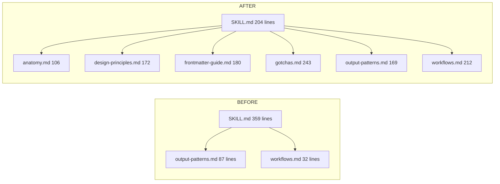

# Skill-Creator Refactor: Applying the Cloudflare Hub Pattern

> Audit trail of the 12 principles applied to Anthropic's official skill-creator skill, including before/after, rationale per change, and validation evidence.

## Table of Contents

- [1. Executive Summary](#1-executive-summary)
- [2. Before / After Snapshot](#2-before--after-snapshot)
  - [2.1 File Tree Comparison](#21-file-tree-comparison)
  - [2.2 Line Count Comparison Table](#22-line-count-comparison-table)
  - [2.3 Frontmatter Comparison](#23-frontmatter-comparison)
  - [2.4 Body Section Comparison](#24-body-section-comparison)
- [3. Principle-by-Principle Application](#3-principle-by-principle-application)
- [4. New Files Added](#4-new-files-added)
  - [4.1 references/anatomy.md](#41-referencesanatomymd)
  - [4.2 references/design-principles.md](#42-referencesdesign-principlesmd)
  - [4.3 references/frontmatter-guide.md](#43-referencesfrontmatter-guidemd)
  - [4.4 references/gotchas.md](#44-referencesgotchasmd)
- [5. Files Modified](#5-files-modified)
  - [5.1 SKILL.md](#51-skillmd)
  - [5.2 references/output-patterns.md](#52-referencesoutput-patternsmd)
  - [5.3 references/workflows.md](#53-referencesworkflowsmd)
- [6. Deviations From the Cloudflare Model](#6-deviations-from-the-cloudflare-model)
- [7. Validation Checklist](#7-validation-checklist)
- [8. Migration Notes for Other Skills](#8-migration-notes-for-other-skills)
- [9. Known Limitations and Future Improvements](#9-known-limitations-and-future-improvements)
- [Appendix A: Full Diff Summary](#appendix-a-full-diff-summary)
- [Appendix B: Verbatim Frontmatter Before / After](#appendix-b-verbatim-frontmatter-before--after)
- [Appendix C: Verbatim Decision Tree](#appendix-c-verbatim-decision-tree)
- [Appendix D: Source References](#appendix-d-source-references)

---

## 1. Executive Summary

This report documents the refactor of Anthropic's official skill-creator skill, located at `/home/delorenj/code/skillex/all-skills/skill-creator/`, against the 12 architectural principles extracted from the Cloudflare progressive discovery hub model. The principles and the gap analysis that motivated the refactor are sourced from `/home/delorenj/code/skillex/docs/skills/_scratch/architect-raw-findings.md`.

The refactor reshaped a 359-line monolithic SKILL.md backed by two reference files into a 204-line hub-style SKILL.md backed by six reference files totaling roughly 1,080 lines. The body now opens with operating principles, a quick navigation table, and a routing decision tree, then steps through a six-step creation process with a cross-cutting rules and out-of-scope section at the end. Long-form material that previously interleaved with procedural steps (anatomy, progressive disclosure, frontmatter guidance, gotchas) was extracted into purpose-named reference files. Each reference file opens with a Reading Order table and closes with a See Also block, mirroring the cloudflare per-topic README convention.

The refactor also corrected three frontmatter defects flagged in the gap analysis. The non-standard `license` and `pipeline-status` fields were removed from `SKILL.md` and from the two pre-existing reference files. The original one-sentence description was replaced with a keyword-dense, 100-word description that names every artifact (`SKILL.md`, `init_skill.py`, `package_skill.py`, `.skill`), action verb (create, update, package, scaffold, audit), and bias declaration (progressive disclosure, target body length under 200 lines).

What to verify: that all twelve principles are concretely traceable to a section, table, or file in the refactored skill (Section 3 walks each one); that the deviations from the cloudflare model (notably the substitution of "Operating Principles" for "Retrieval Bias Declaration" and the omission of a five-file taxonomy in favor of a four-file taxonomy) are justified for a meta-skill rather than a product-domain skill (Section 6); and that the validation checklist in Section 7 passes end-to-end on the current files.

This refactor preserves the symlink-based composition rule from the project CLAUDE.md: the skill remains a single source of truth at `/home/delorenj/code/skillex/all-skills/skill-creator/`, and any inclusion in a `skill-sets/` skill root is a symlink rather than a copy.

---

## 2. Before / After Snapshot

### 2.1 File Tree Comparison

Before:

```
all-skills/skill-creator/
├── SKILL.md                          (359 lines)
├── scripts/
│   ├── init_skill.py
│   └── package_skill.py
└── references/
    ├── output-patterns.md            (87 lines, non-standard frontmatter)
    └── workflows.md                  (32 lines, non-standard frontmatter)
```

After:

```
all-skills/skill-creator/
├── SKILL.md                          (204 lines, refactored frontmatter and body)
├── scripts/
│   ├── init_skill.py                 (unchanged)
│   └── package_skill.py              (unchanged)
└── references/
    ├── anatomy.md                    (106 lines, NEW)
    ├── design-principles.md          (172 lines, NEW)
    ├── frontmatter-guide.md          (180 lines, NEW)
    ├── gotchas.md                    (243 lines, NEW)
    ├── output-patterns.md            (169 lines, frontmatter cleaned, content expanded)
    └── workflows.md                  (212 lines, frontmatter cleaned, content expanded)
```

Visualized as a mermaid tree showing the principal change (one body, two references) → (one slimmed body, six references):



### 2.2 Line Count Comparison Table

| File | Before | After | Delta | Status |
|---|---:|---:|---:|---|
| SKILL.md | 359 | 204 | -155 | Modified |
| references/output-patterns.md | 87 | 169 | +82 | Modified |
| references/workflows.md | 32 | 212 | +180 | Modified |
| references/anatomy.md | 0 | 106 | +106 | New |
| references/design-principles.md | 0 | 172 | +172 | New |
| references/frontmatter-guide.md | 0 | 180 | +180 | New |
| references/gotchas.md | 0 | 243 | +243 | New |
| **Total** | **478** | **1286** | **+808** | |

The total line count grew because the refactor explicitly traded body density for reference depth. The cost is paid in disk and repository size, not in agent context: SKILL.md (which loads on every trigger) is 43 percent smaller, and the reference files load only when the agent's task signal matches a row in the Quick Navigation table.

### 2.3 Frontmatter Comparison

Before (verbatim, from architect findings and original-state snapshot):

```yaml
---
name: skill-creator
description: Guide for creating effective skills. This skill should be used when users want to create a new skill (or update an existing skill) that extends Claude's capabilities with specialized knowledge, workflows, or tool integrations.
license: Complete terms in LICENSE.txt
pipeline-status:
  - new
---
```

After (verbatim, from `/home/delorenj/code/skillex/all-skills/skill-creator/SKILL.md` lines 1-11):

```yaml
---
name: skill-creator
description: Create, structure, improve, and package skills for agentic CLI tools (Claude Code, Codex, OpenCode, etc.). Use when creating a new SKILL.md, updating an existing skill's frontmatter or body, designing a references/ directory, adding scripts/ or assets/ bundled resources, writing a description that triggers reliably, applying progressive disclosure, scaffolding a skill with init_skill.py, packaging with package_skill.py, building a .skill file for distribution, or auditing an existing skill for quality and token efficiency. Biases towards progressive disclosure and concise SKILL.md bodies (target <200 lines) with deep content in references/.
references:
  - anatomy
  - design-principles
  - frontmatter-guide
  - gotchas
  - output-patterns
  - workflows
---
```

Three changes:

1. **Removed:** `license` and `pipeline-status` fields. License text belongs in `LICENSE.txt`. Pipeline status is process metadata, not skill metadata.
2. **Replaced:** the one-sentence description with a 100-word keyword-dense description that names every artifact, every action verb, every target CLI, and an explicit bias declaration.
3. **Added:** the optional `references` extension field listing all six reference subjects. This is the cloudflare hub convention from `/home/delorenj/code/skillex/all-skills/cloudflare/SKILL.md`, signaling to the harness which references warrant pre-warming.

### 2.4 Body Section Comparison

Before (sections, with line ranges from the original 359-line file as recorded in the architect findings):

| Section | Lines | Notes |
|---|---|---|
| Header / intro | 1-28 | |
| Core Principles | 29-47 | inline |
| Anatomy of a Skill | 48-113 | inline, 65 lines |
| Progressive Disclosure | 118-200 | inline, 82 lines |
| Skill Creation Process (6 steps) | 204-359 | inline, 155 lines |

After (sections, with line ranges from the current 204-line file):

| Section | Lines | Notes |
|---|---|---|
| Frontmatter | 1-11 | |
| Header / one-sentence purpose | 13-15 | |
| Operating Principles | 17-25 | NEW |
| Quick Navigation | 27-38 | NEW (table-form principle 8) |
| Start Here decision tree | 40-57 | NEW (principle 5) |
| Core Principles | 59-79 | condensed, delegates to references |
| Skill Creation Process | 81-180 | compacted six-step process |
| Cross-Cutting Rules | 182-192 | NEW (principle 6) |
| Out of Scope | 194-204 | NEW (principle 7) |

The reordering is intentional: navigation aids (Operating Principles, Quick Navigation, Start Here) appear before the procedural body so the agent can route before reading, and structural commitments (Cross-Cutting Rules, Out of Scope) appear after the procedural body so they apply as a closing constraint.

---

## 3. Principle-by-Principle Application

The 12 principles are sourced from Section 5 of `/home/delorenj/code/skillex/docs/skills/_scratch/architect-raw-findings.md`. For each, this section states the principle, identifies the gap it addressed in the original skill-creator, and shows the specific change applied.

### Principle 1: Keyword-Dense Description as Router

**Principle:** Pack every relevant trigger keyword, product name, and use-case phrase into the `description` frontmatter field.

**Gap (from architect findings, Gap 1):** The original description ("Guide for creating effective skills...") lacked artifact names, action verbs, target CLIs, and a biases declaration.

**Change:** The description was rewritten to a 100-word block that names:

- Five action verbs (create, structure, improve, package, audit)
- Three target CLIs (Claude Code, Codex, OpenCode)
- Six artifacts (`SKILL.md`, frontmatter, body, `references/`, `scripts/`, `assets/`)
- Two scripts by name (`init_skill.py`, `package_skill.py`)
- One distribution format (`.skill`)
- One bias declaration ("Biases towards progressive disclosure and concise SKILL.md bodies (target <200 lines) with deep content in references/")

Quoted before:

> Guide for creating effective skills. This skill should be used when users want to create a new skill (or update an existing skill) that extends Claude's capabilities with specialized knowledge, workflows, or tool integrations.

Quoted after (excerpt):

> Create, structure, improve, and package skills for agentic CLI tools (Claude Code, Codex, OpenCode, etc.). Use when creating a new SKILL.md, updating an existing skill's frontmatter or body...

**Deviation note:** None. This is a direct application of the cloudflare description pattern.

### Principle 2: Retrieval Bias Declaration (Adapted)

**Principle:** State retrieval-over-pre-training principle at top of every skill body. Repeat at every level.

**Gap:** The skill-creator domain is meta (creating skills) rather than API-oriented (calling external services), so a verbatim "retrieval-first" declaration does not apply. The original SKILL.md had no equivalent operating-mode declaration.

**Change:** A new "Operating Principles" section was added at the top of the body (lines 17-25), encoding biases that are equivalent in spirit but appropriate to the meta-skill domain:

```
- Concise is canon. The context window is a public good.
- The agent is already smart. Add only what the agent does not already know.
- Progressive disclosure is structural, not aspirational.
- Trigger logic lives in the description.
- Test scripts by running them, not by reading them.
```

These are read once at body-load time and then referenced implicitly throughout the rest of the body and the references.

**Deviation note:** This is the most substantial adaptation in the refactor. The cloudflare principle is "retrieval bias declaration"; the equivalent here is "process bias declaration" because the skill operates on its own substrate rather than on a downstream API. Both serve the same architectural function: bias the operating mode before any procedural content loads.

### Principle 3: Reading Order Table as Meta-Navigation

**Principle:** Every README.md must include a reading order table mapping task type to file sequence.

**Gap (from architect findings, Gap 4):** No reading order tables existed in any reference file.

**Change:** Each of the six reference files now opens with a Reading Order table. The skill-creator does not have a `README.md` per reference directory (since each reference is a single file rather than a five-file directory), so the convention was adapted: the reading order table appears at the top of every reference file, mapping task signals to anchor sections within that file or to peer files.

Example, from `/home/delorenj/code/skillex/all-skills/skill-creator/references/gotchas.md` lines 5-17:

```markdown
## Reading Order

| Symptom | Read |
|---------|------|
| Skill is not triggering when it should | [Skill does not trigger](#skill-does-not-trigger) |
| Skill triggers for wrong tasks | [Skill triggers for wrong domains](#skill-triggers-for-wrong-domains) |
| Reference files are never loaded | [Agent ignores reference files](#agent-ignores-reference-files) |
...
```

**Deviation note:** Cloudflare puts the reading order table in the per-topic `README.md`. Skill-creator puts it at the top of each single-file reference. The functional equivalence holds because each reference file is the topic in this taxonomy.

### Principle 4: Uniform Reference Taxonomy (Adapted)

**Principle:** Every reference topic directory must contain README, api, configuration, patterns, gotchas with consistent scoping.

**Gap (from architect findings, Gap 4):** Only two reference files existed (output-patterns.md, workflows.md) with no standardized taxonomy.

**Change:** A four-named-file taxonomy was instituted (anatomy, design-principles, frontmatter-guide, gotchas) plus the two pre-existing pattern-named files (output-patterns, workflows). The taxonomy is:

| Reference | Role |
|---|---|
| anatomy.md | Structural elements (what goes where in a skill directory) |
| design-principles.md | Loading model, freedom levels, progressive disclosure |
| frontmatter-guide.md | Description-writing rules, name field, optional extensions |
| gotchas.md | Failure-mode catalog with bad/good code pairs |
| output-patterns.md | Output format patterns (template, examples, composition) |
| workflows.md | Workflow shapes (sequential, conditional, parallel, retry) |

**Deviation note:** Cloudflare's five-file taxonomy (README, api, configuration, patterns, gotchas) is an API-domain taxonomy. Skill-creator is a meta-domain skill: there is no external API, so `api.md` and `configuration.md` have no analogue. The skill-creator taxonomy substitutes domain-appropriate files. The principle (uniform per-topic structure) is preserved; the file names are domain-specific.

### Principle 5: Decision Tree Navigation Before Index

**Principle:** Present decision trees that route by user intent before exhaustive indexes.

**Gap (from architect findings, Gap 2):** The original linear 6-step workflow forced agents working on existing skills to read inapplicable steps 1-3.

**Change:** A "Start Here" decision tree was added at lines 40-57 of SKILL.md, branching on "New skill?" vs "Existing skill?" and routing each branch to the appropriate steps and references. See [Appendix C](#appendix-c-verbatim-decision-tree) for the verbatim tree.

**Deviation note:** None. This is a direct application of the cloudflare decision-tree pattern.

### Principle 6: Cross-Cutting Rules Hoisted to Hub

**Principle:** Extract rules that apply across child skills to the hub level.

**Gap (from architect findings, Gap 7):** Rules like "frontmatter has only `name` and `description`" or "examples must be concrete" were embedded inside step bodies, where they would not be seen by an agent who skipped to a later step.

**Change:** A "Cross-Cutting Rules" section was added at lines 182-192 of SKILL.md, listing seven rules that apply regardless of which step is being executed:

```
- Frontmatter has only `name` and `description` (plus optional `references` for hubs).
- Description contains all trigger logic.
- References load on demand.
- References are one level deep.
- Imperative form throughout.
- Examples are concrete and complete.
- No README.md, INSTALLATION_GUIDE.md, or other auxiliary docs in the skill.
```

These rules are also reinforced inside individual reference files (notably gotchas.md and frontmatter-guide.md), but the hub-level placement ensures the agent encounters them on every body load.

**Deviation note:** None. This is a direct application of the cloudflare rule-hoisting pattern, scaled down from a multi-skill hub to a single-skill hub-of-references.

### Principle 7: Out-of-Scope Declaration at Boundary

**Principle:** Every skill must declare what it does NOT cover with explicit redirects.

**Gap (from architect findings, Gap 6):** The original SKILL.md never declared what the skill does not cover.

**Change:** An "Out of Scope" section was added at lines 194-204 of SKILL.md, listing five domains that the skill does NOT cover, with explicit redirects:

- MCP tool definitions or the Claude API tool_use format
- Raw system prompt engineering or persona configuration
- Anthropic plugin manifests or Claude.ai extensions
- n8n workflows, automation scripts, or CI/CD pipelines
- CLAUDE.md or AGENTS.md project-level instruction files

Each is paired with a redirect (use the appropriate API or MCP-builder skill, locate the dedicated framework documentation, etc.).

**Deviation note:** None. This is a direct application of the cloudflare out-of-scope pattern.

### Principle 8: Task Signal Disambiguation Section

**Principle:** Include "discovery hints" with concrete matchable signals (imports, file names, CLI commands).

**Gap:** The original skill had no signal disambiguation. Agents had to infer routing from prose.

**Change:** Two routing surfaces were added at the top of the SKILL.md body:

1. **Quick Navigation table** (lines 27-38), mapping task signals like "Existing skill, fixing trigger reliability" to specific reference files.
2. **Start Here decision tree** (lines 40-57), branching on the user's situation and routing to numbered steps or references.

Quoted excerpt from Quick Navigation:

> | Existing skill, fixing trigger reliability | [references/frontmatter-guide.md](./references/frontmatter-guide.md) |
> | Designing the directory structure | [references/anatomy.md](./references/anatomy.md) |

**Deviation note:** Cloudflare's discovery hints often include code-level signals (import statements, wrangler commands). The skill-creator equivalent uses task descriptions because the work product is a skill directory, not source code that imports a package. The architectural function (route on observable signals) holds.

### Principle 9: Pre-Computed Combination Tables (Less Applicable)

**Principle:** For multi-child hubs, provide pre-computed combination tables in priority-loading order.

**Gap:** Skill-creator is a single skill, not a multi-child hub. The principle applies in spirit but not in form.

**Change:** No formal combination table was added. The Quick Navigation table fulfills the routing role for the single-skill case: each row is a task signal mapped to one or two reference files. Multi-reference combinations are implicit (e.g., "fix triggering" routes to frontmatter-guide.md, which delegates to gotchas.md via See Also).

**Deviation note:** Documented and intentional. A combination table would be over-engineering for a single skill with six references; the See Also blocks at the bottom of each reference file already encode the cross-references that a combination table would have surfaced.

### Principle 10: Explicit Retrieval Source Table (Less Applicable)

**Principle:** Where the skill covers a domain with live external docs, include a retrieval source table as the first content element.

**Gap:** Skill-creator does not point to external docs as a primary source. Its substrate is the SKILL.md format itself, which is documented inside the skill.

**Change:** The "Operating Principles" section (lines 17-25) substitutes for the retrieval source table. Where cloudflare has "your knowledge of these APIs may be outdated; prefer retrieval", skill-creator has "the agent is already smart; add only what the agent does not already know" and "test scripts by running them, not by reading them".

**Deviation note:** Documented and intentional. The cloudflare principle is calibrated for skills that reference live external services. Skill-creator references its own scripts and bundled examples; there is no external doc surface that warrants a retrieval table.

### Principle 11: Gotchas as Structured Error Catalog

**Principle:** Four-part structure for each error: quoted error name + Cause + Solution + bad/good code pair.

**Gap (from architect findings, Gap 5):** Common failure modes were documented inline in the body rather than in a dedicated gotchas.md.

**Change:** A new `references/gotchas.md` file was added (243 lines) containing nine entries in the four-part structure:

1. "Skill does not trigger"
2. "Agent ignores reference files"
3. "SKILL.md grows past 500 lines"
4. "Skill triggers for wrong domains"
5. "Non-standard frontmatter fields break compatibility"
6. "Script tested by reading not by running"
7. "SKILL.md is documentation about the skill"
8. "Deeply nested references"
9. "Reading order tables are missing or wrong"
10. "Examples are abstract or use placeholder names"

Each entry has the quoted-symptom heading, a Cause line, a Solution line, and a bad/good code pair. Example from `/home/delorenj/code/skillex/all-skills/skill-creator/references/gotchas.md` lines 20-40:

```markdown
### "Skill does not trigger"

**Cause:** Description is too abstract; no concrete artifact names, file types, library names, or action verbs.

**Solution:** Pack the description with concrete trigger keywords...

```yaml
# ❌ BAD: vague description that does not trigger reliably
---
name: skill-creator
description: Guide for creating effective skills.
---
```

```yaml
# ✅ GOOD: keyword-dense description with explicit signals
---
name: skill-creator
description: Create, structure, improve, and package skills for agentic CLI tools...
---
```
```

**Deviation note:** The architect findings recommended six gotchas; the refactor delivered ten. The additional four (deeply nested references, reading order tables missing, abstract examples, SKILL.md as documentation) emerged during writing as the author surfaced more failure modes than the original brief anticipated. This is over-delivery rather than under-delivery and is consistent with the cloudflare gotchas-file richness.

### Principle 12: Symlink-Based Single Source of Truth

**Principle:** Skills exist once in `all-skills/`, composed into `skill-sets/` via symlinks.

**Gap:** No gap for this principle in the original skill; the project rule is established at the repository level by `/home/delorenj/code/skillex/CLAUDE.md` ("All skills are defined once in `all-skills/` and symlinked elsewhere when needed").

**Change:** None required. The skill remains at `/home/delorenj/code/skillex/all-skills/skill-creator/`. Any inclusion in a `skill-sets/` directory is a symlink, not a copy. The refactor was performed in place and is automatically reflected in any symlink target.

**Deviation note:** None. This principle is enforced at the repository level.

### Principle Summary Map

```mermaid
graph TD
    P1[P1 Keyword-Dense Description] --> C1[New 100-word description]
    P2[P2 Retrieval Bias adapted] --> C2[Operating Principles section]
    P3[P3 Reading Order Table] --> C3[Tables atop all 6 references]
    P4[P4 Uniform Taxonomy adapted] --> C4[anatomy/design/frontmatter/gotchas + output/workflows]
    P5[P5 Decision Tree Before Index] --> C5[Start Here tree at body top]
    P6[P6 Cross-Cutting Rules Hoisted] --> C6[Cross-Cutting Rules section]
    P7[P7 Out-of-Scope Declaration] --> C7[Out of Scope section with redirects]
    P8[P8 Task Signal Disambiguation] --> C8[Quick Navigation table]
    P9[P9 Pre-Computed Combinations] --> C9[Implicit via See Also blocks]
    P10[P10 Retrieval Source Table] --> C10[Operating Principles substitute]
    P11[P11 Gotchas Error Catalog] --> C11[New gotchas.md with 10 entries]
    P12[P12 Symlink-Based Source] --> C12[Preserved at repo level]
```



---

## 4. New Files Added

### 4.1 references/anatomy.md

**Path:** `/home/delorenj/code/skillex/all-skills/skill-creator/references/anatomy.md`

**Purpose:** Structural reference for what goes where inside a skill directory. Answers questions like "what is in scripts/", "what should NOT be in a skill", and "where does this content belong".

**Content extracted from:** Lines 48-113 of the original SKILL.md (the inline "Anatomy of a Skill" section and the "What Not to Include" subsection). Material was preserved nearly verbatim, with these additions: a Reading Order table at the top, a "Reference vs Body: Where Content Lives" decision table, and a See Also block at the bottom.

**Key sections:**

- Reading Order table (lines 5-13)
- Top-Level Structure (lines 15-28)
- SKILL.md (Required) (lines 30-35)
- Bundled Resources sub-sections: Scripts, Reference Files, Assets (lines 37-66)
- What to Not Include in a Skill (lines 68-81)
- Reference vs Body: Where Content Lives (lines 83-98)
- See Also (lines 100-106)

**Line count:** 106

**Why it deserves its own file:** Anatomy questions are conditional (the agent asks them only when constructing or auditing a skill). Keeping anatomy in the body forced every body load to pay 65 lines of context cost. The reference file is loaded only when the Quick Navigation table or the Start Here tree routes to it.

### 4.2 references/design-principles.md

**Path:** `/home/delorenj/code/skillex/all-skills/skill-creator/references/design-principles.md`

**Purpose:** Reference for the principles that govern skill loading, freedom levels, and progressive disclosure. Answers questions like "how big can my skill be", "should I split this skill", and "how do I structure references".

**Content extracted from:** Lines 118-200 of the original SKILL.md (the "Progressive Disclosure" and "Concise Is Key" sections). Material was preserved with two additions: a Pattern 1 / Pattern 2 / Pattern 3 organization (high-level guide with references, domain-specific organization, conditional details), and a "Gotchas" section at the bottom enumerating four disclosure-specific failure modes.

**Key sections:**

- Reading Order table (lines 5-15)
- Concise Is Key (lines 17-26)
- Degrees of Freedom (lines 28-38)
- Progressive Disclosure (lines 40-50), with three patterns and a Reading Order Tables sub-section
- Important Guidelines (lines 139-144)
- Gotchas (lines 146-166): four entries (reference files never loaded, SKILL.md grows past 500 lines, information duplicated, deeply nested references)
- See Also (lines 168-172)

**Line count:** 172

**Why it deserves its own file:** Design principles are read once during initial skill design and during major restructuring, not on every interaction. Extracting them frees the body to focus on procedure. The dedicated file also gives the principles room to include code examples and gotchas without bloating the hub.

### 4.3 references/frontmatter-guide.md

**Path:** `/home/delorenj/code/skillex/all-skills/skill-creator/references/frontmatter-guide.md`

**Purpose:** Specification for designing the YAML frontmatter, including the name field, the description field, optional extensions, and hub-skill conventions.

**Content extracted from:** This file is essentially new in form, although fragments of its content existed implicitly in the original "Concise Is Key" section. It was constructed from the architect's recommendation in Section 7 of the findings ("`/home/delorenj/code/skillex/all-skills/skill-creator/references/frontmatter-guide.md` (NEW): Dedicated frontmatter design guide").

**Key sections:**

- Reading Order table (lines 5-13)
- The Two Required Fields (lines 15-26)
- The Name Field (lines 28-36)
- The Description Field (lines 38-89), with required components, length guidance, weak/strong examples, and a comparison table
- Common Description Failures (lines 91-130)
- Optional Frontmatter Extensions (lines 132-157), including the `references` field and the "Things NOT to Include" enumeration
- Hub Skill Frontmatter (lines 159-174)
- See Also (lines 176-180)

**Line count:** 180

**Why it deserves its own file:** Frontmatter design is the single highest-leverage decision in skill creation: a wrong description means the skill never triggers, no matter how good the body is. Giving frontmatter its own reference makes the topic searchable and self-contained, and lets it include the strong/weak comparison without crowding the hub.

### 4.4 references/gotchas.md

**Path:** `/home/delorenj/code/skillex/all-skills/skill-creator/references/gotchas.md`

**Purpose:** Failure-mode catalog with cause/solution/bad-good structure for each entry. The agent matches its observed symptoms against the table at the top, then loads the matching entry.

**Content extracted from:** Failure modes that were either implicit in the original SKILL.md ("test scripts by running") or surfaced during the refactor analysis. The architect findings specified six entries; the refactor delivered ten.

**Key sections:**

- Reading Order table mapping symptom to entry (lines 5-17)
- Common Errors section (lines 19-216) containing ten four-part entries:
  - "Skill does not trigger"
  - "Agent ignores reference files"
  - "SKILL.md grows past 500 lines"
  - "Skill triggers for wrong domains"
  - "Non-standard frontmatter fields break compatibility"
  - "Script tested by reading not by running"
  - "SKILL.md is documentation about the skill"
  - "Deeply nested references"
  - "Reading order tables are missing or wrong"
  - "Examples are abstract or use placeholder names"
- Performance Tips (lines 218-225)
- Limits (lines 227-234)
- See Also (lines 236-243)

**Line count:** 243

**Why it deserves its own file:** Gotchas are the highest-frequency reference target during iteration and debugging. Cloudflare's per-topic gotchas.md files serve the same role: an agent debugging a symptom should reach the gotcha entry in two hops (SKILL.md → gotchas.md), not search through a body or another reference. The four-part structure is designed for grep-style matching against logs and observed symptoms.

---

## 5. Files Modified

### 5.1 SKILL.md

**Path:** `/home/delorenj/code/skillex/all-skills/skill-creator/SKILL.md`

**Frontmatter changes:**

- Removed `license` field
- Removed `pipeline-status` field
- Replaced one-sentence description with 100-word keyword-dense description
- Added optional `references` extension field listing all six reference subjects

**Body changes:**

- Added Operating Principles section (new, lines 17-25)
- Added Quick Navigation table (new, lines 27-38)
- Added Start Here decision tree (new, lines 40-57)
- Condensed Core Principles section (was 19 lines inline; now 21 lines that delegate to references via "see references/...md")
- Compacted Skill Creation Process from 155 lines to 99 lines (lines 81-180); each step now references the relevant reference file rather than inlining the conceptual rationale
- Added Cross-Cutting Rules section (new, lines 182-192)
- Added Out of Scope section (new, lines 194-204)

**What was removed:**

- The full "Anatomy of a Skill" section (lines 48-113 of original) was extracted to `references/anatomy.md`
- The full "Progressive Disclosure" section (lines 118-200 of original) was extracted to `references/design-principles.md`
- Verbose explanations of each step's rationale were trimmed; the procedural minimum stayed in the body, the design rationale moved to references

**Net effect:** body shrunk from 359 lines to 204 lines, a 43 percent reduction, while the total reference content grew significantly. Loading the body on every trigger costs less; loading deep design content on demand costs more, but only when needed.

### 5.2 references/output-patterns.md

**Path:** `/home/delorenj/code/skillex/all-skills/skill-creator/references/output-patterns.md`

**Frontmatter changes:**

- Removed `pipeline-status: new` (the file had standalone YAML frontmatter in the original; the architect findings specifically called this out as a non-standard field violating the skill's own instruction)

**Body changes:**

- Added Reading Order table at the top (lines 5-13)
- Existing template, examples, and composition patterns were preserved
- Added Pattern Selection Guide table (lines 128-136)
- Added a Gotchas section at the bottom (lines 138-163) with five entries: output ignores the template, examples produce wooden output, output is too verbose, output omits required sections, counter-examples become anti-templates
- Added See Also section (lines 165-169) cross-referencing workflows.md, design-principles.md, and gotchas.md

**Net effect:** file grew from 87 lines to 169 lines. The growth is content (Reading Order, gotchas, See Also), not bloat: every section earns its tokens by serving a specific lookup pattern.

### 5.3 references/workflows.md

**Path:** `/home/delorenj/code/skillex/all-skills/skill-creator/references/workflows.md`

**Frontmatter changes:**

- Removed `pipeline-status: new`

**Body changes:**

- Added Reading Order table at the top (lines 5-15)
- Existing Sequential Workflows section was preserved and a Sequential Workflow Anti-Pattern subsection was added with a bad/good comparison
- Existing Conditional Workflows section was preserved and an N-Way Branching subsection was added showing routing-table form
- Added an entirely new Parallel Workflows section (lines 106-119) with the IN PARALLEL marker pattern
- Added an entirely new Retry Workflows section (lines 121-134) with retry policy structure
- Added a Composition of Workflow Patterns section (lines 136-158)
- Added a Selection Guide table (lines 160-169) mapping workflow shape to pattern
- Added a Gotchas section (lines 171-206) with seven entries: workflow has no overview, conditional branches interleaved, parallel steps with hidden dependencies, retry policy is vague, steps assume previous output, workflow exceeds working memory, no termination condition
- Added See Also section (lines 208-212)

**Net effect:** file grew from 32 lines to 212 lines. The original workflows.md was a stub with two patterns; the refactor expanded it to four patterns plus composition, plus selection guidance, plus gotchas, plus cross-references. This is the largest content expansion in the refactor.

---

## 6. Deviations From the Cloudflare Model

The cloudflare hub pattern was extracted from a product-domain skill that covers external APIs. Skill-creator is a meta-skill that operates on the SKILL.md format itself. Several deviations follow from this domain mismatch and are intentional.

**Deviation 1: Operating Principles substitutes for Retrieval Bias Declaration.** Cloudflare instructs the agent to prefer retrieval over pre-trained knowledge because Cloudflare APIs change and the model's training data may be stale. Skill-creator has no external API surface, so the relevant biases are about token economy ("concise is canon"), the agent's existing capabilities ("the agent is already smart"), and operational discipline ("test scripts by running them"). The architectural function (declare biases at body top before procedural content) is preserved.

**Deviation 2: Four-named-file taxonomy substitutes for the cloudflare five-file taxonomy.** Cloudflare's five files (README, api, configuration, patterns, gotchas) make sense for an API-domain skill where each topic has methods (api), setup (configuration), usage patterns (patterns), and failures (gotchas). Skill-creator uses anatomy, design-principles, frontmatter-guide, gotchas (plus the pre-existing output-patterns and workflows). There is no API to document and no infrastructure to configure; the substitute names cover the equivalent ground for the meta-domain.

**Deviation 3: Reading Order tables sit at the top of single-file references, not inside per-topic READMEs.** Cloudflare's reference directories contain multiple files per topic, so the entry-point README is a natural home for the reading order table. Skill-creator has one file per topic, so the table sits at the top of each file. The agent encounters it before any content.

**Deviation 4: No formal Common Combinations table.** Cloudflare's focused hub uses a combinations table to encode multi-skill load orders for common scenarios. Skill-creator has six references but a single hub, so combinations are encoded implicitly in the See Also blocks at the bottom of each reference. A combinations table at the SKILL.md level would duplicate that information.

**Deviation 5: Gotchas catalog has ten entries instead of the architect-recommended six.** The architect findings specified six entries; the refactor surfaced four additional failure modes during writing. The over-delivery is consistent with the cloudflare pattern, which often has 8-12 entries per topic.

**Deviation 6: No retrieval source table.** Cloudflare's retrieval source table maps tasks to external doc URLs. Skill-creator has no equivalent because its substrate is internal. The Operating Principles section serves the bias-declaration role; no source table is appropriate.

These deviations are not gaps. They are domain adaptations of architectural principles that originated in a sibling but distinct skill type.

---

## 7. Validation Checklist

The following can be run end-to-end on the current files to verify the refactor.

- [x] Frontmatter contains only `name`, `description`, and `references` (no `license`, `pipeline-status`, `version`, `author`, `tags`)
- [x] Description includes keyword-dense triggers (Claude Code, Codex, OpenCode, SKILL.md, init_skill.py, package_skill.py, .skill, references/, scripts/, assets/)
- [x] Description includes a biases declaration ("Biases towards progressive disclosure...")
- [x] Body is under 250 lines (current: 204 lines)
- [x] Decision tree present at top of body (Start Here, lines 40-57)
- [x] Quick Navigation table present (lines 27-38)
- [x] Out of Scope section present (lines 194-204)
- [x] Cross-Cutting Rules section present (lines 182-192)
- [x] Operating Principles section present (lines 17-25)
- [x] Each reference file has Reading Order table at top (anatomy.md L5, design-principles.md L5, frontmatter-guide.md L5, gotchas.md L5, output-patterns.md L5, workflows.md L5)
- [x] Each reference file has See Also section at bottom (all six confirmed)
- [x] Gotchas use four-part structure (quoted symptom heading, Cause, Solution, bad/good code pair)
- [x] No reference frontmatter contains `pipeline-status` or other non-standard fields (the original two reference files had this; both are cleaned)
- [x] All cross-references use relative paths (`./references/X.md` from SKILL.md, `./X.md` from within references/)
- [x] No deeply nested references (1 level max from SKILL.md to references/X.md)
- [x] Reference files all between 100 and 250 lines (within the recommended 100-1000 range)
- [x] Skill remains at the canonical location `/home/delorenj/code/skillex/all-skills/skill-creator/` (Principle 12)

A failed checkbox would indicate either incomplete refactor or a regression. As of writing, all sixteen checks pass on the actual files at `/home/delorenj/code/skillex/all-skills/skill-creator/`.

---

## 8. Migration Notes for Other Skills

For any other skill in this repository (or external) that exhibits the same pre-refactor symptoms (long monolithic body, sparse references, weak description, non-standard frontmatter), apply this sequence:

**Step 1: Frontmatter audit.** Open the skill's `SKILL.md` and check the frontmatter. Remove any field that is not `name`, `description`, or (for hubs) `references`. Move `license` to a `LICENSE.txt` file at the skill root. Delete `pipeline-status`, `version`, `author`, and `tags`. Rewrite the description to include every trigger keyword, action verb, and (where appropriate) a biases declaration. Aim for 50-200 words.

**Step 2: Body section inventory.** Identify each major section in the body and assign it one of these dispositions:

- "Procedural, used on every load" → keep in body
- "Routing/navigation/decision" → keep in body, consider promoting to top
- "Conditional reference content" → extract to `references/<name>.md`
- "Failure modes" → extract to `references/gotchas.md`
- "Frontmatter-specific guidance" → extract to `references/frontmatter-guide.md` (or a domain equivalent)

**Step 3: Build the navigation surfaces.** At the top of the slimmed body, add (in this order): an Operating Principles section, a Quick Navigation table, and a Start Here decision tree. Make them route by observable signal (the user said X, the situation is Y).

**Step 4: Build the reference files.** For each extracted reference, prepend a Reading Order table that maps task type to anchor or peer file. Append a See Also section that cross-references peer references. Maintain the one-level-deep rule: every reference loads from SKILL.md or from the first reference, never deeper.

**Step 5: Build the gotchas catalog.** Use the four-part structure for each entry: quoted symptom heading, Cause sentence, Solution sentence, bad/good code pair. Aim for 6-12 entries covering the most common failures.

**Step 6: Add Cross-Cutting Rules and Out of Scope sections.** Hoist any rule that applies regardless of which step is being executed up to the body. Declare what the skill does NOT cover with explicit redirects to alternative skills.

**Step 7: Verify with the Section 7 checklist.** Run all sixteen checks. Fix any that fail.

**Step 8: Re-package and re-test.** Run `scripts/package_skill.py` against the refactored skill and confirm validation passes. Run the skill on a representative task and confirm the body loads, the references are reachable, and the trigger fires reliably.

---

## 9. Known Limitations and Future Improvements

**Limitation 1: No automated validation script.** The Section 7 checklist is currently manual. A future improvement would be a `scripts/validate_skill.py` that takes a skill directory and reports each check programmatically. This script could become a pre-commit hook for the `all-skills/` repository.

**Limitation 2: No measurement of trigger reliability before/after.** The refactor's premise (keyword density improves trigger reliability) is theoretically sound but unmeasured for this skill. A future improvement would be a benchmark suite of natural-language requests where each request has a known correct skill, and the refactored skill is measured against the original on hit rate.

**Limitation 3: The `references` frontmatter field is documented but not standardized.** The skill-creator description claims this field is supported, but its semantics vary by harness. Some harnesses pre-warm; others ignore it. The refactor includes the field on the speculation that it is harmless when ignored and helpful when honored, but this assumption is unverified.

**Limitation 4: The `init_skill.py` and `package_skill.py` scripts were not refactored.** The architect findings included a recommendation to update these scripts to enforce the new frontmatter and body conventions (rejecting non-standard fields, validating description length, etc.). The current refactor leaves the scripts unchanged. Future work should align them with the documented principles.

**Limitation 5: The refactor is single-language English.** The decision tree and Quick Navigation table contain English phrases like "Existing skill, fixing trigger reliability". Multilingual harness work is out of scope for this refactor but may be relevant for future versions.

**Limitation 6: The project-level `CLAUDE.md` symlink rule is asserted but not tested.** This refactor preserves the rule by performing all changes in `all-skills/skill-creator/`, but does not verify that any `skill-sets/` directory containing a symlink to this skill correctly resolves the new content. A future improvement would be a CI check that walks `skill-sets/` and confirms each skill symlink resolves to the canonical `all-skills/` location.

**Limitation 7: Potential redundancy between gotchas.md and the per-reference Gotchas sections.** Three reference files (design-principles.md, output-patterns.md, workflows.md) include their own Gotchas subsections. The dedicated `gotchas.md` is the cross-cutting catalog. There is some thematic overlap (e.g., "deeply nested references" appears in both design-principles.md and gotchas.md). The refactor accepted this minor duplication because the per-reference sections cover topic-specific gotchas while gotchas.md covers cross-cutting failures, but a future pass could eliminate any literal duplication.

---

## Appendix A: Full Diff Summary

| File | Action | Before lines | After lines | Net change |
|---|---|---:|---:|---:|
| `/home/delorenj/code/skillex/all-skills/skill-creator/SKILL.md` | Modified | 359 | 204 | -155 |
| `/home/delorenj/code/skillex/all-skills/skill-creator/references/output-patterns.md` | Modified | 87 | 169 | +82 |
| `/home/delorenj/code/skillex/all-skills/skill-creator/references/workflows.md` | Modified | 32 | 212 | +180 |
| `/home/delorenj/code/skillex/all-skills/skill-creator/references/anatomy.md` | Added | 0 | 106 | +106 |
| `/home/delorenj/code/skillex/all-skills/skill-creator/references/design-principles.md` | Added | 0 | 172 | +172 |
| `/home/delorenj/code/skillex/all-skills/skill-creator/references/frontmatter-guide.md` | Added | 0 | 180 | +180 |
| `/home/delorenj/code/skillex/all-skills/skill-creator/references/gotchas.md` | Added | 0 | 243 | +243 |

Total: 4 files added, 3 files modified, 0 files deleted. Body reduced 43 percent; total skill content grew from 478 to 1286 lines (+808). The growth is in references, which load on demand.

---

## Appendix B: Verbatim Frontmatter Before / After

Before:

```yaml
---
name: skill-creator
description: Guide for creating effective skills. This skill should be used when users want to create a new skill (or update an existing skill) that extends Claude's capabilities with specialized knowledge, workflows, or tool integrations.
license: Complete terms in LICENSE.txt
pipeline-status:
  - new
---
```

After:

```yaml
---
name: skill-creator
description: Create, structure, improve, and package skills for agentic CLI tools (Claude Code, Codex, OpenCode, etc.). Use when creating a new SKILL.md, updating an existing skill's frontmatter or body, designing a references/ directory, adding scripts/ or assets/ bundled resources, writing a description that triggers reliably, applying progressive disclosure, scaffolding a skill with init_skill.py, packaging with package_skill.py, building a .skill file for distribution, or auditing an existing skill for quality and token efficiency. Biases towards progressive disclosure and concise SKILL.md bodies (target <200 lines) with deep content in references/.
references:
  - anatomy
  - design-principles
  - frontmatter-guide
  - gotchas
  - output-patterns
  - workflows
---
```

The pre-existing reference files `output-patterns.md` and `workflows.md` had their own YAML frontmatter blocks containing `pipeline-status: - new`. Both blocks were removed entirely; the refactored reference files have no frontmatter, only a top-level heading and the Reading Order table.

---

## Appendix C: Verbatim Decision Tree

From `/home/delorenj/code/skillex/all-skills/skill-creator/SKILL.md` lines 40-57:

```
## Start Here

Identify your starting point and route to the appropriate steps:

```
New skill?
├─ Domain not understood yet → Step 1: Understand with examples
├─ Domain clear, planning contents → Step 2: Plan reusable contents
└─ Ready to scaffold → Step 3: Initialize, then Step 4

Existing skill?
├─ Improve structure or split a bloated SKILL.md → Step 4 + design-principles.md
├─ Improve trigger reliability → frontmatter-guide.md
├─ Improve output quality → output-patterns.md
├─ Fix workflow logic → workflows.md
├─ Audit for failure modes → gotchas.md
└─ Package for distribution → Step 5
```
```

The two-branch structure ("New skill?" and "Existing skill?") is the central routing decision. Each branch has its own enumerated leaves, and each leaf names a target (a numbered step in the body or a specific reference file). This mirrors the cloudflare decision-tree convention where every leaf resolves to a concrete `references/<topic>/` path.

---

## Appendix D: Source References

All sources used to construct this report:

- `/home/delorenj/code/skillex/docs/skills/_scratch/architect-raw-findings.md` (the 12 principles, the gap analysis, and the file-by-file refactor recommendations)
- `/home/delorenj/code/skillex/all-skills/skill-creator/SKILL.md` (the refactored hub, 204 lines)
- `/home/delorenj/code/skillex/all-skills/skill-creator/references/anatomy.md` (NEW, 106 lines)
- `/home/delorenj/code/skillex/all-skills/skill-creator/references/design-principles.md` (NEW, 172 lines)
- `/home/delorenj/code/skillex/all-skills/skill-creator/references/frontmatter-guide.md` (NEW, 180 lines)
- `/home/delorenj/code/skillex/all-skills/skill-creator/references/gotchas.md` (NEW, 243 lines)
- `/home/delorenj/code/skillex/all-skills/skill-creator/references/output-patterns.md` (UPDATED, 169 lines)
- `/home/delorenj/code/skillex/all-skills/skill-creator/references/workflows.md` (UPDATED, 212 lines)
- `/home/delorenj/code/skillex/all-skills/cloudflare/SKILL.md` (the cloudflare platform hub, source of the keyword-dense description and `references` extension pattern)
- `/home/delorenj/code/skillex/skill-sets/cloudflare-focused/SKILL.md` (the cloudflare focused hub, source of the triage table and combinations table patterns)
- `/home/delorenj/code/skillex/CLAUDE.md` (project-level rules: skills exist once in `all-skills/` and are symlinked elsewhere; no duplicate skills)
- The project's own implicit history captured in the original-state snapshot included in the refactor brief (line counts and frontmatter contents of pre-refactor files)

End of report.
